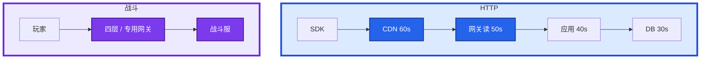
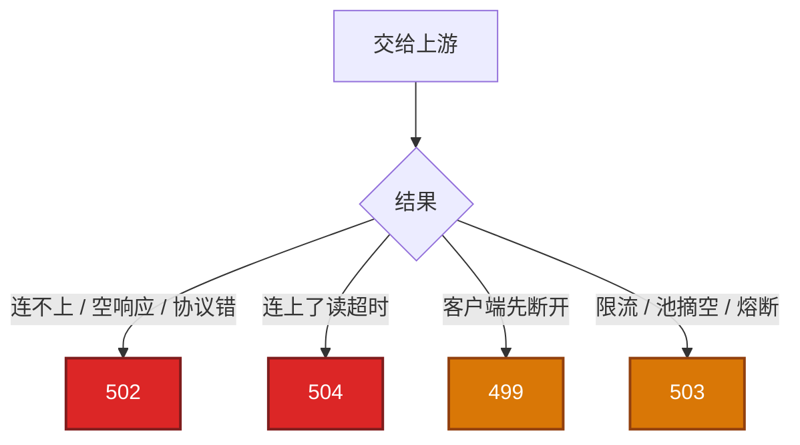
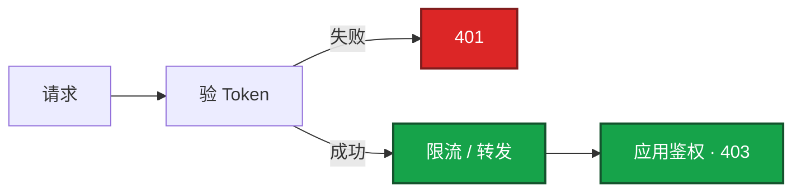
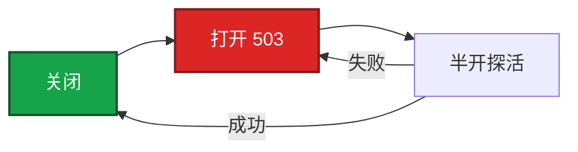
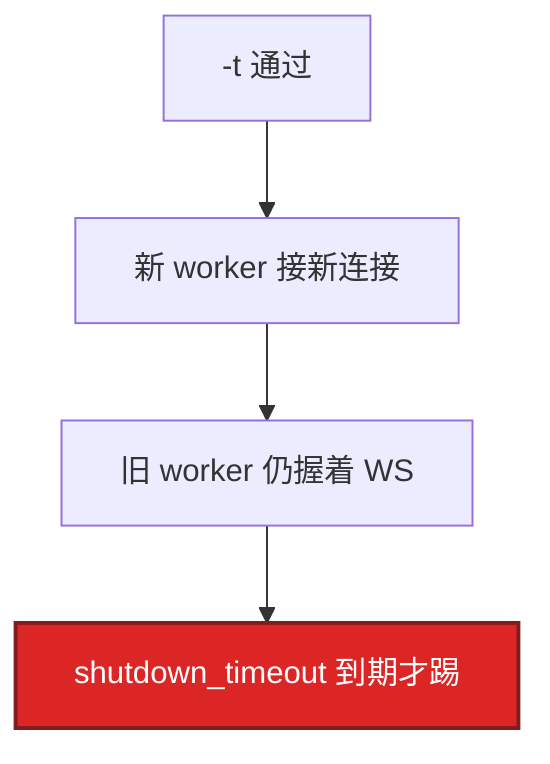

# 04｜接入网关 · 练习题

先对照 [知识点](知识点.md) **本章主线** 自己口述，再对答案。每题标了覆盖范围：

| 标记 | 含义 |
|------|------|
| **核心** | 不懂整章就没建立起来 |
| **必会** | 值班和面试都要能讲 |
| **常用** | 线上会反复碰到 |
| **常考** | 白板和追问的高频口径 |

## 本题目录

- [Q1 是什么、画架构、超时链](#q1)
- [Q2 502 / 504 / 499 / 503](#q2)
- [Q3 日志拆耗时](#q3)
- [Q4 keepalive 与被动探活](#q4)
- [Q5 鉴权](#q5)
- [Q6 限流](#q6)
- [Q7 熔断与灰度](#q7)
- [Q8 APISIX / etcd / Envoy](#q8)
- [Q9 reload、长连接、USR2](#q9)
- [Q10 排障分流](#q10)
- [合上书](#合上书)

---

## Q1

**★★★★★｜接入网关是什么？超时链怎么排？画架构**

**覆盖**：核心 · 必会 · 常考
**对应**：知识点 §1、§3.1

### 场景

白板：「画玩家进商城和进战斗的两条路。」有人把战斗 WebSocket 画进和商城同一个 `proxy_read_timeout 60s`。CDN 30s、网关读 60s、应用 40s、MySQL 50s，用户已经看到错误页。

### 完整解答

**一句话**：网关是七层/专用长连接入口；超时链越往外越长（60→50→40→30），战斗 WS 不能挂默认 60s HTTP。

网关是玩家进业务的 **七层或专用长连接入口**。云 SLB 扛连接；网关做路由 / 鉴权 / 限流 / 熔断 / 灰度；应用才是业务。大厅 HTTP 走七层，战斗长连接走四层或专用网关。



口令：**越往外超时越长**（60 → 50 → 40 → 30），按 P99×2～3。外层必须能等到内层返回错误。反了：CDN 30s < 网关 60s → 玩家先走，网关 **499**，应用白跑。

`proxy_connect_timeout` 短（几秒）；`proxy_read_timeout` 等响应，504 主因。长轮询 / WS 单独 location。调大超时是止血，治本是后端。Ingress 看注解渲染值。SDK deadline 也要算进链。

### 再追问

- 应用 50ms、网关 60s、Redis P99 80ms？——入口很少 504；应用把超时当 miss 打 DB。链要对齐每一跳的**客户端**。
- 网关超时越短越好？——短到能保护 worker，但要大于正常 P99 并留 2～3 倍。无脑 1s 会把偶发 GC 变成 504 风暴。
- 超时当 miss？——和 03 同一类时间预算错误。

---

## Q2

**★★★★★｜502 和 504 怎么区分？499 / 503 呢？**

**覆盖**：核心 · 必会 · 常考
**对应**：知识点 §3.2

### 场景

活动开始入口 5xx 上涨。有人重启逻辑服，有人调大 `proxy_read_timeout`。error.log 里既有 `Connection refused` 也有 `upstream timed out`，还有一批 499，以及 `limit_req` 的 503。

### 完整解答

**一句话**：502 是拿不到合法上游响应，504 是连上了读超时，499 是客户端先走，503 是限流或池空。

先画谁没等到谁，再对 error.log 关键字。不要一上来重启。



502：没拿到合法上游 HTTP 响应。先直连后端端口，看是否刚发版、探针杀了进程、Endpoints 空。  
504：连上了，读超时。对后端 P99 和 `proxy_read_timeout`；治本是后端。  
499：客户端先断开。常是 SLB / 浏览器 / SDK 更短，或用户撤请求。不是后端没启动。  
503：限流或 `no live upstreams`，不要当成 502 去重启后端。413 才是 `client_max_body_size`。

观测：`$upstream_response_time`、`$upstream_addr`、`$upstream_status`。止血：摘坏节点、回滚发布、临时加长 timeout（要设截止）。

### 再追问

- 499 呢？——客户端先走。先对更上游的 deadline，再查网关。
- K8s 滚动间歇 502？——新 Pod 未 Ready、Endpoints 空、SLB 探活源 IP 没放行。连不上不是 504，不要先调 timeout。
- 证书链丢一级，部分玩家「随机 502」？——不同客户端校验严格程度不同；到期单独 30 天告警，不能用 5xx 曲线当证书告警。`ssl_protocols` 只留 1.2/1.3。

---

## Q3

**★★★★☆｜怎么用日志判断慢在网关还是后端？**

**覆盖**：必会 · 常用
**对应**：知识点 §6

### 场景

P99 到 2s。有人说 Nginx 不行该换 APISIX。access 没拆 upstream 耗时。

### 完整解答

**一句话**：用 request_time 和 upstream_response_time 拆耗时；两者都大是后端，connect 大是建连问题。

`$request_time` 总耗时，`$upstream_response_time` 上游。必须自定义 `log_format`（写法 02-23），APISIX / Envoy 看各自的 latency 拆分，逻辑一样。

```
  request 大、upstream 小  →  客户端 / TLS / 网关自身
  两者都大                →  后端
  connect_time 大         →  建连，502 近亲
  upstream_addr 总同一台  →  粘连或没摘坏节点
```

不要只看入口 5xx。`$status` 和 `$upstream_status` 不一致，可能是网关自己改写（限流 503、超时 504）。卡住先看 error.log 是 `timed out` 还是 `refused`。

### 再追问

upstream 总打同一台坏节点？——被动检查没摘，或 keepalive 粘死。结合健康检查看，不要先重启全集群。

---

## Q4

**★★★★☆｜对上游 keepalive 为什么必开？被动健康检查的坑？**

**覆盖**：必会 · 常用 · 常考
**对应**：知识点 §5、§2

### 场景

网关 QPS 上去之后，后端 `TIME_WAIT` 爆炸、短暂端口耗尽。另一环境 `max_fails=1`，一次抖动后 `no live upstreams`，全站 502。

### 完整解答

**一句话**：对上游 keepalive 必开防 TIME_WAIT；被动 max_fails 过严会雪崩摘空成 no live upstreams。

默认对上游短连接，高 QPS 打满后端 TIME_WAIT 和端口。`keepalive` + HTTP/1.1 + `Connection ""`。玩家到战斗服的长连接是另一件事，不要混。一条反代占 **2 个 fd**，`worker_connections` 要 ≤ `ulimit -n`。

开源 Nginx 只有被动 `max_fails` / `fail_timeout`，真实请求失败才摘，有探伤窗口。过严会雪崩摘空 → `no live upstreams`。主动探活要 Plus / 云 LB / APISIX / Envoy。

keepalive 可能粘在已坏节点上，要和探活、`$upstream_addr` 一起看。

### 再追问

开源 Nginx 健康检查？——只有被动，有探伤期。阈值太小，抖动时 502 从一台扩散成全部。生产用云 LB 主动探活挡一层。

---

## Q5

**★★★★☆｜鉴权挂在网关哪一层？401 和 403？**

**覆盖**：必会 · 常用 · 常考
**对应**：知识点 §3.3

### 场景

有人把客户端传来的 `user_id` 当登录态，限流也按这个字段。GM 入口和玩家商城共用一个 server。追问「网关验签了，应用还要验吗？」

### 完整解答

**一句话**：网关验 Token 失败 401，细粒度权限应用 403；player_id 从登录态取，不信客户端字段。

网关做 **验票**：Token / Session / JWT 签名和过期。失败 **401**，不要打到逻辑服。细粒度权限（能不能改别人的邮件）是应用 **403**。player_id 从登录态取，不要信客户端 user_id，也不要信 XFF 第一段。



GM / Admin：mTLS 或 IP 允许名单，和玩家入口分开。支付回调验 HMAC，失败不要当 502。战斗长连接握手验一次，不要每帧 JWT。APISIX 插件挂路由热更新；Nginx `auth_request` 通常要 reload。

### 再追问

Session 放网关内存？——不要。外置 Redis，网关才能随便摘。Redis 挂了全站 401，要有降级口径。

---

## Q6

**★★★★☆｜限流怎么配才不误伤整服 NAT？503 会不会被当成 502？**

**覆盖**：必会 · 常用 · 常考
**对应**：知识点 §3.4

### 场景

活动接口 `limit_req` 按 `$binary_remote_addr` 100r/s。运营商 NAT 后整服一个 IP，大面积 503。值班按 502 重启了两台逻辑服。握手和心跳算进同一桶。

### 完整解答

**一句话**：NAT 下按 IP 限流会误伤整服；503 是限流不是 502，心跳不要和业务共桶。

`limit_req` 按 IP 在 NAT 下会整片 503。活动接口按账号在应用或网关插件限。`limit_conn` 限并发，防慢请求占满 worker。心跳、握手不要和业务 API 共用一个桶。

超限返回 **503**，要和 502 区分。桶满应立刻 503；写成阻塞等待会占满 worker，后面变成 504。活动宁可 503 降级。多网关要全局限额才上 Redis，不要高峰第一次上。

`no live upstreams` 也是 502/503 一族，那是池摘空，也不是「再重启一次后端」。

### 再追问

限流键用 X-Forwarded-For 第一段？——可伪造。只信任紧邻 SLB 跳。风控不要直接信第一段。必透传 Host / X-Real-IP / XFF / X-Forwarded-Proto，否则日志全是网关 IP。

---

## Q7

**★★★★☆｜熔断和超时、被动摘节点差在哪？灰度一定要换 APISIX 吗？**

**覆盖**：必会 · 常用 · 常考
**对应**：知识点 §3.5、§3.6

### 场景

上游连续失败，网关还在把请求打进去把线程池打满。另有人说「要做灰度必须上 APISIX」。活动整点要把 50% 流量切到新战斗服。

### 完整解答

**一句话**：超时是一次没等完，熔断是连续失败 fail-fast；灰度 Nginx 权重即可，战斗中途不要切房间。

超时 = 这一次没等完。熔断 = 连续失败后 **fail-fast 503**，半开放探活。开源 Nginx 只有被动 `max_fails`，不是完整熔断器。熔断不要套战斗房间（那是迁人，不是 HTTP 半开）。

灰度：Nginx upstream 权重就能切 10%。APISIX 加分是按路由热改规则。按 `uid % 100` 保证同一玩家稳定；Header 给 QA。



活动整点不要切大盘。战斗中途不要按权重把人切到另一房间。回滚 = 权重打回旧上游，比全量 reload 快。

### 再追问

无状态 HTTP 用 ip_hash？——不要绑死。Session 放 Redis。逻辑服有状态是 08，不是网关粘滞能解决的。

---

## Q8

**★★★★★｜APISIX 和 Nginx 本质区别？etcd 挂了会怎样？**

**覆盖**：核心 · 必会 · 常考
**对应**：知识点 §3、§4

### 场景

「APISIX 也是 Nginx 吧，超时题可以按 02-23 答。」etcd 抖动，有人要重启全部 APISIX Pod。追问「你们网格数据面呢？」以及「网关挂了怎么办」。

### 完整解答

**一句话**：APISIX 配置在 etcd watch 进内存，etcd 挂了已有路由仍转，不要重启数据面。

APISIX 配置在 etcd，watch 进进程内存，改路由 / 插件不用 reload。插件链做限流鉴权灰度。数据面仍是 OpenResty。Admin **9180** 只给内网。


etcd 挂了：**已有路由继续转**，Admin 不能改配置。不会因为 etcd 挂了立刻全站 502。etcd 延迟高只是配置生效变慢。此时不要重启 APISIX 进程（内存路由会丢）。etcd 原理见 04-02。

不是一定要上 APISIX。纯反代 Nginx 更简单。超时链、502/504 在两种数据面上是同一套题。

Envoy：网格 / 新网关常用数据面，xDS 热配置 + Filter 链。对比的是「动态控制面 vs Nginx 静态 conf」。

入口：多台 + 云 SLB / Keepalived VIP。大规模四层扛连接、七层做 TLS / 路由。Keepalived 细节见 02-24。

### 再追问

所以一定要上 APISIX？——不必。热配和插件是理由。入口单点：多台 + SLB，Session 外置。

---

## Q9

**★★★★★｜reload 原理？游戏长连接能不能挂在 Nginx HTTP 反代上？**

**覆盖**：核心 · 必会 · 常考
**对应**：知识点 §3.7

### 场景

改个 `proxy_read_timeout` 做 reload。战斗服挂在同一层 Nginx 上，在线玩家掉了一截。内存短时间翻倍。全局读超时 60s，心跳 20s。限流按 IP 100r/s，握手和心跳算进同一桶。

### 完整解答

**一句话**：reload 旧 worker 仍握 WS 内存翻倍；战斗长连接要单独四层或足够长的 read_timeout。

`nginx -t` 通过后 Master 拉起新 worker，旧 worker 处理完再退，短连接几乎无中断。长连接旧 worker 不退，内存翻倍。设 `worker_shutdown_timeout`。禁止 `kill -9`。reload 换配置；**USR2** 换二进制。日志切割 `nginx -s reopen`，不要 `rm` 正在写的 access.log。



大厅 HTTP 可以走七层。战斗 WS / TCP：默认 60s 会踢人；reload 会断线。单独读超时 ≥ 心跳 ×2～3，要 Upgrade / Connection，或走四层。心跳不要进 API 限流桶。这是架构选择，不是调参能消掉的。APISIX 热更新路由不用 reload worker，也不要把战斗塞进同一条七层。

Ingress-nginx 查注解最终渲染的 `proxy_read_timeout`。

### 再追问

reload 和 USR2？——reload 换配置；USR2 换二进制。心跳 20s、读超时 60s 够吗？——一次 GC 超过 60s 仍会踢；按心跳 2～3 倍留，活动期宁可四层。

---

## Q10

**★★★★☆｜给出现象，你先走哪条排障路？**

**覆盖**：必会 · 常用
**对应**：知识点 §7

### 场景

五个工单：① `Connection refused` ② `upstream timed out` ③ 499 暴涨 ④ `limit_req` 503 且有人当 502 重启逻辑服 ⑤ APISIX etcd 抖动有人要重启全部 Pod。同一分钟 499/502/504 都有。

### 完整解答

**一句话**：按 error.log 关键字分流：refused→502，timed out→504，499 对 SDK deadline，503 别重启后端。

| # | 走哪条 | 不要做 |
|---|--------|--------|
| ① | curl 直连、Endpoints、探针、SLB 探活源 IP | 调大 timeout |
| ② | 后端 P99、超时链；止血可临时加长并设截止 | 先重启网关 |
| ③ | SDK / CDN / SLB 是否更短 | 按 502 重启后端 |
| ④ | 按账号限流；NAT；503 ≠ 502 | 重启逻辑服 |
| ⑤ | 已有路由仍转 | 重启 APISIX 数据面 |

现场：时间线 → error.log 关键字 → curl 直连 → Endpoints → access 两列耗时和 `$upstream_addr`。

活动三种码同时有：先限流、停滚动，再按关键字分类。重启网关会再踢一轮长连接。

扩容 / 升级：七层无状态加机器挂 SLB；滚动摘一台升一台；回滚靠上一份 conf 或 APISIX 路由 revision。没有备份 = 没有回滚。

### 再追问

证书能不能用 502 曲线告警？——不能。部分客户端失败不会打满 5xx。fd 打满先加机器？——先对齐 `ulimit` 和 `worker_connections`，一条请求 2 个 fd。

---

## 合上书

- [ ] 能画出 HTTP 与战斗两条入口，以及 60→50→40→30 超时链
- [ ] 能分 499 / 502 / 504 / 503，并说出不要重启逻辑服的几种情况
- [ ] 能用 access 两列判断慢在网关还是后端
- [ ] 能讲 keepalive、被动探活摘空、鉴权 401 vs 403、限流按账号
- [ ] 能区分超时、熔断、灰度权重；战斗不要中途按权重切房间
- [ ] 能说 APISIX etcd 挂了仍转发；reload vs USR2；长连接拆四层
