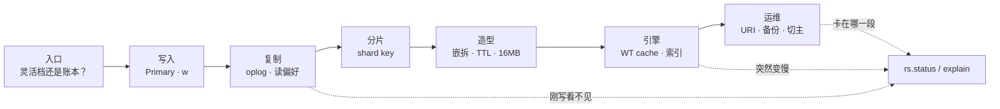
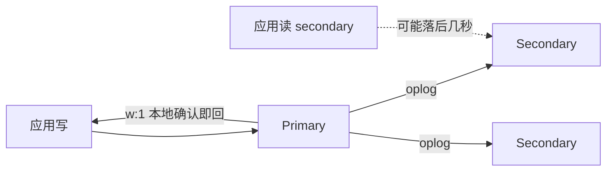
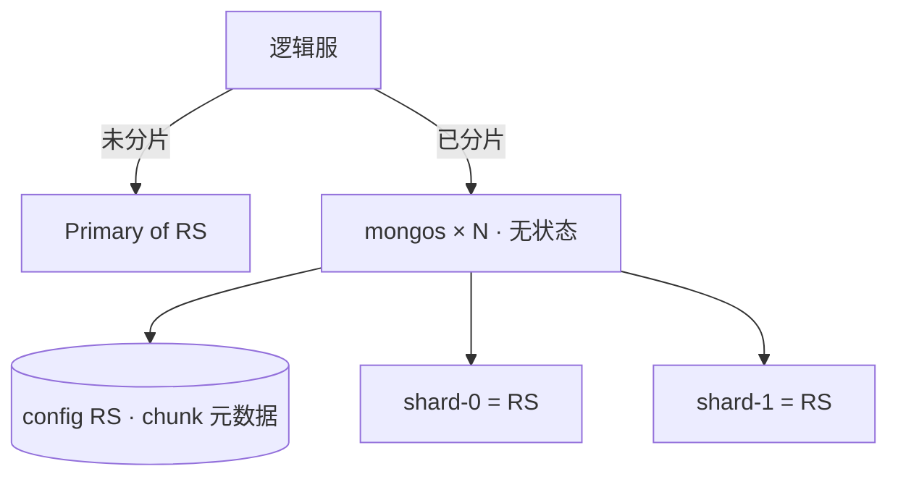
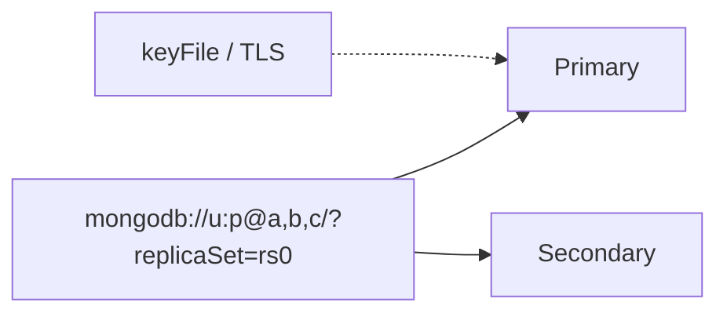
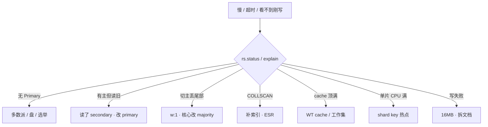

# MongoDB

> 活动整点，邮件服 P99 飙到 3 秒。有人把读偏好改成 `secondary` 分担压力——玩家刚领的邮件列表里看不到；有人要把测试环境的 TTL 索引 `createIndex` 打到生产 `players`；还有人准备 `mongorestore` 只还 Mongo，说「进度在 Mongo 里」。
> **本章回答**：一份玩家文档从写入到读出、从副本集到分片，中间会在哪卡住；读不到、慢、16MB、切主失败时怎么一眼定责。
> **不讲**：强事务、JOIN、Explain 方法论 → [01 MySQL](../01-MySQL/)；合服冲突、映射 → [07-06](../../07-游戏运维专题/06-开服合服/)；备份 RPO、误操作回档 → [07-09](../../07-游戏运维专题/09-玩家数据备份与回档/)；全文倒排 → [04 Elasticsearch](../04-Elasticsearch/)；发奖流水 → [03 Kafka](../03-Kafka/)。

**标记**：🎯重点 · 🔥难点 · ⭐常考 · 🔧实操
---

## 一、一张图：一份文档的一生

> 🎯 **一句话**：玩家文档和人一样有生老病死——选型、写入、复制、分片、造型、引擎；出了问题先问「卡在哪一段」，再决定动哪把刀。



- 📖 **读图**
  - 🚪 入口问「灵活文档还是强事务账本」：档 → Mongo；账 → MySQL
  - 🛤️ 主线「写入 → 复制 → 分片 → 造型 → 引擎 → 运维」；刚写看不见 / 慢 / 写失败第一刀都是 `rs.status()` + `explain`（Q3、Q10、Q14）

---

## 二、选型：这份数据进不进 Mongo

> 🎯 **一句话**：灵活文档进 Mongo，固定账本进 MySQL；有事务 ≠ 适合当支付账本。

MongoDB 存的是 **BSON 文档**（类 JSON），同一集合里字段可以不一样——适合装备、邮件、活动存档这种「结构常变、天然嵌套」的数据。

- 🗺️ **选型三条分支**
  - 结构常变、按文档读写、可按玩家水平拆 → **Mongo**
  - 跨实体强事务、复杂 JOIN、钱包发货 → **MySQL**
  - 可以并存：进度在 Mongo，账在 MySQL
  - ⚠️ 典型错误：「Mongo 4.x 有事务了，账本也搬过来」

| 维度 | Mongo | MySQL |
|------|--------|-------|
| 数据模型 | BSON 文档，字段可变 | 行表，schema 固定 |
| 原子性 | 单文档天然原子 | 跨表事务成熟 |
| 扩写 | 分片按 shard key | 分库分表另讲 |
| 典型 | 存档、装备、邮件 | 订单、充值、发货账 |

- 🔑 **三个角色不要混**（白板第一题）
  - **Replica Set** = 内置选主的高可用，**不**水平扩展写
  - **Shard 集群** = mongos + config RS + 多片；每片本身仍是副本集
  - **应用 URI** = 连副本集地址或 mongos，**不要写死某一台 IP**

逻辑服插入一封邮件：

```javascript
db.mail.insertOne({
  _id: ObjectId(),
  player_id: 10001,
  title: "开服奖励",
  items: [{ item: "diamond", count: 50 }],
  expire_at: ISODate("2026-09-26T00:00:00Z")
})
```

- 未分片时写打到副本集 **Primary**；已分片时客户端连 **mongos**，由 shard key 决定落哪一片
- 单文档操作是原子的；4.0+ 副本集多文档事务、4.2+ 分片事务能用，但慢、限制多，**不是选型理由**

> 💡 **打个比方**：Mongo 像玩家家里的**储物柜**——每件装备、每封信单独一格，结构随时能改；MySQL 像**银行账本**——每笔转账必须对得上。别把银行账搬进储物柜。

- 在 Mongo 里：玩家存档、装备、邮件、灵活活动字段；单文档原子；TTL 过期文档；WT cache 里的热文档
- 不在 Mongo 里：钱包/发货账本（MySQL）；跨实体强一致转账；全文倒排（→ [04 ES](../04-Elasticsearch/)）

> 📝 **面试**：Mongo 管灵活文档，MySQL 管账；副本集是 HA，分片才是水平扩写；刚写立刻读走 primary；应用连 URI / mongos，别写死 IP。⭐（练习题 Q1）

本节对应练习题 Q1。边界清了——文档怎么出生、怎么被读到？

---

## 三、写入与复制：写关注与读偏好 🔥⭐

> 🎯 **一句话**：写 `w:1` 主本地确认就回，读 secondary 可能旧；核心数据用 `w:majority` + 读 primary。

### 🏦 收银台与后厨 🎯⭐🔥

- 🎭 **小剧场**：写成功了，为什么马上读从库可能没有？很多人答「Mongo 丢了」。错：多半是读偏好选错。

> 💡 **打个比方**：Primary 是**收银台**，Secondary 是**后厨贴单**。`w:1` = 收银台说「收到了」就打发客人——后厨还没贴完；客人跑去后厨问「我的单呢」，当然可能空。`w:majority` = 等**多数后厨**都贴完再打发。



- 📖 **读图**
  - 写永远进 Primary；`w:1` 只等主本地，`w:majority` 等多数**数据节点**确认
  - 读 secondary = 去后厨查单；复制延迟时刚写看不见（开篇第一刀）

#### ❓ 为什么刚写立刻读 secondary 会空？

- 🔥 **写关注（write concern）** = 写要等到多少节点确认才回成功
- 🔥 **读偏好（read preference）** = 读打 Primary 还是 Secondary
- ✅ 收银台回了「收到」≠ 后厨已经贴单；邮箱 / 背包 / 刚写立刻读 → **primary**
- ⚠️ 用 secondary「分担压力」不管一致性 = 开篇第一刀错法

### 🔧 现场：主有从无 🔧

> 🔍 **现场**：客服说 `player_id=10001` 刚领完开服奖励，邮箱空。

```javascript
// 应用配置里常见写法（去配置中心或 env 查）
// mongodb://u:p@mongo-a,mongo-b,mongo-c/game?replicaSet=rs0&readPreference=secondary

rs.status()
```

```text
members: [
  { name: "mongo-a:27017", stateStr: "PRIMARY",   optimeDate: ISODate("2026-08-28T06:12:01Z") },
  { name: "mongo-b:27017", stateStr: "SECONDARY", optimeDate: ISODate("2026-08-28T06:11:58Z") },  # ← 落后 ~3s
  { name: "mongo-c:27017", stateStr: "SECONDARY", optimeDate: ISODate("2026-08-28T06:11:55Z") }
]
```

```javascript
// Primary 上有「开服奖励」；Secondary 上同样查 → 空或缺最新一封
rs.secondaryOk()
db.getSiblingDB("game").mail.find({ player_id: 10001 }).sort({ _id: -1 }).limit(3)
```

- 结论：不是回档，是 **复制延迟 + 读了 secondary** → 邮箱改 `readPreference=primary`；从库延迟持续涨再查磁盘和慢查询

| 参数 | 行为 | 生产怎么用 |
|------|------|------------|
| `w: 1` | 主本地写完就回 | 打点、可丢日志 |
| `w: majority` | 多数**数据节点**确认 | 邮件、充值结果、核心存档 |
| `readPreference: primary` | 只读主 | 邮箱、背包、刚写立刻读 |
| `readPreference: secondary` | 只读从 | 排行榜展示；**刚写可能旧** |

#### ❓ 为什么 Arbiter 不算数据副本？

- Arbiter **只投票不存数据**，用来凑奇数
- `w: majority` 要的是**数据节点**多数，Arbiter **不算**一份数据副本
- 两个数据节点 + Arbiter 的容灾比三数据节点弱——生产能三数据节点就不要用 Arbiter 顶容灾

- 🔍 **故障转移**：旧主挂了，多数派选出新主（秒级）。应用必须连 **replica set URI**，不能直连旧主 IP
  - 监控：**oplog 窗口**、复制延迟；从库断很久再连，oplog 转掉只能全量同步
  - `nearest` 读最近节点：跨 AZ 延迟低，一致性不保证——别当邮箱读偏好

#### ❓ 选举看什么？能指定某台当主吗？

- 选举看 **priority + 最新 oplog 任期**——落后多的即使 priority 高也可能落选
- 用 `priority` + `hidden` 控角色；**不要**手工 `rs.stepDown()` 乱切
- `rs.freeze()` + `reconfig` 强制指定危险；优先修复制延迟（练习题 Q11）
- 现场：无 PRIMARY → 先数存活数据节点够不够多数派，再查盘满 / 网络分区，最后才想 reconfig

### 收束：写进了，凭什么「看得见」

- 口诀分组记：**确认写**（w）· **选谁读**（readPreference）· **谁能投票/谁有数据**（Arbiter 坑）
- 刚写立刻读 = primary；核心不丢尾 = majority；分担展示读 = secondary + 能接受旧

> ⚠️ **别混**：客诉「刚领的没有」先查读偏好和 optime，不要当回档 restore；切主丢尾部是 `w:1` 的锅，不是「Mongo 不靠谱」。

> 📝 **面试**：刚写立刻读走 primary；核心写 w:majority 防切主丢尾部；secondary 分担读可以，邮箱不行；Arbiter 只投票不算数据副本。⭐（练习题 Q3、Q11）

本节对应练习题 Q3、Q11。复制搞清了——数据量写不下怎么办？

---

## 四、分片：shard key 定生死 🔥⭐

> 🎯 **一句话**：分片按 shard key 拆数据到多片；key 定错热点或 scatter-gather，极难改。

### 📦 快递分拣码

> 💡 **打个比方**：shard key 是**快递分拣码**。按 `player_id` 哈希 = 同一玩家的包裹进同一仓库；按 `created_at` = 今天所有包裹堆在「最新货架」，整点爆仓；key 里没有 `player_id` = 查一个人要翻**所有仓库**。



- 📖 **读图**
  - 未分片**没有** mongos；应用直连 Replica Set URI——直连某一台 Secondary 当入口会在切主后连错
  - mongos 无状态可多台；**config server 挂了**路由元数据不可用，比丢一个 shard 更像全站
  - 每片都是 Replica Set；片的高可用仍靠该片多数派，不是靠「片数够多」

#### ❓ 为什么 Secondary 不是分片？

- 副本集解决「主挂了谁顶」；分片解决「一张集合写不下、热打在一台」
- Secondary = **同一份数据**的副本；Shard = **数据的一部分**
- 分片的每一片 **仍然是一套副本集**——别把 Secondary 当成「分片」（练习题 Q2）

### 🔑 选 key 三条 ⭐

1. **高基数**：值够多才能打散。状态枚举、活动 id 不行
2. **写入均匀**：单调递增（时间戳、自增 id）会打最新 chunk——整点活动全打一片
3. **查询能定位到片**：按玩家查邮件，key 里要有 `player_id`

| 选型 | 写入 | 查询 | 典型 |
|------|------|------|------|
| `hashed(player_id)` | 均匀 | 按人点查好；**范围差** | 邮件、道具过亿 |
| `{ player_id: 1, time: 1 }` | 较均匀 | 按人 + 时间范围 | 邮件列表带时间 |
| `created_at` 单调 | **热点** | 时间范围好 | 日志类；慎用于核心 |

### 🔧 现场：scatter-gather 🔧

> 🔍 **现场**：运营按玩家查邮件，P99 突然 2s。确认客户端连的是 **mongos**：

```javascript
sh.status()
db.mail.find({ player_id: 10001 }).explain("executionStats")
```

```text
# 好的 key（含 player_id）：shards 只有 1 个 key → 只打一片
"shards": { "shard-0": { "nReturned": 12, "executionTimeMillis": 3 } }
"stage": "IXSCAN"

# 坏的 key（只有 created_at，查询只有 player_id）：
"shards": { "shard-0": {...}, "shard-1": {...}, "shard-2": {...}, "shard-3": {...} }  # ← 片数 = scatter-gather
"executionTimeMillis": 1847
```

- `shards` 四个 key、executionTime 1.8s → **scatter-gather**；短期补查询索引 + 限流，长期迁集合
- chunk 倾斜看 `sh.status()` / `balancerCollectionStatus`；活动高峰不要开激进 balancer，迁移抢 IO
- 组件分工：mongos 路由；config RS 存 chunk 分布；均衡器搬 chunk——高峰窗口收紧

#### ❓ 为什么 hashed(player_id) 范围查询会崩？

- 哈希把相邻 `player_id` 打散到不同片 → 点查只打一片，**范围扫描要翻所有片**
- 需要「按人 + 时间范围」用复合键 `{ player_id: 1, time: 1 }`，不要为了「均匀」无脑 hashed
- 活动 id / 状态枚举：基数太低，整点全打一片——和单调时间戳是同一类热点病

> ⚠️ **别混**：副本集抗节点故障；分片抗数据量和写入面。条目没到过亿、单副本集盘和 CPU 还够，**不要为了架构图先上分片**。shard key **一旦定了极难改**（4.2+ 能改但重、风险大）。

> 📝 **面试**：分片每片仍是副本集；key 要高基数、写入均匀、查询能定位；单调时间戳会热点；哈希 player_id 好点查但范围查询跨片；定错极难改。⭐（练习题 Q4、Q13）

本节对应练习题 Q2、Q4、Q13。片定了——文档里面怎么装才不爆？

---

## 五、造型：嵌拆、TTL、16MB ⭐🔥

> 🎯 **一句话**：一对多拆集合嵌 `player_id`；无限数组嵌进玩家文档必撞 16MB；TTL 删整篇不是删数组一封。

### 👛 钱包夹层 vs 独立信箱

> 💡 **打个比方**：玩家文档是**钱包夹层**——放身份证、等级没问题；把三年收到的几千封信全塞进夹层，夹层鼓爆（16MB），掏一张过期信也做不到（TTL 删整篇）。

- ✅ **嵌进玩家文档**：昵称、等级、头像；装备栏有上限（≤200 格）可嵌数组
- ❌ **必须拆集合**：邮件、聊天、日志、好友 → `{ player_id, ... }` 一行一封；金币流水 → 账在 MySQL

```javascript
// 错模型：mails 无限数组嵌在 players 里
{ player_id: 88421, mails: [ /* 3842 封… */ ], inventory: [...] }

// 对模型：邮件独立集合 + TTL
db.mail.createIndex({ expire_at: 1 }, { expireAfterSeconds: 0 })
db.mail.createIndex({ player_id: 1, time: -1 })
```

#### ❓ 为什么 TTL 不能删数组里的一封邮件？

- TTL 索引删的是**整篇文档**，不是文档里某个数组元素
- 邮件必须「一封一文档」+ 日期字段上的 TTL；嵌在 `players.mails[]` 里，过期只能整玩家删掉——开篇第二刀红线
- TTL monitor 默认约 **60s** 扫一轮，不是秒级准时；积压时更慢

### 🔧 现场：顶到 16MB 🔧

> 🔍 **现场**：`player_id=88421` 登录后背包白屏。

```javascript
db.players.aggregate([
  { $match: { player_id: 88421 } },
  { $project: { size: { $bsonSize: "$$ROOT" }, mailCount: { $size: { $ifNull: ["$mails", []] } } } }
])
// → { "size": 16777208, "mailCount": 3842 }  # ← ≈16MB − 几字节，硬上限
```

- 止血：客户端降级空背包；禁止再 `$push`；拆集合迁出 `mails` 后 `$unset`
- `$bsonSize`：小于 1MB 正常；10MB+ 预警查无限数组；≥ **16777216** 写失败

合服时 Mongo 同样要映射 `player_id`；回档对齐 [07-09](../../07-游戏运维专题/09-玩家数据备份与回档/)，只还 Mongo 不还 Redis/MySQL = 半新半旧。

- 🔍 **TTL 现场还在**：`db.serverStatus().metrics.ttl` 看 `deletedDocuments` 是否在涨——在涨说明 monitor 在干活，只是滞后；不涨再查索引是否建在日期字段、是否建在错误集合

> ⚠️ **别混**：TTL 清的是过期**文档**，不是业务清档；钱、道具不要 TTL 自动清。高峰勿对超大集合新建索引/TTL。把测试 TTL 打到生产 `players` = 开篇第二刀，立刻停、走审批与快照恢复，不要无脑覆盖整库。

> 📝 **面试**：邮件、日志独立集合带 player_id；TTL 删整篇不能删数组里一封，约一分钟一轮；16MB 硬上限，数组只 append 必撞；有界背包可嵌，无限涨必须拆。⭐（练习题 Q5、Q6、Q7）

本节对应练习题 Q5、Q6、Q7。造型对了——为什么还突然慢？

---

## 六、引擎：WT cache 与索引 ESR 🔥⭐

> 🎯 **一句话**：热数据应在 WT cache；cache 打满 eviction 读盘；没索引 = COLLSCAN；复合索引记 ESR。

### 🏪 柜台现货

> 💡 **打个比方**：WT cache 是**柜台现货**。工作集（常买的货）应该摆在柜台；柜台满了就要把旧货搬仓库（磁盘），一来客人就得跑仓库——全店「突然变慢」，加收银员（CPU）没用。

#### ❓ 为什么慢了别先加 CPU？

- 热文档应在 **WiredTiger cache**；cache 打满 → eviction → 读盘 → P99 尖刺
- COLLSCAN 把 cache 打穿，加 CPU 治不了「翻全表」
- 默认 cache ≈ **(RAM − 1GB) / 2**；不要 cache = 全部 RAM（OS、连接、排序还要内存）

### 🔧 现场：cache 顶满 + COLLSCAN 🔧

> 🔍 **现场**：Mongo P99 从 20ms 飙到 800ms，CPU 70%。

```javascript
db.serverStatus().wiredTiger.cache
```

```text
"bytes currently in the cache": 8589934592,       // 8GB，接近上限
"maximum bytes configured": 8589934592,
"tracked dirty bytes in the cache": 2147483648,    // 2GB 脏页
"pages evicted by application thread": 1847293,    # ← eviction 高 = 工作集 > cache
```

```javascript
db.setProfilingLevel(1, { slowms: 100 })
db.system.profile.find({ millis: { $gt: 500 } }).sort({ ts: -1 }).limit(3)
// planSummary: "COLLSCAN", docsExamined: 28000000  # ← 先补索引
```

- 处理顺序：补 `player_id` 索引干掉 COLLSCAN → 适当调大 `wiredTigerCacheSizeGB`（给 OS 留 ≥4GB）→ 仍不够加内存或减工作集
- checkpoint 常见 ~60s 把脏页落盘，P99 可能抖

### 📇 索引 ESR ⭐

- **ESR** = Equality → Sort → Range；等值放最左
- 没索引 = **COLLSCAN**；每个字段单建索引 → 占 cache、拖写入

```javascript
db.mail.createIndex({ player_id: 1, time: -1 })   // ESR：等值 player_id，再 sort time
db.mail.find({ player_id: 10001 }).explain("executionStats")
// winningPlan: IXSCAN，不是 COLLSCAN
```

> ⚠️ **别混**：和 Redis「热数据在内存」是同一类题，引擎名不同；`linearizable` 读贵，默认不必开。文本检索去 [04 ES](../04-Elasticsearch/)。

> 📝 **面试**：慢先看 explain 有没有 COLLSCAN，再看 WT cache 占用和 eviction；默认 cache 约一半内存减 1G；复合索引 ESR；别先加 CPU。⭐（练习题 Q7、Q8）

本节对应练习题 Q7、Q8。引擎懂了——生产怎么连、怎么备份？

---

## 七、运维：URI、备份、升级 🔧

> 🎯 **一句话**：三数据节点副本集；分片才上 mongos；URI 带 replicaSet，别写死 IP；回档对齐 Redis/MySQL。

### 🏗️ 落地怎么选

- 拓扑：先 3 **数据节点**副本集；写不下再分片——一上来分片、2 数据 + Arbiter 当生产容灾都不选
- 磁盘：独立 SSD；journal / data 分离更好；别和游戏日志同盘
- 连接：`replicaSet=rs0` 或 mongos 列表；**写死 Primary IP** = 切主后全服写失败
- 引擎：WT cache 按内存留 OS；cache 吃光机器 → OOM / 抖



- 📖 **读图**：URI 列出成员 + `replicaSet=`，驱动自己发现谁是主；切主后自动换，不靠运维改 IP

验收：进程在不算数。必须 `rs.status()` 有 Primary、延迟可接受；应用 URI 切主后能自动换；关键查询 `explain` 不是 COLLSCAN。分片再加：mongos 可连、config RS 健康、balancer 不在活动整点。

### 💾 备份与 restore

- `mongodump` / `mongorestore` = 逻辑备份，大库慢
- 文件系统快照 + oplog = 物理备份和 **PITR**；发版、合服、改 shard key 前加打一份
- 多数派还在丢 1 节点：**不要**全量 restore → `rs.remove` 坏节点 → `rs.add` 新节点 → 追 oplog
- 多数派没了 / 误 TTL：`mongorestore` 前停写，对齐 [07-09](../../07-游戏运维专题/09-玩家数据备份与回档/) Redis/MySQL；只还 Mongo = 半新半旧（开篇第三刀）

### 🔄 加片、升级、迁移

- **加片**：先确认 shard key 没选错；活动高峰收紧 balancer 窗口
- **升级**：快照 + 条数 → 滚动 Secondary → `rs.stepDown()` Primary → **FCV 升过难靠降二进制回退**
- **换机器**：`rs.add` 新成员 → 追平 → `rs.remove` 旧成员；改 IP 用 `rs.reconfig` + 应用 URI 同步改
- 未分片改分片是项目，活动中不要做

### 📡 change stream 与 oplog（点到）

- **oplog** = Primary 上的操作日志，Secondary 靠它追数据；窗口太短 → 从库断连只能全量初始同步
- **change stream** = 在 oplog 之上的订阅接口，可做 CDC；不是「另一个存储」
- 当 CDC 要管：断连续传（resume token）、过滤、下游幂等——细节见练习题 Q12
- ⚠️ 别把 change stream 当成「强一致跨库事务」；下游消费失败要自己补

只动有证据的项：

```yaml
# mongod.conf 片段
storage:
  wiredTiger:
    engineConfig:
      cacheSizeGB: 12    # 32GB 机器示例，勿占满
operationProfiling:
  slowOpThresholdMs: 100
```

| 参数 | 生产怎么用 | 改错会怎样 |
|------|------------|------------|
| `w` | 核心 majority | w:1 切主丢尾部 |
| `readPreference` | 邮箱背包 primary | secondary = 刚写看不见 |
| `wiredTigerCacheSizeGB` | 热数据能进；留 OS | 全 RAM → OOM |
| TTL 索引 | 独立 mail + 日期字段 | 嵌数组 / TTL 清钱 |

本节对应练习题 Q9、Q12。命令会敲了——回到开篇三刀用决策树拦住。

---

## 八、作战：定责 🔧

> 🎯 **一句话**：刚写看不见查读偏好；慢查 COLLSCAN/WT；写失败查 16MB/模型——别先加 CPU。

三问：还能不能写？读到的是不是刚写的？已有玩家文档还在不在？

**Primary 切了 ≠ 立刻回档。** 读 secondary 导致「邮件没了」先换 primary 再查延迟。



- 📖 **读图**：先 `rs.status` 定有没有主、复制是否落后；再 `explain` 定 COLLSCAN / scatter-gather；写失败才查 `$bsonSize`

| 现象 | 先做什么 | 不要做什么 |
|------|----------|------------|
| 刚领邮件列表没有 | 读偏好、主从 optime 对比 | 当回档去 restore |
| COLLSCAN CPU 满 | 补 `player_id` 索引 | 先加 CPU |
| 整点一片热点 | shard key 是否单调 / 活动 id | 高峰开激进 balancer |
| 背包打不开 | `$bsonSize` 是否 ≈16MB | 继续 `$push` 数组 |
| 「突然变慢」 | WT cache + eviction | 先加 CPU |
| 误 TTL 删数据 | 07-09 停写、快照 + oplog | 只 mongorestore 覆盖整库 |
| oplog 窗口短 | 修从库延迟、加大 oplog | 从库断很久还指望增量 |

### 60 秒剧本 🔧

> 🔍 **现场**：接到「慢 / 看不到刚写 / 写失败」报障，60 秒走完这条线再下结论。

```text
① 0–10s   还能写吗？rs.status() 有没有 PRIMARY；URI 是否写死旧主 IP
② 10–30s  刚写看不见？对主/从同一查询对比；看 optimeDate 差几秒 → 读偏好
③ 30–45s  慢？explain 看 IXSCAN vs COLLSCAN；分片看 shards 几个 key；WT cache 是否顶满
④ 45–60s  写失败？$bsonSize 是否顶 16MB；误 TTL？停写走 07-09，别无脑 restore
```

- ✅ 活动高峰最常见误操作：**读改 secondary 扛流量** 和 **误把测试 TTL 打生产**

本节对应练习题 Q10、Q14。

---

## 九、收口

### 命令速查 🔧

```javascript
rs.status()                                              // 成员、延迟、Primary、选举
db.currentOp({ "active": true, "secs_running": { "$gt": 5 } })
db.setProfilingLevel(1, { slowms: 100 })
db.system.profile.find().sort({ ts: -1 }).limit(5)       // COLLSCAN / millis
db.mail.find({ player_id: 10001 }).explain("executionStats")  // IXSCAN vs COLLSCAN；分片 shards 个数
db.serverStatus().wiredTiger.cache                       // 占用 / eviction / 脏页
sh.status()                                              // chunk 分布、balancer
db.players.aggregate([{ $match: { player_id: 88421 } },
  { $project: { size: { $bsonSize: "$$ROOT" } } }])      // 是否顶 16MB
```

- `rs.status()` 正常：`PRIMARY` 1 个，`SECONDARY` optime 与主差小于 1 秒（视 SLA）
- 异常：全 `SECONDARY` = 无主要查多数派；`RECOVERING` = 全量同步中

### 面试锚点

| 问 | 30 秒答 |
|----|---------|
| Mongo / MySQL 怎么选？ | 灵活文档进 Mongo，固定账本进 MySQL；有事务 ≠ 适合当支付账本；应用连 URI / mongos，别写死 IP。 |
| 副本集 vs 分片？ | 副本集是 HA+读分担不扩写；分片按 shard key 打散，每片仍是副本集；Secondary ≠ 分片。 |
| 刚写立刻读？w:1 vs majority？ | 邮箱背包读 primary；secondary 有复制延迟。核心写 w:majority 防切主丢尾部；Arbiter 不算数据副本。 |
| 选举看什么？ | priority + 最新 oplog 任期；落后多的 priority 高也可能落选；别乱 stepDown 指定主。 |
| shard key 怎么选？ | 高基数、写入均匀、查询能定位；单调时间/活动 id 热点；哈希好点查毁范围；定错极难改。 |
| 玩家文档怎么建模？ | 有界可嵌，邮件/日志拆集合带 player_id；16MB 硬上限；TTL 删整篇约 60s 一轮，不能删数组一封。 |
| Mongo 突然慢？ | 先 explain 有没有 COLLSCAN，再看 WT cache / eviction；默认 cache ≈ (RAM−1GB)/2；别先加 CPU。 |
| 备份回档？ | 快照/dump + oplog；只还 Mongo = 半新半旧，对齐 Redis/MySQL；FCV 升过不能降二进制回退。 |

### 易错一句话对照

- Mongo 有事务就能当支付库 → 多文档事务不是选型理由
- 副本集 = 水平扩展写 → 副本集是 HA；扩写靠分片
- Secondary 就是分片 → 每片自己是一套副本集
- 刚写立刻读 secondary 一定能看见 → 复制延迟；邮箱走 primary
- w:1 切主不丢 → 可能丢最后几笔
- w:majority 要 Arbiter 算副本 → 要**数据节点**多数；Arbiter 只投票
- shard key 用 created_at 最自然 → 单调键热点
- 哈希 key 范围查询也很好 → 跨片 scatter-gather
- shard key 随时能改 → 极难改
- TTL 嵌在玩家数组里能删一封邮件 → 删整篇文档
- TTL 整点准时、秒级 → monitor ~60s
- 钱可以 TTL 自动清 → 走合服/回档流程
- Mongo 突然慢先加 CPU → 先 COLLSCAN 和 WT cache
- 只还 Mongo 就算回档 → 要对齐 Redis/MySQL
- 每个字段建一个索引 → 写放大、占 cache
- 写死 Primary IP 没事 → 切主后全服写失败

### 数字墙

> 单文档硬上限 **16MB**（16777216 字节）· TTL monitor 约 **60s** 一轮 · 生产副本集 **3 数据节点** · WT cache 约 **(RAM−1GB)/2** · checkpoint 常见 **~60s** · 邮件独立文档 + `expireAfterSeconds: 0` · `w: majority` 要数据节点多数（Arbiter 不算）· explain 点查 `shards` key 个数应为 **1**

---

## 合上书

对着第一节主图口述一遍，卡住就回对应小节。开头那个现场——读 secondary、TTL 打 players、只还 Mongo——三个人各自错在哪，现在该能说清了。

- [ ] **默画主图**：入口（灵活档还是账本）→ 写入 → 复制 → 分片 → 造型 → 引擎 → 运维，`rs.status` / `explain` 照哪一段。（→ Q14）
- [ ] **口述选型**：什么进 Mongo、什么留 MySQL；应用连谁、为什么不能写死 IP。（→ Q1）
- [ ] **默画架构**：副本集 vs 分片；每片为什么还是副本集；Secondary 为什么不是分片。（→ Q2）
- [ ] **口述写读**：w:1 / majority、读 secondary 各会看到什么；Arbiter 的坑；选举看什么。（→ Q3、Q11）
- [ ] **口述 shard key**：三条原则；单调键和哈希键各坑什么；explain 里 `shards` 几个 key 算正常。（→ Q4、Q13）
- [ ] **口述造型**：哪些嵌、哪些拆；TTL 和 16MB 怎么踩。（→ Q5、Q6、Q7）
- [ ] **口述引擎**：WT cache 打满看什么指标；ESR；为什么别先加 CPU。（→ Q7、Q8）
- [ ] **口述运维**：备份 restore 为什么要对齐 Redis/MySQL；FCV；change stream 和 oplog。（→ Q9、Q12）
- [ ] **定责**：60 秒剧本四步；开篇三刀各自拦法。（→ Q10、Q14）

下一章：[06 分布式理论与一致性](../06-分布式理论与一致性/)。发奖流水回 [03 Kafka](../03-Kafka/)；合服映射去 [07-06](../../07-游戏运维专题/06-开服合服/)。
