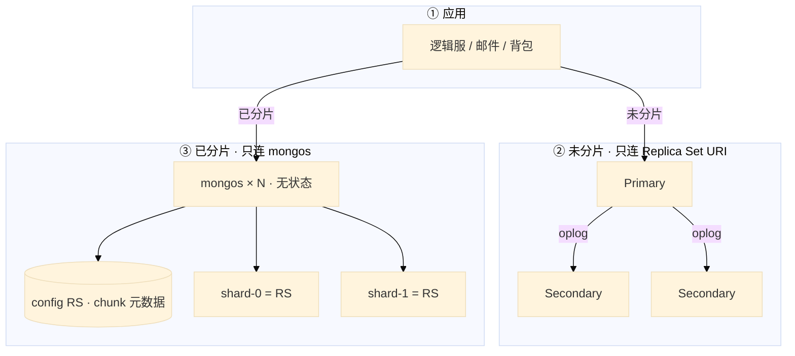
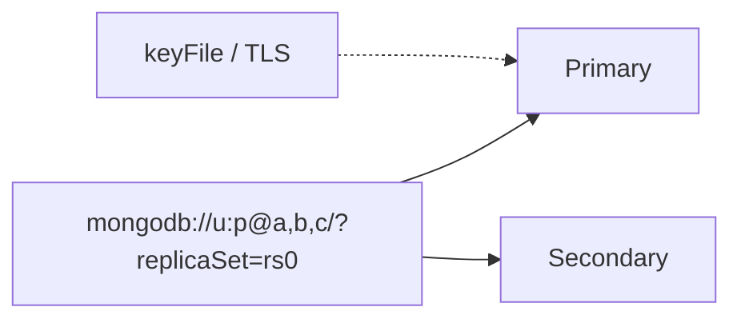
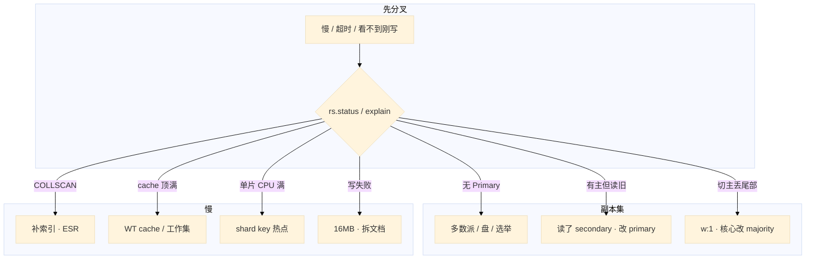

# MongoDB


活动整点，邮件服 P99 飙到 3 秒。群里有人把读偏好改成 `secondary` 分担压力——玩家刚领的邮件列表里看不到；另有人要把测试环境的 TTL 索引 `createIndex` 打到生产 `players` 集合；还有人准备 `mongorestore` 只还 Mongo，说「进度在 Mongo 里」。

先别动手。Mongo 是**文档层**：装备、邮件、活动存档结构常变；钱包账本仍以 MySQL 为准。这一章教你在动手前选对路：**副本集还是分片、刚写立刻读走哪、shard key 定错怎么收场、16MB 和 WT cache 各怎么止血**。

**本章主线（排障就按这三步想）：**

1. **分层**：应用 URI / mongos → 副本集 Primary 或分片；权威账在 MySQL，Mongo 是灵活文档层。
2. **归类**：刚写看不见 → 读 secondary / w:1；慢 → COLLSCAN / WT cache；写失败 → 16MB / 文档模型。
3. **留证**：`rs.status()` + `explain` + profiler；切主后 URI 不能写死 IP；回档要对齐 Redis / MySQL（08-07）。

**读完你能：** 白板上画出副本集和分片差在哪；刚写立刻读走 primary + majority；shard key 选错能说出三种后果；玩家文档哪些嵌哪些拆；会备份 restore、滚动升级、切主换成员；WT cache 打满和 16MB 各怎么止血。

## 本章目录

- [1. 基本概念](#1-基本概念)
- [2. 架构图](#2-架构图)
- [3. 原理](#3-原理)
  - [3.1 副本集：写关注与读偏好](#31-副本集写关注与读偏好)
  - [3.2 分片与 shard key](#32-分片与-shard-key)
  - [3.3 玩家文档模型](#33-玩家文档模型)
  - [3.4 WiredTiger 缓存](#34-wiredtiger-缓存)
  - [3.5 索引 / TTL / 16MB](#35-索引--ttl--16mb)
- [4. 落地](#4-落地)
- [5. 核心配置](#5-核心配置)
- [6. 命令与操作](#6-命令与操作)
- [7. 生产排障](#7-生产排障)
- [8. 必会 · 常考](#8-必会--常考)
- [合上书](#合上书问自己)

**本章不讲：** 强事务、JOIN、Explain 方法论 → [01 MySQL](../01-MySQL/)；合服冲突、映射、窗口 → [07-06](../../07-游戏运维专题/06-开服合服/)；备份 RPO、误操作回档流程 → [07-09](../../07-游戏运维专题/09-玩家数据备份与回档/)；全文检索、倒排 → [04 Elasticsearch](../04-Elasticsearch/)；消息积压、发奖流水 → [03 Kafka](../03-Kafka/)。

---

## 1. 基本概念

MongoDB 存的是 **BSON 文档**（类 JSON），同一集合里字段可以不一样——适合装备、邮件、活动存档这种「结构常变、天然嵌套」的数据。不适合订单那种要跨很多实体做强事务、复杂 JOIN 的账。

**值班里什么时候碰到 Mongo：**

| 场景 | 你在查什么 | 第一刀 |
|------|------------|--------|
| 「刚领的邮件没有」 | 读偏好 / 复制延迟 | 读是不是 secondary |
| 「Mongo 突然变慢」 | COLLSCAN / WT cache | `explain` + cache 命中 |
| 「背包打不开」 | 单文档 16MB | 文档模型 / 数组无限涨 |
| 「整点一片 CPU 100%」 | shard key 热点 | key 是否单调递增 |
| 「切主后全服写失败」 | URI 写死旧主 IP | 连接串是否 replicaSet |

三个角色不要混——面试和白板第一题：

| 角色 | 干什么 | 值班口诀 |
|------|--------|----------|
| **Replica Set** | 内置选主的高可用 | **不**水平扩展写 |
| **Shard 集群** | mongos + config RS + 多片 | 每片本身仍是副本集 |
| **应用 URI** | 连副本集地址或 mongos | **不要写死某一台 IP** |

| 在 Mongo 里 | 不在 Mongo 里 |
|-------------|---------------|
| 玩家存档、装备、邮件、灵活活动字段 | 钱包、发货账本（仍以 MySQL 为准） |
| 单文档原子；TTL 过期文档 | 跨实体强一致转账 |
| WiredTiger 缓存里的热文档 | 全文倒排（去 09 ES） |

逻辑服插入一封邮件：

```javascript
db.mail.insertOne({
  _id: ObjectId(),
  player_id: 10001,
  title: "开服奖励",
  items: [{ item: "diamond", count: 50 }],
  expire_at: ISODate("2026-09-26T00:00:00Z")
})
```

未分片时这条写打到副本集的 Primary；已分片时客户端连 **mongos**，由 shard key 决定落哪一片。

单文档操作是原子的；4.0+ 副本集多文档事务、4.2+ 分片事务能用，但慢、限制多，**不是选型理由**。要复杂事务回 MySQL。可以并存：进度在 Mongo，账在 MySQL。

**打个比方**：Mongo 像玩家家里的**储物柜**——每件装备、每封信单独一格，结构随时能改；MySQL 像**银行账本**——每笔转账必须对得上，不能「大概齐」。别把银行账搬进储物柜。

> **记住**：有事务 ≠ 适合当账本。应用连 replica set URI 或 mongos，不要写死旧主 IP。

**面试怎么说**：「Mongo 管灵活文档，MySQL 管账；副本集是 HA，分片才是水平扩写；刚写立刻读走 primary。」

---

## 2. 架构图

先把整张图钉住。后面切主、分片、缓存、排障都对着这张图说话。

**副本集 vs 分片** 是本章最容易混的一对：副本集解决「主挂了谁顶」；分片解决「一张集合写不下、热打在一台」。分片的每一片 **仍然是一套副本集**。不要把 Secondary 当成「分片」。



**读图三句话：**

1. **未分片没有 mongos。** 应用直连 Replica Set URI；直连某一台 Secondary 当「读写分离入口」会在切主后连错。
2. **mongos 无状态**，可多台；**config server 挂了**路由元数据不可用，比丢一个 shard 更像全站——从应用连 mongos 往下查。
3. **每片都是 Replica Set**。片的高可用仍靠该片的多数派，不是靠「片数够多」。

单文档示例（玩家 + 有界背包可以嵌；邮件不要嵌，见 3.3）：

```javascript
{ _id, player_id, name,
  inventory: [{ item: "sword", count: 1 }],
  updated_at: ISODate(...) }
```

---

## 3. 原理

原理只保留动手和面试会用到的：刚写为什么从库没有、key 怎么选、文档怎么拆、缓存为什么比加 CPU 先看。

### 3.1 副本集：写关注与读偏好

**一句话：** 写 `w:1` 主本地确认就回，读 secondary 可能旧；核心数据用 `w:majority` + 读 primary。

**打个比方**：Primary 是**收银台**，Secondary 是**后厨贴单**。`w:1` 等于收银台说「收到了」就打发客人——后厨还没贴完；客人跑去后厨问「我的单呢」，当然可能空。`w:majority` 是等**多数后厨**都贴完再打发。

**现场走一遍**（玩家刚领完邮件，列表里没有）：

1. 客服说 `player_id=10001` 刚领完开服奖励，邮箱空。先确认应用连接串：

```javascript
// 应用配置里常见写法（mongosh 里看不了，去配置中心或 env）
// mongodb://u:p@mongo-a,mongo-b,mongo-c/game?replicaSet=rs0&readPreference=secondary
```

2. 连任意存活节点，看副本集谁在主、复制有没有落后：

```javascript
rs.status()
```

3. 屏幕出现（节选）：

```text
members: [
  { name: "mongo-a:27017", stateStr: "PRIMARY",   optimeDate: ISODate("2026-08-28T06:12:01Z") },
  { name: "mongo-b:27017", stateStr: "SECONDARY", optimeDate: ISODate("2026-08-28T06:11:58Z") },
  { name: "mongo-c:27017", stateStr: "SECONDARY", optimeDate: ISODate("2026-08-28T06:11:55Z") }
]
```

4. 在 **Primary** 上查邮件确实存在：

```javascript
db.mail.find({ player_id: 10001 }).sort({ _id: -1 }).limit(3)
// → 有「开服奖励」
```

5. 在 **Secondary** 上同样查（需 `rs.secondaryOk()` 或 readPreference）：

```javascript
rs.secondaryOk()
db.getSiblingDB("game").mail.find({ player_id: 10001 }).sort({ _id: -1 }).limit(3)
// → 空，或缺最新一封
```

6. 结论：不是回档，是 **复制延迟 + 读了 secondary**。邮箱改 `readPreference=primary`；从库延迟持续涨再查磁盘和慢查询。

**输出解读：**

| 字段 / 现象 | 含义 | 下一步 |
|-------------|------|--------|
| `stateStr: PRIMARY` | 当前写入口 | 权威读也走这里 |
| `optimeDate` 从库比主旧 3～5s | 复制落后 | 查从库 IO、COLLSCAN |
| 主有、从无 | 典型 secondary 读 | 改读偏好，不是 restore |
| 无 PRIMARY | 选举中或多数派没了 | 查存活节点数、盘、网络 |
| `w: 1` 写入后切主 | 最后几笔可能丢 | 核心改 `w: majority` |

**写关注 / 读偏好表：**

| 参数 | 行为 | 生产怎么用 |
|------|------|------------|
| `w: 1` | 主本地写完就回 | 打点、可丢日志 |
| `w: majority` | 多数**数据节点**确认 | 邮件、充值结果、核心存档 |
| `readPreference: primary` | 只读主 | 邮箱、背包、刚写立刻读 |
| `readPreference: secondary` | 只读从 | 排行榜展示；**刚写可能旧** |
| `readPreference: nearest` | 最近节点 | 跨 AZ 延迟低，一致性不保证 |

**Arbiter 坑：** 只投票不存数据，用来凑奇数。两个数据节点 + Arbiter 的容灾比三数据节点弱——`w: majority` 要的是**数据节点**多数，Arbiter **不算**一份数据副本。生产能三数据节点就不要用 Arbiter 顶容灾。

故障转移：旧主挂了，多数派选出新主（秒级）。应用必须连 replica set URI，不能直连旧主 IP。监控：**oplog 窗口**、复制延迟；从库断很久再连，oplog 转掉只能全量同步。

**面试怎么说**：「刚写立刻读走 primary；核心写 w:majority 防切主丢尾部；secondary 分担读可以，邮箱不行；Arbiter 只投票不算数据副本。」

> **记住**：客诉「刚领的没有」先查读偏好和 optime，不要当回档 restore。

### 3.2 分片与 shard key

**一句话：** 分片按 shard key 拆数据到多片；key 定错热点或 scatter-gather，极难改。

**打个比方**：shard key 是**快递分拣码**。按 `player_id` 哈希 = 同一玩家的包裹进同一仓库，查一个人只开一个库；按 `created_at` = 今天所有包裹堆在「最新货架」，整点爆仓；key 里没有 `player_id` = 查一个人要翻**所有仓库**。

**现场走一遍**（运营按玩家查邮件，P99 突然 2s）：

1. 确认客户端连的是 **mongos**，不是某片 Primary：

```javascript
sh.status()
```

2. 屏幕出现（节选）：

```text
shards: { "_id": "shard-0", "host": "rs-shard0/..." , "_id": "shard-1", ... }
balancer: { "mode": "full" }
```

3. 在 mongos 上对典型查询做 explain：

```javascript
db.mail.find({ player_id: 10001 }).explain("executionStats")
```

4. **好的 key**（`hashed(player_id)` 或复合含 player_id）输出：

```text
"shards": { "shard-0": { "nReturned": 12, "executionTimeMillis": 3 } }
// shards 只有 1 个 key → 只打一片
"totalKeysExamined": 12
"stage": "IXSCAN"
```

5. **坏的 key**（例如 shard key 只有 `created_at`，查询只有 player_id）：

```text
"shards": { "shard-0": {...}, "shard-1": {...}, "shard-2": {...}, "shard-3": {...} }
"executionTimeMillis": 1847
"stage": "COLLSCAN"   // 某些片还可能全表扫
```

6. 看 chunk 是否倾斜：

```javascript
db.adminCommand({ balancerCollectionStatus: "game.mail" })
// 或 sh.status() 里看 chunk 分布
```

7. 结论：`shards` 四个 key、executionTime 1.8s → **scatter-gather**；shard key 缺 `player_id` 或选错。改 key 是项目级操作，短期先补查询索引 + 限流，长期迁集合。

**输出解读：**

| explain 字段 | 正常 | 异常 |
|--------------|------|------|
| `shards` key 个数 | 1（点查） | 等于片数 = scatter-gather |
| `executionTimeMillis` | 个位数 ms | 数百 ms 起查全集群 |
| `stage` | IXSCAN | COLLSCAN 拖死单片 |
| chunk 分布 | 各片 chunk 数接近 | 一片 chunk 数远超其他 = 热点 |

**选 key 三条：**

1. **高基数**：值够多才能打散。状态枚举、活动 id 不行。
2. **写入均匀**：单调递增（时间戳、自增 id）会打最新 chunk——整点活动全打一片。
3. **查询能定位到片**：按玩家查邮件，key 里要有 `player_id`。

| 选型 | 写入 | 查询 | 典型场景 |
|------|------|------|----------|
| `hashed(player_id)` | 均匀 | 按人点查好；**范围差** | 邮件、道具过亿 |
| `{ player_id: 1, time: 1 }` | 较均匀 | 按人 + 时间范围 | 邮件列表带时间 |
| `created_at` 单调 | **热点** | 时间范围好 | 日志类；慎用于核心 |
| 活动 id | 整点打一片 | 差 | 不要 |

> **别混**：副本集抗节点故障；分片抗数据量和写入面。条目没到过亿、单副本集盘和 CPU 还够，**不要为了架构图先上分片**。shard key **一旦定了极难改**（4.2+ 能改但重、风险大）。

组件：mongos 路由；config server 存 chunk 分布（本身也是副本集）；chunk 迁移是均衡器的事——活动高峰不要开激进 balancer，迁移抢 IO。

**面试怎么说**：「分片每片仍是副本集；key 要高基数、写入均匀、查询能定位；单调时间戳会热点；哈希 player_id 好点查但范围查询跨片；定错极难改。」

### 3.3 玩家文档模型

**一句话：** 一对多拆集合嵌 `player_id`；无限数组嵌进玩家文档必撞 16MB。

**打个比方**：玩家文档是**钱包夹层**——放身份证、等级没问题；把三年收到的几千封信全塞进夹层，夹层鼓爆（16MB），掏一张过期信也做不到（TTL 删整篇）。

**现场走一遍**（背包打不开，登录卡 30s）：

1. 客服报 `player_id=88421` 登录后背包白屏。先查该玩家文档大小：

```javascript
db.players.aggregate([
  { $match: { player_id: 88421 } },
  { $project: { size: { $bsonSize: "$$ROOT" }, mailCount: { $size: { $ifNull: ["$mails", []] } } } }
])
```

2. 屏幕出现：

```text
{ "size": 16777208, "mailCount": 3842 }
```

3. **16777208 字节 ≈ 16MB − 几字节**——顶到硬上限。再看是不是嵌了邮件数组：

```javascript
db.players.findOne({ player_id: 88421 }, { mails: { $slice: 1 }, inventory: 1 })
// mails: [ { title: "...", expire_at: ... }, ... ]  // 错模型
```

4. 止血（不等迁完才开服）：

```javascript
// 临时：客户端降级空背包；运维禁止再往 mails 数组 $push
// 根因：拆集合
db.mail.insertMany(
  db.players.findOne({ player_id: 88421 }).mails.map(m => ({ ...m, player_id: 88421 }))
)
db.players.updateOne({ player_id: 88421 }, { $unset: { mails: "" } })
```

5. 验收：文档 size 降到 KB 级，登录恢复；后续邮件走独立 `mail` 集合 + TTL。

**输出解读：**

| 数据 | 嵌进玩家文档 | 独立集合 |
|------|--------------|----------|
| 昵称、等级、头像 | ✓ 字段稳定 | — |
| 装备栏有上限（≤200 格） | ✓ 可以嵌数组 | 格数上千则拆 |
| 邮件、聊天、日志、好友 | **✗** | `{ player_id, ... }` 一行一封/一条 |
| 金币流水 | **✗** | 账在 MySQL |

| `$bsonSize` | 含义 |
|-------------|------|
| < 1MB | 正常 |
| 10MB+ | 预警，查无限数组 |
| ≥ 16777216 (16MB) | 硬上限，写失败 |

合服时 Mongo 同样要映射 `player_id`；回档对齐 08-07，只还 Mongo 不还 Redis/MySQL = 半新半旧。

**面试怎么说**：「邮件、日志独立集合带 player_id；TTL 删整篇文档不能删数组里一封；16MB 硬上限，数组只 append 必撞；有界背包可嵌，无限涨必须拆。」

### 3.4 WiredTiger 缓存

**一句话：** 热数据应在 WT cache；cache 打满 eviction 读盘，P99 尖刺——先查 cache 和 COLLSCAN，别先加 CPU。

**打个比方**：WT cache 是**柜台现货**。工作集（常买的货）应该摆在柜台；柜台满了（cache 满）就要把旧货搬仓库（磁盘），一来客人就得跑仓库——全店「突然变慢」，加收银员（CPU）没用，得扩大柜台（内存）或减少货品种类（索引/文档体积）。

**现场走一遍**（监控 Mongo P99 从 20ms 飙到 800ms，CPU 70%）：

1. 连 Primary，看服务状态：

```javascript
db.serverStatus().wiredTiger.cache
```

2. 屏幕出现（节选）：

```text
"bytes currently in the cache": 8589934592,       // 8GB，接近上限
"maximum bytes configured": 8589934592,
"tracked dirty bytes in the cache": 2147483648,    // 2GB 脏页
"pages evicted by application thread": 1847293,
"cache overflow score": 87
```

3. 同时看慢查询是不是 COLLSCAN：

```javascript
db.setProfilingLevel(1, { slowms: 100 })
db.system.profile.find({ millis: { $gt: 500 } }).sort({ ts: -1 }).limit(3)
// op: "query", planSummary: "COLLSCAN", docsExamined: 28000000
```

4. 算一笔账：机器 32GB RAM，WT 默认 cache ≈ **(32−1)/2 ≈ 15.5GB**；上面 configured 只有 8GB，工作集（热玩家 + 索引）估 40GB → **持续 cache miss**。

5. 处理顺序：补 `player_id` 索引干掉 COLLSCAN → 适当调大 `wiredTigerCacheSizeGB`（给 OS 留 ≥4GB）→ 仍不够加内存或减工作集（砍无用索引、拆大文档）。

**输出解读：**

| 指标 | 正常 | 异常 |
|------|------|------|
| `bytes currently in the cache` / `maximum` | < 85% | 长期顶满 |
| `tracked dirty bytes` | 相对低 | 脏页高 + eviction 高 = 写入 stall |
| `pages evicted` 持续涨 | 低 | 工作集 > cache |
| profiler `COLLSCAN` | 无 | 全表扫把 cache 打穿 |

| 项 | 口径 |
|----|------|
| 默认 cache | 约 **(RAM − 1GB) / 2** |
| 不要 | cache = 全部 RAM（OS、连接、排序还要内存） |
| checkpoint | 常见 ~60s 把脏页落盘，P99 可能抖 |

**面试怎么说**：「Mongo 慢先看 explain 有没有 COLLSCAN，再看 WT cache 占用和 eviction；默认 cache 约一半内存减 1G；内存不够加 RAM 或减工作集，别先加 CPU。」

> **记住**：和 Redis「热数据在内存」是同一类题，引擎名不同。

### 3.5 索引 / TTL / 16MB

**一句话：** 复合索引记 ESR；TTL 删整篇文档约 60s 一轮；单文档硬上限 16MB。

**打个比方**：索引是**图书馆目录**——没目录找书要从第一本翻到最后（COLLSCAN）；TTL 是**保洁按过期标签收整箱货**，不能从箱子里只拿出一封；16MB 是**单个箱子最大容积**，硬限制。

**现场走一遍**（邮件「过期了还在」+ 误操作 TTL）：

1. 确认 TTL 索引建在**日期字段**、**独立 mail 集合**：

```javascript
db.mail.getIndexes()
```

2. 正常输出：

```text
{ "key": { "expire_at": 1 }, "expireAfterSeconds": 0, "name": "expire_at_1" }
```

3. 查一封应过期邮件：

```javascript
db.mail.findOne({ player_id: 10001, title: "七日登录" })
// expire_at: ISODate("2026-08-20T00:00:00Z")  // 今天 8-28，早该删
```

4. 还在的原因：TTL monitor 默认约 **60s** 扫一轮，不是秒级准时；积压时更慢。看 Primary 上 monitor：

```javascript
db.serverStatus().metrics.ttl
// deletedDocuments 在涨说明在干活，只是滞后
```

5. **误操作场景**：有人把 TTL 建在 `players.expire_at` 且嵌了邮件——TTL 删的是**整玩家文档**。立刻 `dropIndex` 前要有 08-07 审批；恢复走快照 + oplog，不要无脑 `mongorestore` 覆盖整库。

6. 索引规划示例：

```javascript
db.mail.createIndex({ player_id: 1, time: -1 })   // ESR：等值 player_id，再 sort time
db.mail.createIndex(
  { expire_at: 1 },
  { expireAfterSeconds: 0 }   // 到 expire_at 时刻过期
)
db.mail.find({ player_id: 10001 }).explain("executionStats")
// winningPlan: IXSCAN，不是 COLLSCAN
```

**输出解读：**

| 概念 | 要点 |
|------|------|
| ESR | Equality → Sort → Range；等值放最左 |
| TTL | 删**整篇文档**；monitor ~**60s**；Primary 删完复制到 Secondary |
| 16MB | BSON 单文档硬上限 **16777216** 字节 |
| 写放大 | 每个字段单建索引 → 占 cache、拖写入 |

生产注意：高峰勿对超大集合新建索引/TTL；钱、道具不要 TTL 清；文本检索去 09 ES。

**面试怎么说**：「复合索引 ESR；TTL 适合独立邮件文档，删整篇不是删数组元素，大约一分钟一轮；16MB 硬上限；COLLSCAN 先补 player_id 索引。」

---

## 4. 落地

### 4.1 生产怎么选

| 项 | 选 | 不选 |
|----|----|------|
| 拓扑 | 先 3 **数据节点**副本集；写不下再分片 | 一上来分片；2 数据 + Arbiter 当生产容灾 |
| 磁盘 | 独立 SSD；journal / data 分离更好 | 和游戏日志同盘 |
| 网络 | 同城多 AZ；应用连 URI / mongos | 跨 region 一套副本集当同步 |
| 连接 | `replicaSet=rs0` 或 mongos 列表 | 写死 Primary IP |
| 引擎 | WT cache 按内存留 OS | cache 吃光机器 |

### 4.2 落地你实际看到什么



验收：进程在不算数。必须 `rs.status()` 有 Primary、延迟可接受；应用 URI 切主后能自动换；关键查询 `explain` 不是 COLLSCAN。分片集群再加：mongos 可连、config RS 健康、balancer 不在活动整点。

托管 Atlas / 云 Mongo：问清备份 RPO、谁 restore、滚动策略、WT cache 指标是否可见。

---

## 5. 核心配置

只动有证据的项。写关注、读偏好、WT cache 三处改错会直接表现为「回档了」或「突然慢」。

| 参数 | 常见默认 | 生产怎么用 | 改错会怎样 |
|------|----------|------------|------------|
| `w` | 1 | 核心邮件/交易 **majority** | w:1 切主丢尾部 |
| `readPreference` | primary | 邮箱背包 **primary** | secondary = 刚写看不见 |
| `wiredTigerCacheSizeGB` | 约 (RAM−1GB)/2 | 热数据能进；给 OS 留内存 | 全 RAM → OOM / 抖 |
| `slowms` / profiler | 100ms | 排障临时开，看完关 | 长期 level 2 打满盘 |
| TTL 索引 | 无 | 独立 mail + 日期字段 | 嵌数组 / TTL 清钱 |

```yaml
# mongod.conf 片段
storage:
  wiredTiger:
    engineConfig:
      cacheSizeGB: 12    # 32GB 机器示例，勿占满
operationProfiling:
  slowOpThresholdMs: 100
```

> **记住**：刚写立刻读走 primary；cache 比乱加 CPU 更先看。`linearizable` 读贵，默认不必开。

---

## 6. 命令与操作

### 6.1 命令速查

值班先跑这几条：

```javascript
rs.status()
db.currentOp({ "active": true, "secs_running": { "$gt": 5 } })
db.setProfilingLevel(1, { slowms: 100 })
db.system.profile.find().sort({ ts: -1 }).limit(5)
db.mail.find({ player_id: 10001 }).explain("executionStats")
db.serverStatus().wiredTiger.cache
```

| 目的 | 命令 | 看什么 |
|------|------|--------|
| 副本集 | `rs.status()` | 成员、延迟、Primary、选举 |
| 慢查询 | profiler + `system.profile` | COLLSCAN / millis |
| 计划 | `explain("executionStats")` | IXSCAN vs COLLSCAN；分片 `shards` 个数 |
| 分片 | `sh.status()` | chunk 分布、balancer |
| 文档大小 | `$bsonSize` 聚合 | 是否顶 16MB |
| 备份 | `mongodump` / 快照 + oplog | 逻辑慢；PITR 靠 oplog |

`rs.status()` 正常：`PRIMARY` 1 个，`SECONDARY` optime 与主差 小于 1 秒（视 SLA）。异常：全 `SECONDARY` = 无主要查多数派；`RECOVERING` = 全量同步中。

### 6.2 备份与 restore

`mongodump` / `mongorestore` 逻辑备份，大库慢。文件系统快照 + oplog 做物理备份和 **PITR**。发版、合服、改 shard key 前加打一份。

多数派还在丢 1 节点：**不要**全量 restore → `rs.remove` 坏节点 → `rs.add` 新节点 → 追 oplog。oplog 窗口不够会触发全量初始同步。

多数派没了 / 误 TTL：`mongorestore` 前停写，对齐 08-07 Redis/MySQL；只还 Mongo = 半新半旧。

### 6.3 加片、升级、迁移

- **加片**：先确认 shard key 没选错；活动高峰收紧 balancer 窗口。
- **升级**：快照 + 条数 → 滚动 Secondary → `rs.stepDown()` Primary → FCV 升过难靠降二进制回退。
- **换机器**：`rs.add` 新成员 → 追平 → `rs.remove` 旧成员。
- **改 IP**：`rs.reconfig` + 应用 URI 同步改。

未分片改分片是项目，活动中不要做。

---

## 7. 生产排障

三问：还能不能写？读到的是不是刚写的？已有玩家文档还在不在？

**Primary 切了 ≠ 立刻回档。** 读 secondary 导致「邮件没了」先换 primary 再查延迟。



| 现象 | 先做什么 | 不要做什么 |
|------|----------|------------|
| 刚领邮件列表没有 | 读偏好、主从 optime 对比 | 当回档去 restore |
| COLLSCAN CPU 满 | 补 `player_id` 索引 | 先加 CPU |
| 整点一片热点 | shard key 是否单调 / 活动 id | 高峰开激进 balancer |
| 背包打不开 | `$bsonSize` 是否 ≈16MB | 继续 `$push` 数组 |
| 「突然变慢」 | WT cache + eviction | 先加 CPU |
| 误 TTL 删数据 | 08-07 停写、快照 + oplog | 只 mongorestore 覆盖整库 |
| oplog 窗口短 | 修从库延迟、加大 oplog | 从库断很久还指望增量 |

常见误判链：文档数组只 append → 16MB；读 Secondary 当强一致 → 复制延迟；shard key 用活动 id → 整点一片打满；config RS 挂 → 全站路由不可用。

活动高峰最常见误操作：**读改 secondary 扛流量** 和 **误把测试 TTL 打生产**。正确处理：`rs.status` 定主从 → 刚写读 primary → `explain` 定慢 → cache 定内存。

---

## 8. 必会 · 常考

| 说法 | 对错 | 口径 |
|------|:----:|------|
| Mongo 有事务就能当支付库 | 错 | 多文档事务不是选型理由 |
| 副本集 = 水平扩展写 | 错 | 副本集是 HA；扩写靠分片 |
| Secondary 就是分片 | 错 | 每片自己是一套副本集 |
| 刚写立刻读 secondary 一定能看见 | 错 | 复制延迟；邮箱走 primary |
| w:1 切主不丢 | 错 | 可能丢最后几笔 |
| w:majority 要 Arbiter 算副本 | 错 | 要**数据节点**多数 |
| Arbiter 算一份数据副本 | 错 | 只投票 |
| shard key 用 created_at 最自然 | 错 | 单调键热点 |
| 哈希 key 范围查询也很好 | 错 | 跨片 scatter |
| shard key 随时能改 | 错 | 极难改 |
| TTL 嵌在玩家数组里能删一封邮件 | 错 | 删整篇文档 |
| TTL 整点准时、秒级 | 错 | monitor ~60s |
| 钱可以 TTL 自动清 | 错 | 走合服/回档流程 |
| Mongo 突然慢先加 CPU | 错 | 先 COLLSCAN 和 WT cache |
| 只还 Mongo 就算回档 | 错 | 要对齐 Redis/MySQL |
| 每个字段建一个索引 | 错 | 写放大、占 cache |

数字：单文档 **16MB**（16777216 字节）；TTL monitor 约 **60s**；三数据节点副本集；WT cache 约 **(RAM−1GB)/2**；邮件独立文档 + `expireAfterSeconds`。

易混：副本集 vs 分片；w:1 vs majority；primary vs secondary 读；嵌入 vs 引用；TTL vs 业务清档；COLLSCAN vs cache miss；mongos 无状态 vs config 有状态。

---

## 合上书，问自己

- [ ] 什么数据进 Mongo、什么留 MySQL？应用连谁、为什么不能写死 IP？
- [ ] 副本集和分片各解决什么？每片为什么还是副本集？
- [ ] w:1 / majority、读 secondary 各会看到什么？Arbiter 的坑？
- [ ] shard key 三条原则？单调键和哈希键各坑什么？explain 里 `shards` 几个 key 算正常？
- [ ] 玩家文档哪些嵌、哪些拆？TTL 和 16MB 怎么踩？
- [ ] WT cache 打满什么指标？备份 restore 为什么要对齐 Redis/MySQL？

六题都能口述，这一章就过了。发奖流水回 05 Kafka；合服映射去 08-02。
