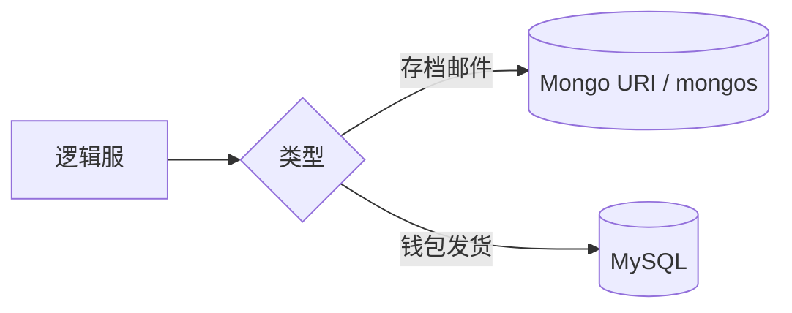
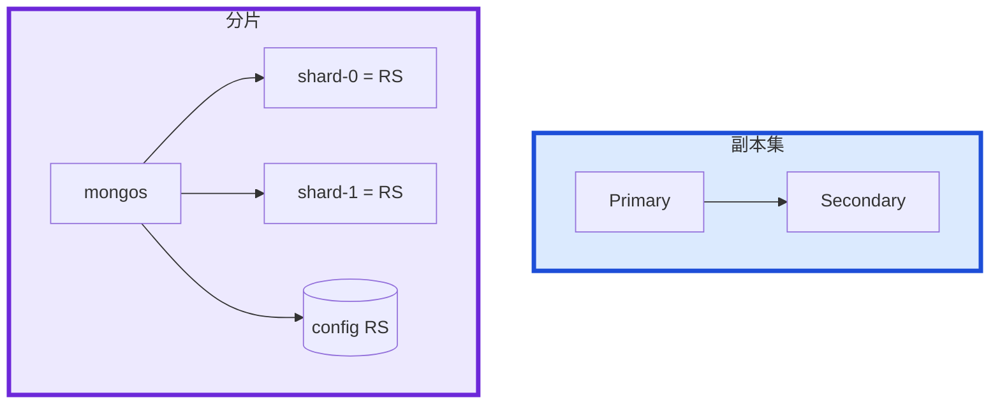
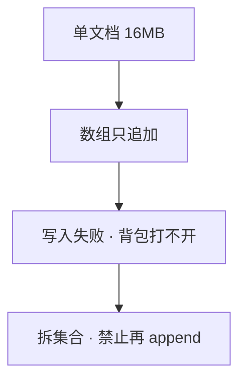

# 05｜MongoDB · 练习题

先对照 [知识点](知识点.md) **本章主线** 自己口述，再对答案。每题标了覆盖范围：

| 标记 | 含义 |
|------|------|
| **核心** | 不懂整章就没建立起来 |
| **必会** | 值班和面试都要能讲 |
| **常用** | 线上会反复碰到 |
| **常考** | 白板和追问的高频口径 |

## 本题目录

- [Q1 是什么、和 MySQL 怎么选](#q1)
- [Q2 副本集 vs 分片](#q2)
- [Q3 读从库、写关注](#q3)
- [Q4 shard key](#q4)
- [Q5 玩家文档模型](#q5)
- [Q6 TTL](#q6)
- [Q7 索引 ESR、16MB](#q7)
- [Q8 WiredTiger 缓存](#q8)
- [Q9 备份回档、升级](#q9)
- [Q10 排障分流](#q10)
- [Q11 副本集选举与 priority](#q11)
- [Q12 change stream 和 oplog](#q12)
- [Q13 分片集群 balancer 能高峰开吗](#q13)
- [Q14 MongoDB 60 秒定责](#q14)
- [合上书](#合上书)

---

## Q1

**★★★★★｜MongoDB 是什么？和 MySQL 怎么选？能做事务吗？**

**覆盖**：核心 · 必会 · 常考
**对应**：知识点 [1. 基本概念](知识点.md)

### 场景

新玩法背包字段每周都加。有人主张全部迁 Mongo；支付组反对，说「没有事务」。白板：「画应用连谁。」

### 完整解答

**一句话**：按数据形状选：灵活文档进 Mongo，固定账本进 MySQL；有事务不等于适合当支付账本。

按数据形状选。Mongo：灵活 schema、文档嵌套、按文档水平拆。MySQL：固定结构、多表 JOIN、跨实体强事务（订单/支付）。游戏存档、装备、邮件 → Mongo；订单、充值 → MySQL。可以并存：进度在 Mongo，账在 MySQL。

单文档操作本身原子。4.0+ 副本集多文档事务，4.2+ 分片事务。分片事务要带 shard key，又慢又脆。**有事务 ≠ 适合当账本。** 应用连 replica set URI 或 mongos，不要写死 IP。



### 再追问

一个玩家文档把好友列表全嵌进去行不行？——短期可以。无限涨会撞 16MB。好友、邮件拆出去，用 `player_id` 关联或分片。

---

## Q2

**★★★★★｜副本集和分片差在哪？Secondary 是分片吗？**

**覆盖**：核心 · 必会 · 常考
**对应**：知识点 [2. 架构图](知识点.md)

### 场景

有人说「上从库就是水平扩展」。另有人把应用直连某一片的 Primary。config 挂了，mongos 还在。

### 完整解答

**一句话**：副本集是 HA+读分担不写扩展；分片按 shard key 打散，每片仍是一套副本集。

**副本集 = HA + 读分担**，写仍打 Primary，不扩展写。**分片 = 按 shard key 把数据打到多片**，每片自己还是一套副本集。mongos 无状态可多台；config RS 存 chunk 元数据，挂了路由不可用。



未分片不要上 mongos。单副本集还够就不要为了架构图先分片。条目过亿再分，key 仍用 `player_id`。

### 再追问

和 MySQL 主从比？——Mongo 选主开箱即用。MySQL/PG 的 binlog/CDC、工具链更熟。Mongo 不是异构同步中枢。Arbiter 只投票不存数据，生产尽量三数据节点。

---

## Q3

**★★★★★｜读从库有什么坑？w:1 和 majority？切主会丢写吗？**

**覆盖**：核心 · 必会 · 常用
**对应**：知识点 [3.1 副本集：写关注与读偏好](知识点.md)

### 场景

Primary 所在机挂了。有人把读偏好改成 `secondary`「分担压力」，玩家反馈刚领的邮件列表里没有。为了发奖吞吐把写关注改成 `w: 1`，随后切主，少量发奖记录在新主上没有。

### 完整解答

**一句话**：读 Secondary 有复制延迟，邮箱背包读 primary；w:majority 切主后不丢已确认写。

Primary 写 → oplog → Secondary。读 Secondary 一定有复制延迟。邮箱、背包、发货结果用 **primary**。展示类再读从。延迟大时先修从库，不要把读加到已经落后的节点。客诉「回档了」先查读偏好。

```
  w: 1         只等 Primary 本地 → 快；切主可能丢最后几笔
  w: majority  多数数据节点确认 → 切主后这批还在
```

核心邮件、交易用 majority。切主窗口写会失败，客户端重试必须幂等。应用连 replica set URI，不能直连旧主 IP。`linearizable` 贵，默认不必开。

### 再追问

Arbiter 算 majority 里的一票吗？——算投票，不算数据副本。`w: majority` 要数据节点多数。两数据节点 + Arbiter 弱于三数据节点。

---

## Q4

**★★★★☆｜shard key 怎么选？选错了会怎样？能改吗？**

**覆盖**：必会 · 常用 · 常考
**对应**：知识点 [3.2 分片与 shard key](知识点.md)

### 场景

邮件集合按 `created_at` 分片。上线一周后最新那片 CPU 打满，老片空转。按 `player_id` 查某人口信要扫所有片。

### 完整解答

**一句话**：shard key 要高基数、写入均匀、查询能定位；单调时间/活动 id 会热点，选错极难改。

三条：高基数、写入均匀、查询能定位到片。

```
  好：hashed(player_id)     写入打散，按人查询能定位
  差：created_at / 自增 id  新数据全打最新 chunk
  差：status / 活动 id      基数低，热点
```

选错：数据不均；整点热点；scatter-gather。shard key 一旦设定，4.2 以前基本迁集合；4.2+ 能改但重、风险大。查询模式是「按玩家拉邮件」，key 必须能定位到该玩家所在片。高峰不要开激进 balancer。

### 再追问

哈希 key 对范围查询友好吗？——不友好。按时间范围扫邮件会跨片。不要为了范围把单调时间当 shard key。

---

## Q5

**★★★★☆｜玩家文档哪些嵌、哪些拆？16MB 怎么办？**

**覆盖**：必会 · 常用 · 常考
**对应**：知识点 [3.3 玩家文档模型](知识点.md)

### 场景

老玩家背包打不开，写入报文档超过 16MB。`inventory` 越 append 越长。另有人把 1000 封邮件嵌进 `player.mails[]`。

### 完整解答

**一句话**：无限涨的邮件/好友独立集合；单文档 16MB 上限，数组只 append 会写失败。

昵称、等级、有上限的装备栏可以嵌。邮件、聊天、日志、无限涨的好友 **独立集合** `{ player_id, ... }`。账在 MySQL。



止血：拆集合、客户端降级空背包而不是卡死登录。拆开后过亿再分片，key 仍 `player_id`，保证一个人在一片。合服要映射 player_id，见 08-02。

### 再追问

拆开之后还要分片吗？——条目过亿再分片。邮件更不该嵌进玩家文档。

---

## Q6

**★★★★☆｜游戏邮件用 TTL 怎么做？会踩哪些坑？**

**覆盖**：必会 · 常用
**对应**：知识点 [3.5 索引 / TTL / 16MB](知识点.md)

### 场景

策划要求邮件 30 天过期。有人把所有邮件嵌进 `player.mails[]`，再在玩家文档上建 TTL。运营说「过期了还看得到」。

### 完整解答

**一句话**：邮件一封一文档 + TTL 索引；嵌数组里 TTL 删不掉单封，过期约 60s 一轮非准时。

邮件 **一封一个文档**，用日期字段做 TTL 索引。嵌在玩家数组里的 TTL 删的是整玩家，删不掉其中一封，还推向 16MB。

```javascript
db.mail.createIndex(
  { expire_at: 1 },
  { expireAfterSeconds: 0 }
)
```

TTL monitor 大约 **60 秒**一轮，不是整点准时。积压时更慢。钱和道具禁止 TTL 自动清。合服清邮件走 08-02。高峰不要对超大集合新建 TTL。

### 再追问

TTL 会不会在 Secondary 先删导致主从不一致？——删除在 Primary 执行，再经 oplog 复制。不一致更常见是读了落后的 Secondary。

---

## Q7

**★★★★☆｜索引怎么建？什么是 ESR？没索引会怎样？**

**覆盖**：必会 · 常用
**对应**：知识点 [3.5 索引 / TTL / 16MB](知识点.md)

### 场景

运营后台按 `name` 模糊查、按 `level` 排序。集合上千万，CPU 打满，profiler 全是 COLLSCAN。

### 完整解答

**一句话**：没索引 = COLLSCAN；复合索引 ESR：Equality → Sort → Range。

没索引 = 集合扫描，主从都疼。复合索引 **ESR**：Equality 在最左，再 Sort，再 Range。

```javascript
db.mail.createIndex({ player_id: 1, time: -1 })
```

`explain` 看 `IXSCAN` 还是 `COLLSCAN`。文本检索去 09 ES。每个字段都建单索引不行：写放大、占 WT cache。按真实查询建，定期砍无用索引。

### 再追问

每个字段都建单索引行不行？——不行。优化器也不一定用到。

---

## Q8

**★★★★☆｜WiredTiger 缓存打满什么样？为什么不要先加 CPU？**

**覆盖**：必会 · 常用 · 常考
**对应**：知识点 [3.4 WiredTiger 缓存](知识点.md)

### 场景

玩家背包打不开、P99 尖刺。机器 CPU 并不满。有人要加核。WT cache 默认大约一半内存，工作集远大于 cache。

### 完整解答

**一句话**：WT cache 满会 eviction 读打盘；工作集要进内存，先加内存或减工作集别先加 CPU。

热文档应在 **WiredTiger cache**。cache 满则 eviction，读打到盘，像「Mongo 突然变慢」。默认大约 `(RAM − 1GB) / 2`。不要把 cache 设成全部 RAM（OS、连接、oplog 还要内存）。脏页高、checkpoint 会抖 P99。

先看：cache 命中、脏页、eviction；再看是否 COLLSCAN、大数组文档把工作集撑爆。内存不够先加内存或减工作集，别先加 CPU。

### 再追问

和 Redis 热数据是不是同一类题？——是。引擎名不同，都是工作集要进内存。profiler 长期 0 级？——打满盘，排障临时开，看完关。

---

## Q9

**★★★★☆｜备份和回档怎么做？升级失败怎么回滚？**

**覆盖**：必会 · 常用
**对应**：知识点 [6.1 命令速查](知识点.md)、[6.3 加片、升级、迁移](知识点.md)

### 场景

误把测试 TTL 打到生产邮件集合。有人准备 `mongorestore` 覆盖整个库。控制面刚升完 FCV，一台落后，有人要把三台包一起改回去。

### 完整解答

**一句话**：备份 = 快照/dump/oplog + 演练；回档要对齐 Redis/MySQL，FCV 升过不能降二进制。

逻辑 dump 大库慢；物理快照快；oplog 可 PITR。回档范围要对齐：只还 Mongo、不还 Redis/MySQL = 半新半旧，比不还更糟。流程见 08-07。禁止直接改库补邮件。恢复前停写、对条数和对账。

oplog 窗口太短：从库断很久只能全量同步。监控 oplog 窗口。

升级：先快照；Secondary 先，再 stepDown Primary；FCV 升过不能靠换回旧二进制。回滚 = 升级前快照 restore。一台落后按换成员摘掉重加，不要三台一起回。没有升级前快照 = 没有回滚。多数派还在换成员，不要全量 restore。

### 再追问

能不能只还 Mongo？——不能当完整回档。换机器走 add/remove；换盘停该成员拷 dbPath。

---

## Q10

**★★★★☆｜给出现象，你先走哪条排障路？**

**覆盖**：必会 · 常用
**对应**：知识点 [7. 生产排障](知识点.md)

### 场景

四个工单：① 刚领邮件没有 ② profiler 全 COLLSCAN ③ 整点单片 CPU 满 ④ 写入报 16MB。另一次「突然变慢」有人加 CPU。

### 完整解答

**一句话**：刚领邮件没有先查读偏好；COLLSCAN 补索引；单片 CPU 满查 shard key；16MB 拆集合。

| # | 走哪条 | 不要做 |
|---|--------|--------|
| ① | 读偏好 / 复制延迟；改 primary | 当回档 restore |
| ② | 补索引 ESR | 先加 CPU |
| ③ | shard key 是否单调/活动 id | 高峰开 balancer |
| ④ | 拆数组集合 | 继续 append |

突然慢：WT cache 命中 → explain → `rs.status` → 是否 scatter。现场：`rs.status`、`currentOp`、profile、explain。

### 再追问

托管了这章能跳过吗？——不能。文档模型、TTL、读偏好、回档对齐仍是你的。

---

## Q11

**★★★★☆｜Primary 挂了，副本集怎么选新主？能指定机器吗？**

**覆盖**：必会 · 常考 ｜ **对应**：知识点 [2. 架构图](知识点.md)

### 场景

三节点副本集，Secondary B 配置高 `priority`，但数据落后 30 秒。Primary A 宕机。

### 完整解答

> 🎯 **一句话**：选举看 **priority + 最新 oplog 任期**——落后多的即使 priority 高也可能落选；用 `priority` + `hidden` 控角色，**不要**手工 `stepDown` 乱切。

```javascript
rs.conf().members.forEach(m => print(m.host, m.priority, m.votes))
// B priority=2 但 optime 落后 → 可能输给 C
```

```text
① 多数派可达才能选举
② 比较 lastAppliedOpTime，不是只看 priority
③ Arbiter 只投票不存数据
④ 维护：secondary 先降 priority 或 hidden，再 stepDown primary
```

> ⚠️ **别混**：读 `secondary` 延迟 ≠ 选举落后——选举看 oplog 位置。

### 再追问

**能强制指定 B 当主吗？**——`rs.freeze()` + `reconfig` 危险；优先修复制延迟。

---

## Q12

**★★★★☆｜change stream 和 oplog 什么关系？能当 CDC 吗？**

**覆盖**：必会 · 常用 ｜ **对应**：知识点 [3. 原理](知识点.md)

### 场景

要把 Mongo 邮件表变更同步到 ES。团队想直接读 oplog。

### 完整解答

> 🎯 **一句话**：**change stream 是 oplog 上的安全 API**——带 resume token、过滤集合；**不要**应用直连 oplog（权限/格式/升级风险）。

```javascript
db.player_mail.watch([{$match: {operationType: {$in: ["insert","update"]}}}])
// resumeAfter: token  断点续传
```

```text
oplog：内部复制日志，rs 专用
change stream：业务 CDC，需 replica set，单节点不支持
替代：Debezium / 自研 consumer + token 持久化
```

> 📝 **面试**：CDC 用 change stream + 幂等消费，不是 `db.oplog.rs.find()`。

### 再追问

**token 丢了怎么办？**——从最早可用位点重放，消费端幂等。

---

## Q13

**★★★★☆｜分片集群 balancer 活动高峰能开吗？chunk 迁移卡死怎么查？**

**覆盖**：必会 · 常用 ｜ **对应**：知识点 [2. 架构图](知识点.md)

### 场景

周年活动，单片 CPU 100%。有人要开 balancer 匀负载。

### 完整解答

> 🎯 **一句话**：**高峰停 balancer**——迁移占 IO/锁；单片热是 **shard key 单调** 问题，不是开 balancer 能救。

```javascript
sh.status()  // chunks 是否全在 shard01
sh.stopBalancer()  // 活动前
db.currentOp({"active": true, "ns": /^config\./})
```

```text
单片满：shard key 选错（时间单调）→ 新集合重分片（难）
活动期：停 balancer + 限流 + 热点拆 key
卡死：查 config.migrations 与 mongos 日志
```

> ⚠️ **别混**：balancer 匀 chunk，不治热 key；单调 `created_at` 分片必炸。

### 再追问

**能 live reshape shard key 吗？**——不能无痛改；要新集合迁移。

---

## Q14

**★★★★★｜刚写入查不到 / 全表慢 / 16MB，60 秒怎么分？**

**覆盖**：核心 · 必会 · 🔧 ｜ **对应**：知识点 [7. 生产排障](知识点.md)

### 场景

三告警同时：邮件刚发查不到、profiler 全 COLLSCAN、写入报 BSONObjectTooLarge。

### 完整解答

> 🎯 **一句话**：**查不到 → 读偏好/延迟**；**COLLSCAN → 索引**；**16MB → 拆文档**——三条线不要搅。

```text
0–10s   读偏好 primary? secondary 延迟?
10–30s  explain("executionStats") 有无 COLLSCAN
30–45s  16MB → 文档/数组大小；WT cache 命中
45–60s  定型：改 readPreference / 补 ESR 索引 / 拆 mail 集合
```

```javascript
db.getMongo().getReadPref()
db.player_mail.find({_id: ...}).explain("executionStats")
```

> ⚠️ **别混**：加 CPU 不治 COLLSCAN；回档不能治读从库延迟。

### 再追问

**`w:1` 刚写完读 secondary 正常吗？**——正常，要读己写走 primary 或 `readConcern: majority`。

---

## 合上书

- [ ] 能说出 Mongo vs MySQL 怎么选，应用连 URI / mongos
- [ ] 能画出副本集 vs 分片，每片仍是副本集
- [ ] 能讲 w:1 / majority、读 secondary 的坑、Arbiter 不算数据副本
- [ ] 能选 shard key，说明单调键和难改
- [ ] 能拆玩家文档：邮件独立 + TTL；数组不推向 16MB
- [ ] 能先看 COLLSCAN 和 WT cache；备份对齐 Redis/MySQL；升级回滚靠快照
