# 分布式理论与一致性

> 凌晨三个节点有两个回 ACK 慢了 200ms，主从切换后两个「主」并存——业务侧说「明明写成功了」，DBA 说「数据丢了」，架不拢。
> **本章回答**：一次分布式写入从发出到多节点一致，会经历什么、在哪一段会分裂、怎么一眼定责。
> **不讲**：Redis 哨兵与主从 → [02-02](../02-Redis/)；Kafka ISR 与 Offset → [02-03](../03-Kafka/)；MySQL 主从延迟 → [02-01-04](../01-MySQL/04-主从与高可用/)。

**标记**：🎯重点 · 🔥难点 · ⭐常考 · 🔧实操

---

## 一、一张图：一次分布式写入的一生

> 🎯 **一句话**：一个写请求从客户端到「多节点一致」，要过五道关——前提（CAP）、模型（一致性程度）、共识（Paxos/Raft）、事务（跨资源）、收敛（最终一致）。

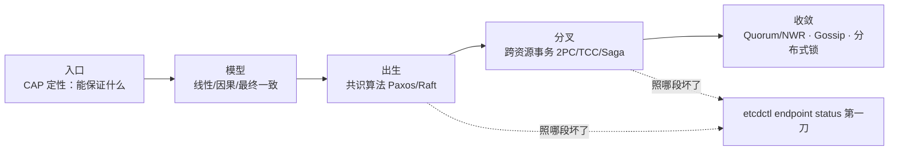

**读图**：

- 主线是一次分布式写入的一生，五个阶段串成一条时间线，每节讲一段。
- 「入口」先问「CAP 能保证什么」——理论天花板决定后续一切。
- `etcdctl endpoint status` 是 X 光机，照「这条写入现在卡在哪一段」。

---

## 二、前提：FLP 与 CAP

> 🎯 **一句话**：FLP 说异步网络下不可能同时做到「终止」和「一致」；CAP 说分区时只能选 C 或 A——它们是分布式一致性的理论天花板。

### FLP 不可能定理 🔥

> 💡 **打个比方**：三个将军派传令兵商量进攻时间，传令兵可能迟到甚至永远不到。没有任何办法能保证「一定能出结果」又「结果一定一致」——因为有人可能永远不回信，你不知道他是死了还是慢了。

**FLP 不可能定理（Fischer-Lynch-Paterson impossibility）**：在**异步网络**（消息延迟无上限）中，只要有一个节点可能故障，就不存在一个共识算法能同时满足：

- **Termination（终止性）**：所有非故障节点最终能做出决定。
- **Agreement（一致性）**：所有做出决定的节点决定值相同。
- **Validity（合法性）**：决定的值是某个节点提议过的。

FLP 是个**理论结果**，不是工程禁令——它说的是「在最坏情况下无法保证」。实际系统通过引入**超时/同步假设/随机化**绕过它：Paxos/Raft 都假设「最终同步」（消息延迟有上界），Raft 还靠 leader 选举超时来推动进展。

FLP 证明的关键在于**异步网络**的定义——消息延迟**无上限**。这意味着你永远无法区分「对方死了」和「对方慢了」，所以不敢贸然做决定。一旦给延迟加上界（同步假设）或引入随机超时，「对方死了」就能被探测到，共识就有了终止的希望。

> ⚠️ **别混**：FLP 说的是「异步网络 + 一个节点可能挂」→ 无法保证终止，**不是**「分布式系统不可能达成共识」。工程上加超时、加同步假设就绕过了——Paxos/Raft 能跑就是证据。

### CAP 定理 ⭐🔥

> 💡 **打个比方**：账本抄三份放三间屋。一间着火了（分区），你要么让客人继续写但三本可能不一样（选 A 牺牲一致），要么锁门等火灭了再同步但客人写不了（选 C 牺牲可用）——着火期间只能选一头。

**CAP 定理（Brewer's theorem）**：分布式系统在**网络分区（Partition tolerance）**发生时，只能在**一致性（Consistency）**和**可用性（Availability）**之间选一个：

- **C（Consistency）**：所有节点同一时刻看到相同数据。
- **A（Availability）**：每个非故障节点的请求都能得到响应（不超时拒绝）。
- **P（Partition tolerance）**：系统在网络分区时仍能运作。

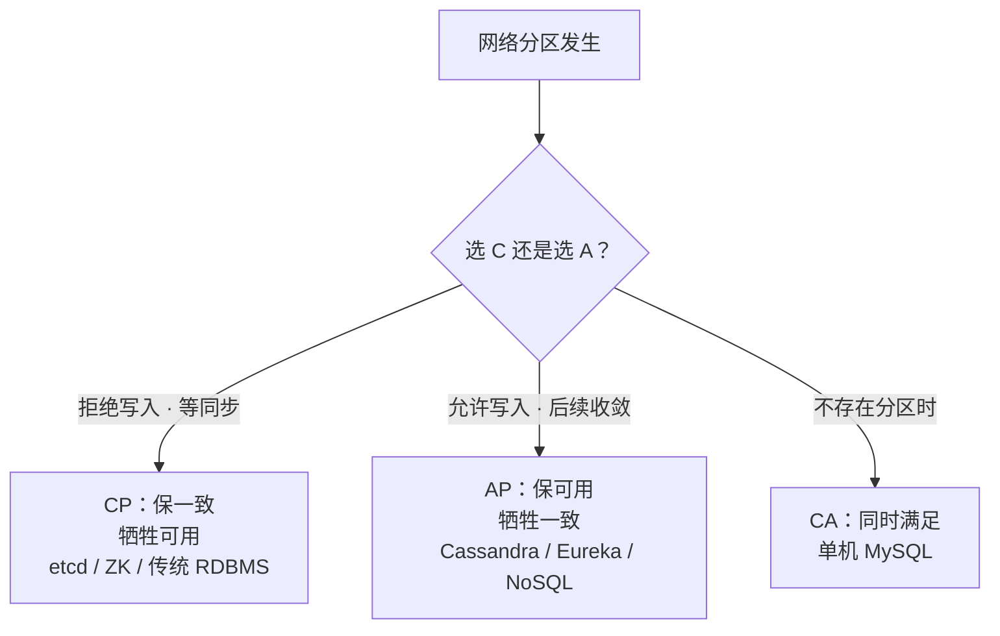

**读图**：P 不是你能选的——网络会分区是物理现实，真正要选的是分区那一刻要不要牺牲另一头。分区不发生时 C 和 A 都能要（单机 MySQL 就是 CA）。

**CP 和 AP 的工程取舍**：CP 系统在分区时拒绝写入——宁可让用户等，也不允许脑裂后的数据不一致。AP 系统在分区时仍允许读写——先让用户操作，分区恢复后再收敛。没有「又快又一致又高可用」的免费午餐——选了 CP 就得接受分区时不可用，选了 AP 就得接受中间不一致。

> ⚠️ **别混**：① CAP 不是「三选二」的菜单——P 是前提不是选项，真正要选的只有「分区时 C 还是 A」。② CP 不代表「平时不可用」——只在分区期间才牺牲，平时三个副本正常同步、可用性不低。③ 「AP 就一定不一致」也错——分区结束后会通过收敛机制达到最终一致（六节）。

> 📝 **面试**：问「CAP 怎么选」，答「P 是前提，分区时要在 C 和 A 之间选。账务/选主类系统选 CP（宁可拒写也不许脑裂），社交/推荐/服务发现选 AP（先让用户操作，后续收敛）」。不要答「三选二」——那是 2010 年被原作者自己纠正的误读。

### BASE 理论

**BASE = Basically Available + Soft state + Eventually consistent**：CAP 选了 AP 后的工程落地——基本可用（允许部分降级）、软状态（允许中间不一致）、最终一致（分区恢复后最终收敛）。这是 AP 系统的设计哲学，六节展开收敛机制。

---

## 三、模型：一致性谱系

> 🎯 **一句话**：一致性不是「有/没有」，是一条从强到弱的谱系——线性一致最贵，最终一致最便宜，中间还有因果一致。

### 线性一致性 ⭐🔥

**线性一致性（linearizability）**：所有操作有一个全局顺序，每个读操作看到的是「最近一次写操作的值」——仿佛数据只有一份副本，所有操作原子完成。

这是最强的单对象一致性模型。Paxos/Raft 的 `etcdctl get` 默认就是线性一致读——你要么读到最新已提交的值，要么读到错误，不会读到旧值。代价是每次写都要过半数节点确认。

> 💡 **打个比方**：一个保险箱只有一把真钥匙（写入要过半数同意开锁），你去看的时候要么看到最新放进去的东西，要么被锁着看不了——不会看到一个「昨天的」旧版本。

### 因果一致性

**因果一致性（causal consistency）**：有因果关系的操作保持全局顺序，没有因果关系的并发操作可以乱序。比如「先发帖再评论」这个因果关系保证评论一定在帖子之后可见，但两个无关的帖子可以不同节点不同顺序。比线性一致弱，但比最终一致强。需要靠**向量时钟（vector clock）**等机制追踪因果依赖（六节）。

### 最终一致性

**最终一致性（eventual consistency）**：如果没有新的写入，所有副本最终会收敛到同一个值——但**不保证什么时候**收敛、中间能不能读到旧值。这是 AP 系统的默认模型。Dynamo、Cassandra、DNS 都是最终一致——你改了一条 DNS，全球生效可能要几分钟。六节讲怎么收敛。

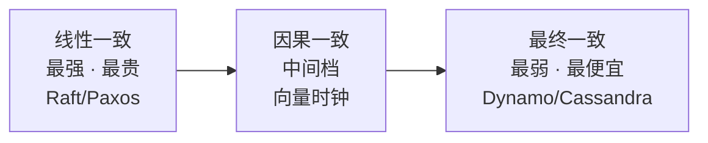

**读图**：从左到右一致性越来越弱、延迟越来越低、可用性越来越高——选哪个取决于业务对「读到旧值」的容忍度。支付要线性一致，社交 Feed 可以最终一致。

> ⚠️ **别混**：线性一致 ≠ 泛泛的「强一致」——线性一致是强一致的一种**具体定义**，面试要能说出「线性一致」这个精确名。因果一致 ≠ 最终一致——因果一致多了「有因果关系的操作保序」这一层约束。

### 顺序一致 vs 线性一致 ⭐

这两个最容易混。**顺序一致性（sequential consistency）**要求所有节点看到的操作顺序一致，但不要求顺序与真实时间吻合；**线性一致性**在顺序一致的基础上还要求「操作顺序与真实物理时间一致」（读看到的一定是最新写）。Raft 的 `etcdctl get --quorum` 是线性一致，`etcdctl get --serializable` 是顺序一致——只读 leader 内存、不等半数确认，更快但可能读到旧值。

> 📝 **面试**：问「强一致和最终一致的区别」，别只答「一个立即一个延迟」，要答到具体模型名——「线性一致要求读看到最新已提交值（仿佛单副本），最终一致只保证收敛、中间可读旧值；中间还有因果一致，保证有因果关系的操作保序」。

---

## 四、出生：共识算法 Paxos 与 Raft

> 🎯 **一句话**：共识（consensus）就是让多个节点对一个值达成一致——Paxos 是祖师爷但难懂，Raft 是工程首选因为它好懂。

### 共识问题是什么 ⭐

**共识（consensus）**：多个节点就一个值达成一致，且达成后不再改变。这是所有「主从复制」「选主」「分布式锁」的底座——本质上每次写入都是一次共识决议。FLP 说不存在完美共识算法，但工程上加超时和同步假设就能跑——Paxos（Lamport 1998）和 Raft（2014）就是两个工程方案。

共识和一致性是两个不同层面的问题：**共识**是「多节点对一个值达成一致」的**过程**，**一致性**是达成一致后「读到的值有多新」的**保证**（三节）。共识是手段，一致性是目标。

### Paxos：祖师爷 🔥

**Paxos** 分两阶段，消息交错让人眼花，但核心是「多数派」：

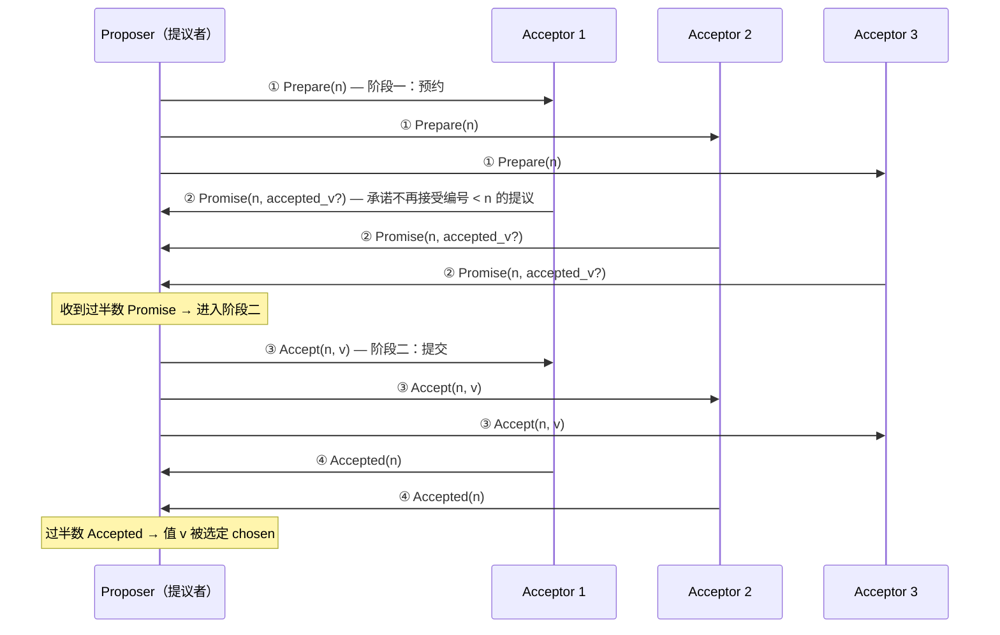

**读图**：两阶段的核心都是「过半数（majority）」——阶段一预约（Proposer 问 Acceptor「我用编号 n 提议，你们同意吗」），阶段二提交（Proposer 发出实际值 v，过半数 Acceptor 确认即选定）。编号 `n` 是递增的提议编号，用来防止两个 Proposer 互相覆盖。

**为什么过半数能保证一致性**：两个不同的多数派必然有交集（数学事实：3 个节点里两个「2 个」的子集必有 1 个重叠），所以不会有两个不同的值同时拿到过半数。

> ⚠️ **别混**：Paxos 的「两阶段」是共识协议的两阶段（Prepare/Accept），**不是** 2PC 的两阶段（Prepare/Commit）——两者完全不同，五节展开 2PC。

**Multi-Paxos**：单个 Paxos 只对一个值决议，要处理一个日志序列就是 Multi-Paxos。核心优化是**选一个稳定的 leader**（叫 Distinguished Proposer），省掉每次都跑阶段一——leader 连续跑阶段二即可，吞吐大增。但 Paxos 本身没规定怎么选 leader，工程实现各自补。

### Raft：工程首选 🎯⭐🔥

> 💡 **打个比方**：Raft 的设计思路是「让 Raft 比 Paxos 好懂」——它把共识拆成三个清晰的问题：谁是 leader（选举）、日志怎么同步（复制）、安全约束是什么（提交），每个问题独立解决。

**Raft** 是 etcd、Consul、TiKV、CockroachDB 的共识引擎。三个角色、一个 term、一条日志。

**角色（role）**：

- **Leader（领导者）**：唯一处理写入的节点，所有写请求先到 Leader。
- **Follower（跟随者）**：被动接收 Leader 的日志复制，不主动发起写。
- **Candidate（候选人）**：Follower 超时没收到 Leader 心跳，变 Candidate 发起选举。

**Term（任期）**：Raft 把时间切成单调递增的 term，每次选举 term +1。term 像逻辑时钟——过期的 term 的消息被忽略，防止旧 leader 复活。`etcdctl endpoint status` 的 `raft term` 就是这个值。

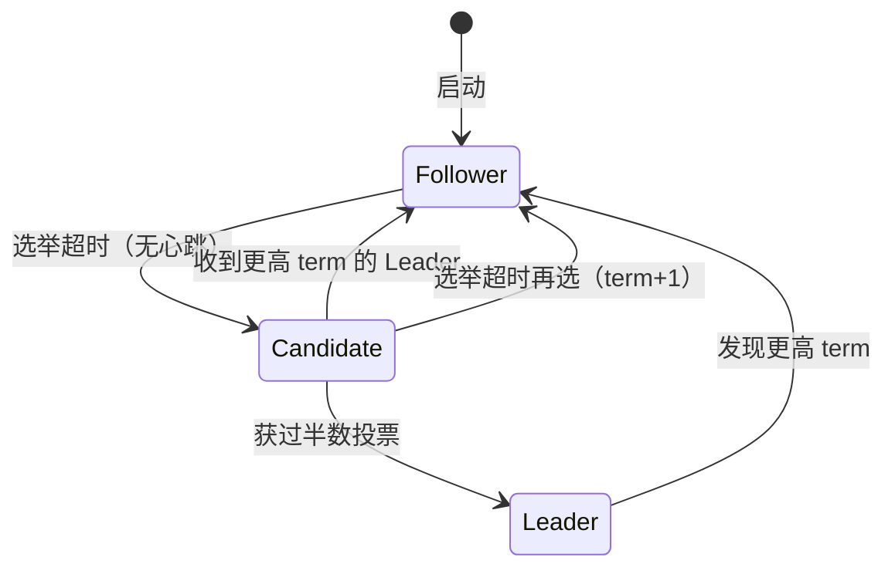

**读图**：角色转换全靠 term 和超时驱动——Follower 超时变 Candidate，Candidate 拿到过半票变 Leader，任何角色发现更高 term 立刻回 Follower。这就是「脑裂不会出现两个同 term 的 Leader」的原因。

### Raft 日志复制与提交 🔧

写请求到 Leader 后，走日志复制 + 过半提交：

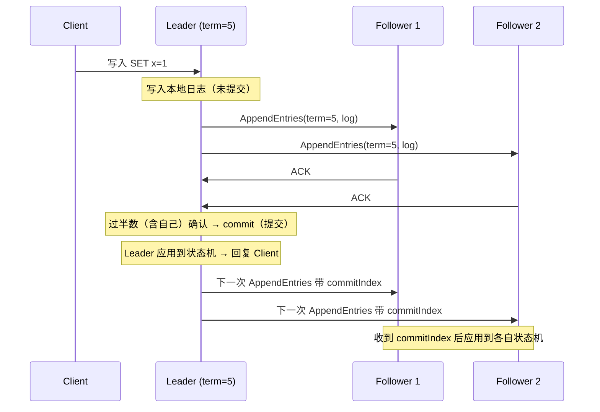

**读图**：日志先写到 Leader 本地、复制到过半数 Follower、Leader 提交并回复客户端、后续心跳带上 commitIndex 让 Follower 也提交——这就是线性一致读的来源（Leader 的状态机一定有最新已提交数据）。尚未过半确认的日志叫 uncommitted（未提交），过半后叫 committed（已提交）。

> ⚠️ **别混**：① 「已复制」≠「已提交」——日志到了过半数节点叫已复制，Leader 标记 commit 后才算已提交、才会回复客户端成功。② Leader 提交的是**当前 term** 的日志，不能直接提交**旧 term** 的日志（Raft 的安全性约束）——旧 term 日志要等到新 term 的日志一起被过半复制后才能间接提交。

### 现场：看 etcd 的 Raft 状态 🔧

> 🔍 **现场**：etcd 集群写入慢或主从切换后不确定谁是 leader。

```bash
etcdctl endpoint status --cluster -w table
# +----------------+------------------+---------+---------+-----------+------------+-----------+------------+--------------------+--------+
# | ENDPOINT       |        ID        | VERSION | DB SIZE | IS LEADER | IS LEARNER | RAFT TERM | RAFT INDEX | RAFT APPLIED INDEX | ERRORS |
# +----------------+------------------+---------+---------+-----------+------------+-----------+------------+--------------------+--------+
# | 10.0.0.1:2379  | 8e9e...c0        |  3.5.0  |  2.1 MB |      true |     false  |        12 |       1024 |               1024 |        |
# | 10.0.0.2:2379  | 91bc...d1        |  3.5.0  |  2.1 MB |     false |     false  |        12 |       1024 |               1024 |        |
# | 10.0.0.3:2379  | a3f5...e2        |  3.5.0  |  2.1 MB |     false |     false  |        12 |       1024 |               1024 |        |
# ← IS LEADER=true 只有一个；RAFT TERM 三台一致；RAFT INDEX=已复制，APPLIED INDEX=已提交，两者相等说明复制和提交都追上了
```

三个关键字段一眼定状态：**IS LEADER** 只有一个 true（多了就是脑裂，少了就是没选出 leader）；**RAFT TERM** 三台一致；**RAFT INDEX vs APPLIED INDEX** 差距大说明日志复制了但没提交到状态机。

### Raft vs Paxos 怎么选 ⭐

| 对比 | **Paxos / Multi-Paxos** | **Raft** |
|------|------------------------|----------|
| 设计目标 | 理论完整 | 工程好懂 |
| Leader | 协议不规定，实现补 | 协议内置选举 |
| 日志 | 允许日志空洞 | 强约束：日志连续无空洞 |
| 典型实现 | Chubby、Spanner | etcd、Consul、TiKV |

> 📝 **面试**：问「为什么用 Raft 不用 Paxos」，答「Raft 把共识拆成选举、日志复制、安全三个独立问题，比 Paxos 好理解也好实现——Paxos 允许日志空洞、没规定怎么选 leader，工程补丁太多。etcd/TiKV 选 Raft 不是因为 Raft 更强，是因为更好写、更少出 bug」。

### 收束：Raft 凭什么「安全」

Raft 的安全性靠三条铁律，面试背出来：

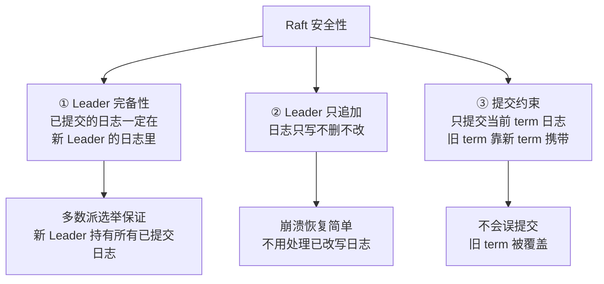

**读图**：① Leader 完备性是最核心的——选举时必须拿到过半数票，而已提交日志一定在过半数节点上，两个多数派有交集，所以新 Leader 一定有所有已提交日志。② Leader 只追加让崩溃恢复极简（日志像 ledger，只往后写）。③ 提交约束防止「旧 term 日志被误提交后又覆盖」的边界 bug。

> ⚠️ **别混**：Raft 的过半数保证的是**安全性（safety）**——不会丢已提交数据、不会出两个同 term 的 Leader；**不保证活性（liveness）**——理论上选举可能永远超时重来（FLP 的阴影），工程上靠随机超时让两个人同时超时的概率极低。

> 📝 **面试**：背这三条时按「**选举保证完备 → 日志只追加 → 提交只认当前 term**」分组，比背整段论文管用。最后补一句「Raft 保证的是安全性，活性靠随机超时在工程上逼近」。

---

## 五、分叉：分布式事务

> 🎯 **一句话**：一个操作要改两个独立的资源（两个 DB、DB + 消息队列），靠单机事务管不了——分布式事务方案就是填这个坑。

### 为什么需要分布式事务 ⭐

**分布式事务（distributed transaction）**：一个操作涉及多个独立资源，要么全成功、要么全回滚。典型场景：转账扣 A 加 B、下单扣库存 + 扣余额 + 发消息。单机 ACID 事务保证不了跨资源，才需要分布式事务方案。

分布式事务和共识是两个不同的问题：**共识**解决「多个副本要在同一个值上达成一致」，**分布式事务**解决「多个独立资源要原子提交或回滚」。共识是副本间的事，事务是资源间的事。

### 2PC：两阶段提交 🎯⭐🔥

> 💡 **打个比方**：协调人先问三个参与者「准备好了吗」（Prepare），三个都说 OK，协调人再喊「提交」（Commit）；任何一个说不 OK 就喊「回滚」（Abort）。问题：协调人在喊完 Prepare 后、喊 Commit 前挂了，三个参与者就卡在「锁着资源不敢动」的状态。

**2PC（Two-Phase Commit，两阶段提交）**：一个协调者（coordinator）+ 多个参与者（participant）。

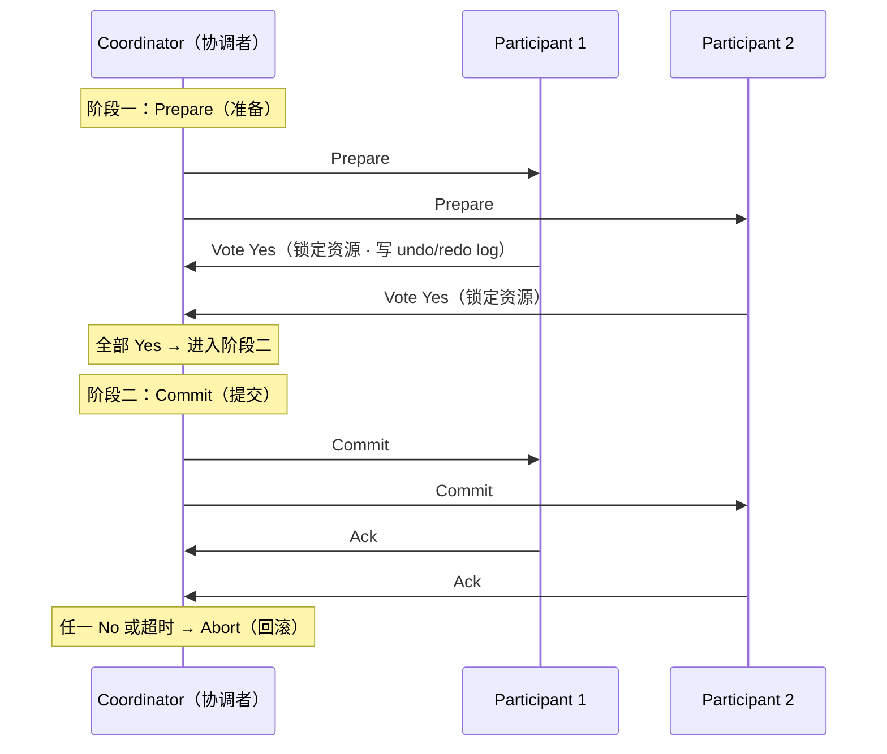

**读图**：阶段一参与者锁资源、写 undo log（能回滚的依据）、回 Yes/No。阶段二全 Yes 才 Commit，任一 No 就 Abort。卡点在两个地方：协调者在两阶段之间挂了 → 参与者**阻塞（blocking）**，锁着资源干等；参与者回复后挂了 → 协调者不知道该 Commit 还是 Abort。

> ⚠️ **别混**：2PC 的「两阶段」是 Prepare + Commit；Paxos 的「两阶段」是 Prepare + Accept——**同名不同物**，面试别说串。2PC 解决的是跨资源原子性，Paxos 解决的是多副本一致性，是两个不同问题。

**2PC 的致命缺陷**：① 协调者单点故障 → 全体阻塞；② 同步阻塞 → 参与者锁资源等协调者，并发吞吐差；③ 不确定状态 → 网络分区时协调者和参与者互不知道对方状态。XA 就是 2PC 的工业实现（MySQL XA、Oracle XA），性能差所以多数互联网系统不用它。

### 3PC：三阶段提交

**3PC（Three-Phase Commit）**：在 2PC 的 Prepare 前加一个 CanCommit（探测阶段），并引入超时——参与者等协调者超时后自己 Commit（假定「前面既然同意了就提交」）。目的是减少阻塞。实际很少用——引入超时只是把「阻塞」变成「可能不一致」，且仍不能完全解决网络分区下的脑裂。面试知道「3PC 想解决 2PC 阻塞但没成功」即可。

### TCC：业务补偿 ⭐

> 💡 **打个比方**：不是锁资源等所有人，而是先扣钱（Try），后面发货失败就退钱（Cancel），发货成功就确认扣钱（Confirm）——每个操作都要写「能回滚的」逻辑。

**TCC（Try-Confirm-Cancel）**：把一个分布式事务拆成每个参与方都实现三个接口：

- **Try**：预留资源（如冻结余额、预占库存）。
- **Confirm**：确认使用预留资源（真正扣款）。
- **Cancel**：释放预留资源（解冻余额、释放库存）。

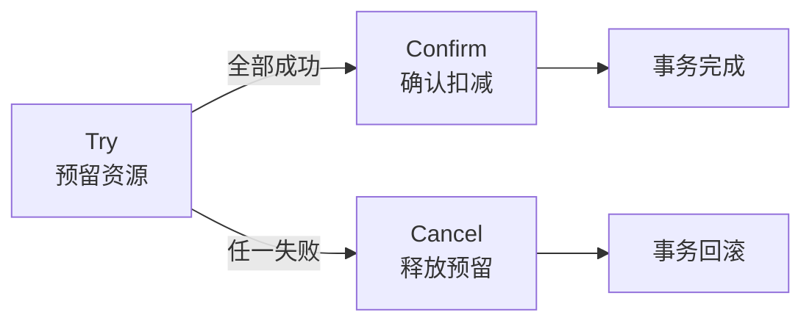

**读图**：Try 先预留，全部成功才 Confirm，任一失败就 Cancel——每个参与方必须自己实现回滚逻辑（不是靠数据库 undo log），业务侵入大但性能远好于 2PC（不锁资源，各服务独立提交）。

> ⚠️ **别混**：TCC 的 Try 不是「执行业务」，是「预留资源」——比如 Try 是冻结余额不是真扣款，Confirm 才真扣。如果 Try 就真扣了，Cancel 就没法退——这是 TCC 最常见的写错方式。

### Saga：长事务编排

**Saga**：把长事务拆成一串本地事务 T1→T2→...→Tn，每个 Ti 都有补偿动作 Ci。任一步失败就反序执行补偿：失败在 T3 → 执行 C2→C1 回滚。适合「长流程」——订单要走创建→支付→发货→通知，每步耗时可能跨秒甚至分钟，用 2PC 锁这么久不现实。代价是**最终一致**而非 ACID，中间状态可见。

两种编排方式：**Choreography（编排式）**——各服务靠事件触发下一步，无中心协调者（耦合低但难追踪）；**Orchestration（协调式）**——一个 Saga 协调器指挥各步（可控但中心化）。Seata 的 Saga 模式属于后者。

### 四种方案怎么选 ⭐

| 方案 | 一致性 | 性能 | 业务侵入 | 适用 |
|------|--------|------|----------|------|
| **2PC / XA** | 强一致 | 差（锁资源） | 低 | 短事务 · 传统金融 |
| **3PC** | 弱于 2PC | 略好 | 低 | 基本不用 |
| **TCC** | 强一致 | 好 | **高**（写三份接口） | 互联网交易 · 支付 |
| **Saga** | 最终一致 | 好 | 中（写补偿） | 长流程 · 订单链 |

> 📝 **面试**：问「分布式事务怎么选」，答「短事务且能改业务选 TCC（强一致 + 性能好），长流程选 Saga（最终一致 + 不锁资源），传统金融且不改业务用 XA/2PC（强一致但慢），3PC 基本不提」。最后补一句「没有银弹——TCC 性能好但要每个接口写三份，Saga 灵活但只保证最终一致」。

---

## 六、收敛：最终一致与辅助机制

> 🎯 **一句话**：AP 系统选了可用性就要接受「中间不一致」，靠 Quorum/NWR、向量时钟、Gossip、分布式锁来收敛和管理。

### Quorum 与 NWR 🔥

> 💡 **打个比方**：三份账本抄三间屋。写的时候抄 2 份就算成功（W=2），读的时候看 2 份取最新的（R=2）——只要 W+R > N（2+2>3），读和写的多数派必有交集，就能读到最新写的值。

**Quorum 机制**：N 个副本，每次写要求 W 个副本确认，每次读要求 R 个副本响应。**当 W + R > N 时，读写多数派有交集，保证读到最新已写数据**。这就是 **NWR 模型**。

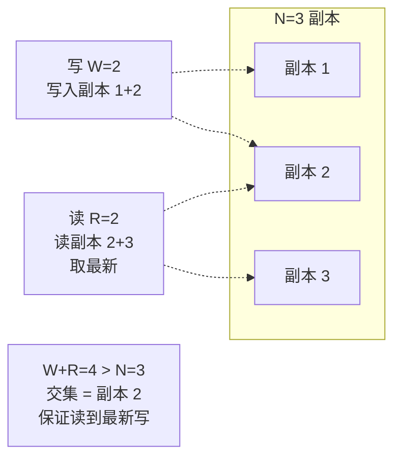

**读图**：写的多数派 `{1,2}` 和读的多数派 `{2,3}` 的交集是副本 2——它一定有最新写的值。调 W 和 R 的权衡：W 大 → 写慢但一致性高；R 大 → 读慢但一致性高；W+R ≤ N → 可能读到旧值（最终一致）。

Dynamo、Cassandra 的 `consistency level` 就是 NWR：`ONE`（R=1）、`QUORUM`（R=过半数）、`ALL`（R=N）——按业务调。Raft/Paxos 本质也是 NWR（N=副本数，W=R=过半数）。

> ⚠️ **别混**：Quorum 保证的是「能读到最新值」**当且仅当** W+R>N。W=1, R=1, N=3 → 2 < 3，不保证，可能读到旧值——这是 AP 系统默认配置。Raft 的「过半数」是 W=R=⌊N/2⌋+1，恰好满足 W+R>N，所以它是线性一致的。

### 向量时钟

**向量时钟（vector clock）**：每个节点维护一个 `[n1:5, n2:3, n3:7]` 的向量，每次本地操作自己那维 +1，通信时带着向量；收方取逐维 max。用这个能判定因果关系：A 的向量逐维 ≥ B → A 因果后于 B；否则并发（concurrent）。解决的是最终一致系统里「两个并发写谁先谁后」的问题——Dynamo 旧版用它检测冲突，让应用层解决（比如让用户选哪个版本）。Raft 不需要它——Leader 串行化所有写，天然有全局顺序。

### Gossip 协议

> 💡 **打个比方**：办公室 30 个人传话，每个人每秒随机找另一个人说「我知道了这些」，几轮后所有人都知道了——不需要中心广播，靠随机传染。

**Gossip（八卦协议）**：每个节点周期性随机选几个节点交换状态信息，像传染病一样扩散。特点：最终一致（O(log N) 轮收敛）、去中心化、抗节点故障。Cassandra 用它做成员发现和元数据传播，Consul 用它做健康检查传播。代价：收敛有延迟、可能中间有节点状态不一致——但这正是 AP 系统的取舍。和 Raft 的区别：Gossip 没有 leader、不保证线性一致，只保证最终收敛。

### 分布式锁 ⭐🔧

**分布式锁（distributed lock）**：跨进程互斥访问共享资源。三种常见实现：

- **Redis 单节点锁**：`SET key value NX PX 30000`（NX=不存在才设，PX=过期 30s）。简单快，但主从切换可能丢锁——锁还没同步到从节点主就挂了，新主会发同一把锁。
- **Redis RedLock**：向 N（奇数，常 5）个独立 Redis 实例请求锁，过半数成功才算拿锁——降低单点丢锁概率。争议大（Martin Kleppmann 质疑其时钟假设），生产慎用。
- **etcd / ZK 锁**：基于 Raft/ZAB 共识的锁，线性一致、不会脑裂——但延迟高于 Redis。`etcdctl lock` 或 ZK 的临时有序节点。

```bash
# etcd 分布式锁
etcdctl lock my-lock --ttl=30 echo "持有锁，干活"
# 持有锁，干活    ← 拿到锁后执行子进程，进程退出自动释放锁
```

> ⚠️ **别混**：Redis 单节点锁在主从切换时**不保证安全**——主挂时锁可能没复制到从，新主会发出同一把锁给另一个人。要绝对安全用 etcd/ZK 锁；要高吞吐且容忍极小概率丢锁用 Redis。不要用 `setnx` + `expire` 两步——中间挂了锁不会过期（要用原子 `SET NX PX`）。

> 📝 **面试**：问「分布式锁怎么实现」，答「① Redis 单节点快但主从切换可能丢锁；② RedLock 降概率但有争议；③ etcd/ZK 基于 Raft/ZAB 最安全但慢。选哪个看业务对丢锁的容忍度——支付选 etcd，限流选 Redis」。

### 收敛小结

AP 系统选了可用性，就用这些机制补「最终一致」：Quorum 控制读写多少副本才能见到最新、向量时钟追踪并发写的因果、Gossip 在节点间传播状态、分布式锁在跨进程互斥。这些不是「替代强一致」——是把「弱一致」管到可用。

---

## 七、作战：定责

> 🎯 **一句话**：分布式系统的故障大多表现为「脑裂」「数据不一致」「写不进去」——先看是不是分区、再看 leader 在不在、最后看事务卡在哪阶段。

### 定责决策树

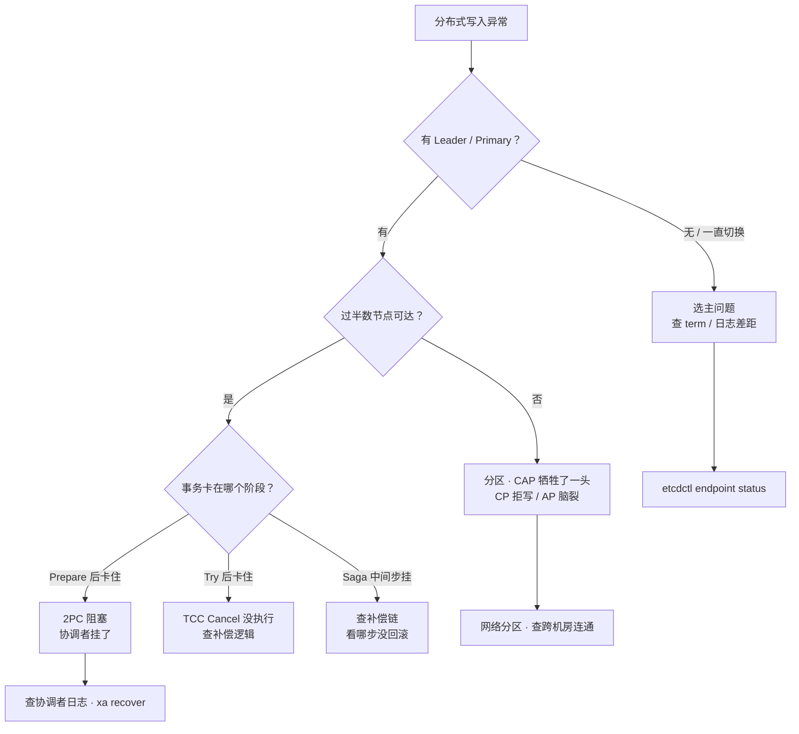

**读图**：第一刀先看有没有 leader——没有就查选主（term 差距、日志差距），有就查分区和事务。每条分支对应一个真实的故障模式，不是抽象类别。

### 现象 · 先做 · 别做

| 现象 | 先做 | 别做 |
|------|------|------|
| 写不进去 | 查 leader 在不在、过半数可达 | 先重启节点 |
| 两个 primary | 查是不是脑裂 / 分区 | 当成「正常的负载均衡」 |
| 读到旧值 | 查读走的哪个副本 / 一致性级别 | 当成「缓存问题」 |
| 2PC 卡住 | 查协调者日志、看参与者锁 | 直接 kill 参与者 |
| TCC 补偿没跑 | 查 Confirm/Cancel 调用链 | 假设「Try 成功就完事」 |
| etcd term 一直涨 | 查网络抖动 / leader 压力 | 当成「正常」 |
| Raft index 落后 | 查慢节点 / 磁盘 IO | 直接摘掉慢节点 |
| 分布式锁丢锁 | 查锁实现是否安全（Redis vs etcd） | 加大过期时间凑数 |

### 60 秒剧本 🔧

> 🔍 **现场**：接到「分布式系统写不进去 / 数据不一致」，别先抓包，60 秒走完这条线再下结论。

```text
① 0–10s  写不进去还是不一致？   先确认是 CP 拒写（设计如此）还是 AP 脑裂（故障）
② 10–30s 查 leader：            etcdctl endpoint status --cluster -w table → IS LEADER / RAFT TERM / INDEX
③ 30–45s 定型：                 A 分区（过半不可达）/ B 选主（term 涨 / 无 leader）/ C 事务卡（2PC/TCC/Saga）
④ 45–60s 定责 + 验证：           A 查跨机房连通 · B 查慢节点和日志差距 · C 查协调者/补偿链
```

---

## 八、收口

### 命令速查 🔧

```bash
# etcd Raft 状态
etcdctl endpoint status --cluster -w table   # IS LEADER / RAFT TERM / RAFT INDEX / APPLIED INDEX
etcdctl alarm get                            # 查集群告警（空间不足等）
# etcd 分布式锁
etcdctl lock my-lock --ttl=30 echo "持有锁"  # 拿锁执行，退出自动释放
# etcd 线性一致读 vs 顺序读
etcdctl get k --quorum                       # 线性一致读（默认）
etcdctl get k --serializable                # 顺序读（只读 leader 内存，更快但可能读旧值）
# MySQL XA 事务排查（2PC）
xa recover;                                  # 查未提交的 XA 事务
```

### 面试锚点

| 问 | 30 秒答 |
|----|---------|
| CAP 怎么选？ | P 是前提，分区时在 C 和 A 之间选。账务 / 选主选 CP，服务发现 / 社交选 AP。不是三选二。 |
| FLP 说了什么？ | 异步网络 + 一个节点可能故障 → 不存在保证终止 + 一致的共识算法。工程靠超时 / 同步假设绕过。 |
| 线性一致和最终一致差在哪？ | 线性一致读看到最新已提交值（仿佛单副本），最终一致只保证收敛、中间可读旧值。 |
| Paxos 两阶段？ | Prepare（预约 + Promise）+ Accept（提交 + Accepted），核心是过半数多数派保证一致。 |
| Raft 三个角色？ | Leader / Follower / Candidate，靠 term 和超时驱动转换。 |
| Raft 日志复制流程？ | 写到 Leader → 复制到过半 Follower → Leader commit → 回复客户端 → 后续心跳带 commitIndex 让 Follower 提交。 |
| 为什么过半数能保证一致？ | 两个多数派必有交集，不会有两个不同值同时过半。 |
| Raft 凭什么安全？ | 三条：Leader 完备性（已提交日志一定在新 Leader）、日志只追加、只提交当前 term。 |
| 2PC 和 Paxos 两阶段同名吗？ | 不同。2PC=Prepare+Commit（跨资源原子性），Paxos=Prepare+Accept（多副本一致性）。 |
| 2PC 缺陷？ | 协调者单点 → 阻塞、同步锁资源 → 吞吐差、分区时不确定。 |
| TCC 怎么做？ | Try（预留）+ Confirm（确认）+ Cancel（释放），每方写三份接口，业务侵入大但性能好。 |
| Saga 是什么？ | 拆成一串本地事务 + 补偿动作，最终一致，适合长流程。 |
| Quorum / NWR？ | N 副本，写 W 读 R，W+R>N 保证读到最新。Raft 的过半数就是 W=R=⌊N/2⌋+1。 |
| 分布式锁怎么选？ | Redis 快但主从切换可能丢锁；etcd / ZK 基于 Raft/ZAB 最安全但慢。看业务容忍度。 |
| Gossip 是什么？ | 节点随机交换状态，像传染病扩散，最终一致、去中心化，Cassandra / Consul 用。 |
| 向量时钟？ | 每节点维护向量，判断因果序 vs 并发，Dynamo 用它检测冲突。 |
| 顺序一致 vs 线性一致？ | 顺序一致只要求全局顺序一致，不要求与真实时间吻合；线性一致还要求与物理时间一致。 |

### 易错一句话对照

- CAP 是三选二 → P 是前提，分区时选 C 或 A
- AP 就一定不一致 → 分区后最终一致（Quorum / Gossip 收敛）
- CP 平时不可用 → 只在分区时牺牲，平时三个副本正常
- FLP 说不可能达成共识 → 最坏情况下无法保证终止，工程加超时绕过
- Paxos 两阶段 = 2PC 两阶段 → 同名不同物，前者多副本一致性，后者跨资源原子性
- 过半数保证活性 → 保证安全性（一致性），活性靠随机超时逼近
- 已复制 = 已提交 → 已复制是到了过半节点，commit 才是已提交
- TCC Try 就扣款 → Try 是预留资源（冻结），Confirm 才真扣
- Quorum 一定读到最新 → 只有 W+R>N 才保证，W+R≤N 可能读旧
- Redis 分布式锁绝对安全 → 单节点主从切换可能丢锁，安全用 etcd / ZK
- RedLock 解决了所有问题 → 有争议（时钟假设），生产慎用
- Raft 比 Paxos 更强 → 一样强，Raft 只是更好懂、更好实现
- Saga 保证 ACID → 只保证最终一致，中间状态可见
- 3PC 解决了 2PC 阻塞 → 只是降低概率，没完全解决
- etcd get 一定线性一致 → 默认是，但 --serializable 是顺序读、可能读旧值
- 因果一致 = 最终一致 → 因果一致多了「有因果的操作保序」，更强
- Raft term 会回退 → term 只增不减，旧 Leader 见更高 term 立转 Follower
- Leader 写了就算提交 → 要过半复制 + commit 才算提交，崩在新 Leader 上会回滚未提交日志
- ZAB 和 Raft 完全一样 → 都过半多数派，但 ZAB 用 epoch 且有「同步阶段」先补齐 Follower 日志
- etcd 永远线性一致读 → leader 切换瞬间可能短暂不可用，要 client 重试
- 分布式锁有 TTL 就绝对安全 → TTL 续约窗口 + fence token 才防「旧锁持有人已 GC 但还以为持有」
- BASE 的最终一致 = 不要一致性 → 仍要保证收敛，只是中间窗口允许读旧值，不是放任丢

### 数字墙

> FLP：异步网络 + **1** 节点故障 → 无保证终止 + 一致的共识 · CAP：分区时 **C 或 A** 二选一 · Quorum：**W+R>N** 保证线性一致 · Raft 过半数：W=R=**⌊N/2⌋+1** · Raft 角色 **3** 种（Leader / Follower / Candidate） · Paxos 两阶段：**Prepare + Accept** · 2PC 两阶段：**Prepare + Commit** · TCC 三接口：**Try + Confirm + Cancel** · 一致性 **4** 级谱系（线性 / 顺序 / 因果 / 最终） · Gossip 收敛 O(**log N**) 轮

---

## 合上书

- [ ] **默画一节的图**：入口（CAP 定性）→ 模型（一致性谱系）→ 出生（Paxos/Raft）→ 分叉（分布式事务）→ 收敛（最终一致）；`etcdctl endpoint status` 照哪段。
- [ ] **口述前提**：FLP 说了什么、CAP 怎么选、为什么 P 不是选项、BASE 是什么。
- [ ] **口述模型**：线性一致 / 因果一致 / 最终一致各保证什么、顺序一致和线性一致差在哪。
- [ ] **默画 Paxos 两阶段**：Prepare（预约 + Promise）→ Accept（提交 + Accepted），写清过半数的含义。
- [ ] **默画 Raft 选举与日志复制**：角色转换图（Follower → Candidate → Leader）+ 日志复制时序（写 Leader → 过半复制 → commit → 回复 → Follower 提交）。
- [ ] **口述 Raft 安全性**：三条铁律（Leader 完备性、日志只追加、只提交当前 term）+ 过半数为什么保证一致。
- [ ] **口述分布式事务**：2PC 流程与缺陷、TCC 三接口、Saga 补偿链、四种方案怎么选。
- [ ] **口述收敛机制**：Quorum / NWR（W+R>N）、向量时钟判因果、Gossip 传播、分布式锁三种实现。
- [ ] **定责**：写不进去 / 脑裂 / 读到旧值各走哪条决策树分支、各查什么。

下一章：[分库分表与中间件](../07-分库分表与中间件/)。MySQL 主从：[02-01-04](../01-MySQL/04-主从与高可用/)。Redis 哨兵：[02-02](../02-Redis/)。Kafka ISR：[02-03](../03-Kafka/)。
