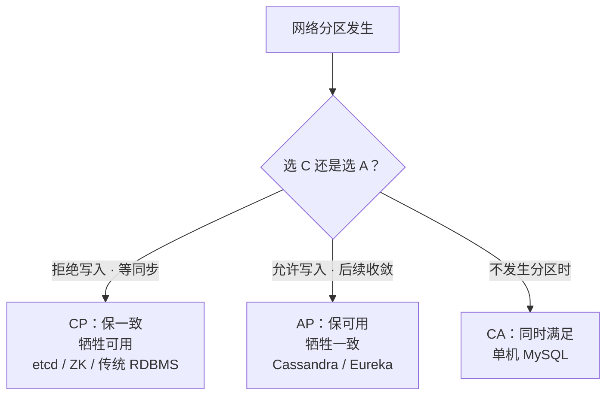
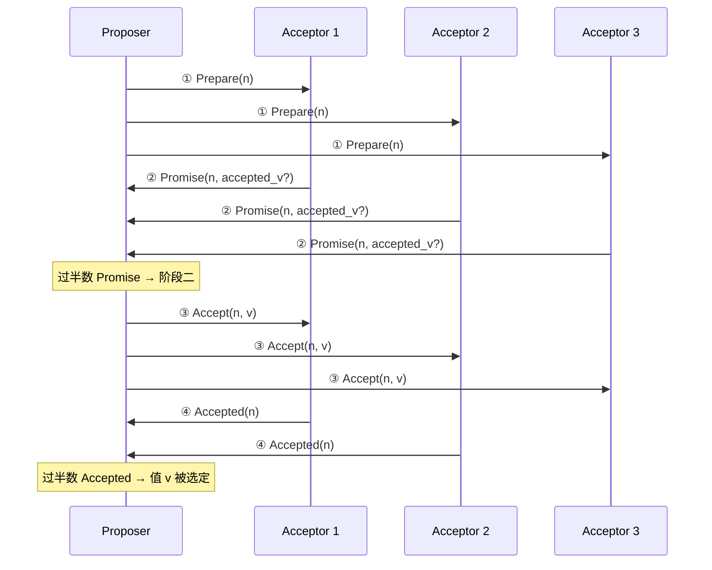
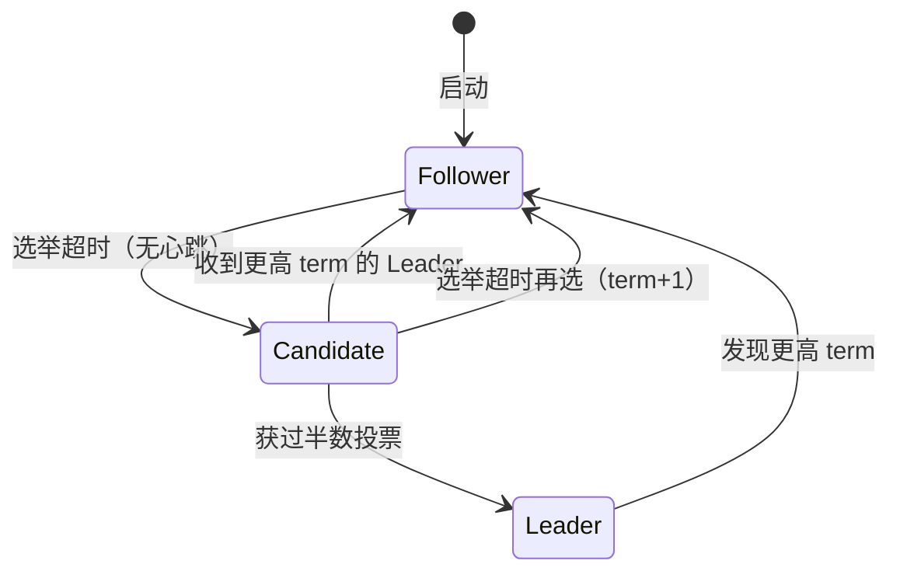
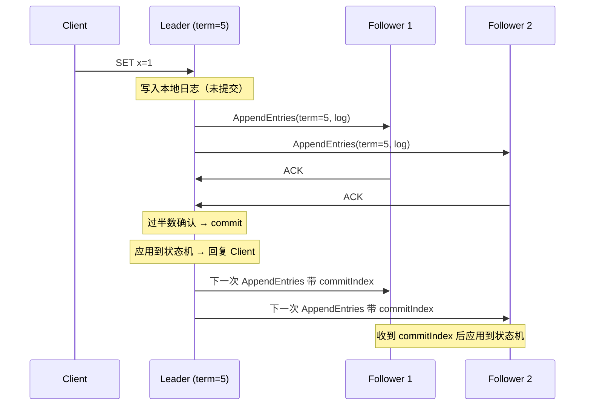
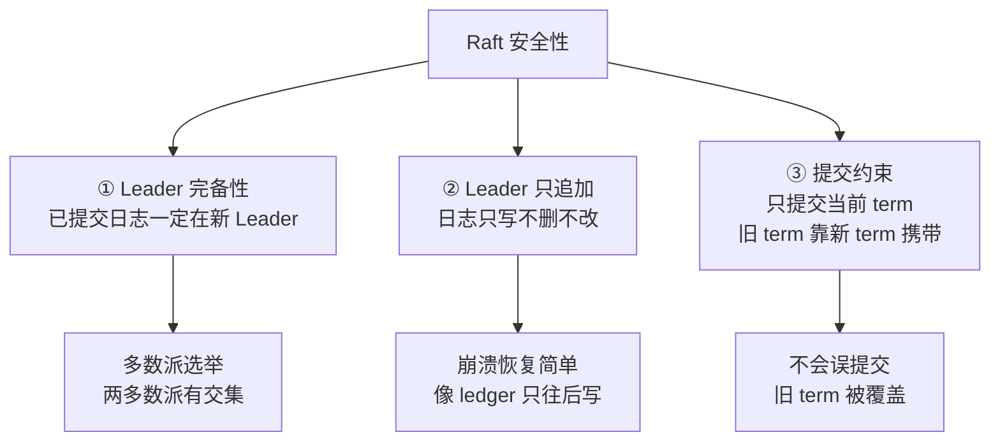
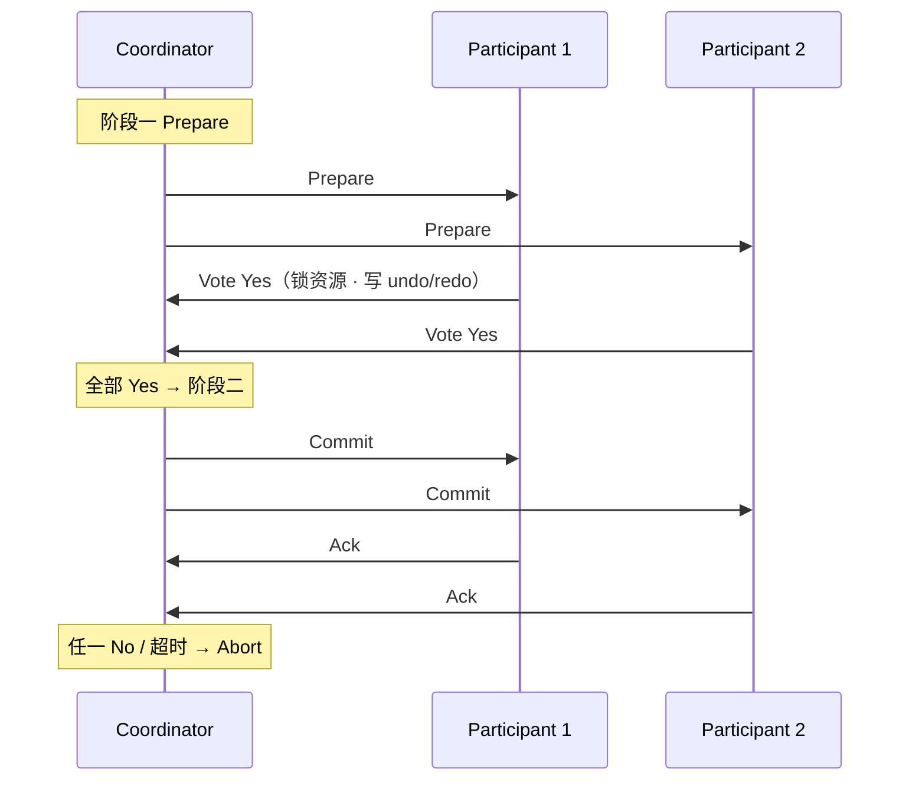
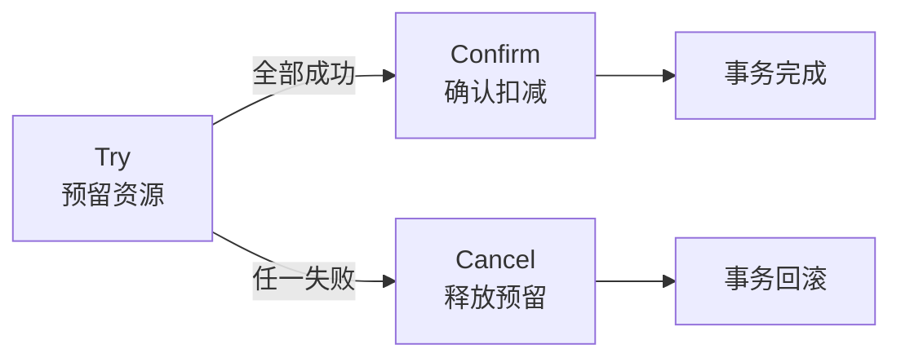
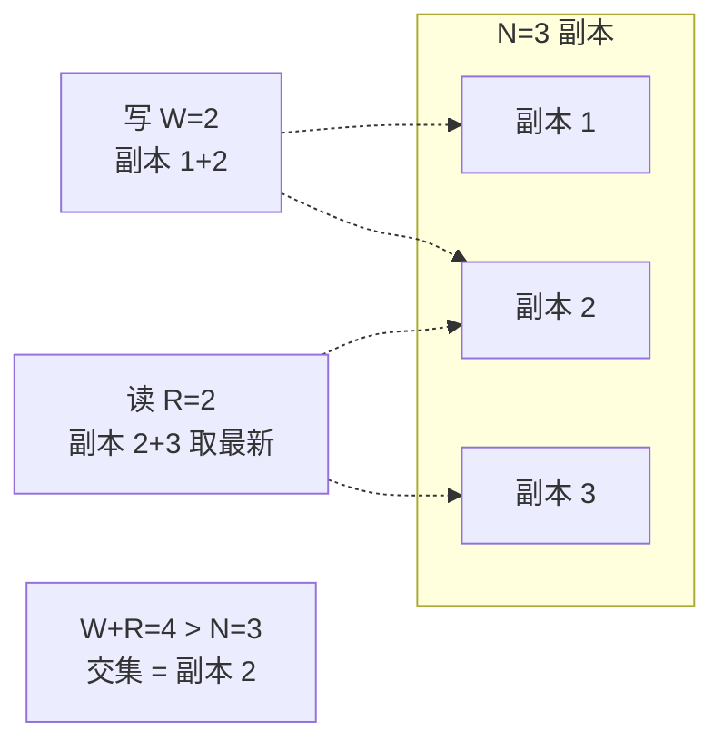
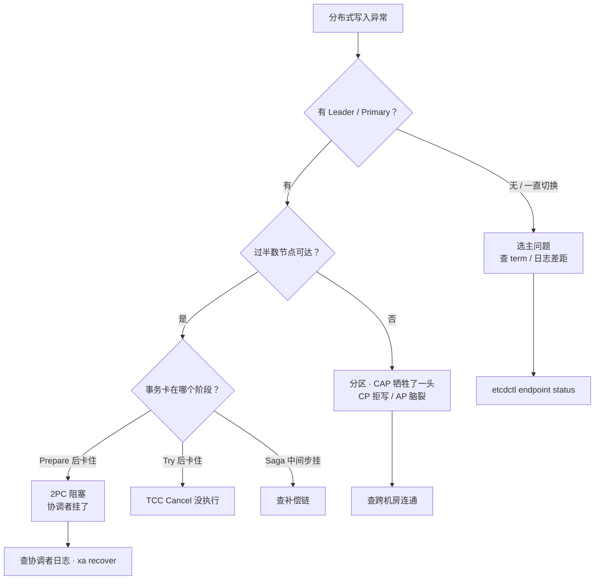

# 分布式理论与一致性

> 凌晨三个节点有两个 ACK 慢了 200ms，主从切换后两个「主」并存——业务喊「明明写成功了」，DBA 喊「数据丢了」，群里已经有人要「先切回旧主」「先把写关掉」。
> **本章回答**：一次分布式写入从发出到多节点一致，会过哪五关、在哪一段会分裂、现场怎么一眼定责。
> **不讲**：Redis 哨兵与主从 → [02](../02-Redis/)；Kafka ISR 与 Offset → [03](../03-Kafka/)；MySQL 主从延迟 → [01-MySQL/04](../01-MySQL/04-主从与高可用/)。

**标记**：🎯重点 · 🔥难点 · ⭐常考 · 🔧实操

---

## 一、一张图：一次分布式写入的一生

> 🎯 **一句话**：一个写请求从客户端到「多节点一致」，要过五道关——前提（CAP）、模型、共识、事务、收敛。


- 📖 **读图**
  - 🛤️ 主线是一次写入的一生：五关串成时间线，每节讲一段
  - ⭐ 「入口」先问 CAP 天花板——别答「三选二」（Q1）；`etcdctl endpoint status` 是 X 光机，照「卡在哪一段」

本节对应练习题 **Q1、Q14**。带着这张图出发——第一关：理论天花板。

---

## 二、前提：FLP 与 CAP

> 🎯 **一句话**：FLP 说异步网络下不可能同时做到「终止」和「一致」；CAP 说分区时只能选 C 或 A——它们是一致性的理论天花板。

开篇「两个主」——根因往往出在「分区时选了什么」。先把天花板钉死。

### 🚫 FLP 不可能定理 🔥

> 💡 **打个比方**：三个将军派传令兵商量进攻时间，传令兵可能迟到甚至永远不到。你永远分不清「对方死了」还是「对方慢了」——所以没法既保证「一定出结果」又保证「结果一致」。

**FLP 不可能定理（Fischer-Lynch-Paterson）**：在**异步网络**（消息延迟无上限）中，只要有一个节点可能故障，就不存在共识算法能同时满足：

- **Termination（终止性）**：所有非故障节点最终做出决定
- **Agreement（一致性）**：所有决定值相同
- **Validity（合法性）**：决定值是某个节点提议过的

- 🔑 **关键在异步定义**：延迟**无上限** → 永远分不清「死」与「慢」→ 不敢贸然决定
- 🛠️ **工程绕过**：加超时 / 同步假设 / 随机化——Paxos/Raft 假设「最终同步」，Raft 还靠选举超时推动进展

#### ❓ 为什么 FLP 不等于「分布式不可能共识」？

- ❌ **误读**：FLP = 分布式系统永远达不成共识
- ✅ **正解**：最坏情况下无法**同时保证**终止 + 一致；工程加超时后「对方死了」可探测，共识就有终止希望
- 📎 Paxos/Raft 能跑，本身就是绕过证据

> ⚠️ **别混**：FLP 不是工程禁令；是「异步 + 一个节点可能挂 → 无法保证终止」的理论结果。

### ⚖️ CAP 定理 ⭐🔥

很多人答「CAP 是三选二」——**错了**，那是 2010 年被原作者纠正的误读。

> 💡 **打个比方**：账本抄三份放三间屋。一间着火了（分区），你要么继续开门写但三本可能不一样（选 A），要么锁门等火灭再同步但客人写不了（选 C）——着火期间只能选一头。

🔥 **CAP（Brewer's theorem）**：网络分区（P）发生时，只能在一致性（C）和可用性（A）之间选一个。

- **C（Consistency）**：所有节点同一时刻看到相同数据
- **A（Availability）**：每个非故障节点的请求都能得到响应（不超时拒绝）
- **P（Partition tolerance）**：分区时系统仍能运作——**物理现实，不是菜单项**



- 📖 **读图**
  - P 不是你能选的；真正要选的是分区那一刻牺牲哪一头
  - 分区不发生时 C 和 A 都能要（单机 MySQL = CA）

#### ❓ 为什么不是「三选二」？

- ❌ **菜单式误读**：C、A、P 任选其二
- ✅ **正确口径**：P 是前提；分区时只在 **C 或 A** 二选一
- 🏗️ **工程取舍**
  - **CP**：分区时拒写——宁可等，不许脑裂后的不一致（账务 / 选主）
  - **AP**：分区时仍读写——先让用户操作，恢复后再收敛（社交 / 服务发现）
- ⚠️ **两句别再说错**：CP ≠「平时不可用」（只在分区期牺牲）；AP ≠「永远不一致」（分区后靠六节收敛）

> 📝 **面试**：问「CAP 怎么选」，答「P 是前提，分区时选 C 或 A。账务/选主选 CP，社交/服务发现选 AP」。不要答「三选二」。⭐

### 🧱 BASE 理论

**BASE = Basically Available + Soft state + Eventually consistent**：CAP 选了 AP 后的工程落地——基本可用、允许中间不一致、最终收敛。六节展开收敛机制。

⭐ 口诀：**「P 是前提，分区时 C 或 A；别答三选二」**。

本节对应练习题 **Q1、Q2**。天花板清楚了——所谓「一致」，到底有多一致？

---

## 三、模型：一致性谱系

> 🎯 **一句话**：一致性不是「有/没有」，是一条从强到弱的谱系——线性最贵，最终最便宜，中间还有因果。

开篇业务说「写成功了」、DBA 说「丢了」——两边说的「成功」可能不在同一模型上。

### 🔐 线性一致性 ⭐🔥

🔥 **线性一致性（linearizability）** = 所有操作有一个全局顺序，每个读看到「最近一次写」的值——仿佛数据只有一份副本。

- 代价：每次写都要过半数确认
- 现场：Paxos/Raft 的 `etcdctl get` 默认就是线性一致读——要么最新已提交值，要么错误，**不会读到旧值**

> 💡 **打个比方**：全世界共用一个保险箱，开锁要过半数同意——你要么看到最新放进去的，要么暂时看不了，不会看到「昨天的」旧版。

### 🔗 因果一致性

**因果一致性（causal consistency）**：有因果关系的操作保全局顺序，无因果的并发操作可以乱序。

- 例：「先发帖再评论」→ 评论一定在帖子之后可见；两个无关帖子可不同节点不同序
- 比线性弱、比最终强；靠**向量时钟（vector clock）**追踪依赖（六节）

### 🌊 最终一致性

**最终一致性（eventual consistency）**：没有新写入时，所有副本最终收敛到同一值——**不保证何时**、中间可读旧值。Dynamo / Cassandra / DNS 都是；改一条 DNS，全球生效可能要几分钟。


- 📖 **读图**：从左到右一致性变弱、延迟变低、可用性变高——支付要线性，社交 Feed 可以最终。

### 📐 顺序一致 vs 线性一致 ⭐

#### ❓ 为什么「顺序一致」还不够叫线性？

- **顺序一致性（sequential consistency）**：所有节点看到的操作顺序一致，**但不要求**与真实物理时间吻合
- **线性一致性**：在顺序一致之上，还要求操作顺序与真实时间一致（读到的一定是最新写）
- 🔧 **etcd 对照**
  - `etcdctl get --quorum` → 线性一致
  - `etcdctl get --serializable` → 顺序一致（只读 leader 内存，更快，可能读旧）

> ⚠️ **别混**：线性一致 ≠ 泛泛的「强一致」——面试要说出**精确模型名**。因果 ≠ 最终——因果多了「有因果的操作保序」。

> 📝 **面试**：问「强一致和最终一致」，别只答「一个立即一个延迟」——答到线性一致 / 最终一致 / 因果一致三个名字。⭐

⭐ 口诀：**「线性看最新，最终只保证会聚；顺序≠线性」**。

本节对应练习题 **Q3**。模型清楚了——多节点怎么对一个值达成一致？进共识。

---

## 四、出生：共识算法 Paxos 与 Raft

> 🎯 **一句话**：共识（consensus）= 让多个节点对一个值达成一致——Paxos 是祖师爷，Raft 是工程首选（好懂）。

开篇「两个主」——共识的安全约束就是用来防这个的。

### 🎯 共识问题是什么 ⭐

**共识（consensus）**：多节点就一个值达成一致，且达成后不再改变。主从复制、选主、分布式锁的底座——本质上每次写入都是一次共识决议。

- 🧭 **两层别混**
  - **共识** = 多节点对一个值达成一致的**过程**
  - **一致性** = 达成后「读到的值有多新」的**保证**（三节）
  - 共识是手段，一致性是目标

### 📜 Paxos：祖师爷 🔥

核心就一句：**过半数确认才算数（quorum）**。两阶段，消息交错吓人，别被吓住：



- 📖 **读图**
  - 阶段一预约：Proposer 用编号 `n` 问 Acceptor「同意吗」→ Promise
  - 阶段二提交：发出实际值 `v`，过半数 Accepted 即 chosen；`n` 递增防互相覆盖

#### ❓ 为什么过半数就能保证一致？

- 📐 **数学事实**：两个不同的多数派必有交集（3 节点里两个「2」子集必重叠 1 个）
- ✅ 所以不会有两个不同的值同时拿到过半数
- 🔗 同一事实贯穿本章：Raft 过半数、NWR 的 W+R>N、防脑裂——都靠多数派交集

**Multi-Paxos**：单次 Paxos 只决议一个值；日志序列要 Multi-Paxos。优化是选稳定 **Distinguished Proposer（leader）**，省掉每次阶段一——但协议本身不规定怎么选 leader，工程各自补。

### ⛵ Raft：工程首选 🎯⭐🔥

> 💡 **打个比方**：Raft 故意「比 Paxos 好懂」——拆成三个独立问题：谁是 leader（选举）、日志怎么同步（复制）、安全约束是什么（提交）。

**Raft** = etcd / Consul / TiKV / CockroachDB 的共识引擎。三个角色、一个 term、一条日志。

- 👑 **Leader**：唯一处理写入；所有写先到 Leader
- 👂 **Follower**：被动收日志复制，不主动写
- 🗳️ **Candidate**：Follower 超时没收到心跳 → 变 Candidate 发起选举
- 🕐 **Term（任期）**：单调递增逻辑时钟；每次选举 term+1；过期 term 的消息被忽略，防旧 leader 复活。`etcdctl endpoint status` 的 `raft term` 就是它



- 📖 **读图**：角色全靠 term + 超时驱动；任何角色见更高 term 立刻回 Follower → **同 term 不会出现两个 Leader**。

### 📋 Raft 日志复制与提交 🔧



- 📖 **读图**
  - 路径：写 Leader 本地 → 复制过半 → Leader commit 并回客户端 → 心跳带 `commitIndex` 让 Follower 提交
  - 这就是线性一致读的来源；**已复制 ≠ 已提交**

#### ❓ 为什么不能直接提交旧 term 的日志？

- 🛡️ Raft **只提交当前 term** 的日志；旧 term 日志要等新 term 日志一起被过半复制后才能**间接**提交
- 🐛 否则会出现「旧 term 日志被误提交后又被覆盖」的边界 bug
- ⚠️ **别混**：「已复制」= 到了过半节点；「已提交」= Leader 标记 commit 后才会回客户端成功

### 🔧 现场：看 etcd 的 Raft 状态 🔧

> 🔍 **现场**：写入慢，或主从切换后不确定谁是 leader。

```bash
etcdctl endpoint status --cluster -w table
# +----------------+------------------+---------+---------+-----------+------------+-----------+------------+--------------------+--------+
# | ENDPOINT       |        ID        | VERSION | DB SIZE | IS LEADER | IS LEARNER | RAFT TERM | RAFT INDEX | RAFT APPLIED INDEX | ERRORS |
# +----------------+------------------+---------+---------+-----------+------------+-----------+------------+--------------------+--------+
# | 10.0.0.1:2379  | 8e9e...c0        |  3.5.0  |  2.1 MB |      true |     false  |        12 |       1024 |               1024 |        |
# | 10.0.0.2:2379  | 91bc...d1        |  3.5.0  |  2.1 MB |     false |     false  |        12 |       1024 |               1024 |        |
# | 10.0.0.3:2379  | a3f5...e2        |  3.5.0  |  2.1 MB |     false |     false  |        12 |       1024 |               1024 |        |
# ← IS LEADER 只能一个 true；TERM 三台一致；INDEX=已复制，APPLIED=已应用到状态机，相等=追上了
```

- 👁️ **三字段一眼定状态**
  - **IS LEADER**：多 = 脑裂；少 = 没选出
  - **RAFT TERM**：三台应一致
  - **INDEX vs APPLIED**：差距大 = 复制了但没应用到状态机

### Raft vs Paxos 怎么选 ⭐

| 对比 | **Paxos / Multi-Paxos** | **Raft** |
|------|------------------------|----------|
| 设计目标 | 理论完整 | 工程好懂 |
| Leader | 协议不规定，实现补 | 协议内置选举 |
| 日志 | 允许空洞 | 强约束：连续无空洞 |
| 典型实现 | Chubby、Spanner | etcd、Consul、TiKV |

> 📝 **面试**：问「为什么用 Raft」，答「拆成选举 / 日志复制 / 安全三个独立问题，更好写更少 bug——不是因为 Raft 更强，是更好懂」。⭐

### 收束：Raft 凭什么「安全」



- 📖 **读图**
  - ① 最核心：选举拿过半票 + 已提交日志必在过半节点 → 新 Leader 必有全部已提交日志
  - ② 只追加 → 崩溃恢复极简；③ 提交约束防旧 term 边界 bug

> ⚠️ **别混**：过半数保证的是**安全性（safety）**——不丢已提交、不同 term 两 Leader；**不保证活性（liveness）**——选举理论上可永远超时（FLP 阴影），工程靠随机超时把同时超时概率压极低。

> 📝 **面试**：按「**选举保证完备 → 日志只追加 → 提交只认当前 term**」分组背；补一句「Raft 保证安全性，活性靠随机超时逼近」。

本节对应练习题 **Q4～Q7**。单对象共识有了——跨多个资源还要原子吗？进分布式事务。

---

## 五、分叉：分布式事务

> 🎯 **一句话**：一个操作要改两个独立资源（库 A + 库 B），单机事务管不了——分布式事务方案填这个坑。

### 为什么需要 ⭐

**分布式事务（distributed transaction）**：涉及多个独立资源，要么全成功、要么全回滚。典型：转账扣 A 加 B、下单扣库存 + 扣余额 + 发消息。

- 🧭 **又一对别混**
  - **共识** = 多**副本**对同一值一致
  - **分布式事务** = 多**独立资源**原子提交/回滚
  - 副本间的事 vs 资源间的事

### 📦 2PC：两阶段提交 🎯⭐🔥

#### ❓ Paxos 两阶段和 2PC 两阶段是一回事吗？

- ❌ **同名不同物**——高频错答
- **Paxos** = Prepare + Accept → 多副本一致性
- **2PC** = Prepare + Commit → 跨资源原子性
- 面试说串直接减分

> 💡 **打个比方**：协调人先问「准备好了吗」（Prepare），全 OK 再喊「提交」（Commit）；任一人 No 就喊回滚。要命的是：喊完 Prepare、喊 Commit 前协调人挂了——参与者锁着资源干等。

**2PC（Two-Phase Commit）**：一个协调者（coordinator）+ 多个参与者（participant）。



- 📖 **读图**
  - 阶段一：锁资源、写 undo、回 Yes/No
  - 阶段二：全 Yes 才 Commit，任一 No 就 Abort
  - 卡点：协调者两阶段之间挂 → 参与者**阻塞**；参与者回复后挂 → 协调者不确定 Commit 还是 Abort

#### ❓ 为什么 2PC 会堵死？

- 🛑 **协调者单点**：挂在 Prepare 与 Commit 之间 → 全体阻塞、锁着资源
- 🐢 **同步阻塞**：参与者等协调者，并发吞吐差
- 🌫️ **不确定状态**：分区时双方互不知对方状态
- 📎 XA（MySQL XA / Oracle XA）= 2PC 工业实现；多数互联网系统不用它，就是因为慢

### 3️⃣ 3PC：三阶段提交

**3PC（Three-Phase Commit）**：Prepare 前加 CanCommit，并引入超时——参与者等协调者超时后自己 Commit。想减少阻塞，实际很少用：超时只是把「阻塞」变成「可能不一致」，分区脑裂仍在。面试记住「想解决阻塞但没成功」即可。

### 🎫 TCC：业务补偿 ⭐

> 💡 **打个比方**：不是锁资源等所有人，而是先冻结（Try），发货失败就解冻（Cancel），成功才真扣（Confirm）——每个操作都要写「能回滚的」逻辑。

**TCC（Try-Confirm-Cancel）**：每方实现三个接口：

- **Try**：预留资源（冻结余额、预占库存）
- **Confirm**：确认使用预留（真扣款）
- **Cancel**：释放预留（解冻、放库存）



- 📖 **读图**：Try 预留 → 全成功才 Confirm，任一失败 Cancel；靠业务自己写回滚（不是 DB undo），侵入大但性能远好于 2PC。

> ⚠️ **别混**：Try ≠ 执行业务——Try 是**预留**（冻结不是真扣）；Try 就真扣了，Cancel 没法退。这是 TCC 最常见写错。

### 📜 Saga：长事务编排

**Saga**：长事务拆成一串本地事务 T1→…→Tn，每步有补偿 Ci。失败在 T3 → 反序 C2→C1。适合订单链（创建→支付→发货→通知）跨秒/分钟；2PC 锁这么久不现实。代价：**最终一致**，中间状态可见。

- **Choreography（编排式）**：事件触发下一步，无中心（耦合低、难追踪）
- **Orchestration（协调式）**：Saga 协调器指挥（可控、中心化）；Seata Saga 属后者

### 四种方案怎么选 ⭐

| 方案 | 一致性 | 性能 | 业务侵入 | 适用 |
|------|--------|------|----------|------|
| **2PC / XA** | 强一致 | 差（锁资源） | 低 | 短事务 · 传统金融 |
| **3PC** | 弱于 2PC | 略好 | 低 | 基本不用 |
| **TCC** | 强一致 | 好 | **高**（三份接口） | 互联网交易 · 支付 |
| **Saga** | 最终一致 | 好 | 中（写补偿） | 长流程 · 订单链 |

> 📝 **面试**：短事务能改业务 → TCC；长流程 → Saga；传统金融不改业务 → XA/2PC；3PC 基本不提。没有银弹。⭐

本节对应练习题 **Q8～Q10**。选了 AP 或 Saga 后，中间不一致怎么收口？进收敛。

---

## 六、收敛：最终一致与辅助机制

> 🎯 **一句话**：AP 选了可用性就要接受「中间不一致」，靠 Quorum/NWR、向量时钟、Gossip、分布式锁来管。

### 🧮 Quorum 与 NWR 🔥

🔥 **Quorum（法定人数）** = 过半数（或按 NWR）确认才算数——和 Raft 过半数是同一数学事实。

> 💡 **打个比方**：三份账本。写抄 2 份（W=2），读看 2 份取最新（R=2）——只要 W+R > N（2+2>3），读写多数派必有交集，就能读到最新写。

**NWR 模型**：N 副本，写要 W 确认，读要 R 响应；**W+R>N** 时保证读到最新已写。



- 📖 **读图**
  - 写多数派 `{1,2}` ∩ 读多数派 `{2,3}` = 副本 2 → 必有最新写
  - W 大 → 写慢一致高；R 大 → 读慢一致高；W+R≤N → 可能读旧（最终一致）

#### ❓ 为什么只有 W+R>N 才保证读到最新？

- ✅ 交集非空 → 读侧至少碰到一个写过的副本
- ❌ W=1, R=1, N=3 → 2<3，**不保证**——AP 默认常这么配
- 🔗 Raft 过半数 = W=R=⌊N/2⌋+1，恰好 W+R>N → 线性一致
- Cassandra `consistency level`：`ONE` / `QUORUM` / `ALL` 就是调 NWR

### 🧭 向量时钟

**向量时钟（vector clock）**：每节点维护 `[n1:5, n2:3, n3:7]`；本地操作自己那维 +1，通信带向量，收方取逐维 max。

- A 逐维 ≥ B → A 因果后于 B；否则**并发**
- 解决最终一致里「两个并发写谁先谁后」——Dynamo 旧版检测冲突后交给应用
- Raft 不需要：Leader 串行化所有写，天然全局序

### 📡 Gossip 协议

> 💡 **打个比方**：办公室 30 人传话，每人每秒随机找一人说「我知道这些」，几轮后全员知道——不靠中心广播，靠随机传染。

**Gossip**：节点周期性随机交换状态，O(log N) 轮收敛、去中心、抗故障。Cassandra 成员发现、Consul 健康检查用它。代价：收敛有延迟、中间可能不一致——正是 AP 取舍。无 leader、不保证线性，只保证最终收敛。

### 🔒 分布式锁 ⭐🔧

跨进程互斥共享资源。三种常见实现：

- **Redis 单节点**：`SET key value NX PX 30000`——快，但主从切换可能丢锁
- **Redis RedLock**：向 N（常 5）个独立实例要锁，过半成功才算——降概率；争议大（时钟假设），生产慎用
- **etcd / ZK**：基于 Raft/ZAB，线性一致、不脑裂——更慢。`etcdctl lock` 或 ZK 临时有序节点

```bash
etcdctl lock my-lock --ttl=30 echo "持有锁，干活"
# 持有锁，干活    ← 拿到锁后执行子进程，退出自动释放
```

#### ❓ 为什么 Redis 锁在主从切换时会丢？

- 💥 锁还没复制到从，主就挂了 → 新主以为没锁 → 第二个人拿到同一把锁
- ✅ 要绝对安全 → etcd/ZK；要高吞吐且容忍极小概率丢锁 → Redis
- ⚠️ **别用** `setnx` + `expire` 两步——中间挂了锁永不过期；用原子 `SET NX PX`
- ⏱️ 有 TTL 也不等于绝对安全——还要续约窗口 + fence token，防「旧持有人已 GC 却仍以为持有」

> 📝 **面试**：① Redis 快但切换可能丢锁；② RedLock 降概率有争议；③ etcd/ZK 最安全但慢。支付选 etcd，限流选 Redis。⭐

### 收敛小结

AP 用这些机制把「弱一致」管到可用：Quorum 控读写副本数、向量时钟判因果、Gossip 传播状态、锁做跨进程互斥——不是替代强一致，是把弱一致管住。

本节对应练习题 **Q11～Q13**。五道关走完——回到开篇两个「主」，用决策树定责。

---

## 七、作战：定责

> 🎯 **一句话**：故障大多是「脑裂 / 不一致 / 写不进去」——先看分区，再看 leader，最后看事务卡在哪阶段。

### 定责决策树



- 📖 **读图**：第一刀看有没有 leader——没有查选主，有再查分区与事务；每条分支对应真实故障模式。

### 现象 · 先做 · 别做

| 现象 | 先做 | 别做 |
|------|------|------|
| 写不进去 | 查 leader、过半数可达 | 先重启节点 |
| 两个 primary | 查脑裂 / 分区 | 当成负载均衡 |
| 读到旧值 | 查副本 / 一致性级别 | 当成缓存问题 |
| 2PC 卡住 | 查协调者、参与者锁 | 直接 kill 参与者 |
| TCC 补偿没跑 | 查 Confirm/Cancel 链 | 假设 Try 成功就完事 |
| etcd term 一直涨 | 查网络抖动 / leader 压力 | 当成正常 |
| Raft index 落后 | 查慢节点 / 磁盘 IO | 直接摘掉慢节点 |
| 分布式锁丢锁 | 查实现是否安全 | 加大过期时间凑数 |

### 60 秒剧本 🔧

> 🔍 **现场**：接到「写不进去 / 数据不一致」，别先抓包。

```text
① 0–10s  写不进去还是不一致？  CP 拒写（设计）还是 AP 脑裂（故障）
② 10–30s 查 leader：            etcdctl endpoint status --cluster -w table
③ 30–45s 定型：                 A 分区 / B 选主 / C 事务卡（2PC/TCC/Saga）
④ 45–60s 定责：                 A 查连通 · B 查慢节点与日志差距 · C 查协调者/补偿链
```

本节对应练习题 **Q14**。现在再看开篇「先切回旧主」——你知道该先照哪一段了。

---

## 八、收口

### 命令速查 🔧

```bash
# etcd Raft 状态
etcdctl endpoint status --cluster -w table   # IS LEADER / TERM / INDEX / APPLIED
etcdctl alarm get                            # 集群告警（空间不足等）
# etcd 分布式锁
etcdctl lock my-lock --ttl=30 echo "持有锁"
# 线性一致读 vs 顺序读
etcdctl get k --quorum                       # 线性一致（默认）
etcdctl get k --serializable                 # 顺序读，可能旧值
# MySQL XA（2PC）
xa recover;                                  # 未提交的 XA 事务
```

### 面试锚点

遮住右列自问自答；卡壳回对应小节。

| 问 | 30 秒答 |
|----|---------|
| CAP 怎么选？ | P 是前提，分区时选 C 或 A。账务/选主 CP，服务发现/社交 AP。不是三选二。 |
| FLP 说了什么？ | 异步 + 一节点可能故障 → 无保证终止+一致的共识。工程靠超时/同步假设绕过。 |
| 线性 vs 最终？ | 线性读最新已提交（仿佛单副本）；最终只保证收敛，中间可读旧。 |
| Paxos 两阶段？ | Prepare（预约+Promise）+ Accept（提交+Accepted），核心过半数。 |
| Raft 三角色？ | Leader / Follower / Candidate，靠 term 和超时转换。 |
| Raft 日志复制？ | 写 Leader → 过半复制 → commit → 回客户端 → 心跳带 commitIndex。 |
| 为什么过半数？ | 两多数派必有交集，不会两值同时过半。 |
| Raft 凭什么安全？ | Leader 完备性、日志只追加、只提交当前 term。 |
| 2PC ≠ Paxos？ | 2PC=Prepare+Commit（跨资源）；Paxos=Prepare+Accept（多副本）。 |
| 2PC 缺陷？ | 协调者单点阻塞、同步锁资源吞吐差、分区不确定。 |
| TCC？ | Try 预留 + Confirm 确认 + Cancel 释放；侵入大性能好。 |
| Saga？ | 本地事务串 + 补偿；最终一致，适合长流程。 |
| Quorum / NWR？ | 写 W 读 R，W+R>N 保证读最新。Raft 过半即此。 |
| 分布式锁？ | Redis 快可能丢；etcd/ZK 最安全但慢。看容忍度。 |
| Gossip？ | 随机交换状态，最终一致去中心；Cassandra/Consul。 |
| 向量时钟？ | 向量判因果 vs 并发；Dynamo 检测冲突。 |
| 顺序 vs 线性？ | 顺序只要求全局序一致；线性还要求与物理时间一致。 |

### 易错一句话对照

- CAP 是三选二 → P 是前提，分区时选 C 或 A
- AP 就一定不一致 → 分区后最终一致（Quorum / Gossip 收敛）
- CP 平时不可用 → 只在分区时牺牲
- FLP = 不可能共识 → 最坏无法保证终止，工程加超时绕过
- Paxos 两阶段 = 2PC → 同名不同物
- 过半数保证活性 → 保证安全性；活性靠随机超时
- 已复制 = 已提交 → 过半复制后还要 commit
- TCC Try 就扣款 → Try 是预留，Confirm 才真扣
- Quorum 一定读最新 → 仅当 W+R>N
- Redis 锁绝对安全 → 主从切换可能丢锁；安全用 etcd/ZK
- RedLock 解决一切 → 有争议，生产慎用
- Raft 比 Paxos 更强 → 一样强，Raft 更好懂
- Saga 保证 ACID → 只最终一致，中间可见
- 3PC 解决了阻塞 → 只降概率，没完全解决
- etcd get 一定线性 → 默认是；`--serializable` 可能读旧
- 因果 = 最终 → 因果多了「有因果的操作保序」
- Raft term 会回退 → 只增不减；旧 Leader 见更高 term 立转 Follower
- Leader 写了就算提交 → 要过半复制 + commit
- ZAB = Raft → 都过半，但 ZAB 用 epoch 且有同步补齐阶段
- 有 TTL 锁就绝对安全 → 还要续约 + fence token

### 数字墙

> FLP：异步 + **1** 节点故障 → 无保证终止+一致 · CAP：分区时 **C 或 A** · Quorum：**W+R>N** · Raft 过半：W=R=**⌊N/2⌋+1** · 角色 **3**（Leader/Follower/Candidate） · Paxos：**Prepare+Accept** · 2PC：**Prepare+Commit** · TCC：**Try+Confirm+Cancel** · 谱系 **4** 级（线性/顺序/因果/最终） · Gossip：O(**log N**) 轮

---

## 合上书

- [ ] **默画主图**：入口（CAP）→ 模型 → 出生（Paxos/Raft）→ 分叉（事务）→ 收敛；标出 `etcdctl endpoint status` 照哪段。（Q1 · Q14）
- [ ] **口述前提**：FLP 说了什么、CAP 为什么不是三选二、BASE 是什么。（Q1 · Q2）
- [ ] **口述模型**：线性 / 因果 / 最终各保证什么；顺序 vs 线性差在哪。（Q3）
- [ ] **默画 Paxos**：Prepare（预约+Promise）→ Accept（提交+Accepted），写清过半数含义。（Q4）
- [ ] **默画 Raft**：角色转换（Follower→Candidate→Leader）+ 日志复制时序（写→过半→commit→回客户端→commitIndex）。（Q5 · Q6）
- [ ] **口述 Raft 安全**：三条铁律 + 过半数为什么保证一致 + 为何不直接提交旧 term。（Q7）
- [ ] **口述事务**：2PC≠Paxos、2PC 为何阻塞、TCC 三接口、Saga 补偿、四种怎么选。（Q8～Q10）
- [ ] **口述收敛**：NWR（W+R>N）、向量时钟、Gossip、三种锁及 Redis 为何会丢。（Q11～Q13）
- [ ] **定责**：写不进去 / 脑裂 / 读旧值各走哪条分支——再拆开开篇两边的「成功」。（Q14 · Q3 · Q12）

下一章：分库分表与中间件 → [07](../07-分库分表与中间件/)。MySQL 主从 → [01-MySQL/04](../01-MySQL/04-主从与高可用/)。Redis 哨兵 → [02](../02-Redis/)。Kafka ISR → [03](../03-Kafka/)。
