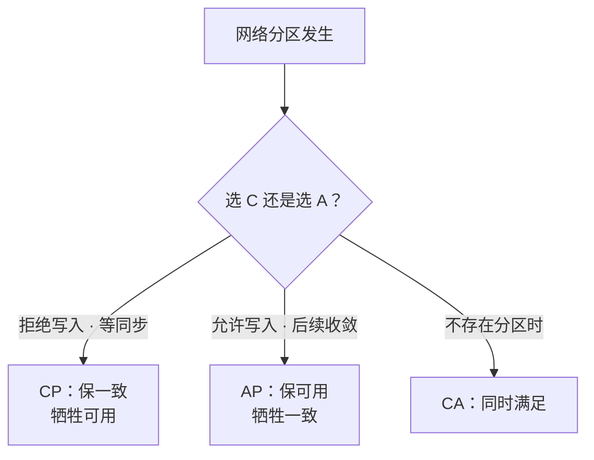
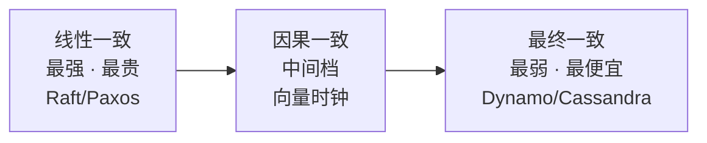
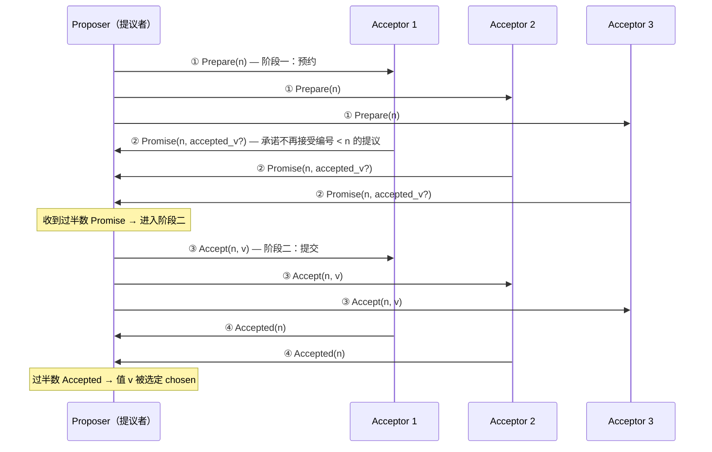
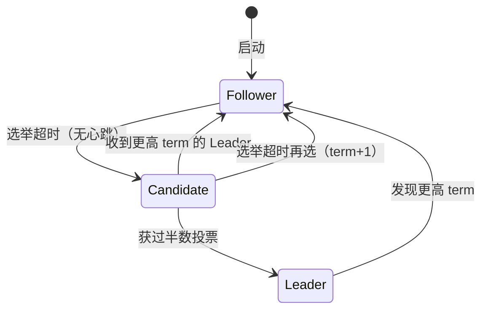
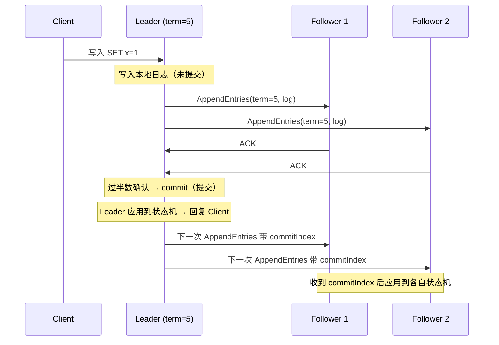
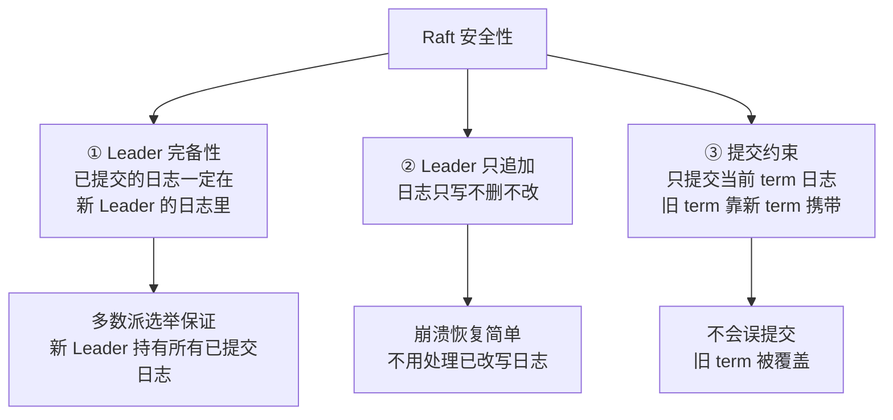
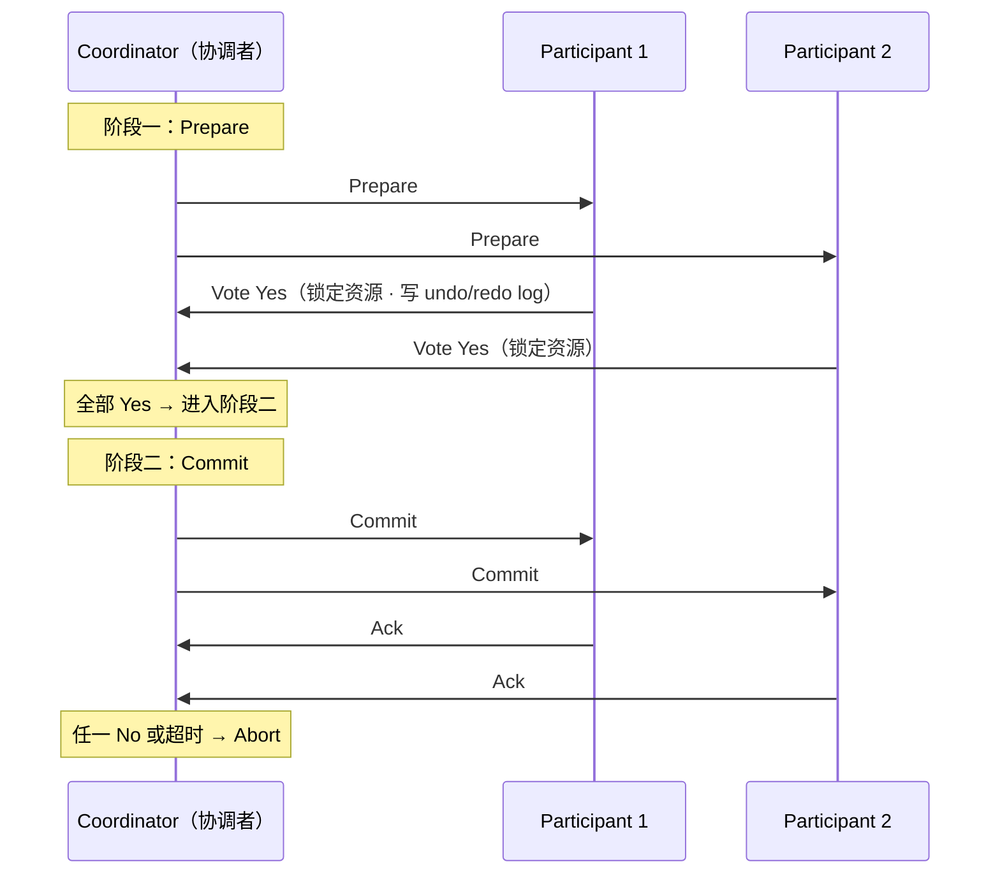
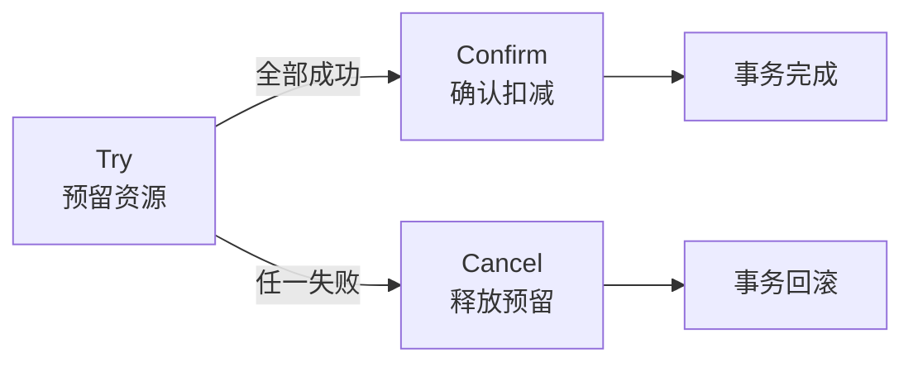
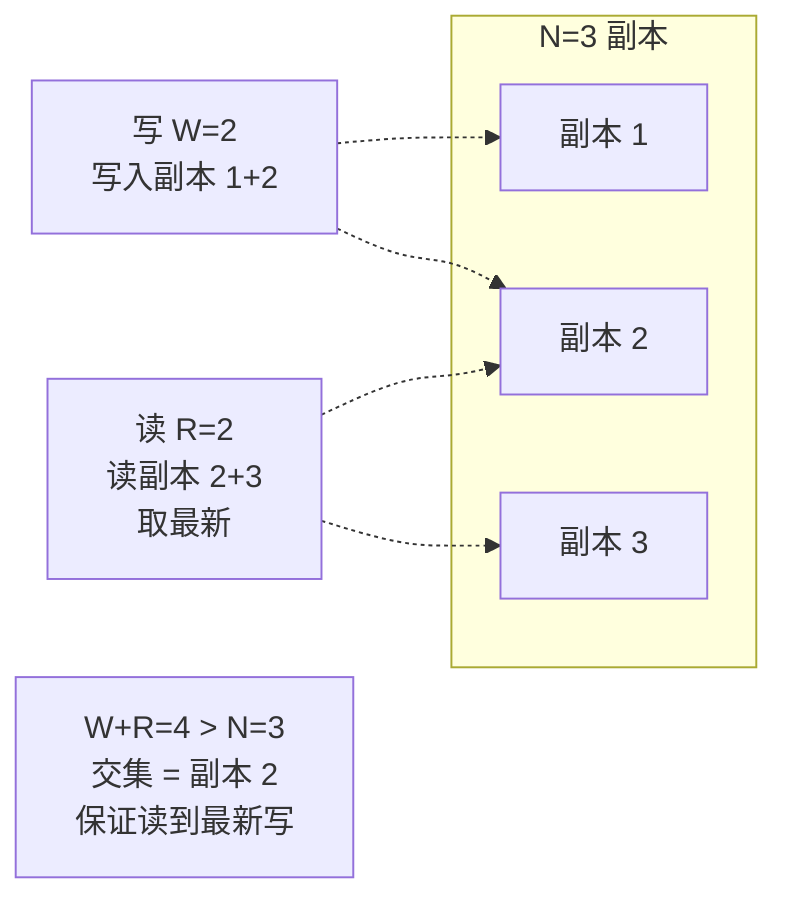
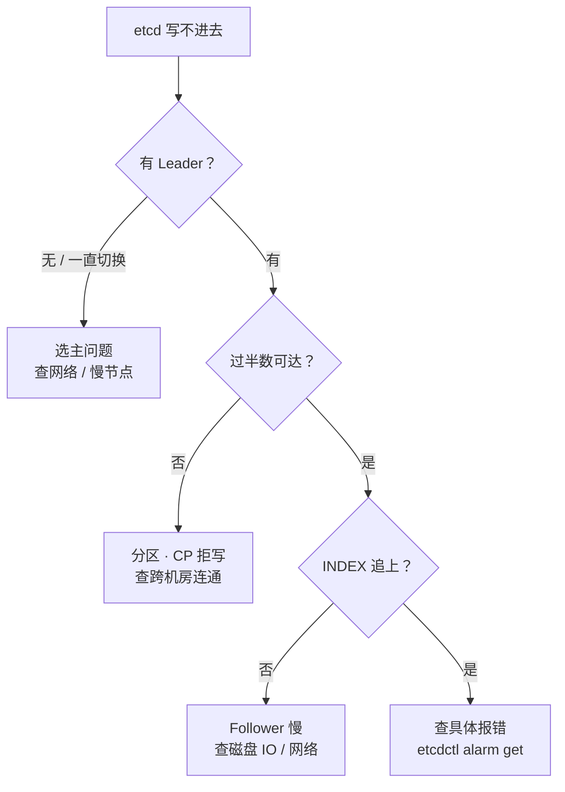

# 06｜分布式理论与一致性 · 练习题

先合上知识点，对着 **一节的主图** 把「一次分布式写入的一生」口述一遍（入口 CAP 定性 → 模型一致性谱系 → 出生 Paxos/Raft → 分叉分布式事务 → 收敛最终一致），再来做题。

| 标记 | 含义 |
|------|------|
| **核心** | 不懂整章就没建立起来 |
| **必会** | 值班和面试都要能讲 |
| **常用** | 线上会反复碰到 |
| **常考** | 白板和追问的高频口径 |

## 本题目录

- [Q1 CAP 怎么选](#q1)
- [Q2 FLP 说了什么](#q2)
- [Q3 线性一致 vs 最终一致](#q3)
- [Q4 Paxos 两阶段](#q4)
- [Q5 Raft 选举与角色转换](#q5)
- [Q6 Raft 日志复制与提交](#q6)
- [Q7 Raft 安全性三条](#q7)
- [Q8 2PC 流程与缺陷](#q8)
- [Q9 TCC 三接口](#q9)
- [Q10 Saga 长事务](#q10)
- [Q11 Quorum / NWR](#q11)
- [Q12 分布式锁怎么选](#q12)
- [Q13 Gossip 与向量时钟](#q13)
- [Q14 etcdctl 定责](#q14)
- [合上书](#合上书)

---

## Q1

**★★★★★｜CAP 定理怎么选？有人说「三选二」，对吗？**

**覆盖**：核心 · 必会 · 常考 ｜ **对应**：知识点 [二、前提：FLP 与 CAP](知识点.md)

### 场景

团队在选服务发现组件，有人主张「ZK 是 CP 的，保证一致」，有人说「Eureka 是 AP 的，可能读到旧节点」。面试官追问「CAP 到底是三选二还是二选一」。

### 完整解答

> 🎯 **一句话**：P 是前提不是选项，分区时只能在 C 和 A 之间选——「三选二」是 2010 年被原作者纠正的误读。



**读图**：P 不是你能选的——网络会分区是物理现实（光纤被挖断、交换机故障、机房断网）。真正要选的是分区那一刻要不要牺牲另一头。分区不发生时 C 和 A 都能要。

- **C（Consistency）**：所有节点同一时刻看到相同数据。
- **A（Availability）**：每个非故障节点的请求都能得到响应。
- **P（Partition tolerance）**：系统在网络分区时仍能运作。

选型对照：etcd / ZK / 传统 RDBMS 主从选 CP（宁可拒写也不许脑裂），Cassandra / Eureka / NoSQL 选 AP（先让用户操作，后续收敛）。

> ⚠️ **别混**：① CP 不代表「平时不可用」——只在分区期间牺牲，平时三个副本正常同步、可用性不低。② AP 不代表「永远不一致」——分区结束后通过 Quorum / Gossip 收敛到最终一致（Q11 · Q13）。

> 📝 **面试**：问「CAP 怎么选」，答「P 是前提，分区时在 C 和 A 之间选。账务 / 选主选 CP，社交 / 服务发现选 AP」。不要答「三选二」——那是被原作者自己纠正的误读。

### 再追问

**BASE 是什么？**——CAP 选了 AP 后的工程落地：Basically Available（基本可用，允许降级）+ Soft state（软状态，允许中间不一致）+ Eventually consistent（最终一致，分区恢复后收敛）。这不是替代 CAP，是 AP 系统的设计哲学。

**ZK 和 Eureka 为什么选不同的？**——ZK 用 ZAB 共识（类似 Raft），选 CP：节点过半不可达就拒绝写入，保证一致性但牺牲可用性。Eureka 选 AP：peer-to-peer 复制，分区时各节点仍可读写，牺牲一致性但保证可用性。服务发现场景「读到 30 秒前的旧节点」比「注册中心整个不可用」影响小，所以 Eureka 选 AP。

**不要**在不理解业务容忍度时照搬「CAP 三选二」——先问「分区时读到旧值会不会出事」：支付会出事 → CP，推荐不会 → AP。

---

## Q2

**★★★★☆｜FLP 不可能定理说了什么？Paxos/Raft 不是能达成共识吗，FLP 错了吗？**

**覆盖**：必会 · 常考 ｜ **对应**：知识点 [二、前提：FLP 与 CAP](知识点.md)

### 场景

面试官问「FLP 说不可能达成共识，那你说的 Raft 算什么」。有人答「FLP 是理论的，Raft 是工程的，所以 Raft 能跑」，被追问「到底绕过了什么」就卡住。

### 完整解答

> 🎯 **一句话**：FLP 说异步网络 + 一个节点可能故障时，无法保证共识同时满足终止性和一致性——工程靠加超时和同步假设绕过，不是 FLP 错了。

**FLP（Fischer-Lynch-Paterson）不可能定理**：在**异步网络**（消息延迟无上限）中，只要有一个节点可能故障，就不存在一个共识算法能同时满足：

- **Termination（终止性）**：所有非故障节点最终能做出决定。
- **Agreement（一致性）**：所有做出决定的节点决定值相同。
- **Validity（合法性）**：决定的值是某个节点提议过的。

> 💡 **打个比方**：三个将军派传令兵商量进攻时间，传令兵可能迟到甚至永远不到。没有任何办法能保证「一定能出结果」又「结果一定一致」——因为有人可能永远不回信，你不知道他是死了还是慢了。

**Paxos/Raft 怎么绕过的**：

- 加**超时**：Raft 的选举超时让 Follower 不无限等待 Leader——「你一直不回信，我就当你挂了，自己来选」。FLP 的「异步网络」假设里没有超时这个概念。
- 加**同步假设**：实际网络的延迟虽然有抖动，但不是「真正无上限」——消息最终会到。Paxos/Raft 假设「最终同步」（eventual synchrony），在这个假设下能保证终止。
- **随机化**：Raft 的选举超时是随机区间，让两个 Candidate 同时超时的概率极低——理论上有极小概率一直重选，工程上忽略。

> ⚠️ **别混**：FLP 说的是「最坏情况下无法**保证**终止」，**不是**「永远不可能达成共识」。大多数情况下 Paxos/Raft 跑得好好的——FLP 只是说你不能**证明**它一定终止。工程上靠超时让「最坏情况」的概率小到忽略。

> 📝 **面试**：答「FLP 是理论极限——异步网络 + 一个节点可能故障，就无法保证共识同时终止且一致。Paxos/Raft 绕过的办法是引入超时和最终同步假设：Raft 靠随机选举超时推动进展，工程上能让最坏情况的概率小到忽略，但理论上不保证 100% 活性」。

### 再追问

**FLP 和 CAP 什么关系？**——FLP 是关于**共识**的理论（能不能达成一致），CAP 是关于**一致性 vs 可用性**的权衡（分区时选哪头）。FLP 是 CAP 的理论基础之一——CAP 的「P 发生时不能同时 C 和 A」本质上就是 FLP 的推论。

**Raft 的活性问题是什么？**——理论上两个 Candidate 可能互相抢票、term 一直涨、永远选不出 Leader。Raft 用随机化选举超时让这个概率极低，但不是零。工程上看到 `etcdctl endpoint status` 的 `RAFT TERM` 一直涨，就该查网络抖动或 leader 压力了（Q14）。

---

## Q3

**★★★★☆｜线性一致和最终一致到底差在哪？顺序一致是什么？**

**覆盖**：核心 · 必会 · 常考 ｜ **对应**：知识点 [三、模型：一致性谱系](知识点.md)

### 场景

面试官问「Raft 是强一致的吗」。有人答「是」，追问「强一致是什么」就含糊。再追问「etcd 的 `--serializable` 读和 `--quorum` 读有什么区别」。

### 完整解答

> 🎯 **一句话**：一致性是一条谱系——线性一致最强（读看到最新已提交值，仿佛单副本），最终一致最弱（只保证收敛，中间可读旧值），中间还有顺序一致和因果一致。



**读图**：从左到右一致性越来越弱、延迟越来越低、可用性越来越高。选哪个取决于业务对「读到旧值」的容忍度。

- **线性一致性（linearizability）**：所有操作有一个全局顺序，每个读看到的是「最近一次写的值」——仿佛数据只有一份副本，所有操作原子完成。Raft/Paxos 的 `etcdctl get --quorum` 就是线性一致读——你要么读到最新已提交值，要么读到错误，不会读到旧值。代价是每次写都要过半数节点确认。
- **顺序一致性（sequential consistency）**：所有节点看到的操作顺序一致，但不要求顺序与真实时间吻合。Raft 的 `etcdctl get --serializable` 是顺序一致——只读 Leader 内存、不等半数确认，更快但可能读到旧值。
- **因果一致性（causal consistency）**：有因果关系的操作保序（先发帖后评论，评论一定在帖子之后可见），无因果的并发操作可乱序。需要向量时钟追踪依赖。
- **最终一致性（eventual consistency）**：如果没有新写入，所有副本最终收敛到同一个值——但不保证什么时候、中间可读旧值。Dynamo / Cassandra / DNS 默认就是。

> ⚠️ **别混**：线性一致 ≠ 泛泛的「强一致」——线性一致是强一致的**具体定义**，面试要能说出精确名。因果一致 ≠ 最终一致——因果一致多了「有因果的操作保序」这一层。顺序一致 ≠ 线性一致——顺序一致不要求与真实物理时间一致，线性一致要求。

> 📝 **面试**：问「Raft 是强一致吗」，答「Raft 提供线性一致性——读走 Leader + 确认 Leader 仍是当前 term（quorum read），保证读到最新已提交值。但 etcd 也提供 `--serializable` 的顺序一致读，只读 Leader 内存、不等半数确认，更快但可能读旧值——这是性能和一致性的取舍」。

### 再追问

**什么业务需要线性一致？**——选主（两个客户端不能同时拿到同一把锁）、计数器（扣库存不能超卖）、配置中心（下发配置不能读到旧版本）。**不要**在支付系统用最终一致——用户看到余额扣了但商品没发货，就是读到旧值导致的。

**Cassandra 的一致性级别怎么调？**——`ONE`（R=1，最终一致）、`QUORUM`（R=过半数，满足 W+R>N 时线性一致）、`ALL`（R=N，最强但最慢）。同一个系统可以按请求调——支付用 `QUORUM`，Feed 流用 `ONE`。

---

## Q4

**★★★★★｜Paxos 的两阶段是什么？过半数为什么能保证一致？**

**覆盖**：核心 · 必会 · 常考 ｜ **对应**：知识点 [四、出生：共识算法 Paxos 与 Raft](知识点.md)

### 场景

面试官让你画 Paxos 流程图。有人画了两根箭头写「提议→确认」，追问「Prepare 和 Accept 各做了什么」「过半数为什么够」就答不上来。

### 完整解答

> 🎯 **一句话**：Paxos 两阶段 Prepare（预约+Promise）+ Accept（提交+Accepted），核心是过半数多数派保证不会有两个不同值同时被选定。



**逐段口径**：

- **阶段一 Prepare**：Proposer 用编号 `n` 问 Acceptor「我用这个编号提议，你们同意吗」。Acceptor 回 Promise，承诺「不再接受编号 < n 的提议」。如果 Acceptor 之前已经接受过某个值，Promise 里带上 `accepted_v`，让 Proposer 知道。
- **阶段二 Accept**：Proposer 收到过半数 Promise 后，发出实际值 `v`（如果 Promise 里有已接受的值，`v` 必须用那个值——这就是 Paxos 安全性的核心）。过半数 Acceptor 回 Accepted，值 `v` 被选定（chosen）。

**为什么过半数能保证一致**：两个不同的多数派必然有交集（数学事实：3 个节点里两个「2 个」的子集必有 1 个重叠），所以不会有两个不同的值同时拿到过半数。这个交集节点在两个阶段都参与了，它的 Promise 约束保证后来的 Proposer 只能用已被接受的值。

> ⚠️ **别混**：Paxos 的「两阶段」是 Prepare + Accept（多副本一致性），**不是** 2PC 的 Prepare + Commit（跨资源原子性）——同名不同物，Q8 展开 2PC。

### 再追问

**Multi-Paxos 是什么？**——单个 Paxos 只对一个值决议。处理一个日志序列就是 Multi-Paxos：选一个稳定的 leader（Distinguished Proposer），省掉每次都跑阶段一——leader 连续跑阶段二即可，吞吐大增。但 Paxos 本身没规定怎么选 leader，工程实现各自补。Raft 就是「Multi-Paxos + 内置 leader 选举 + 强约束日志」的工程化版本。

**活锁问题是什么？**——两个 Proposer 互相用更大编号抢，谁也提交不成功。解决：选一个 leader 串行提议（Multi-Paxos 的做法），或加随机退避。Raft 天然没有这个问题——只有 Leader 提议。

---

## Q5

**★★★★★｜Raft 的三个角色怎么转换？term 起什么作用？**

**覆盖**：核心 · 必会 · 常考 ｜ **对应**：知识点 [四、出生：共识算法 Paxos 与 Raft](知识点.md)

### 场景

面试官让你画 Raft 的角色转换图。有人画了 Leader/Follower 两个框加箭头，追问「Candidate 是什么」「term 为什么不能回退」就卡住。

### 完整解答

> 🎯 **一句话**：三个角色 Leader/Follower/Candidate 靠 term 和超时驱动转换——Follower 超时变 Candidate，Candidate 拿过半票变 Leader，任何角色发现更高 term 立刻回 Follower。



**读图**：角色转换全靠 term 和超时驱动。关键点：

- **Leader（领导者）**：唯一处理写入的节点，所有写请求先到 Leader。
- **Follower（跟随者）**：被动接收 Leader 的日志复制，不主动发起写。
- **Candidate（候选人）**：Follower 超时没收到 Leader 心跳，变 Candidate 发起选举——自增 term，给自己投票，向其他节点发 RequestVote。

**Term（任期）**：Raft 把时间切成单调递增的 term，每次选举 term +1。term 像逻辑时钟——过期的 term 的消息被忽略，防止旧 leader 复活。这就是「脑裂不会出现两个同 term 的 Leader」的原因：两个 Leader 必须在同一个 term 里拿到过半票，而不可能。

> ⚠️ **别混**：① Candidate 不是「永远存在的角色」——它是 Follower → Leader 之间的**过渡态**，选举结束就消失（变成 Leader 或回退 Follower）。② term 只增不减——旧 Leader 网络恢复后发现 term 已变大，立刻回退 Follower，不会「两个 Leader 打架」。

> 📝 **面试**：问「Raft 怎么防脑裂」，答「靠 term：同一 term 里最多一个 Leader（要拿过半票），旧 term 的 Leader 发的写会被 Follower 拒绝（term 太小）。网络分区时少数派那边的旧 Leader 写不进过半数，自然阻塞；多数派那边选出新 Leader 后 term 更高，旧 Leader 恢复后立刻降级」。

### 再追问

**选举超时怎么定？**——随机区间（如 150-300ms），目的是让两个 Follower 同时超时的概率极低。超时太短 → 频繁选举；太长 → Leader 挂了恢复慢。etcd 默认 1000ms，可按网络情况调。

**投票规则是什么？**——每个节点在一个 term 里只投一票（先到先得），Candidate 要拿到**过半数**票才变 Leader。5 节点集群需要 3 票——这也是为什么 5 节点能容忍 2 个节点挂（还剩 3 个，过半）。

---

## Q6

**★★★★★｜Raft 的日志复制流程是什么？已复制和已提交有什么区别？**

**覆盖**：核心 · 必会 · 常用 ｜ **对应**：知识点 [四、出生：共识算法 Paxos 与 Raft](知识点.md)

### 场景

etcd 写入变慢，`etcdctl endpoint status` 显示 `RAFT INDEX` 比 `APPLIED INDEX` 大很多。有人不确定这是「在同步」还是「有问题」。

### 完整解答

> 🎯 **一句话**：写到 Leader → 复制到过半 Follower → Leader commit → 回复客户端 → 后续心跳带 commitIndex 让 Follower 提交——已复制 ≠ 已提交。



**读图**：

- **未提交（uncommitted）**：日志写到 Leader 本地、或已复制到部分 Follower，但还没到过半数。
- **已提交（committed）**：日志到了过半数节点确认，Leader 标记 commit——此时数据不会丢（新 Leader 一定有这条日志），客户端才收到成功响应。
- Follower 的提交是**被动的**——它收到 Leader 后续 AppendEntries 或心跳里带的 `commitIndex` 后，才把对应日志应用到状态机。

**本例的答案**：`RAFT INDEX > APPLIED INDEX` 说明日志复制了但 Follower 还没应用到状态机——如果差距小且在缩小，是正常同步延迟；如果差距大且不缩小，说明某个 Follower 慢（磁盘 IO / 网络），但不影响写入成功（只要过半数确认了就算提交）。

> ⚠️ **别混**：① 「已复制」≠「已提交」——已复制是到了过半节点，commit 才是已提交。② Leader 只回复客户端「已提交」的写入，已复制但未提交的不会回成功。③ Leader 提交的是**当前 term** 的日志——不能直接提交旧 term 的日志（Raft 的安全性约束，Q7 展开）。

### 再追问

**线性一致读怎么实现？**——Leader 读之前要先确认自己「还是当前 term 的 Leader」（发心跳给过半数确认），再从状态机读——这叫 quorum read。`etcdctl get --quorum` 就是。`etcdctl get --serializable` 省掉了这个确认，只读 Leader 内存——更快但理论上有读到旧值的风险（Leader 刚被推翻但还不知道）。

**Follower 落后太多怎么办？**——Leader 会发快照（snapshot）给落后的 Follower，而不是一条一条补日志。etcd 的 `--snapshot-count` 控制何时触发快照。

---

## Q7

**★★★★★｜Raft 凭什么安全？三条铁律是什么？过半数保证了什么？**

**覆盖**：核心 · 必会 · 常考 ｜ **对应**：知识点 [四、出生：共识算法 Paxos 与 Raft](知识点.md)

### 场景

面试官问「Raft 怎么保证不丢数据」。有人答「有日志」，追问「旧 Leader 的日志被覆盖了怎么办」「新 Leader 没有已提交的日志怎么办」就答不上。

### 完整解答

> 🎯 **一句话**：Raft 安全性靠三条铁律——Leader 完备性（已提交日志一定在新 Leader 里）、日志只追加（不删不改）、只提交当前 term（旧 term 靠新 term 携带）。



**读图**（逐条展开）：

- **① Leader 完备性（Leader Completeness）**：选举时 Candidate 必须拿到过半数票。而已提交日志一定在过半数节点上（commit 的前提就是过半数确认）。两个多数派有交集——所以新 Leader 一定有所有已提交日志，不会丢。这是最核心的一条。
- **② Leader 只追加（Leader Append-Only）**：Leader 的日志只能往后写，不能改不能删。崩溃恢复时不用处理「日志被覆盖」的情况——直接从最后一条开始追。像 ledger，只往后写。
- **③ 提交约束（Commit Restriction）**：Leader 只能直接提交**当前 term** 的日志。旧 term 的日志要等到新 term 的日志一起被过半复制后，才能**间接**提交。这条防止「旧 term 被误提交后又覆盖」的边界 bug。

> ⚠️ **别混**：Raft 的过半数保证的是**安全性（safety）**——不会丢已提交数据、不会出两个同 term 的 Leader。**不保证活性（liveness）**——理论上选举可能永远超时重来（FLP 的阴影，Q2），工程上靠随机超时让两个人同时超时的概率极低。

> 📝 **面试**：背这三条时按「**选举保证完备 → 日志只追加 → 提交只认当前 term**」分组。最后补一句「Raft 保证的是安全性，活性靠随机超时在工程上逼近——没有 100% 的活性保证，但实际跑得很好」。

### 再追问

**为什么不能直接提交旧 term 日志？**——场景：旧 Leader 用 term=3 写了日志但没过半确认就挂了；新 Leader 用 term=4 当选，发现有这条 term=3 的日志。如果新 Leader 直接提交它，然后又发现「其实 term=3 时有更新的日志被其他节点持有」就会出 bug。Raft 的解法：新 Leader 用 term=4 写一条新日志，这条新日志过半确认时，旧 term=3 的日志也跟着被确认——这叫间接提交。

**过半数为什么保证一致？**——数学事实：N 个节点里两个「⌊N/2⌋+1」的子集必有交集。3 节点需 2 票，两个「2 节点」的多数派至少有 1 个重叠；5 节点需 3 票，两个「3 节点」的多数派至少有 1 个重叠。所以不会有两个不同的值同时拿到过半数——Paxos 和 Raft 共享这个数学基础。

---

## Q8

**★★★★★｜2PC 的流程是什么？为什么互联网系统不用它？和 Paxos 两阶段有什么区别？**

**覆盖**：核心 · 必会 · 常考 ｜ **对应**：知识点 [五、分叉：分布式事务](知识点.md)

### 场景

面试官问「分布式事务怎么实现」。有人答「2PC」，追问「2PC 和 Paxos 的两阶段一样吗」就混了。再追问「2PC 有什么问题」只答得出「慢」。

### 完整解答

> 🎯 **一句话**：2PC = Prepare（锁定资源 + 写 undo log）+ Commit（提交或回滚），协调者单点故障会导致全体阻塞——和 Paxos 的 Prepare+Accept 同名不同物。



**读图**：阶段一参与者锁资源、写 undo log（能回滚的依据）、回 Yes/No。阶段二全 Yes 才 Commit，任一 No 就 Abort。

**2PC 的三个致命缺陷**：

- **协调者单点故障 → 阻塞**：协调者在 Prepare 后、Commit 前挂了，参与者锁着资源干等——不知道该 Commit 还是 Abort，只能阻塞。这叫**不确定状态（uncertainty）**。
- **同步阻塞 → 吞吐差**：参与者从 Prepare 开始就锁资源，直到 Commit/Abort 释放——期间其他事务碰这些资源只能等。
- **分区时不确定**：网络分区时协调者和参与者互不知道对方状态，恢复后要人工介入或靠超时赌。

XA 就是 2PC 的工业实现（MySQL XA、Oracle XA），性能差所以多数互联网系统不用它。

> ⚠️ **别混**：2PC 的「两阶段」是 Prepare + Commit（跨资源**原子性**），Paxos 的「两阶段」是 Prepare + Accept（多副本**一致性**）——**同名不同物**。2PC 解决的是「两个 DB 要么一起提交要么一起回滚」，Paxos 解决的是「三个副本要在同一个值上达成一致」，是两个不同问题。

### 再追问

**3PC 解决了什么？**——在 2PC 的 Prepare 前加一个 CanCommit（探测阶段），并引入超时——参与者等协调者超时后自己 Commit（假定「前面既然同意了就提交」）。目的是减少阻塞，但引入超时只是把「阻塞」变成「可能不一致」，且仍不能完全解决网络分区下的脑裂。**基本不用**。

**Seata 的 AT 模式是 2PC 吗？**——不是传统 2PC。Seata AT 用「本地事务 + undo log + 全局锁」模拟 2PC 的效果，但不锁资源（用全局锁代替），性能更好。本质是「自动生成补偿」的变体——比手写 TCC 省事，但不如 TCC 灵活。

---

## Q9

**★★★★☆｜TCC 的三个接口各做什么？和 2PC 有什么区别？**

**覆盖**：必会 · 常用 ｜ **对应**：知识点 [五、分叉：分布式事务](知识点.md)

### 场景

支付系统要保证「扣余额 + 扣库存 + 发消息」原子性。有人提议 2PC，性能团队说扛不住。有人提议 TCC，开发说「Try 不就是执行业务吗，Cancel 怎么回滚」。

### 完整解答

> 🎯 **一句话**：TCC = Try（预留资源）+ Confirm（确认扣减）+ Cancel（释放预留），每个参与方写三份接口，业务侵入大但性能远好于 2PC。



**读图**：Try 先预留，全部成功才 Confirm，任一失败就 Cancel。

**三个接口各自做什么**（以「扣余额 + 扣库存」为例）：

- **Try**：冻结余额 100 元（不是真扣，是「预占」）；预占库存 1 件（不是真扣，是「预占」）。
- **Confirm**：真正扣掉冻结的 100 元；真正扣掉预占的 1 件库存。
- **Cancel**：解冻 100 元（余额恢复）；释放预占的 1 件库存（库存恢复）。

**和 2PC 的区别**：

- 2PC 的 Prepare **锁资源**，其他事务碰这些资源只能等——吞吐差。
- TCC 的 Try 是**业务层预留**（冻结余额），不锁数据库行——其他事务仍可操作同一行（只是冻结额度不同）。每个服务独立提交本地事务，不阻塞。

代价是**业务侵入大**——每个参与方都要写 Try / Confirm / Cancel 三个接口，且 Cancel 必须能正确回滚 Try 的预留。

> ⚠️ **别混**：TCC 的 Try 不是「执行业务」，是「预留资源」——Try 是冻结余额不是真扣款，Confirm 才真扣。如果 Try 就真扣了，Cancel 就没法退——这是 TCC 最常见的写错方式。

> 📝 **面试**：问「TCC 和 2PC 差在哪」，答「① 2PC 锁资源、TCC 预留资源（业务层冻结），不阻塞数据库；② 2PC 靠 undo log 回滚、TCC 靠业务 Cancel 接口回滚，每个参与方要写三份代码；③ 2PC 强一致但慢，TCC 强一致且快，代价是业务侵入大」。

### 再追问

**Cancel 失败了怎么办？**——TCC 框架（如 Seata TCC 模式）会重试 Cancel，直到成功。所以 Cancel 必须幂等——调多少次效果一样。Try 和 Confirm 也要幂等，因为网络重试可能重复调用。

**TCC 的空回滚和悬挂是什么？**——空回滚：Cancel 先于 Try 到达（Try 网络丢包或延迟），Cancel 发现没有 Try 记录就空回滚（什么都不做但要记录）。悬挂：Cancel 已经空回滚了，迟到的 Try 又来了——Try 应该检查是否已 Cancel，已 Cancel 则不执行。TCC 框架一般用「事务表」记录状态来防这两个问题。

---

## Q10

**★★★☆☆｜Saga 怎么编排？补偿链失败怎么办？**

**覆盖**：必会 · 常用 ｜ **对应**：知识点 [五、分叉：分布式事务](知识点.md)

### 场景

订单流程：创建订单 → 扣库存 → 扣余额 → 发物流消息 → 发通知。每步耗时从毫秒到分钟不等。有人提议 2PC，DBA 说「锁这么久不现实」。有人提议 TCC，开发说「5 个服务各写 3 个接口太多」。

### 完整解答

> 🎯 **一句话**：Saga 把长事务拆成一串本地事务 + 补偿动作，任一步失败就反序执行补偿——最终一致，不锁资源，适合长流程。

```text
正向：  T1(创建订单) → T2(扣库存) → T3(扣余额) → T4(发物流) → T5(发通知)
补偿：  C1(删订单) ← C2(还库存) ← C3(还余额) ← C4(撤物流) ← C5(撤通知)

如果 T3 失败 → 执行 C2 → C1（反序补偿到 T3 的前一步）
```

**读图**：正向执行 T1→T2→...→Tn，每个 Ti 都有补偿 Ci。失败在 Tk 时，反序执行 C(k-1)→...→C1。不是回滚到初始状态——是回滚到失败前一步的状态。

**两种编排方式**：

- **Choreography（编排式）**：各服务靠事件触发下一步。T1 完成 → 发「订单创建」事件 → T2 订阅到事件执行 → 发「库存扣减」事件 → ... 无中心协调者。耦合低但难追踪，出了问题不知道卡在哪。
- **Orchestration（协调式）**：一个 Saga 协调器指挥各步。T1 完成 → 协调器调 T2 → T2 完成 → 协调器调 T3 → ... 可控、可追踪，但中心化。Seata 的 Saga 模式属于这种。

> ⚠️ **别混**：Saga 只保证**最终一致**，不保证 ACID——中间状态可见（T2 扣了库存但 T3 还没扣余额时，外部能看到「库存少了但余额没少」）。如果业务要求任何时刻都一致，Saga 不适合，用 TCC。

### 再追问

**补偿失败了怎么办？**——补偿 Ci 也可能失败（比如还库存时库存服务挂了）。Saga 框架会重试补偿（Ci 必须幂等）。如果重试用尽仍失败，需要人工介入——记录告警，运维手动修复。**不要**假设补偿一定成功，Saga 的代价就是「可能需要人工兜底」。

**Saga 和 TCC 怎么选？**——短事务、要求强一致 → TCC（每步快速完成，Try/Confirm/Cancel 契合）。长流程、容忍中间不一致 → Saga（不锁资源，适合跨服务长链路）。订单链这种「5 步、每步可能跨秒到分钟」的场景适合 Saga；支付扣款这种「2 步、要求原子」适合 TCC。

---

## Q11

**★★★★☆｜Quorum / NWR 是什么？W+R>N 为什么能保证读到最新？**

**覆盖**：核心 · 必会 · 常考 ｜ **对应**：知识点 [六、收敛：最终一致与辅助机制](知识点.md)

### 场景

Cassandra 集群读到旧值，有人查了配置发现 `consistency level = ONE`。有人提议改成 `ALL`，性能团队说太慢。

### 完整解答

> 🎯 **一句话**：N 副本写 W 读 R，当 W+R>N 时读写多数派有交集，保证读到最新——Raft 的过半数就是 W=R=⌊N/2⌋+1 恰好满足这个条件。



**读图**：写的多数派 `{1,2}` 和读的多数派 `{2,3}` 的交集是副本 2——它一定有最新写的值。

**调 W 和 R 的权衡**：

- W 大 → 写慢但一致性高（更多副本确认才算写成功）。
- R 大 → 读慢但一致性高（要读更多副本取最新）。
- W+R ≤ N → 不保证读到最新，可能读旧值（最终一致）。
- W+R > N → 保证读到最新（线性一致）。

Dynamo / Cassandra 的 `consistency level` 就是 NWR：

- `ONE`（R=1）→ 可能读旧值，最快。
- `QUORUM`（R=过半数）→ W+R>N 时线性一致，中等。
- `ALL`（R=N）→ 最强但最慢。

**本例答案**：`ONE` 时 W=1, R=1, N=3 → W+R=2 < 3，不保证读到最新。改成 `QUORUM`（W=2, R=2, W+R=4>3）就能保证，性能比 `ALL` 好很多。

> ⚠️ **别混**：Quorum 保证的**当且仅当** W+R>N。Raft 的「过半数」是 W=R=⌊N/2⌋+1，3 节点时 W=R=2, W+R=4>3 → 线性一致。所以 Raft 本质就是 NWR 的一种特例——用最大化的 W 和 R 换最强一致性，代价是写入需要过半确认。

### 再追问

**Raft 和 Cassandra 的 Quorum 有什么区别？**——Raft 有 Leader 串行化所有写，天然有全局顺序，所以是线性一致。Cassandra 没有 Leader，多个副本可并发写，即使 W+R>N 也只保证「读到最新值」，不保证「全局顺序」——要因果一致或线性一致需要额外机制。

**W=1, R=1 什么时候也能用？**——对「读到旧值无所谓」的场景：Feed 流（晚 1 秒看到无妨）、监控指标（取最新的就行）、DNS（全球生效要几分钟）。**不要**在支付扣款用 `ONE`——可能读到旧余额导致超卖。

---

## Q12

**★★★★☆｜分布式锁怎么实现？Redis 的锁安全吗？**

**覆盖**：必会 · 常用 · 常考 ｜ **对应**：知识点 [六、收敛：最终一致与辅助机制](知识点.md)

### 场景

秒杀系统要分布式锁防超卖。有人用 Redis `SETNX` + `EXPIRE` 两步，有人用 `SET NX PX` 一步。还有人问「主从切换会不会丢锁，要不要上 RedLock」。

### 完整解答

> 🎯 **一句话**：Redis 单节点锁快但主从切换可能丢锁，etcd/ZK 锁基于 Raft/ZAB 最安全但慢——看业务对丢锁的容忍度。

**三种实现**：

**① Redis 单节点锁**：

```bash
SET mylock token123 NX PX 30000   # NX=不存在才设，PX=过期 30s，一条命令原子完成
# ← 拿到锁。释放时用 Lua 脚本比对 token 再 DEL（防误删别人的锁）
```

简单快。但主从切换时锁可能丢——锁还没同步到从节点，主就挂了，新主会发同一把锁给另一个人。

**② Redis RedLock**：向 N（奇数，常 5）个独立 Redis 实例请求锁，过半数成功才算拿锁——降低单点丢锁概率。但 Martin Kleppmann 质疑其时钟假设（靠本地时钟判断锁是否过期，时钟漂移会出问题），争议大，生产慎用。

**③ etcd / ZK 锁**：基于 Raft/ZAB 共识，线性一致、不会脑裂——但延迟高于 Redis。

```bash
# etcd 分布式锁
etcdctl lock my-lock --ttl=30 echo "持有锁，干活"
# 持有锁，干活    ← 拿到锁后执行子进程，进程退出自动释放锁
```

> ⚠️ **别混**：① 不要用 `SETNX` + `EXPIRE` 两步——中间挂了锁不会过期。要用原子 `SET NX PX`。② 释放锁不能用直接 `DEL`——要先用 Lua 脚本比对 token（防止 A 的锁被 B 误删）。③ Redis 单节点锁在主从切换时**不保证安全**——这是 Redis 主从异步复制决定的，不是 bug。

> 📝 **面试**：问「分布式锁怎么选」，答「支付 / 选主要绝对安全用 etcd/ZK 锁（基于 Raft/ZAB）；限流 / 防重可以容忍极小概率丢锁用 Redis（`SET NX PX` + Lua 释放）。RedLock 有争议，我不推荐在生产用」。

### 再追问

**锁过期了但业务还没执行完怎么办？**——Redis 的 `SET NX PX 30000` 过期 30s，如果业务执行超过 30s，锁就自动释放了，别人能拿到同一把锁。解法：起一个后台线程**续期**（watchdog），在锁快过期时 `PEXPIRE` 延长。Redisson 框架自带这个机制。**不要**把过期时间设得特别长——那和没设一样，节点挂了锁一直不释放。

**etcd 锁比 Redis 慢多少？**——Redis 锁亚毫秒级，etcd 锁通常 5-20ms（要走 Raft 过半确认）。秒杀场景每秒几十万次用 Redis，配置变更 / 选主每秒几次用 etcd。**不要**用 etcd 做高频限流——那是 Redis 的活。

---

## Q13

**★★★☆☆｜Gossip 协议怎么传播？向量时钟怎么判因果？**

**覆盖**：必会 · 常考 ｜ **对应**：知识点 [六、收敛：最终一致与辅助机制](知识点.md)

### 场景

面试官问「Cassandra 怎么做成员发现」。有人答「Gossip」，追问「Gossip 怎么传播」答不清楚。再问「向量时钟是什么」完全没听过。

### 完整解答

> 🎯 **一句话**：Gossip 靠节点随机交换状态像传染病一样扩散，O(log N) 轮收敛；向量时钟用每节点一个维度追踪因果序，区分「有因果」和「并发」。

**Gossip 协议**：

> 💡 **打个比方**：办公室 30 个人传话，每个人每秒随机找另一个人说「我知道了这些」，几轮后所有人都知道了——不需要中心广播。

每个节点周期性（如 1s）随机选几个节点交换状态信息。像传染病一样扩散——每轮每个感染者传染几个新节点，O(log N) 轮后全网收敛。特点：去中心化、抗节点故障、最终一致。Cassandra 用它做成员发现和元数据传播，Consul 用它做健康检查传播。

代价：收敛有延迟、中间可能不一致——但这正是 AP 系统的取舍。和 Raft 的区别：Gossip 没有 Leader、不保证线性一致，只保证最终收敛。

**向量时钟（vector clock）**：

每个节点维护一个向量 `[n1:5, n2:3, n3:7]`，每次本地操作自己那维 +1，通信时带着向量；收方取逐维 max。判定规则：

- A 的向量逐维 ≥ B → A 因果后于 B（A happens-after B）。
- 否则 → 并发（concurrent），两个写没有因果关系。

解决的是最终一致系统里「两个并发写谁先谁后」的问题。Dynamo 旧版用它检测冲突——发现两个写是并发的，就让应用层解决（比如让用户选哪个版本）。

> ⚠️ **别混**：Raft 不需要向量时钟——Leader 串行化所有写，天然有全局顺序。向量时钟只在**无 Leader 的最终一致系统**里才有意义。

> 📝 **面试**：问「Gossip 和 Raft 区别」，答「Gossip 无 Leader、去中心化、只保证最终收敛，适合成员发现和元数据传播；Raft 有 Leader、保证线性一致，适合配置存储和选主。两者不矛盾——Consul 同时用 Raft（存配置）和 Gossip（传播健康检查）」。

### 再追问

**Gossip 会传播坏消息吗？**——会。一个节点误报「节点 C 挂了」，Gossip 会把这个误报传播给全网。解法：带时间戳和版本号，后到的更新覆盖旧的；或者用「怀疑」机制（suspect），先标记为怀疑，等确认再标记为 down。Cassandra 的 Phi Accrual 故障检测就是这种思路。

**向量时钟和物理时钟什么关系？**——向量时钟是**逻辑时钟**，不用来记「几点几分」，只用来记「谁先谁后」。它不能替代物理时钟——你不能从向量时钟推出「这个写是昨天还是今天」。Raft 用 term 做逻辑时钟，etcd 的事务用 MVCC 版本号（revision）做逻辑时钟。

---

## Q14

**★★★★☆｜etcd 写不进去，怎么定责？**

**覆盖**：必会 · 常用 · 常考 ｜ **对应**：知识点 [七、作战：定责](知识点.md)

### 场景

值班收到告警：etcd 集群写不进去，配置下发全卡。有人要直接重启节点，有人要抓包。`etcdctl endpoint status` 显示一个节点 IS LEADER=true，但 RAFT TERM 比另外两个高且在涨。

### 完整解答

> 🎯 **一句话**：先看有没有 Leader、再看 term 是否一致、最后看 RAFT INDEX vs APPLIED INDEX 差距——三刀定责，不抓包。

```bash
etcdctl endpoint status --cluster -w table
# +----------------+------------------+---------+---------+-----------+------------+-----------+------------+--------------------+--------+
# | ENDPOINT       |        ID        | VERSION | DB SIZE | IS LEADER | IS LEARNER | RAFT TERM | RAFT INDEX | RAFT APPLIED INDEX | ERRORS |
# +----------------+------------------+---------+---------+-----------+------------+-----------+------------+--------------------+--------+
# | 10.0.0.1:2379  | 8e9e...c0        |  3.5.0  |  2.1 MB |      true |     false  |        15 |       1024 |               1024 |        |
# | 10.0.0.2:2379  | 91bc...d1        |  3.5.0  |  2.1 MB |     false |     false  |        12 |       1000 |               1000 |        |
# | 10.0.0.3:2379  | a3f5...e2        |  3.5.0  |  2.1 MB |     false |     false  |        12 |       1000 |               1000 |        |
# ← Leader term=15 但 Follower 还在 term=12 → Leader 刚切换，Follower 还没追上
# ← Follower RAFT INDEX=1000 < Leader=1024 → 日志落后 24 条，还在同步
```

**三刀定型**：

- **第一刀 · IS LEADER**：只有一个 true → 有 Leader（多个 = 脑裂，零个 = 没选出 Leader）。本例有一个，正常。
- **第二刀 · RAFT TERM**：三台一致 → 稳定。Leader 比其他高且在涨 → 刚切换或频繁切换。本例 Leader term=15、Follower term=12 → Leader 刚切换，Follower 还没追上。
- **第三刀 · RAFT INDEX vs APPLIED INDEX**：两者相等 → 复制和提交都追上了。INDEX > APPLIED → 日志复制了但没提交到状态机（Follower 慢或刚加入）。本例 Follower INDEX=1000 < Leader=1024 → 日志落后 24 条，还在同步。

**本例答案**：Leader 刚切换（term 不一致），新 Leader 日志在追。如果差距在缩小且最终追上，是正常恢复——**不要重启节点**。如果 term 一直涨且差距不缩小，查网络抖动或 leader 压力。

**定责决策树**：



> ⚠️ **别混**：`RAFT INDEX` ≠ `APPLIED INDEX`——INDEX 是日志已复制到哪，APPLIED 是已应用到状态机。INDEX > APPLIED 是正常同步延迟，不是故障；只有差距大且不缩小才需要查。

### 再追问

**60 秒剧本怎么走？**

```text
① 0–10s  写不进去还是不一致？   etcdctl endpoint status --cluster -w table
② 10–30s 看 IS LEADER / TERM / INDEX 三件套 → 有没有 Leader、term 稳不稳、index 追没追
③ 30–45s 定型：A 分区（过半不可达）/ B 选主（term 涨 / 无 leader）/ C Follower 慢（index 落后）
④ 45–60s 定责 + 验证：A 查跨机房连通 · B 查网络抖动和慢节点 · C 查磁盘 IO
```

**什么时候要查 `etcdctl alarm get`？**——写入报 `mvcc: database space exceeded` 时，是磁盘空间不足触发了告警。etcd 默认 2GB 配额，满了会拒绝写入（CP 的体现——宁可拒写也不许不一致）。解法：压缩旧版本 + 碎片整理 + 提高配额。**不要**直接加磁盘就完事——不压缩 revision 会继续涨，迟早又满。

---

## 合上书

对齐知识点「合上书」，逐条口述，卡住就回对应节：

- [ ] **默画一节的图**：入口（CAP 定性）→ 模型（一致性谱系）→ 出生（Paxos/Raft）→ 分叉（分布式事务）→ 收敛（最终一致）；`etcdctl endpoint status` 照哪段。（Q1 · Q14）
- [ ] **口述前提**：FLP 说了什么、CAP 怎么选、为什么 P 不是选项、BASE 是什么。（Q1 · Q2）
- [ ] **口述模型**：线性一致 / 因果一致 / 最终一致各保证什么、顺序一致和线性一致差在哪。（Q3）
- [ ] **默画 Paxos 两阶段**：Prepare（预约 + Promise）→ Accept（提交 + Accepted），写清过半数的含义。（Q4）
- [ ] **默画 Raft 选举与日志复制**：角色转换图（Follower → Candidate → Leader）+ 日志复制时序（写 Leader → 过半复制 → commit → 回复 → Follower 提交）。（Q5 · Q6）
- [ ] **口述 Raft 安全性**：三条铁律（Leader 完备性、日志只追加、只提交当前 term）+ 过半数为什么保证一致。（Q7）
- [ ] **口述分布式事务**：2PC 流程与缺陷、TCC 三接口、Saga 补偿链、四种方案怎么选。（Q8 · Q9 · Q10）
- [ ] **口述收敛机制**：Quorum / NWR（W+R>N）、向量时钟判因果、Gossip 传播、分布式锁三种实现。（Q11 · Q12 · Q13）
- [ ] **定责**：写不进去 / 脑裂 / 读到旧值各走哪条决策树分支、各查什么。（Q14 · Q3 · Q12）
