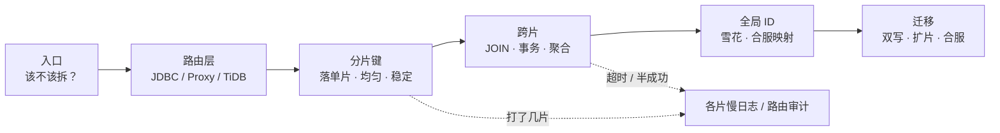
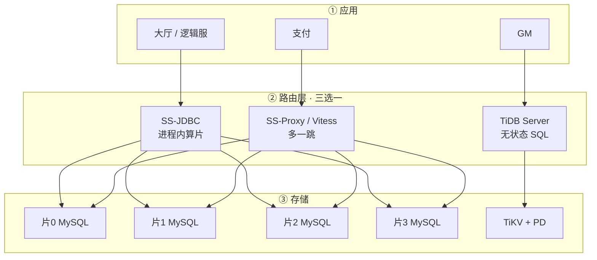
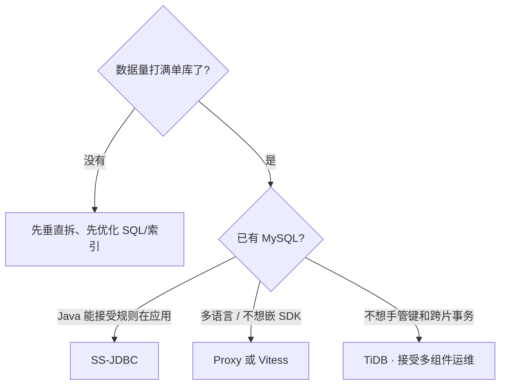
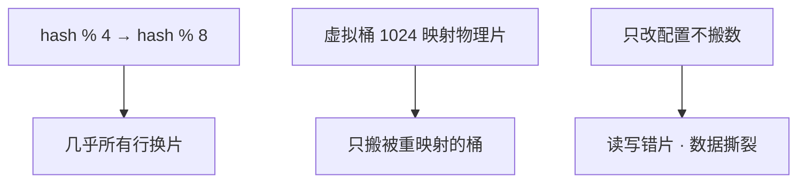
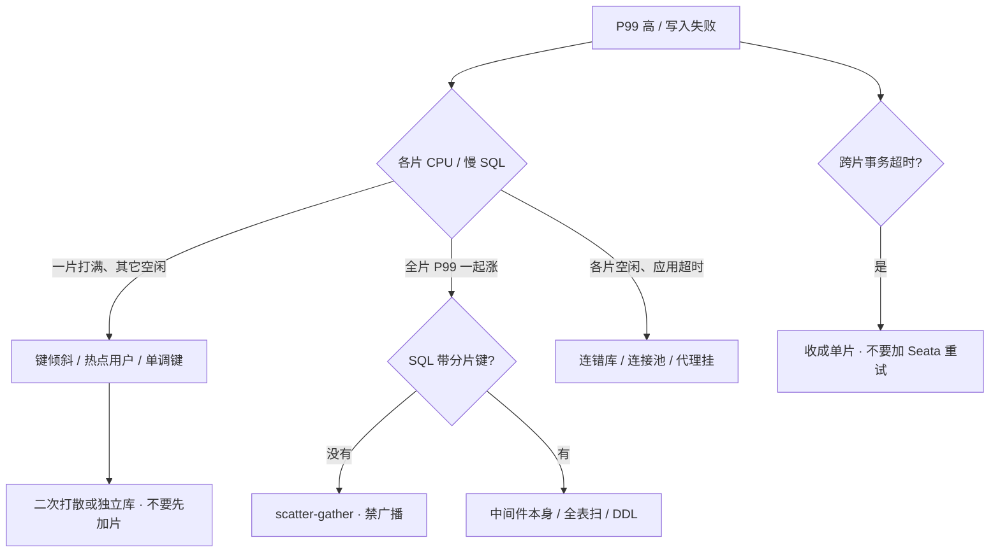

# 分库分表与中间件

> 活动整点前二十分钟，角色表 8000 万行，策划要加一列 `season_id`，DBA 说 DDL 锁两小时；写入把主库 CPU 顶到 95%。群里有人喊「上 TiDB」，另有人要把 `mysqldump` 跑完直接切 DNS——两边都没看过分片键长什么样。
> **本章回答**：一行数据怎么从单库走到多片，键怎么选、跨片为什么贵、迁移和合服怎么留退路；慢了是键倾斜还是广播，怎么一眼定责。
> **不讲**：单库索引、事务、DDL、主从 → [01 MySQL](../01-MySQL/)；合服窗口与审批 → [07-06](../../07-游戏运维专题/06-开服合服/)；回档 RPO → [07-09](../../07-游戏运维专题/09-玩家数据备份与回档/)；分析型聚合 → [04 ES](../04-Elasticsearch/)；Mongo shard key → [05 MongoDB](../05-MongoDB/)。

**标记**：🎯重点 · 🔥难点 · ⭐常考 · 🔧实操

---

## 一、一张图：一条 SQL 的一生

> 🎯 **一句话**：带键的 SQL 只进一片；不带键就变成全片广播。卡了先问「打了几片」，再决定动哪把刀。



- 📖 **读图**
  - 🚪 入口先问「单库优化够不够」；不够再垂直，再水平——水平才引入跨片
  - 🛤️ 主线「路由 → 键 → 跨片 → ID → 迁移」；P99 飙、写入打满第一刀都是各片慢日志 / 代理审计（Q9、Q14）

值班三步想：**分层**（应用 → 路由 → 各片 MySQL）→ **归类**（单片满 = 倾斜；全片涨 = 广播；事务 = 先同键同片）→ **留证**（慢日志带不带键、行数对账、双写可回退）。

本节对应练习题 Q1、Q14。带着这张图出发——第一问：该不该拆？

---

## 二、入口：该不该拆

> 🎯 **一句话**：先垂直拆业务，再水平拆行；读写分离不算分片；数据量没打满单库先看 01。

大厅要查 `uid=10001` 的背包。还没水平拆时，SQL 打唯一的 `game_db.bag`。拆完之后，同一条 SQL 必须能算出「去哪一片」，否则变成扫全部片——P99 从 20ms 飙到 800ms，监控上「每片 CPU 都不高」，其实是 **scatter-gather（散开再汇总）**。

### 📐 三种不要混 ⭐

| 做法 | 干什么 | 不干什么 |
|------|--------|----------|
| **垂直拆分** | 按业务拆库（账号 / 支付 / 玩法），或大字段拆副表 | **行数还在一张表里涨** |
| **水平拆分** | 按分片键把行分散到多表/多库 | 不自动消灭跨片 JOIN / 事务 |
| **读写分离** | 读打从库，扛读流量 | 不解决单表行数和 DDL |

> 💡 **打个比方**：垂直像把「仓库、收银台、客服」分到三栋楼——各干各的，某栋货架仍会满。水平像同一类货架按客户编号分到四个库房——找某个客户只进一个库，「按商品编号全局搜」得跑四个。读写分离是多加只读副本，**货架本身还是那一套**。

- 🔑 **口诀**：**「垂直拆业务，水平拆行；读写分离不算分片」**
- 🗺️ **生产顺序**：先垂直（账号、支付、玩法分开）→ 单表仍撑不住再水平
- 🎮 **游戏区服**本身就是垂直 + 水平（一服一库）；跨服玩法、全服邮件、合服才把「片」暴露出来——不要一张全球表哈希了事
- 分片之后每一片仍是一套 MySQL：索引、DDL、主从、备份规则还在；别把「上了 Proxy」理解成两类问题一起消失

#### ❓ 为什么「只分表不分库」扛不住写入打满？

- ✅ 分表能减单表体积和 DDL 窗口
- ❌ 连接、IO、CPU 还在**同一实例**——写满必须分库或换实例
- 📎 按月分表是范围水平拆：对归档友好，解决不了当天写入打满

> ⚠️ **别混**：读写分离 ≠ 分片；垂直拆库 ≠ 行数问题解决；上了中间件 ≠ 分布式事务自动搞定。

> 📝 **面试**：先垂直再水平；读写分离不是分片；千万～亿行、写入打满、DDL 锁太久才考虑水平；没索引先看 01。⭐（练习题 Q1）

本节对应练习题 Q1。边界清了——SQL 从哪一层往下走？

---

## 三、路由层：谁在算片

> 🎯 **一句话**：应用 → 路由层（JDBC / Proxy / TiDB）→ 各片存储；中间件只路由，键和跨片语义还在。



- 📖 **读图**
  - 慢 SQL 从应用往下查：有没有带分片键 → 中间件路由日志 → 各片 MySQL 慢日志，**不要跳层 blaming 中间件**
  - 三条路由互斥：不要两种路由同时管同一张表

### 🔀 三选一口径 ⭐

- **SS-JDBC**：Java 进程内算片，直连各 MySQL，少一跳；规则随应用发版，改键 = 发版；每个实例要能连**全部片**
- **SS-Proxy / Vitess**：应用连代理再连各片，多语言统一入口；代理是容量和故障点，要 2+ 节点
- **TiDB**：应用连 TiDB Server，TiKV 按 region 自动打散；你改管 PD / TiKV，不是「换驱动就完事」
  - TiDB Server 无状态 SQL 层，TiKV Raft 多副本，PD 调度
  - 优势：自动打散、分布式事务对应用透明；代价：组件多、小数据量杀鸡、排查要懂 region
  - Vitess（vtgate）K8s 常见，**分片键和跨片限制还在**

⭐ 口诀：**「JDBC 少一跳，Proxy 多语言，TiDB 换一套运维」**——选错不是性能差一截，是运维对象整盘换。



- 📖 **读图**：没打满单库先别上；已有 MySQL+Java → JDBC 最轻；要透明分片就接 TiDB 那套运维，不是「不用管分片」

#### ❓ 为什么上了中间件还不算「分布式」？

- ❌ **误读**：上了 Proxy / JDBC = 已经分布式，跨片 JOIN / 事务自动安全
- ✅ **正解**：中间件只做**路由**；键选错、广播、跨片语义全还在应用设计里
- 📎 TiDB 换的是存储引擎与运维对象，协议兼容 ≠ 代价消失——乱 JOIN、热点 region 照样疼

落地你实际看到什么：

- JDBC：规则在 `application.yml` / 注册中心，改规则 = 发版（或推送后重启连接）
- Proxy / vtgate：前面挂负载均衡，应用只认一个入口；探活、限流、连接池在这一层
- TiDB：至少 TiDB Server × 2、PD × 3、TiKV × 3；验收看 PD 健康、region 打散，不是「能连上 4000 端口」
- 每片仍是独立数据盘、独立备份、独立监控；中间件挂了，JDBC 还能直连（若应用兜了），Proxy 挂了应用进不去

```yaml
# ShardingSphere 示意 — 四片 + 同键绑定 + 字典广播
rules:
  - !SHARDING
    tables:
      bag:
        actualDataNodes: ds${0..3}.bag_${0..3}
        tableStrategy:
          standard: { shardingColumn: user_id, shardingAlgorithmName: bag_inline }
    shardingAlgorithms:
      bag_inline: { type: INLINE, props: { algorithm-expression: bag_${user_id % 16} } }
    bindingTables: [bag, player_mail, orders]
    broadcastTables: [item_dict]
```

验收：带键 SQL 只打一片；不带键被拦或明确允许；对账 count 能对上。不要只探 Proxy TCP 端口。

> 📝 **面试**：已有 MySQL+Java 用 SS-JDBC 最轻；多语言用 Proxy/Vitess；TiDB 是换运维对象不是免选键。小数据量先垂直、先优化。⭐（练习题 Q4）

本节对应练习题 Q1、Q4。路由清楚了——键怎么选才不广播？

---

## 四、分片键：决定打几片 🔥⭐

> 🎯 **一句话**：分片键决定 SQL 打几片；键选错比选中间件更致命，改键等于再迁一次。

> 💡 **打个比方**：快递分拣——按收件人手机号，查某人只开一个格口；按「下单日期」，今天所有包裹堆同一个格口，别的格口空着。

### 🔍 现场：P99 20ms → 800ms 🔧

逻辑服查背包突然变慢——很多人会答「中间件挂了」或「该加片」——**错了**。

```bash
# 片 0～3 各执行
mysql -h 10.0.1.11 -e "SELECT sql_text, rows_examined FROM mysql.slow_log ORDER BY start_time DESC LIMIT 5\G"
```

```text
# 形态 A — 只有片 2 有记录（正常）
SELECT * FROM bag WHERE user_id=10001 LIMIT 50;
rows_examined: 48

# 形态 B — 四片都有同一条 query_id（广播）
SELECT * FROM bag WHERE item_id=88888;
rows_examined: 12000000   # ← 每片都扫千万行
```

- 形态 A 带了 `user_id` → `hash(10001) % 4 = 片 2`，只打一片
- 形态 B 只有 `item_id` → scatter-gather，全片 P99 一起涨 → 查代码谁漏了键
- 形态 A 但单片 CPU 90%、其它 10% → 热点用户 / 大 R，不是加片
- 第三种：键是 `created_at` 或自增 → 写入打最新片，热点

```text
2026-08-28 14:02:11 route: ds2.bag_2, shard_key=user_id=10001, cost=0.3ms
2026-08-28 14:02:12 route: ds0,ds1,ds2,ds3 broadcast, reason=missing_shard_key
```

- `route:` 单个 `dsN` = 正常；`ds0,ds1,ds2,ds3` = 广播
- `shard_key=` 有值 = 正常；`missing_shard_key` = 要拦或改设计
- `cost=` 合并结果 > 10ms 要查

### 🧭 三种策略

| 策略 | 做法 | 适合 | 坑 |
|------|------|------|-----|
| 范围 | id 1–1e7 在片 1 | 范围扫描、按月归档 | 递增写入打最新片 |
| 哈希 | `hash(user_id) % N` | OLTP 打散写入 | 范围查询扫全片；**N 一变几乎全表搬家** |
| 一致性哈希 | 节点落在环上 | 加减节点少迁移 | 仍要处理热点；**不能免掉选键** |

### ✅ 选键五条

缺一条都会在线上现原形：

1. **查询能定位单片**：主路径 80%+ QPS 带这个键；按人查就用人
2. **高基数、写入均匀**：避免活动 id、状态枚举、区服号这种低基数
3. **关联表同一个键**：用户、订单、背包都按 `user_id`，从设计避免跨片 JOIN
4. **稳定**：写入后不应变；`guild_id` 会换会，不适合当主键路由
5. **给合服留映射**：角色 id 不要把「区服内自增」当真全局（六节）

选错三种后果：某片过载、热点、大量 scatter-gather。热点不会因哈希消失（大 R、明星公会）；只分表不分库扛不住写入打满；虚拟桶 1024 只减扩片搬家，不代替选键。

#### ❓ 为什么一致性哈希不能免掉选键？

- ✅ 一致性哈希只减少**加减节点时的搬家量**
- ❌ 不解决：主路径不带键 → 仍广播；低基数键 → 仍热点；关联表不同键 → 仍跨片
- 📎 虚拟桶同理：减搬家，不代替「主路径能落单片」

> 📝 **面试**：选键看三条——主路径带键落单片、写入均匀、关联表同键；不带键的 SQL 拦或改设计，不靠 Proxy 扛广播；改键或改取模 N 都是迁移项目。⭐（练习题 Q2）

本节对应练习题 Q2。键对了——跨片为什么还贵？

---

## 五、跨片：JOIN、事务、聚合 🔥

> 🎯 **一句话**：分片难点在跨片语义；设计上避免，真避免不了再上分布式事务或分析库。

> 💡 **打个比方**：四个独立仓库，要查「A 仓客户买了 B 仓的货」——要么事先同仓（同键同片），要么跑四个仓再汇总；不能指望仓管员自动全球 JOIN。

### 🔗 JOIN 与聚合

支付扣钻石 + 写订单偶发超时——先看键是否一致：

```text
BEGIN
UPDATE player SET diamond=diamond-100 WHERE user_id=10001   → ds1
INSERT INTO orders (order_id, user_id, ...) VALUES (...)      → ds3
-- 跨片，未在同一 InnoDB 事务
COMMIT timeout after 5000ms
```

- 根因：`player` 按 `user_id`、`orders` 按 `order_id`——键不一致
- 修法：订单也按 `user_id` 分片，绑成 **binding table**，一条 SQL 落同片

跨片聚合 `COUNT(*)` 各片结果再 merge，比单片慢 4 倍+：

```text
片0: 1,024,500
片1: 1,018,200
片2: 1,031,800
片3: 1,025,500
合计: 4,100,000   # ← 中间件 merge
```

| 场景 | 默认做法 | 别做 |
|------|----------|------|
| 跨片 JOIN | binding table 或应用层两次查 | OLTP 全服随便 JOIN |
| 跨片聚合 | 下沉分析库 / ES / CH | 事务库上大跨度 sum/sort |
| 字典表 | `broadcastTables` 每片一份 | 把用户表当广播 |

「上了 TiDB 就不会跨片」——应用乱 JOIN 照样慢，只是引擎在扛。

### 🔒 跨库事务：先别上 Seata 🔥⭐

> 🎯 **一句话**：跨片事务的正确解法是让它不再跨片，不是换 Seata 开关。

> 💡 **打个比方**：两个城市各有一个银行转账——要么事先同城一个账户（单片事务），要么走央行两阶段清算（慢、会堵）；别在高峰期临时发明「电话确认两边都扣了」。

活动整点扣道具 + 写流水，`seata_global_lock_wait` 飙红：

```text
Global lock timeout, xid=192.168.1.10:8091:1234567890
branch: ds1 UPDATE bag ...
branch: ds3 INSERT flow_log ...
```

- 两个 `branch` 不同 ds = 跨片；别加超时重试，改同片或改最终一致
- Seata AT 要全局锁 + undo，活动高峰等于把协调者变单点

| 方案 | 怎么做 | 代价 | 游戏里什么时候才碰 |
|------|--------|------|-------------------|
| **单片本地事务** | 同键同片，InnoDB 提交 | 几乎无额外代价 | **默认该走的路** |
| **XA / 2PC** | 各片 prepare 再 commit | 协调者挂了会阻塞 | 几乎不要在活动高峰用 |
| **TCC** | Try / Confirm / Cancel | 业务要写补偿 | 支付渠道回调，不是背包扣道具 |
| **Seata AT** | 自动补 undo，全局锁 | 冲突重、回滚窗口长 | 能不用就不用 |
| **Saga / 出箱** | 本地事务写消息，异步补 | 最终一致；要对账 | 发邮件、跨服同步 |

#### ❓ 为什么跨片了上 Seata 不「更安全」？

- ❌ **误读**：跨片 + Seata = 和单片 InnoDB 一样稳
- ✅ **正解**：两阶段把锁和协调者变成瓶颈；活动高峰全局锁超时比「偶发半成功」更常见
- 🛠️ **正确顺序**：同键同片 → 最终一致 + 对账 → 最后才碰 2PC/TCC/Seata

> 📝 **面试**：跨片 JOIN 优先同键同片 + bindingTables；聚合走分析库；跨片事务先问能不能同 `user_id` 同片，必须跨再问最终一致。Seata 不是魔法。⭐（练习题 Q3）

本节对应练习题 Q3、Q11。跨片收住了——id 怎么发才不撞？

---

## 六、全局 ID 与合服映射 ⭐

> 🎯 **一句话**：各片自增会撞号；订单用雪花/号段，别用 UUID 当 InnoDB 主键；合服必须映射表。

### 🆔 全局 ID

> 💡 **打个比方**：四个分店各自发号码牌——两边都发到 500，合并报表就撞了。要么总部统一发号（号段），要么牌上印时间 + 店号 + 序号（雪花）。

合服前发现订单 id 重复：

```sql
SELECT MAX(order_id) FROM orders;  -- 片0: 9000123
SELECT MAX(order_id) FROM orders;  -- 片2: 9000456  ← 区间重叠
```

两边都用 `AUTO_INCREMENT` → 合服或跨片关联撞 id。切雪花或号段，新 id 形如 `1847562901234567890`（64 位趋势递增）。

雪花拆解：41 bit 毫秒时间戳 + 10 bit 机器 ID + 12 bit 序列号。

| 方案 | 做法 | 适合 | 坑 |
|------|------|------|-----|
| 雪花 | 时间 + 机器 + 序列 | 订单号、日志 id | 时钟回拨要拒发或换 worker |
| 号段 / Leaf | 中心一次发 1000 个 id | 少打中心 QPS | 中心要高可用；进程崩溃浪费一段 |
| UUID | 无中心 | 临时、外部关联 | **无序**，InnoDB 主键页分裂 |

NTP 回拨：雪花 worker 要拒发或换 id，不要默默发重复。号段一次发一段，应用内存里递增。

#### ❓ 为什么 UUID 不当 InnoDB 主键？

- ❌ UUID 随机 → 聚簇索引页频繁分裂 → 写入变慢、页利用率差
- ✅ 可当业务字段；主键用趋势递增的雪花/号段
- 📎 各片 `AUTO_INCREMENT` 当全局 id 同样错——合服必撞

### 🗺️ 合服映射

> 🎯 **一句话**：合服不是中间件功能；两服 `user_id=10001` 哈希可能同片，id 仍冲突，必须映射表。

> 💡 **打个比方**：两个班级合并，两边都有学号 7 号——必须重新编全局学号，并更新所有点名册、奖状、好友名单上的旧号。

合服后玩家收不到邮件、查是别人的：

1. 服 A、服 B 合到服 C；两服 `user_id=10001` 都在 `db3`——路由「正确」，**id 冲突**
2. 脚本只改了 `player`，漏改 `mail` 外键
3. 查映射：

```sql
SELECT old_sid, old_uid, global_id FROM merge_map WHERE old_sid=12 AND old_uid=10001;
-- 12, 10001, 120010001
```

4. `mail.to_uid` 仍是 `10001` → 邮件进错人
5. **说明什么**：合服是业务数据面 + 全表外键，不是 Proxy「自动合并分片」；漏一片 = 二次伤害，整组回滚

```text
player:  源A 50000 + 源B 48000 = 98000, 目标 98000  OK
mail:    源A 120000 + 源B 115000 = 235000, 目标 230000  DIFF -5000
```

- player OK、mail DIFF → **停服，整组回滚**，不要线上 patch 单片
- 全 OK → 可开服，抽样 100 账号验邮件/公会

窗口与审批 → [07-06](../../07-游戏运维专题/06-开服合服/)；回档整组同一时间点 → [07-09](../../07-游戏运维专题/09-玩家数据备份与回档/)。

> 📝 **面试**：分片后不用各片 auto_increment 当全局 id，用雪花或号段；合服预留 merge_map，停写、全片同点备份、改全表外键、对账；漏改一片就整组回滚。⭐（练习题 Q6、Q7、Q12）

本节对应练习题 Q6、Q7、Q10、Q12。ID 有了——怎么迁、怎么扩？

---

## 七、迁移：双写、扩片、回档 ⭐🔧

> 🎯 **一句话**：不停机迁移核心是全程可回退；扩片改取模 N = 几乎全表搬家；回档粒度是一组存储。

### 🚚 不停机迁移：双写 + CDC

开篇有人要把 `mysqldump` 跑完直接切 DNS——那一步把「可回退」扔掉了。


- 📖 **读图**：任一步对不上 → 切回旧库；**不要 dump 完直接切 DNS**

```bash
# 旧库
mysql -h old-db -e "SELECT COUNT(*), SUM(gold) FROM bag"
# 新片合计
for i in 0 1 2 3; do mysql -h 10.0.1.1$i -e "SELECT COUNT(*), SUM(gold) FROM bag"; done
```

```text
old count=80000000  vs  new 四片合计 count=79999800
# ← 差 200 条，停切流，修差异
```

1. **双写**：应用写旧库同时写新分片；对账每 5 分钟
2. **历史批量搬** + **binlog/CDC**（Canal / Debezium）追增量；CDC 断流当事故
3. **影子读**：读旧库，同时读新库比对；不一致先修新库
4. **切写窗口**：避开活动整点；灰度小流量；切完盯复制延迟
5. 停双写，下线旧库

### 📦 扩容：4 变 8

⭐ 高频错答：改 `% 8` 重启 Proxy 就行——**错了**，几乎全表搬家。



- 📖 **读图**：上支是裸改取模的代价；中支虚拟桶减搬家；下支只改配置 = 数据撕裂

流程与双写同类：新片双写或按桶搬迁 → CDC / 校验 → 切路由 → 停旧映射。热点用户加片无效；活动中不做 stacked 扩片。

#### ❓ 为什么改 `% 4` 成 `% 8` 不能只改配置？

- `hash(uid) % 4 = 2` 的行，改成 `% 8` 后可能落到 2 或 6——**大量行路由目标变了**
- 旧片上的物理行还在原地 → 读新路由 = 读空 / 写错片 = 撕裂
- ✅ 必须按迁移项目搬数 + 对账；虚拟桶只减少搬家比例，不取消搬家

### 💾 备份与回档

- 每一片独立备份，保留同一套时间点；合服、扩片、切写前**所有片加打一份**
- 只备 Proxy 机器不算备份；季度从备份恢复一片校验行数——没有演练 = 没有备份
- 回档：**所有相关片 + Redis / 其它库**回到同一时间点；只回一片 = 二次伤害

### ⚙️ 核心配置（有证据才动）

> 🎯 **一句话**：改取模 N、改分片列，都是数据迁移，不是改个配置热更。

- `shardingColumn`：主路径那一列，通常 `user_id`；选成 `order_id`/时间 → 跨片或热点
- `algorithm-expression` / 取模 N：与实际库表数一致；扩片不能只改 N
- `bindingTables`：同键关联表绑在一起；漏绑 → 同键也会跨片 JOIN
- `broadcastTables`：小字典每片一份；把用户表当广播 = 每片全量副本
- 连接池按片设，总连接 = 池 × 片数；4 片会打满 `max_connections`
- 无分片键 SQL 默认拒绝；每片仍可读写分离，活动写后读走主

本节对应练习题 Q5、Q8、Q10、Q11、Q13。迁移会了——慢了怎么 60 秒定责？

---

## 八、作战：定责

> 🎯 **一句话**：单片打满 ≠ 全部分片挂了；先看是键倾斜还是广播，不要先加片、先上 TiDB。

和 01 同一套三问：进程还在不在？还能不能变更？已有流量还通不通？



- 📖 **读图**
  - 先分叉：单片满 vs 全片涨 vs 片都空闲
  - 跨片事务超时单独一支：收成单片，别加 Seata 重试

| 现象 | 先做什么 | 不要做什么 |
|------|----------|------------|
| 单片 CPU 打满、别的片空闲 | 查键、热点用户 | 先加片、先上 TiDB |
| 全片 P99 一起涨 | 查广播、全表扫 | 给每片加 CPU |
| DDL 仍要锁很久 | 只垂直了没水平，或每片仍太大 | 换中间件当 DDL 工具 |
| 双写条数对不上 | 停切流，修差异 | dump 完切 DNS |
| 合服后邮件指向别人 | 外键映射漏片，整组回滚 | 只改当前报错那一片 |
| 「上了 TiDB 还是慢」 | 热点 region、乱 JOIN | 当成分片键选错去改应用哈希 |

活动高峰分片和日志同盘，单片 IO 打满看起来像中间件挂了：确认进程还在 → 停止发版和合服 → 看键 / 广播 / 盘 → 恢复后先对账再开写。

### 60 秒剧本 🔧

> 🔍 **现场**：接到「跨片查询慢 / 写入失败」报障，别先上 TiDB，60 秒走完这条线。

```text
① 0–10s  各片 CPU / QPS：一片满还是全片涨？片都空闲 → 查连接池 / 代理
② 10–30s 各片慢日志 / 路由审计：有没有 shard_key？同一 query_id 是否四片都有？
③ 30–45s 定型：A 键倾斜（单片满）· B 广播（全片涨 + missing_shard_key）· C 跨片事务（多 ds branch）
④ 45–60s 定责：A 热点/二次打散 · B 改 SQL 或禁广播 · C 收成同键同片；迁移中对账不过 → 停切流
```

开篇群里「上 TiDB」「dump 完切 DNS」——现在该能拦住：先分层归类留证，键倾斜别加片，迁移必须双写可回退。

本节对应练习题 Q9、Q14。

---

## 九、收口

### 命令速查 🔧

```bash
# 慢 SQL 是否带键 / 是否广播
# 各片 slow_query_log；同一 query_id 出现在全部片 = scatter
mysql -h <片N> -e "SELECT sql_text, rows_examined FROM mysql.slow_log ORDER BY start_time DESC LIMIT 5\G"

# 单片是否倾斜
# 各片 CPU、QPS、行数：一片 90%、其它 10% = 键倾斜

# 复制延迟（每片）
SHOW REPLICA STATUS\G   # 活动写后读 >1s = P1

# 行数对账（迁移准入）
mysql -h old-db -e "SELECT COUNT(*), SUM(gold) FROM bag"
for i in 0 1 2 3; do mysql -h 10.0.1.$i -e "SELECT COUNT(*), SUM(gold) FROM bag"; done

# 合服映射抽查
SELECT old_sid, old_uid, global_id FROM merge_map WHERE old_sid=12 AND old_uid=10001;

# TiDB
# PD dashboard、热点 region；乱 JOIN / 热点 region 照样疼
```

应用侧把 `/* shard user_id=10001 */` 打进 SQL 注释，方便审计。强制路由只给补偿脚本。

### 面试锚点

| 问 | 30 秒答 |
|----|---------|
| 什么时候拆？垂直 vs 水平？ | 千万～亿行、写入打满、DDL 太久才水平；先垂直拆业务再水平拆行；读写分离不是分片。 |
| 分片键怎么选？ | 主路径带键落单片、写入均匀、关联表同键、稳定、合服可映射；选错三种后果：倾斜、热点、广播。 |
| 中间件 vs TiDB？ | JDBC 少一跳、Proxy 多语言、TiDB 换 PD/TiKV 运维；中间件只路由；小数据量先优化单库。 |
| 跨片 JOIN / 事务？ | 同键同片 + bindingTables；聚合走分析库；事务先同片再最终一致，Seata 不是默认解。 |
| 全局 ID？ | 不用各片 AUTO_INCREMENT；雪花或号段；UUID 不当 InnoDB 主键。 |
| 不停机迁移？ | 双写 → 批量搬 → CDC → 对账 → 影子读 → 切写 → 停双写；任一步可回退，禁止 dump 切 DNS。 |
| 扩片 4→8？ | 改取模 = 几乎全表搬家，走迁移；虚拟桶减搬家不代替选键；只改配置 = 数据撕裂。 |
| 合服 / 回档？ | 合服靠 merge_map + 全表外键，不是中间件合并；回档整组同一时间点，只回一片是二次伤害。 |
| P99 全片一起涨？ | 先查广播（missing_shard_key）；单片满才是倾斜/热点，别先加片。 |

### 易错一句话对照

- 上了中间件就算分布式 → 中间件只路由；键和跨片还在
- 读写分离能解决单表行数 → 只扛读；行数和 DDL 还在主库
- 按 `order_id` 分订单、按人查 → 每次 scatter；订单也按 `user_id`
- 一致性哈希能免掉选键 → 只减少扩片搬家
- 跨片事务上 Seata 就安全 → 先同键同片；两阶段有悬挂
- 各片 `auto_increment` 当全局 id → 会撞号；雪花或号段
- UUID 当 InnoDB 主键没问题 → 无序写聚簇，页分裂
- 数据量没到也可以先上 TiDB → 杀鸡；先垂直、先优化 01
- 上了 TiDB 就可以随便 JOIN → 引擎在扛，大跨度照样慢
- 扩片只要把 `% 4` 改成 `% 8` → 几乎全表搬家，走迁移
- 合服靠中间件自动合并分片 → 只路由；映射是业务数据面
- 回档只回最忙的那一片 → 整组同一时间点
- 只分表不分库就能扛写入打满 → 连接和 IO 还在同一实例
- dump 完切 DNS 算不停机迁移 → 必须双写 + CDC + 对账 + 可回退

### 数字墙

> 单表 **千万～亿** 考虑水平 · 主路径查询应落**单片** · 号段一次发一段（如 **1000**）· 无分片键请求 **> 1%** 要查 · 写后读复制延迟 **> 1s** 为 P1 · 单片 CPU **>80%** 且其它 **<30%** = P1 键倾斜 · 备份合服/扩片前**全片加打** · 对账 count/sum/抽样 · Bulk 迁移窗口避开活动整点 · TiDB 起步常见 Server×2 / PD×3 / TiKV×3 · 虚拟桶常见 **1024**（减搬家，不代替选键）

---

## 合上书

对着第一节主图口述一遍，卡住就回对应小节。开头那个现场——「上 TiDB」「dump 切 DNS」——各自错在哪，现在该能说清了。

- [ ] **默画主图**：入口 → 路由 → 键 → 跨片 → ID → 迁移；第一刀照各片慢日志 / 路由审计。（→ Q14）
- [ ] **口述选型**：什么时候拆、垂直 vs 水平、读写分离为什么不算分片、只分表为什么不够。（→ Q1）
- [ ] **口述路由**：JDBC / Proxy / TiDB 怎么选；为什么上了中间件还不算分布式。（→ Q4）
- [ ] **口述分片键**：五条怎么选、选错三种后果、为什么一致性哈希免不掉选键。（→ Q2）
- [ ] **口述跨片**：JOIN / 事务 / 聚合默认怎么避免；为什么先别上 Seata。（→ Q3 · Q11）
- [ ] **口述 ID 与合服**：雪花 vs 号段 vs UUID；合服为何撞 id、漏改一片怎么办。（→ Q6 · Q7 · Q12）
- [ ] **口述迁移**：双写七步、扩片 4→8 为什么不能只改配置、回档为何整组同一时间点。（→ Q5 · Q8 · Q10 · Q13）
- [ ] **定责**：倾斜 vs 广播 vs 跨片事务，60 秒各敲什么。（→ Q9 · Q14）

下一章：[08 注册中心与配置中心](../08-注册中心与配置中心/)。
