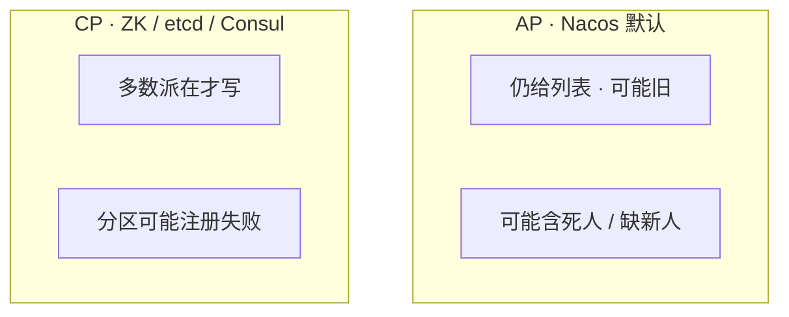
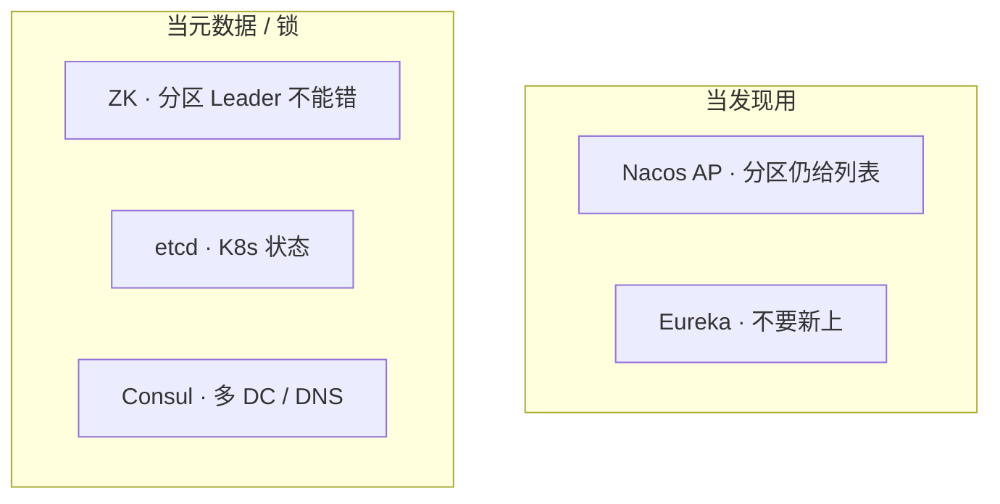
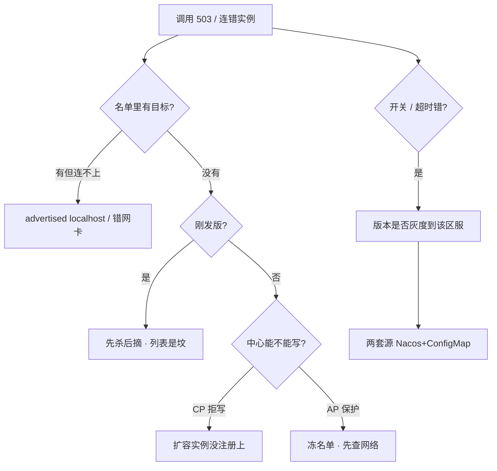

# 注册中心与配置中心

> 活动整点扩了 10 台大厅，机房到 Nacos 的网抖了 30 秒。监控心跳超时飙红，群里有人要重启全部逻辑服「重新注册」，另有人要把保护模式里 unhealthy 全手动下线——两边都在制造雪崩。
> **本章回答**：名单怎么来、开关怎么下去、中心抖了调用还通不通；摘流、灰度、保护模式怎么下手才不雪崩。
> **不讲**：etcd Raft / quorum / 备份 → [03-02 etcd](../../03-Kubernetes/02-etcd/)；ConfigMap / Secret → [03-12](../../03-Kubernetes/12-配置与密钥/)；优雅退出细节 → [03-04 Pod](../../03-Kubernetes/04-Pod生命周期/)；网关动态路由 → [09](../09-API网关与服务治理/)；Kafka 老集群 ZK 运维 → [03 Kafka](../03-Kafka/)。

**标记**：🎯重点 · 🔥难点 · ⭐常考 · 🔧实操

---

## 一、一张图：名单与开关的一生

> 🎯 **一句话**：排障按三步想——分层（名单 vs 开关）→ 归类（连错 / 中心抖 / 开关错）→ 留证（调用方能连 + 进程日志版本号）。


- 📖 **读图**
  - 🛤️ 主线：分层 → 出生 → 分区 → 下发 → 作战；卡在哪一段，刀就砍哪一段
  - ⭐ 第一刀永远是「调用方机器连名单地址」+「进程日志版本号」，不是重启中心（Q9、Q14）

⭐ 口诀：**「名单管发现，开关管配置；长连接不经中心」**。

本节对应练习题 **Q1、Q14**。带着这张图出发——先把两扇门分开。

---

## 二、分层：注册中心 vs 配置中心

> 🎯 **一句话**：注册中心管名单和租约，配置中心管开关和版本；已打上的长连接不经中心。

进程自己**不知道**对面谁还活着。写死 IP = 把「谁在」刻进发版包：扩一台、挂一台、迁一次机都要改配置。注册中心把「谁在」收成可订阅名单；**租约 / 心跳**到期不续，名单里就该消失。配置中心是另一扇门：超时、活动开关不该为改一个数字就发版。

### 🚪 两扇门各管什么 🎯⭐

- 📋 **注册中心**：实例 `ip:port`、元数据、健康状态；登记、发现、按租约剔除
- 🎚️ **配置中心**：超时、活动开关、区服入口、维护公告；集中存放、watch 下发、版本 / 灰度 / 回滚
- 💾 **调用方本地缓存**：中心抖了短时间还能打——「Nacos 挂了为什么还能打一会儿」的答案
- ✂️ **进程自己的摘流**：preStop / 停匹配 / 主动下线——滚动发布谁先摘谁后杀，中心不替你做

| 在注册/配置中心 | 不在这里 |
|-----------------|----------|
| 实例名单、租约、开关、版本 | 已打上的长连接、内核转发规则 |
| 订阅变更、本地缓存、灰度 | 线程池、监听端口、要重建的数据结构 |
| 健康剔除（慢路径） | Pod 何时 SIGTERM（→ 03-04） |

合服后「区服入口 / 维护公告」更像**配置**：用配置中心推，不要让每个登录去问注册中心「这服还开不开」。

> 💡 **打个比方**：注册中心像商场电子屏上的「营业店铺名单」——新店登记、关门撤牌；配置中心像总部「今日促销规则」——改规则不用重装每家店。已经进店的顾客（长连接）不经过那块屏；屏坏了影响的是「新客找哪家店」。

#### ❓ 为什么中心挂了 ≠ 业务立刻全断？

- ❌ **误读**：注册中心挂了 = RPC 全断、玩家全踢
- ✅ **正解**：已有长连接和本地缓存还能撑一会儿；坏的是**新发现、扩缩、摘流**
- 📎 名单里还有、进程已经要下了——中心**不替你**做优雅摘流（见八节）

> ⚠️ **别混**：注册中心不是 RPC 中继；每请求都问中心会把中心打成单点。值班签名：**「名单管发现，开关管配置；长连接不经中心」**。

> 📝 **面试**：注册中心管名单和租约，配置中心管开关和版本；长连接已打上的不经中心，中心影响新发现、扩缩和摘流。⭐

本节对应练习题 **Q1、Q4**。两扇门钉住了——大厅怎么找到新战斗服？

---

## 三、出生：登记 · 订阅 · 本地缓存

> 🎯 **一句话**：实例登记 + 心跳续约，调用方订阅更新本地缓存；验证要从**调用方机器**连 advertised 地址。

> 💡 **打个比方**：像外卖平台——新店后台登记地址（注册），骑手 App 订阅附近店铺（发现）；已经送到顾客手里的订单（长连接）不会因为后台抖一下立刻取消。

### 📮 一次注册：扩了 3 台战斗服 🔧

活动整点刚扩了 3 台，看名单有没有、大厅能不能打到：

1. 战斗服启动，向 Nacos 登记 `ip:port` + 元数据（区服、房间类型），按租约心跳
2. 跳板机查名单：

```bash
curl -s "http://nacos:8848/nacos/v1/ns/instance/list?serviceName=battle"
```

```text
{"hosts":[
  {"ip":"10.0.12.41","port":9001,"healthy":true,"metadata":{"zone":"s1"}},
  {"ip":"10.0.12.42","port":9001,"healthy":true,"metadata":{"zone":"s1"}},
  {"ip":"10.0.12.43","port":9001,"healthy":true,"metadata":{"zone":"s1"}}
]}
# ← healthy=true ×3 = 注册成功；大厅已订阅则 watch 后本地缓存更新，新登录可分到这三台
```

3. 从**大厅机器**验证 advertised 可达（绕开「控制台看起来在」）：

```bash
nc -zv 10.0.12.41 9001
# Connection refused / 超时 而名单 healthy=true → advertised 写错（localhost / 容器内网 IP）
```

- 🔑 **advertised** = 写进名单、给**对端**连的地址——和 Kafka `advertised.listeners` 同一类坑；下一步查进程注册 IP，不是重启 Nacos
- 🔗 **已有玩家长连接**还是旧那几台——**不经中心**，正常

### 👀 现场怎么读名单

- `healthy=true` 但进程依赖挂了 → 心跳还在，业务已废（见下「两层摘除」）
- `ip:port` 调用方 `nc` 不通 → advertised / 安全组
- 实例数与扩缩不一致 → CP 拒写 / 注册失败 / namespace 错
- 大厅日志无实例变更事件 → 订阅没生效 / namespace 错

### 🩺 两层摘除 🔥

- 🐢 **慢路径**：注册中心按心跳超时剔除（秒级）
- ⚡ **快路径**：调用方超时、熔断、本地摘除
- 两层都要；只靠中心太慢，只靠调用方则新人永远进不了列表

#### ❓ 为什么健康检查不能只探 TCP、也不能把下游全探一遍？

- 🔌 **只探 TCP**：进程在但读不了配置、Redis 挂了——仍该从列表摘掉
- 🌋 **探全下游**：依赖抖动 → 实例在名单里进进出出 → **雪崩**
- ✅ **探自己「能不能接请求」**；下游失败用熔断，不要把 Redis 抖动翻译成「全部注销」

> 📝 **面试**：扩战斗服后先 curl 名单看 healthy 和实例数，再从大厅机器 nc 验证 advertised；已有长连接不经中心，新发现靠订阅更新缓存。⭐

本节对应练习题 **Q1、Q10**。名单会动了——机房到中心抖 30 秒呢？

---

## 四、分区：发现偏 AP · 配置偏 CP 🔥⭐

> 🎯 **一句话**：发现偏 AP——分区仍给列表（可能旧）；配置偏 CP——分裂不能接受。

🔥 很多人答「注册中心应该选 CP 更安全」——**错了**。发现失败整条链没下游，所以偏 AP；配置分裂是业务语义错，所以偏 CP。

> 💡 **打个比方**：AP 像电话簿网断了还给你看**上一版**通讯录——可能有人已搬家，但总比「查无此人、全打不出去」强。CP 像银行账本——分区时宁可暂停开户（拒写），也不能两个窗口各记一套账。

### 📺 场景 A · Nacos 默认 AP + 保护模式

开篇那个现场：

1. 心跳超时实例占比从 2% 飙到 40%
2. 控制台大量 `healthy=false`，但**仍在列表里**——保护模式冻住了名单
3. 大厅本地缓存仍是抖动前列表；已有长连接 RPC **还在打**；新登录可能打到个别刚下线的 → 502 / 超时
4. **说明**：不是业务全死，是「名单略旧 + 个别死人」
5. **第一刀**：查中心到机房网络；**不要**手动清全部 unhealthy，**不要**重启全部逻辑服

### 📺 场景 B · ZK / etcd CP 集群

1. 分区后少数派：写请求失败或超时
2. 刚扩的 10 台战斗服：**注册失败**，名单里看不到
3. 大厅流量仍打旧实例 → 排队、旧实例打满
4. **说明**：不是「列表有死人」，是「新人进不了列表」
5. **第一刀**：看中心能不能写、有没有 Leader；**不要**先加机器



- 📖 **读图**
  - AP：冻名单 / 略旧——先查网络，别清列表
  - CP：拒写 / 缺新人——先看 Leader / quorum，别先加机器

| 维度 | AP / 保护模式 | CP 拒写 |
|------|---------------|---------|
| 已有长连接 | 通常还在 | 通常还在 |
| 新实例注册 | 可能延迟 / 旧列表 | **失败**，名单缺新人 |
| 名单形态 | 有死人 / 冻住 | 缺新人 / 写不进 |
| 第一刀 | 查中心到机房网络 | 查 Leader / quorum |
| 别做 | 手动清全部 unhealthy | 先加机器 |

#### ❓ 为什么发现选 AP、配置选 CP——不是都选「更安全」的 CP？

- 🧭 **发现失败** = 整条链没下游 → 略旧列表还能超时重试，**空列表 = 雪崩**
- 💥 **配置分裂** = 一半开活动一半关 → **业务语义错**，不是超时能兜的
- 🧩 Nacos 常见拆法：发现走 AP、配置走 CP——就是这个取舍（CAP 细节 → [06](../06-分布式理论与一致性/)）

> ⚠️ **别混**：中心挂了，已有调用靠缓存和长连接；扩容摘流会停。发现选 AP，配置选 CP。不要为了「做点什么」重启还活着的战斗服。

> 📝 **面试**：发现失败整条链没下游所以偏 AP；配置分裂是业务语义错所以偏 CP。中心抖了先看已有长连接还在不在，AP 别清保护模式名单，CP 先看扩容有没有注册上。⭐

本节对应练习题 **Q2、Q4、Q7**。取舍清楚了——四套产品差在哪？

---

## 五、选型：Nacos / ZK / Consul / etcd ⭐

> 🎯 **一句话**：业务发现国内首选 Nacos；etcd 给 K8s 用；ZK 管元数据不是默认发现；Consul 强在 DNS / 多 DC。

> 💡 **打个比方**：Nacos 像商场自带「店铺屏 + 广播」——一体够用。ZK 像老写字楼「门禁临时卡」——人走卡消，抖一下可能误删。Consul 像跨国连锁「总部目录 + 各地 DNS」。etcd 是 K8s 这栋楼的「物业总台账」——别和业务店铺屏混谈。

### 🔀 先分叉：业务发现还是 K8s 控制面？

- 🎮 **业务发现** → 国内常见 Nacos：Open API **8848**，客户端 gRPC **9848**
- ☸️ **K8s 控制面** → Service / DNS + etcd 存集群状态；etcd 运维 → [03-02](../../03-Kubernetes/02-etcd/)
- 🧓 **老 Dubbo / 老 Kafka** → 可能还在 ZK：**2181**，临时节点断连从树上消失
- 🌍 **HashiCorp 栈** → Consul：**8500** HTTP、**8600** DNS（`*.service.consul`）

| 方案 | CAP | 一身二职 | 健康怎么摘 | 现场怎么记 |
|------|-----|----------|------------|------------|
| **Nacos** | AP/CP 可选，默认 AP | 注册 + 配置 | 心跳超时才摘 | 国内微服务最常见 |
| **ZooKeeper** | CP | 协调（锁、选主、注册） | 临时节点断连消失 | 老 Dubbo / 老 Kafka |
| **etcd** | CP | K8s 状态；也可当发现 | lease 过期删 key | 运维细节在 03-02 |
| **Consul** | CP | 发现 + KV + 多 DC | 主动 HTTP/TCP check；原生 DNS | HashiCorp 栈 |
| **Eureka** | AP | 注册 | 心跳 | 已 EOL，只在老项目 |



- 📖 **读图**：左栏偏发现可用；右栏偏元数据一致——四套 CAP、健康机制、运维对象都不一样，不能一句「都是注册中心」带过

#### ❓ 为什么新项目不要默认 ZK / 业务 Pod 不要直连 etcd？

- 🧩 **ZK 临时节点**：TCP 抖动会误删，客户端要防抖；适合「进程在才有节点」。Kafka 仍用它（或 KRaft）是因为**分区 Leader 信息不能错**——那是元数据，不是服务列表。新微服务发现不必默认 ZK
- ☸️ **etcd**：K8s 存集群状态，Service 发现走 API/DNS；lease 过短抖动、过长死人残留——落到 K8s 组件上问 03-02，不要在业务发现里手搓一套 etcd TTL 当 Nacos
- 🌐 **Consul**：中心主动探活 + DNS + 多 DC WAN gossip；CP，分区写失败，和 ZK 同类取舍
- 🆚 **Nacos vs Apollo**：中小规模一体够用；多团队改开关、要强权限灰度审计，配置侧看 Apollo

选型心法：**发现优先可用（AP）**，**配置优先一致（CP）**。K8s 里无状态用 ConfigMap 即可；跨集群、非 K8s、要精细灰度，用 Nacos / Apollo——两边概念类似，**不要叠两套改同一份超时**。

> 📝 **面试**：业务发现选 Nacos AP；etcd 是 K8s 控制面，运维问 03-02；ZK 适合不能看错的元数据（如 Kafka Leader），不是新项目默认发现；Consul 强在 DNS 和多 DC。⭐

本节对应练习题 **Q3**。产品定了——开关怎么才算「下去」？

---

## 六、下发：热更新 · 灰度 · 回滚 🔥⭐

> 🎯 **一句话**：配置下去 = 进程 watch 到且日志版本号对得上；不是控制台「已发布」。

🔥 很多人答「控制台显示已发布就算热更新」——**错了**。

> 💡 **打个比方**：像给前线发新作战口令——总部文件柜里换了（控制台已发布）不算数，每个连队电台收到并确认（进程 listener + 版本号）才算生效。

### 🎚️ 现场：s1 区服礼包开关 🔧

运营要把 s1 礼包开关打开，23:59 活动整点：

1. 改 `activity.yaml`，带版本号，**先灰度到 s1**——不要全量一把推
2. 查配置：

```bash
curl -s "http://nacos:8848/nacos/v1/cs/configs?dataId=activity.yaml&group=DEFAULT_GROUP"
```

```text
gift.enabled=true
# md5: a3f2b8c1...
```

3. SSH 到 s1 一台战斗服：

```bash
grep -i 'config\|nacos\|refresh' /var/log/battle/app.log | tail -5
```

```text
[Nacos] Received config change, dataId=activity.yaml, version=47, md5=a3f2b8c1
[Config] gift.enabled=true applied
# ← version=47、md5 与控制台一致 = 热更新成功；仍是 46 → 没 watch / listener 没实现 / namespace 错
```

4. 观察 s1 结算、客服单 10 分钟 → 确认再全量；失败 → **回滚上一版本**，秒级，不要再发版救


- 📖 **读图**：分叉在「进程用上了吗」——控制台已发布只走到 C；真正过关看日志版本号

### 🔑 能热更 vs 要重启

- ✅ **能热更**：开关、超时、名单、活动开始时间、排队阈值、区服入口、维护公告
- 🔁 **仍要重启**：线程池大小、监听端口、数据结构变了、连接串、证书路径、分片规则（迁移 → [07](../07-分库分表与中间件/)）

推送机制：Nacos 长轮询 + 推；ZK / etcd / Consul 是 watch。进程必须实现 listener。相关键放同一个 dataId，避免一半新一半旧。

#### ❓ 为什么不能 Nacos + ConfigMap 两套源改同一份超时？

- 🥊 两边值还不一样 → 半新半旧、排障对不上版本
- ✅ 同一份超时**只留一套**：集群内无状态用 ConfigMap（→ [03-12](../../03-Kubernetes/12-配置与密钥/)）；跨集群 / 精细灰度用 Nacos / Apollo
- ⚠️ Spring `@RefreshScope` 会重建 bean，进行中请求可能半新半旧；长生命周期对象（线程池）改大小不安全——能热更的键要列白名单

> ⚠️ **别混**：推错支付开关 = 事故。权限和审批按配置中心的，不要个人 token 直改生产。

> 📝 **面试**：热更新成功看进程日志版本号和 md5，不是控制台；活动开关先灰度一个区服，失败回滚上一版本；同一份超时不要 ConfigMap 和 Nacos 两套源。⭐

本节对应练习题 **Q5、Q13**。机制齐了——生产怎么装、动哪些旋钮？

---

## 七、落地与关键旋钮

> 🎯 **一句话**：业务发现选 Nacos AP；配置选 CP 或 Apollo；保护模式开着；advertised 必须对端可达。

### 🏗️ 生产怎么选

| 项 | 选 | 不选 |
|----|----|------|
| 业务发现 | Nacos（AP）；已有 ZK 生态可继续 | 新项目默认 ZK；Eureka 新上；业务 Pod 直连 etcd |
| 配置 | Nacos CP 或 Apollo；集群内 ConfigMap | 两套源改同一份超时；SSH 改文件 |
| 多 DC / DNS | Consul | 用 ZK 硬撑跨城 |
| 节点数 | 3（CP 奇数）；Nacos 集群不要单点 | 单机当生产 |
| 地址 | advertised 对端可达 | localhost、容器内网 IP 对不上 |

- **Nacos**：8848 控制台 / Open API，9848 gRPC；`cluster.conf`；数据盘独立；鉴权打开
- **ZK**：2181；ZAB 3 或 5；临时节点 + watch；不要当大配置仓库灌
- **Consul**：8500 / 8600；server 3 或 5；跨 DC 走 WAN gossip
- **验收**：控制台名单地址从**调用方** telnet 通；订阅方日志有版本 / 实例变更；杀实例后超时窗口名单消失（或主动下线立即消失）。不要只探 8848 TCP

### 🎛️ 会改变「死人还在不在名单」的项

| 参数 / 项 | 生产怎么用 | 改错会怎样 |
|-----------|------------|------------|
| 心跳间隔 / 超时 | 覆盖同城 RTT + GC；过短误摘 | 过长死人残留；过短抖动 |
| Nacos 保护模式 | **开着**；大量失联时冻名单 | 关掉 + 网抖 = 发现为空雪崩 |
| advertised / IP | 调用方可达的 IP/DNS | 名单有、连不上 |
| dataId / group / namespace | 环境隔离；相关键同一份 | 改了 test 打到 prod；半新半旧 |
| 鉴权、审计 | 生产强制 | 个人 token 直改支付开关 |
| 客户端缓存 TTL | 有上限，配合推送 | 永不刷新打坟场；刷新太勤打中心 |
| ConfigMap vs Nacos | 同一份超时只留一套 | 两套源打架 |

> ⚠️ **别混**：保护模式看起来像「死人还在」，先查网络，不要手动清列表。心跳用来覆盖同城抖动，不是用来扛跨地域。

本节对应练习题 **Q3、Q8、Q11、Q12**。旋钮认清了——值班怎么动手？

---

## 八、操作：摘流 · 灰度 · 保护模式 🔧

> 🎯 **一句话**：名单有没有 → 地址能不能连 → 是不是先杀后摘 → 配置版本对不对。

### 🔧 命令入口

```bash
# 服务实例列表
curl -s "http://nacos:8848/nacos/v1/ns/instance/list?serviceName=battle"
# 配置（带 tenant/group）
curl -s "http://nacos:8848/nacos/v1/cs/configs?dataId=timeout.yaml&group=DEFAULT_GROUP"
# ZK 临时节点（老 Dubbo）
echo stat | nc zk1 2181
zkCli.sh -server zk1:2181 ls /dubbo/com.example.BattleService/providers
# Consul
consul members
consul catalog services
dig @127.0.0.1 -p 8600 battle.service.consul
```

值班顺序：名单有没有实例 → 地址能不能连 → 是不是刚发版先杀后摘 → 配置版本是否灰度到该区服 → 两套源是否打架。

### ✂️ 摘流与滚动：先摘再杀 ⭐

K8s 滚大厅。正确顺序：先从注册中心摘流 → 打完存量连接 → 再杀进程。注册中心**不替你**做这一步。配合 preStop 和就绪探针 → [03-04](../../03-Kubernetes/04-Pod生命周期/)。


- 📖 **读图**：箭头顺序就是发版铁律；反了 = 列表是坟

#### ❓ 为什么不能先杀 Pod 再等心跳摘流？

- ☠️ **先杀后摘**：名单里地址还在，大厅把新请求打到正在退出的进程 → 登录 **502 / 超时**
- ✅ **正确**：preStop 里主动从 Nacos 下线 → 等存量连接打完 → 再 SIGTERM
- 🩺 健康检查不要只探 TCP（三节）：进程在但依赖挂了，仍应摘掉

本节对应练习题 **Q6**。

### 🎚️ 配置灰度与回滚

1. 改配置带版本 → 灰度到 s1 → 看结算 / 客服单
2. 确认再全量；失败 → 回滚上一版本，不要再发版救
3. 进程日志版本号对得上才算下去（六节）

支付开关、活动整点开关必须走这条。本节对应练习题 **Q13**。

### 🛡️ 保护模式：不要清名单 ⭐🔥

Nacos **保护模式**：大量实例同时失联（往往是注册中心到机房的网络，不是业务全死）时，不立刻清空列表，避免「误剔除 → 发现为空 → 雪崩」。⭐ 开篇「手动清 unhealthy」那位踩的坑。

**现场走一遍**（活动整点网抖 30 秒）：

1. 20:00 活动开始，机房到 Nacos 专线抖 30 秒
2. 控制台：实例还在列表，healthy 参差；日志 `protect mode enabled`
3. 大厅仍按抖动前本地缓存打；已有长连接正常；个别 502 是打到真死人，不是名单被清空
4. 有人要把全部 unhealthy 手动下线——**等于自己制造发现为空、登录全挂**
5. **第一刀**：查中心到机房网络（mtr / 专线告警），等心跳恢复；保护模式会自动解除
6. 网络恢复后心跳陆续 healthy，业务自行恢复

关掉保护模式更「真实」？——网抖时会发现为空，生产**开着**。

本节对应练习题 **Q8、Q12**。操作会了——接到报障怎么 60 秒定责？

---

## 九、作战：定责

> 🎯 **一句话**：注册中心不可用 = 不能扩容摘流，不是立刻踢玩家；已打上的长连接通常还在。

和主机排障同一套三问：进程还在不在？还能不能变更？已有流量还通不通？



- 📖 **读图**
  - 🚪 先分叉「名单问题」还是「开关问题」
  - 🛤️ 名单分支：有但连不上 → advertised；没有 → 发版顺序 vs CP 拒写 vs AP 保护
  - 🎚️ 开关分支：版本 / 灰度 / 两套源

### 现象 · 先做 · 别做

| 现象 | 先做什么 | 不要做什么 |
|------|----------|------------|
| 中心挂了 | 已有长连接通常还在；修中心 | 重启全部逻辑服 |
| 保护模式冻名单 | 查中心到机房网络 | 手动清掉全部 unhealthy |
| 502 刚发版 | 先摘后杀、preStop | 加机器 |
| 名单有连不上 | advertised；从调用方 telnet | 当中心坏了去重启 |
| 一半开活动一半关 | 配置版本 / 灰度 / 两套源 | 再发版救 |
| 每请求打中心 | 订阅 + 缓存 | 给中心加节点当第一刀 |

### 60 秒剧本 🔧

> 🔍 **现场**：接到「匹配不到 / 502 / 开关没生效」，别先重启中心。

```text
① 0–10s  分层：名单问题还是开关问题？开关 → 控制台版本 vs 进程日志；名单 → curl 实例列表
② 10–30s 从调用方机器 nc 名单地址；不通 = advertised。刚发版？查是不是先杀后摘
③ 30–45s 中心抖：AP 看保护模式 + 到机房网络；CP 看 Leader / 扩容有没有注册上
④ 45–60s 定责：修网络 / 修 advertised / 补摘流 / 回滚配置——不要清 unhealthy、不要重启全部逻辑服
```

指标：注册中心进程 / 多数派挂 → **P0**（扩容摘流停）；心跳超时大面积 → P1 先看中心到机房网络；支付 / 活动开关版本不一致 → **P0**；客户端打中心 QPS 飙 → P1 缓存没生效。

日志关键词：`localhost` 注册、`connection refused` 打名单地址、配置 `md5` / 版本对不上、`protect`。

常见误判：① 中心挂了 = 业务全死 ② CP 注册中心更「企业级」 ③ etcd 运维题在这章展开 ④ 健康检查只探 TCP。

现在再看开篇「重启全部逻辑服」「清全部 unhealthy」——先看已有长连接还在不在，AP 别清保护名单，修中心到机房网络。

本节对应练习题 **Q9、Q14**。

---

## 十、收口

### 命令速查 🔧

```bash
# 名单
curl -s "http://nacos:8848/nacos/v1/ns/instance/list?serviceName=battle"
nc -zv <名单IP> <port>                    # 必须从调用方机器敲
# 配置
curl -s "http://nacos:8848/nacos/v1/cs/configs?dataId=activity.yaml&group=DEFAULT_GROUP"
grep -i 'config\|nacos\|refresh' /var/log/<app>/app.log | tail -20   # 版本号 / md5
# ZK / Consul
echo stat | nc zk1 2181
zkCli.sh -server zk1:2181 ls /dubbo/.../providers
consul members; consul catalog services
dig @127.0.0.1 -p 8600 battle.service.consul
```

### 面试锚点

| 问 | 30 秒答 |
|----|---------|
| 注册 vs 配置？长连接经中心吗？ | 名单+租约 vs 开关+版本；已打上的长连接不经中心。 |
| 发现 AP 还是 CP？配置呢？ | 发现偏 AP（空列表雪崩）；配置偏 CP（分裂是语义错）。 |
| 中心挂了业务全断？ | 否。已有连接和本地缓存还能撑；扩容摘流会停。 |
| Nacos / ZK / Consul / etcd？ | Nacos 国内发现首选；ZK 元数据/锁；Consul DNS+多 DC；etcd 是 K8s 控制面。 |
| 热更新怎样才算成功？ | 进程日志版本号/md5 对得上，不是控制台已发布。 |
| 哪些键不能热更？ | 端口、线程池、结构变化、连接串、证书——要重启。 |
| 滚动发布先做什么？ | 先摘流再杀进程；先杀后摘 = 列表是坟 → 502。 |
| 保护模式该清名单吗？ | 不。先查中心到机房网络；清了会发现为空雪崩。 |
| advertised 写成 localhost？ | 别的机器连 127.0.0.1 → 名单有、连不上。 |
| 每请求都问注册中心？ | 会打成单点；订阅 + 本地缓存。 |
| 健康检查只探 TCP？ | 不够；进程在但依赖挂了仍该摘；别把下游全探进探活。 |
| Nacos + ConfigMap 改同一超时？ | 两套源打架；只留一套。 |

### 易错一句话对照

- 中心挂了 = 长连接全断 → 长连接不经中心；扩容摘流会停
- 发现应该选 CP 更安全 → 发现优先 AP；配置优先 CP
- 新项目用 ZK 当默认注册中心 → 元数据/锁才强依赖 CP；发现用 Nacos
- 业务 Pod 直连 etcd 当 Dubbo 注册 → K8s 发现走 API/DNS；etcd 运维在 03-02
- Consul 和 Nacos 没区别 → Consul CP + 主动探活 + DNS + 多 DC
- Eureka 还可以新上 → 已 EOL
- 控制台已发布 = 热更新成功 → 进程日志版本号对得上才算
- 所有配置都能热更 → 端口、线程池、结构变化要重启
- 滚动可以先杀再等心跳摘 → 先摘再杀，否则列表是坟
- 保护模式应手动清 unhealthy → 先查网络，清名单会雪崩
- 健康检查探 TCP 就够 → 进程在但依赖挂了仍该摘
- Nacos 和 ConfigMap 可同时改同一超时 → 两套源打架
- advertised 写成 localhost 没问题 → 别的机器连 127.0.0.1
- 每个 RPC 都问注册中心 → 订阅 + 本地缓存
- 关掉保护模式更真实 → 网抖时发现为空，生产开着

### 数字墙

> Nacos **8848** / **9848** · ZK **2181** · Consul **8500** / **8600** DNS · CP 集群 **3 或 5** · 保护模式 = 机房到中心网抖时冻名单（不是业务全死）· 配置灰度先 **1** 个区服 · 排障三步：分层 → 归类 → 留证

---

## 合上书

对着第一节主图口述一遍。开头那个现场——「重启全部逻辑服」和「清 unhealthy」各自错在哪，现在该能说清了。

- [ ] **默画主图**：入口（名单还是开关）→ 出生 → 分区 → 下发 → 作战；标出 `curl`/`nc`/日志版本照哪段。（Q1 · Q14）
- [ ] **口述分层**：注册 vs 配置各管什么；为什么中心挂了 ≠ 长连接全断。（Q1 · Q4）
- [ ] **口述出生**：登记 → 订阅 → 缓存；advertised 怎么验；两层摘除；探活为什么不能只探 TCP / 探全下游。（Q1 · Q10）
- [ ] **口述分区**：发现为什么偏 AP、配置为什么偏 CP；AP 保护 vs CP 拒写第一刀各砍哪。（Q2 · Q7）
- [ ] **口述选型**：Nacos / ZK / Consul / etcd 各适合什么；etcd 运维问哪章。（Q3）
- [ ] **口述热更新**：怎样才算成功；能热更 vs 要重启；灰度 / 回滚；为什么不能两套源。（Q5 · Q13）
- [ ] **口述操作**：先摘再杀；保护模式是什么、该不该清名单。（Q6 · Q8 · Q12）
- [ ] **定责**：502 / 连错 / 中心抖 / 开关错各走哪条分支——再拆开开篇那两刀。（Q9 · Q14）

下一章：玩家进业务第一跳——超时链、5xx、鉴权限流熔断 → [09 API网关与服务治理](../09-API网关与服务治理/)。
