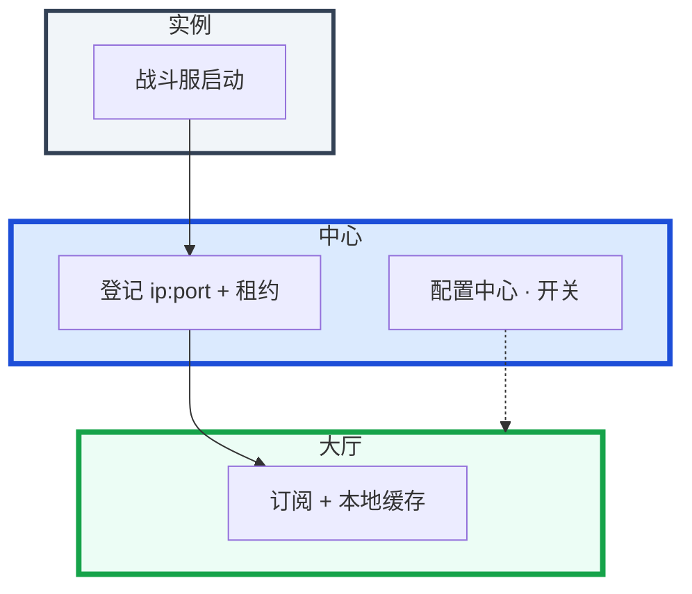
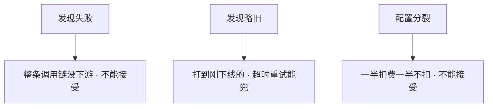
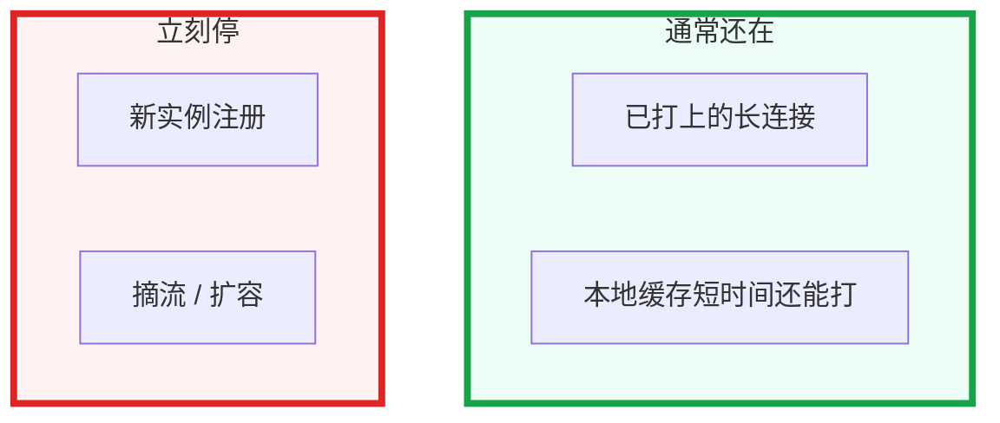
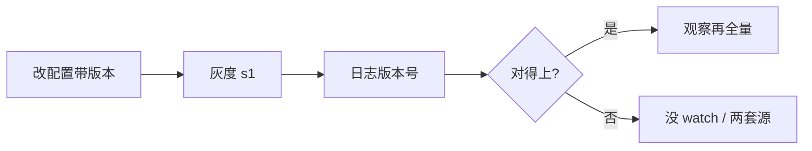
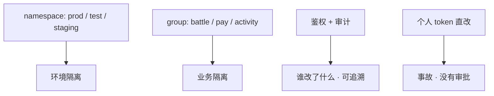

# 07｜注册中心与配置中心 · 练习题

先对照 [知识点](知识点.md) **本章主线** 自己口述，再对答案。每题标了覆盖范围：

| 标记 | 含义 |
|------|------|
| **核心** | 不懂整章就没建立起来 |
| **必会** | 值班和面试都要能讲 |
| **常用** | 线上会反复碰到 |
| **常考** | 白板和追问的高频口径 |

## 本题目录

- [Q1 为什么需要注册中心](#q1)
- [Q2 AP vs CP](#q2)
- [Q3 Nacos / ZK / Consul / etcd](#q3)
- [Q4 中心挂了，长连接还在吗](#q4)
- [Q5 配置热更新](#q5)
- [Q6 滚动摘流](#q6)
- [Q7 配置必须 CP](#q7)
- [Q8 健康检查与保护模式](#q8)
- [Q9 排障分流](#q9)
- [Q10 Watch 与本地缓存](#q10)
- [Q11 namespace 与鉴权](#q11)
- [Q12 实例假活与保护模式](#q12)
- [Q13 配置灰度与回滚](#q13)
- [Q14 注册中心 60 秒定责](#q14)
- [合上书](#合上书)

---

## Q1

**★★★★★｜为什么需要注册中心？它解决什么问题？画架构**

**覆盖**：核心 · 必会 · 常考
**对应**：知识点 [1. 基本概念](知识点.md)、[2. 架构图](知识点.md)

### 场景

白板：「战斗服扩了 20 个 Pod。大厅配置文件里还是老 IP。要不要改完配置滚动大厅？」有人开始背 Nacos 安装。

### 完整解答

**一句话**：注册中心让实例登记、调用方订阅；长连接已打上的不经过中心，影响新发现和扩缩。

写死 IP 在实例变化时就是运维地狱。注册中心让实例启动登记，调用方订阅列表，健康检查摘死人。



职责：注册、发现、健康剔除；很多产品兼任配置。长连接已经打上的玩家，不经过注册中心；中心影响的是 **新发现、扩缩、摘流**。合服后区服入口走配置，不要每个登录问注册中心「这服还开不开」。

### 再追问

- 每请求都问中心？——会把中心打成单点。订阅 + 本地缓存，TTL 和推送缺一不可。
- 注册中心替你做优雅摘流吗？——不。preStop / 停匹配要自己做（03-04）。

---

## Q2

**★★★★★｜注册中心选 AP 还是 CP？配置中心呢？**

**覆盖**：核心 · 必会 · 常考
**对应**：知识点 [3.2 AP vs CP：中心抖了，调用还通不通](知识点.md)

### 场景

网络抖动，Nacos 一部分节点看不到新扩的逻辑服。有人说「应该上 ZK，强一致更安全」。

### 完整解答

**一句话**：发现偏 AP 分区仍给列表（可能旧），配置偏 CP 分裂不能接受；发现略旧可重试，配置分裂是业务语义错。

发现选 AP：分区时仍给可用列表（可能旧），调用方用旧地址 + 重试 + 自己探活。CP 分区可能拒绝注册，扩出来的实例进不了列表，登录 / 匹配会挂。

配置选 CP：超时、开关不能各实例各一套。Nacos 发现默认 AP、配置可 CP，就是这个拆法。



### 再追问

- ZK 是 CP，为什么 Kafka / Dubbo 用它？——它们要的是 **不能看错的元数据**（分区 Leader），不是「多一个无状态 HTTP 实例」。新微服务发现不必再默认 ZK。Kafka 新集群走 KRaft，见 05。
- AP 配置中心绝对不能用吗？——能用，但要接受短暂不一致。支付、活动开关不要赌这段窗口。

---

## Q3

**★★★★★｜Nacos、ZooKeeper、Consul、etcd 怎么区分？**

**覆盖**：核心 · 必会 · 常考
**对应**：知识点 [3.3 Nacos / ZK / Consul / etcd：对比](知识点.md)

### 场景

「你们注册中心是什么？etcd 挂过吗？」把 K8s 控制面和业务发现搅在一起。另有人说 Consul 和 Nacos 没区别。

### 完整解答

**一句话**：Nacos 发现+配置首选；etcd 给 K8s 用运维见 04-02；ZK 临时节点抖动会误删。

| | Nacos | ZK | Consul | etcd |
|--|-------|-----|--------|------|
| CAP | 默认 AP，配置可 CP | CP | CP | CP |
| 职责 | 注册 + 配置 | 锁 / 选主 / 老注册 | 发现 + KV + 多 DC + DNS | K8s 状态库 |
| 健康 | 心跳超时才摘 | 临时节点断连即删 | 中心主动 HTTP/TCP | lease 过期删 key |
| 新项目发现 | **首选** | 不必默认 | HashiCorp / 要 DNS 多 DC | 不要业务直连 |

etcd **磁盘、quorum、备份、挂了 Pod 还在不在** → [03-02](../../03-Kubernetes/02-etcd/)。本章只答：CP、给 K8s 用、和 Nacos 不是同一个运维对象。Eureka 已 EOL。ZK 临时节点 TCP 抖动会误删，要防抖。

### 再追问

- Nacos 配置和 Apollo 怎么选？——一体、中小规模 → Nacos。多团队、强权限、灰度、审计 → Apollo。
- K8s 里还要 Nacos 发现吗？——Service / DNS 已能发现集群内服务；跨集群、非 K8s、游戏大厅找战斗服仍常见 Nacos。

---

## Q4

**★★★★★｜注册中心挂了，已经在线的战斗长连接会断吗？还能扩容吗？**

**覆盖**：核心 · 必会 · 常考
**对应**：知识点 [3.1 一次注册：大厅怎么找到新战斗服](知识点.md)

### 场景

Nacos 集群不可用。群里要重启全部逻辑服「重新注册」。

### 完整解答

**一句话**：中心挂了已在线长连接还在、本地缓存短时间可用；新注册和扩缩立刻停，别重启战斗服。

拆影响面，不要答「微服务全死」。



不要为了「做点什么」重启还活着的战斗服。先修中心、确认保护模式有没有把列表冻住，再考虑是否需要客户端强制刷新。缓存过期后新发现失败。

### 再追问

- 和 etcd / 控制面挂了像不像？——同一类：已运行的还在，变更停。etcd 细节去 04-02。
- 缓存无限期不刷新？——会把流量打到坟场。要有 TTL 和调用方自己的失败摘除。

---

## Q5

**★★★★☆｜配置怎么热更新？和 ConfigMap 什么关系？**

**覆盖**：必会 · 常用 · 常考
**对应**：知识点 [3.4 配置热更新：推到进程才算下去](知识点.md)

### 场景

运营要开某区服礼包开关。有人发版。集群内服务已经用 ConfigMap，又上了一套 Nacos，超时改了两处，值还不一样。控制台显示「已发布」，进程还是旧超时。

### 完整解答

**一句话**：配置热更新 = 进程 watch 到且版本号对得上；同一份超时不要 ConfigMap 和 Nacos 两套源。

配置下去 = **进程 watch 到、日志里版本号对得上**。不是控制台已发布。要：版本、灰度（先一个区服）、能回滚上一版本、权限审计。

能热更：开关、超时、名单、活动时间。仍要重启：线程池、端口、数据结构。同一份超时不要两套源。ConfigMap 是集群内、etcd 存，热更能力看挂载方式，见 04-12。跨集群、非 K8s、要灰度审批，用 Nacos / Apollo。



推错支付开关按事故处理。回滚是上一版本，不是再发版救。

### 再追问

- 所有配置都能热更新吗？——不能。能热更的键列白名单。
- `@RefreshScope`？——会重建 bean，进行中请求可能半新半旧。

---

## Q6

**★★★★☆｜滚动发布时注册中心这边要先做什么？**

**覆盖**：必会 · 常用
**对应**：知识点 [6.1 摘流与滚动：先摘再杀](知识点.md)

### 场景

K8s 直接杀 Pod。注册中心里地址还在，大厅把新请求打到正在退出的进程，登录 502。

### 完整解答

**一句话**：滚动发布先摘流再停进程；preStop + 就绪探针，先杀再摘列表是坟。


先杀再摘 = 列表是坟。配合 preStop 和就绪探针，见 03-04。健康检查不要只探 TCP：进程在但依赖挂了，仍应摘掉。

### 再追问

- 注册了 localhost 会怎样？——别的机器按列表连 127.0.0.1。advertised 必须是调用方可达的 IP/DNS。
- 只靠心跳过期摘流？——窗口内仍打坟。主动下线 + 调用方超时两层都要。

---

## Q7

**★★★★☆｜为什么说「配置中心更要 CP」？给一个游戏反例。**

**覆盖**：必会 · 常用 · 常考
**对应**：知识点 [3.2 AP vs CP：中心抖了，调用还通不通](知识点.md)

### 场景

活动开关推送，一半战斗服用了新配置开活动，一半还是关。匹配跨到两种服，结算乱。

### 完整解答

**一句话**：配置分裂比发现略旧更糟；活动开关要强一致、带版本、先灰度一个区服。

配置分裂比发现略旧更糟。发现旧列表最多打到一台刚下线的，超时重试。配置一半开活动一半不开，是 **业务语义错**，不是超时。

所以配置走强一致、带版本、先灰度一个区服，确认结算再全量。回滚是上一版本，不是再改一刀「应该是关」。大厅发现战斗服用注册；区服开关、活动开关用配置。

### 再追问

- 合服名单该走注册还是配置？——区服入口、维护公告走配置推送，不要每个登录问注册中心。
- 个人 token 直改生产？——推错支付开关 = 事故。走审批。

---

## Q8

**★★★★☆｜健康检查只探端口够不够？保护模式是什么？**

**覆盖**：必会 · 常用
**对应**：知识点 [6.3 保护模式：不要清名单](知识点.md)

### 场景

进程听着端口，依赖的 Redis 挂了。注册中心里它仍健康。另一次机房到 Nacos 网抖 30 秒，有人要把全部「不健康」实例手动下线。

### 完整解答

**一句话**：端口通不等于能干活；保护模式防网抖误剔除，不要手动清全部不健康实例。

端口通 ≠ 能干活。就绪应该包含关键依赖，或进程自己在失败时停心跳。但探活不要把下游全探一遍——Redis 抖动会让实例进进出出，触发雪崩。探自己「能不能接请求」，下游失败用熔断。

注册中心剔除是慢路径；调用方超时、熔断是快路径。两层都要。

**保护模式**：大量实例同时失联时不立刻清空列表，防误剔除雪崩。先查中心到机房的网络，不要手动把列表清光。手动下线全部不健康 = 自己制造发现为空、登录全挂。

### 再追问

- 心跳过短？——GC / 瞬时抖动会误摘。过长则死人残留。
- 关掉保护模式更「真实」？——网抖时会发现为空。生产开着。

---

## Q9

**★★★★☆｜给出现象，你先走哪条排障路？**

**覆盖**：必会 · 常用
**对应**：知识点 [7. 生产排障](知识点.md)

### 场景

四个工单：① 中心不可用，有人要重启逻辑服 ② 刚发版登录 502 ③ 名单有实例但连不上 ④ 一半区服活动开了、一半没开。

### 完整解答

**一句话**：中心不可用修中心看保护模式；502 先查摘流顺序；一半开活动查配置版本和两套源。

| # | 走哪条 | 不要做 |
|---|--------|--------|
| ① | 长连接通常还在；修中心；看保护模式 | 重启全部战斗服 |
| ② | 先杀后摘，列表是坟 | 先加机器 |
| ③ | advertised localhost / 错网卡；从调用方 telnet | 重启注册中心 |
| ④ | 配置版本、灰度、两套源 | 再发版救 |

现场：从调用方连名单地址 → 对版本号 → 看滚动顺序。不要先重启注册中心——会再抖一轮名单。

### 再追问

- 托管了这章能跳过吗？——不能。影响面、灰度、advertised、两套源仍是你的。
- 每请求打中心 QPS 很高？——缓存没生效，不要先给中心加节点。

---

## Q10

**★★★★☆｜Watch 和订阅怎么工作？本地缓存 TTL 多少合适？**

**覆盖**：必会 · 常用 ｜ **对应**：知识点 [3.1 一次注册：大厅怎么找到新战斗服](知识点.md)

### 场景

Nacos 控制台显示新实例已注册，但大厅 5 分钟后才发现。有人把缓存 TTL 调到 0「保证实时」，中心 QPS 飙到几万。

### 完整解答

> 🎯 **一句话**：调用方订阅 + 本地缓存，中心推送变更 + TTL 兜底；TTL=0 把中心打成单点。


订阅机制两件套：

- **Watch / 长轮询**：中心在名单变更时主动推给订阅方。Nacos 长轮询 + 推；ZK / etcd / Consul 是 watch。
- **本地缓存 + TTL**：调用方缓存名单在内存里，TTL 过期再拉一次兜底。推送快但不可靠（网络抖、进程重启可能丢），TTL 慢但兜底。

TTL 的矛盾：

- 太长（5 分钟）：实例下了还在打，502 窗口大。
- 太短 / 0：每次过期都拉，中心 QPS = 调用方实例数 x 每秒拉取次数，中心被打成单点。
- 合理值：**10～30 秒**，配合推送。已有长连接不经中心，TTL 影响的是新发现和摘流。

> ⚠️ **别混**：Watch 推送是快路径，TTL 拉取是兜底。不要只靠 TTL 不订阅（延迟大），也不要只靠推送不设 TTL（丢了不兜底）。

> 📝 **面试**：「调用方订阅 + 本地缓存两件套：中心推送变更是快路径，TTL 拉取是兜底。TTL 合理 10～30 秒；调到 0 等于每请求打中心，把中心打成单点。已有长连接不经中心，TTL 影响的是新发现和摘流。」

### 再追问

- 缓存无限期不刷新？——会把流量打到坟场。TTL 是防墓碑的安全网。
- 每请求都问中心？——缓存没生效。排查订阅是否成功、namespace 是否对。

---

## Q11

**★★★★★｜namespace / group / 鉴权怎么管？推错配置怎么办？**

**覆盖**：必会 · 常用 · 常考 ｜ **对应**：知识点 [5. 核心配置](知识点.md)

### 场景

测试环境配置推到了生产 namespace，支付开关被打开。个人 token 直改生产配置没有审计。合服后区服入口写错 namespace。

### 完整解答

> 🎯 **一句话**：namespace 隔离环境，group 隔离业务；生产强制鉴权审计，推错支付开关按事故处理。



三层隔离：

- **namespace**：环境隔离（prod / test / staging）。改了 test 的配置不能打到 prod。
- **group**：业务隔离（battle / pay / activity）。相关键放同一 group 的同一 dataId，避免半新半旧。
- **鉴权 + 审计**：生产强制开鉴权，不要对整个 VPC 裸奔。谁改了什么、什么时间、什么版本——可追溯。

推错配置的后果：

- 支付开关推错 = 事故，不是「再改回来」就行。
- 回滚是**上一版本**，不是再发版救。
- 活动开关先**灰度一个区服**，确认结算再全量。
- 个人 token 直改生产 → 走审批，不要绕过。

> ⚠️ **别混**：namespace 隔离环境，group 隔离业务，dataId 隔离配置项。三层各管各的，不要混用。

> 📝 **面试**：「namespace 隔离环境、group 隔离业务、dataId 隔离配置项。生产强制鉴权审计，不要对 VPC 裸奔。推错支付开关 = 事故，回滚上一版本不是再发版救。」

### 再追问

- 合服名单走哪个？——区服入口、维护公告走配置推送（namespace = prod, group = game, dataId = server-list）。不要每个登录问注册中心。
- 配置版本怎么看？——控制台版本号 vs 进程日志 md5/版本号，对得上才算下去（Q5）。

---

## Q12

**★★★★☆｜实例进程挂了但注册中心仍显示 UP，流量还在打？**

**覆盖**：必会 · 常用 ｜ **对应**：知识点 [3. 原理](知识点.md)

### 场景

战斗 Pod OOM 后，Nacos 仍显示 3 个健康实例。玩家匹配进黑洞实例。

### 完整解答

> 🎯 **一句话**：**心跳 TTL 窗口**——进程死但心跳未过期；要 **主动注销 + 探活 + K8s preStop 摘流**，**不要**只靠 TTL。

```text
① K8s readiness 失败 → 端点摘除（先于 TTL）
② preStop：先 deregister 再 SIGTERM
③ 健康检查：TCP/HTTP 业务端口，不是只 ping 进程
④ Nacos 保护模式：临时实例过多时停止自动剔除 → 要关或限流
```

```yaml
lifecycle:
  preStop:
    exec:
      command: ["curl", "-X", "DELETE", "http://nacos:8848/nacos/v1/ns/instance?..."]
```

> ⚠️ **别混**：注册中心 UP ≠ 业务可用——要叠加 K8s readiness 和网关被动探活。

### 再追问

**保护模式为什么开？**——防网络分区误删全实例；正常时应配合人工摘流。

---

## Q13

**★★★★★｜活动配置要灰度一个区服，怎么推和回滚？**

**覆盖**：核心 · 必会 ｜ **对应**：知识点 [4. 落地](知识点.md)

### 场景

`activity_double_reward=true` 要先在 s1001 验证，再全服。有人直接改 prod 全局 dataId。

### 完整解答

> 🎯 **一句话**：**灰度 = 带标签的实例订阅子配置** 或 **独立 dataId 按区服**——全服一把梭 = 半服活动事故。

```text
方案 A：dataId=activity-s1001 / activity-global 分开
方案 B：Nacos beta IPs / 标签路由只推灰度 Pod
方案 C：配置里 server_list 白名单，进程内判断
```

回滚：**上一版本配置** + 确认各 Pod `ack_version` 一致（见 [07-游戏运维](../../07-游戏运维专题/03-活动高峰与压测/)）。**不要**再热更一次 blind。

### 再追问

**推了但一半 Pod 没生效？**——查 namespace/group/dataId 三元组和网络；见 Q5 版本对账。

---

## Q14

**★★★★★｜调用方连不上 / 配置没更新 / 中心挂了，60 秒怎么分？**

**覆盖**：核心 · 必会 · 🔧 ｜ **对应**：知识点 [7. 生产排障](知识点.md)

### 场景

告警：服务发现失败、配置还是昨天的、Nacos 集群 1/3 节点红。

### 完整解答

> 🎯 **一句话**：**长连接在就不经中心**——先本地缓存/订阅状态，再中心健康；配置问题查 **版本号**，发现問題查 **实例列表与 TTL**。

```text
0–10s   客户端本地缓存有实例吗？能直连后端 curl 吗？
10–30s  中心集群状态；namespace/group 对不对
30–45s  配置：dataId 版本 vs 进程 ack；发现：假活/保护模式
45–60s  定型：摘假活 / 回滚配置 / 修中心（AP 可降级读缓存）
```

> ⚠️ **别混**：中心挂了对**已建立连接**影响小；**新实例注册**和**配置变更**会停——要有本地缓存兜底 TTL。

### 再追问

**etcd 和 Nacos 排障入口差在哪？**——etcd 看 leader/raft；Nacos 看 naming+config 分模块。

---

## 合上书

- [ ] 能画出登记 / 订阅 / 本地缓存，长连接不经中心
- [ ] 能说出发现 AP、配置 CP，中心挂了扩容会停
- [ ] 能对比 Nacos / ZK / Consul / etcd，etcd 运维指 04-02
- [ ] 能说明热更新 = 进程版本号对得上；灰度先一个区服
- [ ] 能默写先摘流再杀进程；advertised 必须可达
- [ ] 能处理保护模式，用名单 / 发版 / 地址 / 配置版本分流
- [ ] 能说出订阅 + 本地缓存两件套，TTL 合理 10～30 秒；调到 0 把中心打成单点
- [ ] 能说明 namespace 隔离环境、group 隔离业务；生产强制鉴权审计
