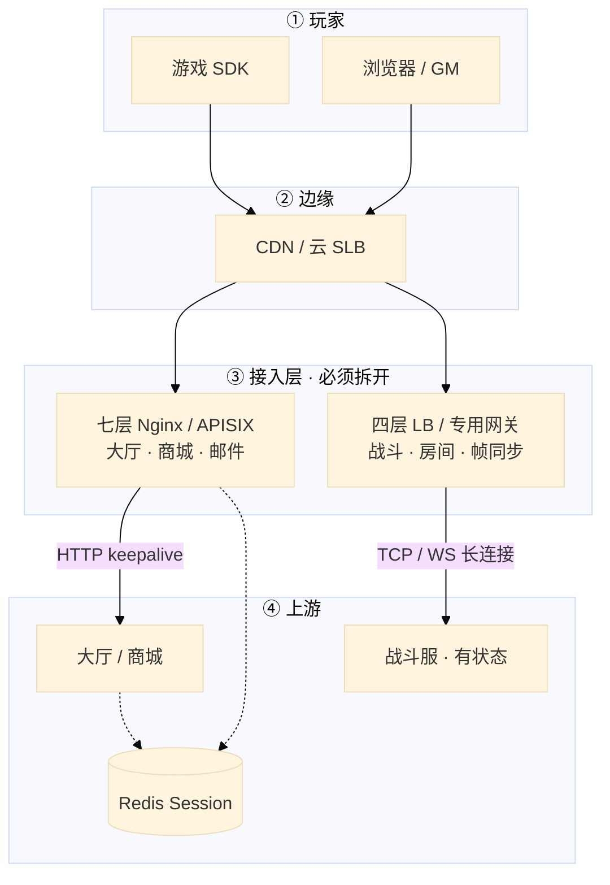
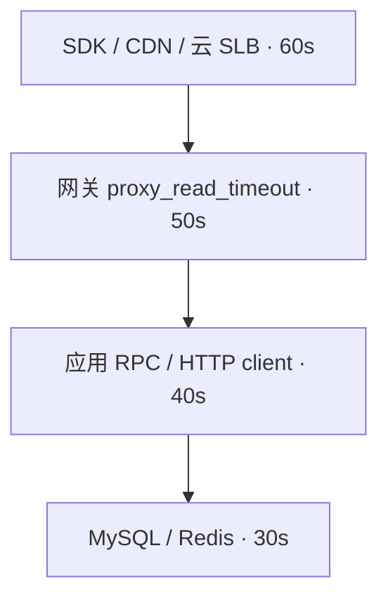
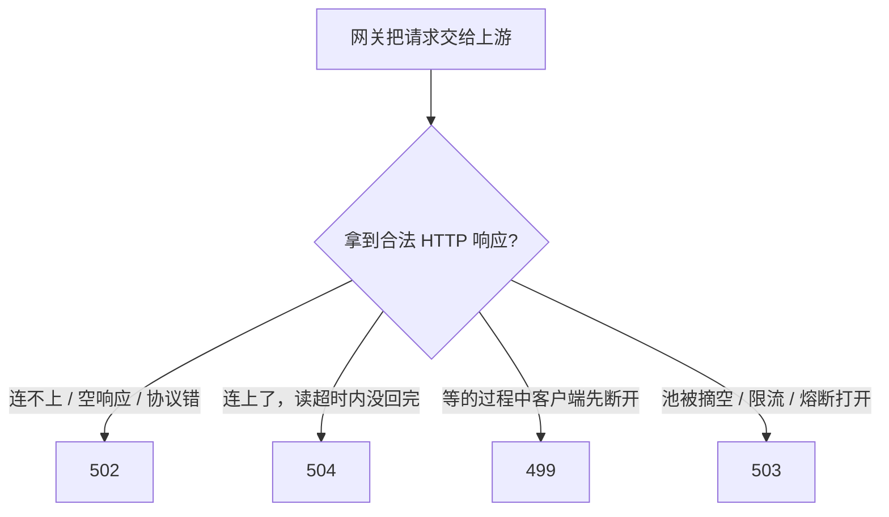
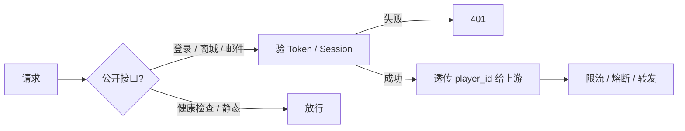
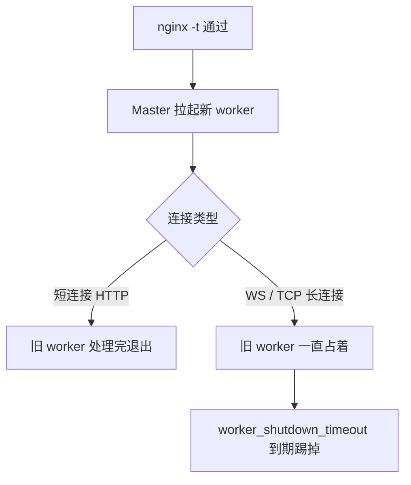
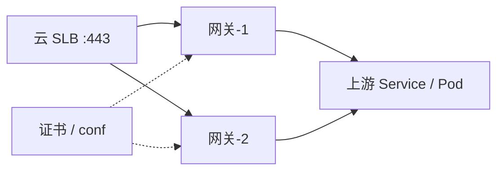
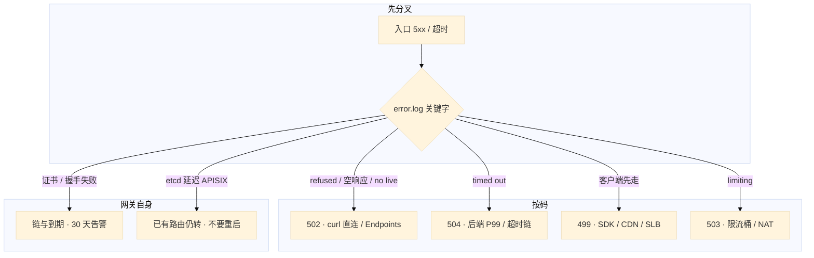

# 接入网关

> 大家好，欢迎来到这次分享。开讲之前，先带大家回到一个很多值班同学都经历过的现场：
> 活动整点，监控大屏 502 / 504 / 499 三条曲线同时抬头。群里有人要重启逻辑服，有人把 `proxy_read_timeout` 改到 120s，另有人要对战斗 WebSocket 做一次 `nginx -s reload`——三条操作，三种误伤。
> 这一章讲完，你会知道当时那三个人各自错在哪，以及正确的第一刀该砍向哪里。
> **本章回答的问题**：玩家进业务第一跳谁先放弃、5xx 怎么分码、鉴权限流熔断灰度挂哪一层；战斗长连接为什么不能跟 HTTP 共用默认七层。
> **本章不讲**：worker 数、epoll、host / location 写法、证书文件路径 → [01-19 Nginx](../../01-基础底座/19-Nginx/)；Keepalived / LVS → [01-18](../../01-基础底座/18-LVS与四层负载均衡/) / [01-20](../../01-基础底座/20-HAProxy与Keepalived/)；Ingress 对象、TLS 自动签发 → [03-15](../../03-Kubernetes/15-Ingress与流量管理/)；etcd Raft / quorum → [03-02](../../03-Kubernetes/02-etcd/)；超时当 miss 打爆 DB → [02-04 缓存架构](../02-Redis/04-缓存架构/)；战斗服弱网、帧同步细节 → [07-12](../../07-游戏运维专题/12-游戏网络与对抗/)；K8s 工作负载灰度对象 → [03-16](../../03-Kubernetes/16-灰度与回滚/)。这些都有专门章节，本章只在用到时点到为止。


**标记**：🎯重点 · 🔥难点 · ⭐常考 · 🔧实操

**怎么听这场分享**：咱们先把「分层 → 归类 → 留证」这条主线装进脑子，再顺着概念、架构、原理一站一站往下走；第七节专门讲定责——也就是开头那个「重启逻辑服 / 调大超时 / reload 战斗」现场的正确解法。每一节讲完会提示对应练习题，学完就去练。

**本章主线（排障就按这三步想）：**

1. **分层**：玩家 → CDN/SLB → 七层网关 → 上游；战斗长连接走四层，不走默认 60s 七层。
2. **归类**：5xx → 先分 499/502/504/503；慢 → 超时链谁最短；配置 → APISIX watch vs Nginx reload。
3. **留证**：`error.log` 关键字 + access 的 `$request_time` / `$upstream_response_time`。

**读完你能：** 白板上画出玩家到 DB 每一跳谁先放弃；看见 499/502/504/503 能分路；鉴权、限流、熔断、灰度能讲清挂在哪一层；战斗长连接不进默认七层；会 reload / 热配、扩容、升级回滚。

## 本章目录

- [1. 基本概念](#1-基本概念)
- [2. 架构图](#2-架构图)
- [3. 原理](#3-原理)
  - [3.1 超时链](#31-超时链谁先放弃)
  - [3.2 状态码](#32-状态码499-502-504-503)
  - [3.3 鉴权](#33-鉴权网关验票后端验权)
  - [3.4 限流](#34-限流漏桶令牌桶按谁限)
  - [3.5 熔断](#35-熔断失败才停送不是超时本身)
  - [3.6 灰度](#36-灰度权重-uid-hash-header)
  - [3.7 长连接与 reload](#37-长连接与-reload)
- [4. 落地](#4-落地)
- [5. 核心配置](#5-核心配置)
- [6. 命令与操作](#6-命令与操作)
- [7. 生产排障](#7-生产排障)
- [8. 必会 · 常考](#8-必会--常考)
- [合上书](#合上书问自己)

---

## 1. 基本概念

> 🎯 **一句话**：接入网关是玩家进业务的第一跳七层（或专用长连接）入口；先分码，再动手。

接入网关是玩家进业务的 **第一跳七层（或专用长连接）入口**。大家想想：很多人一看到 5xx 就重启逻辑服——**错了**。值班里你首先听到的不是「Nginx 怎么配」，而是：**这一跳谁先放弃、这张票验没验、这路流量该不该打满后端。**

**值班里怎么认角色**（先分清谁干什么，再动手）：

| 你听到的 | 对应角色 | 第一刀 |
|----------|----------|--------|
| 「入口 5xx 暴涨」 | 七层网关 / SLB | 分码：499/502/504/503 |
| 「商城能进、战斗掉线」 | **两条入口混了** | HTTP 和 WS 是否共用一条七层 |
| 「活动接口被刷」 | 限流 / 鉴权 | 按账号限，不要按 IP |
| 「改路由要不要 reload」 | Nginx vs APISIX | 文件 reload vs etcd watch |

三个角色不要混：

| 角色 | 干什么 |
|------|--------|
| **云 SLB / CDN** | 四层或边缘扛连接、TLS 卸载、把流量打到多台网关 |
| **接入网关** | 路由、鉴权、限流、熔断、灰度、超时、日志；HTTP 常用 Nginx / APISIX / Envoy |
| **应用 / 战斗服** | 真正的业务；网关不代替它做账、不代替它做房间状态 |

网关能力 vs 游戏实际用法：

| 网关能力 | 游戏怎么用 |
|----------|------------|
| 反向代理 / 路由 | 大厅、商城、邮件、GM 走 HTTP；按 path / host 拆上游 |
| TLS 终止 | 证书在网关，后端内网明文或 mTLS |
| 鉴权 | 登录态 / JWT 在网关验签，非法 401 不进逻辑服 |
| 限流 | 活动接口按账号；心跳单独桶 |
| 熔断 | 上游连续失败 fail-fast，保护线程池 |
| 灰度 | uid hash / header / 权重切新版本 |
| 长连接 | **战斗 WS/TCP 通常不走默认七层**，见 3.7 |

| 在网关里 | 不在网关里 |
|----------|------------|
| 入口超时、5xx 分码、真实 IP 透传 | 容器进程、MySQL 慢查询本身 |
| 对上游 keepalive、被动/主动探活 | 战斗房间状态、帧同步 |
| 插件链（鉴权/限流/灰度） | 支付账本、发奖幂等（01 / 05） |

⭐ 口诀记一句：**「HTTP 走七层，战斗走四层；5xx 先分码再动手」**——后面所有排障都从这三句展开。

> **记住**：玩家 → 网关是一条连接；网关 → 上游 HTTP 是另一条（要 keepalive）。战斗玩家 → 四层/专用网关是第三条，跟上面两条无关。不要把三条混成「长连接开了就行」。

好，概念钉住了。接下来咱们把整张架构图看熟。

> 本节对应练习题 **Q1**。

---

## 2. 架构图

> 🎯 **一句话**：玩家 → CDN/SLB → 七层网关（HTTP）/ 四层（战斗）→ 上游；两条入口必须拆开。

先把整张图钉住。后面超时、鉴权、reload、排障都对着这张图说话。咱们先不急着背产品名，对着图问自己：5xx 该查网关还是查应用？



**读图四句话：**

1. **从 CDN 往下查**：5xx 先分码，再决定查网关还是查应用——不要一接到告警就重启逻辑服。
2. **大厅 HTTP 走七层**（l7）：改路由、鉴权、限流、灰度都挂在这里；对上游要 keepalive。
3. **战斗长连接走四层**（l4）：默认 `proxy_read_timeout 60s` 和七层 reload 都会踢人——HTTP 和 WS 是两条路。
4. **Session 外置 Redis**：后端无状态才能随便摘七层节点；无状态 HTTP 不要 `ip_hash` 绑死。

三种数据面（装的时候选，改配置时代价不一样）：


| | Nginx | APISIX | Envoy |
|--|-------|--------|-------|
| 配置 | 文件 + reload | **etcd + watch，进程内热更新** | **xDS** 热更新 |
| 扩展 | 模块 / 静态 | **插件链**（限流 / 鉴权 / 灰度） | Filter 链 |
| 运维额外成本 | 低 | **etcd 集群** | 控制面（Istio 等） |

不是「一定要上 APISIX」。纯反代 Nginx 更简单。灰度 Nginx 用 upstream 权重也能做。需要「改完立刻生效、按路由挂不同插件」时 APISIX 才值得。

> 本节对应练习题 **Q1、Q8**。

---

## 3. 原理

好，架构图有了。接下来放慢讲原理——谁先超时、码怎么分、鉴权限流熔断灰度挂哪、长连接为什么不能跟 HTTP 共用一条七层。这一节是全章最厚的一块。

### 3.1 超时链：谁先放弃 🔥⭐

> 🎯 **一句话**：越往外超时越长；反了就是 499 / 504 满天飞，后面的请求还在跑。

🔥 **超时链**第一次讲透：口令是**越往外超时越长**（常见 60→50→40→30）。很多人会答「把网关 timeout 调到最大就安全」——**错了**，调大是止血，治本是后端慢；外层比内层短，玩家先走（499），应用白跑。

> 💡 **打个比方**：像接力赛——外圈选手必须等内圈跑完才能交接；外圈只等 30 秒、内圈要跑 60 秒，外圈选手先走了（499），内圈还在跑，下一棒没人接（504）。

**现场走一遍**（活动整点商城慢，CDN 30s、网关 60s、应用 40s、MySQL 50s）：

1. `tail -n 200 access.log | awk '$9 ~ /499|504/'` — 大量 **499**，`$upstream_response_time` 在 35～45s。
2. `grep proxy_read_timeout shop.conf` — 网关读 **60s**；问 CDN 值班：边缘 **30s**。
3. 结论：外层比内层短，玩家先走（499），应用白跑。正确排法 **60→50→40→30**，P99 留 **2～3 倍**。



**输出解读**（access 一行示例）：

```text
10.0.1.5 499 45.012 0.002 38.500 10.0.2.3:8080 - GET /api/shop/buy
#        ^^^  ^^^^^^       ^^^^^^
#        499  总耗时45s    上游已跑38.5s但客户端30s就走了
```

| 跳 | 应对齐成 | 太短你会看到 |
|----|----------|----------------|
| 游戏 SDK / 浏览器 | ≥ CDN | 用户错误页；网关 **499** |
| CDN / SLB | ≥ 网关读超时 | 499 或 SLB 504 |
| 网关 `proxy_read_timeout` | ≥ 应用超时，按 P99×2～3 | 入口 **504**，应用还在跑 |
| 应用 HTTP client | ≥ DB/Redis，且 < 网关 | 应用先返回；网关可能仍是 200 |
| DB / Redis | 最短 | 应用报错；网关不一定 504 |

三种超时不要混：

| 指令 | 含义 | 怎么配 |
|------|------|--------|
| `proxy_connect_timeout` | 建连 | 几秒够；过长把故障请求堆住 |
| `proxy_send_timeout` | 发给上游 | 按请求体，一般短 |
| `proxy_read_timeout` | **等响应** | **504 的主因**；长轮询 / SSE / WS 单独 location 拉长 |

> **别混**：应用超时 50ms、网关 60s、Redis P99 80ms——入口很少 504，DB 却被 miss 打满。超时链要对齐每一跳的**客户端**，不是只对齐 CDN 和网关。

> 📝 **面试怎么说**：⭐「超时链越往外越长，常见 60→50→40→30。CDN 30s、网关 60s 会看到 499 暴涨且 upstream 还在跑。调大 timeout 是止血，治本是后端慢；WS 要单独 location 或走四层。」练习题 Q1 专门考。

> 本节对应练习题 **Q1**。

### 3.2 状态码：499 / 502 / 504 / 503 🔥⭐

> 🎯 **一句话**：502 是拿不到合法上游响应，504 是连上了读超时，499 是客户端先走，503 是限流或池空。

🔥 口诀记死：**「502 连不上，504 等太久，499 客户端走了，503 限流或池空」**——开篇有人重启逻辑服，往往是没分码。

> 💡 **打个比方**：502 像快递站关门（连不上）；504 像货到了但仓库 60 分钟没出库（读超时）；499 像买家取消订单走了（客户端先断）；503 像限号不让进（限流/熔断/池空）。

**现场走一遍**（活动 5xx 上涨，有人要重启逻辑服）——就是开篇那一刀：

1. `tail error.log | grep -E 'refused|timed out|no live|limiting'` — 四类关键字混在一起，要分码。
2. `awk '{print $9}' access.log | sort | uniq -c | sort -rn` — 842 499、312 502、156 504、89 503。
3. **502** → `curl -v http://upstream:8080/health`；**504** → 对 P99；**499** → 查 SDK deadline；**503** → 限流或池空，别重启后端。



**输出解读**：

| 码 | error.log 典型关键字 | access 特征 | 先做什么 |
|----|---------------------|-------------|----------|
| **502** | `connect() failed` / `Connection refused` / 空响应 | `$upstream_status` 为空或 `-` | 直连端口；Endpoints / 探针 |
| **504** | `upstream timed out` | `$upstream_response_time` 接近 read_timeout | 后端 P99；超时链 |
| **499** | 常无 upstream 完成行 | `$request_time` 大但 status 499 | SDK / CDN / SLB 是否更短 |
| **503** | `limit_req` / `no live upstreams` | 网关改写 status | 限流桶 / max_fails，别重启后端 |
| **413** | body 过大 | — | `client_max_body_size`（细节 02-23） |

502 误判：keepalive 池半截响应、域名解析到旧 Pod、Endpoints 空一截。证书到期单独 **30 天**告警；链丢一级像「随机 502」。必透传 `Host`、`X-Real-IP`、`X-Forwarded-For`、`X-Forwarded-Proto`。

> 📝 **面试怎么说**：⭐「502 是连不上或拿不到合法响应，504 是读超时，499 是客户端先断，503 是限流或池摘空。我先对 error.log 关键字分码，502 直连 upstream，504 对 P99 和超时链，499 查更上游 deadline，503 不要重启逻辑服。」

> 本节对应练习题 **Q2、Q3**。

### 3.3 鉴权：网关验票，后端验权 ⭐

> 🎯 **一句话**：网关验票失败 401；票对但没权限是应用 403；player_id 从登录态取，不信客户端字段。

口诀：**「401 是我不认识你，403 是我认识你，但你不能这么干」**。

> 💡 **打个比方**：网关像游乐园门口检票——票假或过期的直接拦（401）；票真的但身高不够某个项目，是项目管理员拦（403），不是门口的事。

**现场走一遍**（有人把客户端传来的 `user_id` 当登录态，限流也按这个字段）：

1. 看一条被 401 的请求，access 里 `$remote_addr` 是网关 IP，说明鉴权在网关层拦了：

```bash
grep ' 401 ' access.log | tail -3
```

2. 抓一条带 `user_id=12345`  query 的请求——如果限流 key 用的是 query 里的 user_id，攻击者可以伪造。

3. 正确做法：网关 JWT / Session 验签 → 通过后把 `player_id` 写进 header 透传上游；限流 key 从 header 取，不信 query / body。



**输出解读**：

| 做法 | 用在哪 | 坑 |
|------|--------|-----|
| JWT / 登录 Token 验签 | 玩家 HTTP API | 密钥轮转；过期要和 SDK 刷新对齐 |
| Session 查 Redis | 要能踢人、要能续期 | Redis 挂了 = 全站 401，要降级策略 |
| HMAC / 渠道签名 | 支付回调、SDK 登录 | 验签失败不要当 502 |
| mTLS / IP 允许名单 | GM、Admin、内部 | 和玩家入口分开 server |
| 客户端传来的 `user_id` | **不要当鉴权** | 可伪造；player_id 从登录态取 |

战斗 WS 握手验一次，不要每帧 JWT；APISIX jwt-auth 热更新，Nginx `auth_request` 通常要 reload。Admin **9180**、GM 入口禁止对公网。

> 📝 **面试怎么说**：「网关做验票，401 是票不对；应用做鉴权，403 是票对但没权限。限流 key 从登录态取，不信客户端 user_id，也不信 XFF 第一段。战斗 WS 握手验一次，不要每帧 JWT。」

> 本节对应练习题 **Q5**。

### 3.4 限流：漏桶、令牌桶、按谁限 ⭐

> 🎯 **一句话**：限流管进来的速率和并发；NAT 下按 IP 会误伤整服；超限是 503，不是 502。

> 💡 **打个比方**：漏桶像水龙头接桶——水（请求）匀速流出，桶满就溢（503）；令牌桶允许短突发，但长期不超平均速率。

**现场走一遍**（活动接口 `limit_req` 按 IP 100r/s，运营商 NAT 后整服一个 IP，大面积 503，值班按 502 重启逻辑服）：

1. error.log 出现：

```text
limiting requests, excess: 12.340 by zone "api", client: 203.0.113.88
```

2. access 里同一 `203.0.113.88` 对应几千个不同 `$remote_user` / token——**一个 NAT IP 背后整服玩家**。

3. 改限流 key 为 APISIX 插件按 `player_id`，或应用层按账号限；心跳、握手单独桶，不要和业务 API 共 100r/s。

4. 503 和 502 分开看——`limit_req` 503 **不要重启后端**。

| 手段 | 行为 | 超限 |
|------|------|------|
| `limit_req` 漏桶 | 按 key 平滑速率，可设 burst | **503** |
| 令牌桶（APISIX / 应用） | 允许短突发，长期不超过平均 | 503 或业务码 |
| `limit_conn` | 限并发连接，防慢请求占满 worker | 503 |

**输出解读**：桶满应立刻 503；如果限流写成**阻塞等待**，worker 被占满，后面请求会变成 504。活动宁可 503 降级。集群多网关：单机漏桶会「每台一份额度」——要全局限流，key 放 Redis。容量：反代一条请求占 **2 个 fd**；`worker_processes × worker_connections` ≤ `ulimit -n`。

> 📝 **面试怎么说**：「NAT 下按 IP 限流会误伤整服，活动接口按账号限。超限 503 不是 502，不要重启逻辑服。心跳和业务不要共桶。多网关要全局限额才上 Redis。」

> 本节对应练习题 **Q6、Q11**。

### 3.5 熔断：失败才停送，不是超时本身 🔥

> 🎯 **一句话**：超时是这一次没等完；熔断是连续失败之后 fail-fast 503，给上游喘息。

🔥 很多人会混「超时」和「熔断」——超时是这一次没等完；熔断是连续失败之后直接 503，给上游喘息。

> 💡 **打个比方**：超时像等公交一次没等到；熔断像连续三趟公交都坏了，站牌直接写「暂停服务」（503），隔一会儿放一趟探活（半开）。

**现场走一遍**（上游抖动，`max_fails=1`，一次超时后 `no live upstreams`，全站 502）：

1. error.log：

```text
no live upstreams while connecting to upstream
upstream: "api", client: 10.0.1.5
```

2. 查 upstream 配置：

```nginx
upstream api {
    server 10.0.0.1:8080 max_fails=1 fail_timeout=10s;
    server 10.0.0.2:8080 max_fails=1 fail_timeout=10s;
    keepalive 32;
}
```

3. 两台都因一次超时被摘 → 池空 → 全站 502。改 `max_fails=3 fail_timeout=30s`，前面加云 LB 主动探活。


**输出解读**：开源 Nginx 只有被动 `max_fails` / `fail_timeout`，真实请求失败才摘，有探伤窗口——阈值 1 会在一次超时后把池摘空。熔断打开返回 **503**，要和 502 区分。熔断不要套战斗长连接：摘掉的是房间，不是 HTTP 请求。`keepalive` 可能粘在已坏节点上，结合 `$upstream_addr` 和健康检查一起看。

> 📝 **面试怎么说**：「超时是一次没等完，熔断是连续失败 fail-fast。开源 Nginx 只有被动 max_fails，过严会 no live upstreams 雪崩。生产用云 LB 主动探活挡一层，阈值不要 1。」

> 本节对应练习题 **Q7、Q12**。

### 3.6 灰度：权重 / uid hash / header

> 🎯 **一句话**：换网关不是做灰度的理由；Nginx upstream 权重就能切 10%。

> 💡 **打个比方**：像试吃新菜——先给 5% 桌子上新菜（权重），同一桌客人始终吃同一套（uid hash），不是整店突然换菜单。

**现场走一遍**（活动整点有人要把 50% 流量切到新战斗服）：

1. **HTTP 无状态**：Nginx upstream 权重 5% → 20% → 100%，看新上游 5xx 和 P99。
2. **按人稳定**：`uid % 100 < 5` 打新版本，保证同一玩家始终同一套。
3. **战斗中途不要切房间**——有状态逻辑服是 08 的事，不是网关权重能解决的。
4. 活动整点禁止切大盘；异常把权重打回 0，比全量 reload 快。

| 方式 | 适合 | 不适合 |
|------|------|--------|
| upstream 权重 | 无状态 HTTP 金丝雀 | 要按人、按版本号精细切 |
| `uid % 100` | 同一玩家始终打同一套 | 战斗中途把人切到另一房间 |
| Header / Cookie | 内部号、QA | 玩家可伪造；生产要鉴权后的 uid |
| 按 path 切 | `/v2/shop` | 客户端没发版时旧包打不进 |

**输出解读**：回滚 = 权重打回旧上游或 APISIX 切规则，比全量 reload 快。K8s Deployment 金丝雀见 04-15，网关层只负责入口切流。

> 📝 **面试怎么说**：「灰度 Nginx 权重就能做，APISIX 加分是按路由热改规则。按 uid hash 保证同一玩家稳定。活动整点不切大盘，战斗中途不按权重切房间。回滚是把权重打回旧上游。」

> 本节对应练习题 **Q7、Q13**。

### 3.7 长连接与 reload 🔥⭐

> 🎯 **一句话**：HTTP 短连接 reload 几乎无感；WS/TCP 长连接 reload 会断线、内存翻倍——战斗入口要拆四层或单独超时。

🔥 开篇有人对战斗 WebSocket 做 `nginx -s reload`——这就是坑。HTTP 短连接 reload 几乎无感；WS 长连接会断线、内存翻倍。

> 💡 **打个比方**：reload 像餐厅换班——短客（HTTP）吃完就走，新服务员接新客；长客（WS）占着旧服务员的桌子不走，新旧两班人同时占内存，直到 `worker_shutdown_timeout` 到期才清场。

**现场走一遍**（reload 后战斗 WS 掉线、内存翻倍）：

1. `nginx -t && nginx -s reload` — `-t` 失败则不 reload。
2. reload 后新旧 worker 并存，旧 worker 仍握 WS → 内存接近翻倍。
3. 全局 `proxy_read_timeout 60s` + 心跳 20s → 一次 GC 超 60s 仍踢人。战斗走四层，HTTP 走七层。



**输出解读**：

| 操作 | 换什么 | 长连接影响 |
|------|--------|------------|
| `nginx -s reload` | 配置 | WS 旧 worker 不退，内存翻倍 |
| **USR2** | 二进制 | 同样会断长连接，和 reload 不是一回事 |
| APISIX watch | 路由 / 插件 | **不用 reload worker**；但别把战斗也塞进同一条七层 |

APISIX etcd 不可用时：**已加载路由继续转发**，Admin 不能增删改，etcd 延迟高只是配置生效变慢——**不要重启 APISIX 进程**（内存路由会丢）。插件链：请求 → rewrite / auth / limit-req → 转上游 → 响应插件 → 客户端。日志切割用 `nginx -s reopen`，不要 `rm` 正在写的 access.log。

> 📝 **面试怎么说**：⭐「HTTP 可以走七层 reload；战斗 WS 要四层或单独 read_timeout ≥ 心跳 2～3 倍。reload 换配置，USR2 换二进制。APISIX 热更新不用 reload，etcd 挂了仍转发，不要重启数据面。」

> 本节对应练习题 **Q8、Q9**。

---

## 4. 落地

好，原理钉住了。接下来落到生产选型——开篇那三刀该不该砍，就在这一节对照。

### 4.1 生产怎么选

> 🎯 **一句话**：HTTP 多台 + SLB；战斗走四层；为灰度不必整站迁 APISIX。

| 项 | 选 | 不选 |
|----|----|------|
| HTTP 入口 | 多台 Nginx 或 APISIX + 云 SLB | 单台裸奔；战斗 WS 和商城共用默认 60s 七层 |
| 长连接 | 四层 LB / 专用网关，独立超时和限流桶 | 挂在频繁 reload 的七层上 |
| 数据面 | 纯反代用 Nginx；要热配插件再用 APISIX | 「为了灰度」整站迁 APISIX |
| 高可用 | ≥2 台 + SLB / Keepalived VIP | 单实例；Session 存在网关内存 |
| 网络 | SLB 探活源 IP 放行；Admin 9180 不对公网 | Admin 对 VPC 裸奔 |
| 证书 | 独立监控到期 30 天；链完整 | 用 5xx 曲线当证书告警 |

入口高可用：多台 + 云 SLB / Keepalived VIP。大规模 **四层扛连接、七层做 TLS / 路由**。Session 外置（Redis），后端无状态才能随便摘节点。Keepalived 细节在 02-24。

### 4.2 落地你实际看到什么



验收：网关机 `curl -v` 直连上游通；SLB 探活 200；`nginx -t` 干净；**HTTP 和战斗两套超时**。Ingress 改注解前看渲染出的 `proxy_read_timeout`。

> 本节对应练习题 **Q8**。

---

## 5. 核心配置

> 🎯 **一句话**：调大超时是止血，治本是后端；限流超限是 503。

只动有证据的项。改 Nginx conf 必须 `-t` 再 reload。APISIX 改路由看 Admin 是否成功，不要去 reload worker。

| 参数 | 常见默认 | 生产怎么用 | 改错会怎样 |
|------|----------|------------|------------|
| `proxy_connect_timeout` | 60s 量级 | **几秒** | 过长堆故障连接 |
| `proxy_read_timeout` | 60s | HTTP 按 P99×2～3，且 < 外层；WS **单独** ≥ 心跳×2～3 | 全局 60s 踢战斗；过长占满 worker |
| `keepalive` | 关 | 对上游开，HTTP/1.1，清空 Connection | TIME_WAIT / 端口耗尽 |
| `max_fails` / `fail_timeout` | 1 / 10s 量级 | 不要 1 次就踢；配主动探活 | `no live upstreams` 雪崩 |
| `limit_req` zone | 无 | 活动按账号；心跳单独桶 | NAT 下按 IP 误伤整服 |
| `worker_shutdown_timeout` | 无/很长 | 长连接必须设 | reload 内存翻倍、worker 不退 |
| `client_max_body_size` | 1m | 上传/工单按业务 | 413，不像 502 |
| `ssl_protocols` | 含旧版 | **仅 1.2/1.3** | 老客户端或被扫 |

> **记住**：调大超时是止血，治本是后端。限流超限是 503。Admin 9180 只给内网。

> 本节对应练习题 **Q4、Q11**。

---

## 6. 命令与操作

> 🎯 **一句话**：`nginx -t` → error.log 关键字 → 直连上游；日志拆 `$request_time` / `$upstream_response_time`。

证书和 conf 路径写成变量，避免每条重复。

```bash
NGINX_BIN=/usr/sbin/nginx
curl -v --resolve shop.example.com:443:10.0.1.10 https://shop.example.com/health
```

| 目的 | 命令 | 看什么 |
|------|------|--------|
| 配置语法 | `nginx -t` | 失败则**不要** reload |
| 平滑 reload | `nginx -s reload` | 短连接平滑；长连接看 shutdown_timeout |
| 重开日志 | `nginx -s reopen` | 切割后新文件有写入 |
| 直连上游 | `curl -v http://10.0.0.1:8080/health` | 绕开 DNS / proxy_pass |
| 看生成超时 | Ingress：`kubectl describe ingress` | 注解是否写进 `proxy_read_timeout` |
| 连接与 fd | `ss -antp \| wc`；`lsof -p $pid \| wc` | 先 fd 再加机器 |
| stub | `curl 127.0.0.1/nginx_status` | Active / Waiting |
| APISIX 路由 | Admin API 查 route（只内网） | 不要重启 Pod 来「刷新配置」 |

值班先跑这几条：

```bash
nginx -t
tail -n 200 /var/log/nginx/error.log
# 关键字：refused / timed out / no live upstreams / limiting
curl -v http://<upstream_ip>:<port>/health
```

日志必须能拆开总耗时和上游耗时：

```nginx
log_format main '$remote_addr $status $request_time '
                '$upstream_connect_time $upstream_response_time '
                '$upstream_addr $upstream_status $request';
```

**输出解读**：

| 现象 | 含义 |
|------|------|
| `$request_time` 大，`$upstream_response_time` 小 | 慢在客户端、TLS、网关自身 |
| 两者都大 | 后端慢（线程池、GC、MySQL、Redis） |
| `$upstream_addr` 总打同一台 | 被动检查没摘，或 keepalive 粘在坏节点 |
| `$upstream_connect_time` 大 | 建连问题，502 近亲 |
| `$status` ≠ `$upstream_status` | 网关改写了码（限流 503、超时 504） |

| 操作 | 要点 |
|------|------|
| 6.1 改路由 | Nginx：`-t` → reload；APISIX：Admin 改 etcd，抖动不重启数据面 |
| 6.2 证书 | 换 pem 后 reload；**30 天**告警，不用 5xx 曲线 |
| 6.3 扩容 | 七层加机器挂 SLB；Session 在 Redis；战斗扩四层 |
| 6.4 升级 | 先备份 conf / 路由；滚动摘一台升一台；**USR2** 换二进制 |
| 6.5 回滚 | 上一份 conf 或 APISIX revision；没有备份 = 没有回滚 |
| 6.6 灰度 | 权重 5%→20%→100%；看 5xx 和 P99；整点不切大盘 |
| 6.7 拆长连接 | WS 切四层；七层只留 HTTP；单独 location 只是过渡 |

指标：5xx 分码；P99；证书 **< 30 天**；fd / Active；APISIX 加 etcd 延迟。

> 本节对应练习题 **Q3、Q9、Q13**。

---

## 7. 生产排障

> 🎯 **一句话**：网关 5xx ≠ 立刻重启逻辑服；先分码。重启网关会再踢一轮长连接。

和别章同一套三问：进程还在不在？还能不能进新请求？已有长连接还在不在？

**网关 5xx ≠ 立刻重启逻辑服。** 先分码。重启网关会再踢一轮长连接——现在再看开篇群里那三刀，你会知道该怎么拦住他们了。



| 现象 | 先做什么 | 不要做什么 |
|------|----------|------------|
| `Connection refused` | 直连端口、Endpoints、探针 | 调大 timeout（连不上不是 504） |
| `upstream timed out` | 后端 P99、超时链 | 先重启网关 |
| 499 暴涨 | SDK / CDN / SLB 是否更短 | 按 502 重启后端 |
| `no live upstreams` | `max_fails`、整批发版 | 再重启一轮后端 |
| `limit_req` 503 | 按账号限；NAT | 当 502 重启逻辑服 |
| 部分玩家「随机 502」 | 证书链、渠道 TLS | 只看 5xx 曲线 |
| APISIX etcd 抖动 | 已有路由仍转 | 重启全部 APISIX Pod |
| 活动三种码同时有 | 先限流、停滚动，再分码 | 无脑重启网关 |

三种码同一分钟：通常是发版 + 超时链反了 + 下游打满。K8s 滚动间歇 502：新 Pod 未 Ready、Endpoints 空、SLB 探活源 IP 没放行。

现在再看开篇群里「重启逻辑服」「调大 timeout」「对战斗 reload」——你知道该怎么拦住他们了：先分码，超时链对齐，战斗走四层。

> 本节对应练习题 **Q10、Q14**。

---

## 8. 必会 · 常考

遮住「对错 / 口径」列自问自答，卡壳的行回去重读对应小节。

| 说法 | 对错 | 口径 |
|------|:----:|------|
| 超时越往内越长 | 错 | 越往外越长；反了 499/504 |
| 调大 `proxy_read_timeout` 就能治 504 | 错 | 止血；治本是后端 |
| 502 就是后端慢 | 错 | 502 是没拿到合法响应；慢是 504 |
| 499 说明后端没启动 | 错 | 客户端先走 |
| 限流超限是 502，应重启后端 | 错 | 503；不要重启 |
| 开源 Nginx 有主动健康检查 | 错 | 只有被动；过严摘空 |
| 战斗 WS 可以和商城共用全局 60s | 错 | 单独超时或走四层 |
| reload 和 USR2 是一回事 | 错 | reload 换配置；USR2 换二进制 |
| APISIX etcd 挂了会立刻全站 502 | 错 | 已有路由仍转；不要重启数据面 |
| 一定要上 APISIX 才能灰度 | 错 | Nginx 权重也能做 |
| 限流 key 用 XFF 第一段 | 错 | 可伪造；只信紧邻 SLB |
| Ingress-nginx 超时等于集群默认 | 错 | 看注解渲染值 |
| 无状态 HTTP 用 ip_hash 最稳 | 错 | Session 放 Redis，不要绑死 |
| 应用 50ms、网关 60s 一定安全 | 错 | 假 miss 打爆 DB，入口还不 504 |

数字：超时链 **60→50→40→30**；P99 **2～3 倍**；证书告警 **30 天**；TLS **1.2/1.3**；心跳读超时 **×2～3**；一条请求 **2 个 fd**；Admin **9180** 内网；SLB 探活源 IP 要放行。

易混：502 vs 504 vs 499 vs 503；keepalive（对上游复用）vs 战斗长连接；被动摘节点 vs 熔断半开；reload vs USR2；Nginx 文件 vs APISIX watch；限流 503 vs 池摘空；网关 401 vs 应用 403。

---

## 合上书，问自己

学到这里，先别急着翻下一章。合上书，试试下面这几件事能不能做到——能做到，这章才算真的听懂了。卡住的那一条，就回到对应小节再听一遍：

- [ ] 超时链从外到内怎么排？SDK 比网关短会看到什么码？（对应练习题 Q1）
- [ ] 502 / 504 / 499 / 503 各看 error.log 哪类关键字？不要做什么？（Q2、Q3）
- [ ] 鉴权、限流、熔断、灰度分别挂哪一层？限流按 IP 的坑？（Q5、Q6、Q7）
- [ ] 对上游 keepalive 为什么要开？被动探活过严会怎样？（Q4、Q12）
- [ ] 战斗长连接为什么不能挂默认七层？reload 和 USR2 差在哪？（Q9）
- [ ] APISIX etcd 挂了该不该重启数据面？——现在再看开篇那三刀，你知道该怎么拦住他们了。（Q8、Q14）

六题都能口述，这一章就过了。Nginx worker / host 写法回 [01-19](../../01-基础底座/19-Nginx/)；中间件线到这儿告一段落，游戏活动高峰与压测 → [07-03](../../07-游戏运维专题/03-活动高峰与压测/)。
