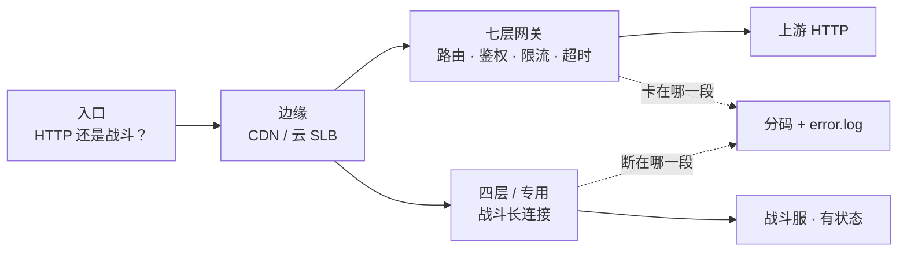
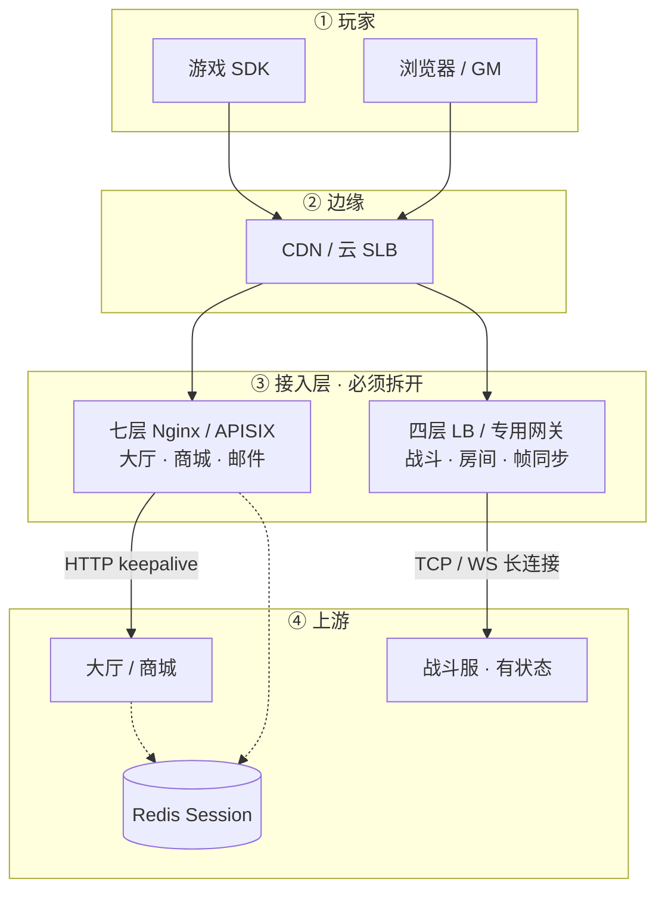
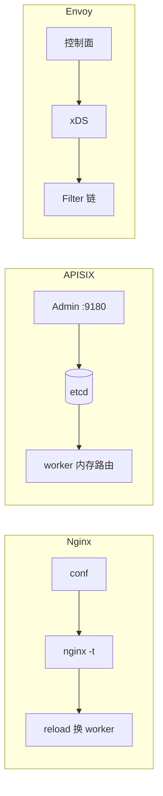
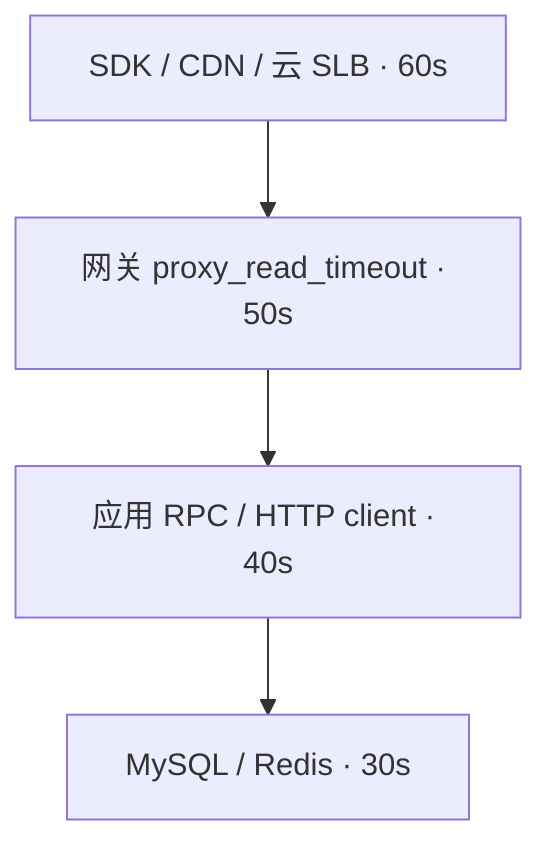
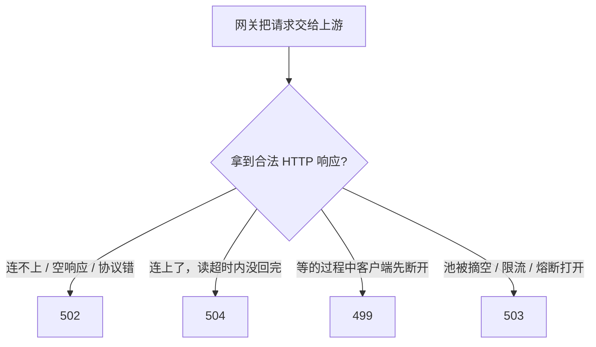
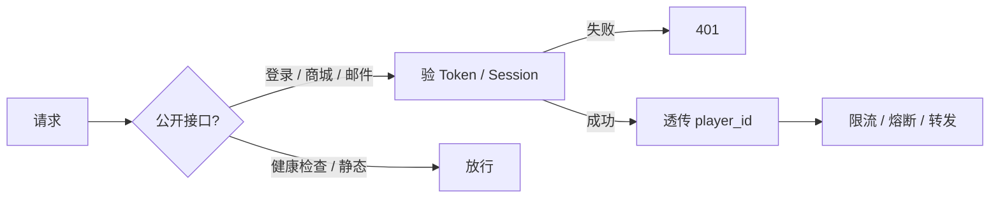
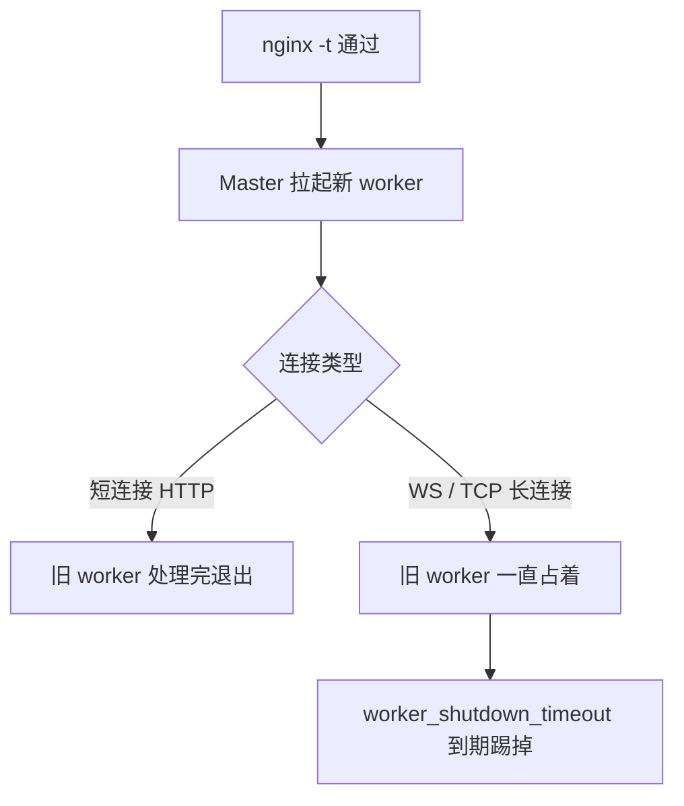
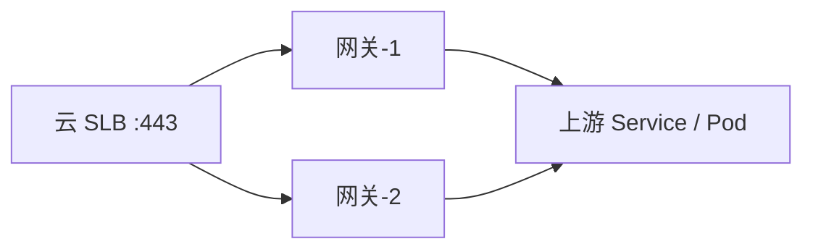
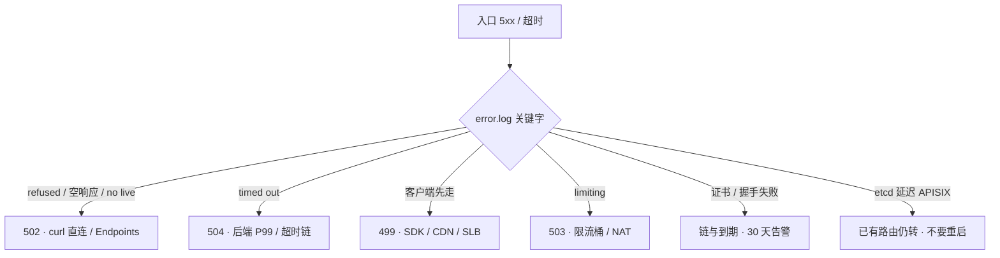

# API 网关与服务治理

> 活动整点，502 / 504 / 499 三条曲线同时抬头。有人要重启逻辑服，有人把 `proxy_read_timeout` 改到 120s，另有人对战斗 WebSocket 做 `nginx -s reload`——三条操作，三种误伤。
> **本章回答**：玩家进业务第一跳谁先放弃、5xx 怎么分码、鉴权限流熔断灰度挂哪一层；战斗长连接为什么不能跟 HTTP 共用默认七层。
> **不讲**：worker / epoll / host·location / 证书路径 → [01-19 Nginx](../../01-基础底座/19-Nginx/)；Keepalived / LVS → [01-18](../../01-基础底座/18-LVS与四层负载均衡/) / [01-20](../../01-基础底座/20-HAProxy与Keepalived/)；Ingress / TLS 签发 → [03-15](../../03-Kubernetes/15-Ingress与流量管理/)；超时当 miss 打爆 DB → [02-04 缓存](../02-Redis/04-缓存架构/)；战斗弱网细节 → [07-12](../../07-游戏运维专题/12-游戏网络与对抗/)。

**标记**：🎯重点 · 🔥难点 · ⭐常考 · 🔧实操

---

## 一、一张图：一条请求的第一跳

> 🎯 **一句话**：接入网关是玩家进业务的第一跳七层（或专用长连接）入口；出了问题先问「卡在哪一段」，再决定动哪把刀。



- 📖 **读图**
  - 🚪 入口先拆两条路：大厅/商城/邮件走七层；战斗 WS/TCP 走四层——混用就是开篇「reload 踢战斗」
  - 🛤️ 主线「边缘 → 七层治理 → 上游」；5xx 第一刀永远是**分码**，不是重启逻辑服（Q1、Q2、Q14）

- 🔑 **三个角色不要混**
  - **云 SLB / CDN**：扛连接、TLS 卸载、把流量打到多台网关
  - **接入网关**：路由、鉴权、限流、熔断、灰度、超时、日志（Nginx / APISIX / Envoy）
  - **应用 / 战斗服**：真正业务；网关不代替做账、不代替做房间状态

- 🗺️ **三条连接**（别混成「长连接开了就行」）
  - 玩家 → 网关（一条）
  - 网关 → 上游 HTTP（另一条，要 **keepalive**）
  - 战斗玩家 → 四层/专用网关（第三条，跟上面两条无关）

⭐ 口诀：**「HTTP 走七层，战斗走四层；5xx 先分码再动手」**。

本节对应练习题 **Q1**。

---

## 二、选型：数据面与架构

> 🎯 **一句话**：玩家 → CDN/SLB → 七层（HTTP）/ 四层（战斗）→ 上游；两条入口必须拆开。选 Nginx / APISIX / Envoy 看「改配置时代价」，不是追产品名。



- 📖 **读图**
  - 从 CDN 往下查：5xx 先分码，再决定查网关还是应用
  - 七层挂路由/鉴权/限流/灰度；四层扛战斗——默认 `proxy_read_timeout 60s` 和七层 reload 都会踢人
  - Session 外置 Redis → 后端无状态才能随便摘七层节点；无状态 HTTP **不要** `ip_hash` 绑死

### 📦 三种数据面：装的时候选，改的时候代价不同 ⭐



- 📖 **读图**：Nginx = 文件 + reload；APISIX = etcd watch 热更新；Envoy = xDS。需要「改完立刻生效、按路由挂插件」才值得上 APISIX；纯反代 Nginx 更简单，灰度用 upstream 权重也能做。

| | Nginx | APISIX | Envoy |
|--|-------|--------|-------|
| 配置 | 文件 + reload | **etcd + watch** | **xDS** |
| 扩展 | 模块 / 静态 | **插件链** | Filter 链 |
| 额外成本 | 低 | **etcd 集群** | 控制面 |

> ⚠️ **别混**：换网关不是做灰度的理由——Nginx 权重就能切 10%（六节）。

本节对应练习题 **Q1、Q8**。

---

## 三、超时链：谁先放弃 🔥⭐

> 🎯 **一句话**：越往外超时越长；反了就是 499 / 504 满天飞，后面的请求还在跑。

> 💡 **打个比方**：接力赛——外圈只等 30 秒、内圈要跑 60 秒，外圈选手先走了（499），内圈还在跑，下一棒没人接（504）。



- 📖 **读图**：从外到内递减（常见 **60→50→40→30**）；任一层外短内长，外层先放弃、内层白跑。

#### ❓ 为什么不是「网关 timeout 调到最大就安全」？

- ❌ **调大是止血**：504 / 499 暂时少了，后端慢没治
- ✅ **治本是后端 P99**：超时按 P99 留 **2～3 倍**，且越往外越长
- 🧨 **假安全**：应用 50ms、网关 60s、Redis P99 80ms——入口很少 504，DB 却被 miss 打满（见 [02-04](../02-Redis/04-缓存架构/)）

- 🔧 **三种超时不要混**
  - `proxy_connect_timeout`：建连，几秒够；过长堆故障请求
  - `proxy_send_timeout`：发给上游，按请求体，一般短
  - `proxy_read_timeout`：**等响应**，**504 主因**；长轮询 / SSE / WS 单独 location 拉长

- 🔍 **现场**：活动整点商城慢，CDN 30s、网关 60s

```bash
tail -n 200 access.log | awk '$9 ~ /499|504/'
grep proxy_read_timeout shop.conf
```

```text
10.0.1.5 499 45.012 0.002 38.500 10.0.2.3:8080 - GET /api/shop/buy
#        ^^^  ^^^^^^       ^^^^^^
#        499  总耗时45s    上游已跑38.5s但客户端30s就走了
```

> ⚠️ **别混**：超时链要对齐每一跳的**客户端** deadline，不是只对齐 CDN 和网关。

> 📝 **面试**：⭐「超时链越往外越长，常见 60→50→40→30。CDN 30s、网关 60s → 499 暴涨且 upstream 还在跑。调大是止血，治本是后端；WS 单独 location 或走四层。」（Q1）

本节对应练习题 **Q1**。

---

## 四、分码：499 / 502 / 504 / 503 🔥⭐

> 🎯 **一句话**：502 拿不到合法上游响应，504 连上了读超时，499 客户端先走，503 限流或池空。

> 💡 **打个比方**：502 = 快递站关门；504 = 货到了仓库 60 分钟不出库；499 = 买家取消订单走了；503 = 限号不让进。



- 📖 **读图**：先问「有没有合法响应」——没有走 502；有但超时走 504；等的时候客户端走了是 499；池空/限流是 503。

#### ❓ 为什么 502 不等于「后端慢」？

- 🐢 **慢** → 通常 **504**（连上了，读超时内没回完）
- 🔌 **502** → 连不上 / 空响应 / 协议错 / `no live upstreams`
- 🧨 **误判**：keepalive 半截响应、域名解析到旧 Pod、Endpoints 空一截——都像「随机 502」，不是慢查询

| 码 | error.log 关键字 | access 特征 | 先做 | 别做 |
|----|------------------|-------------|------|------|
| **502** | `refused` / 空响应 / `no live` | `$upstream_status` 空或 `-` | 直连端口 / Endpoints | 调大 timeout |
| **504** | `upstream timed out` | `$upstream_response_time` ≈ read_timeout | 后端 P99 / 超时链 | 先重启网关 |
| **499** | 常无 upstream 完成行 | `$request_time` 大、status 499 | SDK / CDN / SLB deadline | 按 502 重启后端 |
| **503** | `limit_req` / `no live` | 网关改写 status | 限流桶 / max_fails | 重启逻辑服 |

- 🔍 **现场**：活动 5xx 上涨，有人要重启逻辑服

```bash
tail -n 200 error.log | grep -E 'refused|timed out|no live|limiting'
awk '{print $9}' access.log | sort | uniq -c | sort -rn
# ← 先数 499/502/504/503，再决定第一刀
curl -v http://upstream:8080/health   # ← 502 时绕开 proxy 直连
```

- 📎 **必透传**：`Host`、`X-Real-IP`、`X-Forwarded-For`、`X-Forwarded-Proto`；证书到期单独 **30 天**告警，链丢一级像「随机 502」

> 📝 **面试**：⭐「502 连不上或拿不到合法响应，504 读超时，499 客户端先断，503 限流或池摘空。先对 error.log 分码：502 直连 upstream，504 对 P99，499 查更上游 deadline，503 不要重启逻辑服。」（Q2、Q3）

本节对应练习题 **Q2、Q3**。

---

## 五、治理挂哪一层：鉴权 · 限流 · 熔断 · 灰度

> 🎯 **一句话**：验票在网关、验权在应用；限流管进来的速率；熔断是连续失败后 fail-fast；灰度换权重就能切，不必整站迁 APISIX。

### 🎫 鉴权：网关验票，后端验权 ⭐

> 🎯 **一句话**：网关验票失败 **401**；票对但没权限是应用 **403**；`player_id` 从登录态取，不信客户端字段。

> 💡 **打个比方**：游乐园门口检票——票假/过期直接拦（401）；票真但身高不够某个项目，是项目管理员拦（403）。



- 📖 **读图**：公开接口放行；其余验签失败直接 401，成功才把 `player_id` 写进 header 给上游。

#### ❓ 为什么不能信客户端传来的 `user_id`？

- ❌ query / body / 自造 header 里的 `user_id` **可伪造**
- ✅ 网关 JWT / Session 验签 → 通过后写 `player_id` header；限流 key 也从登录态取
- 🎮 战斗 WS **握手验一次**，不要每帧 JWT；APISIX jwt-auth 热更新，Nginx `auth_request` 通常要 reload
- 🔒 Admin **9180**、GM 入口禁止对公网

> 📝 **面试**：「网关验票 401，应用鉴权 403。限流 key 从登录态取，不信客户端 user_id，也不信 XFF 第一段。」（Q5）

### 🪣 限流：漏桶、令牌桶、按谁限 ⭐

> 🎯 **一句话**：限流管进来的速率和并发；NAT 下按 IP 会误伤整服；超限是 **503**，不是 502。

> 💡 **打个比方**：漏桶 = 水龙头接桶，匀速流出、桶满就溢（503）；令牌桶允许短突发，长期不超平均。

#### ❓ 为什么活动接口不能按 IP 限？

- 📱 运营商 **NAT** 后整服一个公网 IP → 按 IP 100r/s 会整服 503
- ✅ 按 **账号 / player_id**；心跳、握手单独桶，不要和业务 API 共桶
- 🌐 多网关：单机漏桶 =「每台一份额度」——要全局限额才把 key 放 Redis
- ⚠️ 桶满应立刻 503；写成**阻塞等待**会占满 worker → 后面变 504

```text
limiting requests, excess: 12.340 by zone "api", client: 203.0.113.88
# ← error.log；同一 IP 背后可能是几千玩家
```

- 🔧 **手段**：`limit_req`（漏桶）· 令牌桶（APISIX/应用）· `limit_conn`（限并发）——超限都是 **503**
- 📎 反代一条请求占 **2 个 fd**；`worker_processes × worker_connections` ≤ `ulimit -n`

> 📝 **面试**：「NAT 下按 IP 误伤整服，活动按账号限。超限 503 不是 502。心跳和业务不要共桶。多网关全局限额才上 Redis。」（Q6、Q11）

### ⚡ 熔断：失败才停送，不是超时本身 🔥

> 🎯 **一句话**：超时是这一次没等完；熔断是连续失败之后 fail-fast **503**，给上游喘息。

> 💡 **打个比方**：超时 = 等公交一次没等到；熔断 = 连续三趟都坏了，站牌写「暂停服务」，隔一会儿放一趟探活（半开）。


- 📖 **读图**：关闭→打开→半开；半开成功回关闭，失败回打开。熔断返回 **503**，要和 502 区分。

#### ❓ 为什么 `max_fails=1` 会雪崩？

- 开源 Nginx 只有**被动** `max_fails` / `fail_timeout`——真实请求失败才摘，有探伤窗口
- 阈值 **1** → 一次超时就把节点摘掉；两台都摘 → `no live upstreams` → 全站 **502**
- ✅ `max_fails≥3`，前面加云 LB **主动探活**；熔断**不要**套战斗长连接（摘掉的是房间）
- 📎 `keepalive` 可能粘在已坏节点上，结合 `$upstream_addr` 一起看

```nginx
upstream api {
    server 10.0.0.1:8080 max_fails=3 fail_timeout=30s;
    server 10.0.0.2:8080 max_fails=3 fail_timeout=30s;
    keepalive 32;
}
```

> ⚠️ **别混**：超时 ≠ 熔断；被动摘节点 ≠ 熔断半开状态机（APISIX/Envoy 更完整）。

> 📝 **面试**：「超时是一次没等完，熔断是连续失败 fail-fast。开源 Nginx 只有被动 max_fails，过严会 no live upstreams。生产用云 LB 主动探活挡一层，阈值不要 1。」（Q7、Q12）

### 🎚️ 灰度：权重 / uid hash / header

> 🎯 **一句话**：换网关不是做灰度的理由；Nginx upstream 权重就能切 10%。

- 🗺️ **怎么切**
  - **权重**：无状态 HTTP 金丝雀 5% → 20% → 100%，看新上游 5xx 和 P99
  - **uid % 100**：同一玩家始终同一套
  - **Header / Cookie**：内部号、QA；生产要鉴权后的 uid（玩家可伪造）
  - ❌ 战斗中途不要按权重切房间——有状态是工作负载的事（[03-16](../../03-Kubernetes/16-灰度与回滚/)）
- 🔥 活动整点禁止切大盘；异常把权重打回 0，比全量 reload 快

> 📝 **面试**：「灰度 Nginx 权重就能做；APISIX 加分是按路由热改。按 uid hash 保证同一玩家稳定。整点不切大盘，战斗中途不按权重切房间。」（Q7、Q13）

本节对应练习题 **Q5、Q6、Q7、Q11、Q12、Q13**。

---

## 六、长连接与 reload：换配置别踢战斗 🔥⭐

> 🎯 **一句话**：HTTP 短连接 reload 几乎无感；WS/TCP 长连接 reload 会断线、内存翻倍——战斗入口要拆四层或单独超时。

> 💡 **打个比方**：reload 像餐厅换班——短客（HTTP）吃完就走；长客（WS）占着旧服务员的桌子不走，新旧两班同时占内存，直到 `worker_shutdown_timeout` 到期才清场。



- 📖 **读图**：短连接旧 worker 自然退；长连接占着不退 → 内存接近翻倍，到期踢人。

#### ❓ 为什么战斗不能挂默认七层？

- 全局 `proxy_read_timeout 60s` + 心跳 20s → 一次 GC 超 60s 仍踢人
- `nginx -s reload` / **USR2**（换二进制）都会断长连接——和「换配置」不是一回事
- ✅ 战斗走**四层**或专用网关；七层只留 HTTP；过渡期可单独 location 把 read_timeout ≥ 心跳 **×2～3**
- 🔄 APISIX watch 路由/插件**不用 reload worker**——但别把战斗也塞进同一条七层

#### ❓ 为什么 APISIX etcd 挂了不要重启数据面？

- etcd 不可用时：**已加载路由继续转发**，Admin 不能增删改
- etcd 延迟高 = 配置生效变慢，**不是**转发挂了
- ❌ 重启 APISIX 进程 → 内存路由会丢，雪上加霜（Q8、Q14）

- 🔍 **现场**

```bash
nginx -t && nginx -s reload   # ← -t 失败则不要 reload
# 日志切割用 reopen，不要 rm 正在写的 access.log
nginx -s reopen
```

> 📝 **面试**：⭐「HTTP 可走七层 reload；战斗 WS 要四层或单独 read_timeout ≥ 心跳 2～3 倍。reload 换配置，USR2 换二进制。APISIX 热更新不用 reload；etcd 挂了仍转发，不要重启数据面。」（Q8、Q9）

本节对应练习题 **Q8、Q9**。

---

## 七、落地：选型、配置、命令

> 🎯 **一句话**：HTTP 多台 + SLB；战斗走四层；为灰度不必整站迁 APISIX。调大超时是止血，治本是后端。

### 🏗️ 生产怎么选

- ✅ HTTP：多台 Nginx 或 APISIX + 云 SLB；Session 在 Redis
- ✅ 长连接：四层 LB / 专用网关，独立超时和限流桶
- ✅ 数据面：纯反代用 Nginx；要热配插件再用 APISIX
- ✅ 证书：独立监控到期 **30 天**；TLS **仅 1.2/1.3**
- ❌ 单台裸奔；战斗 WS 和商城共用默认 60s 七层；Admin 9180 对公网



- 📖 **读图**：SLB 挂两台网关；验收 = 网关机 `curl -v` 直连上游通、探活 200、`nginx -t` 干净、**HTTP 和战斗两套超时**。

### ⚙️ 只动有证据的项

| 参数 | 生产怎么用 | 改错会怎样 |
|------|------------|------------|
| `proxy_connect_timeout` | **几秒** | 过长堆故障连接 |
| `proxy_read_timeout` | HTTP 按 P99×2～3 且 < 外层；WS **单独** ≥ 心跳×2～3 | 全局 60s 踢战斗 |
| `keepalive` | 对上游开，HTTP/1.1 | TIME_WAIT / 端口耗尽 |
| `max_fails` / `fail_timeout` | 不要 1 次就踢 + 主动探活 | `no live upstreams` |
| `limit_req` | 活动按账号；心跳单独桶 | NAT 下按 IP 误伤 |
| `worker_shutdown_timeout` | 长连接必须设 | reload 内存翻倍 |
| `client_max_body_size` | 按业务 | 413，不像 502 |

### 🔧 命令速查 · 日志必须拆两段耗时

```bash
NGINX_BIN=/usr/sbin/nginx
nginx -t                                    # ← 失败则不要 reload
nginx -s reload                             # ← 短连接平滑；长连接看 shutdown_timeout
nginx -s reopen                             # ← 日志切割
curl -v http://10.0.0.1:8080/health         # ← 绕开 DNS / proxy_pass
curl -v --resolve shop.example.com:443:10.0.1.10 https://shop.example.com/health
ss -antp | wc; lsof -p $pid | wc            # ← 先 fd 再加机器
curl 127.0.0.1/nginx_status                 # ← Active / Waiting
# APISIX：Admin API 查 route（只内网）；不要重启 Pod「刷新配置」
```

```nginx
log_format main '$remote_addr $status $request_time '
                '$upstream_connect_time $upstream_response_time '
                '$upstream_addr $upstream_status $request';
```

- 🔍 **读 access 一行**
  - `$request_time` 大、`$upstream_response_time` 小 → 慢在客户端 / TLS / 网关自身
  - 两者都大 → 后端慢（线程池、GC、MySQL、Redis）
  - `$upstream_addr` 总打同一台 → 被动检查没摘，或 keepalive 粘坏节点
  - `$upstream_connect_time` 大 → 建连问题，502 近亲
  - `$status` ≠ `$upstream_status` → 网关改写了码（限流 503、超时 504）

- 🗺️ **日常操作**
  - 改路由：Nginx `-t` → reload；APISIX Admin 改 etcd，抖动不重启数据面
  - 扩容：七层加机器挂 SLB；战斗扩四层
  - 升级：备份 conf / 路由；滚动摘一台升一台；**USR2** 换二进制
  - 回滚：上一份 conf 或 APISIX revision——没有备份 = 没有回滚
  - 灰度：权重 5%→20%→100%；整点不切大盘

本节对应练习题 **Q3、Q4、Q9、Q11、Q13**。

---

## 八、作战：定责 🔧

> 🎯 **一句话**：网关 5xx ≠ 立刻重启逻辑服；先分码。重启网关会再踢一轮长连接。



- 📖 **读图**：第一叉永远是 error.log 关键字；每条分支写真实现象和第一刀。

| 现象 | 先做 | 别做 |
|------|------|------|
| `Connection refused` | 直连端口、Endpoints、探针 | 调大 timeout |
| `upstream timed out` | 后端 P99、超时链 | 先重启网关 |
| 499 暴涨 | SDK / CDN / SLB 是否更短 | 按 502 重启后端 |
| `no live upstreams` | `max_fails`、整批发版 | 再重启一轮后端 |
| `limit_req` 503 | 按账号限；查 NAT | 当 502 重启逻辑服 |
| 部分玩家「随机 502」 | 证书链、渠道 TLS | 只看 5xx 曲线 |
| APISIX etcd 抖动 | 已有路由仍转 | 重启全部 APISIX Pod |
| 活动三种码同时有 | 先限流、停滚动，再分码 | 无脑重启网关 |

### ⏱️ 60 秒剧本 🔧

| 时间 | 做什么 |
|------|--------|
| 0–10s | `awk` 数 status；`tail error.log` 对关键字——拦住「重启逻辑服」 |
| 10–30s | 502 → `curl` 直连；504 → 对 P99 / 超时链；499 → 问 CDN/SDK deadline；503 → 限流桶 |
| 30–45s | 查是否整点灰度 / 滚动发版 / `max_fails=1`；战斗是否被七层 reload |
| 45–60s | 止血：限流降级、权重打回、停滚动；etcd 抖不动数据面；把证据贴群 |

三种码同一分钟：通常是发版 + 超时链反了 + 下游打满。K8s 滚动间歇 502：新 Pod 未 Ready、Endpoints 空、SLB 探活源 IP 没放行。

现在再看开篇「重启逻辑服 / 调大 timeout / 对战斗 reload」——先分码，超时链对齐，战斗走四层。

本节对应练习题 **Q10、Q14**。

---

## 九、收口

### 命令速查 🔧

```bash
nginx -t && nginx -s reload
tail -n 200 /var/log/nginx/error.log | grep -E 'refused|timed out|no live|limiting'
awk '{print $9}' access.log | sort | uniq -c | sort -rn
curl -v http://<upstream_ip>:<port>/health
ss -antp | wc; curl -s 127.0.0.1/nginx_status
# APISIX：Admin 查 route；etcd 抖 → 修 quorum，不重启数据面
```

### 面试锚点

| 问 | 30 秒答 |
|----|---------|
| 超时链怎么排？ | 越往外越长，常见 60→50→40→30；外短内长 → 499/504。调大是止血。 |
| 502 vs 504 vs 499 vs 503？ | 502 连不上；504 读超时；499 客户端先走；503 限流/池空。 |
| 鉴权挂哪？ | 网关验票 401；应用鉴权 403；player_id 从登录态取。 |
| 限流按谁？ | 活动按账号；NAT 下按 IP 误伤整服；超限 503。 |
| 熔断 vs 超时？ | 超时=一次没等完；熔断=连续失败 fail-fast。max_fails 别设 1。 |
| 灰度一定要 APISIX？ | 否；Nginx 权重就能切。uid hash 保同一玩家。 |
| 战斗为何不走默认七层？ | 60s 踢人 + reload 断线；走四层或单独超时。 |
| reload vs USR2？ | reload 换配置；USR2 换二进制；都会影响长连接。 |
| etcd 挂了？ | 已有路由仍转；不要重启 APISIX 数据面。 |
| keepalive 干啥？ | 对上游复用连接，减 TIME_WAIT；≠ 战斗长连接。 |

### 易错一句话对照

- 超时越往内越长 → **越往外越长**；反了 499/504
- 调大 `proxy_read_timeout` 治 504 → 止血；治本是后端
- 502 就是后端慢 → 502 是没拿到合法响应；慢是 504
- 499 说明后端没启动 → 客户端先走
- 限流超限是 502，应重启后端 → **503**；不要重启
- 开源 Nginx 有主动健康检查 → 只有被动；过严摘空
- 战斗 WS 可和商城共用全局 60s → 单独超时或走四层
- reload 和 USR2 是一回事 → reload 换配置；USR2 换二进制
- APISIX etcd 挂了立刻全站 502 → 已有路由仍转；不要重启数据面
- 一定要上 APISIX 才能灰度 → Nginx 权重也能做
- 限流 key 用 XFF 第一段 → 可伪造；只信紧邻 SLB
- 无状态 HTTP 用 ip_hash 最稳 → Session 放 Redis，不要绑死
- 应用 50ms、网关 60s 一定安全 → 假 miss 打爆 DB，入口还不 504
- keepalive = 战斗长连接 → 前者对上游复用；后者是玩家到战斗服

### 数字墙

> 超时链 **60→50→40→30** · P99 **×2～3** · 证书告警 **30 天** · TLS **1.2/1.3** · 心跳读超时 **×2～3** · 一条请求 **2 个 fd** · Admin **9180** 内网 · SLB 探活源 IP 要放行 · 灰度 **5%→20%→100%** · `max_fails` **≥3**

---

## 合上书

- [ ] **默画主图**：玩家 → CDN/SLB → 七层（HTTP）/ 四层（战斗）→ 上游；标出分码第一刀照哪段。（Q1）
- [ ] **口述超时链**：从外到内怎么排；SDK 比网关短会看到什么码；为什么调大治不了本。（Q1）
- [ ] **口述分码**：502 / 504 / 499 / 503 各看 error.log 哪类关键字；不要做什么。（Q2、Q3）
- [ ] **口述治理**：鉴权 401 vs 403；限流按账号；熔断 ≠ 超时；灰度权重 vs uid hash。（Q5、Q6、Q7）
- [ ] **口述探活**：对上游 keepalive 为什么要开；被动 `max_fails=1` 会怎样。（Q4、Q12）
- [ ] **口述长连接**：战斗为何不挂默认七层；reload vs USR2；`worker_shutdown_timeout` 干什么。（Q9）
- [ ] **口述 APISIX**：etcd 挂了该不该重启数据面——再拆开开篇那三刀。（Q8、Q14）
- [ ] **60 秒定责**：接到 5xx，0–60s 各敲什么；三种码同时出现先停什么。（Q10、Q14）

Nginx worker / host 写法 → [01-19](../../01-基础底座/19-Nginx/)。活动高峰与压测 → [07-03](../../07-游戏运维专题/03-活动高峰与压测/)。
