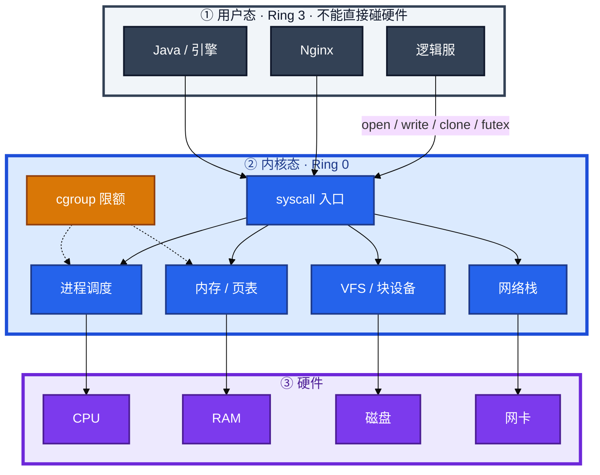
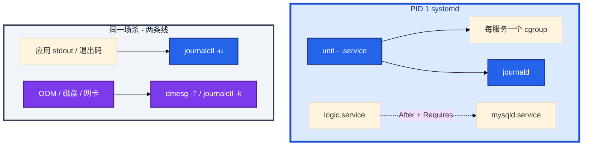
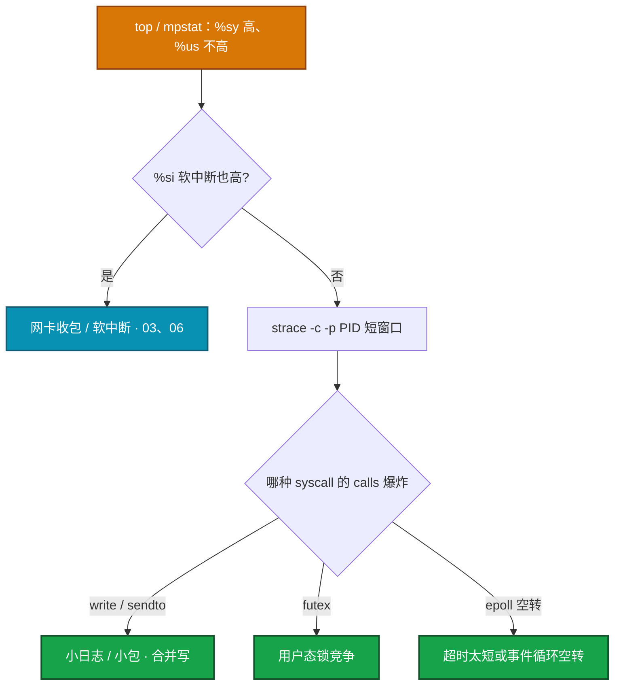
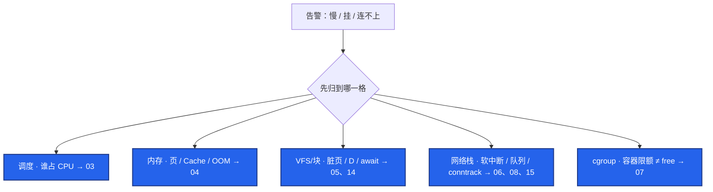
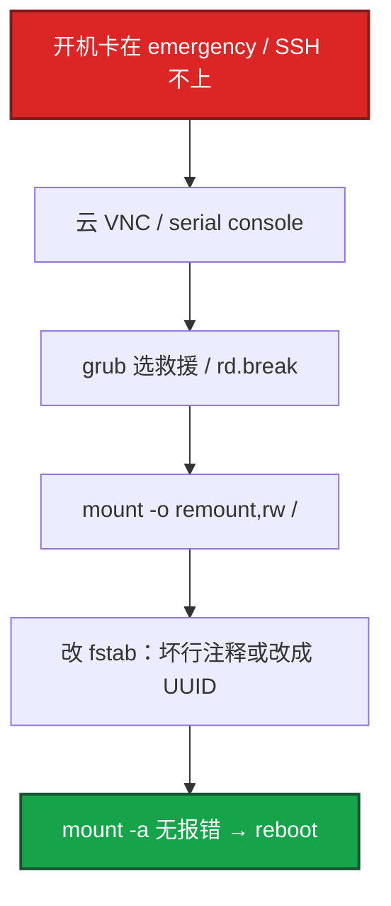
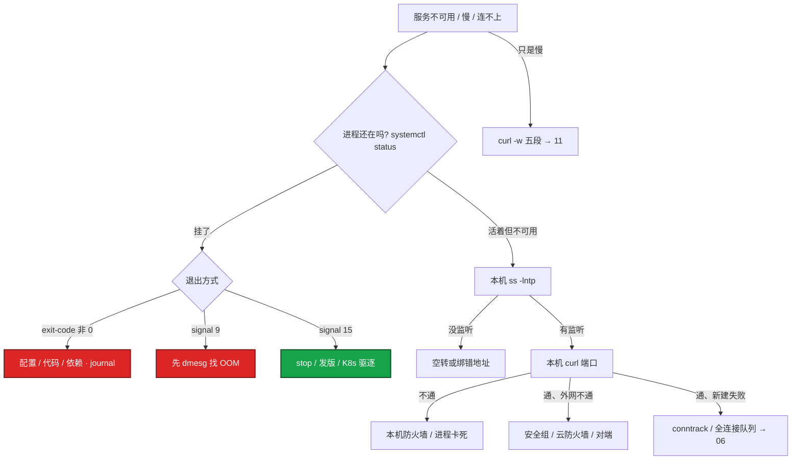
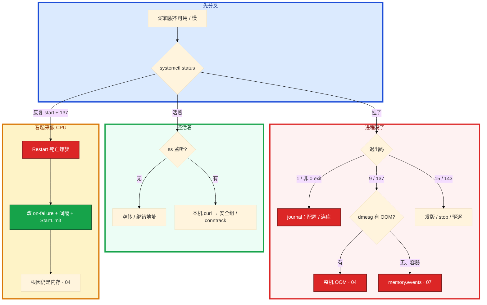

# 内核与系统


活动高峰，`s3-logic-02` 告警红了三分钟。群里有人要重启，另有人已经在 `top` 里盯 `%us`。监控只有「进程存活」一条红。

先别动手。这一章后半全是你会动手的：**怎么分 journal 和 dmesg、怎么读退出码、systemd 怎样把进程拉进死亡螺旋、fstab 写错怎么进救援。** 前面的概念和原理，是为了让你动手时不进错层。

**读完你能：** 30 秒把告警丢进调度 / 内存 / 磁盘 / 网络 / cgroup 其中一格；进程没了能判断看 journal 还是 dmesg；会写 After + Requires、挡住 Restart 死亡螺旋；容器里不拿 `free` 结案。

## 本章目录

缩进 = 上下级。3 下面才是 3.1。

想钉在**正文左边**跟着滚：菜单 **查看 → 打开视图 → 大纲**。Markdown 预览做不到独立左栏，目录只能写在文章开头。

- [1. 基本概念](#1-基本概念)
- [2. 架构图](#2-架构图)
- [3. 原理](#3-原理)
  - [3.1 syscall 有多贵](#31-syscall有多贵)
  - [3.2 `%sy` 高了怎么证明](#32-sy-高了怎么证明)
  - [3.3 五个域先归类](#33-五个域先归类)
  - [3.4 journal 和 dmesg](#34-journal-和-dmesg)
  - [3.5 `/proc` 和 `/sys`](#35-proc-和-sys)
- [4. 落地](#4-落地)
  - [4.1 包和内核升级](#41-包和内核升级)
  - [4.2 救援与 fstab](#42-救援与-fstab)
  - [4.3 主机名](#43-主机名)
- [5. 核心配置](#5-核心配置)
  - [5.1 After / Requires / Wants](#51-after--requires--wants)
  - [5.2 Restart 死亡螺旋](#52-restart-死亡螺旋)
  - [5.3 Type=forking 和 PIDFile](#53-typeforking-和-pidfile)
- [6. 常用命令](#6-常用命令)
- [7. 常用操作](#7-常用操作)
  - [7.1 服务不可用第一眼](#71-服务不可用第一眼)
  - [7.2 短窗口 strace](#72-短窗口-strace)
- [8. 生产排障](#8-生产排障)
- [9. 必会 · 常考](#9-必会--常考)
- [合上书](#合上书问自己)

**本章不讲：** CPU 格子细拆、Load ≠ util → [03 CPU 与 Load](../03-CPU与Load/)；OOM 分数、RSS vs Cache → [04 内存与 OOM](../04-内存与OOM/)；await、脏页、iostat → [05 磁盘与 IO](../05-磁盘与IO/)；D / 信号 / core → [02 进程与信号](../02-进程与信号/)；cgroup 文件布局 → [07 cgroup 与容器](../07-cgroup与容器/)；unit 全文、Timer vs cron → [13 Systemd 与服务管理](../13-Systemd与服务管理/)；sysctl 清单 → [18 内核参数与 sysctl](../18-内核参数与sysctl/)；30 秒全景 → [12 性能观测与排障](../12-性能观测与排障/)。

---

## 1. 基本概念

你写的游戏逻辑服、Nginx、Java，都跑在**用户态**。网卡、磁盘、内存页表，只允许**内核**碰。中间那扇门叫 **syscall**（系统调用）。

CPU 硬件上有权限环。Linux 实际只用两档：

| 档 | 名字 | 能做什么 | 不能做什么 |
|----|------|----------|------------|
| Ring 0 | 内核态 | 改页表、驱设备、调度谁上 CPU | — |
| Ring 3 | 用户态 | 算业务、用自己的内存 | 直接碰硬件、读别人进程的内存 |

用户程序想读文件、建 TCP、创建线程，只能「请客内核办」。客一次就是一次 syscall。最常见的客：`open` / `read` / `write` 碰文件和套接字，`clone` 创建线程/进程，`futex` 是用户态锁在内核里等人。

四样硬件各干什么（先建立直觉，细账在 03～06）：

| 硬件 | 它是什么 | 断电后 | 慢了你看到什么 |
|------|----------|--------|----------------|
| **CPU** | 会算、几乎不记事。同一颗核同一时刻只干一件事 | 不影响「记得什么」 | `%us` 在算业务，`%sy` 在进内核 |
| **内存 RAM** | 工位上的桌面，CPU 要立刻拿到的数据和代码 | **全没了** | 进程 RSS 涨、available 跌、OOM |
| **磁盘** | 柜子，持久化：库、日志、镜像 | 还在 | `%wa`、await 高，Load 高但 CPU 很闲 |
| **网卡** | 门房，只收发包，不认 HTTP | — | `%si`、队列、conntrack；应用日志常只是 timeout |

一次 `write("一条日志")` 实际经过：用户态几乎没算 → syscall 进内核（CPU 花几十～几百纳秒做切换，计入 `%sy`）→ 先堆在内存缓冲 → 某时刻刷到磁盘。小日志写一百万次，光敲门就能烧掉可观的 CPU 时间，盘也可能被打满。

不是每次读时钟都进内核：`gettimeofday` / `clock_gettime` 多数走 **vDSO**，用户态直接读映射页，不进 `%sy`。真正烧 `%sy` 的是 `write` / `futex` / `epoll` 这种必须进门的调用。

> **记住**：业务在上一层，真正碰硬件的只有内核，中间唯一的门是 syscall。`%sy` 高不是「内核坏了」，是进门次数爆炸。

---

## 2. 架构图

先把整张图钉住。后面命令、配置、排障都对着这张图说话。



图上三条线：

1. **没有箭头从逻辑服直接指向 CPU / 磁盘 / 网卡。** 全部过 syscall。
2. **cgroup 不是进程自己的账。** 它卡调度和内存分配；容器里 `free` 读的仍是宿主机视图。
3. **systemd 是 PID 1**，用 cgroup 盯整棵进程树、用 journal 收 stdout。unit 配错，内核还是好的，服务已经死循环。

PID 1 和两条日志管道：



SysV 时代脚本串行跑、挂了没人拉、日志满地都是。systemd 把依赖做成有向图并行启动。你要能说清的是依赖、Restart、journal，不是「systemd 比 SysV 先进」。

---

## 3. 原理

原理只保留动手和面试会用到的：进一次内核有多贵、`%sy` 怎么证明、告警先丢哪一格、同一场杀为什么要交叉两条日志、`top`/`free` 实际在读什么。

**本节 5 块：** 3.1 代价 · 3.2 证明 · 3.3 五域 · 3.4 两条日志 · 3.5 proc/sys

### 3.1 syscall：有多贵

进一次内核再回来，大约 **100～300 纳秒**（存寄存器、切页表权限、进内核、再回来）。这是 **CPU 被占用的时间**，不是墙上的钟停了 0.3 秒。

算术：100～300 纳秒 × 100 万次 `write(1 字节)` = **0.1～0.3 秒 CPU**。还没算真把数据刷到盘上。一颗核满负荷跑 1 秒，最多贡献 1 秒 CPU 时间；这 0.1～0.3 秒如果挤在 1 秒墙钟里打完，`top` 里就会看到 **`%sy` 偏高、`%us` 并不高**——核在跟内核聊天，不是在算游戏逻辑。

- 同样一百万字节，攒到 **8KB 再 write**：次数大约从 100 万降到 125，切换成本可以忽略，`%sy` 会正常。
- 生产上 **`%sy` 持续偏高、`%us` 并不高**，优先怀疑小日志狂刷、锁竞争（`futex`）、空转 `epoll`。

`top` 里几个格子先认这几个（细拆在 [03](../03-CPU与Load/)）：

| 格子 | 核在干什么 |
|------|------------|
| `%us` | 用户态算业务 |
| `%sy` | 内核态办事（进门、切页表） |
| `%wa` | 核闲着，在等磁盘 |
| `%si` | 处理网卡收包（软中断） |
| `%id` | 真闲着 |

`%sy` 是进程**主动**进内核。`%si` 是软中断，常见网卡收包，工具不同：前者 `strace` / bpftrace，后者 `/proc/softirqs`、`mpstat` 的 `si`。不要把 `%si` 当成本章的 syscall 故事。

### 3.2 `%sy` 高了怎么证明

不要猜，按这条链：



1. `top` / `mpstat -P ALL 1`：确认是 **`%sy` 高** 还是 **`%si`（软中断）高**。软中断高，多半是网卡收包，去 [03](../03-CPU与Load/)、[06](../06-网络栈与Socket/)。
2. 对嫌疑 PID 做 **短窗口** 统计（会拖慢进程，活动服慎用长时间跟踪）：

```bash
# 只统计「哪种 syscall 最多」，不要长时间 -e trace=all
strace -c -p <PID>     # 跑 5～10 秒再 Ctrl-C，看 % 和 call 次数
```

读表的方法：看 **calls 列** 谁爆炸，不看「有没有这个调用」。常见：

| 爆炸的调用 | 更可能的根因 | 先怎么治 |
|------------|--------------|----------|
| `write` / `sendto` | 日志或网络小包没合并 | 加大缓冲、改日志级别、合并写 |
| `futex` | 用户态锁竞争 | 减锁粒度、查是不是全局锁 |
| `epoll_wait` / `select` 次数极高但业务 QPS 低 | 空转或超时设太短 | 查事件循环、超时 |

需要更轻的采样时用 bpftrace / perf（见 [12](../12-性能观测与排障/)）。**活动高峰不要对战斗服挂长时间 `strace -p`。**

日常 **`strace -c` 短窗口够用**。bpftrace 是更轻的计数：挂 `sys_enter_*`，按 probe 累加，不把每次调用的参数都拷到用户态。和 perf 的分工：哪种 syscall 太多用 strace/bpftrace；CPU 时间花在哪个函数用 `perf top` / 火焰图（03、12）。不要用 perf 回答「是不是 write 太多」，也不要用 strace 回答「是哪段 Java 代码在烧 CPU」。

### 3.3 五个域：告警先归类

内核很大，但线上告警几乎总是掉进下面五格。**先归类，再打开对应章的命令**，不要一上来改 `sysctl`。



| 域 | 管什么 | 第一眼数字 | 细节在哪 |
|----|--------|------------|----------|
| 调度 | 谁上 CPU、有没有被 throttle | load、`%us/%sy/%st`、`cpu.stat` | [03](../03-CPU与Load/) |
| 内存 | 页分配、Cache、OOM | MemAvailable、RSS、dmesg 里的 OOM | [04](../04-内存与OOM/) |
| VFS/块 | 脏页、回写、D 状态 | `%wa`、await、`wchan` | [05](../05-磁盘与IO/)、[14](../14-文件系统与inode/) |
| 网络栈 | 软中断、套接字队列、连接跟踪 | `%si`、`ss`、`conntrack -C` | [06](../06-网络栈与Socket/)、[08](../08-TCP与UDP/)、[15](../15-iptables与conntrack/) |
| cgroup | 这个容器被允许用多少 | `cpu.max` / `memory.max` | [07](../07-cgroup与容器/) |

本章只要求你：**会把现象丢进正确的格子**。格子里的命令和根因，交给后面的章。

### 3.4 journal 和 dmesg：同一场杀，两条线

两条管道从一开始就不是一回事：

| | `journalctl -u myapp` | `dmesg -T` / `journalctl -k` |
|--|----------------------|------------------------------|
| 谁写的 | systemd + 应用 stdout/stderr | 内核 |
| 你能看到 | 退出码、配置错误、应用自己打的日志 | OOM、磁盘错误、NFS 超时、网卡 down |
| 典型一句 | `Main process exited, code=killed, status=9/KILL` | `Out of memory: Kill process 12345 (java) ...` |

**只看 journal 会停在「被杀了」。** 是不是 OOM、杀的是不是这个 Java、当时 MemFree 多少，在内核日志里。

`dmesg` 读的是内核 ring buffer（`/dev/kmsg`）。`journalctl -k` 是同一份内核日志进了 journal。持久化 journal（`Storage=persistent`）重启后还在；只开 volatile 时重启会丢应用侧记录，**kmsg 也不保证跨 reboot**。活动服被杀，先把 `dmesg -T` 和 `journalctl -u` 存下来再拉起。

容器里经常 **看不到宿主机 kmsg**。这时：

- 上宿主机 `dmesg` / `journalctl -k`
- K8s 看 `kubectl describe` 的 `OOMKilled`（exit 137）
- **cgroup 内存打满** 不一定走宿主机 OOM Killer，还要读 `memory.events`（[07](../07-cgroup与容器/)、[04](../04-内存与OOM/)）

应用配置错、绑定失败、连库失败 → journal。  
OOM、磁盘只读、NFS 卡住、网卡 reset → dmesg。  
**两边都要。**

> **记住**：journal 给出退出码，dmesg 给出内核杀因。Exit **137 = 128+9**，和 SIGKILL 是同一件事；结案还要对时间和 comm。

### 3.5 `/proc` 和 `/sys`：top / free 在读什么

它们**不是磁盘上的普通文件**。你 `cat` 的时候，内核现算现返回。`top`、`free`、`sysctl` 都是它们的阅读器。

| 你敲的命令 | 实际在读 |
|------------|----------|
| `top` | `/proc/stat` + `/proc/<pid>/status` 等 |
| `free` | `/proc/meminfo` |
| `sysctl -w net.core.somaxconn=4096` | 写 `/proc/sys/net/core/somaxconn` |

生产里值得直接 `cat` 的几处：

| 路径 | 什么时候读 | 看什么 |
|------|------------|--------|
| `/proc/meminfo` | 不信 `free` 的 used | `MemAvailable`、`Dirty`、`Cached` |
| `/proc/loadavg` | load 解释不清 | 第四段 `正在运行的数/线程总数`，看线程是不是在涨 |
| `/proc/<pid>/status` | 单个进程 | `VmRSS`、`Threads`、`voluntary_ctxt_switches` |
| `/proc/<pid>/fd/` | 怀疑泄漏 | `ls \| wc -l` 持续涨 |
| `/proc/<pid>/smaps` | OOM 之后 | 涨的是 heap 还是 mmap |
| `/proc/cmdline` | 对内核参数 | 当前真正生效的 cmdline |
| `/sys/fs/cgroup/.../memory.max` | 容器 | **真实限额**，不是 free 那行 |

#### 容器里 `free -h` 为什么能看到 64G

`free` 读的是 **`/proc/meminfo`**。mount namespace **不隔离** 这份宿主机视图。Pod limit 是 2G 时，容器里 `free` 仍可能显示整机 64G。`nproc` 同理返回宿主机核数，Go 的 `GOMAXPROCS` 会被设太大，然后被 cgroup **throttle**（[03](../03-CPU与Load/)、[07](../07-cgroup与容器/)）。

`top` 在容器里 CPU% 有时按宿主机核来算会看起来「很低」。同样以 cgroup `cpu.stat` 的 throttled 为准。

**排容器 OOM / 限流：读 cgroup 文件或 cadvisor 指标，不要用容器内的 free/top 结案。** 监控用 `container_memory_working_set_bytes` 对比 limit，**不要** 把容器里的 `node_memory_MemAvailable` 当容器可用内存。

> **记住**：cgroup 卡的是这个进程组被允许用多少；`/proc/meminfo` 仍是整机。进程和容器限额不是同一本账。

---

## 4. 落地

这些是主机日常，也会被追问「进不去系统怎么办」。不是装发行版教程，是生产怎么活下来。

### 4.1 包和内核升级

生产用内部 yum/dnf/apt 源。禁止在业务机 `curl | sh`。装内核、glibc 当**变更**：有回退、有窗口、有人值守。

- 内核升级：grub 里必须留**上一版内核**，活动窗口不要升。新内核起不来就选旧的。
- Ubuntu 的 `unattended-upgrades`、RHEL 的自动安全更新：游戏服默认关掉或只允许非内核包，避免半夜自己重启。
- 验收不只 `uname -r`。看 `dmesg` 有没有新 oops、网卡/磁盘驱动是否还在，再放流量。
- livepatch（kpatch / Canonical Livepatch）能打一部分 CVE，**不替代**有窗口的内核升级；tainted 内核（`cat /proc/sys/kernel/tainted` 非 0）出 oops 厂商会先问你装了什么第三方模块。

### 4.2 救援与 fstab



常用入口：

- `systemctl isolate rescue.target`（已能进系统、只是要修依赖时）
- grub 选 **rescue / emergency**，或内核参数 `systemd.unit=rescue.target`
- 云主机进不了、又没有 root 密码：用厂商 **VNC / serial console**，不要只 SSH 空转

改完用 `mount -a` 验证，再重启。fstab 里生产盘用 **UUID**，不要用 `/dev/sdb1` 这种重启后可能换名的路径（[14](../14-文件系统与inode/)）。

单用户模式会要 root 密码。云镜像如果禁了密码登录，只能走控制台。

### 4.3 主机名

```bash
hostnamectl set-hostname game-s1-logic-03
```

同时改 `/etc/hosts` 里本机名对应的那一行（常见是 `127.0.1.1`）。否则：

- `sudo` 每次解析自己卡几秒
- 许可证、部分 Java 组件按 hostname 校验会失败

云上 hostname 经常被 **cloud-init / DHCP** 改回去，要在 cloud-init 配置里钉死，不要只改一次运行中的 hostname。

---

## 5. 核心配置

完整 unit、Timer、和 crontab 的对比在 [13](../13-Systemd与服务管理/)。这里只讲开服第二天就会碰到的依赖和重启。

### 5.1 After / Requires / Wants

假设逻辑服需要 MySQL，Redis 只是缓存，挂了可以降级。

```ini
[Unit]
After=network-online.target mysqld.service
Requires=mysqld.service          # MySQL 挂 → 逻辑服被停
Wants=redis.service              # Redis 挂 → 逻辑服继续
```

| 指令 | 管什么 | 对方失败时自己怎样 | 典型误用 |
|------|--------|--------------------|----------|
| **After** | 只排序 | 自己照样启动 | 以为「写了 After 对方挂自己就不会起」 |
| **Requires** | 硬依赖 | 对方失败或中途挂，自己被停；start 自己时会先拉对方 | 只有 Requires、没有 After → **并行启动**，可能连上还没 listen 的 MySQL |
| **Wants** | 软依赖 | 不影响自己 | 把数据库写成 Wants，库没起来业务先报一堆错，oncall 更难查 |

正确组合是 **After + Requires**：既等对方起来，对方起失败自己也不起。  
游戏逻辑服更常见的折中：**After=mysqld**，应用层自己重连；Requires 只留给「没有它绝对不能跑」的组件（比如必须本地的 agent）。MySQL 抖动如果配了 Requires，systemd 会给逻辑服发 **SIGTERM**，表现为「数据库抖一下游戏服全停」。

Wants 的服务没装，自己还能 enable——Wants 失败不阻断。这也是为什么数据库不能写成 Wants：你会得到一个「unit 是 active、业务全是错」的状态。

> **记住**：After 只排序；Requires 共生死；硬依赖必须 After + Requires 一起写。Requires 挂了，依赖方收到的是 **SIGTERM（15）**。

### 5.2 Restart 死亡螺旋

下面这种写法在开服脚本里很常见，也是事故原形：

```ini
Restart=always
RestartSec=0
```


会发生三件事：

1. 内存没变，拉起来再被杀，节点 CPU 被反复冷启动占满，**同机其他服一起超时**。
2. `StartLimitBurst` 用尽后 unit 进入 failed，看起来像「服务自己不起来了」。
3. `Restart=always` 连 **正常 `exit 0` 也会拉回来**。热更主动退出时，旧策略和新进程抢端口，表现为时好时坏。

生产默认更稳的一组：

```ini
Restart=on-failure
RestartSec=5s
StartLimitBurst=3
StartLimitIntervalSec=60
```

- `on-failure`：正常退出（热更）不再误拉。
- `RestartSec=5s`：给内存回收和依赖一个喘息。
- StartLimit：连续失败就停手，避免死亡螺旋。

撞上 StartLimit 之后：`systemctl reset-failed myapp && systemctl start myapp`。**根因没解会再打满**，先看为什么连续失败。reset 只是允许再启动。

### 5.3 Type=forking 和 PIDFile

老守护进程「启动脚本里 fork 两次、父进程退出」必须 `Type=forking`，并且 **PIDFile 路径要真写得上、systemd 能读到**。路径写错或权限不对：systemd 认为没起来 → unit failed，**旧进程可能仍占着端口**，新实例 `Address already in use`，外面看起来 Connection refused。

能前台跑就 `Type=simple`（Nginx 用 `daemon off`）。不要为了「像传统守护进程」强行 forking。

`Type=simple` 配成了会 fork 的老脚本：父进程一退出，systemd 认为服务死了，可能把整棵 cgroup 杀掉，子进程一起没。这就是「unit 闪退、进程树被收割」。

`systemctl cat` 看生效配置，不要只看你编辑的那份（还有 drop-in）。

---

## 6. 常用命令

值班先跑这几条，不要一上来 `top`：

```bash
systemctl status myapp                 # 活着还是被杀，退出码
systemctl cat myapp                    # 真正生效的 unit（含 drop-in）
journalctl -u myapp -n 80 --no-pager   # 应用侧最后几件事
dmesg -T | tail -50                    # 内核侧：OOM、磁盘、网卡
cat /proc/meminfo | grep -E 'MemAvailable|Dirty|Cached'
ls /proc/<PID>/fd | wc -l              # fd 是否在涨
```

挂了时 `systemctl status` 里这几行要会读：

```text
Main PID: 12345 (code=killed, status=9/KILL)   # 被 SIGKILL
Main PID: 12345 (code=exited, status=1)        # 自己退出，看 journal 上一句
```

| 目的 | 命令 | 看什么 |
|------|------|--------|
| 进程死法 | `systemctl status` | `status=9/KILL` / `15/TERM` / 非 0 exit |
| 应用侧 | `journalctl -u ... -n 80` | 配置错、连库、绑定失败 |
| 内核侧 | `dmesg -T` / `journalctl -k` | OOM、I/O error、网卡 reset |
| 生效 unit | `systemctl cat` | drop-in 有没有把 Restart 改回去 |
| 短窗口 syscall | `strace -c -p <PID>` | calls 列谁爆炸 |
| 容器限额 | `cat .../memory.max` `cpu.stat` | 不是容器内 free/top |
| 内核版本 | `uname -r` | 和 grub 里上一版对得上 |

- **status=9/KILL**：内核 OOM Killer、`kill -9`、某些编排器的强制杀。**杀手在 dmesg，不在应用日志。**
- **status=15/TERM**：正常停服、Jenkins/K8s 发的优雅退出。下一步看是不是发版窗口。
- **status=1 之类**：应用自己 `exit`，配置错、连不上库、端口占用，全部在 journal。

---

## 7. 常用操作

### 7.1 服务不可用第一眼

不要一上来 `top`，更不要先重启。重启能止血，也会把 OOM、fd 泄漏、死循环的现场毁掉。

三条证据才下结论：现象（监控 / 玩家 / 刚发版）+ 主机数字（`vmstat` / `ss` / `dmesg`）+ 应用侧（`journalctl -u`、业务日志）。没有现象不知道影响面；只看应用日志会误判「代码崩了」；只看主机数字不知道是谁退出。



1. **影响面（30 秒内问清）**：只有这一台还是整组？是不是刚发版、刚合服、刚改过 unit？玩家是进不去、还是进得去但卡战斗？
2. **进程还在不在**：`systemctl status`。挂了看退出码；活着走 `ss` → 本机 curl → 安全组 / conntrack。
3. **两条日志必须对上**：journal 给退出码，dmesg 给内核杀因。
4. **只是慢**：先 `curl -w` 把时间切成「连上 / TLS / 等首字节 / 收完」（[11](../11-网络排障与抓包/)）。`time_connect` 高先走网络；`ttfb` 高再进 `%wa/%us/%sy`。

你可以**先把 `dmesg`、`journal`、`ss -s`、`free` 存下来再拉起**。止血和留证可以并行：摘流量、拉备机，不等于在原机无脑 `systemctl restart`。

top 是已经认定「CPU 有问题」才用的工具。服务不可用更常见是进程没了、没监听、被安全组挡住。先 top 会在错误的格子里耗五分钟。

### 7.2 短窗口 strace

生产默认 `-c` 且限时 5～10 秒；**战斗服不要长时间全量跟踪**。跟线程加 `-f`。定位到 syscall 类型后换火焰图/日志，不要把 strace 当常驻监控。敏感路径用 perf/eBPF。

---

## 8. 生产排障

和后面各章同一套三问：进程还在不在？还能不能变更？已有流量还通不通？本章先把人送进对的格子。



一个完整的游戏事故：开服脚本把逻辑服写成 `Restart=always` + `RestartSec=0`。活动峰值内存打到 cgroup limit，进程被杀（137）。systemd 1 秒内再拉，JVM 冷启动把节点 CPU 打满，同机匹配服超时。玩家侧是「进不去」。

看起来像 CPU 不够。实际上：

1. `systemctl status` 看到反复 start、exit 137。
2. `dmesg` 或 cgroup `memory.events` 证明是内存杀，不是业务死循环。
3. 改成 `on-failure` + `RestartSec=10` + StartLimit；开服前 `Requires`/`After` 把 MySQL 依赖写对；逻辑服单独 memory limit。

**玩家看到的是入口，根因在 systemd 策略和 cgroup，不是「再加 8 核」。**

| 现象 | 先做什么 | 不要做什么 |
|------|----------|------------|
| 服务不可用 | 影响面 → status → journal + dmesg | 先重启、先 top |
| status=9/KILL | dmesg 找 OOM；容器读 memory.events | 只看应用日志说「崩了」 |
| 反复 start + 137 | 改 Restart 策略，再查内存 | 只 reset-failed |
| `%sy` 高 `%us` 不高 | mpstat 分清 sy/si，再 `strace -c` | 先加核 |
| 容器 free 显示 64G | 读 cgroup limit / working_set | 用容器内 free 结案 |
| SSH 进不去、刚改过 fstab | VNC / 救援，UUID | 只空转 SSH |
| unit failed 端口却有人听 | PIDFile / Type=forking | 再 start 抢端口 |

活动高峰不要对战斗服挂长时间 `strace -p`。先留证再拉起。

---

## 9. 必会 · 常考

白板和追问高频，能一口回：

| 说法 | 对错 | 口径 |
|------|:----:|------|
| 用户态可以直接写磁盘 | 错 | 只能 syscall 进内核 |
| `%sy` 高就是内核 bug | 错 | 进门次数爆炸：小日志 / futex / 空转 epoll |
| `%sy` 和 `%si` 是一回事 | 错 | sy 是进程主动进内核；si 是软中断，常见网卡 |
| 服务不可用第一眼 top | 错 | 先 status + 影响面；top 是认定 CPU 才用 |
| 先重启再说 | 错 | 清掉 OOM / fd / 死循环现场；先留证 |
| After 了对方挂自己就不会起 | 错 | After 只排序 |
| 只有 Requires 没有 After | 错 | 可能并行，连上还没 listen 的库 |
| `Restart=always` + `RestartSec=0` 生产能用 | 错 | OOM 后死亡螺旋；always 连 exit 0 也拉 |
| StartLimit 后只 reset 就好了 | 错 | 根因还在会再撞墙 |
| 只看 journal 就能定 OOM | 错 | status=9 只证明死法；杀手在 dmesg |
| 容器里 dmesg 为空说明没 OOM | 错 | 很多镜像不挂宿主 kmsg |
| 容器里 `free` 显示 64G 说明内存够 | 错 | 读的是宿主机 meminfo |
| Type=forking 的 PIDFile 写错只是 unit failed | 错 | 子进程可能仍占端口 |
| fstab 用 `/dev/sdb1` 没问题 | 错 | 重启可能换名，用 UUID |
| 生产机 `curl \| sh` 装内核 | 错 | 走仓库；内核当变更，grub 留上一版 |

数字：syscall **100～300ns**；100 万次 1 字节 write ≈ **0.1～0.3s CPU**；攒 **8KB**；`RestartSec=5s`、`StartLimitBurst=3` / `60s`；137 = 128+9；strace **5～10 秒** `-c`。

易混：journal vs dmesg；`%sy` vs `%si`；cgroup limit vs `/proc/meminfo`；After vs Requires vs Wants；Restart=always vs on-failure；Type=simple vs forking；exit 1 vs 137 vs 143。

---

## 合上书，问自己

1. 用户态碰硬件只能走哪扇门？`%sy` 高先分清 sy 还是 si，再用哪条命令看哪种调用爆炸？
2. 告警先归到哪五格？三条证据是哪三条？
3. After / Requires / Wants 各管什么？硬依赖必须怎么写？Requires 挂了逻辑服收到什么信号？
4. `Restart=always` + `RestartSec=0` 会怎样？生产那一组怎么写？StartLimit 之后只 reset 行不行？
5. journal 和 dmesg 各证明什么？容器里 dmesg 为空怎么办？
6. `free`/`top` 在读什么？容器限额看哪？fstab 写错怎么修？

六题都能口述，这一章就过了。下一章把进程状态机和信号剖开：D 为什么杀不掉、TERM 和 KILL 差在哪、容器 PID 1 为什么吃不到停服信号。
