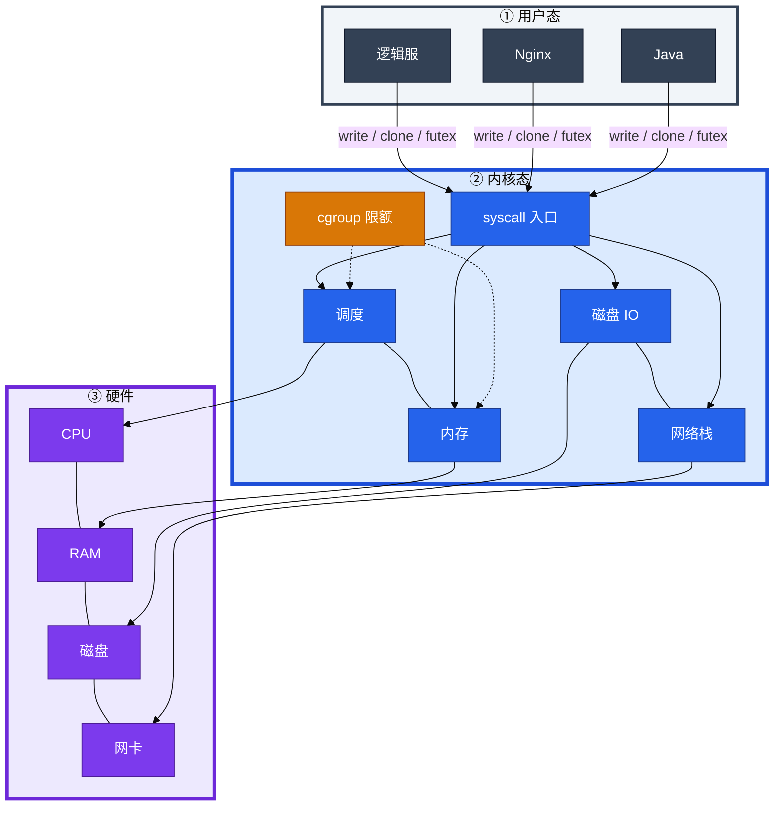
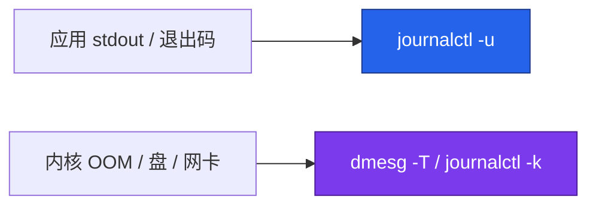
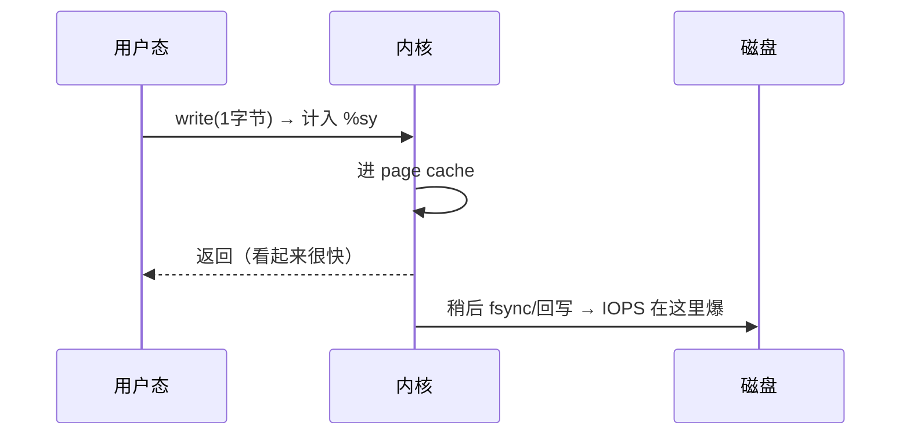
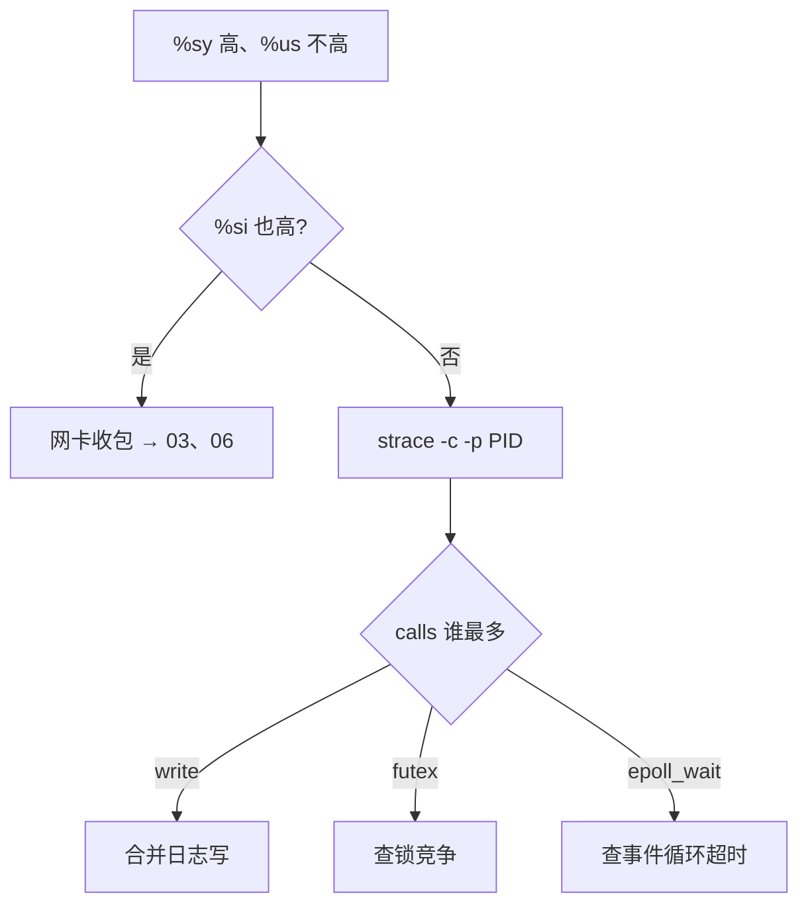
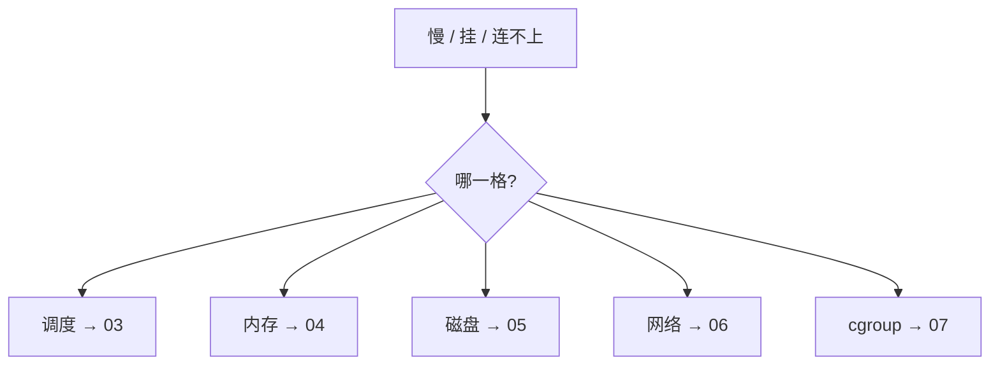
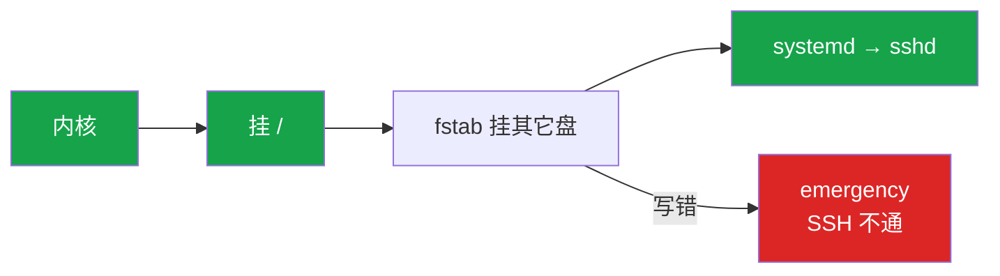
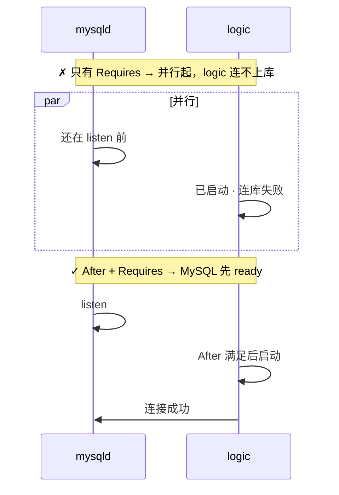
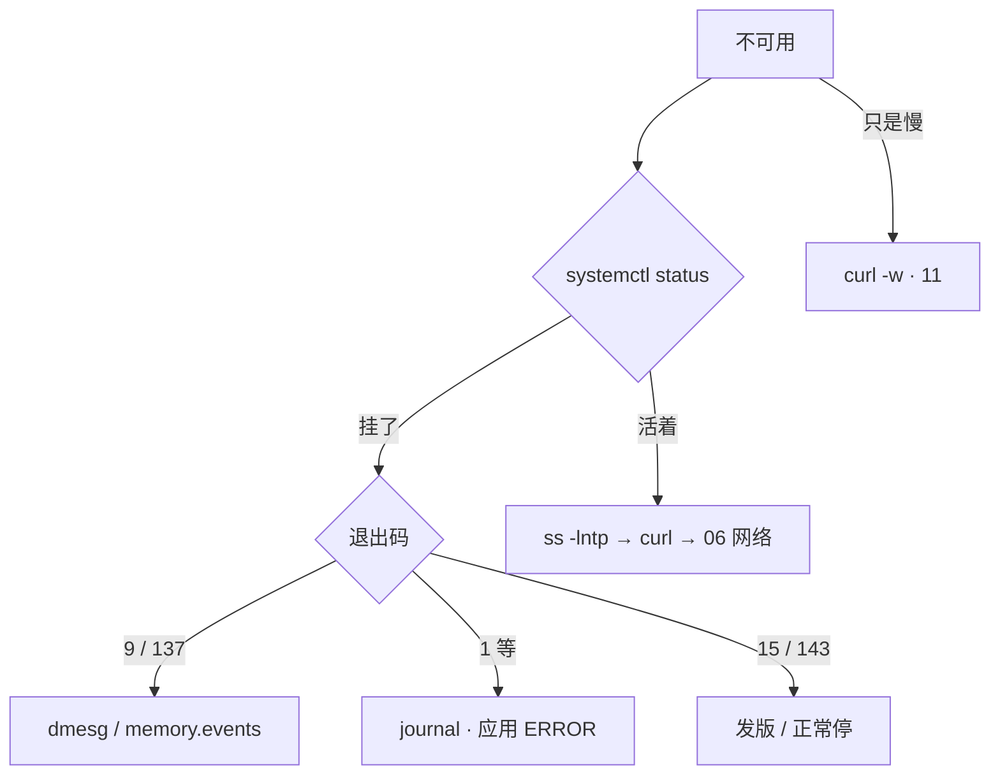

# 内核与系统


凌晨 3 点，逻辑服告警「不可用」。群里有人喊「重启试试」，有人已经 `top` 看 `%us` 只有 12% 说「CPU 不高啊」。其实进程可能已经没了——这一章只做一件事：**先分清层，再进对的格子**。CPU / 内存 / 磁盘 / 网络 / cgroup 细账在 03～07；这里讲整机骨架和「第一眼看哪」。

**本章主线（排障就按这三步想）：**

1. **分层**：业务在用户态 → 进内核靠 syscall → 硬件在最底下；systemd 管进程，journal 收应用，dmesg 收内核。
2. **归类**：慢/挂/连不上 → 先归调度 / 内存 / 磁盘 / 网络 / cgroup 五格，再开对应章。
3. **留证**：`status` → `journalctl -u` + `dmesg`，看清退出码再重启。

**读完你能：** 画用户态→syscall→内核→硬件；读懂 `%us/%sy/%wa/%si/%id`；交叉 journal 与 dmesg；写对 After + Requires；解释容器里 `free` 为什么撒谎。

## 本章目录

- [1. 基本概念](#1-基本概念)
- [2. 架构图](#2-架构图)
- [3. 原理](#3-原理)
- [4. 落地](#4-落地)
- [5. 核心配置](#5-核心配置)
- [6. 命令与操作](#6-命令与操作)
- [7. 生产排障](#7-生产排障)
- [8. 必会 · 常考](#8-必会--常考)
- [合上书](#合上书问自己)

**本章不讲：** Load/CPU → [03](../03-CPU与Load/)；OOM → [04](../04-内存与OOM/)；磁盘 IO → [05](../05-磁盘与IO/)；进程信号 → [02](../02-进程与信号/)；cgroup 文件树 → [07](../07-cgroup与容器/)；unit 全文 → [13](../13-Systemd与服务管理/)。

---

## 1. 基本概念

Linux 排障不是「哪个指标高就改哪个」——要先知道**你在哪一层**。用户态跑业务，碰硬件必须走 syscall；systemd 是 PID 1 管拉起和 cgroup；journal 记应用说了什么，dmesg 记内核做了什么。

**值班里怎么认现象**（先听告警/群里怎么说，再对表）：

| 群里/监控说的 | 技术含义 | 你的第一刀 |
|---------------|----------|------------|
| 「服务挂了」「502」 | 进程可能 exit 或被 kill | `systemctl status`，不是 top |
| 「CPU 不高但很慢」 | 可能在等盘 `%wa` 或 cgroup throttle | 先归五格，别加核 |
| 「Java 没了」 | 9/KILL 还是 exit 1？ | journal + dmesg 双日志 |
| 「容器内存够用啊 free 还有 50G」 | free 读宿主机视图 | 看 cgroup memory.max |

### 用户态 vs 内核态

| 层 | 能干什么 | 不能干什么 |
|----|----------|------------|
| **用户态** | 跑业务代码（逻辑服、Nginx、Java） | 直接碰 CPU 调度、磁盘、网卡 |
| **内核态** | 调度、内存、IO、网络、cgroup | — |

程序碰硬件，只能走 **syscall（系统调用）**——唯一正门：

| 你想干什么 | 典型 syscall |
|------------|--------------|
| 读/写文件、打日志 | `open` / `read` / `write` |
| 建 TCP 连接 | `socket` / `connect` / `sendto` |
| 创建线程/进程 | `clone` |
| 锁在内核里等 | `futex` |

**打个比方**：用户态像餐厅前台——能接单、记菜单，不能直接进后厨改煤气灶；syscall 是传菜窗口，每次递菜都要扣 `%sy` 时间。

### top 五个格子

`top` / `mpstat` 五个格子 = **CPU 时间在干什么**（合计约 100%）：

| 格子 | 含义 | 常见误判 |
|------|------|----------|
| `%us` | 用户态算业务 | 「不高就不慢」——可能 `%wa` 在等盘 |
| `%sy` | 进内核（syscall） | 不是内核 bug，是**进门次数多** |
| `%wa` | CPU 闲着等磁盘 | Load 高、`%us` 低时先看这个 |
| `%si` | 软中断（常见网卡收包） | **和 `%sy` 不是一回事** |
| `%id` | 真空闲 | 容器 throttle 时整机 `%id` 仍可能很高 |

### cgroup（先认脸）

**cgroup** = 给一组进程设配额：CPU 超 → **throttle**；内存超 → 这组被 OOM 杀。K8s `limits` 就是它。细节 → [07](../07-cgroup与容器/)。

> **记住**：用户态不能直接写磁盘、不能直接收网卡包；不可用先 status + 双日志，不要先 top、不要先重启。

**面试怎么说**：「我先把问题归到用户态/内核/硬件/cgroup 哪一层，不可用先看 systemctl status 和退出码，journal 和 dmesg 两边对照，不会一上来 top 或重启。」

---

## 2. 架构图

后面排障都对着这张图。



**读图三句话：**

1. 业务**不能**直连硬件，全部过 syscall——`%sy` 高往往是「进门太勤」，不是内核坏了。
2. cgroup 卡「允许用多少」；容器里 `free` 仍读宿主机视图（见 3.5）。
3. **systemd = PID 1**：拉服务、收 journal、挂 cgroup；不可用第一眼看 status。

**两条日志管管：**



---

## 3. 原理

### 3.1 一次 write 走哪条路

**一句话：** 每次 write 都进内核计 `%sy`，数据先进缓冲，IOPS 在后面爆。

**打个比方**：像外卖员每送一粒米就进一次厨房登记——登记本身（`%sy`）和厨房后面洗一万个碗（IOPS）是两笔账，小日志两条线一起炸。

**现场走一遍**（逻辑服 `%sy` 突然 40%，`%us` 只有 8%）：

1. 你在战斗服上，`top` 看到 `%sy` 高、`%us` 不高——**先别加核**，怀疑 syscall 进门太勤。
2. 确认 Java 进程 PID：

```bash
pgrep -af logic-server
```

屏幕出现：

```text
28451 /opt/game/logic-server -Xmx4g
```

3. 对 PID 做 5～10 秒 syscall 统计（活动服限时，Ctrl-C 结束）：

```bash
strace -c -p 28451
```

4. 屏幕出现汇总表——**只看 calls 列谁最多**。
5. 若 `write` 排第一 → 改日志缓冲/批量写，不是加 CPU 核。



| 写法 | syscall 次数 | 结果 |
|------|-------------|------|
| 每条日志 write 1 字节 | ~100 万 | `%sy` 爆 + IOPS 爆 |
| 攒 8KB 再 write | ~125 | 正常 |

**输出解读**（小日志场景 strace -c 典型输出）：

```text
% time     seconds  usecs/call     calls    errors syscall
 62.31    0.182341          12     15234           write
 18.42    0.053891         892        60           futex
  8.11    0.023761         145       164           epoll_wait
```

- 第 1 列 `% time`：各 syscall 占 strace 采样窗口 CPU 的比例，**write 62%** → 进门写日志是主因。
- 第 4 列 `calls`：**15234 次 write** → 5～10 秒内一万多次，每条日志一行就 write 一次。
- `usecs/call` 单次约 12μs，乘以 calls ≈ 0.18s CPU——进门约 **100～300ns** 量级，100 万次 1B write ≈ **0.1～0.3s CPU** → `%sy` 高、`%us` 不高。
- `futex` 60 次但单次 892μs → 可能有锁等待，次要；先修 write。

**面试怎么说**：「`%sy` 高 `%us` 不高，我先 strace -c 看 calls 列，write 最多就合并日志写；日志盘满通常是 IOPS 打满不是容量满，别先加核。」

> **记住**：日志场景「盘被打满」通常是 **IOPS 打满**，不是容量写满。

### 3.2 %sy 高了怎么证

**一句话：** 先分 `%sy` 和 `%si`，再 strace 看 calls 列。

**打个比方**：`%sy` 是「进厨房登记次数多」，`%si` 是「门铃（网卡中断）响个不停」——两个格子，别混成一个「内核坏了」。

**现场走一遍**（网关 `%sy` 25%，有人说内核 bug）：

1. 同一屏 `top` 看 `%si`——若 `%si` 也高（比如 15%）→ 网卡收包，去 [03](../03-CPU与Load/) / [06](../06-网络栈与Socket/)，不是 syscall 碎。
2. `%si` 正常、只有 `%sy` 高 → 找业务 PID，`strace -c -p PID` 5～10 秒。
3. 看 calls 排行：`write` → 日志；`futex` → 锁竞争；`epoll_wait` → 事件循环正常（calls 多但 time 低也 OK）。
4. 定责后开对应章，**活动服勿长时间 strace**。



**输出解读**（top 一行 CPU 汇总）：

```text
%Cpu(s):  8.2 us, 25.4 sy,  0.0 ni, 60.1 id,  0.3 wa,  0.0 hi,  2.1 si,  0.0 st
```

- `us 8.2`：用户态算业务不高——**不是算力不够**。
- `sy 25.4`：四分之一时间在 syscall——进门太勤或锁在内核等。
- `si 2.1`：软中断不高——**可以排除网卡把一个核打满**（若 si 15+ 另说）。
- `wa 0.3`：几乎不在等盘——**不是 IO 型慢**。
- 结论：`sy` 高、`si`/`wa` 低 → strace 证 calls 列。

**面试怎么说**：「`%sy` 和 `%si` 先分开，si 高查网卡，sy 高 strace 看 calls，write 多改日志，futex 多查锁，不会说内核 bug 就重装系统。」

### 3.3 五域归类

**一句话：** 告警先归格，别先改 sysctl、别先重启。

**打个比方**：像急诊分诊——发烧归内科、骨折归骨科；Load 高先想调度还是 D 状态卡 IO，别一上来开抗生素（改 sysctl）或截肢（重启）。

**现场走一遍**（监控报「服务器慢」，群里已经有人 `sysctl -w`）：

1. 先问清现象：**慢**（响应时间）、**挂**（进程没了）、还是**连不上**（网络）——三种入口不同。
2. 打开 `top` / `vmstat` 只做**归类**，不急着修：
   - Load 高 + `%us` 高 → 调度 → [03](../03-CPU与Load/)
   - MemAvailable 低 / dmesg OOM → 内存 → [04](../04-内存与OOM/)
   - `%wa` 高 / await 高 → 磁盘 → [05](../05-磁盘与IO/)
   - `%si` 高 / `ss -s` 异常 → 网络 → [06](../06-网络栈与Socket/)
   - 容器 P99 炸但宿主机很闲 → cgroup → [07](../07-cgroup与容器/)
3. 归好格再进对应章——**本章只负责分到格，不负责格内细账**。



| 域 | 第一眼 |
|----|--------|
| 调度 | load、`%us/%sy/%st`、`cpu.stat` |
| 内存 | MemAvailable、RSS、dmesg OOM |
| 磁盘 | `%wa`、await |
| 网络 | `%si`、`ss -s` |
| cgroup | `memory.max` / `cpu.max` |

**输出解读**（vmstat 快速归类，丢掉第一行）：

```text
 r  b   swpd   free   buff  cache   si   so    bi    bo   in   cs us sy id wa st
 2 18      0 8123456 123456 9876543  0    0   120  8900 4500 12000  5  2 70 18  0
```

- `r=2`：可运行队列不大——**不是 CPU 算力型**。
- `b=18`：18 个 D 状态在等 IO——**归磁盘/02 进程 D 状态**。
- `wa=18`：CPU 在等盘——和 b 高一致，去 [05](../05-磁盘与IO/)。
- `us=5 sy=2 id=70`：Load 可能很高但 CPU 很闲——**典型高 Load 低 CPU，别加核**。

**面试怎么说**：「告警我先归五格：调度、内存、磁盘、网络、cgroup，归好再开对应章，不会一上来 sysctl 或重启。」

### 3.4 journal 与 dmesg

**一句话：** journal 看应用和退出码，dmesg 看内核为什么杀。

**打个比方**：journal 是前台收银小票——记录了「顾客走了、付了多少钱（退出码）」；dmesg 是后厨监控——记录了「是不是保安（OOM）把人架出去的」。

**现场走一遍**（Java 进程突然没了，开发说「肯定是代码 bug」）：

1. 你在逻辑服上，**不要先重启**：

```bash
systemctl status myapp
journalctl -u myapp -n 80 --no-pager
dmesg -T | tail -30
```

2. `status` 看退出码是 `9/KILL` 还是 `1/FAILURE`。
3. journal 有 `status=9/KILL` → **被 SIGKILL 了**，但 journal **不知道谁杀的** → 必须查 dmesg。
4. dmesg 有 `Out of memory: Killed process` → 整机 OOM，去 [04](../04-内存与OOM/)；dmesg 无 OOM → cgroup 限额或人工 kill，查 `memory.events`。
5. journal 有 `connection refused` + `status=1` → 应用自己 exit，查依赖和配置，**不是 dmesg 的事**。

| | journal | dmesg |
|--|---------|-------|
| 谁写的 | systemd + 应用 stdout | **内核** |
| 看什么 | 退出码、连库失败、配置错 | OOM、I/O error、网卡 reset |
| 命令 | `journalctl -u myapp` | `dmesg -T` / `journalctl -k` |
| OOM 典型句 | `status=9/KILL` | `Out of memory: Killed process 28451 (java)` |

**输出解读**（journal 被系统杀）：

```text
Dec 28 03:12:01 game-s1 myapp[28451]: ... normal log ...
Dec 28 03:12:05 game-s1 systemd[1]: myapp.service: Main process exited, code=killed, status=9/KILL
Dec 28 03:12:05 game-s1 systemd[1]: myapp.service: Failed with result 'signal'.
```

- `code=killed, status=9/KILL`：收到 SIGKILL，退出码 **137 = 128 + 9**。
- `Failed with result 'signal'`：不是应用自己 exit(1)——**但 journal 不告诉你是 OOM 还是人手 -9**。

**输出解读**（dmesg 同一次 OOM）：

```text
[Mon Dec 28 03:12:05 2025] Out of memory: Killed process 28451 (java) total-vm:8388608kB, anon-rss:2096128kB
```

- `Killed process 28451 (java)`：和 journal 里 PID 对上——**内核 OOM Killer 杀的**。
- `anon-rss:2096128kB`：约 **2GB RSS** 时被杀——去 [04](../04-内存与OOM/) 查 MemAvailable 和 limit。

**输出解读**（journal 应用自己错）：

```text
Dec 28 03:12:01 game-s1 myapp[28451]: ERROR: connect mysql: connection refused
Dec 28 03:12:01 game-s1 systemd[1]: myapp.service: Main process exited, code=exited, status=1/FAILURE
```

- `connection refused`：MySQL 没 listen——查 mysqld 是否起来、After/Requires 是否写对（§5.1）。
- `status=1/FAILURE`：进程自己 `exit(1)`，**dmesg 通常无内容**——查应用日志和依赖。

**交叉结论：**

| journal | dmesg | 结论 |
|---------|-------|------|
| `status=9/KILL` | 有 OOM 行 | 整机 OOM → [04](../04-内存与OOM/) |
| `status=9/KILL` | 无 OOM | cgroup 限额或人工 kill → `memory.events` |
| `status=1/FAILURE` | 无 | 应用逻辑错，查 journal 里 ERROR |
| `connection refused` | 无 | MySQL 未就绪 → 查依赖、§5.1 |

常用 journal 参数：`-b` 本次开机、`-b -1` 上次开机、`--since "10:00"`。

**面试怎么说**：「进程没了先看 status 退出码，9/KILL 对 dmesg 找 OOM，1/FAILURE 查 journal 里 ERROR，两边交叉定责，不会只看应用日志就重启。」

### 3.5 容器里 free 为什么撒谎

**一句话：** 容器 free 读宿主机，真限额在 cgroup。

**打个比方**：你在合租单间（容器），问物业「这栋楼还剩多少空房？」——物业报的是整栋楼（宿主机 64G），不是你单间合同上的 2G 上限。

**现场走一遍**（Pod OOM 137，开发说「free 还有 50G 怎么会 OOM」）：

1. 进容器看 free——**只能当参考，不能当判决**：

```bash
free -h
cat /sys/fs/cgroup/memory.max    # cgroup v2
# 或 cat /sys/fs/cgroup/memory/memory.limit_in_bytes  # v1
```

2. 屏幕 free 可能显示 `Mem: 64Gi`，但 `memory.max` 是 `2147483648`（2G）——**真限额是 2G**。
3. 同理 `nproc` 返回宿主机 16 核，limit 只有 1 核 → Go `GOMAXPROCS=16` → throttle → 宿主机 `%id` 很高，容器 P99 仍炸。
4. **结案**：看 `memory.max` / `cpu.stat`，不用容器内 free/top 做容量决策。


**输出解读**：

```text
# free -h（容器内）
              total        used        free      shared  buff/cache   available
Mem:           62Gi       8.2Gi        45Gi       120Mi       8.5Gi        52Gi

# cat /sys/fs/cgroup/memory.max
2147483648
```

- free 的 `62Gi total`：读的是**宿主机** `/proc/meminfo`——Kubernetes 没改这个视图。
- `memory.max = 2147483648`：字节 → **2GiB 硬顶**，超了这组进程被 OOM 杀（137）。
- 开发看到 free 45Gi 以为够用——**错**， cgroup 2G 到了就杀，和 free 无关。

**面试怎么说**：「容器里 free 和 nproc 读宿主机视图，真限额看 memory.max 和 cpu.stat；OOM 137 先对 cgroup limit，不会信 free 说内存够用。」

---

## 4. 落地

### 4.1 包和内核升级

内部源；内核升级 = 变更（窗口、值守、grub 留上一版）；验收 `uname -r` + dmesg 无 oops。

### 4.2 fstab 写错 → SSH 不通

**一句话：** fstab 写错卡挂载，systemd/sshd 起不来，ping 通 SSH 超时。

**打个比方**：开机像上班打卡——必须先挂好 `/` 和 fstab 里的盘，才能轮到 sshd 上班；fstab 里写了个不存在的盘，整机卡在「等盘出现」，SSH 永远轮不到。

**现场走一遍**（改完 fstab 重启后 ping 通但 SSH 超时）：

1. **怎么认**：ping 通 + SSH 超时；VNC/云控制台见 `Emergency mode` 或卡在挂载；刚改过 fstab。
2. 云 VNC / 串口登录（**不是 SSH**）。
3. GRUB 按 `e`，linux 行末加 `rd.break`，`Ctrl+X` 启动。
4. 救援 shell：

```bash
switch_root /sysroot /bin/bash
mount -o remount,rw /
blkid
# 注释 fstab 坏行或改 UUID=...
mount -a    # 必须无报错
reboot -f
```

5. 已能 SSH 时直接改 fstab + `mount -a`，不必进救援。



```text
# 坏：/dev/sdb1  /data  xfs  defaults  0  0     ← 盘符会变
# 好：UUID=a1b2c3d4-...  /data  xfs  defaults  0  0
```

细账 → [14](../14-文件系统与inode/)。

### 4.3 主机名

`hostnamectl set-hostname game-s1-logic-03`；云上用 cloud-init 钉死。

---

## 5. 核心配置

完整 unit → [13](../13-Systemd与服务管理/)。

### 5.1 After / Requires / Wants

**一句话：** After 管排序，Requires 管生死，Wants 管软依赖。

**打个比方**：After 像「等 MySQL 开门了我再营业」；Requires 像「MySQL 倒闭我也关门」；Wants 像「Redis 挂了我也继续，只是慢点」。

```ini
[Unit]
After=network-online.target mysqld.service   # 排序：等 MySQL 之后再启我
Requires=mysqld.service                      # 硬绑：MySQL 挂我也停
Wants=redis.service                            # 软绑：Redis 挂我继续
```

| 词 | 白话 | 管顺序？ | 对方挂了？ |
|----|------|:--------:|:----------:|
| **After** | 等它**启动完**再启我 | 是 | **不管**——它后来挂了我照跑 |
| **Requires** | 没它我不能活 | 否（可能并行起） | **我也被停** |
| **Wants** | 有它更好 | 否 | **我继续跑** |



**硬依赖写法：** `After=mysqld.service` + `Requires=mysqld.service` 一起写。

游戏服常见折中：只 `After=mysqld`，应用层重连；Requires 留给「没有绝对不能跑」的本地 agent。MySQL 抖一下 + Requires → 逻辑服全停。

### 5.2 Restart 死亡螺旋

**一句话：** always + RestartSec=0 → OOM 137 立刻重启循环。


`always` 连 `exit 0`（热更）也会拉回来 → 抢端口。

**生产写法：**

```ini
Restart=on-failure
RestartSec=5s
StartLimitBurst=3
StartLimitIntervalSec=60
```

### 5.3 Type 与 PIDFile

| Type | 什么时候用 |
|------|------------|
| **simple** | 进程前台跑（Nginx `daemon off`）——**默认首选** |
| **forking** | 启动脚本 fork 后父进程退出；必须配对的 **PIDFile** |

PIDFile 路径错 → systemd 认为没起来 → unit failed，旧进程仍占端口。看生效配置：`systemctl cat myapp`。

---

## 6. 命令与操作

### 6.1 服务不可用第一眼

**不要先 top、不要先重启。** 顺序：**影响面（30s）→ status → 双日志留证 → 再拉起**。



### 6.2 命令速查

```bash
# 状态
systemctl status myapp
systemctl cat myapp

# 双日志（见 3.4 示例输出）
journalctl -u myapp -n 80 --no-pager
journalctl -u myapp -b -1          # 上次开机
dmesg -T | tail -50
journalctl -k -n 50

# %sy 证明（见 3.2）
strace -c -p <PID>                  # 5～10 秒，看 calls 列
```

| 退出表现 | 含义 | 下一步 |
|----------|------|--------|
| `status=9/KILL` / 137 | SIGKILL | dmesg / memory.events |
| `status=15/TERM` / 143 | 正常停 / 发版 | 对变更窗口 |
| `status=1` | 自己 exit | journal 里 ERROR |

`status` 片段：`code=killed, signal=KILL` → dmesg；`code=exited, status=1` → journal。

---

## 7. 生产排障

三问：进程还在不在？还能不能变更？已有流量还通不通？

| 现象 | 先做 | 别做 |
|------|------|------|
| 不可用 | status → 双日志 | 先重启 / 先 top |
| 9/KILL、137 | dmesg；容器 memory.events | 只看应用日志 |
| 反复 start+137 | 改 Restart，再查内存 | 只 reset-failed |
| `%sy` 高 `%us` 不高 | 分 sy/si → strace -c | 先加核 |
| 容器 free 很大 | cgroup limit | 信 free |
| SSH 不上 + 刚改 fstab | VNC → UUID → mount -a | 空转 SSH |
| unit failed 端口有人听 | PIDFile / Type | 再 start 抢端口 |

**游戏事故复盘：** 活动高峰 Java 137，journal 只有 `status=9/KILL`，开发坚称代码没问题。dmesg 有 OOM 行且 anon-rss 2G——Pod limit 就是 2G，free 显示 50G 是宿主机视图。止血：调 limit 或降堆，不是「重启试试」。

---

## 8. 必会 · 常考

| 说法 | 对错 | 口径 |
|------|:----:|------|
| 用户态直接写磁盘 | 错 | 只能 syscall |
| `%sy` 高 = 内核 bug | 错 | 进门次数多 |
| `%sy` = `%si` | 错 | sy=syscall；si=软中断 |
| 不可用先 top/重启 | 错 | 先 status + 留证 |
| After = 对方挂自己不起 | 错 | After 只排序 |
| 只有 Requires | 错 | 可能并行连未就绪库 |
| always + RestartSec=0 | 错 | 死亡螺旋 |
| 只看 journal 定 OOM | 错 | 杀手在 dmesg |
| 容器 free 大 = 够用 | 错 | 看 cgroup |
| fstab 写 sdb1 | 错 | 用 UUID |
| throttle 时整机很闲 | 对 | 卡的是容器配额 |

数字：syscall **100～300ns**；100 万次 1B write ≈ **0.1～0.3s CPU**；**137 = 128 + 9**。

易混：journal vs dmesg；`%sy` vs `%si`；After vs Requires；IOPS 满 vs 容量满。

---

## 合上书，问自己

1. 画 write 路径：`%sy` 在哪一步涨？IOPS 在哪一步爆？
2. `%sy` 和 `%si` 怎么分？strace 输出看哪一列？
3. Java 被 kill，journal 和 dmesg 各看到什么？
4. 容器 limit 2G、free 显示 64G，为什么？
5. After / Requires / Wants 区别？硬依赖怎么写？
6. fstab 写错为什么 SSH 不通？修复几步？

六题能口述，这一章就过了。下一章：[进程与信号](../02-进程与信号/)——D 为什么杀不掉、TERM 和 KILL 差在哪。
