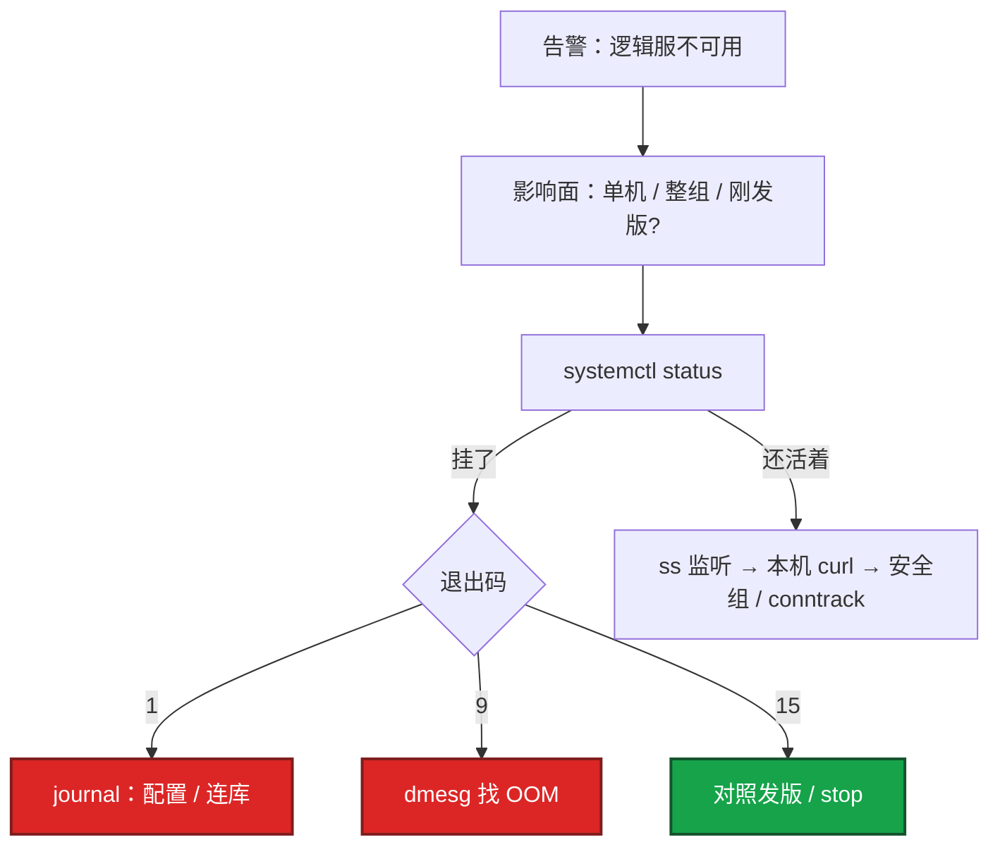
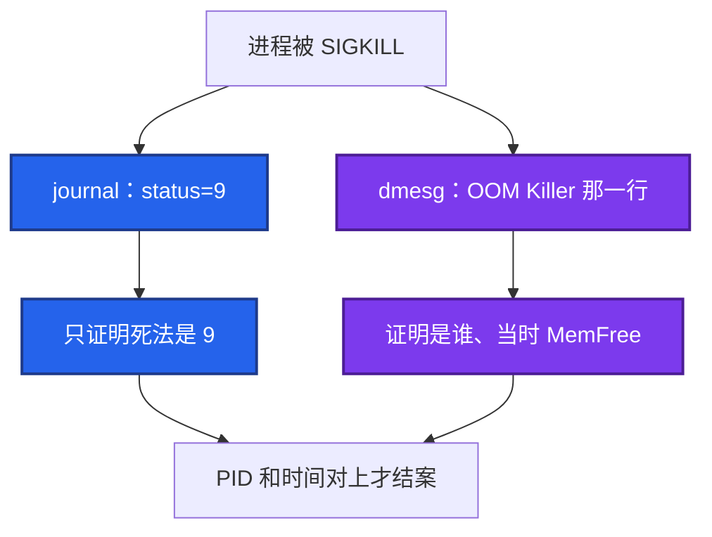
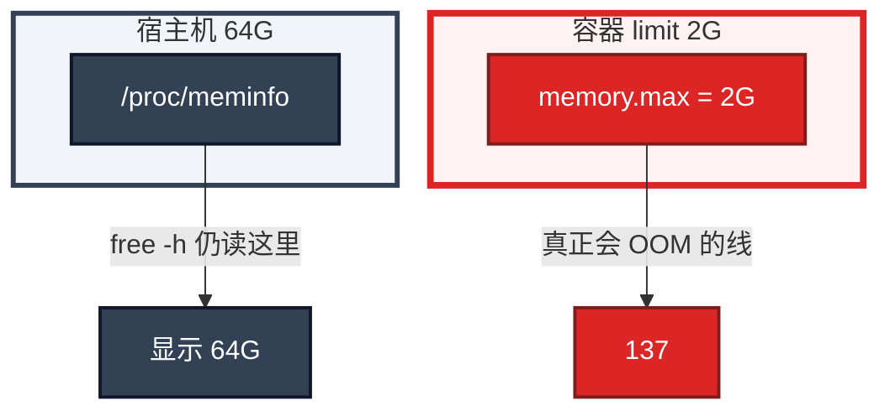
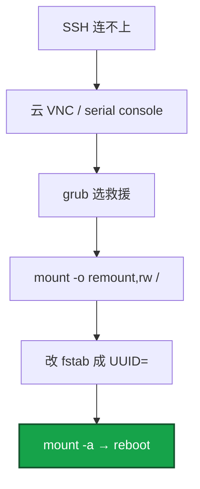

# 01｜内核与系统 · 练习题

先自己画图或口述，再对照解答。每题标了覆盖范围：

| 标记 | 含义 |
|------|------|
| **核心** | 不懂整章就没建立起来 |
| **必会** | 值班和面试都要能讲 |
| **常用** | 线上会反复碰到 |
| **常考** | 白板和追问的高频口径 |

## 本题目录

- [Q1 不可用第一眼](#q1)
- [Q2 After / Requires / Wants](#q2)
- [Q3 journal 和 dmesg](#q3)
- [Q4 Restart 死亡螺旋](#q4)
- [Q5 `%sy` 与 syscall](#q5)
- [Q6 容器里的 free](#q6)
- [Q7 Type=forking](#q7)
- [Q8 strace / bpftrace / perf](#q8)
- [Q9 fstab 救援与内核升级](#q9)
- [Q10 五域归类](#q10)
- [合上书](#合上书)

---

## Q1

**★★★★★｜凌晨告警「逻辑服不可用」，你第一眼看什么？为什么不能先重启？**

**覆盖**：核心 · 必会 · 常考

### 场景

值班群：`s3-logic-02` 不可用 3 分钟。监控只有「进程存活」红了。你还没登录。有人已经在频道里打了「重启试试」。

### 完整解答

顺序是 **定影响面 → 看进程怎么没的 → 交叉 journal 和 dmesg → 再决定进哪一章**，不是 top，更不是重启。



1. **影响面（30 秒内问清）**：只有这一台还是整组？刚发版、刚合服、刚改过 unit？玩家是进不去、还是进得去但卡战斗？
2. **进程还在不在**：`systemctl status s3-logic`。`status=1` 去 journal；`status=9/KILL` **先 dmesg 找 OOM**，没有再查人手 `-9` 或编排器强制杀；`status=15/TERM` 对变更窗口。
3. **两条日志必须对上**：`journalctl -u s3-logic -n 80` 给退出码；`dmesg -T | tail` 给内核杀因。只看其中一个，会把 OOM 说成「程序崩了」。
4. **还活着但不可用**：`ss -lntp` → 本机 curl → 安全组。新建连接大面积失败 → conntrack / 全连接队列（[06](../06-网络栈与Socket/)）。
5. **只是慢**：先 `curl -w` 五段（[11](../11-网络排障与抓包/)）。`time_connect` 高先走网络；`ttfb` 高再看 `%wa/%us/%sy`。

重启能让进程再起来，也会清掉当时的内存形态、fd 数量、是否正在死循环、dmesg 里那一行 OOM 是否还容易对上时间。先把 `dmesg`、`journal`、`ss -s`、`free` 存下来再拉起。摘流量、拉备机，不等于在原机无脑 `systemctl restart`。

### 再追问

- 为什么不第一眼 top？——top 是已经认定「CPU 有问题」才用的工具。服务不可用更常见是进程没了、没监听、被安全组挡住。
- 三条证据？——现象 + 主机数字 + 应用侧。缺一条就容易误重启全集群。

---

## Q2

**★★★★★｜After、Requires、Wants 有什么区别？逻辑服依赖 MySQL、缓存用 Redis，unit 怎么写？**

**覆盖**：核心 · 必会 · 常考

### 场景

开服后逻辑服比 MySQL 先起来，连库失败刷屏，过几秒又好了。另一次 MySQL 主从切换抖了 2 秒，整组逻辑服被停掉。

### 完整解答

三条指令管的不是同一件事：

| 指令 | 只管 | 对方起失败 / 中途挂掉 | 逻辑服还起得来吗 |
|------|------|------------------------|------------------|
| After | 启动**顺序** | 不管死活 | 照样起 |
| Requires | **硬依赖**（共生死） | 对方失败或挂了，systemd 停你 | 不起 / 会被停 |
| Wants | **软依赖** | 不影响你 | 照样起 |

MySQL 是账本，没有它逻辑服不该对外服务：

```ini
[Unit]
After=network-online.target mysqld.service
Requires=mysqld.service
```

必须 **After 和 Requires 一起写**。只有 Requires、没有 After：systemd 可能**并行**拉 MySQL 和逻辑服，逻辑服连上一个还没 listen 的端口。只有 After、没有 Requires：MySQL 根本没起来，逻辑服照样起，错误变成业务日志里的连库失败。

Redis 只是缓存，挂了应降级读库：用 `Wants=redis.service` + `After=redis.service`。不要对 Redis 写 Requires，否则缓存抖动会把逻辑服整组停掉。

### 再追问

- Requires 的服务挂了，逻辑服收到什么信号？——systemd 给依赖方发 **SIGTERM（15）**。「数据库抖一下游戏服全停」往往是 Requires 写太狠。很多团队对 MySQL 只写 After，**重连放在应用里**。
- Wants 的服务没装，自己还能 enable 吗？——能。Wants 失败不阻断。这也是为什么数据库不能写成 Wants。

---

## Q3

**★★★★★｜journalctl 和 dmesg 分别看什么？进程被杀时为什么要交叉？**

**覆盖**：核心 · 必会 · 常考

### 场景

`systemctl status` 写着 `code=killed, status=9/KILL`。开发说「内核随便杀我们进程」。你只有 journal。

### 完整解答



| | journal（`journalctl -u 服务名`） | dmesg（`dmesg -T` 或 `journalctl -k`） |
|--|-----------------------------------|----------------------------------------|
| 作者 | systemd + 应用的 stdout/stderr | **内核** |
| 能证明 | 退出码、配置错误、应用自己打的日志 | OOM、磁盘错误、NFS 超时、网卡 reset |
| 对 SIGKILL 能说到哪 | 「被 9 杀了」 | 「OOM Killer 杀了 pid 12345 java，当时 MemFree 多少」 |

journal 的 `status=9/KILL` **只证明死法是 SIGKILL**，不证明是 OOM。SIGKILL 还可能来自人手 `kill -9`、kubelet 强制杀、某些安全软件。

对上才结案：journal 确认时间和 PID → dmesg 同一分钟有没有 `Out of memory: Kill process ...`，comm 是不是这个服务 → 没有 OOM 记录再查审计、K8s `OOMKilled`（cgroup 账，不一定出现在宿主机 OOM Killer 里）。

Exit **137** = 128+9。容器里还要读 `memory.events`（[07](../07-cgroup与容器/)），不要只在容器里敲 dmesg——很多镜像不挂宿主 kmsg，结果是空的。

### 再追问

- 配置写错、监听失败看哪边？——journal。内核日志不会告诉你 `bind: address already in use`。
- 容器里 dmesg 为空怎么办？——上**宿主机**看 `dmesg` / `journalctl -k`；K8s 看 `kubectl describe` 是否 OOMKilled；cgroup 满了读 `memory.events`。

---

## Q4

**★★★★★｜`Restart=always` 配 `RestartSec=0` 会怎样？生产怎么写？**

**覆盖**：核心 · 必会 · 常用

### 场景

活动峰值后节点 CPU 打满，逻辑服 unit 变成 failed。日志里一分钟内几十次 start。内存 limit 2G，堆就快到 2G。

### 完整解答

`Restart=always` 表示**无论怎么退出都再拉**，包括正常 `exit 0`。  
`RestartSec=0` 表示**死了立刻拉**。


内存已经到 cgroup 上限时：杀（137）→ 立刻冷启动 → 再打满内存 → 再杀。CPU 被 JVM/引擎初始化占满，同机匹配服超时。然后 `StartLimitBurst` 用尽，unit 停在 failed，看起来像「服务不起来了」。

更隐蔽的坑：热更脚本让进程 **正常退出再换新包**。`always` 会把旧进程策略立刻拉回来，和新进程抢端口。

生产更稳的一组：

```ini
Restart=on-failure
RestartSec=5s
StartLimitBurst=3
StartLimitIntervalSec=60
```

恢复 failed：`systemctl reset-failed myapp && systemctl start myapp`。**先看为什么连续失败**（dmesg、cgroup、配置），再 reset。

### 再追问

- StartLimit 触发后只 reset 就结束了吗？——没有。reset 只是允许再启动。根因还在会再撞墙。要同时改 limit、修泄漏、或把 RestartSec 拉开。

---

## Q5

**★★★★☆｜用户态 / 内核态切换的代价，生产上怎么表现？怎么证明？**

**覆盖**：核心 · 必会 · 常用

### 场景

`top` 里 `%us` 只有 20%，`%sy` 到 40%，QPS 上不去。有人说「再加 8 核」。

### 完整解答

用户程序不能直接写磁盘、不能直接碰网卡，必须 syscall 进内核。每次切换大约 **100～300ns**。单次可以忽略，**小 IO / 锁 / 空转把次数打到十万百万** 时，CPU 就耗在「进进出出」。100 万次 1 字节 `write` ≈ **0.1～0.3 秒 CPU**。所以你看到 **`%sy` 高、`%us` 不高、加核没用**。攒到 **8KB** 再写，次数从 100 万降到约 125。

证明步骤：

1. `mpstat -P ALL 1` 确认是 `%sy` 而不是 `%si`。`%si` 高优先想网卡软中断（[03](../03-CPU与Load/)、[06](../06-网络栈与Socket/)）。
2. `strace -c -p PID` 短窗口：看哪种 syscall 的 **calls** 爆炸。`write` 百万次：日志没合并；`futex` 极多：锁竞争；`epoll_wait` 极多但 QPS 低：事件循环空转。
3. 治理是 **减少 syscall 次数**（攒缓冲、降日志、拆锁），不是加核。

`gettimeofday` 多数走 vDSO，不进 `%sy`。真正烧的是必须进门的调用。

### 再追问

- strace -p 对战斗服安全吗？——会明显拖慢。生产用 `-c` 只采几秒，或上 bpftrace/perf。不要 `-e trace=all` 挂在高峰。
- 和 `%si` 怎么分？——`%sy`：进程主动进内核。`%si`：软中断，常见网卡收包。

---

## Q6

**★★★★★｜容器里 `free -h` 显示 64G，limit 是 2G，为什么？监控该看哪条？**

**覆盖**：核心 · 必会 · 常考

### 场景

Pod `memory: 2Gi`。进容器 `free -h` 看到 Mem 64G，Available 还很多。十分钟后 Pod 137 退出。开发说「内存明明够」。

### 完整解答

`free` 读 **`/proc/meminfo`**。这份文件是**宿主机内存视图**，mount namespace **不会** 把它换成「这个容器的 2G」。所以容器里看到 64G 完全正常，**不能用来判断会不会 OOM**。



真实上限：cgroup v2 `memory.max`；v1 `memory.limit_in_bytes`；K8s limits 以及 working set。

`nproc` 同样返回宿主机核数。Go 默认 `GOMAXPROCS=64`，实际只有 2 核配额，结果是 **CPU throttle**。`top` 在容器里 CPU% 有时按宿主机核来算会看起来「很低」，以 `cpu.stat` 为准。

监控：`container_memory_working_set_bytes` 对比 limit。**不要** 把容器里的 `node_memory_MemAvailable` 当容器可用内存。结案：137 + `OOMKilled` / `memory.events` 里 `oom_kill` 增加。

### 再追问

- 那 top 在容器里准吗？——CPU% 有时按宿主机核算会偏低。以 cgroup `cpu.stat` 的 throttled 为准。进程账和容器限额不是同一本账（[07](../07-cgroup与容器/)）。

---

## Q7

**★★★☆☆｜`Type=forking` 的 PIDFile 写错，外面会看到什么？**

**覆盖**：必会 · 常用

### 场景

运维把老游戏 daemon 的 unit 从 init.d 迁到 systemd。`systemctl start` 马上 failed。端口却显示有人在听。新实例起不来。

### 完整解答

`Type=forking` 的约定是：启动命令会 **fork，父进程退出**，真正的服务是子进程。systemd 靠 **PIDFile 里的 PID** 判断「起来了没有」。

PIDFile 路径写错、权限不能写、或写得太晚：

1. 父进程已经退出，systemd 等不到合法 PID → unit **failed**。
2. **子进程可能已经在跑**，占着端口。
3. 你再 start：`Address already in use`；外面 curl：有时 Connection refused（failed 后 systemd 又杀了一轮），有时连到「幽灵进程」。

能前台就 `Type=simple` + `daemon off`（Nginx）。必须 forking：核对 PIDFile 与进程真实写入路径一致。`systemctl cat` 看生效配置（含 drop-in）。

### 再追问

- Type=simple 配成了会 fork 的老脚本会怎样？——父进程一退出，systemd 认为服务死了，可能把整棵 cgroup 杀掉，子进程一起没。

---

## Q8

**★★★☆☆｜已经会 `strace -c` 了，还要 bpftrace 吗？和 perf 怎么分工？**

**覆盖**：常用 · 常考

### 场景

追问「生产上 strace 太重，你还有什么办法看 syscall 分布？」

### 完整解答

日常 **`strace -c` 短窗口够用**。bpftrace 是「更轻的计数」：挂 `sys_enter_*`，按 probe 累加，不把每次调用的参数都拷到用户态。

仍然要看的是 **哪种调用次数高**：futex → 锁；write → IO/日志。

| 问题 | 用谁 |
|------|------|
| 哪种 syscall 太多 | strace -c / bpftrace |
| CPU 时间花在哪个函数 | `perf top` / 火焰图（[03](../03-CPU与Load/)、[12](../12-性能观测与排障/)） |

不要用 perf 回答「是不是 write 太多」，也不要用 strace 回答「是哪段 Java 代码在烧 CPU」。

### 再追问

- 不会写 bpftrace 会挂吗？——不会。说清「strace -c 看分布、生产慎挂完整跟踪、热点用 perf」就够。能写一句 `bpftrace` 是加分。
- strace 把 P99 打高谁负责？——你。所以默认 `-c` 限时，敏感路径用 perf/eBPF。

---

## Q9

**★★★★☆｜fstab 写错重启进不去系统，怎么修？内核升级要注意什么？**

**覆盖**：必会 · 常用 · 常考

### 场景

昨天加了一块数据盘，`/etc/fstab` 写了 `/dev/sdb1`。今天机房维护重启，SSH 再也上不去。云控制台能进。

### 完整解答

开机挂载失败时，systemd 往往进 **emergency / 卡在依赖**。SSH 依赖网络和多用户 target，所以你连不上是正常的。



1. 云 **VNC / serial console** 登录。
2. grub 选救援，或已部分起来时 `systemctl isolate rescue.target`。
3. `mount -o remount,rw /` 保证能改文件。
4. 改 `/etc/fstab`：注释坏行，或改成 **UUID=**（`blkid` 查）。
5. `mount -a` 无报错再 reboot。

内核升级：当变更，有窗口、有回滚。grub 里留 **旧内核**。不要在活动窗口升。关掉无人值守的内核自动更新（`unattended-upgrades` 等）。

### 再追问

- 为什么不要用 `/dev/sdb1`？——重启后设备名可能变成 `sdc1`。UUID 稳定。[14](../14-文件系统与inode/) 会把 fstab 和 inode 一起收。
- hostname 只 hostnamectl 改了，sudo 很慢？——`/etc/hosts` 里本机名没对上，每次 sudo 解析自己。云上还要防 cloud-init 把 hostname 改回去。

---

## Q10

**★★★★☆｜告警来了，你怎么 30 秒丢进正确的格子？**

**覆盖**：核心 · 必会

### 场景

四个工单同时响：① Load 40、idle 70% ② 进程 137、宿主机还有内存 ③ `%sy` 40%、`%us` 20% ④ 容器里 free 显示 64G。有人要把四台一起加核。

### 完整解答

| # | 丢进哪格 | 不要做 |
|---|----------|--------|
| ① | D / IO → [05](../05-磁盘与IO/)、[02](../02-进程与信号/) | 加 CPU |
| ② | 内存 / cgroup OOM → [04](../04-内存与OOM/)、[07](../07-cgroup与容器/)；交叉 dmesg 与 memory.events | 只看 journal 说崩了 |
| ③ | syscall → 本章 `strace -c`；先分清不是 `%si` | 先加核 |
| ④ | cgroup 限额，不是 `/proc/meminfo` | 用容器内 free 结案 |

现场：影响面 → `systemctl status` → journal + dmesg → 再打开对应章。不要一上来改 `sysctl`。

### 再追问

- 玩家看到的是「进不去」，根因一定在入口？——开服 `Restart=always` + OOM 死亡螺旋时，玩家侧是入口，根因在 systemd 策略和 cgroup，不是再加 8 核。

---

## 合上书

- [ ] 能画出用户态 / syscall / 内核 / 硬件，并说明没有箭头从业务直连磁盘
- [ ] 能把告警丢进调度 / 内存 / 磁盘 / 网络 / cgroup 五格
- [ ] 能默写 After + Requires、挡住 Restart 死亡螺旋那一组 unit
- [ ] 能交叉 journal 和 dmesg 结案 137，并知道容器里 dmesg 可能是空的
- [ ] 能说明容器 `free` 显示 64G 的原因，监控看 working_set vs limit
- [ ] 能用短窗口 `strace -c` 证明 `%sy`，并分清 sy / si
- [ ] 能修 fstab 救援，并说出内核升级要 grub 留上一版
