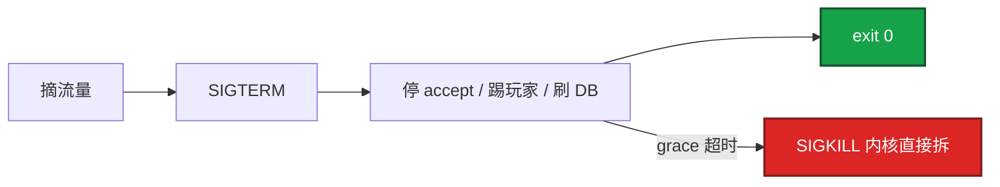
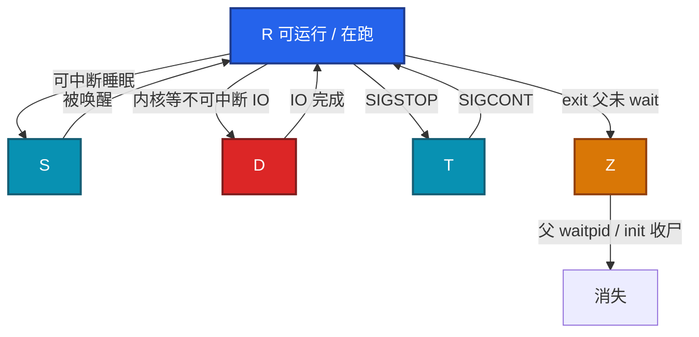
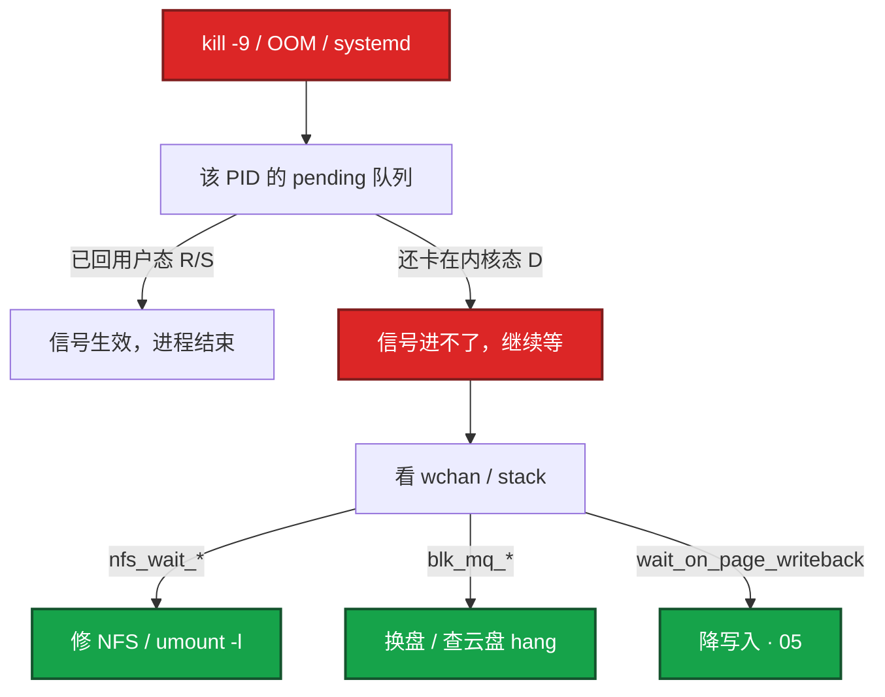
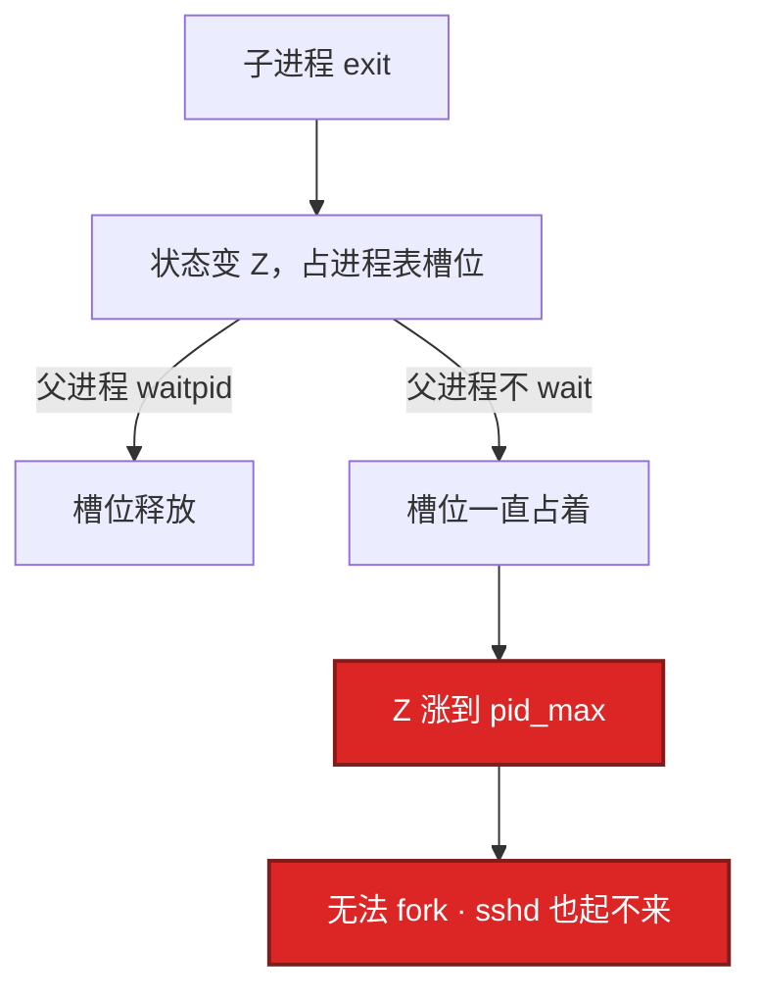
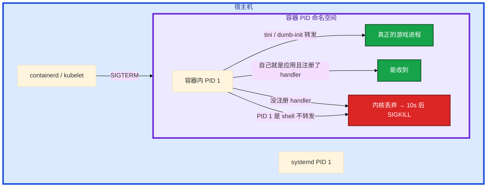
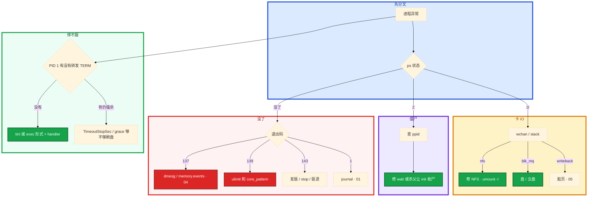

# 进程与信号


大厅卡登录。你 `ssh` 上去 `ps aux`，STAT 列里混着 R、S、D、Z。群里有人已经 `kill -9`，另有人要把发布脚本写成直接强杀。玩家报「刚才的副本进度没了」。

先别动手。这一章后半全是你会动手的：**D 怎么查 wchan、Z 怎么找父进程、TERM 怎么把内存态刷盘、容器 PID 1 为什么吃不到停服信号、139 怎么让 core 落盘。** 前面的状态机，是为了让你动手时不选错路。

**读完你能：** 先看 STAT 再决定杀还是等 IO；D 杀不掉能指到 NFS / 盘 / 脏页；会写游戏服优雅退出；容器 stop 不再变成 10 秒强杀；fd 泄漏和 core dump 能留证。

## 本章目录

缩进 = 上下级。3 下面才是 3.1。

想钉在**正文左边**跟着滚：菜单 **查看 → 打开视图 → 大纲**。Markdown 预览做不到独立左栏，目录只能写在文章开头。

- [1. 基本概念](#1-基本概念)
- [2. 架构图](#2-架构图)
- [3. 原理](#3-原理)
  - [3.1 状态机](#31-状态机rsdzt)
  - [3.2 D 状态](#32-d-状态为什么杀不掉)
  - [3.3 僵尸](#33-僵尸不占内存占-pid)
  - [3.4 信号](#34-信号term-是请求kill-是处决)
  - [3.5 容器 PID 1](#35-容器-pid-1-为什么吃不到-sigterm)
- [4. 落地](#4-落地)
- [5. 核心配置](#5-核心配置)
- [6. 常用命令](#6-常用命令)
- [7. 常用操作](#7-常用操作)
  - [7.1 停服](#71-停服)
  - [7.2 fd 泄漏](#72-fd-泄漏)
  - [7.3 core dump](#73-core-dump)
- [8. 生产排障](#8-生产排障)
- [9. 必会 · 常考](#9-必会--常考)
- [合上书](#合上书问自己)

**本章不讲：** Load 为什么含 D、CPU 格子细拆 → [03 CPU 与 Load](../03-CPU与Load/)；OOM 分数、137 结案细节 → [04 内存与 OOM](../04-内存与OOM/)；脏页 / await → [05 磁盘与 IO](../05-磁盘与IO/)；CLOSE_WAIT 原理 → [06 网络栈与 Socket](../06-网络栈与Socket/)、[08 TCP 与 UDP](../08-TCP与UDP/)；cgroup 内存导致 fork ENOMEM 的文件布局 → [07 cgroup 与容器](../07-cgroup与容器/)；TimeoutStopSec 全文 → [13 Systemd 与服务管理](../13-Systemd与服务管理/)；syscall `%sy` → [01 内核与系统](../01-内核与系统/)。

---

## 1. 基本概念

Linux 创建新进程只有一条路：**fork（或 clone）再 exec**。fork 用写时复制（COW）：子进程先和父进程共用同一份物理页，谁先改谁才拆页。所以 fork 看起来「很快」，但内核仍要按最坏情况准备可能复制的页表。

容器里的坑：父进程 RSS 已经贴近 `memory.max` 时，再 `fork` 可能直接 **ENOMEM**。Java `Runtime.exec`、脚本里再拉一个 `curl`，在 512Mi limit 的 Pod 里很常见。不要在逻辑服进程里 fork 外部命令，改 sidecar 或 IPC。宿主机有空闲也不帮这个 cgroup 超卖。线程共享地址空间，比 fork 整个进程便宜得多——这个坑主要是 **fork 子进程**，不是 `clone` 线程。细节在 [07](../07-cgroup与容器/)。

状态只记生产会碰到的五个字母：

| STAT | 人话 | `kill -9` | 进 Load 吗 |
|------|------|-----------|------------|
| **R** | 正在跑，或在可运行队列里等 CPU | 有效 | 进 |
| **S** | 可中断睡眠：锁、sleep、socket、`epoll_wait` | 有效，会唤醒再死 | **不进** |
| **D** | 内核里等不可中断 IO | **无效** | 进 |
| **Z** | 已 exit，父进程还没 wait | 杀那个僵尸 PID **没意义** | 不进 |
| **T** | 被 `SIGSTOP` 暂停 | 先 `SIGCONT` | 不进（生产少见） |

Load = R + D。S 再多也不进 Load。大厅几千个连接全是 S，Load 可以很低。一排 R 且 `%us` 高，去 [03](../03-CPU与Load/)，不是本章的信号故事。

生产只把这几个信号吃透：

| 信号 | 编号 | 应用能自己处理吗 | 典型用途 |
|------|------|------------------|----------|
| SIGHUP | 1 | 能 | Nginx `reload`：master 重读配置，旧 worker 处理完再退 |
| SIGTERM | 15 | 能 | `systemctl stop`、`docker stop`、K8s 停 Pod **第一枪** |
| SIGKILL | 9 | **不能** | OOM Killer、grace 超时后的第二枪、人手 `kill -9` |
| SIGCHLD | 17 | 能 | 子进程退出；PID 1 必须管 |
| SIGSTOP / SIGCONT | 19 / 18 | STOP 不能捕获 | 暂停 / 继续 |

退出码怎么对上信号（被信号杀死时 = **128 + 信号编号**）：

| 码 | 含义 | 下一眼 |
|----|------|--------|
| 137 | SIGKILL | dmesg OOM？人手 -9？kubelet 强杀？（[04](../04-内存与OOM/)、[07](../07-cgroup与容器/)） |
| 139 | SIGSEGV | core / hs_err |
| 143 | SIGTERM | 正常停服或 grace 内退出 |
| 1 等 | 自己 `exit` | journal，不是 dmesg |

> **记住**：先看 STAT 列，再决定动手；D 等 IO，Z 找父进程，R/S 才能被信号打死。TERM 是请求，KILL 是处决。

---

## 2. 架构图

先把进程树和信号递送钉住。后面 D、Z、容器 PID 1 都对着这张图说话。

```mermaid
%%{init: {"flowchart": {"padding": 18, "nodeSpacing": 30, "rankSpacing": 50}, "theme": "base"}}%%
flowchart TB
    subgraph tree ["① 进程树"]
        init[PID 1 systemd / tini]
        logic[逻辑服]
        child["Runtime.exec / curl 子进程"]
        init --> logic
        logic --> child
    end

    subgraph cow ["② fork 瞬间 · COW"]
        parent[父进程页表]
        pages[同一份物理页]
        childp[子进程页表]
        parent --- pages
        childp --- pages
    end

    subgraph sig ["③ 信号递送"]
        src["kill / OOM / systemd"] --> pend[该 PID 的 pending]
        pend -->|已回用户态 R/S| die[信号生效]
        pend -->|卡在内核态 D| wait[继续等 IO]
    end

    classDef a fill:#2563EB,stroke:#1E3A8A,stroke-width:2px,color:#fff
    classDef b fill:#7C3AED,stroke:#4C1D95,stroke-width:2px,color:#fff
    classDef c fill:#D97706,stroke:#92400E,stroke-width:2px,color:#fff
    class init,logic,child a
    class parent,childp,pages b
    class die c

    style tree fill:#DBEAFE,stroke:#1D4ED8,stroke-width:4px,color:#1E3A8A
    style cow fill:#EDE9FE,stroke:#6D28D9,stroke-width:4px,color:#4C1D95
    style sig fill:#FEF3C7,stroke:#D97706,stroke-width:4px,color:#92400E
```



图上三条线：

1. **fork 很快是因为 COW**，不是因为内存免费。贴着 cgroup `memory.max` 再 fork，内核仍按「可能复制全部页」准备，失败返回 ENOMEM。
2. **信号不是发出去立刻执行。** 内核只在进程**回到用户态**时递送。D 回不了用户态，SIGKILL 只能进 pending。
3. **容器里你可能变成 PID 1。** 本机 PID 1 是 systemd；容器命名空间里没注册 handler 的信号会被内核丢掉。

编排器标准动作不是一枪打死：



---

## 3. 原理

原理只保留动手和面试会用到的：五个字母、D 为什么杀不掉、Z 占的是什么、TERM/KILL、容器 PID 1。

**本节 5 块：** 3.1 状态机 · 3.2 D · 3.3 Z · 3.4 信号 · 3.5 PID 1

### 3.1 状态机：R/S/D/Z/T



逐步对应你眼睛看到的：

1. **STAT=R**：正在跑，或在可运行队列里等 CPU。`kill -9` 有效。一排 R 且 `%us` 高，去 03。
2. **STAT=S**：睡觉，但内核允许被信号叫醒。网关几万个连接睡在 `epoll_wait` 上，全是 S，**不进 Load**。S 本身不占 CPU。若 S 是在等锁，真正干活的可能是持锁的那个 R。
3. **STAT=D**：卡在内核等盘 / NFS / 刷脏页。`kill -9` **无效**。D 计入 **Load**，几乎不占用户态 CPU。所以 **Load 很高、CPU 很闲**，先查有没有一排 D，不要先加 CPU。
4. **STAT=Z**：已经死了，尸位还在进程表。`kill -9` 那个僵尸 PID **没有意义**，去修/杀父进程。
5. **STAT=T**：被 `SIGSTOP` 暂停。`SIGCONT` 才继续。生产少见，别当成卡死。

S 等的是**允许被打断**的事件。D 等的是**不能中途拆掉**的 IO：拆了会破坏块设备或 NFS 协议一致性。所以不可中断，信号无效。

> **记住**：Load = 可运行队列（R）+ 不可中断睡眠（D）。S 不计入。S 再多，Load 也可以接近 0。

### 3.2 D 状态：为什么杀不掉

活动高峰，日志打在 NFS 上。NFS 对端抖了一下，逻辑服一排 D，Load 到 40，CPU idle 70%。有人已经 `kill -9`，PID 还在。



```bash
ps aux | awk '$8 ~ /D/'          # 哪些 PID 卡在 D
cat /proc/<PID>/wchan            # 卡在哪个内核等待点
cat /proc/<PID>/stack            # 更完整的内核栈
```

`wchan` 指向的是内核等待点，不是应用函数名。TERM、STOP、KILL 同一类，都进不了。`gdb attach` 同样进不了用户态，会一起卡。

| wchan 里常见字样 | 根因 | 你能做的 |
|------------------|------|----------|
| `nfs_wait_*` | NFS 对端或网络死了 | 恢复服务端；懒卸载 `umount -l`；**关键日志写本地盘** |
| `blk_mq_*` | 块设备不完成请求 | 云盘 hang、坏盘、队列打满 |
| `wait_on_page_writeback` | 脏页写不出去 | 盘饱和、限速太狠、底层存储故障（[05](../05-磁盘与IO/)） |

单个 D 通常只卡这一个进程；大量 D（NFS 挂了一排 PHP/Java）会把 Load 打满、IO 线程耗尽，看起来像整机假死。大量 D 时 `reboot` 也可能卡在「杀进程」，只能走云控制台 **强制重启**。

生产：NFS 挂日志、热更、core，等于把停服能力交给另一台机器。关键路径用 `soft,timeo=100,retrans=2` 之类，超时要失败而不是永远 D。

NFS D 状态 `umount` 卡死用 `umount -l` 懒卸载。长期 soft mount，日志不写 NFS。

> **记住**：D 卡在内核 IO，杀信号进 pending；看 wchan 修 IO 路径，不要再 kill。

### 3.3 僵尸：不占内存，占 PID

`ps` 里几百个 Z。`pid_max` 默认常见 **32768**。sshd 突然登不上，提示 `fork failed`。群里有人在对那些 Z 的 PID 做 `kill -9`。

子进程 `exit` 之后，地址空间已经释放，只剩一个 **task_struct** 等父进程 `waitpid` 把退出码收走。这就是 Z。不占用户内存，占的是进程表槽位。别用 `free` 判断严重程度。



```bash
ps -eo pid,ppid,stat,comm | awk '$3 ~ /Z/'
# 哪个父进程在制造僵尸
ps -eo ppid,stat | awk '$2 ~ /Z/ {print $1}' | sort | uniq -c | sort -rn
cat /proc/sys/kernel/pid_max
```

看 **ppid** 是谁，不要盯着僵尸自己的 PID。`kill -9` 那个僵尸 PID **没有意义**：人已经死了，杀尸体没用。

典型来源：

- Java `Runtime.exec` 不 `waitFor`
- 脚本循环 fork 不 wait
- **容器里应用当 PID 1 却不处理 SIGCHLD**，所有子进程变僵尸

处理：优先修父进程让它 `wait`。父进程已经无药、以恢复 fork 能力为先，才杀掉父进程——僵尸被 init/systemd 收养并 wait。杀父会把业务打死，所以是止血不是根因。

危险不是 RSS，是 **PID 耗尽** 之后连登录都 fork 失败。

> **记住**：Z 已死占 PID；杀僵尸没用，查 ppid，修 wait 或杀父让 init 收尸。

### 3.4 信号：TERM 是请求，KILL 是处决

有人把发布脚本写成 `kill -9` 逻辑服 PID。玩家报「刚才的副本进度没了」。K8s 上另一套 grace 只有 10 秒，停服也总是变成强杀。

1. 服务发现摘流量。
2. 发 **SIGTERM**。进程能进 handler：停 accept、处理在线玩家、刷内存态到 DB，然后 `exit 0`。
3. 超过 `TimeoutStopSec` / `terminationGracePeriodSeconds` 才 **SIGKILL**。内核直接拆，TCP 不发 FIN、注册中心还以为实例活着、内存态没刷盘——游戏客诉就是回档。

`systemctl stop` 同样：TERM，等 `TimeoutStopSec`，再 KILL。有状态游戏服 grace **10 秒通常不够**，常见 **30～120s**，看刷盘量。TimeoutStopSec 必须 ≥ 刷盘时间。**禁止**把 stop 配成直接 `kill -9`。

游戏逻辑服收到 TERM 之后建议顺序：发现摘流量 → 停 accept → 踢玩家 / 转登录服 → 刷内存态到 DB → `exit 0`。grace 超时则 SIGKILL，未刷完进补偿队列。`kill -9` 从第 1 步直接跳到拆进程，3～4 没做，就是回档。

额外两点：

- 标准信号在递送前会**合并**：连发 10 次 TERM，进程可能只看到 1 次。不要靠「多杀几次」。实时信号（SIGRTMIN 及以后）不合并，生产几乎不用这条。
- handler 里不能乱 `malloc` / `printf`（不是 async-signal-safe）。Go 用 `os/signal` 转到普通 goroutine 再做事。

OOM Killer 发的也是 **SIGKILL**。所以 OOM **没有优雅退出**，只能靠 limit 余量和探针，不能靠 handler 刷盘。退出码 **137 = 128 + 9**。

Nginx `nginx -s reload` 对 **master** 发 **SIGHUP**。master 重读配置、拉起**新 worker**；**旧 worker** 处理完手上的连接再退出。连接还绑在旧 worker 上，所以不断开。新连接由新 worker 接。卡在 **D** 的旧 worker：HUP 换不掉它。要修 IO，或杀 master（会断连）。长连接 + 慢退的 worker 还会让内存看起来「reload 后翻倍」，直到旧 worker 退完。配合 `worker_shutdown_timeout`（[23 Nginx](../23-Nginx/)）。USR2 是热升级二进制，和 reload 配置不是一回事。

> **记住**：TERM 请进程自己收尾，KILL 内核拆掉；OOM 发的是 9，没有优雅退出。

### 3.5 容器 PID 1：为什么吃不到 SIGTERM

每次 `docker stop` 都要等满默认 10 秒才没。应用日志里从未出现「收到 SIGTERM」。Dockerfile 是 `CMD python app.py`。

内核给 PID 1 特殊待遇：**没注册过 handler 的信号直接丢掉**（防止误杀 init 把整机搞死）。本机直接跑二进制能收到 TERM，因为本机 PID 1 是 systemd，你的进程是普通 PID。容器里你变成了「迷你机的 init」。



两层常见原因，往往叠在一起：

1. **应用自己当 PID 1、又没 Listen SIGTERM** → TERM 被内核丢 → 等默认 10s → SIGKILL。看起来像「容器停服总是强杀」。
2. **PID 1 是 shell，应用是子进程**。`CMD python app.py` 常经 `/bin/sh -c` 启动。TERM 打在 shell 上，shell 不转发，python 收不到。该 `CMD ["/usr/bin/python","app.py"]` 或 `exec python`。

做法（选一条做对就行）：

- `tini` / `dumb-init` / `docker run --init` 当 PID 1，**转发**信号给应用
- Dockerfile `CMD ["/app"]` 让应用自己当 PID 1，并且**代码里处理 SIGTERM**
- 避免经 shell 启动又不 `exec`

`shareProcessNamespace` 是调试用，不是停服方案。K8s 同样是 TERM → 等 grace → KILL，只是秒数可配。preStop hook 在 TERM 之前跑，可以用来摘发现，但不替代应用处理 TERM。

PID 1 还不处理 SIGCHLD → 所有子进程变僵尸（3.3）。tini 同时解决转发和收尸。

> **记住**：应用当 PID 1 且不注册 TERM → docker/k8s stop 必变成强杀；用 tini 或自己处理信号。

---

## 4. 落地

容器入口和 core 能不能落盘，是这一章的「安装」。配错，停服和段错误现场都会没。

| 项 | 选 | 不选 |
|----|----|------|
| 容器 PID 1 | tini / dumb-init / `--init`，或应用自己处理 TERM | `CMD python app.py` 经 shell 且不 exec |
| 停服 | TERM → 等 grace → KILL；游戏服 30～120s | 发布脚本直接 `kill -9` |
| core | `LimitCORE=infinity` + 可写目录 + 立刻收走 | `ulimit -c` 为 0；core 落 NFS |
| 子进程 | sidecar / IPC，不要逻辑服里 fork curl | RSS 贴着 limit 再 `Runtime.exec` |
| 日志 / 热更 / core | 本地盘 | NFS（一抖全员 D） |

core 路径常见两种：`|/usr/lib/systemd/systemd-coredump`（用 `coredumpctl` 取）或 `/var/crash/core.%e.%p`。容器还要 volume 或在宿主机对 PID 抓；很多镜像默认没有 core。AppArmor / SELinux 没拦住也是清单上的一项。

Java 段错误看 `hs_err_pid`，不是 Linux core。Go 可用 `GOTRACEBACK=crash`。

---

## 5. 核心配置

只动有证据的项。TimeoutStopSec 必须盖住刷盘；PID 1 必须能把 TERM 送到应用。

| 参数 | 默认直觉 | 生产怎么用 | 改错会怎样 |
|------|----------|------------|------------|
| `TimeoutStopSec` | 很多镜像 / unit 90s 或更短 | 有状态游戏服 **30～120s**，≥ 刷盘时间 | 太短 = 每次 stop 都 SIGKILL，回档 |
| `terminationGracePeriodSeconds` | K8s 默认 **30** | 战斗服按刷盘量加；preStop 也算在里面 | 10s 几乎必强杀 |
| `KillMode=` | `control-group` | 保持；不要 `process` 只杀主进程留孤儿 | 子进程占端口、幽灵 |
| `LimitCORE` | 常为 0 | `infinity`，dump 目录有空间 | 139 没有栈 |
| `LimitNOFILE` | 1024 | 按连接数留余量，**不是根因** | 只加 ulimit 推迟 fd 爆炸 |
| `pid_max` | 常见 32768 | 看 Z 数量；根因仍是父进程不 wait | 调大只推迟 fork failed |
| Dockerfile CMD | 经 shell 很常见 | exec 形式或 `exec python` | PID 1 是 shell，TERM 不转发 |

> **记住**：有状态游戏服禁止把 stop 配成直接 `kill -9`。grace 10 秒通常不够。容器入口必须能把 TERM 送到应用。

---

## 6. 常用命令

```bash
ps aux | awk '$8 ~ /D/'                          # D 状态
cat /proc/<PID>/wchan                            # 内核等待点
cat /proc/<PID>/stack
ps -eo pid,ppid,stat,comm | awk '$3 ~ /Z/'       # 僵尸和 ppid
cat /proc/sys/kernel/pid_max
ls /proc/<PID>/fd | wc -l                        # fd 是否在涨
cat /proc/<PID>/limits | grep 'open files'
strace -c -p <PID>                               # 短窗口 5～10 秒
ulimit -c
cat /proc/sys/kernel/core_pattern
```

| 目的 | 命令 | 看什么 |
|------|------|--------|
| 谁卡在 D | `ps` STAT + `wchan` / `stack` | nfs / blk_mq / writeback |
| 谁在制造僵尸 | `ps -eo pid,ppid,stat` | **ppid**，不是僵尸自己的 PID |
| fd 泄漏 | `ls /proc/PID/fd` + limits | 计数涨、逼近 Max；socket 还是文件 |
| 正在发什么调用 | `strace -c` 短窗口 | calls 列；大量 futex 去 01 / 03 |
| 已经打开什么 | `lsof` / `/proc/PID/fd` | 和 strace 分工：卡死偏 strace，泄漏偏 fd |
| core 能不能落 | `ulimit -c` + `core_pattern` | 0 = 禁止 dump |

生产 strace 规则和第 [01](../01-内核与系统/) 章一样：默认 `-c` 且限时 5～10 秒；**战斗服不要长时间全量跟踪**。跟线程加 `-f`。大量 `futex` 是用户态锁竞争，去 01 / 03，不是 fd 故事。

高峰慎用：`strace -e trace=network,file -p <PID> -f`。

---

## 7. 常用操作

### 7.1 停服

正确顺序：

1. 服务发现摘流量。
2. 发 SIGTERM。
3. 进程停 accept、处理在线玩家、刷内存态到 DB。
4. `exit 0`。
5. 超过 `TimeoutStopSec` / `terminationGracePeriodSeconds` 才 KILL。

容器：确认 PID 1 转发或应用 Listen TERM。K8s 把 grace 配到刷盘量；preStop 只负责摘发现。

### 7.2 fd 泄漏

活动高峰新玩家进不去，老玩家还在。应用日志打出 `Too many open files`。有人准备 `strace -p` 挂一下午，也有人要把 `ulimit -n` 从 1024 提到 65535 当根因。

每个进程有一张 **fd 表**：0/1/2 是标准输入输出，后面是文件和 socket。泄漏 = 表里的格子只增不减，直到碰到 `ulimit`。新 `accept` / `open` 失败，**只拒新连接**，已有长连接往往还在——和 [06](../06-网络栈与Socket/) 章 conntrack 满的不对称很像。

```bash
ls /proc/<PID>/fd | wc -l
cat /proc/<PID>/limits | grep 'open files'
ls -l /proc/<PID>/fd | head
ls -l /proc/<PID>/fd | grep socket | wc -l
```

| fd 类型 | 常伴随 | 根因方向 |
|---------|--------|----------|
| socket | `CLOSE_WAIT` 堆积 | HTTP 没关 Body、连接池不淘汰（[06](../06-网络栈与Socket/)） |
| 普通文件 | 打开文件数涨 | 日志 / 上传没 `fclose` |

`ulimit -n` 从 1024 提到 65535 **只是推迟爆炸**。进程一退出，内核收回全部 fd，所以「重启就好」不能当根因。重启证明「泄漏在这个进程生命周期里」，不是根因消失。

> **记住**：泄漏看 `/proc/PID/fd` 和 limits；strace 默认短窗口 `-c`；重启只是止血。

### 7.3 core dump

逻辑服突然没了。`systemctl status` 是 **139**。没有 core，等于没有栈，下一轮还是猜。

**139 = 128 + 11（SIGSEGV）** 段错误。先让 dump 能落盘，再谈分析。

```bash
ulimit -c                        # 0 = 禁止 dump
cat /proc/sys/kernel/core_pattern
# 常见：|/usr/lib/systemd/systemd-coredump
# 或   /var/crash/core.%e.%p
```

生产要同时满足：

- unit 里 `LimitCORE=infinity`（或会话 `ulimit -c unlimited`）
- dump 目录有空间、权限对
- AppArmor / SELinux 没拦住
- 容器还要 volume 或在宿主机对 PID 抓；很多镜像默认没有 core

dump 完立刻收走。core 可以到数 GB，会把盘打满（[22](../22-日志运维/)）。日志、core、热更不要落 NFS——NFS 一抖，dump 自己变成 D（3.2）。

分析：`gdb /path/to/bin core` → `bt`。没符号只能看地址。Go 可用 `GOTRACEBACK=crash`。**Java 段错误看 `hs_err_pid`，不是 Linux core。**

> **记住**：139 先让 core 能落盘再 `gdb bt`；Java 看 hs_err；137 去 dmesg，不是去 core。

---

## 8. 生产排障



生产红线：

- 有状态游戏服 **禁止** 把 stop 配成直接 `kill -9`
- 日志、core、热更不要落 NFS
- 容器入口必须能把 TERM 送到应用
- strace 默认短窗口 `-c`
- 贴着 cgroup limit 不要在逻辑服里 fork curl

| 现象 | 先做什么 | 不要做什么 |
|------|----------|------------|
| 一排 D，kill -9 还在 | wchan / stack，修 IO | 再杀一次、加 CPU |
| 几百个 Z，sshd fork failed | 查 ppid，修 wait | kill 僵尸 PID |
| docker stop 总等满 10s | PID 1 是否转发 TERM | 把 grace 加到 300s 当根因 |
| Too many open files | fd 计数 + limits，分 socket/文件 | 只加 ulimit |
| 139 没有 core | ulimit / core_pattern / volume | 先猜代码 |
| Runtime.exec ENOMEM | 是否贴着 memory.max | 看宿主机 free |
| reload 后内存翻倍 | 旧 worker 还在（可能 D） | 当泄漏 dump |

---

## 9. 必会 · 常考

白板和追问高频，能一口回：

| 说法 | 对错 | 口径 |
|------|:----:|------|
| D 状态 `kill -9` 能杀 | 错 | 回不了用户态，信号进 pending |
| 换 TERM 就能杀掉 D | 错 | STOP/TERM/KILL 同一类 |
| S 很多所以 Load 一定高 | 错 | Load = R+D，S 不计入 |
| 杀僵尸 PID 能收尸 | 错 | 查 ppid，修 wait 或杀父 |
| 僵尸很占内存 | 错 | 几乎不占用户内存，占 PID |
| 发布脚本 `kill -9` 逻辑服 | 错 | 不刷盘，玩家回档 |
| OOM 时 handler 还能刷盘 | 错 | OOM 发 SIGKILL，没有优雅退出 |
| 容器默认能收到 docker stop 的 TERM | 错 | PID 1 没 handler 内核丢弃 |
| `CMD python app.py` 没问题 | 错 | 常经 shell，不转发 |
| shareProcessNamespace 当停服方案 | 错 | 调试用 |
| 连发 10 次 TERM 处理 10 次 | 错 | 标准信号会合并 |
| 只加 ulimit 治 Too many open files | 错 | 推迟爆炸；重启也只是止血 |
| 139 去 dmesg 找 OOM | 错 | 139 是 SIGSEGV，先 core；137 才去 dmesg |
| Java 段错误等 Linux core | 错 | 看 `hs_err_pid` |
| 贴着 limit 再 fork curl 没问题 | 错 | COW 预留失败 ENOMEM |

数字：`pid_max` 常见 **32768**；grace 游戏服 **30～120s**，10s 通常不够；137 = 128+9，139 = 128+11，143 = 128+15；strace **5～10 秒** `-c`；NFS 示例 `timeo=100,retrans=2`。

易混：S vs D（能否被信号叫醒、进不进 Load）；杀僵尸 vs 杀父；TERM vs KILL；本机 PID vs 容器 PID 1；strace（正在调用）vs fd 列表（已经打开）；137 vs 139 vs 143；fork 子进程 vs clone 线程。

---

## 合上书，问自己

1. 五个 STAT 字母各是什么？Load 包不包含 S？D 为什么 `kill -9` 无效？
2. wchan 三种常见字样分别修什么？大量 D 时普通 reboot 会怎样？
3. 僵尸占的是内存还是 PID？`kill -9` 那个 PID 有用吗？危险在哪？
4. 游戏逻辑服该怎么停？OOM 走哪条？grace 为什么 10 秒不够？
5. 容器里应用收不到 TERM 的两层原因？tini 解决什么？
6. 139 没有 core 先查什么？Java 看哪？fd 泄漏和 strace 怎么分工？

六题都能口述，这一章就过了。下一章把 Load 和 CPU 利用率拆开：高 Load 低 CPU 为什么先查 D，单核打满为什么加核没用。
