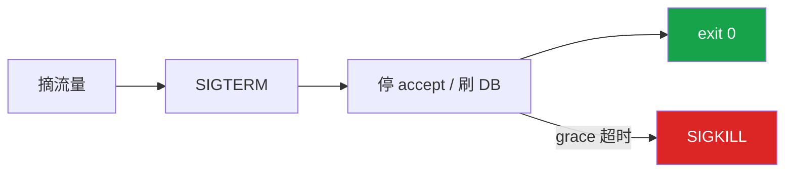
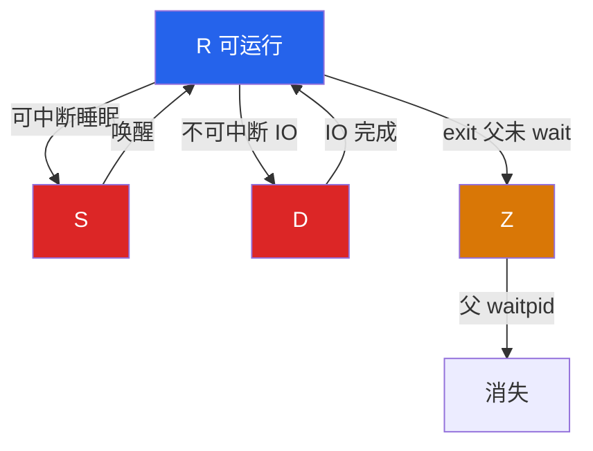
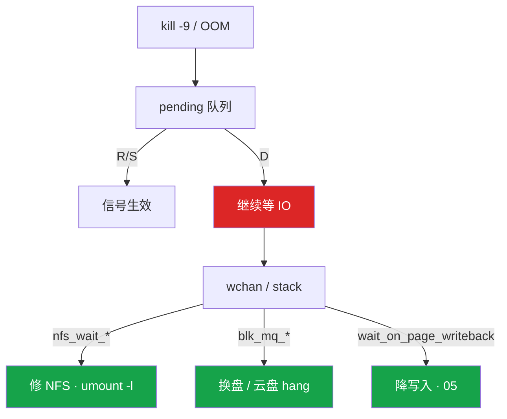
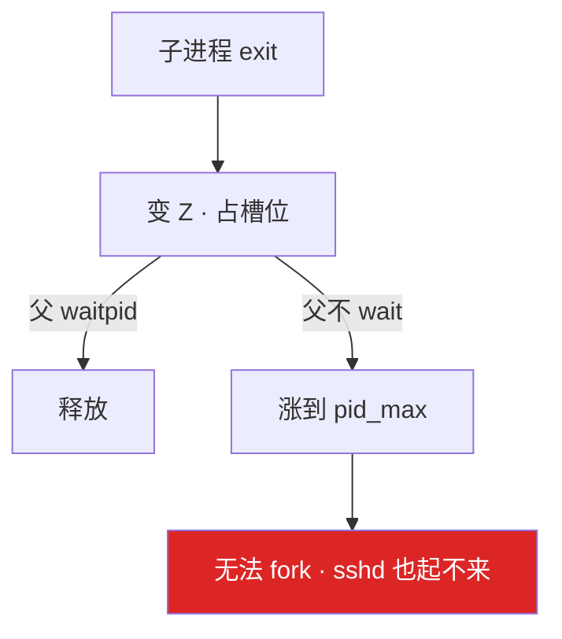
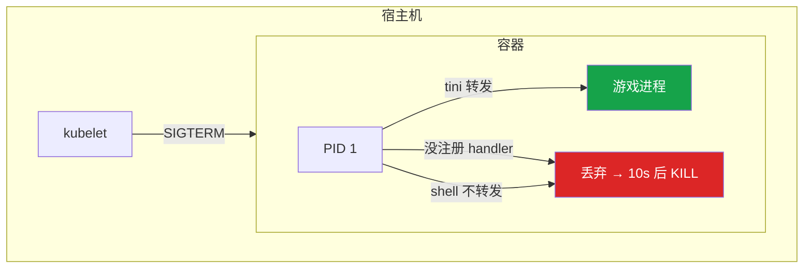
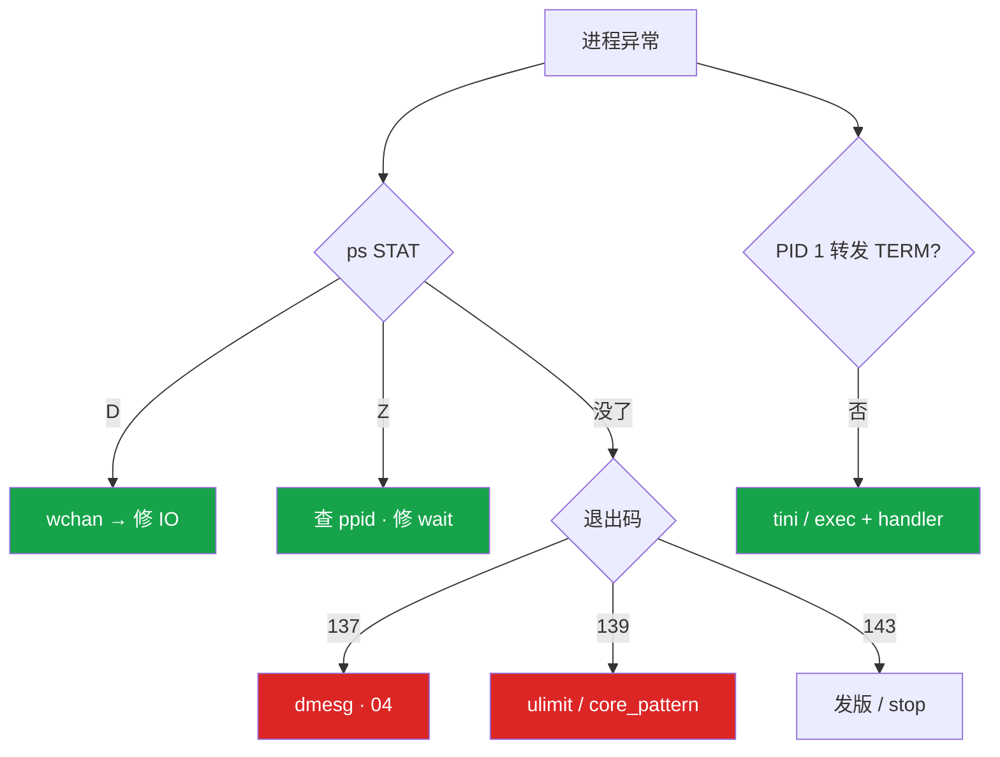

# 进程与信号


大厅卡登录。STAT 列混着 R、S、D、Z，群里有人已经 `kill -9`。这一章只做一件事——**先看状态再动手，TERM 刷盘，KILL 是处决**。

**本章主线（排障就按这三步想）：**

1. **认 STAT**：R/S 才能被信号打死；D 等 IO 杀不掉；Z 找父进程不杀僵尸。
2. **优雅停服**：摘流量 → SIGTERM → 刷盘 → grace 超时才 KILL；容器 PID 1 必须转发 TERM。
3. **留证**：137 对 dmesg / memory.events；139 对 core；fd 泄漏看 `/proc/PID/fd`。

**读完你能：** 先看 STAT 再决定杀还是等；D 指到 wchan 修 IO；写游戏服优雅退出；容器 stop 不再 10 秒强杀；fd 泄漏和 core dump 能留证。

## 本章目录

- [1. 基本概念](#1-基本概念)
- [2. 架构图](#2-架构图)
- [3. 原理](#3-原理)
- [4. 落地](#4-落地)
- [5. 核心配置](#5-核心配置)
- [6. 命令与操作](#6-命令与操作)
- [7. 生产排障](#7-生产排障)
- [8. 必会 · 常考](#8-必会--常考)
- [合上书](#合上书问自己)

**本章不讲：** Load 含 D → [03](../03-CPU与Load/)；OOM 137 细节 → [04](../04-内存与OOM/)；脏页 / await → [05](../05-磁盘与IO/)；CLOSE_WAIT → [06](../06-网络栈与Socket/)、[08](../08-TCP与UDP/)；cgroup fork ENOMEM → [07](../07-cgroup与容器/)；TimeoutStopSec 全文 → [13](../13-Systemd与服务管理/)；syscall `%sy` → [01](../01-内核与系统/)。

---

## 1. 基本概念

Linux 创建进程只有一条路：**fork（或 clone）再 exec**。fork 用 COW：子进程先共用物理页，谁先改谁拆页。贴着 cgroup `memory.max` 再 fork 可能 **ENOMEM**——Java `Runtime.exec`、脚本里拉 `curl` 在 512Mi Pod 里很常见。改 sidecar 或 IPC，不要在逻辑服里 fork 外部命令。线程共享地址空间，这个坑主要是 **fork 子进程**。

| STAT | 人话 | `kill -9` | 进 Load 吗 |
|------|------|-----------|------------|
| **R** | 正在跑或在可运行队列等 CPU | 有效 | 进 |
| **S** | 可中断睡眠：锁、sleep、socket、`epoll_wait` | 有效 | **不进** |
| **D** | 内核等不可中断 IO | **无效** | 进 |
| **Z** | 已 exit，父进程还没 wait | 杀僵尸 PID **没意义** | 不进 |
| **T** | 被 `SIGSTOP` 暂停 | 先 `SIGCONT` | 不进 |

Load = R + D。S 再多也不进 Load。一排 R 且 `%us` 高 → [03](../03-CPU与Load/)。

| 信号 | 编号 | 应用能处理吗 | 典型用途 |
|------|------|:------------:|----------|
| SIGHUP | 1 | 能 | Nginx `reload` |
| SIGTERM | 15 | 能 | `systemctl stop`、K8s 停 Pod **第一枪** |
| SIGKILL | 9 | **不能** | OOM Killer、grace 超时、人手 `kill -9` |
| SIGCHLD | 17 | 能 | 子进程退出；PID 1 必须管 |

退出码（被信号杀死 = **128 + 信号编号**）：

| 码 | 含义 | 下一眼 |
|----|------|--------|
| 137 | SIGKILL | dmesg OOM？人手 -9？kubelet 强杀？ |
| 139 | SIGSEGV | core / hs_err |
| 143 | SIGTERM | 正常停服或 grace 内退出 |
| 1 等 | 自己 `exit` | journal，不是 dmesg |

> **记住**：先看 STAT 再动手；D 等 IO，Z 找父进程；TERM 是请求，KILL 是处决。

---

## 2. 架构图

```mermaid
%%{init: {"flowchart": {"padding": 18, "nodeSpacing": 30, "rankSpacing": 50}, "theme": "base"}}%%
flowchart TB
    subgraph tree ["① 进程树"]
        init[PID 1 systemd / tini]
        logic[逻辑服]
        child["Runtime.exec / curl"]
        init --> logic --> child
    end

    subgraph cow ["② fork · COW"]
        parent[父进程页表] --- pages[同一份物理页] --- childp[子进程页表]
    end

    subgraph sig ["③ 信号递送"]
        src["kill / OOM / systemd"] --> pend[pending 队列]
        pend -->|回用户态 R/S| die[信号生效]
        pend -->|卡在内核态 D| wait[继续等 IO]
    end

    classDef a fill:#2563EB,stroke:#1E3A8A,color:#fff
    classDef b fill:#7C3AED,stroke:#4C1D95,color:#fff
    classDef c fill:#D97706,stroke:#92400E,color:#fff
    class init,logic,child a
    class parent,childp,pages b
    class die c

    style tree fill:#DBEAFE,stroke:#1D4ED8,stroke-width:4px
    style cow fill:#EDE9FE,stroke:#6D28D9,stroke-width:4px
    style sig fill:#FEF3C7,stroke:#D97706,stroke-width:4px
```



**读图三句话：**

1. **COW 不是内存免费**——贴着 limit 再 fork，内核按最坏情况准备，失败 ENOMEM。
2. **信号只在回用户态时递送**——D 回不了，SIGKILL 进 pending。
3. **容器里你可能变成 PID 1**——没注册 handler 的信号被内核丢掉。

停服标准动作：



---

## 3. 原理

### 3.1 状态机：R/S/D/Z/T

**一句话：** Load = R + D；S 不计入；D 杀不掉，Z 杀尸体没用。



| STAT | 要点 |
|------|------|
| **R** | `kill -9` 有效；一排 R + `%us` 高 → 03 |
| **S** | 网关万连接睡 `epoll_wait`，**不进 Load** |
| **D** | 卡盘/NFS/脏页；**kill 无效**；计入 Load |
| **Z** | 已死占 PID 槽；查 **ppid** |
| **T** | `SIGCONT` 继续；生产少见 |

S 等可打断事件；D 等不可中断 IO——拆了破坏一致性。

### 3.2 D 状态：为什么杀不掉

**一句话：** D 卡在内核 IO，信号进 pending；看 wchan 修路径，不要再 kill。



```bash
ps aux | awk '$8 ~ /D/'
cat /proc/<PID>/wchan
cat /proc/<PID>/stack
```

| wchan 字样 | 根因 | 动作 |
|------------|------|------|
| `nfs_wait_*` | NFS 对端死了 | 恢复服务端；`umount -l`；**日志写本地盘** |
| `blk_mq_*` | 块设备不完成 | 云盘 hang、坏盘 |
| `wait_on_page_writeback` | 脏页写不出 | 盘饱和（[05](../05-磁盘与IO/)） |

大量 D 时普通 `reboot` 也可能卡「杀进程」，只能云控制台 **强制重启**。NFS 用 `soft,timeo=100,retrans=2`，超时要失败不要永远 D。

典型 wchan 输出：

```text
# cat /proc/28451/wchan
nfs_wait_bit_uninterruptible
```

`gdb attach` 同样进不了用户态，会一起卡。TERM、STOP、KILL 同一类，都进不了。

### 3.3 僵尸：不占内存，占 PID

**一句话：** Z 已死占进程表槽位；杀僵尸 PID 没意义，查 ppid 修 wait。



```bash
ps -eo pid,ppid,stat,comm | awk '$3 ~ /Z/'
ps -eo ppid,stat | awk '$2 ~ /Z/ {print $1}' | sort | uniq -c | sort -rn
cat /proc/sys/kernel/pid_max    # 常见 32768
```

典型来源：Java `Runtime.exec` 不 `waitFor`；容器 PID 1 不处理 SIGCHLD。处理：修父进程 wait；父已无药才杀父让 init 收尸。

### 3.4 信号：TERM 是请求，KILL 是处决

**一句话：** TERM 请进程自己收尾；KILL 内核直接拆；OOM 发 9，没有优雅退出。

游戏逻辑服收到 TERM 顺序：摘流量 → 停 accept → 踢玩家 → 刷内存态到 DB → `exit 0`。grace 超时 SIGKILL，未刷完 = 回档。**禁止**发布脚本直接 `kill -9`。

| 要点 | 说明 |
|------|------|
| grace 时间 | 游戏服 **30～120s**，≥ 刷盘量；10s 通常不够 |
| 信号合并 | 连发 10 次 TERM 可能只看到 1 次 |
| handler 安全 | 不能乱 `malloc`/`printf`；Go 用 `os/signal` 转 goroutine |
| OOM | 发 SIGKILL，**137 = 128 + 9**，没有 handler 刷盘 |
| Nginx reload | SIGHUP 对 master；旧 worker 处理完再退；D 状态 worker HUP 换不掉 |
| USR2 | 热升级二进制，和 reload 配置不是一回事 |

Nginx `nginx -s reload` 对 **master** 发 SIGHUP。master 重读配置、拉起新 worker；旧 worker 处理完手上的连接再退出——连接还绑在旧 worker 上，所以不断开。长连接 + 慢退 worker 会让内存看起来「reload 后翻倍」，直到旧 worker 退完。配合 `worker_shutdown_timeout`（[23 Nginx](../23-Nginx/)）。

### 3.5 容器 PID 1：为什么吃不到 SIGTERM

**一句话：** 容器内 PID 1 没注册 handler 的信号被内核丢弃 → 等满 grace → SIGKILL。



两层原因常叠加：应用当 PID 1 不 Listen TERM；`CMD python app.py` 经 shell 不转发。做法：`tini`/`dumb-init`/`--init`；或 `CMD ["/app"]` + 代码处理 TERM。PID 1 不处理 SIGCHLD → 僵尸（3.3）。

---

## 4. 落地

| 项 | 选 | 不选 |
|----|----|------|
| 容器 PID 1 | tini / `--init`，或应用处理 TERM | shell 启动不 exec |
| 停服 | TERM → grace → KILL；30～120s | 发布脚本 `kill -9` |
| core | `LimitCORE=infinity` + 可写目录 + 立刻收走 | core 落 NFS |
| 子进程 | sidecar / IPC | 贴着 limit 再 `Runtime.exec` |
| 日志 / 热更 / core | 本地盘 | NFS（一抖全员 D） |

core 路径常见两种：`|/usr/lib/systemd/systemd-coredump`（用 `coredumpctl` 取）或 `/var/crash/core.%e.%p`。容器还要 volume 或在宿主机对 PID 抓；很多镜像默认没有 core。AppArmor / SELinux 没拦住也是清单上的一项。

贴着 cgroup limit 再 `Runtime.exec` 会 ENOMEM，见 [07](../07-cgroup与容器/)——宿主机有空闲也不帮这个 cgroup 超卖。

---

## 5. 核心配置

| 参数 | 生产怎么用 | 改错会怎样 |
|------|------------|------------|
| `TimeoutStopSec` | 有状态游戏服 **30～120s** | 太短 = 每次 stop 都 SIGKILL |
| `terminationGracePeriodSeconds` | 按刷盘量加 | 10s 几乎必强杀 |
| `KillMode=` | 保持 `control-group` | `process` 留孤儿占端口 |
| `LimitCORE` | `infinity` | 139 没有栈 |
| `LimitNOFILE` | 按连接数留余量 | 只加 ulimit 推迟爆炸 |
| Dockerfile CMD | exec 形式或 `exec python` | shell 不转发 TERM |
| `pid_max` | 常见 32768 | 看 Z 数量；调大只推迟 fork failed |

TimeoutStopSec 必须 ≥ 刷盘时间。K8s `terminationGracePeriodSeconds` 默认 **30**；preStop hook 在 TERM 之前跑，可以用来摘发现，但不替代应用处理 TERM。

> **记住**：有状态游戏服禁止 stop 配成直接 `kill -9`；容器入口必须能把 TERM 送到应用。

---

## 6. 命令与操作

### 6.1 命令速查

```bash
ps aux | awk '$8 ~ /D/'                          # D 状态
cat /proc/<PID>/wchan                            # 内核等待点
ps -eo pid,ppid,stat,comm | awk '$3 ~ /Z/'       # 僵尸和 ppid
ls /proc/<PID>/fd | wc -l                        # fd 是否在涨
cat /proc/<PID>/limits | grep 'open files'
strace -c -p <PID>                               # 5～10 秒，看 calls 列
ulimit -c
cat /proc/sys/kernel/core_pattern
```

| 目的 | 命令 | 看什么 |
|------|------|--------|
| D | `ps` STAT + `wchan` | nfs / blk_mq / writeback |
| Z | `ps -eo pid,ppid,stat` | **ppid**，不是僵尸 PID |
| fd 泄漏 | `ls /proc/PID/fd` + limits | 计数涨、逼近 Max |
| core | `ulimit -c` + `core_pattern` | 0 = 禁止 dump |
| 正在发什么调用 | `strace -c` 短窗口 | calls 列；大量 futex 去 01 / 03 |
| 已经打开什么 | `lsof` / `/proc/PID/fd` | 卡死偏 strace，泄漏偏 fd |

生产 strace 规则和第 [01](../01-内核与系统/) 章一样：默认 `-c` 且限时 5～10 秒；**战斗服不要长时间全量跟踪**。跟线程加 `-f`。

### 6.2 停服

1. 服务发现摘流量 → SIGTERM → 停 accept / 刷 DB → `exit 0` → grace 超时才 KILL。
2. 容器：确认 PID 1 转发或应用 Listen TERM。

### 6.3 fd 泄漏

**一句话：** 泄漏看 `/proc/PID/fd` 计数只增不减；ulimit 只是推迟爆炸。

```bash
ls /proc/<PID>/fd | wc -l
ls -l /proc/<PID>/fd | grep socket | wc -l
```

| fd 类型 | 根因方向 |
|---------|----------|
| socket | CLOSE_WAIT 堆积 → [06](../06-网络栈与Socket/) |
| 普通文件 | 日志 / 上传没 `fclose` |

### 6.4 core dump

**139 = 128 + 11（SIGSEGV）**。先让 dump 能落盘：

```bash
ulimit -c                        # 0 = 禁止
cat /proc/sys/kernel/core_pattern
# 常见：|/usr/lib/systemd/systemd-coredump
# 或   /var/crash/core.%e.%p
```

生产要满足：`LimitCORE=infinity` + 目录有空间 + AppArmor 没拦 + 容器 volume。dump 完立刻收走（可到数 GB）。分析：`gdb /path/to/bin core` → `bt`。**Java 看 hs_err，不是 Linux core。**

---

## 7. 生产排障



| 现象 | 先做 | 别做 |
|------|------|------|
| 一排 D，kill -9 还在 | wchan / stack，修 IO | 再杀、加 CPU |
| 几百 Z，sshd fork failed | 查 ppid，修 wait | kill 僵尸 PID |
| docker stop 总等满 10s | PID 1 是否转发 TERM | 只加 grace 到 300s |
| Too many open files | fd 计数 + limits | 只加 ulimit |
| 139 没有 core | ulimit / core_pattern | 先猜代码 |
| Runtime.exec ENOMEM | 是否贴着 memory.max | 看宿主机 free |
| reload 后内存翻倍 | 旧 worker 还在（可能 D） | 当泄漏 dump |
| shareProcessNamespace | 调试用 | 当停服方案 |

**游戏事故复盘：** 活动高峰日志打在 NFS 上，NFS 对端抖了一下，逻辑服一排 D，Load 到 40，CPU idle 70%。有人 `kill -9`，PID 还在。wchan 指向 `nfs_wait_*`——止血是恢复 NFS 或 `umount -l`，长期把日志改本地盘。

**红线：** 有状态游戏服禁止 stop 直接 `kill -9`；日志/core 不落 NFS；strace 默认短窗口 `-c` 5～10 秒。

---

## 8. 必会 · 常考

| 说法 | 对错 | 口径 |
|------|:----:|------|
| D 状态 `kill -9` 能杀 | 错 | 回不了用户态，信号进 pending |
| 换 TERM 就能杀掉 D | 错 | STOP/TERM/KILL 同一类 |
| S 很多所以 Load 一定高 | 错 | Load = R+D，S 不计入 |
| 杀僵尸 PID 能收尸 | 错 | 查 ppid，修 wait 或杀父 |
| 僵尸很占内存 | 错 | 占 PID，不占用户内存 |
| 发布脚本 `kill -9` 逻辑服 | 错 | 不刷盘，玩家回档 |
| OOM 时 handler 还能刷盘 | 错 | OOM 发 SIGKILL |
| 容器默认能收到 docker stop 的 TERM | 错 | PID 1 没 handler 内核丢弃 |
| `CMD python app.py` 没问题 | 错 | 常经 shell，不转发 |
| 连发 10 次 TERM 处理 10 次 | 错 | 标准信号会合并 |
| 只加 ulimit 治 fd 泄漏 | 错 | 推迟爆炸；重启只是止血 |
| 139 去 dmesg 找 OOM | 错 | 139 是 SIGSEGV，先 core |
| 贴着 limit 再 fork curl 没问题 | 错 | COW 预留失败 ENOMEM |
| shareProcessNamespace 当停服方案 | 错 | 调试用 |
| Java 段错误等 Linux core | 错 | 看 `hs_err_pid` |
| handler 里乱 printf | 错 | 不是 async-signal-safe |

数字：`pid_max` 常见 **32768**；grace **30～120s**；137 = 128+9，139 = 128+11，143 = 128+15；strace **5～10 秒** `-c`；NFS `timeo=100,retrans=2`。

易混：S vs D；杀僵尸 vs 杀父；TERM vs KILL；本机 PID vs 容器 PID 1；137 vs 139 vs 143；strace vs fd 列表。

---

## 合上书，问自己

1. 五个 STAT 字母各是什么？Load 包不包含 S？D 为什么 `kill -9` 无效？
2. wchan 三种常见字样分别修什么？大量 D 时普通 reboot 会怎样？
3. 僵尸占的是内存还是 PID？`kill -9` 那个 PID 有用吗？
4. 游戏逻辑服该怎么停？OOM 走哪条？grace 为什么 10 秒不够？
5. 容器里应用收不到 TERM 的两层原因？tini 解决什么？
6. 139 没有 core 先查什么？Java 看哪？fd 泄漏和 strace 怎么分工？

六题能口述，这一章就过了。下一章：[CPU 与 Load](../03-CPU与Load/)——高 Load 低 CPU 为什么先查 D。
