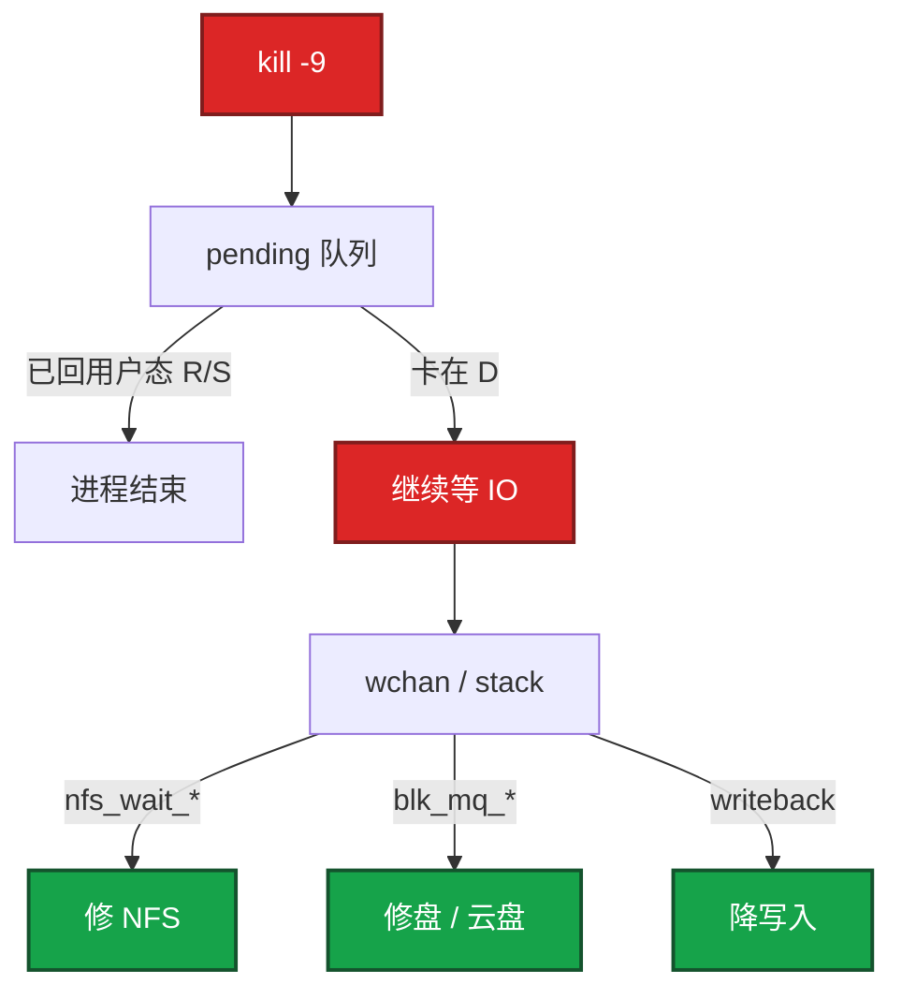
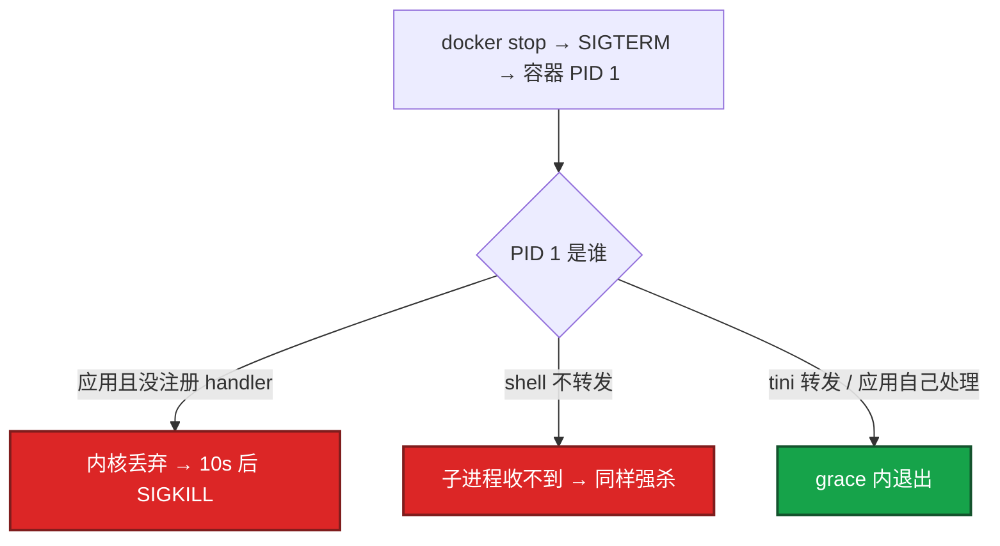

# 02｜进程与信号 · 练习题

先对照 [知识点](知识点.md) **本章主线** 自己口述，再对答案。关键字（R/S/D/Z/T、SIGTERM/SIGKILL、wchan、137/139、fd 泄漏）要能点名。每题标了覆盖范围：

| 标记 | 含义 |
|------|------|
| **核心** | 不懂整章就没建立起来 |
| **必会** | 值班和面试都要能讲 |
| **常用** | 线上会反复碰到 |
| **常考** | 白板和追问的高频口径 |

## 本题目录

- [Q1 D 状态杀不掉](#q1)
- [Q2 僵尸](#q2)
- [Q3 TERM vs KILL](#q3)
- [Q4 容器 PID 1](#q4)
- [Q5 strace 与 futex](#q5)
- [Q6 fd 泄漏](#q6)
- [Q7 S 和 D / Load](#q7)
- [Q8 fork ENOMEM](#q8)
- [Q9 Nginx reload](#q9)
- [Q10 退出码 137 / 139 / 143](#q10)
- [合上书](#合上书)

---

## Q1

**★★★★★｜D 状态的进程为什么 `kill -9` 杀不掉？怎么查、怎么处理？**

**覆盖**：核心 · 必会 · 常考

**对应**：知识点 §3.2

### 场景

一台日志机 load 到 40，CPU idle 70%。`ps` 里十几个进程 STAT 是 D。有人已经对它们 `kill -9`，PID 还在。

### 完整解答

**一句话**：D 状态在内核等不可中断 IO，信号递送不进去，只能修 IO 路径而不是再 kill。

D = 不可中断睡眠：进程在**内核里等 IO**（本地盘、云盘、NFS、刷脏页）。信号只在回到用户态时递送，SIGKILL 同样排队送不进去。所以不是「权限不够」，是递送条件不成立。



```bash
ps aux | awk '$8 ~ /D/'
cat /proc/<PID>/wchan
cat /proc/<PID>/stack
```

处理的是 **IO 路径**，不是再杀一次。`gdb attach` 也会卡。D 很多时普通 reboot 可能卡在杀进程，走带外强制重启。D 计入 load、几乎不占用户态 CPU，所以「load 高先加 CPU」会走错（[03](../03-CPU与Load/)）。

### 再追问

- 能用 kill -9 以外的信号吗？——都不能在回到用户态前生效。STOP/TERM/KILL 同一类。
- 一个 D 会把机器拖死吗？——单个通常只是这个进程卡住。大量 D（NFS 挂了一排 PHP/Java）会把 load 打满、IO 线程耗尽，看起来像整机假死。

---

## Q2

**★★★★★｜僵尸进程怎么来的？`kill -9` 那个 PID 有用吗？危险在哪？**

**覆盖**：核心 · 必会 · 常考

**对应**：知识点 §3.3

### 场景

`ps` 里几百个 Z。`pid_max` 是 32768。sshd 突然登不上，提示 `fork failed`。

### 完整解答

**一句话**：僵尸是已 exit 的子进程占 PID 槽，要对父进程 wait 或杀父，kill 僵尸 PID 无效。

子进程已经 `exit`，内存已经释放，只留进程表里一个槽位等父进程 `waitpid` 收退出码。这就是 Z。

`kill -9` 僵尸 PID **没用**：没有可执行的实体。要对 **父进程** 动手：修代码让它 wait，或杀掉父进程，僵尸被 systemd/init 收养并收尸。

```bash
ps -eo pid,ppid,stat,comm | awk '$3 ~ /Z/'
```

看 ppid 是谁。典型：`Runtime.exec` 不 `waitFor`；shell 循环 fork；容器 PID 1 不处理 SIGCHLD。

危险不是 RSS（几乎为零），是 **PID 号用尽**。耗尽后任何 `fork` 失败，包括 sshd 为登录创建的会话进程。别用 `free` 判断严重程度。

### 再追问

- 僵尸占内存吗？——几乎不占用户内存。占的是进程表。用 Z 的数量和 `pid_max`。
- 杀父进程会不会把业务打死？——会。所以优先修 wait。杀父是「这个父进程已经无药、以恢复 fork 能力为先」的止血。

---

## Q3

**★★★★★｜SIGTERM 和 SIGKILL 区别？游戏逻辑服该怎么停？OOM 走哪条？**

**覆盖**：核心 · 必会 · 常考

**对应**：知识点 §3.4

### 场景

有人把发布脚本写成 `kill -9` 逻辑服 PID。玩家报「刚才的副本进度没了」。K8s 上另一套是 10 秒 grace。

### 完整解答

**一句话**：SIGTERM 是请求优雅退出，SIGKILL 是处决；游戏停服走 TERM→刷盘，OOM 只有 KILL。

| | SIGTERM (15) | SIGKILL (9) |
|--|--------------|-------------|
| 应用能处理吗 | 能 | **不能**，内核直接拆 |
| 谁在用 | systemctl stop、docker stop、K8s 第一枪 | OOM Killer、grace 超时第二枪、人手 -9 |
| 连接 / 刷盘 | 可以做 | 来不及做 |

正确停服：发现摘流量 → SIGTERM → 停 accept / 踢玩家 / 刷盘 → `exit 0`；超过 `TimeoutStopSec` / `terminationGracePeriodSeconds` 才 KILL。

游戏有状态服 grace **10 秒通常不够**，**30～120s** 看刷盘量。unit 里 TimeoutStopSec 必须盖住刷盘。**禁止**把 stop 配成直接 `kill -9`。

OOM Killer 发的是 **SIGKILL**。没有 handler 可跑，不能指望 OOM 时还刷盘。只能靠 limit 余量、探针、降载。退出码 **137 = 128 + 9**。

### 再追问

- 连发 10 次 TERM 会处理 10 次吗？——不一定。标准信号会合并，可能只递送一次。
- handler 里能 `printf` 吗？——不能乱 `malloc` / `printf`（不是 async-signal-safe）。Go 用 `os/signal` 转到普通 goroutine 再做事。

---

## Q4

**★★★★★｜容器里应用收不到 `docker stop` 的 SIGTERM，为什么？**

**覆盖**：核心 · 必会 · 常考

**对应**：知识点 §3.5

### 场景

每次停容器都要等满 10 秒才没。应用日志里从未出现「收到 SIGTERM」。Dockerfile 是 `CMD python app.py`。

### 完整解答

**一句话**：容器里收不到 TERM 通常是 PID 1 没注册 handler 或 shell 没转发，用 exec 或 tini。

两层常见原因，往往叠在一起：



1. **应用是 PID 1，且没有注册 SIGTERM handler**。内核规定：PID 1 没注册的信号直接丢（保护 init）。
2. **PID 1 是 shell，应用是子进程**。`CMD python app.py` 常经 `/bin/sh -c` 启动。该 `CMD ["/usr/bin/python","app.py"]` 或 `exec python`。

解决：`docker run --init` / 镜像里放 tini；应用自己 Listen SIGTERM 并在期限内退出。K8s 同样是 TERM → 等 grace → KILL，只是秒数可配。tini 同时收 SIGCHLD，避免 PID 1 不 wait 出僵尸。

### 再追问

- shareProcessNamespace 能当停服方案吗？——那是调试用。正道是 PID 1 + 应用处理 TERM。
- 为什么本机直接跑二进制就能收到 TERM？——本机 PID 1 是 systemd，你的进程是普通 PID。容器里你变成了「迷你机的 init」。

---

## Q5

**★★★★☆｜strace 在生产怎么用？大量 futex 说明什么？和 lsof 怎么分工？**

**覆盖**：必会 · 常用

**对应**：知识点 §6.3

### 场景

进程 CPU `%sy` 高。有人准备 `strace -p` 挂一下午。

### 完整解答

**一句话**：生产 strace 用 `-c` 短窗口看 syscall 分布；futex 爆炸是锁竞争，不是加核。

生产默认：

```bash
strace -c -p <PID>    # 统计 5～10 秒就停
```

看 **calls 次数和耗时占比**，不要长时间把每个调用的参数打到终端（会把延迟打高，战斗服可能直接超时）。

| 看到什么 | 含义 | 下一步 |
|----------|------|--------|
| futex 极多 | 用户态锁竞争 | 减锁、查全局锁；不是加核（[01](../01-内核与系统/)、[03](../03-CPU与Load/)） |
| write/read 次数爆炸 | 小 IO | 合并日志/缓冲 |
| epoll_wait 极多、业务空 | 空转或连接风暴 | 查超时和连接数 |

跟线程加 `-f`。定位到 syscall 类型后换火焰图/日志，不要把 strace 当常驻监控。

和 lsof / `/proc/PID/fd`：**strace = 正在做什么调用；fd 列表 = 已经打开什么。** 卡死偏 strace，泄漏偏 fd。

### 再追问

- strace 把 P99 打高谁负责？——你。所以默认 `-c` 限时，敏感路径用 perf/eBPF。

---

## Q6

**★★★★☆｜fd 泄漏怎么发现？和 CLOSE_WAIT 什么关系？为什么重启就好？**

**覆盖**：必会 · 常用

**对应**：知识点 §6.3

### 场景

网关报 Too many open files，新玩家连不上，老连接还在。重启后恢复。`ulimit -n` 已经 65535。

### 完整解答

**一句话**：fd 持续涨逼近 Max open files 就是泄漏；socket fd 涨常伴 CLOSE_WAIT，重启只止血。

```bash
ls /proc/<PID>/fd | wc -l
cat /proc/<PID>/limits | grep 'open files'
ls -l /proc/<PID>/fd | grep socket | wc -l
```

计数持续涨、逼近 Max open files，就是泄漏或容量不够。还要区分：

- **socket fd 涨**：连接没 close，常和 `CLOSE_WAIT` 一起出现——对端关了，本地应用没读完/没关（[06](../06-网络栈与Socket/)）。HTTP 客户端不关 Body 是经典。
- **文件 fd 涨**：日志、上传、临时文件没关。

止血：重启（内核回收全部 fd）、临时再提 ulimit。根因仍是泄漏。游戏网关打满的表现就是 **只拒新连接**。

重启就好：进程退出 → 内核关掉它所有 fd。所以重启证明「泄漏在这个进程生命周期里」，不是根因消失。只加 ulimit 把爆的时间从 1 小时推迟到 1 天。

### 再追问

- 只加 ulimit 行不行？——把爆的时间推迟。不修 close，还会再爆。

---

## Q7

**★★★★☆｜S 和 D 本质差在哪？load 包不包含 S？**

**覆盖**：核心 · 必会 · 常考

**对应**：知识点 §3.1

### 场景

有人说「这么多 S，load 肯定高」。大厅网关几万个连接都是 S。

### 完整解答

**一句话**：S 等可中断事件不计入 Load，D 等不可中断 IO 计入；Load = R + D。

S 等的是**允许被打断**的事件：sleep、大部分锁、socket 可读。信号可以叫醒它，所以 `kill` 有效。

D 等的是**不能中途拆掉**的 IO：拆了会破坏块设备或 NFS 协议一致性。所以不可中断，信号无效。

**load = 可运行队列（R）+ 不可中断睡眠（D）。S 不计入。** S 再多，load 也可以接近 0。大厅几千个连接全是 S，Load 可以很低。

### 再追问

- 全是 S 会不会把机器拖慢？——S 本身不占 CPU。若 S 是在等锁，真正干活的可能是持锁的那个 R。要看 `%us` 和锁，不要看 S 的个数吓人。

---

## Q8

**★★★☆☆｜接近 cgroup 内存上限时 fork 为什么失败？**

**覆盖**：常用 · 常考

**对应**：知识点 §7

### 场景

Pod limit 512Mi，Java RSS 480Mi。业务里 `Runtime.exec("curl ...")` 返回 IOException / ENOMEM。宿主机还剩很多内存。

### 完整解答

**一句话**：贴着 cgroup memory.max 时 fork 的 COW 预留失败返回 ENOMEM，与宿主机空闲无关。

fork 虽是 COW，内核仍要为「子进程可能写全部页」做准备，会按规则扣/预留内存。RSS 已经贴着 `memory.max` 时，这次预留失败，返回 **ENOMEM**。宿主机有空闲也不帮这个 cgroup 超卖。进程账和容器限额不是同一本账。

不要在逻辑服里 fork curl。改成 sidecar、本地 HTTP、或把 limit 留出 COW 余量。细节见 [07](../07-cgroup与容器/)。

### 再追问

- clone 线程也会这样吗？——线程共享地址空间，比 fork 整个进程便宜得多。这个坑主要是 **fork 子进程**。

---

## Q9

**★★★☆☆｜`nginx -s reload` 用什么信号？为什么不断现有连接？卡在 D 的 worker 呢？**

**覆盖**：常用 · 常考

**对应**：知识点 §3.4

### 场景

改了 nginx.conf，`nginx -s reload` 后长连接还在。有人问「是不是没生效」。

### 完整解答

**一句话**：nginx reload 对 master 发 SIGHUP，旧 worker 处理完连接再退；D 状态 worker 换不掉。

对 **master** 发 **SIGHUP**。master 重读配置、拉起**新 worker**；**旧 worker** 处理完手上的连接再退出。连接还绑在旧 worker 上，所以不断开。新连接由新 worker 接，配置已经是新的。

卡在 **D** 的旧 worker：HUP 换不掉它（回不了用户态，退不出）。要修 IO，或杀 master（会断连）。长连接 + 慢退的 worker 还会让内存看起来「reload 后翻倍」，直到旧 worker 退完。配合 `worker_shutdown_timeout`（[23](../23-Nginx/)）。

### 再追问

- USR2 呢？——那是热升级二进制，和 reload 配置不是一回事。不要混。

---

## Q10

**★★★★☆｜退出码 137、139、143 怎么读？139 没有 core 怎么办？**

**覆盖**：必会 · 常用 · 常考

**对应**：知识点 §6.4

### 场景

K8s 里 lastState.exitCode 分别出现过这三个数。

### 完整解答

**一句话**：137=128+9 先查 OOM/cgroup，139=128+11 查 core/hs_err，143=128+15 是正常 stop。

约定：**退出码 = 128 + 信号编号**（被信号杀死时）。

| 码 | 信号 | 先查 |
|----|------|------|
| 137 | 9 SIGKILL | dmesg OOM、cgroup `memory.events`、人手 -9、kubelet 强杀（[04](../04-内存与OOM/)） |
| 139 | 11 SIGSEGV | core / Java hs_err |
| 143 | 15 SIGTERM | 正常 stop、发版、驱逐，grace 内退出 |

139 没有 core 的常见原因：`ulimit -c` 为 0；`core_pattern` 指到不存在的目录；容器没挂 volume；SELinux/AppArmor 拦了。先让 dump 能落盘，再 `gdb bt`。Java 看 `hs_err_pid*.log`，不要死等 core。日志、core、热更不要落 NFS。

### 再追问

- exit 1 呢？——那是进程自己 `exit(1)`，不是信号。看 journal 和业务日志，不是 dmesg（[01](../01-内核与系统/)）。

---

## 合上书

- [ ] 五个 STAT 各是什么？Load 包不包含 S？D 为什么 `kill -9` 无效？
- [ ] wchan 三种常见字样（nfs_wait / blk_mq / writeback）分别修什么？
- [ ] 僵尸占的是 PID 不是 RSS；`kill -9` 僵尸 PID 有用吗？
- [ ] 游戏逻辑服怎么停？OOM 走哪条？grace 为什么 10 秒不够？
- [ ] 容器收不到 TERM 的两层原因？tini 解决什么？
- [ ] 139 没有 core 先查什么？fd 泄漏和 strace 怎么分工？
