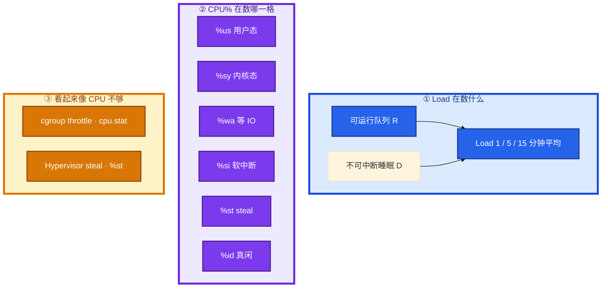
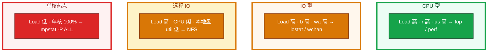
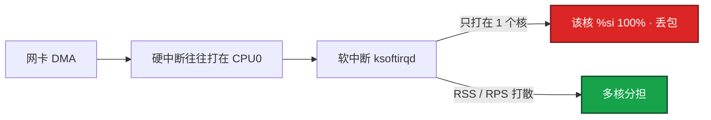
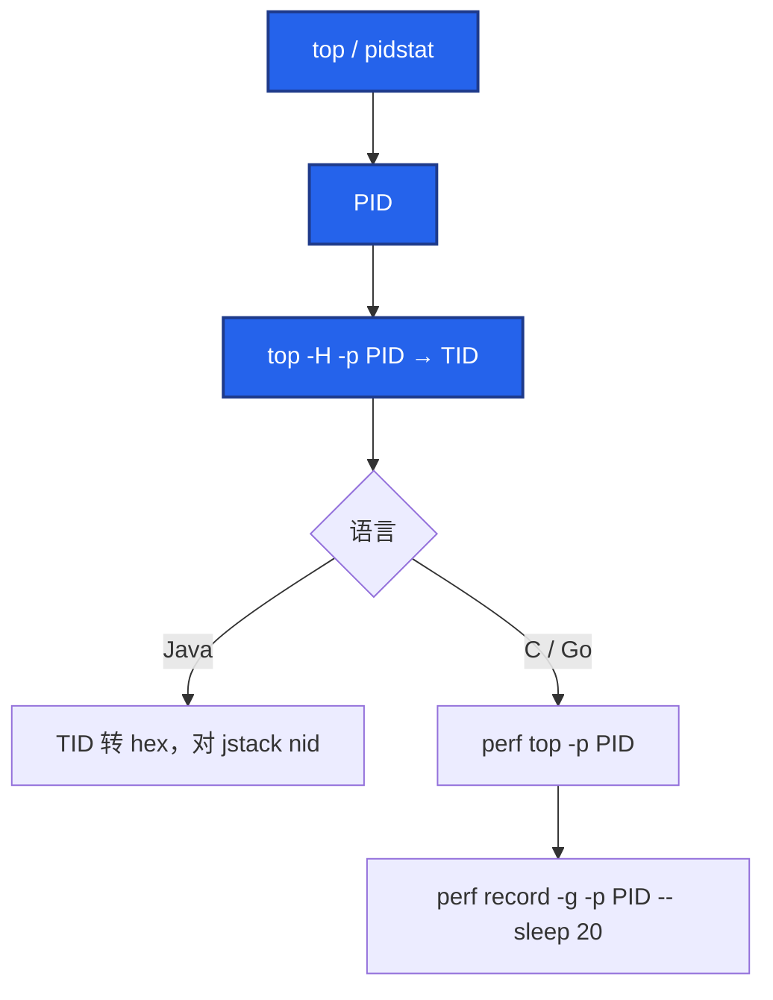
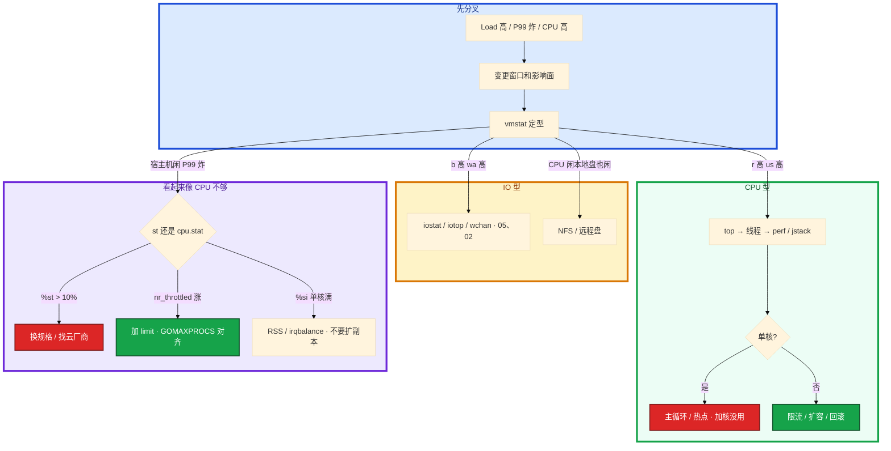

# CPU 与 Load


8 核逻辑服 Load 到 40，`top` 里 idle 70%。工单已经写了「加 8 核」。游戏日志打在 NFS 上。另一台匹配服整机 CPU 40% 但 1 个核打满，Load 只有 1.2。

先别动手。这一章后半全是你会动手的：**怎么用 vmstat 分型、单核热点怎么抓、throttle 和 steal 怎么分开、从 PID 找到函数。** 前面的两把尺，是为了让你动手时不选错路。

**读完你能：** 一口回 Load ≠ CPU%；高 Load 低 CPU 先查 D；单核打满不加核；会读 `cpu.stat` 和 `%st`；CPU 型才 perf/jstack。

## 本章目录

缩进 = 上下级。3 下面才是 3.1。

想钉在**正文左边**跟着滚：菜单 **查看 → 打开视图 → 大纲**。Markdown 预览做不到独立左栏，目录只能写在文章开头。

- [1. 基本概念](#1-基本概念)
- [2. 架构图](#2-架构图)
- [3. 原理](#3-原理)
  - [3.1 利用率格子](#31-利用率格子)
  - [3.2 四种组合](#32-四种组合先分型)
  - [3.3 上下文切换](#33-上下文切换)
  - [3.4 软中断](#34-软中断)
  - [3.5 steal 与 throttle](#35-steal-与-throttle)
- [4. 落地](#4-落地)
- [5. 核心配置](#5-核心配置)
- [6. 常用命令](#6-常用命令)
- [7. 常用操作](#7-常用操作)
  - [7.1 从 CPU 高定位到函数](#71-从-cpu-高定位到函数)
  - [7.2 NUMA](#72-numa)
- [8. 生产排障](#8-生产排障)
- [9. 必会 · 常考](#9-必会--常考)
- [合上书](#合上书问自己)

**本章不讲：** D 为什么 `kill -9` 无效 → [02 进程与信号](../02-进程与信号/)；await、脏页、iostat 细读 → [05 磁盘与 IO](../05-磁盘与IO/)；OOM、si/so 换页 → [04 内存与 OOM](../04-内存与OOM/)；syscall `%sy` 短窗口证明 → [01 内核与系统](../01-内核与系统/)；cgroup 文件、v1/v2、pids → [07 cgroup 与容器](../07-cgroup与容器/)；K8s request/limit YAML、QoS → [04-Pod](../../04-Kubernetes/04-Pod生命周期/)；火焰图怎么采、30 秒全景 → [12 性能观测与排障](../12-性能观测与排障/)。

---

## 1. 基本概念

Load 不是 CPU%。

Load 是过去 1 / 5 / 15 分钟里，**可运行队列（R）+ 不可中断睡眠（D）** 的平均个数。核在干活、卡在盘上、卡在 NFS，都会把这个数抬起来。CPU% 是另一把尺：这一秒里核把时间花在哪一格。

读数时记住两句：

1. **Load 对比核数**，不要和「Load=1 就告警」死磕。8 核机器 Load≈8 是刚好每人一个核的忙碌感；Load=30 才是大量在排队或卡 IO。64 核上 Load=1 等于几乎没人排队。
2. **趋势看 1m 对 15m**：`1m >> 15m` 正在恶化，优先止血；反过来在恢复，避免重复扩容。

N 核满载大约 Load ≈ N；持续 **> 2N** 开始排队伤延迟。游戏逻辑服对 P99 敏感，这个阈值要当故障，不是「还可以再扛」。

CPU 格子（细拆在 3.1）：

| 格子 | 核在干什么 |
|------|------------|
| `%us` | 用户态算业务 |
| `%sy` | 内核态（syscall / 锁） |
| `%wa` | 有空闲核且在等 IO |
| `%si` | 软中断（常见网卡收包） |
| `%st` | 云主机被宿主机抢走的时间 |
| `%id` | 真闲着 |

`%wa` 是 CPU 视角：有 idle 且在等 IO。CPU 已经被算力打满时，没有 idle 可记到 wa，**盘再慢 wa 也可能是 0**。磁盘慢必须以 iostat/await 为准（[05](../05-磁盘与IO/)）。`%wa`、iostat 的 await、`%util` 三件东西不是同一个数：wa 是 CPU 空闲在等 IO 的比例；await 是一笔 IO 从提交到完成；util 是盘忙时间占比。SSD 不要用 util 结案。

> **记住**：Load 在数排队和卡 IO 的人，CPU% 在数核把时间花在哪；两把尺对不上时，先别加核。

---

## 2. 架构图

先把两把尺和图上的分叉钉住。后面分型、命令、排障都对着这张图说话。



四种生产组合（装的时候选工具，挂的时候故障域不一样）：



---

## 3. 原理

原理只保留动手和面试会用到的：格子、分型、cs、软中断、steal/throttle。

**本节 5 块：** 3.1 格子 · 3.2 分型 · 3.3 cs · 3.4 si · 3.5 st/throttle

### 3.1 利用率格子

你登上机器，先不要 `perf`。打开 `top` 或 `mpstat`，看这一秒时间切进了哪一格。生产动作跟着格子走，不要看到「CPU 高」就加核。

```bash
uptime                           # 1/5/15 分钟 Load
vmstat 1 5                       # r / b / cs / us sy id wa st；丢掉第一行（开机平均）
mpstat -P ALL 1 3                # 是否单核热点，不要只看整机平均
top -H -p <PID>                  # 找线程
```

`vmstat` 第一行是开机平均，**丢掉**，看后面几行。读数阈值：

- `r` 持续 > 核数 = CPU 在排队
- `b` 持续 > 0 = D 在堆积
- `cs` 持续几十万/s 且延迟涨 = 线程过多或锁竞争
- `si/so` 非 0 = 在换页，先当内存问题（[04](../04-内存与OOM/)）

| 字段 | 核在干什么 | 生产动作 |
|------|------------|----------|
| `%us` | 用户态算业务 | 找业务进程、GC、加密、正则 |
| `%sy` | 内核态办事 | `strace -c` / 减 syscall（[01](../01-内核与系统/)） |
| `%wa` | 有空闲 CPU 且在等 IO | 进 05；CPU 已经 100% 时 wa 会被挤成 0 |
| `%si` | 软中断（常见网卡收包） | RSS 多队列、查 `ksoftirqd` |
| `%st` | steal，Hypervisor 抢走 | 换规格或申诉超卖 |
| `%id` | 真闲着 | 和 Load 对照，别单独看 |

`in`（中断）突增配合 `%si`，去查网卡中断，不是去查业务函数。

> **记住**：先认格子：us 找函数，sy 找 syscall，wa/b 去磁盘，si 去网卡，st 找云厂商。wa 低不能证明盘快。

### 3.2 四种组合：先分型

不要一上来 `perf`。先用 Load、`r`/`b`、整机% 和单核% 对上号。卡错型，后面全是浪费。

| 组合 | 判断 | 先不要做什么 |
|------|------|----------------|
| Load 高，r 高，us 高 | CPU 算力不够或热点线程 | 不要在没确认前扩一圈 |
| Load 高，b 高，wa 高 | IO | 不要加 CPU |
| Load 高，CPU 闲，本地盘 util 低 | NFS / 远程盘，iostat 看不见 | 不要只看本地盘 |
| Load 低，单核 100% | 热点线程 / 主循环 | 不要水平加核当根因 |
| CPU 高 Load 不高 | 纯计算，核还没排满或很短突发 | 不要先当整机过载 |

第一种：活动后整机 `%us` 80%，`r` 持续大于核数。这才是算力或热点，后面 7.1 从 PID 找到函数。

第二种：Load 40、idle 70%、`b>0`。D 在堆积。游戏日志打到 NFS 挂死时，逻辑服全员 D，Load 上 50，CPU 5%。止血是修 NFS 或把日志改本地盘，**不是加核**。D 状态 `kill -9` 无效，见 [02](../02-进程与信号/)。

第三种：Load 高、本地盘 `iostat` 很干净。IO 在 NFS / 云盘对端，本机 `%util` 看不见。看 `wchan`（02）。wa 高但本地 NVMe await 很好，也是这条。

第四种：匹配服整机 CPU 40% 但 **1 个核打满**，Load 只有 1.2，匹配超时。游戏逻辑服经常是单线程/主循环。扩成 8 核没用。必须 `mpstat -P ALL` 或 `top` 按 `1` 展开，不要只看整机平均。

> **记住**：先分型：高 Load 低 CPU 查 D；单核打满查主循环；确认是 CPU 型再 perf。

### 3.3 上下文切换

网关 P99 涨，`vmstat` 里 `cs` 持续几十万/s。不是「再加几核就好」，是线程在互相抢。

一次上下文切换要把寄存器和页表权限换掉。物理机每秒数万次常见；**持续 > 10 万/s 且延迟涨**，要查线程数和锁。

```bash
vmstat 1                   # cs、in
pidstat -w 1               # cswch 自愿 / nvcswch 非自愿
```

- **自愿切换（cswch）**：自己让出 CPU，等 IO 或锁。正常，但过高说明锁碎或 syscall 碎。
- **非自愿切换（nvcswch）**：时间片被抢。CPU 不够，或线程太多在抢。

游戏网关「一个连接一线程」会把 cs 打爆。应用侧用 epoll / 协程模型，线程池按核数收敛，不要「有请求就 new Thread」。线程过多时加核只是推迟。

> **记住**：cs 高先分自愿还是非自愿；网关不要一连接一线程。

### 3.4 软中断：网卡把一个核打满

网关丢包、RTT 抖。`mpstat -P ALL` 看到 CPU0 的 `%si` 100%，别的核很闲。业务 `%us` 并不高。有人已经在扩网关副本。

硬中断只负责「有包了」，真正拆包走协议栈是软中断，常落在 `ksoftirqd`。网卡中断集中在 1 个核 → 该核 `%si` 100%，丢包、RTT 抖。业务 `%us` 高和 `ksoftirqd` 占满要分开治。



```bash
mpstat -P ALL 1
cat /proc/interrupts          # 网卡 IRQ 是不是全在 CPU0
```

处理：开 RSS 多队列，或 RPS 把软中断分到其他核。业务扩容解决不了单核 `si`——包还是进同一块网卡的同一条队列。云主机常已开多队列，仍要确认业务进程没和 `ksoftirqd/0` 叠在同一核。`irqbalance` 负责把 IRQ 摊开，关掉它又把网卡钉回 CPU0 是常见回潮。

绑核（少用，但会追问）：`taskset` / systemd `CPUAffinity=` 把逻辑主循环钉在**非 0 核**，避免和网卡软中断抢 CPU0。`nice` 只调 CFS 权重，救不了已经打满的核。实时调度 `SCHED_FIFO` 生产几乎不用，用错会饿死内核线程。

> **记住**：单核 %si 打满先看中断是否全在 CPU0；扩业务副本解决不了。

### 3.5 steal 与 throttle

活动开启，网关 `%us` 不高但 P99 从 30ms → 400ms。宿主机空闲 70%。两种完全不同的「看起来像 CPU 不够」，先分清是哪一种。

**steal（`%st`）** 是 Hypervisor 把你的 vCPU 时间给了别人。自己优化代码解决不了。持续 **> 10%** 且业务延迟涨：换规格、换独占、或找云厂商迁宿主机。看 `mpstat` 的 `st`。K8s 里 st 高不是 throttle。

**cgroup throttle** 是另一条路。CFS 周期默认 **100ms**，`cpu.max` 例如 `200000 100000` = 2 核。配额用完踢出运行队列，**宿主机 `%id` 可以很高**。请求的 wall time 里含着「被踢出去等下一周期」的时间，所以 P99 爆炸。100m CPU（quota 10ms / 100ms 周期）也能跑通、高峰全超时——突发 20ms 的请求必被切开。

```bash
# cgroup v2
cat /sys/fs/cgroup/.../cpu.stat
# 看 nr_throttled / nr_periods；> 5% 且延迟涨就要当故障
# nr_throttled 是累计值，看增量；Prometheus 用 rate(...)
```

Go 默认 `GOMAXPROCS = nproc`（宿主机核数）。limit=1 核、宿主机 16 核 → 大量线程抢配额 → P99 从几十毫秒跳到数百毫秒。修复：`automaxprocs` 或把 `GOMAXPROCS` 对齐 limit。Java 同理看 GC 线程数、`-XX:ActiveProcessorCount`。`nproc` 在容器里返回宿主机核数，和 [01](../01-内核与系统/) 里 `free` 撒谎是同一类：cgroup 限额 ≠ `/proc` 整机视图。

不设 limit 可避免 throttle，但要靠 request + HPA 防止吵邻居。核心延迟敏感服（逻辑、匹配）倾向 request 保底、limit 放宽或不上。YAML 怎么写见 K8s 04；本章只要求你会读 `cpu.stat`。request 不是硬顶。

`%st` 和 throttle 怎么分：一个看 `mpstat` 的 `st`，一个看 cgroup `cpu.stat`。文件怎么找见 [07](../07-cgroup与容器/)。

> **记住**：st 是超卖，找云厂商；throttle 看 cpu.stat 增量，宿主机可以很闲；GOMAXPROCS 对齐 limit。

---

## 4. 落地

生产怎么放 CPU 配额和中断，比调 CFS 源码要紧。

| 项 | 选 | 不选 |
|----|----|------|
| 告警 | Load 对比核数；1m vs 15m 趋势 | Load > 1 绝对阈值（64 核会一直响） |
| 逻辑 / 匹配服 | request 保底；limit 放宽或不上；GOMAXPROCS 对齐 | 500m limit + GOMAXPROCS=16 |
| 网关 | RSS 多队列；irqbalance 开着 | 只扩副本治单核 %si |
| 绑核 | 先确认 NUMA 拓扑；主循环避开 CPU0 | 单 node 云主机全机硬绑 |
| 采样 | CPU 型才 perf，10–30s | wa 高时 `perf record` 30 分钟 |

历史：「昨天凌晨」类工单用 `sar -u -f /var/log/sa/saDD`，不要只盯当前这一屏。sysstat 没装就没有昨天。

---

## 5. 核心配置

只动有证据的项。改 GOMAXPROCS / limit 比改 nice 有效。

| 参数 | 默认 | 生产怎么用 | 改错会怎样 |
|------|------|------------|------------|
| `GOMAXPROCS` | `nproc`（宿主机核数） | **对齐 cgroup limit** | 16 线程抢 0.5 核，P99 爆炸 |
| `-XX:ActiveProcessorCount` | 常跟 nproc | 对齐 limit | GC 线程过多，同 throttle |
| `cpu.max` / K8s limit | 无则不 throttle | 延迟敏感服慎用过小 limit | 100m 能跑通、高峰全超时 |
| irqbalance | 发行版常开 | 保持开 | 关掉 IRQ 堆回 CPU0 |
| `CPUAffinity=` | 无 | 主循环钉非 0 核，少用 | 和 ksoftirqd/0 叠在一起 |
| nice | 0 | 几乎不用来救命 | 救不了已经打满的核 |
| `SCHED_FIFO` | 不用 | 生产几乎不用 | 饿死内核线程 |

> **记住**：容器里 nproc / free 都可能撒谎。并发度对齐的是 cgroup，不是宿主机核数。

---

## 6. 常用命令

值班先跑这几条，不要一上来 perf：

```bash
uptime
vmstat 1 5                    # 丢掉第一行
mpstat -P ALL 1 3
pidstat -w 1
cat /sys/fs/cgroup/.../cpu.stat
numactl --hardware
```

| 目的 | 命令 | 看什么 |
|------|------|--------|
| Load 趋势 | `uptime` | 1m vs 15m，对比核数 |
| 分型 | `vmstat 1 5` | r / b / cs / us sy wa st；第一行丢掉 |
| 单核热点 | `mpstat -P ALL` | 哪颗核 100%，%si 是否堆 CPU0 |
| 切换 | `pidstat -w 1` | cswch 自愿 / nvcswch 非自愿 |
| throttle | `cpu.stat` | nr_throttled / nr_periods **增量** |
| 中断 | `/proc/interrupts` | 网卡 IRQ 是否全在 CPU0 |
| 函数 | `top -H` → `perf` / jstack | CPU 型才走 |
| 历史 | `sar -u -f /var/log/sa/saDD` | 昨天凌晨 |

`pidstat -u 1` 看谁在烧 CPU。Java：`printf '%x' <TID>` 对 jstack 的 nid。

---

## 7. 常用操作

### 7.1 从 CPU 高定位到函数

已经确定是 **CPU 型**（`r` 高、`us`/`sy` 高、不是 wa/b）才走这条链。IO 型先去 [05](../05-磁盘与IO/)，throttle 先读 `cpu.stat`，不要在 wa 高时做 perf。



多线程均匀高：流量或缺少限流。单线程 100%：死循环、正则回溯、主循环。先 `mpstat -P ALL` 排除单核热点。

火焰图：已经确定是 CPU 型、需要函数占比时上。采样 **10–30s** 足够。IO 型、throttle、丢包先不要 perf，会浪费时间还可能加重负载。多数环境要 root 和内核符号；容器里还要注意是否关掉 `perf_event`。没有 perf 至少能给到 TID + 栈。Java 至少 jstack；Go 至少 pprof。

止血：限流、摘实例、扩容、回滚热点发布。根因要函数级，不要停在「CPU 高」。

> **记住**：CPU 型才 perf/jstack；先 PID 再 TID 再函数；IO 型和 throttle 不要上来采样。

### 7.2 NUMA

延迟毛刺，有人一上来全机绑核。先问：这台机器有几个 NUMA node？

内存跨 node 访问延迟更高。云上多数小规格是单 NUMA，绑了也没收益。

```bash
numactl --hardware           # 几个 node
numastat -p <PID>            # 进程是不是大量 remote
```

多 node 且 `numastat` 大量 remote，再把 MySQL / Redis / 战斗服绑在一个 node 上（`numactl --cpunodebind=0 --membind=0`）。这是延迟优化，不是默认操作。答「先确认拓扑再绑」即可。绑错 node：内存还在另一边，remote 访问更多，毛刺更差。

> **记住**：NUMA 先看拓扑；单 node 云主机不要硬绑。

---

## 8. 生产排障

和 01 同一套三问：进程还在不在？还能不能变更？已有流量还通不通？CPU 这一章先分型，再动手。



一个完整的游戏事故：活动开启，网关 `%us` 不高但 P99 从 30ms → 400ms。`cpu.stat` 里 `nr_throttled` 狂涨，limit=500m，`GOMAXPROCS=16`。宿主机空闲 70%。调 limit 到 2 核并固定 `GOMAXPROCS=2` 后 P99 回落。这不是「机器不够」，是 **配额和并发度不匹配**。

另一类：匹配服单核 100%，Load 只有 1.2。扩成 8 核没用，要拆热点或把主循环并行化。

| 决策 | 依据 |
|------|------|
| 加核 | r>核数且函数确认是业务计算 |
| 加实例 | 无状态、可水平拆 |
| 不调 CPU | b/wa 高，去 05 |
| 调 cgroup / GOMAXPROCS | throttle 或单核打满 |
| 换机型 | %st 持续 > 10% |

现场顺序：影响面 → `uptime` / `vmstat` → 分型 → 对应工具。wa 高时做 perf 会浪费时间还可能加重负载。

| 现象 | 先做什么 | 不要做什么 |
|------|----------|------------|
| Load 40、idle 70% | vmstat 看 b；D / NFS | 加 8 核 |
| 整机 40%、一核 100% | mpstat -P ALL | 水平加核 |
| 宿主机闲、P99 400ms | cpu.stat 增量；GOMAXPROCS | 先调 JVM 当 steal |
| %st 持续 15% | 换规格 / 迁宿主机 | 优化代码 |
| CPU0 %si 100%、丢包 | interrupts / RSS | 扩网关副本 |
| cs 30 万/s | pidstat -w，收敛线程 | 先加核 |
| wa 40%、本地盘闲 | wchan / NFS | 只看 iostat %util |
| Load>1 告警在 64 核响 | 改阈值对比核数 | 当真过载 |

---

## 9. 必会 · 常考

白板和追问高频，能一口回：

| 说法 | 对错 | 口径 |
|------|:----:|------|
| Load 很高就是 CPU 不够 | 错 | Load = R+D，先分型 |
| Load=1 在 64 核上算高 | 错 | 对比核数；≈N 满载感，>2N 伤延迟 |
| 高 Load 低 CPU 先加核 | 错 | 先查 D / NFS |
| wa 为 0 说明盘快 | 错 | CPU 打满时 wa 可被挤成 0；听 await |
| 整机 40% 就不会超时 | 错 | 单核 100% 照样炸 P99 |
| 容器 CPU 没用满就不会 throttle | 错 | 配额用完踢出队列，%us 不必打满 |
| st 高是 cgroup throttle | 错 | st 是虚机层；throttle 看 cpu.stat |
| 自己优化代码能治 %st | 错 | 换规格 / 找云厂商 |
| 扩网关副本能治单核 %si | 错 | 包还进同一条队列 |
| GOMAXPROCS 默认跟宿主机核数没问题 | 错 | 必须对齐 limit |
| 只设 request 不设 limit 一定错 | 错 | 能避免 throttle，要防吵邻居 |
| cs 高一定要加核 | 错 | 先收敛线程模型 |
| 一上来 perf 30 分钟 | 错 | CPU 型才采，10–30s；wa 高不要采 |
| 云主机默认绑 NUMA | 错 | 先看拓扑；单 node 没收益 |
| vmstat 第一行就能用 | 错 | 开机平均，丢掉 |

数字：满载 Load ≈ **N**，持续 **> 2N** 伤延迟；cs **> 10 万/s** 且延迟涨要查；`%st` **> 10%** 换机；throttle **nr_throttled/nr_periods > 5%** 当故障；CFS 周期 **100ms**；火焰图 **10–30s**；Load 告警对比核数不是绝对值 1。

易混：Load vs util；%wa vs await vs %util；%sy vs %si；%st vs throttle；自愿 vs 非自愿切换；整机平均 vs 单核；request vs limit；R+D vs S。

---

## 合上书，问自己

1. Load 在数什么？对比谁？1m >> 15m 说明什么？
2. vmstat 的 r/b/cs/wa/st 看到什么要动手？第一行为什么丢掉？
3. 四种组合怎么分？高 Load 低 CPU 为什么不加核？
4. `%st` 和 throttle 怎么分？GOMAXPROCS 为什么要对齐 limit？
5. 从 CPU 高怎么走到函数？什么时候不上火焰图？
6. 单核 %si 打满扩副本有用吗？NUMA 什么时候绑？

六题都能口述，这一章就过了。下一章把内存账剖开：看 available 不看 free，137 先对 dmesg 和 memory.events。
