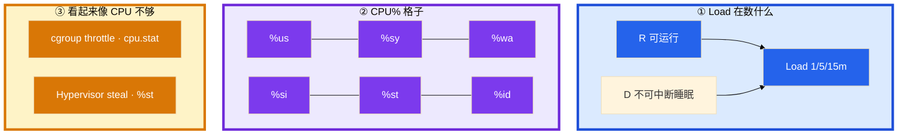
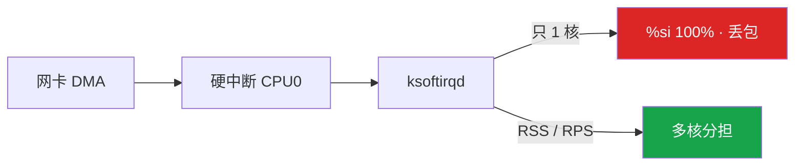
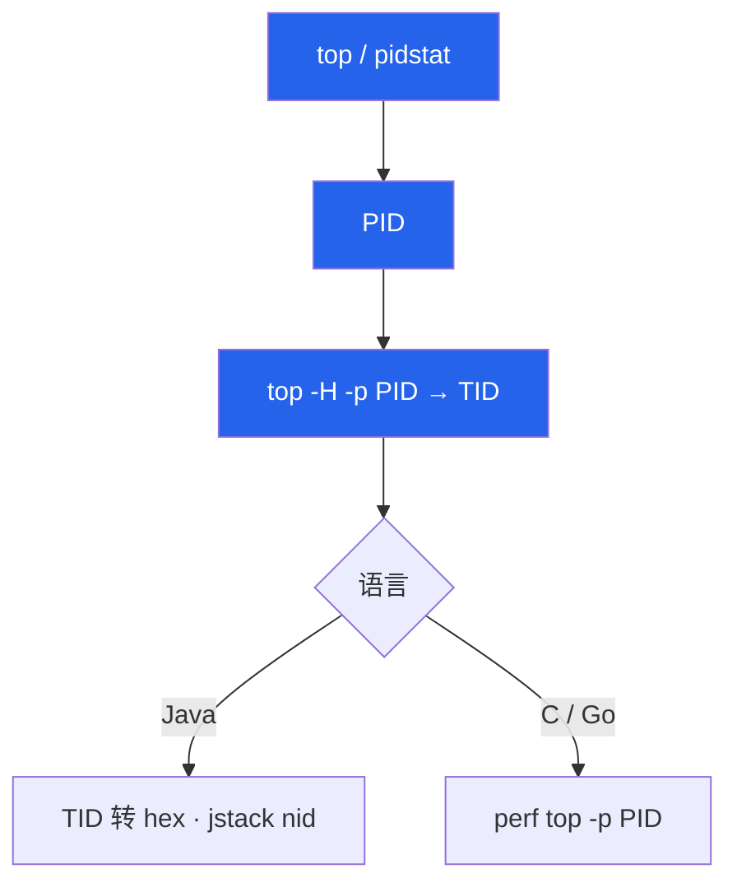
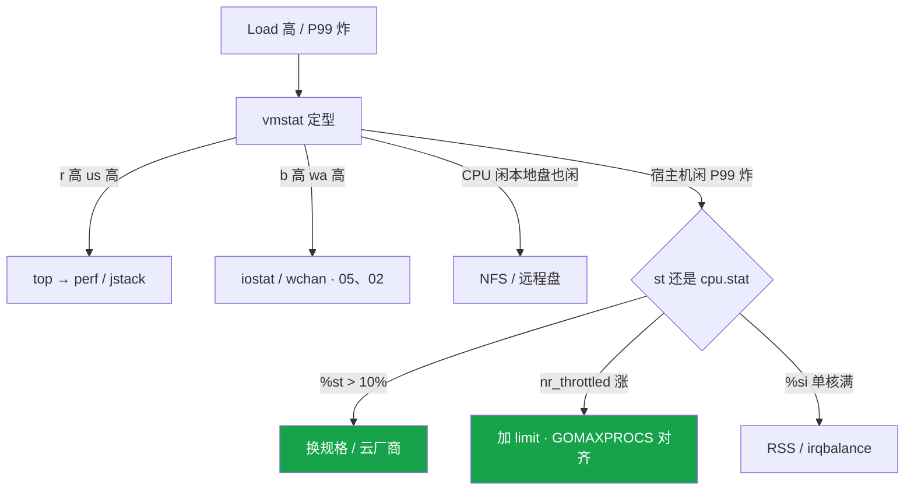

# CPU 与 Load


8 核 Load 到 40，`top` idle 70%，工单写「加 8 核」。匹配服整机 CPU 40% 但 1 核打满。这一章只做一件事——**Load 和 CPU% 是两把尺，先分型再动手**。

**本章主线（排障就按这三步想）：**

1. **认格子**：`%us` 找函数，`%sy` 找 syscall，`%wa`/`b` 去磁盘，`%si` 去网卡，`%st` 找云厂商。
2. **先分型**：高 Load 低 CPU → 查 D/NFS；单核 100% → 不加核；CPU 型才 perf/jstack。
3. **分假象**：throttle 看 `cpu.stat`；steal 看 `%st`；GOMAXPROCS 对齐 limit。

**读完你能：** 一口回 Load ≠ CPU%；高 Load 低 CPU 先查 D；单核打满不加核；会读 `cpu.stat` 和 `%st`；CPU 型才 perf/jstack。

## 本章目录

- [1. 基本概念](#1-基本概念)
- [2. 架构图](#2-架构图)
- [3. 原理](#3-原理)
- [4. 落地](#4-落地)
- [5. 核心配置](#5-核心配置)
- [6. 命令与操作](#6-命令与操作)
- [7. 生产排障](#7-生产排障)
- [8. 必会 · 常考](#8-必会--常考)
- [合上书](#合上书问自己)

**本章不讲：** D 为什么杀不掉 → [02](../02-进程与信号/)；await、脏页 → [05](../05-磁盘与IO/)；OOM、si/so 换页 → [04](../04-内存与OOM/)；syscall `%sy` → [01](../01-内核与系统/)；cgroup 文件 → [07](../07-cgroup与容器/)；K8s request/limit YAML → [04-Pod](../../04-Kubernetes/04-Pod生命周期/)；火焰图 → [12](../12-性能观测与排障/)。

---

## 1. 基本概念

Load = 过去 1/5/15 分钟 **可运行队列（R）+ 不可中断睡眠（D）** 的平均个数。CPU% 是另一把尺：这一秒核把时间花在哪一格。

| 要点 | 说明 |
|------|------|
| Load 对比核数 | 8 核 Load≈8 是忙碌感；Load=30 才是排队；64 核 Load=1 几乎没人排队 |
| 趋势 | `1m >> 15m` 正在恶化；`1m << 15m` 在恢复 |
| 阈值 | N 核满载 Load≈N；持续 **> 2N** 伤 P99 |

| 格子 | 核在干什么 |
|------|------------|
| `%us` | 用户态算业务 |
| `%sy` | 内核态（syscall / 锁） |
| `%wa` | 有空闲核且在等 IO |
| `%si` | 软中断（常见网卡收包） |
| `%st` | 云主机被宿主机抢走 |
| `%id` | 真闲着 |

`%wa` 是 CPU 视角——CPU 打满时没有 idle 可记 wa，**盘慢 wa 也可能是 0**。磁盘慢以 iostat/await 为准（[05](../05-磁盘与IO/)）。

> **记住**：Load 数排队和卡 IO 的人，CPU% 数核花在哪；对不上时先别加核。

---

## 2. 架构图



四种生产组合：


**读图三句话：**

1. Load 含 D——卡 IO 也抬 Load，不等于 CPU 不够。
2. `%st` 和 throttle 是两条路——一个看 mpstat，一个看 `cpu.stat`。
3. 单核热点整机平均会骗人——必须 `mpstat -P ALL`。

---

## 3. 原理

### 3.1 利用率格子

**一句话：** 先认格子再选工具——us 找函数，sy 找 syscall，wa/b 去磁盘，si 去网卡，st 找云厂商。

```bash
uptime                           # 1/5/15 分钟 Load
vmstat 1 5                       # r/b/cs/us sy id wa st；丢掉第一行
mpstat -P ALL 1 3                # 单核热点
top -H -p <PID>                  # 找线程
```

| 字段 | 阈值 / 动作 |
|------|-------------|
| `r` 持续 > 核数 | CPU 在排队 |
| `b` 持续 > 0 | D 在堆积 |
| `cs` 持续 > 10 万/s 且延迟涨 | 线程过多或锁竞争 |
| `si/so` 非 0 | 换页 → [04](../04-内存与OOM/) |

`in` 突增配合 `%si` → 查网卡中断，不是业务函数。

典型 vmstat 输出（IO 型，丢掉第一行）：

```text
procs -----------memory---------- ---swap-- -----io---- -system-- ------cpu-----
 r  b   swpd   free   buff  cache   si   so    bi    bo   in   cs us sy id wa st
 2 18      0 8123456 123456 9876543  0    0   120  8900 4500 12000  5  2 70 18  0
```

`b=18` 持续 > 0 → D 在堆积，去查 wchan（[02](../02-进程与信号/)），不是加核。

### 3.2 四种组合：先分型

**一句话：** 不要一上来 perf；卡错型后面全是浪费。

| 组合 | 判断 | 先不要做什么 |
|------|------|--------------|
| Load 高，r 高，us 高 | CPU 算力不够或热点 | 没确认前扩一圈 |
| Load 高，b 高，wa 高 | IO | 不要加 CPU |
| Load 高，CPU 闲，本地 util 低 | NFS / 远程盘 | 不要只看本地盘 |
| Load 低，单核 100% | 热点线程 / 主循环 | 不要水平加核 |

第二种：Load 40、idle 70%、`b>0` → 修 NFS 或日志改本地盘，**不是加核**。D 状态 `kill -9` 无效 → [02](../02-进程与信号/)。

第四种：匹配服 1 核 100%、Load 1.2 → 必须 `mpstat -P ALL`，扩 8 核没用。

第三种：Load 高、本地盘 `iostat` 很干净。IO 在 NFS / 云盘对端，本机 `%util` 看不见。看 `wchan`（[02](../02-进程与信号/)）。wa 高但本地 NVMe await 很好，也是这条。

CPU 高 Load 不高：纯计算，核还没排满或很短突发——不要先当整机过载。

> **记住**：先分型：高 Load 低 CPU 查 D；单核打满查主循环；确认是 CPU 型再 perf。

### 3.3 上下文切换

**一句话：** cs 持续 > 10 万/s 且延迟涨 → 查线程数和锁，不是先加核。

```bash
vmstat 1                   # cs、in
pidstat -w 1               # cswch 自愿 / nvcswch 非自愿
```

| 类型 | 含义 |
|------|------|
| **cswch（自愿）** | 等 IO 或锁；过高 = 锁碎或 syscall 碎 |
| **nvcswch（非自愿）** | 时间片被抢；CPU 不够或线程太多 |

网关「一连接一线程」会把 cs 打爆 → epoll / 协程，线程池按核数收敛。

### 3.4 软中断：网卡把一个核打满

**一句话：** 单核 `%si` 100% 先看 IRQ 是否全在 CPU0；扩副本解决不了。



```bash
mpstat -P ALL 1
cat /proc/interrupts          # 网卡 IRQ 是否全在 CPU0
```

绑核（少用，但会追问）：`taskset` / systemd `CPUAffinity=` 把逻辑主循环钉在**非 0 核**，避免和网卡软中断抢 CPU0。`nice` 只调 CFS 权重，救不了已经打满的核。实时调度 `SCHED_FIFO` 生产几乎不用，用错会饿死内核线程。

> **记住**：单核 %si 打满先看中断是否全在 CPU0；扩业务副本解决不了。

### 3.5 steal 与 throttle

**一句话：** `%st` 是超卖找云厂商；throttle 看 `cpu.stat` 增量，宿主机可以很闲。

**steal（`%st`）**：Hypervisor 抢 vCPU 时间。持续 **> 10%** 且延迟涨 → 换规格 / 独占 / 迁宿主机。

**cgroup throttle**：CFS 周期 **100ms**，`cpu.max` 例如 `200000 100000` = 2 核。配额用完踢出运行队列，**宿主机 `%id` 可以很高**。100m CPU 高峰全超时。

```bash
cat /sys/fs/cgroup/.../cpu.stat
# 看 nr_throttled / nr_periods；> 5% 且延迟涨就要当故障
# 看增量，不是累计值
```

典型 `cpu.stat` 输出（throttle 在涨）：

```text
usage_usec 45231000
user_usec 40123000
system_usec 5108000
nr_periods 847
nr_throttled 312
throttled_usec 18400000
```

`nr_throttled / nr_periods > 5%` 且 P99 涨 → 当故障。100m CPU（quota 10ms / 100ms 周期）突发 20ms 的请求必被切开。

不设 limit 可避免 throttle，但要靠 request + HPA 防止吵邻居。核心延迟敏感服（逻辑、匹配）倾向 request 保底、limit 放宽或不上。YAML 怎么写见 K8s 04；本章只要求会读 `cpu.stat`。request 不是硬顶。

Go 默认 `GOMAXPROCS = nproc`（宿主机核数）。limit=1 核、宿主机 16 核 → P99 爆炸。修复：`automaxprocs` 或对齐 limit。Java 看 `-XX:ActiveProcessorCount`。`nproc` 在容器里返回宿主机核数，和 [01](../01-内核与系统/) 里 `free` 撒谎是同一类。

`%st` 和 throttle 怎么分：一个看 `mpstat` 的 `st`，一个看 cgroup `cpu.stat`。文件怎么找见 [07](../07-cgroup与容器/)。K8s 里 st 高不是 throttle。

> **记住**：st 是超卖，找云厂商；throttle 看 cpu.stat 增量，宿主机可以很闲；GOMAXPROCS 对齐 limit。

---

## 4. 落地

| 项 | 选 | 不选 |
|----|----|------|
| 告警 | Load 对比核数；1m vs 15m | Load > 1 绝对阈值 |
| 逻辑 / 匹配服 | request 保底；GOMAXPROCS 对齐 limit | 500m limit + GOMAXPROCS=16 |
| 网关 | RSS 多队列；irqbalance 开着 | 只扩副本治单核 %si |
| 采样 | CPU 型才 perf，10–30s | wa 高时 perf 30 分钟 |

历史：「昨天凌晨」类工单用 `sar -u -f /var/log/sa/saDD`，不要只盯当前这一屏。sysstat 没装就没有昨天。

容量规划：游戏日志按「峰值 CCU × 每玩家每分钟日志字节」估盘，留 **40%** 空闲给 inode 和突发。活动前把日志盘和数据盘水位都列入开服检查。

---

## 5. 核心配置

| 参数 | 生产怎么用 | 改错会怎样 |
|------|------------|------------|
| `GOMAXPROCS` | **对齐 cgroup limit** | 16 线程抢 0.5 核 |
| `-XX:ActiveProcessorCount` | 对齐 limit | GC 线程过多 |
| `cpu.max` / K8s limit | 延迟敏感服慎用过小 limit | 100m 能跑通、高峰全超时 |
| irqbalance | 保持开 | 关掉 IRQ 堆 CPU0 |
| `CPUAffinity=` | 主循环钉非 0 核，少用 | 和 ksoftirqd/0 叠在一起 |
| nice | 0 | 几乎不用来救命；救不了已经打满的核 |
| `SCHED_FIFO` | 不用 | 生产几乎不用；饿死内核线程 |

> **记住**：容器里 nproc 撒谎；并发度对齐 cgroup，不是宿主机核数。

---

## 6. 命令与操作

### 6.1 命令速查

```bash
uptime
vmstat 1 5                    # 丢掉第一行
mpstat -P ALL 1 3
pidstat -w 1
cat /sys/fs/cgroup/.../cpu.stat
numactl --hardware
```

| 目的 | 命令 | 看什么 |
|------|------|--------|
| Load 趋势 | `uptime` | 1m vs 15m，对比核数 |
| 分型 | `vmstat 1 5` | r / b / cs / wa / st |
| 单核热点 | `mpstat -P ALL` | 哪颗核 100% |
| throttle | `cpu.stat` | nr_throttled **增量** |
| 函数 | `top -H` → perf / jstack | CPU 型才走 |

`pidstat -u 1` 看谁在烧 CPU。Java：`printf '%x' <TID>` 对 jstack 的 nid。

### 6.2 从 CPU 高定位到函数

**一句话：** 已确定 CPU 型（r 高、us/sy 高、不是 wa/b）才 perf；IO 型去 05，throttle 先读 `cpu.stat`。



多线程均匀高 = 流量或缺限流。单线程 100% = 死循环 / 正则 / 主循环。火焰图 **10–30s** 足够；wa 高不要 perf。

### 6.3 NUMA

**一句话：** 先看拓扑；单 node 云主机不要硬绑。

```bash
numactl --hardware           # 几个 node
numastat -p <PID>            # 是否大量 remote
```

多 node 且 remote 多 → `numactl --cpunodebind=0 --membind=0` 绑 MySQL / 战斗服。绑错 node 毛刺更差。

---

## 7. 生产排障



**游戏事故复盘：**

1. 活动开启，网关 `%us` 不高但 P99 从 30ms → 400ms。`cpu.stat` 里 `nr_throttled` 狂涨，limit=500m，`GOMAXPROCS=16`。宿主机 idle 70%。调 limit 到 2 核并固定 `GOMAXPROCS=2` 后 P99 回落——不是「机器不够」，是 **配额和并发度不匹配**。
2. 匹配服单核 100%，Load 只有 1.2。扩成 8 核没用，要拆热点或把主循环并行化。
3. 游戏日志打在 NFS 上，NFS 挂死，逻辑服全员 D，Load 上 50，CPU 5%。止血是修 NFS 或日志改本地盘。

现场顺序：影响面 → `uptime` / `vmstat` → 分型 → 对应工具。wa 高时做 perf 会浪费时间还可能加重负载。

和 [01](../01-内核与系统/) 同一套三问：进程还在不在？还能不能变更？已有流量还通不通？CPU 这一章先分型，再动手。

| 现象 | 先做 | 别做 |
|------|------|------|
| Load 40、idle 70% | vmstat 看 b；D / NFS | 加 8 核 |
| 整机 40%、一核 100% | mpstat -P ALL | 水平加核 |
| 宿主机闲、P99 400ms | cpu.stat 增量 | 先调 JVM 当 steal |
| CPU0 %si 100%、丢包 | interrupts / RSS | 扩网关副本 |
| cs 30 万/s | pidstat -w，收敛线程 | 先加核 |
| Load>1 告警在 64 核响 | 改阈值对比核数 | 当真过载 |

| 决策 | 依据 |
|------|------|
| 加核 | r>核数且函数确认是业务计算 |
| 加实例 | 无状态、可水平拆 |
| 不调 CPU | b/wa 高，去 05 |
| 调 cgroup / GOMAXPROCS | throttle 或单核打满 |
| 换机型 | %st 持续 > 10% |

---

## 8. 必会 · 常考

| 说法 | 对错 | 口径 |
|------|:----:|------|
| Load 很高就是 CPU 不够 | 错 | Load = R+D，先分型 |
| Load=1 在 64 核上算高 | 错 | 对比核数 |
| 高 Load 低 CPU 先加核 | 错 | 先查 D / NFS |
| wa 为 0 说明盘快 | 错 | CPU 打满 wa 可为 0；听 await |
| 整机 40% 就不会超时 | 错 | 单核 100% 照样炸 P99 |
| 容器 CPU 没用满就不会 throttle | 错 | 配额用完踢出队列 |
| st 高是 cgroup throttle | 错 | st 是虚机层；throttle 看 cpu.stat |
| 扩网关副本能治单核 %si | 错 | 包还进同一条队列 |
| GOMAXPROCS 默认跟宿主机没问题 | 错 | 必须对齐 limit |
| cs 高一定要加核 | 错 | 先收敛线程模型 |
| 一上来 perf 30 分钟 | 错 | CPU 型才采 10–30s |
| vmstat 第一行就能用 | 错 | 开机平均，丢掉 |
| 只设 request 不设 limit 一定错 | 错 | 能避免 throttle，要防吵邻居 |
| 云主机默认绑 NUMA | 错 | 先看拓扑；单 node 没收益 |
| 自己优化代码能治 %st | 错 | 换规格 / 找云厂商 |

数字：满载 Load ≈ **N**，持续 **> 2N** 伤延迟；cs **> 10 万/s** 要查；`%st` **> 10%** 换机；throttle **nr_throttled/nr_periods > 5%** 当故障；CFS 周期 **100ms**；火焰图 **10–30s**。

易混：Load vs util；%wa vs await vs %util；%sy vs %si；%st vs throttle；自愿 vs 非自愿切换；整机平均 vs 单核。

---

## 合上书，问自己

1. Load 在数什么？对比谁？1m >> 15m 说明什么？
2. vmstat 的 r/b/cs/wa/st 看到什么要动手？第一行为什么丢掉？
3. 四种组合怎么分？高 Load 低 CPU 为什么不加核？
4. `%st` 和 throttle 怎么分？GOMAXPROCS 为什么要对齐 limit？
5. 从 CPU 高怎么走到函数？什么时候不上火焰图？
6. 单核 %si 打满扩副本有用吗？NUMA 什么时候绑？

六题能口述，这一章就过了。下一章：[内存与 OOM](../04-内存与OOM/)——看 available 不看 free，137 先对 dmesg。
