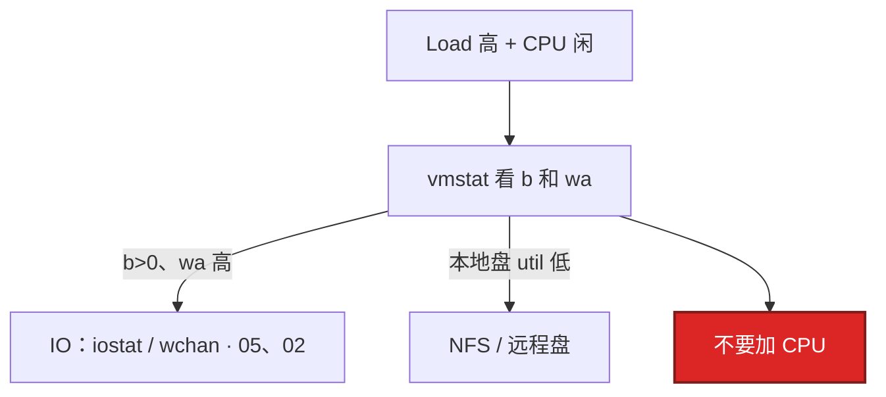
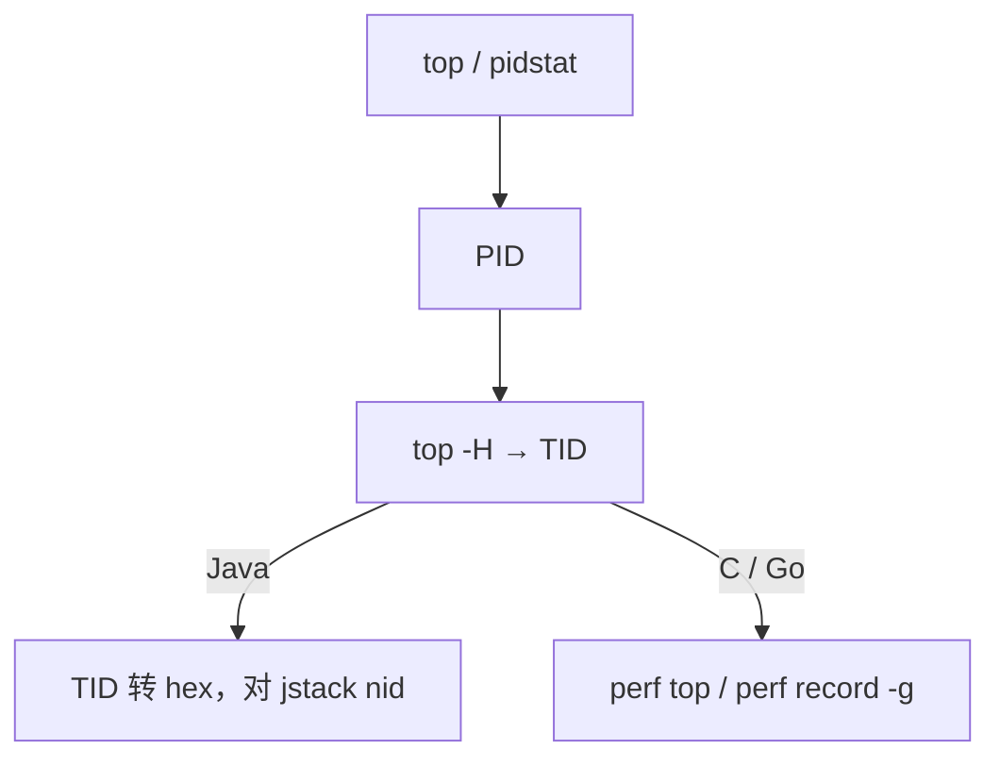
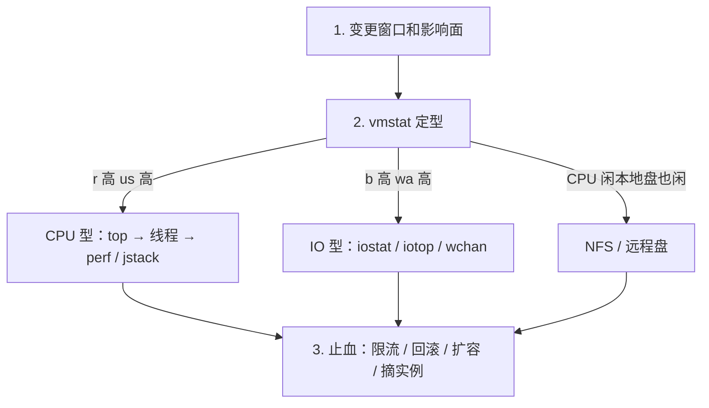

# 03｜CPU 与 Load · 练习题

先自己画图或口述，再对照解答。每题标了覆盖范围：

| 标记 | 含义 |
|------|------|
| **核心** | 不懂整章就没建立起来 |
| **必会** | 值班和面试都要能讲 |
| **常用** | 线上会反复碰到 |
| **常考** | 白板和追问的高频口径 |

## 本题目录

- [Q1 Load 高 CPU 闲](#q1)
- [Q2 定位到函数](#q2)
- [Q3 vmstat 字段](#q3)
- [Q4 容器 throttle](#q4)
- [Q5 %steal](#q5)
- [Q6 上下文切换](#q6)
- [Q7 Load 趋势](#q7)
- [Q8 软中断单核](#q8)
- [Q9 Load=30 三段排查](#q9)
- [Q10 火焰图何时上](#q10)
- [Q11 NUMA](#q11)
- [合上书](#合上书)

---

## Q1

**★★★★★｜Load 很高但 CPU 使用率不高，原因和排查？**

**覆盖**：核心 · 必会 · 常考

### 场景

8 核逻辑服机器 Load 到 40，`top` 里 idle 70%。有人已经在工单里写了「加 8 核」。游戏日志打在 NFS 上。

### 完整解答

Load 含 D 状态。大量进程卡在磁盘 / NFS，CPU 闲着但队列很长。这不是算力不够。



```bash
vmstat 1 5          # b>0 + wa 高 → IO；丢掉第一行
iostat -x 1 5       # await / aqu-sz
ps aux | awk '$8 ~ /D/'
```

游戏日志打到 NFS 挂死时，逻辑服全员 D，Load 上 50，CPU 5%。止血是修 NFS 或把日志改本地盘，不是加核。D 状态 `kill -9` 无效，见 [02](../02-进程与信号/)。

Load ≠ util。wa 是 CPU 视角；磁盘慢以 await 为准，不要用 %util 在 SSD 上结案（[05](../05-磁盘与IO/)）。

### 再追问

- D 能 kill -9 吗？——不能。等 IO 完成或走带外强制重启。见 02。

---

## Q2

**★★★★★｜如何从 CPU 高定位到具体函数？**

**覆盖**：核心 · 必会 · 常用

### 场景

活动后整机 `%us` 80%。开发说「再观察一下」。你需要给出线程和函数，而不是「CPU 高」。

### 完整解答

已经确定是 CPU 型（`r` 高、不是 wa/b）才走这条链：



多线程均匀高：流量或缺少限流。单线程 100%：死循环、正则回溯、主循环。先 `mpstat -P ALL` 排除单核热点——整机 40% 但一核打满，扩核没用。

止血：限流、摘实例、扩容、回滚热点发布。根因要函数级。

### 再追问

- perf 需要什么？——多数环境要 root 和内核符号。容器里还要注意是否关掉 `perf_event`。没有 perf 至少能给到 TID + 栈。

---

## Q3

**★★★★★｜vmstat 里 r、b、cs、wa、st 看到什么要动手？**

**覆盖**：核心 · 必会 · 常用

### 场景

值班把 `vmstat 1` 贴进群。第一行 r=0、后面几行 r=20。有人说「r 是 0 没事」。

### 完整解答

**丢掉第一行**（开机平均）。后面几行才是现在：

| 字段 | 阈值直觉 | 含义 |
|------|----------|------|
| `r` 持续 > 核数 | CPU 排队 | 找热点线程 / 加核或拆负载 |
| `b` 持续 > 0 | D 在堆积 | 去 IO（[05](../05-磁盘与IO/)、[02](../02-进程与信号/)） |
| `cs` 数十万/s | 调度开销 | 线程过多或锁 |
| `wa` > 20% | 在等 IO | 交叉 iostat；CPU 打满时 wa 可被挤成 0 |
| `st` > 10% | 超卖 | 换机，别优化代码 |
| `si/so` 非 0 | 在换页 | 先当内存（[04](../04-内存与OOM/)） |

`in` 突增配合 `%si` 查网卡中断。

### 再追问

- wa 为 0 但磁盘很慢？——CPU 已经被算力打满时，没有 idle 可记到 wa。所以 wa 低不能证明盘快，要看 iostat await。%wa、await、%util 不是同一个数。

---

## Q4

**★★★★★｜容器 CPU 没用满，P99 却很高，怎么解释？**

**覆盖**：核心 · 必会 · 常考

### 场景

匹配服 limit=500m。宿主机 idle 70%，容器内 `%us` 也不打满。P99 从 30ms 跳到 400ms。`GOMAXPROCS=16`。

### 完整解答

cgroup CFS throttle：周期内配额用完被踢出队列，请求 wall time 含等待。宿主机 idle 高、容器内 `%us` 也不一定打满。CFS 周期默认 100ms，500m = 每周期约 50ms 配额。突发跨过边界，P99 直接加上等待。

读 `cpu.stat` 的 `nr_throttled / nr_periods`。看增量，绝对值是累计。`> 5%` 且延迟涨当故障。`GOMAXPROCS`/GC 线程 > limit 核数会加重：16 个线程抢 0.5 核配额。`nproc` 在容器里返回宿主机核数。

短期加 limit；长期对齐并发度。延迟敏感服慎用过小 limit。

### 再追问

- 只设 request 不设 limit 行不行？——能避免 throttle，要防吵邻居：HPA + 节点水位。匹配/逻辑服常用这套。YAML 细节见 K8s 04，本章答到「throttle 看 cpu.stat、request 不是硬顶」即可。

---

## Q5

**★★★★☆｜%steal 是什么？什么时候换机器？**

**覆盖**：必会 · 常用 · 常考

### 场景

云上逻辑服 P99 抖。`mpstat` 里 `%st` 持续 15%。有人要去调 JVM 参数。

### 完整解答

Hypervisor 把你的 vCPU 时间给了别人。持续 **>10%** 且业务延迟涨，换规格、换独占、或找云厂商迁宿主机。自己优化代码解决不了 `st`。

### 再追问

- K8s 里 st 高是 throttle 吗？——不是。st 是虚机层；throttle 是 cgroup。一个看 mpstat `st`，一个看 `cpu.stat`。

---

## Q6

**★★★★☆｜上下文切换过高怎么查？**

**覆盖**：必会 · 常用

### 场景

网关 cs 每秒 30 万，延迟涨。线程模型是「一个连接一线程」。

### 完整解答

```bash
vmstat 1                   # 先确认 cs
pidstat -w 1               # 谁在切：cswch 自愿 / nvcswch 非自愿
```

- `nvcswch` 高 = CPU 不够或线程太多，时间片被抢
- `cswch` 高 = 锁或 IO，自己让出 CPU

物理机每秒数万次常见；**持续 > 10 万/s 且延迟涨**要查。线程池按核数收敛，不要「有请求就 new Thread」。游戏网关一个连接一线程会把 cs 打爆，改 epoll / 协程模型。

### 再追问

- cs 高一定要加核吗？——不一定。线程过多时加核只是推迟。先把并发模型收敛到核数附近。

---

## Q7

**★★★☆☆｜Load 三个数怎么读趋势？Load=1 在 64 核上算高吗？**

**覆盖**：核心 · 常考

### 场景

告警规则写成「Load > 1」。64 核机器白天一直在响。

### 完整解答

Load 对比**核数**，不要和绝对值 1 死磕。64 核上 Load=1 等于几乎没人排队。N 核满载大约 Load ≈ N；持续 **> 2N** 开始伤延迟。

趋势：

- `1m` 远大于 `15m`：正在变糟，优先止血
- `15m` 大、`1m` 小：在恢复，避免重复扩容

8 核 Load=8 是满载感。

### 再追问

- 1m 已经掉下来了还要不要扩？——看业务有没有恢复、根因清没清。只看 15m 还高就扩，容易扩完发现已经在回落。

---

## Q8

**★★★☆☆｜软中断打满单核怎么处理？**

**覆盖**：必会 · 常用

### 场景

网关整机 CPU 30%，但 CPU0 `%si` 100%，开始丢包。扩了两台网关，CPU0 照样满。

### 完整解答

网卡中断全打在 CPU0 → `ksoftirqd/0` `%si` 100%。开 RSS 多队列 / RPS 打散。`mpstat -P ALL` 看 `%si` 集中核，`/proc/interrupts` 确认网卡队列。业务扩容解决不了单核 `si`——包还是进同一块网卡的同一条队列。把逻辑主循环绑到非 0 核，避免和 `ksoftirqd/0` 叠在一起。`nice` 救不了已经打满的核。

### 再追问

- irqbalance 关掉会怎样？——IRQ 容易重新堆回 CPU0。云主机多队列开了也要确认没有人为把 affinity 钉死。

---

## Q9

**★★★★☆｜8 核 Load=30，接口超时，完整三段一遍排查。**

**覆盖**：核心 · 必会 · 常用

### 场景

开场题：「这台机器 Load=30，你怎么查？」不要直接说 perf。

### 完整解答



先分型再选工具。卡错型，后面全是浪费。

### 再追问

- wa 高但 iostat %util 都低？——远程存储 / NFS，iostat 只覆盖本地块设备。看 stack/wchan 和网络 RTT。

---

## Q10

**★★★☆☆｜火焰图什么时候上，什么时候不上？**

**覆盖**：常用 · 常考

### 场景

有人一上来就要 `perf record` 30 分钟。机器 `%wa` 已经 40%。

### 完整解答

已经确定是 CPU 型、需要函数占比时上。采样 **10–30s** 足够。

不上的时候：IO 型、throttle、丢包——先把型分对。wa 高时做 perf 会浪费时间还可能加重负载。

### 再追问

- 没有 perf 怎么办？——Java 至少 jstack；Go 至少 pprof；C 至少 `top -H` 给到 TID。不要卡在「没火焰图就不能答」。

---

## Q11

**★★★☆☆｜多路机器延迟毛刺要不要绑 NUMA？**

**覆盖**：常用 · 常考

### 场景

物理机 2 路，战斗服 P99 偶发抖。有人建议全机 `numactl --cpunodebind=0`。

### 完整解答

先 `numactl --hardware`。单 node 的云主机绑了也没收益。多 node 且 `numastat -p PID` 大量 remote，再把延迟敏感进程绑在一个 node（`--cpunodebind=0 --membind=0`）。绑核不是默认动作。

### 再追问

- 绑错 node 会怎样？——内存还在另一边，remote 访问更多，毛刺更差。先看拓扑和 numastat，再绑。

---

## 合上书

- [ ] 能说出 Load = R+D，对比核数和 1/5/15 趋势；高 Load 低 CPU 先查 D
- [ ] 能丢掉 vmstat 第一行，并解释 r/b/cs/wa/st
- [ ] 能分四种组合，单核打满用 mpstat -P ALL
- [ ] 能区分 %st 超卖和 cgroup throttle，GOMAXPROCS 对齐 limit
- [ ] 能从 PID → TID → 函数；CPU 型才火焰图 10–30s
- [ ] 能处理单核 %si、cs 过高、NUMA「先看拓扑再绑」
- [ ] 能用三段排查 Load=30，而不是先加核或先 perf
