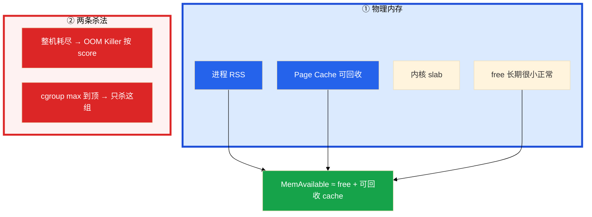
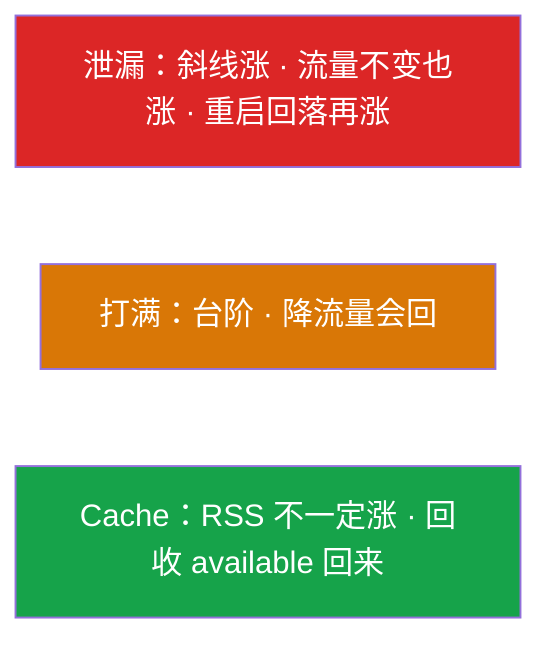
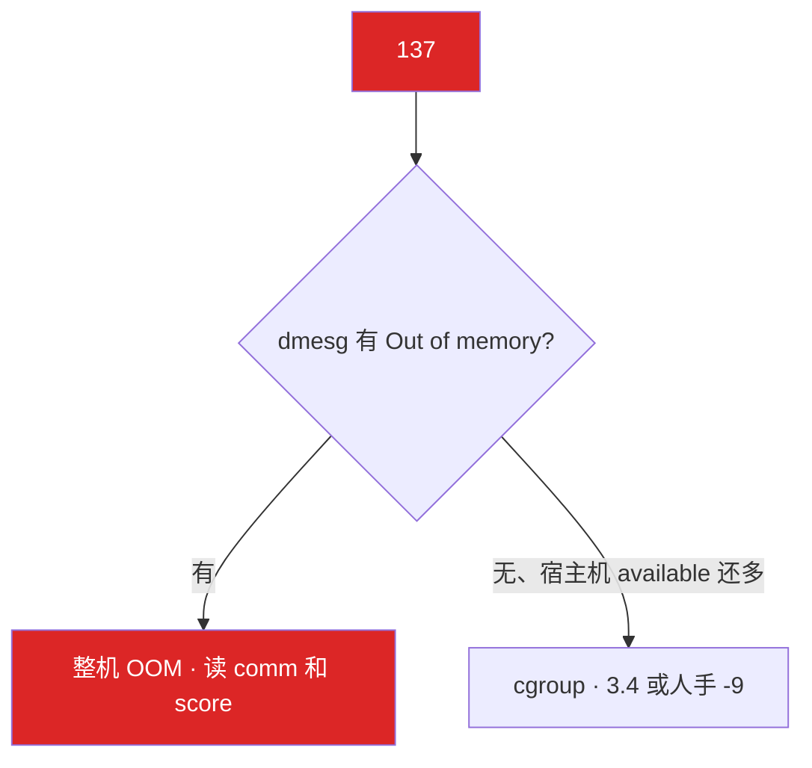
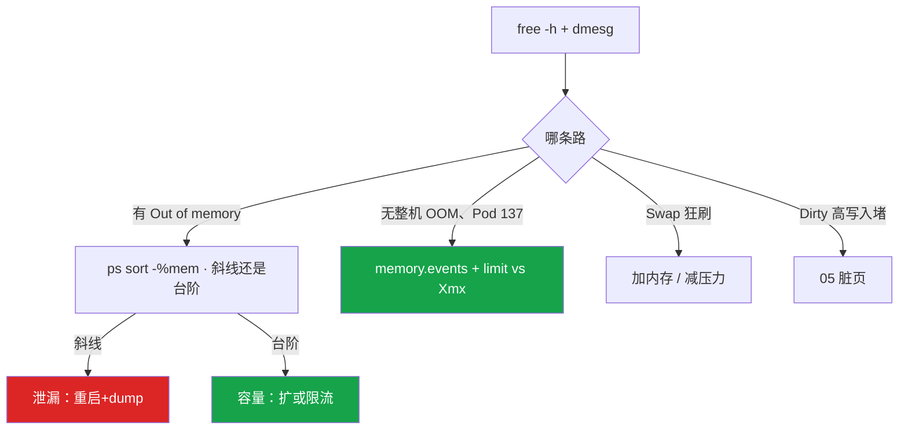

# 内存与 OOM


凌晨三点，监控弹「逻辑服 Pod OOMKilled」，群里有人贴 `free -h`：used 90%，buff/cache 占大半，喊加机器；另有人 `kubectl describe` 看到 Exit Code 137，宿主机 `free` 还剩 20G——两边吵起来。其实这一章只做一件事：**看 available 和 working_set，137 先对 dmesg 和 memory.events**。

**本章主线（排障就按这三步想）：**

1. **读账**：决策用 MemAvailable，不是 free/used；容器看 working_set vs limit，不信容器内 free。
2. **分型**：斜线 = 泄漏；台阶 = 容量；热更打满先回滚。
3. **137 结案**：dmesg 有 OOM 行 → 整机；无 OOM + Pod 137 → cgroup max；也可能是人手 -9。

**读完你能：** 看 available 不看 free；137 分整机 OOM 和 cgroup OOM；会读 oom_score 不给业务 -1000；working_set 80% 告警；热更打满先回滚。

## 本章目录

- [1. 基本概念](#1-基本概念)
- [2. 架构图](#2-架构图)
- [3. 原理](#3-原理)
- [4. 落地](#4-落地)
- [5. 核心配置](#5-核心配置)
- [6. 命令与操作](#6-命令与操作)
- [7. 生产排障](#7-生产排障)
- [8. 必会 · 常考](#8-必会--常考)
- [合上书](#合上书问自己)

**本章不讲：** 容器 free 撒谎细节 → [01](../01-内核与系统/)、[07](../07-cgroup与容器/)；cgroup v1/v2、PSI → [07](../07-cgroup与容器/)；K8s QoS YAML → [04-Pod](../../04-Kubernetes/04-Pod生命周期/)；脏页 iostat → [05](../05-磁盘与IO/)；fork ENOMEM → [02](../02-进程与信号/)；Load si/so → [03](../03-CPU与Load/)。

---

## 1. 基本概念

内存排障不是看 `free` 里 used 百分比。**值班里什么时候碰到**：监控报「内存 90%」、Pod 反复 137、接口 P99 突然抖但 CPU 不高、Swap 开始有数字——先对表，再敲命令。

| 值班现象 | 技术含义 | 你的第一刀 |
|----------|----------|------------|
| used 90%、cache 大半 | 多半是 Page Cache 在干活 | 看 **available** |
| Pod Exit 137 | 128+9，先怀疑 OOM | dmesg + memory.events |
| 宿主机还有 20G、Pod 137 | cgroup 到顶，与宿主机无关 | memory.max vs working_set |
| RSS 一周斜线涨 | 泄漏嫌疑 | 重启后流量不变还涨？ |
| CCU 涨 RSS 到台阶后平 | 容量问题 | 每玩家 RSS × CCU |

进程物理页 = **RSS**。内核留文件页 = **Page Cache**，内存紧时可收回。真正还能给新进程的是 **MemAvailable**，不是 `free`。

| 概念 | 要点 |
|------|------|
| VSZ | 含未映射虚拟地址，**不能**当占用 |
| RSS | 物理页；共享库会重复计 |
| working_set | cgroup「不回收就会 OOM」的近似；告警跟它 vs limit |
| 137 | **128+9**，先怀疑 OOM，也可能人手 `kill -9` |

两条杀法：

| 路 | 触发 | 宿主机还可以很空吗 |
|----|------|:------------------:|
| 整机 OOM Killer | 物理内存 + swap 耗尽 | 否 |
| cgroup OOM | 组内 `memory.max` 到顶 | **可以** |

**打个比方**：MemAvailable 是钱包里还能花的现金；buff/cache 是超市会员卡里的积分——需要时能把积分兑成现金，所以「已用 90%」不等于破产。

> **记住**：看 available，不看 free；容器 OOM 与宿主机剩余无关。

**面试怎么说**：「内存够不够我看 MemAvailable，不看 used；137 我先 dmesg 分整机还是 cgroup，容器跟 working_set 对 limit，不信容器内 free。」

---

## 2. 架构图

后面 free、OOM、容器 limit 都对着这张图。



泄漏 vs 打满 vs Cache：



**读图三句话：**

1. 容器里 `free` 读的是宿主机账（[01](../01-内核与系统/)），**真正会 137 的线在 memory.max**。
2. used 高经常是 cache 在干活，不是故障——决策看 available。
3. 137 分叉：dmesg 有 Out of memory → 整机；无 OOM、Pod 137 → cgroup 或人手 -9。

---

## 3. 原理

### 3.1 读 free 和 meminfo：钱包里还能花多少

**一句话：** 决策用 available；available < 10% 才当风险；容器内 free 是宿主机谎。

**打个比方**：`free` 列是「抽屉里裸放的零钱」——长期很小正常；`buff/cache` 是「超市积分」，需要时能兑回现金；**available** 才是「现在还能刷卡付账」的总额。

**现场走一遍**（监控报 used 90%，先别喊加机器）：

1. SSH 到告警节点，敲：

```bash
free -h
grep -E 'MemTotal|MemAvailable|Cached|Dirty|Swap' /proc/meminfo
```

2. 屏幕出现：

```text
              total        used        free      shared  buff/cache   available
Mem:           62Gi        58Gi       512Mi       1.0Gi        8.2Gi        6.1Gi
Swap:            0B          0B          0B
```

3. **口算读数**：used 58Gi 看起来吓人，但 **available 还有 6.1Gi**（约总量 10%）——还没到整机 OOM 边缘，不要 `drop_caches`，不要加机器。
4. 若 available < MemTotal 的 10% → `ps aux --sort=-%mem | head`，看 RSS 是斜线还是台阶。
5. 若 Swap used > 0 且 `vmstat 1` 里 si/so 持续非 0 → 已经在换页，当故障处理，不是「还能撑」。
6. 若 Dirty 持续很高 → available 会偏乐观，脏页要先 writeback 才能回收，去 [05](../05-磁盘与IO/)。

**输出解读**：

| 列/字段 | 含义 | 上面例子 | 异常信号 |
|---------|------|----------|----------|
| free | 完全空闲 | 512Mi 很小 | 单独看 free 小 ≠ 危险 |
| buff/cache | 加速 IO，可回收 | 8.2Gi | 大是正常的 |
| **available** | **决策用** | **6.1Gi** | < 10% 总量 → 危险 |
| Swap used | 换页量 | 0 | >0 且 si/so 持续 → 故障 |
| Dirty | 待刷脏页 | meminfo 里看 | 持续高 → 05 章 |

内存紧时先 **kswapd** 后台回收；来不及走 **direct reclaim**，分配路径卡住，P99 抖——还没 OOM，玩家已超时。

`vm.overcommit_memory`：`0` 启发式（常见默认）、`1` 允许超卖、`2` 严格不超。游戏逻辑服保持默认即可；不要为了 fork 改成 1 然后在活动里真实写爆。fork ENOMEM 贴着 cgroup 时，改 overcommit **救不了** 这个组的 `memory.max`（[02](../02-进程与信号/)）。

**面试怎么说**：「used 90% 我不 panic，先看 available；6G available 在 62G 机器上还能撑，cache 大是 Page Cache 在干活。available 跌破 10% 我才 ps 排序找大户。」

> **记住**：free 小、cache 大、available 还足 → 不要 drop_caches。决策用 available 这一列。

### 3.2 RSS / VSZ / 泄漏 vs 打满：斜线是漏，台阶是容量

**一句话：** 斜线是泄漏，台阶是容量；dump 能指对象才定泄漏。

**打个比方**：RSS 像水箱水位——泄漏是水管没关，水位不管用水多少都斜着涨；打满是高峰期客人多了，降流量水位会落；Page Cache 是旁边的大桶，不一定反映在水箱读数里。

**现场走一遍**（某逻辑服 RSS 三天从 2G 涨到 8G）：

1. 看进程占用：

```bash
ps -o pid,rss,vsz,comm -p <PID>
cat /proc/<PID>/status | grep -E 'VmRSS|VmSwap|VmSize|Threads'
```

2. 屏幕出现：

```text
  PID   RSS    VSZ COMMAND
28451 8384512 12000000 java
VmRSS:   8384512 kB
VmSize: 12000000 kB
```

3. RSS 8G、VSZ 12G——**VSZ 不能当占用**，决策看 RSS。
4. 拉监控曲线：流量不变 RSS 斜线涨 → 泄漏嫌疑；CCU 从 5k 到 2 万 RSS 台阶升高后平稳 → 容量。
5. 泄漏确认：`cat /proc/<PID>/smaps`，看 heap / anon / mmap 哪段在涨；重启止血后，**流量不变 RSS 又斜线涨** 才定泄漏。
6. 热更后全量 load 在线玩家、RSS 冲到 limit 3 倍 → **先回滚**，不是先 dump。

**输出解读**：

| 形态 | 曲线特征 | 处理 |
|------|----------|------|
| 泄漏 | 流量不变 RSS 斜线涨，重启回落再涨 | 重启 + heap dump / pprof |
| 打满 | CCU 涨 RSS 到台阶后平稳，降流量会回 | 每玩家 RSS × CCU 算 limit |
| Cache | RSS 不涨，available 被 cache 吃 | 回收后回来，不是泄漏 |
| 热更打满 | 发布时间点对得上 | **先回滚** |

Redis 当全服排行榜无 TTL，RSS 一周涨到 OOM——那是**数据增长**不是泄漏，要淘汰和拆分，不是「加内存就完了」。

不要把 Cached 和 RSS 加在一起当「应用吃了多少」——进程 RSS 里的 file 页和 Cached 有重叠。

**面试怎么说**：「斜线是泄漏、台阶是容量；重启什么都会回落，要看回落后流量不变还涨不涨；dump 能指到具体对象我才定泄漏，CCU 涨了先按单玩家内存算。」

> **记住**：斜线是泄漏，台阶是容量；dump 能指对象才定泄漏，流量涨了先按 CCU 算。

### 3.3 整机 OOM Killer：137 先对 dmesg

**一句话：** 137 先对 dmesg；选人看 oom_score，不要给业务 -1000。

**打个比方**：整机 OOM 像大楼火警——按「谁占走廊最大」（oom_score）点名疏散；给业务 -1000 等于给某户发免死金牌，火大了整栋楼 hung 住比杀一个房间更糟。

**现场走一遍**（逻辑服 status 137，宿主机 available 只剩 200Mi）：

1. 查内核日志：

```bash
dmesg -T | grep -i 'oom\|killed process'
cat /proc/<PID>/oom_score
cat /proc/<PID>/oom_score_adj
```

2. 屏幕出现：

```text
[Thu Aug 28 03:12:01 2026] Out of memory: Kill process 12345 (java) score 987 or sacrifice child
[Thu Aug 28 03:12:01 2026] Killed process 12345 (java) total-vm:12000000kB, anon-rss:2096128kB
```

3. 有 **Out of memory** 行 → **整机 OOM**，被杀的是 java，anon-rss 约 2G。
4. `oom_score` 987 高是因为 RSS 大——**score 高不一定是泄漏**，是谁占得多谁容易被点。
5. 保护 sshd/kubelet：`oom_score_adj` **-500～-900**；systemd 用 `OOMScoreAdjust=`。**不要给业务 -1000**。

**输出解读**：



K8s 节点内存争抢时：BestEffort 先杀，Burstable 次之，Guaranteed（request=limit）最后。这是**节点级优先级**，和容器 limit 触发的 cgroup OOM **不是同一条路**。同 QoS 再看 oom_score。Guaranteed 照样会 OOMKilled——那是自己的 max 到了。request=limit 节点争抢时最后被杀，不是豁免。QoS 怎么配见 K8s 04。

**面试怎么说**：「137 我先 dmesg，有 Out of memory 是整机 OOM，看谁 RSS 大、oom_score 高；保护 sshd 用 -500 到 -900，不给业务 -1000，否则节点 hung 比杀业务更糟。」

### 3.4 容器 OOM ≠ 机器 OOM：limit 到了就杀

**一句话：** cgroup 到 max 就杀，宿主机可以很空；Xmx = limit 必炸，留 30%+ 堆外。

**打个比方**：cgroup limit 像酒店单间房上限——整栋楼还有空房，你这间超员了照样被请出去；Java 堆只是房间里的一张床，Metaspace、线程栈、DirectByteBuffer 是床底下的箱子，Xmx=limit 等于没留过道。

**现场走一遍**（Pod 137，宿主机 available 还有 20G）：

1. 读 cgroup 和 K8s 事件：

```bash
cat /sys/fs/cgroup/.../memory.current
cat /sys/fs/cgroup/.../memory.max
cat /sys/fs/cgroup/.../memory.events
kubectl describe pod <name> | grep -A5 -i oom
```

2. 屏幕出现：

```text
2097152000
2147483648
oom 3
oom_kill 1
Last State:     Terminated
  Reason:       OOMKilled
  Exit Code:    137
```

3. memory.current ≈ memory.max（约 2G）→ **cgroup OOM**，与宿主机 20G 剩余无关。
4. memory.events 有 oom_kill → 确认是 cgroup 杀，不是人手 -9（人手 -9 通常无 oom_kill）。
5. Java 案例：jmap 看堆只用了 70%，进程却 137 → 堆外 Metaspace、线程栈、DirectByteBuffer、JNI。**limit ≥ Xmx × 1.3～1.5**，或 `-XX:MaxRAMPercentage=70`。
6. 监控：`container_memory_working_set_bytes` vs limit，**80% 告警**。working_set 90%、容器内 RSS 60%——跟 working_set，不要跟容器内 ps。

**输出解读**：

| 信号 | 含义 | 下一步 |
|------|------|--------|
| current ≈ max | cgroup 到顶 | 调 limit 或降 Xmx |
| oom_kill > 0 | cgroup 杀的 | 不是人手 -9 |
| 宿主机 available 多 | 正常 | 别信容器内 free |
| jmap 堆 70% 却 137 | 堆外杀手 | Netty 直接内存、JNI 编解码 |

Go：goroutine 泄漏表现为 RSS 涨、pprof heap 对不上时看堆外/mmap。`GOMAXPROCS` 对齐的是 CPU，不是这道内存题（[03](../03-CPU与Load/)）。

v1 `usage_in_bytes` 含 cache 易偏高；v2 能拆 file/anon → [07](../07-cgroup与容器/)。

**面试怎么说**：「Pod 137 宿主机还很空，是 cgroup max 到了；Java 我 limit 留 30% 以上给堆外，Xmx 不能贴死 limit；告警跟 working_set 对 limit 80%，不信容器里 free。」

> **别混**：整机 OOM（dmesg 有行）vs cgroup OOM（memory.events）；容器内 free vs working_set。

### 3.5 THP、Swap、drop_caches：延迟毛刺三件套

**一句话：** Swap 用了就是紧；THP 造成延迟毛刺；不要日常 drop_caches。

**打个比方**：Swap 像把文件搬到地下室——能腾地方但上下楼慢；THP 像强行把零散小盒合并成大箱——搬一次省事，合并过程会卡一下；drop_caches 像把超市积分全清零——日常这么做会制造读风暴。

**现场走一遍**（Redis P99 偶发 200ms 毛刺，Swap 开始有数）：

1. 查 THP 和 Swap：

```bash
cat /sys/kernel/mm/transparent_hugepage/enabled
grep -E 'Swap|SwapCached' /proc/meminfo
vmstat 1 5
```

2. 屏幕出现：

```text
always [madvise] never
SwapTotal:       8388608 kB
SwapFree:        6291456 kB
SwapCached:       524288 kB
 procs -----------memory---------- ---swap-- -----io----
 r  b   swpd   free   buff  cache   si   so
 2  0 2097152  ...
                   12   48
```

3. Swap used 约 2G，si/so 持续非 0 → **已经在换页**，当故障，不是「还能撑」。
4. THP 是 `[always]` → 延迟敏感服务（Redis、帧同步）改 `never` 或 `madvise`。
5. 有人提议 `echo 3 > /proc/sys/vm/drop_caches` → **拒绝**，日常会制造读风暴；只有 IO 基线测试才用。

**输出解读**：

| 项 | 生产建议 | 改错后果 |
|----|----------|----------|
| Swap | 游戏逻辑服关或 swappiness=0 | 还有 cache 就换页，P99 抖 |
| THP | Redis/帧同步用 never/madvise | always → 压缩/回收毛刺 |
| drop_caches | 仅测试用 | 日常 → 读风暴 |

**面试怎么说**：「Swap 有 used 且 si/so 持续就是在换页，不能当还能撑；THP 对延迟敏感服务用 never；drop_caches 生产禁止，除非做 IO 基线。」

---

## 4. 落地

| 项 | 选 | 不选 |
|----|----|------|
| 决策指标 | MemAvailable；working_set vs limit | used%、容器内 free |
| 告警 | working_set **80%** limit | cache 占 80% 就告警 |
| Java | limit ≥ Xmx × **1.3～1.5** | Xmx = limit |
| Swap | 关或 swappiness=0 | 靠 Swap 抗峰值 |
| oom_score | sshd/kubelet **-500～-900** | 业务 -1000 |
| 热更 | 按需加载 + 分批 | 全量 load 在线玩家 |

Redis 当全服排行榜无 TTL，RSS 一周涨到 OOM，那是数据增长——要淘汰和拆分，不是「Redis 要加内存就完了」。

验收：137 能在 5 分钟内分出整机/cgroup/人手 -9；working_set 80% 告警生效；热更方案不会全量 load 玩家。

---

## 5. 核心配置

| 参数 | 生产怎么用 | 改错会怎样 |
|------|------------|------------|
| `vm.swappiness` | 游戏逻辑服 **0** 或关 Swap | 还有 cache 就换页，P99 抖 |
| `vm.overcommit_memory` | 保持 0 | 改成 1 让 RSS 真正写爆才失败 |
| `oom_score_adj` | 保护 sshd **-500～-900** | -1000 豁免 → hung |
| THP `enabled` | 延迟敏感 never/madvise | 压缩/回收毛刺 |
| `-Xmx` vs limit | limit ≥ 1.3～1.5× 或 MaxRAMPercentage=70 | 堆外一上来就 137 |
| `-XX:MaxRAMPercentage` | **70** 让 JVM 认 cgroup | JVM 看不见 limit |
| `OOMScoreAdjust=` | systemd 保护 sshd | 整机 OOM 杀了 sshd |
| K8s memory limit | working_set 80% 告警 | 用容器内 MemAvailable 告警 |

脏页参数 `dirty_ratio` / `dirty_background_ratio` → [05](../05-磁盘与IO/)。Dirty 持续高时 available 偏乐观——脏页要先 writeback 才能回收。

> **记住**：swappiness 避免「看起来够但在换页」；quota 式加内存不治理泄漏会再满。

---

## 6. 命令与操作

### 6.1 命令速查

```bash
free -h
grep -E 'MemTotal|MemAvailable|Cached|Dirty|Swap' /proc/meminfo
dmesg -T | grep -i 'oom\|killed process'
ps aux --sort=-%mem | head
cat /proc/<PID>/status | grep -E 'VmRSS|VmSwap|VmSize'
cat /proc/<PID>/oom_score
cat /proc/<PID>/smaps
cat /sys/kernel/mm/transparent_hugepage/enabled
vmstat 1 5
# 容器
cat .../memory.current .../memory.max .../memory.events
kubectl describe pod
```

| 目的 | 命令 | 看什么 | 正常/异常 |
|------|------|--------|-----------|
| 还够不够 | MemAvailable | < 10% 危险 | available 足 + cache 大 = 正常 |
| 137 结案 | dmesg + memory.events | 整机 vs cgroup vs -9 | 无 dmesg OOM + oom_kill = cgroup |
| 谁大 | `ps sort -%mem` | 斜线 vs 台阶 | 斜线 + 流量不变 = 泄漏 |
| 哪段在涨 | smaps | heap / anon / mmap | anon 斜线涨 = 堆泄漏 |
| Swap | vmstat si/so | 持续非 0 当故障 | si/so 有数 = 在换页 |
| THP | transparent_hugepage/enabled | always 先对照 | madvise/never 给延迟敏感 |
| 监控 | working_set vs limit | 80% 告警 | 容器内 free 不可信 |

### 6.2 操作要点

- **泄漏**：重启止血，保留 heap dump / pprof；dump 能指对象才定泄漏。只看 RSS 涨不够——重启什么都会回落，要看回落之后、流量不变时还会不会斜线涨。
- **打满**：扩容或限流，按每玩家 RSS × CCU 算。热更引入的打满**先回滚**。
- **容器 137**：核对 limit、working_set、Java Xmx 是否贴死 limit。临时加 limit 或降 Xmx。长期 MaxRAMPercentage、堆外监控、80% 告警。Exit 137 还可能是人手 `kill -9`，要用 `memory.events` 区分。
- **保护 sshd**：`OOMScoreAdjust=-500`。不要给逻辑服 -1000。
- **关 Swap / swappiness=0** 之前确认 limit 和监控到位。代价：没缓冲，OOM 来得更快，延迟更稳。

---

## 7. 生产排障

三问：是整机没内存了？是 cgroup 到顶了？还是泄漏/容量/热更？



**游戏事故复盘：**

1. 逻辑服热更后全量 load 在线玩家到内存，RSS 冲到 limit 3 倍，OOM，玩家掉线。dmesg / cgroup events 对得上发布时间。改成按需加载 + 分批。**回滚比加内存快**。
2. 活动 CCU 从 5k → 2 万，RSS 台阶升高后平稳：容量问题，按单玩家内存 × CCU 算 limit，不要先查泄漏。
3. Redis 当全服排行榜无 TTL，RSS 一周涨到 OOM——那是数据增长，要淘汰和拆分。

止血可以重启、加 limit、摘流量。根因必须回答「是泄漏还是容量」。只说「加内存」不够。

| 现象 | 先做 | 别做 |
|------|------|------|
| used 90%、cache 大半 | 看 available | 加机器、drop_caches |
| 137 | dmesg + memory.events | 只说加内存 |
| 宿主机 20G、Pod 137 | 读 cgroup max | 信容器内 free |
| RSS 涨 | 斜线 vs 台阶 vs CCU | 先 dump 当泄漏 |
| Swap used 2G | si/so 当故障 | 「还能撑」 |
| 堆 70% 却 137 | 堆外 / Xmx vs limit | 只看 jmap |
| 整机 OOM 杀了 sshd | 给 sshd 降 score | 给业务 -1000 |
| 热更后 RSS 爆 | 先回滚 | 先加 limit |

| 决策 | 依据 |
|------|------|
| 加 limit | working_set 台阶型，代码无泄漏 |
| 修代码 | RSS 斜线、dump 能指对象 |
| oom_score_adj | 保护 sshd/node 组件，不要 -1000 给业务 |
| 关 Swap | 延迟敏感游戏服常见；前提是 limit 和监控到位 |
| 堆外预算 | Java/Netty 直接内存单独算进 limit |
| 先回滚 | 热更全量 load 玩家 |

---

## 8. 必会 · 常考

| 说法 | 对错 | 口径 |
|------|:----:|------|
| used 90% 必须加内存 | 错 | 看 available |
| 看 free 判断够不够 | 错 | 决策用 MemAvailable |
| 容器 free 64G 说明够 | 错 | 读宿主机 meminfo |
| 容器 OOM 时宿主机一定没内存 | 错 | cgroup max 到了即可 |
| 137 一定是 OOM | 错 | 也可能人手 -9 |
| score 高一定是泄漏 | 错 | 谁 RSS 大谁容易被点名 |
| 给业务 oom_score_adj=-1000 | 错 | 保护 sshd；业务该被杀好过 hung |
| request=limit 就不会被杀 | 错 | 节点争抢最后被杀；超 limit 仍 cgroup OOM |
| Xmx = limit | 错 | 堆外必炸；1.3～1.5 倍 |
| 重启回落就能定泄漏 | 错 | 看回落后流量不变是否斜线涨 |
| Swap 在用还可以撑 | 错 | 已经在换页 |
| cache 占 80% 该 drop | 错 | 看 available |
| GOMAXPROCS 管内存 | 错 | 那是 CPU |
| v1 usage_in_bytes 很准 | 错 | 含 cache，易偏高误杀 |
| 告警跟容器内 ps RSS | 错 | working_set vs limit，80% |

数字：available **< 10%** 当风险；working_set **80%** 告警；Xmx 留 **30%+** 堆外；oom_score_adj **-500～-900**，**-1000** 豁免；swappiness **0**；137 = 128+9。

易混：free vs available vs cache；RSS vs VSZ vs working_set；泄漏斜线 vs 打满台阶；整机 OOM vs cgroup OOM；Swap used vs si/so；kswapd vs direct reclaim。

---

## 合上书，问自己

1. 判断内存够不够看哪一列？used 高为什么经常不是故障？
2. 137 怎么分整机 OOM、cgroup OOM、人手 -9？score 怎么用？
3. 容器 OOM 为什么跟宿主机剩余无关？Xmx 怎么定？
4. 泄漏和打满怎么分？dump 什么时候才定泄漏？热更打满先做什么？
5. 为什么不要给业务 -1000？request=limit 还会被杀吗？
6. Swap 用了还能撑吗？THP 和 drop_caches 生产怎么处理？

六题能口述，这一章就过了。下一章：[磁盘与 IO](../05-磁盘与IO/)——await 怎么读，df 满 du 不满先查谁。
