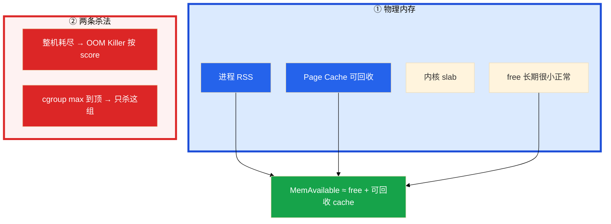
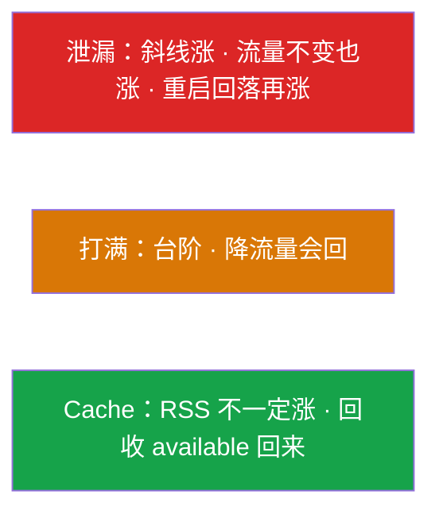
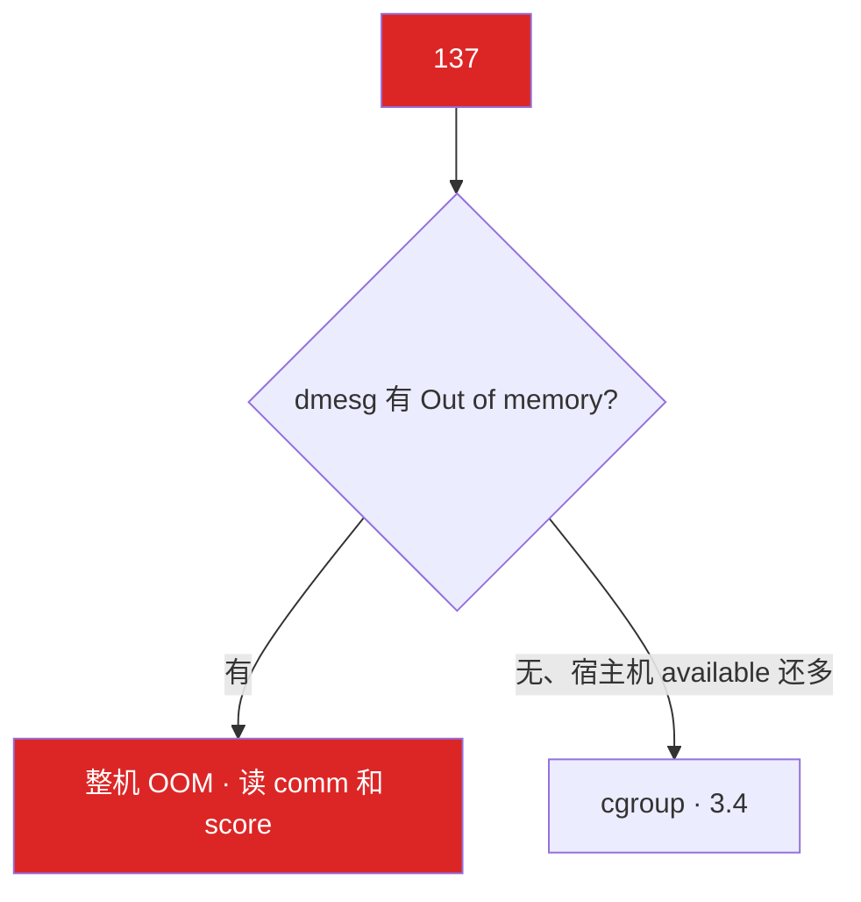
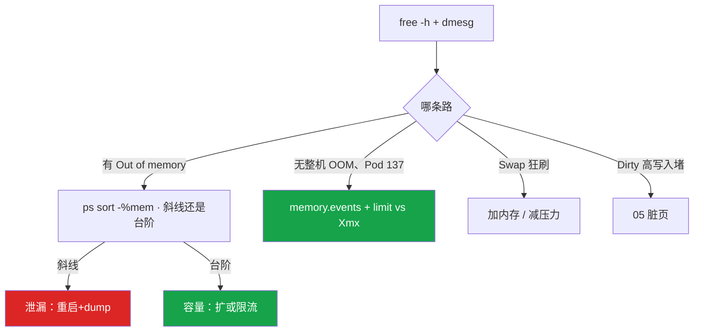

# 内存与 OOM


逻辑服没了，`status` 是 137。`free -h` used 90%，buff/cache 占大半。这一章只做一件事——**看 available 和 working_set，137 先对 dmesg 和 memory.events**。

**本章主线（排障就按这三步想）：**

1. **读账**：决策用 MemAvailable，不是 free/used；容器看 working_set vs limit，不信容器内 free。
2. **分型**：斜线 = 泄漏；台阶 = 容量；热更打满先回滚。
3. **137 结案**：dmesg 有 OOM 行 → 整机；无 OOM + Pod 137 → cgroup max；也可能是人手 -9。

**读完你能：** 看 available 不看 free；137 分整机 OOM 和 cgroup OOM；会读 oom_score 不给业务 -1000；working_set 80% 告警；热更打满先回滚。

## 本章目录

- [1. 基本概念](#1-基本概念)
- [2. 架构图](#2-架构图)
- [3. 原理](#3-原理)
- [4. 落地](#4-落地)
- [5. 核心配置](#5-核心配置)
- [6. 命令与操作](#6-命令与操作)
- [7. 生产排障](#7-生产排障)
- [8. 必会 · 常考](#8-必会--常考)
- [合上书](#合上书问自己)

**本章不讲：** 容器 free 撒谎细节 → [01](../01-内核与系统/)、[07](../07-cgroup与容器/)；cgroup v1/v2、PSI → [07](../07-cgroup与容器/)；K8s QoS YAML → [04-Pod](../../04-Kubernetes/04-Pod生命周期/)；脏页 iostat → [05](../05-磁盘与IO/)；fork ENOMEM → [02](../02-进程与信号/)；Load si/so → [03](../03-CPU与Load/)。

---

## 1. 基本概念

进程物理页 = **RSS**。内核留文件页 = **Page Cache**，内存紧时可收回。真正还能给新进程的是 **MemAvailable**，不是 `free`。

| 概念 | 要点 |
|------|------|
| VSZ | 含未映射虚拟地址，**不能**当占用 |
| RSS | 物理页；共享库会重复计 |
| working_set | cgroup「不回收就会 OOM」的近似；告警跟它 vs limit |
| 137 | **128+9**，先怀疑 OOM，也可能人手 `kill -9` |

两条杀法：

| 路 | 触发 | 宿主机还可以很空吗 |
|----|------|:------------------:|
| 整机 OOM Killer | 物理内存 + swap 耗尽 | 否 |
| cgroup OOM | 组内 `memory.max` 到顶 | **可以** |

> **记住**：看 available，不看 free；容器 OOM 与宿主机剩余无关。

---

## 2. 架构图



泄漏 vs 打满 vs Cache：



**读图三句话：**

1. 容器里 `free` 读的是宿主机账（[01](../01-内核与系统/)）。
2. 真正会 137 的线在 `memory.max`。
3. used 高经常是 cache 在干活，不是故障。

---

## 3. 原理

### 3.1 读 free 和 meminfo

**一句话：** 决策用 available；available < 10% 才当风险；容器内 free 是宿主机谎。

```bash
free -h
grep -E 'MemTotal|MemAvailable|Cached|Dirty|Swap' /proc/meminfo
```

| 列 | 含义 |
|----|------|
| free | 完全空闲，长期很小正常 |
| buff/cache | 加速 IO，可回收 |
| **available** | **决策用这一列** |
| Swap used | >0 且 `si/so` 持续 = 在换页 |

1. free 小、cache 大、available 还足 → 不要 `drop_caches`，不要加机器。
2. available < 总量 10% → `ps sort -%mem`，看斜线还是台阶。
3. Swap + si/so 持续 → 当故障，不是「还能撑」。
4. Dirty 持续高 → available 偏乐观，去 [05](../05-磁盘与IO/)。

内存紧时先 **kswapd** 后台回收；来不及 **direct reclaim** 卡分配路径，P99 抖——还没 OOM 玩家已超时。

典型 `free -h` 输出（cache 在干活，不是故障）：

```text
              total        used        free      shared  buff/cache   available
Mem:           62Gi        58Gi       512Mi       1.0Gi        8.2Gi        6.1Gi
Swap:            0B          0B          0B
```

used 58Gi 看起来吓人，**available 还有 6.1Gi**——决策看 available，不要加机器。

`vm.overcommit_memory`：`0` 启发式（常见默认）、`1` 允许超卖、`2` 严格不超。游戏逻辑服保持默认即可；不要为了 fork 改成 1 然后在活动里真实写爆。fork ENOMEM 贴着 cgroup 时，改 overcommit **救不了** 这个组的 `memory.max`（[02](../02-进程与信号/)）。

### 3.2 RSS / VSZ / 泄漏 vs 打满

**一句话：** 斜线是泄漏，台阶是容量；dump 能指对象才定泄漏。

```bash
ps -o pid,rss,vsz,comm -p <PID>
cat /proc/<PID>/status | grep -E 'VmRSS|VmSwap|VmSize|Threads'
cat /proc/<PID>/smaps    # heap / anon / mmap
```

| 形态 | 处理 |
|------|------|
| 流量不变 RSS 斜线涨，重启回落再涨 | 泄漏：重启+dump |
| CCU 涨 RSS 到台阶后平稳，降流量会回 | 容量：按每玩家 RSS × CCU 算 limit |
| RSS 不涨 available 被 cache 吃 | Page Cache；回收后回来 |
| 热更全量 load 在线玩家 | 发布打满，**先回滚** |

Redis 当全服排行榜无 TTL，RSS 一周涨到 OOM，那是数据增长不是泄漏——要淘汰和拆分。

不要把 Cached 和 RSS 加在一起当「应用吃了多少」——进程 RSS 里的 file 页和 Cached 有重叠。

> **记住**：斜线是泄漏，台阶是容量；dump 能指对象才定泄漏，流量涨了先按 CCU 算。

### 3.3 整机 OOM Killer

**一句话：** 137 先对 dmesg；选人看 oom_score，不要给业务 -1000。



```bash
dmesg -T | grep -i 'oom\|killed process'
cat /proc/<PID>/oom_score
cat /proc/<PID>/oom_score_adj    # -1000 豁免
```

dmesg 示例：

```text
Out of memory: Kill process 12345 (java) anon-rss:2096128kB
```

保护 sshd/kubelet：`oom_score_adj` **-500～-900**；systemd 用 `OOMScoreAdjust=`。**不要给业务 -1000**——节点 hung 比杀业务更糟。

K8s 节点内存争抢时：BestEffort 先杀，Burstable 次之，Guaranteed（request=limit）最后。这是节点级优先级，和容器 limit 触发的 cgroup OOM **不是同一条路**。同 QoS 再看 oom_score。Guaranteed 照样会 OOMKilled——那是自己的 max 到了。request=limit 节点争抢时最后被杀，不是豁免。QoS 怎么配见 K8s 04。

### 3.4 容器 OOM ≠ 机器 OOM

**一句话：** cgroup 到 max 就杀，宿主机可以很空；Xmx = limit 必炸，留 30%+ 堆外。

```bash
cat .../memory.current
cat .../memory.max
cat .../memory.events     # oom / oom_kill
kubectl describe pod      # OOMKilled
```

Java 走一遍现场：jmap 看堆只用了 70%，进程却 137。堆外还有 Metaspace、线程栈、DirectByteBuffer、JNI。**limit ≥ Xmx × 1.3～1.5**，或 `-XX:MaxRAMPercentage=70` 让 JVM 认 cgroup。Netty 堆外、JNI 音视频编解码是游戏服常见堆外杀手。jmap 只看堆会误判「堆没满却 OOM」。

Go：goroutine 泄漏表现为 RSS 涨、pprof heap 对不上时看堆外/mmap。`GOMAXPROCS` 对齐的是 CPU，不是这道内存题（[03](../03-CPU与Load/)）。

监控：`container_memory_working_set_bytes` vs limit，**80% 告警**。working_set 90%、容器内 RSS 60%——跟 working_set，不要跟容器内 ps。

v1 `usage_in_bytes` 含 cache 易偏高；v2 能拆 file/anon → [07](../07-cgroup与容器/)。

### 3.5 THP、Swap、drop_caches

**一句话：** Swap 用了就是紧；THP 造成延迟毛刺；不要日常 drop_caches。

```bash
cat /sys/kernel/mm/transparent_hugepage/enabled
# [always] madvise never — 延迟敏感改 never/madvise
```

| 项 | 生产 |
|----|------|
| Swap | 游戏逻辑服关或 `swappiness=0`；前提是 limit 和监控到位 |
| THP | Redis / 帧同步用 `never` 或 `madvise` |
| drop_caches | 只有 IO 基线测试才用；日常会制造读风暴 |

---

## 4. 落地

| 项 | 选 | 不选 |
|----|----|------|
| 决策指标 | MemAvailable；working_set vs limit | used%、容器内 free |
| 告警 | working_set **80%** limit | cache 占 80% 就告警 |
| Java | limit ≥ Xmx × **1.3～1.5** | Xmx = limit |
| Swap | 关或 swappiness=0 | 靠 Swap 抗峰值 |
| oom_score | sshd/kubelet **-500～-900** | 业务 -1000 |
| 热更 | 按需加载 + 分批 | 全量 load 在线玩家 |

Redis 当全服排行榜无 TTL，RSS 一周涨到 OOM，那是数据增长——要淘汰和拆分，不是「Redis 要加内存就完了」。

---

## 5. 核心配置

| 参数 | 生产怎么用 | 改错会怎样 |
|------|------------|------------|
| `vm.swappiness` | 游戏逻辑服 **0** 或关 Swap | 还有 cache 就换页，P99 抖 |
| `vm.overcommit_memory` | 保持 0 | 改成 1 让 RSS 真正写爆才失败 |
| `oom_score_adj` | 保护 sshd **-500～-900** | -1000 豁免 → hung |
| THP `enabled` | 延迟敏感 never/madvise | 压缩/回收毛刺 |
| `-Xmx` vs limit | limit ≥ 1.3～1.5× 或 MaxRAMPercentage=70 | 堆外一上来就 137 |
| `-XX:MaxRAMPercentage` | **70** 让 JVM 认 cgroup | JVM 看不见 limit |
| `OOMScoreAdjust=` | systemd 保护 sshd | 整机 OOM 杀了 sshd |
| K8s memory limit | working_set 80% 告警 | 用容器内 MemAvailable 告警 |

脏页参数 `dirty_ratio` / `dirty_background_ratio` → [05](../05-磁盘与IO/)。Dirty 持续高时 available 偏乐观——脏页要先 writeback 才能回收。

> **记住**：swappiness 避免「看起来够但在换页」；quota 式加内存不治理泄漏会再满。

---

## 6. 命令与操作

```bash
free -h
grep -E 'MemTotal|MemAvailable|Cached|Dirty|Swap' /proc/meminfo
dmesg -T | grep -i 'oom\|killed process'
ps aux --sort=-%mem | head
cat /proc/<PID>/status | grep -E 'VmRSS|VmSwap|VmSize'
cat /proc/<PID>/oom_score
cat /proc/<PID>/smaps
cat /sys/kernel/mm/transparent_hugepage/enabled
# 容器
cat .../memory.current .../memory.max .../memory.events
kubectl describe pod
```

| 目的 | 命令 | 看什么 |
|------|------|--------|
| 还够不够 | MemAvailable | < 10% 危险 |
| 137 结案 | dmesg + memory.events | 整机 vs cgroup vs 人手 -9 |
| 谁大 | `ps sort -%mem` | 斜线 vs 台阶 |
| 哪段在涨 | smaps | heap / anon / mmap |
| Swap | `vmstat` si/so | 持续非 0 当故障 |
| THP | transparent_hugepage/enabled | always 先对照 |
| 监控 | container_memory_working_set_bytes vs limit | 不要用容器内 MemAvailable |

**操作要点：**

- 泄漏：重启止血，保留 heap dump / pprof；dump 能指对象才定泄漏。只看 RSS 涨不够——重启什么都会回落，要看回落之后、流量不变时还会不会斜线涨。
- 打满：扩容或限流，按每玩家 RSS × CCU 算。热更引入的打满先回滚。
- 容器 137：核对 limit、working_set、Java Xmx 是否贴死 limit。临时加 limit 或降 Xmx。长期 MaxRAMPercentage、堆外监控、80% 告警。Exit 137 还可能是人手 `kill -9`，要用 `memory.events` 区分。
- 保护 sshd：`OOMScoreAdjust=-500`。不要给逻辑服 -1000。
- 关 Swap / swappiness=0 之前确认 limit 和监控到位。代价：没缓冲，OOM 来得更快，延迟更稳。

---

## 7. 生产排障



**游戏事故复盘：**

1. 逻辑服热更后全量 load 在线玩家到内存，RSS 冲到 limit 3 倍，OOM，玩家掉线。dmesg / cgroup events 对得上发布时间。改成按需加载 + 分批。**回滚比加内存快**。
2. 活动 CCU 从 5k → 2 万，RSS 台阶升高后平稳：容量问题，按单玩家内存 × CCU 算 limit，不要先查泄漏。
3. Redis 当全服排行榜无 TTL，RSS 一周涨到 OOM——那是数据增长，要淘汰和拆分。

止血可以重启、加 limit、摘流量。根因必须回答「是泄漏还是容量」。只说「加内存」不够。

| 决策 | 依据 |
|------|------|
| 加 limit | working_set 台阶型，代码无泄漏 |
| 修代码 | RSS 斜线、dump 能指对象 |
| oom_score_adj | 保护 sshd/node 组件，不要 -1000 给业务 |
| 关 Swap | 延迟敏感游戏服常见；前提是 limit 和监控到位 |
| 堆外预算 | Java/Netty 直接内存单独算进 limit |
| 先回滚 | 热更全量 load 玩家 |

| 现象 | 先做 | 别做 |
|------|------|------|
| used 90%、cache 大半 | 看 available | 加机器、drop_caches |
| 137 | dmesg + memory.events | 只说加内存 |
| 宿主机 20G、Pod 137 | 读 cgroup max | 信容器内 free |
| RSS 涨 | 斜线 vs 台阶 vs CCU | 先 dump 当泄漏 |
| Swap used 2G | si/so 当故障 | 「还能撑」 |
| 堆 70% 却 137 | 堆外 / Xmx vs limit | 只看 jmap |
| 整机 OOM 杀了 sshd | 给 sshd 降 score | 给业务 -1000 |

| 决策 | 依据 |
|------|------|
| 加 limit | working_set 台阶型，无泄漏 |
| 修代码 | RSS 斜线、dump 能指对象 |
| 先回滚 | 热更全量 load 玩家 |

---

## 8. 必会 · 常考

| 说法 | 对错 | 口径 |
|------|:----:|------|
| used 90% 必须加内存 | 错 | 看 available |
| 看 free 判断够不够 | 错 | 决策用 MemAvailable |
| 容器 free 64G 说明够 | 错 | 读宿主机 meminfo |
| 容器 OOM 时宿主机一定没内存 | 错 | cgroup max 到了即可 |
| 137 一定是 OOM | 错 | 也可能人手 -9 |
| score 高一定是泄漏 | 错 | 谁 RSS 大谁容易被点名 |
| 给业务 oom_score_adj=-1000 | 错 | 保护 sshd；业务该被杀好过 hung |
| request=limit 就不会被杀 | 错 | 节点争抢最后被杀；超 limit 仍 cgroup OOM |
| Xmx = limit | 错 | 堆外必炸；1.3～1.5 倍 |
| 重启回落就能定泄漏 | 错 | 看回落后流量不变是否斜线涨 |
| Swap 在用还可以撑 | 错 | 已经在换页 |
| cache 占 80% 该 drop | 错 | 看 available |
| GOMAXPROCS 管内存 | 错 | 那是 CPU |
| v1 usage_in_bytes 很准 | 错 | 含 cache，易偏高误杀 |
| 告警跟容器内 ps RSS | 错 | working_set vs limit，80% |

数字：available **< 10%** 当风险；working_set **80%** 告警；Xmx 留 **30%+** 堆外；oom_score_adj **-500～-900**，**-1000** 豁免；swappiness **0**；137 = 128+9。

易混：free vs available vs cache；RSS vs VSZ vs working_set；泄漏斜线 vs 打满台阶；整机 OOM vs cgroup OOM；Swap used vs si/so；kswapd vs direct reclaim。

---

## 合上书，问自己

1. 判断内存够不够看哪一列？used 高为什么经常不是故障？
2. 137 怎么分整机 OOM、cgroup OOM、人手 -9？score 怎么用？
3. 容器 OOM 为什么跟宿主机剩余无关？Xmx 怎么定？
4. 泄漏和打满怎么分？dump 什么时候才定泄漏？热更打满先做什么？
5. 为什么不要给业务 -1000？request=limit 还会被杀吗？
6. Swap 用了还能撑吗？THP 和 drop_caches 生产怎么处理？

六题能口述，这一章就过了。下一章：[磁盘与 IO](../05-磁盘与IO/)——await 怎么读，df 满 du 不满先查谁。
