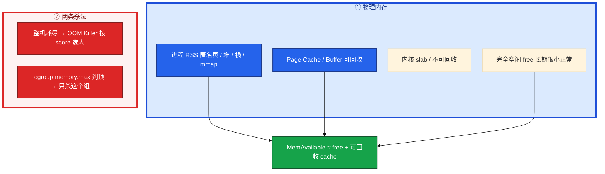
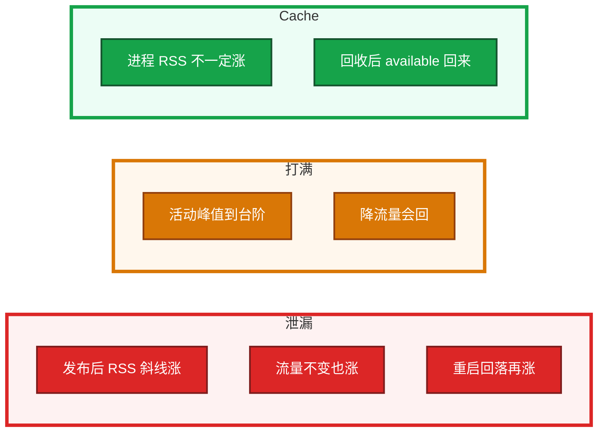
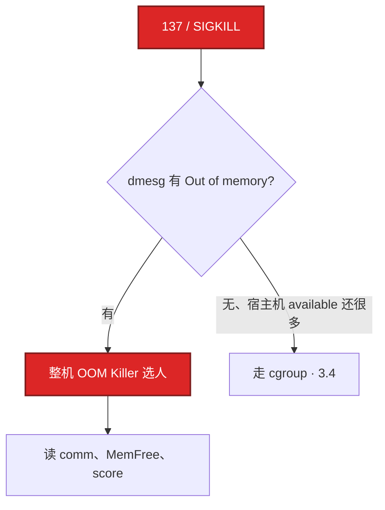
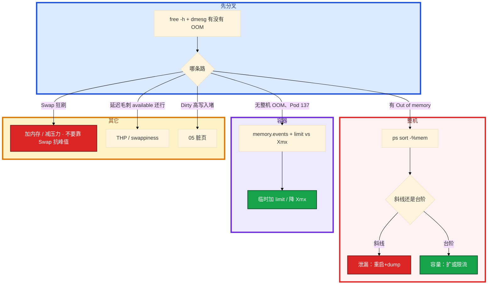

# 内存与 OOM


逻辑服没了。`systemctl status` 是 137。十分钟前刚热更。`free -h` 显示 used 90%，开发说内存爆了要加机器。buff/cache 占了大半。群里已经在说加内存。

先别动手。这一章后半全是你会动手的：**137 怎么对 dmesg 和 memory.events、泄漏斜线怎么和打满台阶分开、Java Xmx 为什么不能等于 limit、Swap 用了为什么不是还能撑。** 前面的账本，是为了让你动手时不选错路。

**读完你能：** 看 available 不看 free；137 能分整机 OOM 和 cgroup OOM；会读 oom_score，不给业务 -1000；working_set 对比 limit 做告警；热更打满先回滚。

## 本章目录

缩进 = 上下级。3 下面才是 3.1。

想钉在**正文左边**跟着滚：菜单 **查看 → 打开视图 → 大纲**。Markdown 预览做不到独立左栏，目录只能写在文章开头。

- [1. 基本概念](#1-基本概念)
- [2. 架构图](#2-架构图)
- [3. 原理](#3-原理)
  - [3.1 读 free 和 meminfo](#31-读-free-和-meminfo)
  - [3.2 RSS / VSZ / 泄漏 vs 打满](#32-rss--vsz--泄漏-vs-打满)
  - [3.3 整机 OOM Killer](#33-整机-oom-killer)
  - [3.4 容器 OOM](#34-容器-oom--机器-oom)
  - [3.5 THP、Swap、drop_caches](#35-thp-swap-drop_caches)
- [4. 落地](#4-落地)
- [5. 核心配置](#5-核心配置)
- [6. 常用命令](#6-常用命令)
- [7. 常用操作](#7-常用操作)
- [8. 生产排障](#8-生产排障)
- [9. 必会 · 常考](#9-必会--常考)
- [合上书](#合上书问自己)

**本章不讲：** 容器里 free 为什么显示宿主机的 namespace 细节 → [01 内核与系统](../01-内核与系统/)、[07 cgroup 与容器](../07-cgroup与容器/)；cgroup v1/v2 文件、memory.high、PSI → [07](../07-cgroup与容器/)；K8s QoS / request=limit YAML → [04-Pod](../../04-Kubernetes/04-Pod生命周期/)；脏页把写入堵死的 iostat 侧 → [05 磁盘与 IO](../05-磁盘与IO/)；fork 贴着 limit 返回 ENOMEM → [02 进程与信号](../02-进程与信号/)；Load 里的 si/so 格子 → [03 CPU 与 Load](../03-CPU与Load/)。

---

## 1. 基本概念

进程要用的物理页叫 **RSS**。内核把近期读过的文件页留着叫 **Page Cache**，加速下次读，内存紧时可以收回。真正还能给新进程的，是 **MemAvailable**，不是 `free` 那一列。

`used` 高经常只是 cache 在干活。清 cache 不是日常运维。Swap 开始用已经说明紧了，延迟会抖，不是「还可以用」。

VSZ 含未映射的虚拟地址，**不能**当占用。RSS 才是物理页。共享库会重复计在多个进程 RSS 里，加总会虚高。

cgroup 的 **working_set** 才是「不回收就会 OOM」的近似。告警跟 working_set vs limit，不要跟容器内 `ps` RSS 死磕。K8s working_set ≈ RSS + 不能立刻回收的 cache 等。cgroup 统计的也不是 `-Xmx`。

Exit **137 = 128+9**，先怀疑 OOM，也可能人手 `kill -9`。要用 dmesg / `memory.events` 区分，不要停在「被杀了」。OOM Killer 发的是 **SIGKILL**，没有优雅退出（[02](../02-进程与信号/)）。

两条路不要混：

| 路 | 触发 | 宿主机还可以很空吗 |
|----|------|-------------------|
| 整机 OOM Killer | 物理内存 + swap 耗尽，回收不来 | 否 |
| cgroup OOM | 这个组 `memory.max` 到顶 | **可以** |

> **记住**：看 available，不看 free；used 高经常只是 cache。容器 OOM 与宿主机剩余无关。

---

## 2. 架构图

先把物理内存这本账钉住。后面 free、OOM、容器都对着这张图说话。



容器里 `free` 读的仍是左边那本宿主机账（[01](../01-内核与系统/)）。真正会 137 的线在右边 `memory.max`。

泄漏和打满不是同一张图：



---

## 3. 原理

原理只保留动手和面试会用到的：怎么读账、斜线还是台阶、谁被点名、容器为什么跟宿主机无关、Swap/THP 为什么不是优化项。

**本节 5 块：** 3.1 free · 3.2 泄漏 · 3.3 整机 OOM · 3.4 容器 · 3.5 THP/Swap

### 3.1 读 free 和 meminfo

你登上那台「used 90%」的机器，先把三列对上人话，再决定加不加内存。

```bash
free -h
grep -E 'MemTotal|MemAvailable|Cached|Dirty|Swap' /proc/meminfo
```

| 列 | 含义 |
|----|------|
| free | 完全空闲，长期很小正常 |
| buff/cache | 加速 IO，可回收；buffer≈块设备写缓冲，cache≈文件读缓存 |
| available | **决策用这一列** |
| Swap used | >0 且 `si/so` 持续有值 = 在换页 |

逐步对应你眼睛看到的：

1. **free 很小、buff/cache 很大、available 还充足**：cache 在干活。不要 `drop_caches`，不要加机器。
2. **available 已经低于总量 10%**：危险。先 `ps sort -%mem` 看谁，再看趋势是斜线还是台阶。
3. **Swap used >0 且 `vmstat` 里 `si/so` 持续有值**：已经在换页。延迟会抖，当故障，不是「还可以用」。
4. **Dirty 持续高且 Writeback 跟不上**：会拖死写入（见 [05](../05-磁盘与IO/)）。这时 available 会偏乐观——脏页要先 writeback 才能回收，盘慢时回收会卡住写入（`dirty_ratio`）。cache 不能立刻全部回收。

`vm.swappiness` 过高会在还有 cache 时就换页，表现为「内存看起来够但延迟毛刺」。游戏逻辑服通常关 Swap 或 `swappiness=0`。

内存紧时内核先走 **kswapd** 后台回收；来不及就 **direct reclaim**，分配路径上卡住，P99 直接抖——还没 OOM，玩家已经超时。`vmstat` 的 `si/so` 是换页；direct reclaim 更常见的体感是「CPU 不忙但接口偶发卡一下」。

`vm.overcommit_memory`：`0` 启发式（常见默认）、`1` 允许超卖、`2` 严格不超。游戏逻辑服保持默认即可；不要为了「fork 过得去」改成 1 然后在活动里真实把内存写爆。fork ENOMEM 贴着 cgroup 时，改 overcommit **救不了** 这个组的 `memory.max`（[02](../02-进程与信号/)）。

容器里 `free` 读的是宿主机 `/proc/meminfo`，limit 2G 也能显示 64G。排容器内存看 cgroup，不要看容器内 free（01、07）。

> **记住**：available < 10% 才当风险；容器里的 free 是宿主机的谎。

### 3.2 RSS / VSZ / 泄漏 vs 打满

活动 CCU 从 5k → 2 万，RSS 上去了。开发说是泄漏要 dump。另一次是热更后流量不变、RSS 斜线涨。两件事处理完全不同，先分型。

```bash
ps -o pid,rss,vsz,comm -p <PID>
cat /proc/<PID>/status | grep -E 'VmRSS|VmSwap|VmSize|Threads'
# 泄漏：watch RSS，只涨不回
# 哪段在涨：/proc/PID/smaps 看 heap / anon / mmap
```

1. **热更后流量不变，RSS 斜线涨，重启回落再涨**：泄漏。重启止血，保留 heap dump / pprof。dump 能指到无限增长的对象才定泄漏。只看 RSS 涨不够。重启什么都会回落——要看回落之后、流量不变时还会不会斜线涨。
2. **活动 CCU 5k → 2 万，RSS 到台阶后平稳，降流量会回**：容量。按「每玩家 RSS × CCU」算 limit，先扩或限流，不要先骂泄漏。
3. **进程 RSS 不一定涨，available 却被 cache 吃掉**：内核 Page Cache。回收后 available 回来。不要把 Cached 和 RSS 加在一起当「应用吃了多少」——进程 RSS 里的 file 页和 Cached 有重叠。

热更全量 load 在线玩家，属于发布引入的打满，**回滚比加内存快**。Redis 当全服排行榜无 TTL，RSS 一周涨到 OOM，那是数据增长不是「Redis 要加内存就完了」——要淘汰和拆分。

> **记住**：斜线是泄漏，台阶是容量；dump 能指对象才定泄漏，流量涨了先按 CCU 算。

### 3.3 整机 OOM Killer

触发：分配失败且回收不来（物理内存 + swap 耗尽）。选人：`oom_score` ≈ RSS 占比 × `oom_score_adj`（**-1000～1000**）。**-1000 豁免**，可能把机器推到 hung/panic。



```bash
dmesg -T | grep -i 'oom\|killed process'
cat /proc/<PID>/oom_score
cat /proc/<PID>/oom_score_adj
# systemd: OOMScoreAdjust=-500
```

dmesg 里那一行要会读：`Out of memory: Kill process 12345 (java)` 后面跟着当时的 MemFree/Cached 和 score。先确认杀的是谁（comm），再看是不是「杀错了」——大 cache 的文件服务 score 高，可能把数据库点名。score 高不一定是泄漏，谁 RSS 大谁容易被点名。要结合趋势和 smaps。

保护关键进程：`oom_score_adj` 调到 **-500～-900**。systemd 用 `OOMScoreAdjust=`。**不要给业务 -1000**——保护 sshd / kubelet / node 组件；业务该被杀好过节点 hung。整机 OOM 时把 sshd 杀了，你登不进去。

K8s 节点内存争抢时：BestEffort 先杀，Burstable 次之，Guaranteed（request=limit）最后。这是节点级优先级，和容器 limit 触发的 cgroup OOM **不是同一条路**。同 QoS 再看 oom_score。Guaranteed 照样会 OOMKilled——那是自己的 max 到了。request=limit 节点争抢时最后被杀，不是豁免。QoS 怎么配见 K8s 04。

> **记住**：137 先对 dmesg；整机选人看 score，不要给业务 -1000。

### 3.4 容器 OOM ≠ 机器 OOM

Pod limit 2Gi。进容器 `free -h` 看到 64G。十分钟后 137。开发说「宿主机明明还有 20G」。很多环境宿主机 dmesg **没有** 经典 Out of memory 行。

cgroup 到 `memory.max` 就杀组内进程，**不需要**整机没内存。`kubectl describe`：OOMKilled，exit 137。单容器超 limit 只杀该 cgroup，**不按 QoS 选邻居**。

```bash
# v2
cat .../memory.current
cat .../memory.max
cat .../memory.events     # oom / oom_kill
```

v1 的 `usage_in_bytes` 含 cache，容易偏高、更早 OOM。v2 `memory.stat` 能拆 file/anon。这是迁 v2 的理由之一，细节见 [07](../07-cgroup与容器/)。

Java 走一遍现场：jmap 看堆只用了 70%，进程却 137。堆外还有 Metaspace、线程栈、DirectByteBuffer、JNI。`-Xmx` 等于 limit 几乎必炸。经验：**limit ≥ Xmx × 1.3～1.5**，或 `-XX:MaxRAMPercentage=70` 让 JVM 认 cgroup。Netty 堆外、JNI 音视频编解码是游戏服常见堆外杀手。jmap 只看堆会误判「堆没满却 OOM」。

Go：goroutine 泄漏表现为 RSS 涨、pprof heap 对不上时看堆外/mmap。`GOMAXPROCS` 对齐的是 CPU，不是这道内存题（[03](../03-CPU与Load/)）。

监控用 working_set 对比 limit，**80% 告警**。不要把容器里的 `node_memory_MemAvailable` 当容器可用内存。working_set 已经 90% limit、容器里 `ps` RSS 只有 60%——开发不信要 OOM 时，跟 working_set，不要跟容器内 RSS 死磕。

止血可以临时加 limit 或降 Xmx。长期三件事：`-XX:MaxRAMPercentage` 让 JVM 认 cgroup、堆外单独监控、working_set 80% 告警。Exit 137 还可能是人手 `kill -9`，要用 `memory.events` 区分。

> **记住**：容器 OOM 与宿主机剩余无关；Xmx = limit 必炸，留 30%+ 堆外。

### 3.5 THP、Swap、drop_caches

匹配服延迟毛刺，内存看起来够。先排除 THP 和 Swap，再去猜业务。

**THP（Transparent Huge Pages）**：Redis / 游戏帧同步对延迟敏感时，THP 压缩/回收会造成毛刺。先看有没有开：

```bash
cat /sys/kernel/mm/transparent_hugepage/enabled
# 常见：[always] madvise never
```

延迟毛刺且 `enabled` 是 always，先改 `never` 或 `madvise` 做对照，再去猜业务。

**Swap**：已经在用慢设备换页，延迟会抖。游戏逻辑服通常关 Swap 或 **`swappiness=0`**，用 OOM 和扩容，不用「静默变慢」。代价：没缓冲，OOM 来得更快，延迟更稳。前提是 limit 和监控到位。`vmstat` 里 `si/so` 持续非 0 就要当故障，不是偶发 page in。`free` 里 Swap used 2G 不是「还可以撑」。

**`drop_caches` 不是运维手段**。会制造读风暴，且脏页不能靠 drop 丢掉。只有确定 cache 回收导致误判、或要做 IO 基线测试才用。cache 占 80% 不要清，看 available。drop 之后 available 上去了接下来读请求会重新填 cache，而且会打盘——这是制造事故的方式，不是治理。

> **记住**：Swap 用了就是紧；THP 会造成延迟毛刺；不要日常 drop_caches。

---

## 4. 落地

游戏服内存怎么放，比调内核页表要紧。

| 项 | 选 | 不选 |
|----|----|------|
| 决策指标 | MemAvailable；容器 working_set vs limit | used%、容器内 free |
| 告警 | working_set **80%** limit；available < 10% | cache 占 80% 就告警 |
| Java | limit ≥ Xmx × **1.3～1.5** 或 MaxRAMPercentage=70 | Xmx = limit |
| Swap | 关或 `swappiness=0` | 靠 Swap 抗活动峰值 |
| oom_score | sshd/kubelet **-500～-900** | 业务 -1000 |
| THP | Redis / 帧同步用 `never` 或 `madvise` | always 不管延迟 |
| 热更 | 按需加载 + 分批；打满先回滚 | 全量 load 在线玩家再加内存 |

贴着 cgroup limit 再 `Runtime.exec` 会 ENOMEM，见 [02](../02-进程与信号/)。

---

## 5. 核心配置

只动有证据的项。swappiness 和 OOMScoreAdjust 改错，表现为延迟毛刺或节点 hung。

| 参数 | 默认直觉 | 生产怎么用 | 改错会怎样 |
|------|----------|------------|------------|
| `vm.swappiness` | 常见 60 | 游戏逻辑服 **0** 或关 Swap | 过高：还有 cache 就换页，P99 抖 |
| `vm.overcommit_memory` | 0 | 保持默认；不要为 fork 改成 1 | 1 会让 RSS 真正写爆才失败 |
| `oom_score_adj` | 0 | 保护 sshd/node **-500～-900**；业务不要 -1000 | -1000 豁免 → hung/panic |
| `OOMScoreAdjust=` | systemd | 同上 | 整机 OOM 杀了 sshd |
| THP `enabled` | 发行版常 always | 延迟敏感改 never/madvise | 压缩/回收毛刺 |
| `-Xmx` vs limit | 常被写成相等 | limit ≥ 1.3～1.5× 或 MaxRAMPercentage=70 | 堆外一上来就 137 |
| `-XX:MaxRAMPercentage` | 无 | **70** 让 JVM 认 cgroup | JVM 看不见 limit |
| K8s memory limit | — | working_set 80% 告警 | 用容器内 MemAvailable 告警 |

脏页参数 `dirty_ratio` / `dirty_background_ratio` 在 [05](../05-磁盘与IO/)。这里只要求：Dirty 持续高时 available 偏乐观。

> **记住**：swappiness 用来避免「看起来够但在换页」，不是用来多撑一会儿活动。quota 式加内存不治理泄漏会再满。

---

## 6. 常用命令

```bash
free -h
grep -E 'MemTotal|MemAvailable|Cached|Dirty|Swap' /proc/meminfo
dmesg -T | grep -i 'oom\|killed process'
ps aux --sort=-%mem | head
cat /proc/<PID>/status | grep -E 'VmRSS|VmSwap|VmSize'
cat /proc/<PID>/oom_score
cat /proc/<PID>/smaps
cat /sys/kernel/mm/transparent_hugepage/enabled
# 容器
cat .../memory.current .../memory.max .../memory.events
kubectl describe pod          # OOMKilled
```

| 目的 | 命令 | 看什么 |
|------|------|--------|
| 还够不够 | `free -h` / MemAvailable | 不看 used；< 10% 危险 |
| 脏页 | meminfo Dirty / Writeback | 持续高去 05 |
| 137 结案 | dmesg + memory.events | 整机 vs cgroup vs 人手 -9 |
| 谁大 | `ps sort -%mem` | 再看斜线 vs 台阶 |
| 哪段在涨 | smaps | heap / anon / mmap |
| Swap | `vmstat` si/so | 持续非 0 当故障 |
| THP | transparent_hugepage/enabled | always 先对照 |

监控：`container_memory_working_set_bytes` vs limit。不要用容器内 `node_memory_MemAvailable`。

---

## 7. 常用操作

泄漏：重启止血，保留 heap dump / pprof。dump 能指对象才定泄漏。

打满：扩容或限流，按每玩家 RSS × CCU 算。热更引入的打满先回滚。

容器 137：核对 limit、working_set、Java Xmx 是否贴死 limit。临时加 limit 或降 Xmx。长期 MaxRAMPercentage、堆外监控、80% 告警。

保护 sshd：`OOMScoreAdjust=-500`。不要给逻辑服 -1000。

关 Swap / swappiness=0 之前确认 limit 和监控到位。

---

## 8. 生产排障



游戏事故：逻辑服热更后全量 load 在线玩家到内存，RSS 冲到 limit 3 倍，OOM，玩家掉线。dmesg / cgroup events 对得上发布时间。改成按需加载 + 分批。回滚比加内存快。

活动 CCU 从 5k → 2 万，RSS 台阶升高后平稳：容量问题，按单玩家内存 × CCU 算 limit，不要先查泄漏。

止血可以重启、加 limit、摘流量。根因必须回答「是泄漏还是容量」。只说「加内存」不够。

| 决策 | 依据 |
|------|------|
| 加 limit | working_set 台阶型，代码无泄漏 |
| 修代码 | RSS 斜线、dump 能指对象 |
| oom_score_adj | 保护 sshd/node 组件，不要 -1000 给业务 |
| 关 Swap | 延迟敏感游戏服常见；前提是 limit 和监控到位 |
| 堆外预算 | Java/Netty 直接内存单独算进 limit |
| 先回滚 | 热更全量 load 玩家 |

| 现象 | 先做什么 | 不要做什么 |
|------|----------|------------|
| used 90%、cache 大半 | 看 available | 加机器、drop_caches |
| 137 | dmesg + memory.events | 只说加内存 |
| 宿主机 20G、Pod 137 | 读 cgroup max | 信容器内 free |
| RSS 涨 | 斜线 vs 台阶 vs CCU | 先 dump 当泄漏 |
| Swap used 2G | si/so 当故障 | 「还能撑」 |
| cache 80% | 看 available | echo 3 drop_caches |
| 堆 70% 却 137 | 堆外 / Xmx vs limit | 只看 jmap |
| 整机 OOM 杀了 sshd | 给 sshd 降 score | 给业务 -1000 |

---

## 9. 必会 · 常考

白板和追问高频，能一口回：

| 说法 | 对错 | 口径 |
|------|:----:|------|
| used 90% 必须加内存 | 错 | 看 available；used 高经常是 cache |
| 看 free 那一列判断够不够 | 错 | 决策用 MemAvailable |
| 容器 free 显示 64G 说明够 | 错 | 读的是宿主机 meminfo |
| 容器 OOM 时宿主机一定没内存 | 错 | cgroup max 到了即可 |
| 137 一定是 OOM | 错 | 也可能人手 -9；对 dmesg / events |
| score 高一定是泄漏 | 错 | 谁 RSS 大谁容易被点名 |
| 给业务 oom_score_adj=-1000 | 错 | 保护 sshd/kubelet；业务该被杀好过 hung |
| request=limit 就不会被杀 | 错 | 节点争抢最后被杀；自己超 limit 仍 cgroup OOM |
| Xmx = limit | 错 | 堆外必炸；1.3～1.5 倍或 MaxRAMPercentage=70 |
| 重启回落就能定泄漏 | 错 | 看回落后流量不变是否斜线涨 |
| Swap 在用还可以撑 | 错 | 已经在换页，延迟抖 |
| cache 占 80% 该 drop | 错 | 看 available；drop 制造读风暴 |
| 告警跟容器内 ps RSS | 错 | working_set vs limit，80% |
| v1 usage_in_bytes 很准 | 错 | 含 cache，易偏高误杀 |
| GOMAXPROCS 管内存 | 错 | 那是 CPU |

数字：available **< 10%** 当风险；working_set **80%** 告警；Xmx 留 **30%+** 堆外（1.3～1.5 倍）；oom_score_adj **-500～-900**，**-1000** 豁免；swappiness 游戏服 **0**；137 = 128+9。

易混：free vs available vs cache；RSS vs VSZ vs working_set；泄漏斜线 vs 打满台阶；整机 OOM vs cgroup OOM；节点 QoS 选杀 vs 自己的 max；Swap used vs si/so；Dirty 让 available 偏乐观；kswapd 后台回收 vs direct reclaim 卡住分配；overcommit 救不了 cgroup max。

---

## 合上书，问自己

1. 判断内存够不够看哪一列？used 高为什么经常不是故障？
2. 137 怎么分整机 OOM、cgroup OOM、人手 -9？score 怎么用？
3. 容器 OOM 为什么跟宿主机剩余无关？Xmx 怎么定？
4. 泄漏和打满怎么分？dump 什么时候才定泄漏？热更打满先做什么？
5. 为什么不要给业务 -1000？request=limit 还会被杀吗？
6. Swap 用了还能撑吗？THP 和 drop_caches 生产怎么处理？

六题都能口述，这一章就过了。下一章把磁盘账剖开：await 怎么读，脏页怎样把全机 write 堵住，df 满 du 不满先查谁。
