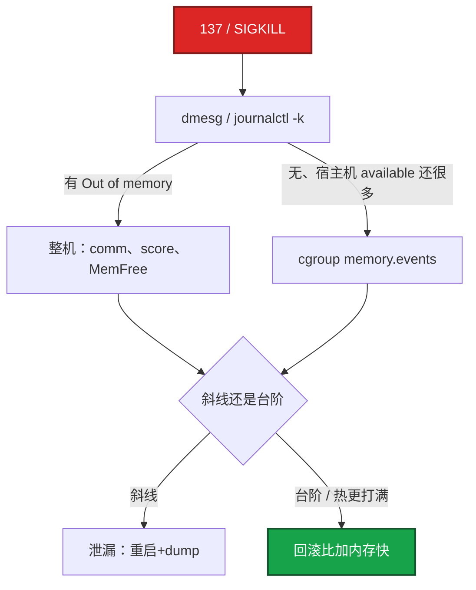
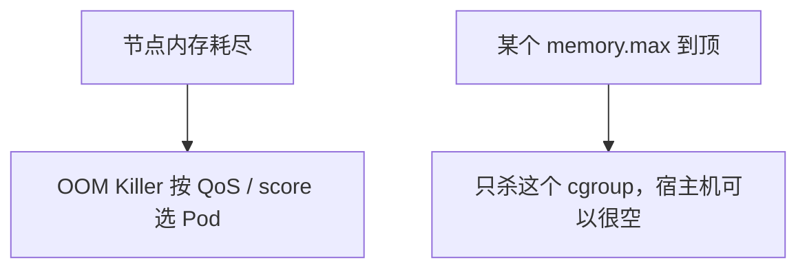

# 04｜内存与 OOM · 练习题

先自己画图或口述，再对照解答。每题标了覆盖范围：

| 标记 | 含义 |
|------|------|
| **核心** | 不懂整章就没建立起来 |
| **必会** | 值班和面试都要能讲 |
| **常用** | 线上会反复碰到 |
| **常考** | 白板和追问的高频口径 |

## 本题目录

- [Q1 free / available / cache](#q1)
- [Q2 137 排查](#q2)
- [Q3 容器 OOM](#q3)
- [Q4 泄漏 vs 打满](#q4)
- [Q5 oom_score](#q5)
- [Q6 Java limit](#q6)
- [Q7 Swap](#q7)
- [Q8 drop_caches](#q8)
- [Q9 working_set vs RSS](#q9)
- [Q10 QoS vs cgroup OOM](#q10)
- [合上书](#合上书)

---

## Q1

**★★★★★｜free 里 free、available、buff/cache 区别？判断内存够不够看哪个？**

**覆盖**：核心 · 必会 · 常考

### 场景

`free -h` 显示 used 90%。开发说内存爆了要加机器。buff/cache 占了大半。

### 完整解答

free 是完全空闲，通常很小。buff/cache 是内核 IO 缓存，可回收。**available 才是还能给应用的。** 看 available，不看 used/free。MemAvailable ≈ free + 可回收 cache。

used 高经常只是 cache 在干活，回收后 available 仍充足。MemAvailable **< 10%** 才当风险。buffer≈块设备写缓冲，cache≈文件读缓存，现在合成 buff/cache 即可。

### 再追问

- cache 能立刻全部回收吗？——脏页要先 writeback，盘慢时回收会卡住写入（`dirty_ratio`）。所以 available 是估算，极端脏页时会偏乐观（[05](../05-磁盘与IO/)）。

---

## Q2

**★★★★★｜进程被 OOM 杀了怎么排查？不要只说加内存。**

**覆盖**：核心 · 必会 · 常用

### 场景

逻辑服没了。`systemctl status` 是 137。群里已经在说加内存。十分钟前刚热更，全量 load 了在线玩家。

### 完整解答

Exit **137 = 128+9**。先对 dmesg，不要停在「被杀了」。



```bash
dmesg -T | grep -i 'killed process'
kubectl describe pod          # OOMKilled
cat .../memory.events
```

游戏服一次热更全量 load 玩家，属于发布引入的打满/泄漏，回滚比加内存快。也可能人手 `kill -9`，要用 events 区分。OOM 发 SIGKILL，没有优雅退出（[02](../02-进程与信号/)）。

### 再追问

- score 高一定是泄漏？——不是。谁 RSS 大谁容易被点名。文件服务器 cache 多也可能高。要结合趋势和 smaps。

---

## Q3

**★★★★★｜容器 OOMKilled，宿主机 available 还有 20G，怎么解释？**

**覆盖**：核心 · 必会 · 常考

### 场景

Pod limit 2Gi。进容器 `free -h` 看到 64G。十分钟后 137。开发说「宿主机明明还有内存」。

### 完整解答

cgroup `memory.max` 到了就杀，跟宿主机剩余无关。容器内 free 显示的是宿主机（[01](../01-内核与系统/)）。很多环境宿主机 dmesg **没有** 经典 Out of memory 行。

核对 limit、working_set、Java Xmx 是否贴死 limit。止血：临时加 limit 或降 Xmx。长期：MaxRAMPercentage、堆外监控、80% 告警。Exit 137 还可能是人手 `kill -9`，要用 events 区分。

### 再追问

- v1 usage_in_bytes 包含 cache 会误杀吗？——会偏高。v2 `memory.stat` 能拆 file/anon。这是迁 v2 的理由之一。细节见 [07](../07-cgroup与容器/)。

---

## Q4

**★★★★★｜怎么区分内存泄漏和业务打满？**

**覆盖**：核心 · 必会 · 常考

### 场景

活动 CCU 5k → 2 万，RSS 上去了。开发说是泄漏要 dump。另一次是热更后流量不变 RSS 斜线涨。

### 完整解答

- **泄漏**：重启后回落，再斜线涨，流量不变也涨 → dump / pprof 指对象
- **打满**：跟 CCU / QPS 台阶相关，降流量回落 → 扩容或限流

游戏按「每玩家 RSS × CCU」做容量。超了先扩，不要先骂泄漏。缓存无 TTL 的 Redis 是数据增长，也要当容量治理，不是「Redis 加内存就完了」。

dump 能指到无限增长的对象才定泄漏。只看 RSS 涨不够。

### 再追问

- 重启回落就能定泄漏吗？——重启什么都会回落。要看回落之后、流量不变时还会不会斜线涨。台阶型回落是容量。

---

## Q5

**★★★★☆｜如何降低关键进程被 OOM 选中的概率？**

**覆盖**：必会 · 常用 · 常考

### 场景

整机 OOM 时把 sshd 杀了，你登不进去。有人要把逻辑服 `oom_score_adj` 设成 -1000。

### 完整解答

选人：`oom_score` ≈ RSS 占比 × `oom_score_adj`（-1000～1000）。调到 **-500～-900**。**-1000 完全豁免**，内存耗尽可能整机假死。systemd 用 `OOMScoreAdjust=`。K8s 用 Guaranteed QoS（节点选杀时最后被动；自己超 limit 照样 cgroup OOM）。

保护 sshd / kubelet / node 组件。**不要给业务 -1000**——业务该被杀好过节点 hung。

### 再追问

- 给业务 -1000 行不行？——不行。保护 kubelet / sshd。业务该被杀好过节点 hung。

---

## Q6

**★★★★☆｜Java 容器 limit 怎么定？**

**覆盖**：必会 · 常用

### 场景

`-Xmx=2g`，Pod limit 也是 2Gi。堆看起来没满，反复 OOMKilled。用了 Netty。

### 完整解答

limit ≥ Xmx + Metaspace + 线程×栈 + DirectBuffer + native。经验 **1.3～1.5 倍 Xmx**，或 `MaxRAMPercentage=70` 让 JVM 读 cgroup。Xmx=limit 必 OOM。

Netty 堆外、JNI 音视频编解码是游戏服常见堆外杀手。jmap 只看堆会误判「堆没满却 OOM」。

### 再追问

- Go 呢？——goroutine 泄漏 RSS 涨；pprof heap 对不上时看堆外 / mmap。`GOMAXPROCS` 对齐的是 CPU，不是这道内存题（[03](../03-CPU与Load/)）。

---

## Q7

**★★★☆☆｜Swap 在用是不是说明还可以撑？**

**覆盖**：必会 · 常用 · 常考

### 场景

`free` 里 Swap used 2G。有人说「还有 Swap，先不用加内存」。战斗服 P99 开始抖。

### 完整解答

不是还可以撑。已经在用慢设备换页，延迟会抖。游戏逻辑服通常关 Swap 或 **`swappiness=0`**，用 OOM 和扩容，不用「静默变慢」。

`vm.swappiness` 过高会在还有 cache 时就换页，表现为「内存看起来够但延迟毛刺」。

关 Swap 的代价：没缓冲，OOM 来得更快，延迟更稳。前提是 limit 和监控到位。

### 再追问

- si/so 看哪？——`vmstat`。持续非 0 就要当故障，不是偶发 page in。
- 还没 OOM 但接口偶发卡？——可能已经 **direct reclaim**（kswapd 来不及）。CPU 不忙、available 紧、si/so 或 Dirty 高，先减压力，不要等 137。

---

## Q8

**★★★☆☆｜Page Cache 很大要手动 drop 吗？**

**覆盖**：常用 · 常考

### 场景

cache 占 80%。有人准备 `echo 3 > /proc/sys/vm/drop_caches`「腾内存」。

### 完整解答

不要当常规运维。cache 是加速。只有确定 cache 回收导致误判、或要做 IO 基线测试才 `drop_caches`。生产 drop 会让随后读盘风暴。脏页不能靠 drop 丢掉。

看 available，不看 cache 占比。

### 再追问

- drop 之后 available 上去了是不是就安全了？——接下来读请求会重新填 cache，而且会打盘。这是制造事故的方式，不是治理。

---

## Q9

**★★★☆☆｜working_set 和 RSS 为什么对不齐？**

**覆盖**：必会 · 常用

### 场景

监控 working_set 已经 90% limit，容器里 `ps` RSS 只有 60%。开发不信要 OOM。

### 完整解答

K8s working_set ≈ RSS + 不能立刻回收的 cache 等，用来对比 limit。RSS 不含部分共享。告警跟 working_set vs limit，不要跟容器内 `ps` RSS 死磕。cgroup 统计的也不是 `-Xmx`。

### 再追问

- 该看哪条告警？——`container_memory_working_set_bytes` vs limit，**80%** 告警。不要用容器内 `node_memory_MemAvailable`。

---

## Q10

**★★★☆☆｜节点内存不够时 K8s 先杀哪类 Pod？和 cgroup OOM 是一回事吗？**

**覆盖**：必会 · 常考

### 场景

节点 MemAvailable 见底。有 Guaranteed 的逻辑服，也有 BestEffort 的工具 Pod。另一次是逻辑服自己 137，节点还很空。

### 完整解答

节点级选杀：BestEffort 先，Burstable 次之，Guaranteed 最后。同 QoS 再看 oom_score。

单容器超 limit 只杀该 cgroup，**不按 QoS 选邻居**。Guaranteed 照样会 OOMKilled——那是自己的 max 到了。



YAML 和 QoS 细节见 [K8s 04](../../04-Kubernetes/04-Pod生命周期/)。本章分清两条路即可。

### 再追问

- request=limit 就不会被杀？——节点争抢时最后被杀，不是豁免。自己超 limit 仍是 cgroup OOM。

---

## 合上书

- [ ] 能说出看 available 不看 free；used 高经常只是 cache
- [ ] 能把 137 对上 dmesg 或 memory.events，并区分人手 -9
- [ ] 能解释容器 OOM 与宿主机剩余无关，容器内 free 是谎
- [ ] 能分泄漏斜线和打满台阶；热更打满先回滚
- [ ] 能用 oom_score_adj 保护 sshd，不给业务 -1000
- [ ] 能定 Java limit（1.3～1.5× 或 MaxRAMPercentage=70），working_set 80% 告警
- [ ] 能说明 Swap 用了就是紧、不要 drop_caches、QoS 选杀 ≠ cgroup OOM
