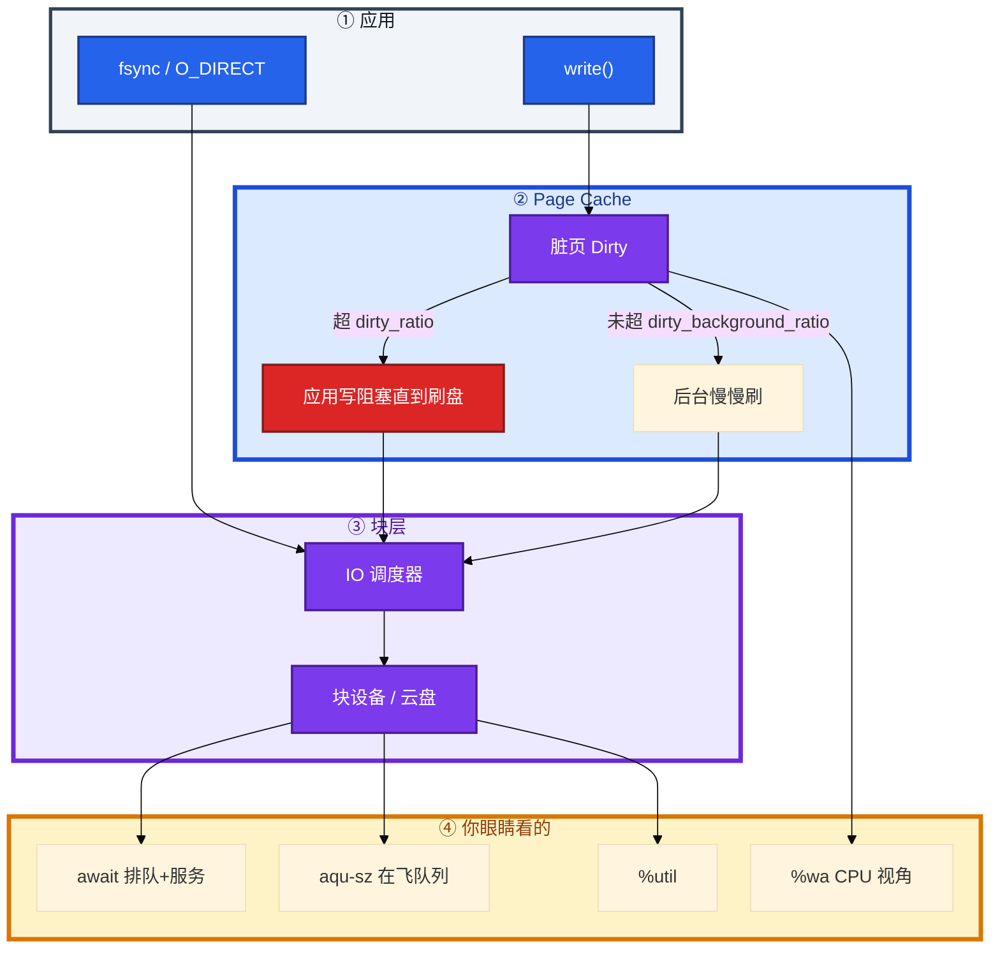
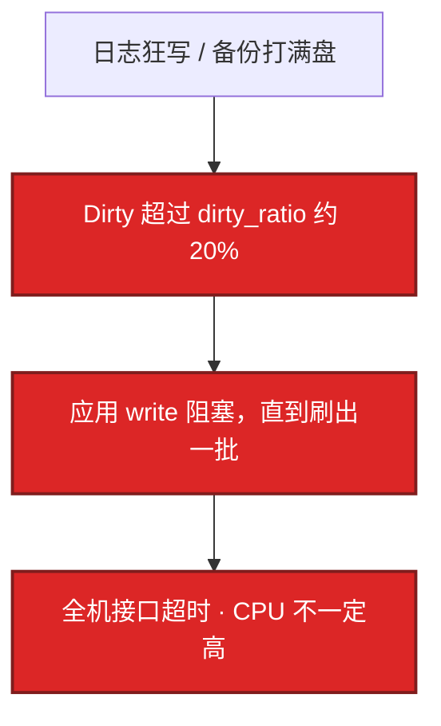
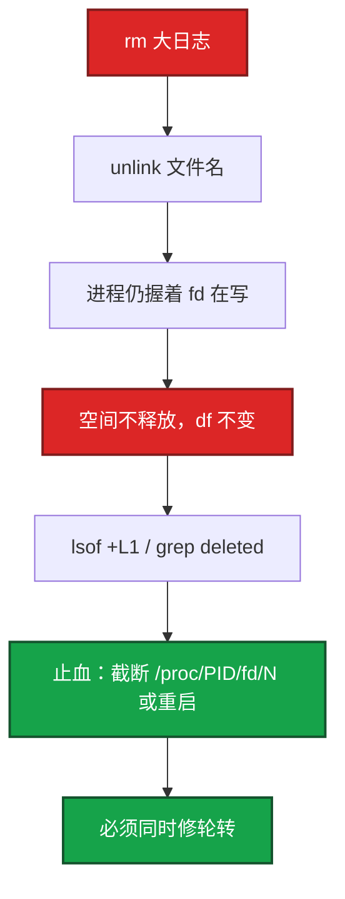
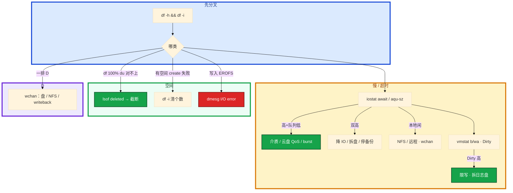

# 磁盘与 IO


活动高峰，逻辑服接口全超时。CPU idle 60%，Load 却很高。有人盯着 `%util` 100% 说盘满了。另一台 `df` 100%，有人刚 `rm` 了 40G 的 `logic.log`，空间一点没降。库盘和日志盘还在同一块盘上，`fsync` 被日志吞 IOPS。

先别动手。这一章后半全是你会动手的：**怎么读 await、脏页怎样把全机 write 堵住、df ≠ du 先查谁、LVM 怎么在线扩、数据库盘为什么选 RAID 10。** 前面的写路径，是为了让你动手时不选错路。

**读完你能：** SSD 看 await + 队列不看 %util 定论；dirty_ratio 一到知道是全机写阻塞；会截断 deleted 日志而不是 rm；会 LVM 在线扩；库盘和日志盘分开。

## 本章目录

缩进 = 上下级。3 下面才是 3.1。

想钉在**正文左边**跟着滚：菜单 **查看 → 打开视图 → 大纲**。Markdown 预览做不到独立左栏，目录只能写在文章开头。

- [1. 基本概念](#1-基本概念)
- [2. 架构图](#2-架构图)
- [3. 原理](#3-原理)
  - [3.1 读 iostat](#31-读-iostat)
  - [3.2 脏页](#32-脏页全机-write-卡住)
  - [3.3 D 与空间类故障](#33-d-与空间类故障)
  - [3.4 `%wa` vs await vs util](#34-wa-vs-await-vs-util)
- [4. 落地](#4-落地)
  - [4.1 LVM 在线扩容](#41-lvm-在线扩容)
  - [4.2 RAID 与文件系统](#42-raid-与文件系统)
- [5. 核心配置](#5-核心配置)
- [6. 常用命令](#6-常用命令)
- [7. 常用操作](#7-常用操作)
- [8. 生产排障](#8-生产排障)
- [9. 必会 · 常考](#9-必会--常考)
- [合上书](#合上书问自己)

**本章不讲：** D 为什么杀不掉、wchan 细节 → [02 进程与信号](../02-进程与信号/)；Load 含 D、%wa 格子 → [03 CPU 与 Load](../03-CPU与Load/)；Dirty 让 available 偏乐观 → [04 内存与 OOM](../04-内存与OOM/)；inode 目录设计、fstab UUID 全文 → [14 文件系统与 inode](../14-文件系统与inode/)；cgroup io.max → [07 cgroup 与容器](../07-cgroup与容器/)；InnoDB flush / Buffer Pool → [01 MySQL](../../03-中间件与数据库/01-MySQL/)；logrotate 策略全文 → [22 日志运维](../22-日志运维/)；etcd WAL fsync 25ms → [etcd](../../04-Kubernetes/02-etcd/)。

---

## 1. 基本概念

默认 buffered：`write()` 进 Page Cache 就返回，后台 writeback。掉电丢脏页。数据库靠 `fsync` / `O_DIRECT` 保证提交。etcd 控制面那条最贵的一步也是 WAL fsync（见 etcd 章）；游戏库盘同一道理——日志和 `fsync` 抢 IOPS，登录会掉。

三个容易混的数：

| 数 | 谁的视角 | 它在说什么 | 不能用来证明什么 |
|----|----------|------------|------------------|
| **`%wa` / iowait** | CPU | 有空闲核且在等 IO 的时间占比 | CPU 打满时 wa 可被挤成 0；不能证明盘快 |
| **await** | 这一笔 IO | 从提交到完成（含排队） | 单独看 util |
| **`%util`** | 盘 | 有请求在处理的时间占比 | SSD 并行时 100% 仍可能吃更多 IO |

SSD / 云盘看 **await + 队列**，不要用 %util 定瓶颈。HDD 才把 %util 近 100% 当饱和信号。NVMe 常见 await **<1–5ms**；**20ms** 要查磨损、RAID、写放大、邻居抢 IOPS。

`write` 返回了数据不一定在盘上。buffered 下在 Page Cache 里。要落盘靠 fsync 或后续 writeback。

> **记住**：write 先堆内存；卡住全机的是脏页刷不出去，不是 %util 那个数字。

---

## 2. 架构图

先把一次写走完。后面 iostat、脏页、LVM、RAID 都对着这张图说话。



LVM 三层（扩容时认清改哪一层）：


---

## 3. 原理

原理只保留动手和面试会用到的：await 怎么读、脏页怎么堵全机、空间类三种现场、三个数为什么对不上。

**本节 4 块：** 3.1 iostat · 3.2 脏页 · 3.3 空间 · 3.4 三数

### 3.1 读 iostat

你怀疑盘慢，跑一行：

```bash
iostat -x 1 3
# 盯 await / r_await / w_await / aqu-sz / %util / r/s w/s
# svctm 已不可靠，别当论据
```

不要先看 `%util`。先看 **await**（一笔 IO 从提交到完成，含排队），再看 **aqu-sz**（同时在飞多少笔）。两个数字组合成型，动作才不同。

| 组合 | 含义 | 动作 |
|------|------|------|
| await 高 + aqu-sz 低 | 盘/云盘本身慢（介质、RAID、QoS 限速） | 换盘/升档、查硬件 |
| await 高 + aqu-sz 高 | 提交太多，在排队 | 降 IO、拆盘、限流备份 |
| HDD %util 近 100% | 有饱和信号 | 当瓶颈候选 |
| SSD %util 100% | 不一定满 | 仍看 await |

云盘常见：IOPS/带宽被限，await 上百毫秒，%util 看起来一般。要对着云监控的吞吐上限看。AWS gp2、部分阿里云盘有 **burst**：额度耗尽后 IOPS 掉到基线，await 从 2ms 变 50ms，看起来「昨天还好今天不行」。对着 burst balance 看，不要只看 iostat 半天。没发版、写入量没翻倍，先怀疑 burst / 邻居。

SSD 写放大：随机小写、接近满盘时 GC。表现 await 升高，换更大盘或改顺序写。盘用到 **85%** 就要当故障处理，不要等 100%。

> **记住**：await 高队列低=盘慢，双高=IO 太多；SSD 不要用 %util 结案。NVMe 上 await 20ms 已经是事故级。

### 3.2 脏页：全机 write 卡住

所有接口一起超时，CPU 没事，Load 高。`/proc/meminfo` 里 Dirty 持续很高，Writeback 跟不上。这不是某一个接口慢，是内核把应用写堵住了。凌晨备份和日志在同一块盘是原形。



| 参数 | 默认直觉 | 踩坑 |
|------|----------|------|
| dirty_background_ratio | ~10% | 超了开始刷 |
| dirty_ratio | ~20% | 超了**应用写阻塞** |
| dirty_expire_centisecs | 30s | 脏页最长躺内存 |

```bash
grep -E 'Dirty|Writeback' /proc/meminfo
```

Dirty 持续高：写入 > 刷盘能力。治理是限写和独立日志盘，不是盲目加大 `dirty_ratio`（加大只是推迟爆炸，爆炸时阻塞更久）。available 这时会偏乐观（[04](../04-内存与OOM/)）。

O_DIRECT：绕过 Cache，避免数据库 Buffer Pool 和 OS Cache 双缓存。代价是延迟对盘更敏感。掉电安全靠 fsync，不靠「write 返回了」。普通日志/文件用 buffered，靠轮转。日志走 O_DIRECT 没有好处，只会把延迟绑死在盘上。InnoDB 具体参数见 MySQL 章。

> **记住**：dirty_ratio 一到，全机写阻塞；加大阈值只是推迟，要限写、拆盘。

### 3.3 D 与空间类故障

三种「看起来像磁盘」的现场，先对号再动手。不要先 `rm` 大日志。

#### 一排 D：杀不掉

D：内核等 IO，`kill -9` 无效（[02](../02-进程与信号/)）。`wchan`：`blk_mq_*` 本地盘，`nfs_wait_*` NFS，`wait_on_page_writeback` 脏页。NFS D 状态 `umount` 卡死用 `umount -l` 懒卸载；长期 soft mount，日志不写 NFS。%wa 高常伴随 D，但 CPU 打满时 wa 可被挤掉，仍以 iostat 为准。本地盘闲、wa 高：远程存储 / NFS，iostat 看不见。

#### df 满、du 不满

`df -h` 100%，`du -sh /*` 加起来对不上。常见原形：有人 `rm` 了 `logic.log` / `catalina.out`，进程还握着 fd 在写。`rm` 只摘文件名，空间等最后一个 fd 关闭才释放。



```bash
lsof +L1 | grep deleted     # 或 lsof | grep '(deleted)'
# 不重启截断：
# > /proc/<PID>/fd/<N>
```

游戏服 `catalina.out` / `logic.log` 被 rm 但进程还写，几十 GB 挂着。正确轮转：`copytruncate` 或让进程 reopen（nginx USR1）。Docker `json-file` 必须配 `max-size` / `max-file`，否则容器层把盘写满。进程继续写会从空文件再涨，必须同时修轮转。

#### 有空间却 create 失败：inode 满

`touch` 报 No space left，`df -h` 却还有空间。看 `df -i`。小文件海（session、邮件队列、overlay2 层）。清文件**个数**，不是清几个大文件。游戏热更如果每个补丁留一层小文件，也会 inode 先死。目录按日期分桶，别在一个目录放百万文件。inode 和数据块是两套配额。大文件只还块，不还那么多 inode。细节在 [14](../14-文件系统与inode/)。

#### 只读挂载

云盘只读、磁盘错误，dmesg 有 I/O error。df 看起来有空间，写入 EROFS。先 `dmesg -T`，不是先加盘。

> **记住**：df ≠ du 先 `lsof deleted` 再截断；有空间仍无法创建看 `df -i`；禁止 rm 大日志当轮转。

### 3.4 `%wa` vs await vs util

| 场景 | wa | await | util | 你走哪条 |
|------|----|-------|------|----------|
| NFS 挂死，本地 NVMe 很闲 | 可能高 | 本地盘低 | 本地盘低 | wchan，不是加盘 |
| CPU 100% 算力打满，盘也慢 | 可能 0 | 高 | 不一定 | 听 await，不要说盘没事 |
| SSD 并行吃满队列 | 不一定高 | 仍低则没瓶颈 | 可能 100% | 不要换盘 |
| 云盘 burst 耗尽 | 不一定 | 2ms→50ms | 一般 | 升档 / 挪备份 |

磁盘慢以 **await** 为准；Load 型先看 b 和 D（[03](../03-CPU与Load/)）；远程 IO 看 wchan，不要只看 wa。

---

## 4. 落地

库盘和日志盘还在同一块盘上。活动高峰 `fsync` 被日志吞 IOPS，登录掉了。先把「谁跟谁抢 IOPS」分开，再谈 RAID 级别。

### 4.1 LVM 在线扩容

`/data` 告警 85%。这是数据盘，不能停服格式化。生产最常用的是在线扩：加一块盘，把 VG/LV 拉长，文件系统跟着长。

三层：物理盘做成 PV，池化进 VG，切出 LV 再格式化挂载。

| 层 | 类比 | 命令前缀 |
|----|------|---------|
| PV | 原材料（磁盘/分区） | `pv*` |
| VG | 资源池 | `vg*` |
| LV | 实际使用的盘 | `lv*` |

创建（一次性）：

```bash
pvcreate /dev/sdb /dev/sdc
vgcreate vg_data /dev/sdb /dev/sdc
lvcreate -l 80%VG -n lv_data vg_data
mkfs.xfs /dev/vg_data/lv_data
mount /dev/vg_data/lv_data /data
# fstab 用 UUID 或 /dev/vg_data/lv_data，不要用 /dev/sdb1（14）
```

在线扩容（生产最常用，不需要停服）：

```bash
# /data 不够了，加一块新盘 /dev/sdd
pvcreate /dev/sdd
vgextend vg_data /dev/sdd
lvextend -L +100G /dev/vg_data/lv_data
# 或用全部剩余：lvextend -l +100%FREE /dev/vg_data/lv_data
xfs_growfs /data                    # XFS，针对挂载点
# resize2fs /dev/vg_data/lv_data    # ext4
df -h /data
```

XFS / ext4 都支持在线扩。XFS **不支持缩容**；ext4 可以 shrink。需要缩容就选 ext4，或新建 LV 迁数据。LVM 本身不做冗余，坏盘靠 RAID 或云盘副本。快照：`lvcreate -s`，常用于备份前一致性快照。

查看：`pvs` / `vgs` / `lvs` / `pvdisplay` / `lsblk`。

> **记住**：在线扩：pvcreate → vgextend → lvextend → xfs_growfs；XFS 不能缩。

### 4.2 RAID 与文件系统

| RAID | 最少盘 | 容错 | 读 | 写 | 用途 |
|------|--------|------|----|----|------|
| RAID 0 | 2 | 无 | 高 | 高 | 临时/测试，坏一块全丢 |
| RAID 1 | 2 | 1 块 | 高 | 持平 | 系统盘 / 重要小数据 |
| RAID 5 | 3 | 1 块 | 高 | 有惩罚 | 文件服务，省钱 |
| RAID 10 | 4 | 各镜像 1 块 | 高 | 高 | 数据库 / 高 IO，生产推荐 |

| 场景 | 推荐 | 原因 |
|------|------|------|
| 数据库盘 | RAID 10 | 写性能好，容错强；RAID 5 写要算校验 |
| 普通文件服务 | RAID 5 | 成本低 |
| 对象存储节点 | 不用 RAID | 软件层副本 / EC |
| 云盘 | 不用配 RAID | 厂商底层已冗余，再做浪费 |
| 游戏日志盘 | RAID 0 或不 RAID | 日志丢了可接受，要性能 |

能先 RAID 再在 RAID 设备上建 LVM。重建期 IOPS 腰斩，要当成变更窗口。单盘 await 低、逻辑卷高，查写惩罚和重建。

| 维度 | XFS | ext4 |
|------|-----|------|
| 大文件 | 更好（并行分配） | 一般 |
| 小文件 | 一般 | 更好 |
| 在线扩容 | 支持 | 支持 |
| 在线缩容 | **不支持** | 支持 |
| RHEL 8+ 默认 | 是 | 否 |
| 游戏日志盘 / 数据库盘 | 推荐 | 可用 |

生产新建默认 XFS，除非需要缩容选 ext4。

库盘要独立，避免和逻辑服日志抢 IOPS。`innodb_io_capacity` 按真实 IOPS 的约 **70%** 配——具体 InnoDB 参数在 MySQL 章，这里只要求「库盘和日志盘分开」。etcd 同样：和游戏日志同盘，WAL fsync 打到几百毫秒，看起来像 API 挂了。

容量规划：游戏日志按「峰值 CCU × 每玩家每分钟日志字节」估盘，留 **40%** 空闲给 inode 和突发。活动前把日志盘和数据盘水位都列入开服检查。盘用到 85% 当故障。

> **记住**：数据库盘 RAID 10（云上不自建 RAID）；新建 FS 默认 XFS；库盘和日志盘分开。

---

## 5. 核心配置

云盘突然变慢，有人把调度器从 `none` 改成 cfq。先别调这个：云盘 QoS 在 hypervisor，调度器救不了 burst 耗尽。

| 参数 | 默认直觉 | 生产怎么用 | 改错会怎样 |
|------|----------|------------|------------|
| IO 调度器 | SSD/云盘 `none` | **保持 none**（多队列，内核不再二次排队） | 调成 cfq 在 SSD 上平白加延迟 |
| HDD 调度器 | `mq-deadline` | HDD 才考虑 | 云盘改这个救不了 QoS |
| dirty_ratio | ~20% | 一般不动；根因是限写、拆盘 | 加大只推迟，爆炸阻塞更久 |
| dirty_background_ratio | ~10% | 一般不动 | 同上 |
| Docker json-file | 无限 | **max-size / max-file** | 容器把节点盘写满 |
| 日志落盘 | 本地 | 不要 NFS | 一抖全员 D |
| innodb_io_capacity | 常被写太大 | 真实 IOPS 的 ~70% | 和日志抢 IOPS |

查调度器：`cat /sys/block/nvme0n1/queue/scheduler`。

日志轮转：`logrotate` 的 `copytruncate` 适合不会 reopen 的进程；能 USR1/HUP reopen 更好（nginx）。全文在 [22](../22-日志运维/)。

cgroup `io.max` 做 IO 隔离，见 [07](../07-cgroup与容器/)。凌晨全服备份打同一块数据盘，逻辑服 P99 从 20ms → 2s，就是共享盘无隔离。

> **记住**：SSD/云盘调度器用 none；云盘突然变慢先看 burst，不要先改 cfq。

---

## 6. 常用命令

```bash
df -h && df -i
iostat -x 1 5
vmstat 1 5                  # b 和 wa；丢掉第一行
iotop -o
pidstat -d
lsof +L1 | grep deleted
ps aux | awk '$8 ~ /D/'
cat /proc/<PID>/wchan
grep -E 'Dirty|Writeback' /proc/meminfo
cat /sys/block/<dev>/queue/scheduler
pvs; vgs; lvs; lsblk
```

| 目的 | 命令 | 看什么 |
|------|------|--------|
| 空间 / inode | `df -h` `df -i` | 满了还是个数满了 |
| 盘慢分型 | `iostat -x` | await + aqu-sz，不是先看 util |
| 谁在写 | `iotop -o` / `pidstat -d` | 备份？日志？ |
| deleted | `lsof +L1` | rm 了还在写 |
| D | wchan / stack | nfs / blk_mq / writeback |
| 脏页 | meminfo Dirty | 持续高 = 写 > 刷 |
| 调度器 | `/sys/block/.../scheduler` | SSD 应为 none |
| LVM | pvs/vgs/lvs | 扩容前看剩余 |

---

## 7. 常用操作

游戏服日志把盘写满，止血顺序：

1. 截断正在写的日志（不要 rm）。
2. 确认 df 下降。
3. 调日志级别 / 轮转；查 deleted。
4. 同时 `df -i`，防止 inode 也满。

在线扩：`pvcreate` → `vgextend` → `lvextend` → `xfs_growfs`（XFS 针对挂载点）或 `resize2fs`（ext4）。全程不需要停服。

把写日志从 NFS 改本地。停备份、摘掉打满云盘的任务。库盘独立。备份错峰，或 cgroup `io.max`。

---

## 8. 生产排障



游戏事故：

- 凌晨全服备份打同一块数据盘，逻辑服 P99 从 20ms → 2s，Load 高、wa 高。根因是共享盘无 IO 隔离。治理：备份错峰、cgroup `io.max`、日志盘与数据盘分离。
- 开服热更包落盘 + 全服写登录日志，inode 或空间先满。发布检查 `df -h/-i` 和日志轮转是开服 checklist，不是「磁盘很大就行」。
- 逻辑服与库同盘：fsync 被日志吞 IOPS，活动高峰掉登录。库盘独立。

根因方向：写放大（日志级别、没轮转）、共享盘无 QoS、inode 目录设计。

| 现象 | 先做什么 | 不要做什么 |
|------|----------|------------|
| 接口超时 CPU 闲 Load 高 | iostat await；Dirty；D | 先看 %util 换 SSD |
| SSD %util 100%、await 2ms | 不是瓶颈 | 换盘 |
| 云盘昨天 2ms 今天 50ms | burst / IOPS 上限 | 改 cfq |
| df 100%、刚 rm 过日志 | lsof deleted，截断 | 再 rm |
| 有空间 touch 失败 | df -i | 清几个大日志 |
| 一排 D、本地 iostat 干净 | wchan NFS | kill -9、加 CPU |
| Dirty 很高全机卡 | 限写、拆盘 | 加大 dirty_ratio |
| /data 85% | LVM 在线扩 | 停服格式化 |
| 库和日志同盘登录掉 | 拆盘 | 先调 innodb 当唯一手段 |

---

## 9. 必会 · 常考

白板和追问高频，能一口回：

| 说法 | 对错 | 口径 |
|------|:----:|------|
| SSD %util 100% 就是盘满了 | 错 | 看 await + 队列 |
| wa 高一定是本地盘慢 | 错 | NFS 也会；CPU 打满 wa 可为 0 |
| wa 为 0 说明盘快 | 错 | 听 await |
| NVMe await 20ms 正常 | 错 | 事故级，常见 <1–5ms |
| write 返回了就在盘上 | 错 | buffered 在 Page Cache；靠 fsync |
| 日志也改 O_DIRECT 更安全 | 错 | 只把延迟绑死在盘上 |
| 加大 dirty_ratio 当优化 | 错 | 推迟爆炸，阻塞更久 |
| rm 大日志就能立刻腾空间 | 错 | fd 还在写；截断或重启 |
| 有空间就不会 No space left | 错 | inode 满，看 df -i |
| D 状态 kill -9 | 错 | 修 IO（02） |
| 云盘变慢先改调度器 | 错 | 先看 burst；SSD 用 none |
| 云上再做 RAID 10 | 错 | 底层已冗余，浪费 |
| 数据库盘 RAID 5 省一块 | 错 | 写惩罚；生产 RAID 10 |
| XFS 能在线缩 | 错 | 只能扩；缩选 ext4 或迁 |
| 库盘和日志盘可以共用 | 错 | fsync 被日志吞 IOPS |

数字：NVMe await **<1–5ms**，20ms 事故；dirty_background **~10%**、dirty_ratio **~20%**、expire **30s**；盘 **85%** 当故障；日志留 **40%** 空闲；`innodb_io_capacity` ≈ 真实 IOPS **70%**；游戏服 grace 刷盘量见 02。

易混：%wa vs await vs %util；await 高队列低 vs 双高；df vs du vs df -i；buffered vs O_DIRECT vs fsync；RAID 5 vs 10；XFS 扩 vs 缩；调度器 vs 云盘 QoS。

---

## 合上书，问自己

1. 一次 write 经过哪？SSD 看 await 还是 %util？三个数 wa / await / util 各是谁的视角？
2. dirty_ratio 触发后应用会怎样？加大阈值行不行？
3. df ≠ du 先查什么？有空间却 create 失败呢？禁止用 rm 当轮转的原因？
4. LVM 在线扩四步？XFS 能缩吗？
5. 数据库盘 RAID 几？云上还要自己做 RAID 吗？库盘和日志盘为什么要分开？
6. 云盘昨天 2ms 今天 50ms 先怀疑什么？SSD 调度器怎么选？

六题都能口述，这一章就过了。inode / fstab / UUID 的文件系统细节在 14；D 状态信号在 02。
