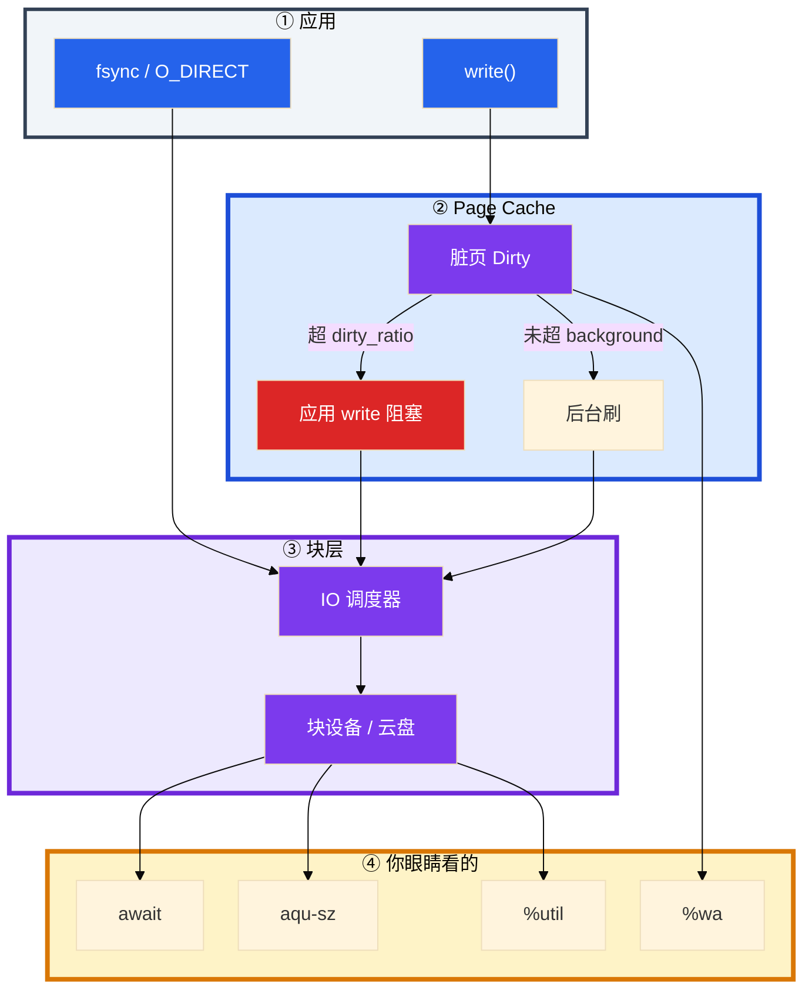
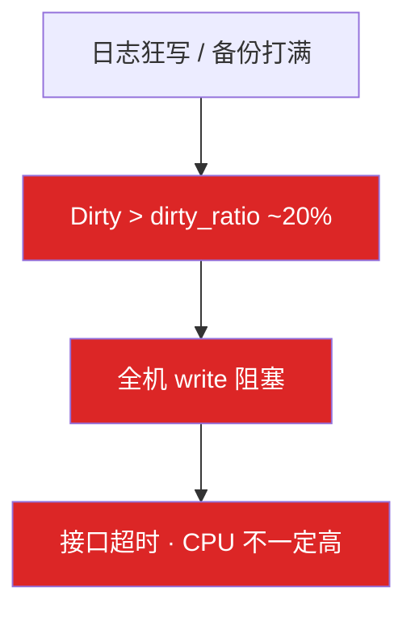
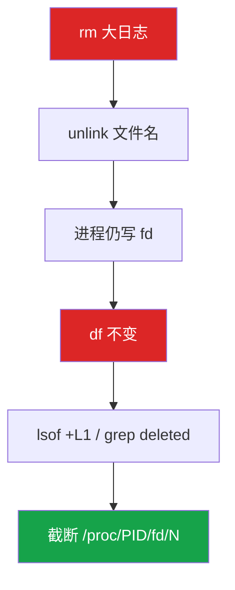
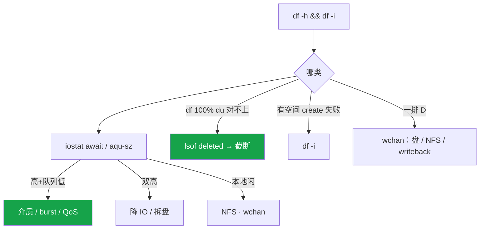

# 磁盘与 IO


活动高峰接口全超时，CPU idle 60%，Load 却很高。有人盯 `iostat` 里 `%util` 100% 喊换 SSD；另一台 `df` 100%，运维刚 `rm` 了 40G 日志空间却没降，还在疯狂写。这一章只做一件事——**SSD 看 await 不看 util 定论，df ≠ du 先查 deleted**。

**本章主线（排障就按这三步想）：**

1. **读 iostat**：await + aqu-sz 分型；SSD 不用 %util 结案；CPU 打满时 wa 可为 0。
2. **认写路径**：脏页超 dirty_ratio → 全机 write 阻塞；write 返回 ≠ 在盘上。
3. **空间三类**：df≠du → lsof deleted；有空间 create 失败 → df -i；一排 D → wchan。

**读完你能：** SSD 看 await + 队列；dirty_ratio 一到知道全机写阻塞；截断 deleted 日志不 rm；LVM 在线扩；库盘和日志盘分开。

## 本章目录

- [1. 基本概念](#1-基本概念)
- [2. 架构图](#2-架构图)
- [3. 原理](#3-原理)
- [4. 落地](#4-落地)
- [5. 核心配置](#5-核心配置)
- [6. 命令与操作](#6-命令与操作)
- [7. 生产排障](#7-生产排障)
- [8. 必会 · 常考](#8-必会--常考)
- [合上书](#合上书问自己)

**本章不讲：** D 杀不掉、wchan → [02](../02-进程与信号/)；Load 含 D、%wa → [03](../03-CPU与Load/)；Dirty 让 available 偏乐观 → [04](../04-内存与OOM/)；inode/fstab UUID → [14](../14-文件系统与inode/)；cgroup io.max → [07](../07-cgroup与容器/)；InnoDB flush → [01 MySQL](../../03-中间件与数据库/01-MySQL/)；logrotate → [22](../22-日志运维/)；etcd WAL → [etcd](../../04-Kubernetes/02-etcd/)。

---

## 1. 基本概念

磁盘排障不是看 `%util` 是不是 100%。**值班里什么时候碰到**：接口超时但 CPU 闲、Load 高、`df` 满、`rm` 了日志空间不降、一排进程 D 状态、`touch` 报 No space 但 `df -h` 还有空间——先分型，再动手。

| 值班现象 | 技术含义 | 你的第一刀 |
|----------|----------|------------|
| 接口超时 CPU 闲 Load 高 | 可能在等 IO | `iostat -x` await + aqu-sz |
| SSD %util 100% | 不一定满 | 仍看 await |
| rm 40G 日志 df 不变 | deleted 文件 fd 还在写 | `lsof +L1` |
| 有空间 touch 失败 | inode 满 | `df -i` |
| kill -9 无效一排 D | 不可中断 IO | wchan |

默认 buffered：`write()` 进 Page Cache 就返回，后台 writeback。数据库靠 `fsync` / `O_DIRECT` 保证提交。

三个容易混的数：

| 数 | 视角 | 说什么 | 不能证明什么 |
|----|------|--------|--------------|
| **`%wa` / iowait** | CPU | 有空闲核且在等 IO | CPU 打满时 wa 可为 0 |
| **await** | 单笔 IO | 提交到完成（含排队） | 单独看 util |
| **`%util`** | 盘 | 有请求在处理的时间占比 | SSD 并行时 100% 仍能吃更多 |

SSD / 云盘看 **await + 队列**，不用 %util 定瓶颈。NVMe await **<1–5ms**；**20ms** 是事故级。

**打个比方**：`write()` 像把货先堆在仓库（Page Cache），单子签了就返回——真正上卡车（落盘）是后台 writeback；`%util` 像看卸货口有没有人在搬，SSD 有多个卸货口并行，口子上 100% 忙不代表车都堵死了；**await** 才是「一单货从下单到签收」的真实耗时。

> **记住**：write 先堆内存；卡住全机的是脏页刷不出去，不是 %util。

**面试怎么说**：「SSD 我不看 util 定论，看 await 和 aqu-sz；wa 是 CPU 视角，CPU 打满时 wa 可以为 0；write 返回了不代表在盘上。」

---

## 2. 架构图

后面 iostat、脏页、空间故障都对着这张图。



LVM 三层：


**读图三句话：**

1. `write` 返回快是因为进了 cache，IOPS 在 writeback 爆——接口超时可能是脏页阻塞，不是某一个接口慢。
2. dirty_ratio 一到，**全机 write 阻塞**，P99 全抖。
3. LVM 在线扩：PV → VG → LV → xfs_growfs；XFS 不能缩。

---

## 3. 原理

### 3.1 读 iostat：await 才是盘慢的证据

**一句话：** 先看 await 和 aqu-sz 分型，不要先看 %util。

**打个比方**：await 是快递从下单到签收的总时间；aqu-sz 是仓库门口排队长度；%util 是卸货口有没有人在搬——SSD 有多个口并行，口子上 100% 忙不代表每单都慢。

**现场走一遍**（活动高峰接口超时，CPU idle 60%）：

1. 在业务节点敲：

```bash
iostat -x 1 3
```

2. 屏幕出现（盯 await / r_await / w_await / aqu-sz / %util）：

```text
Device   r/s   w/s  rkB/s  wkB/s  r_await w_await  await  aqu-sz  %util
nvme0n1  120  8900  4800  72000   0.8    45.2    45.2   402.1   98.5
```

3. **口算读数**：await **45ms**（事故级，正常 NVMe **<1–5ms**）+ aqu-sz **402** → 提交太多在**排队**，不是盘介质本身坏了。
4. 动作：降 IO（停备份、限日志级别）、拆盘（库盘和日志盘分离）、限流——不是换 SSD。
5. 若 await 高 + aqu-sz 低 → 盘/云盘本身慢或 burst 耗尽，对着云盘 burst balance 看。
6. HDD %util 近 100% 可当饱和信号；SSD %util 100% 但 await 2ms → **不是瓶颈**。

**输出解读**：

| 组合 | 含义 | 动作 |
|------|------|------|
| await 高 + aqu-sz 低 | 盘/云盘本身慢 | 换盘/升档 |
| await 高 + aqu-sz 高 | 提交太多在排队 | 降 IO、拆盘、限流备份 |
| HDD %util 近 100% | 饱和信号 | 当瓶颈 |
| SSD %util 100% | 不一定满 | 仍看 await |

云盘 burst 耗尽：await 从 2ms 变 50ms，对着 burst balance 看。盘用到 **85%** 当故障。SSD 写放大：随机小写、接近满盘时 GC，表现 await 升高。`svctm` 已不可靠，别看。

**面试怎么说**：「接口超时 CPU 闲，我先 iostat 看 await 和 aqu-sz；45ms + 队列 402 是提交太多在排队，降 IO 拆盘，不是 util 100% 就换盘。」

> **记住**：SSD 看 await + 队列，不用 %util 定论。

### 3.2 脏页：全机 write 卡住

**一句话：** Dirty 超 dirty_ratio（~20%）→ 应用 write 阻塞直到刷出一批。

**打个比方**：脏页像厨房水槽里堆的待洗碗——background 是洗碗机慢慢洗；dirty_ratio 到顶像水槽满了，**新水龙头（write）直接关死**，全店（全机）都不能接水。

**现场走一遍**（开服热更 + 全服写登录日志，接口突然全超时）：

1. 查脏页和 meminfo：

```bash
grep -E 'Dirty|Writeback' /proc/meminfo
iostat -x 1 3
```

2. 屏幕出现：

```text
Dirty:         12582912 kB
Writeback:       524288 kB
```

3. Dirty 约 12G，接近内存 20%（dirty_ratio 默认 ~20%）→ **应用 write 开始阻塞**，接口超时，CPU 不一定高。
4. `iotop -o` 看谁在大写——往往是日志、备份、热更包落盘。
5. 治理：限写、独立日志盘、备份错峰——**不是**盲目加大 dirty_ratio（推迟爆炸，阻塞更久）。

**输出解读**：



| 参数 | 默认 | 踩坑 |
|------|------|------|
| dirty_background_ratio | ~10% | 超了开始刷 |
| dirty_ratio | ~20% | 超了**应用写阻塞** |
| dirty_expire_centisecs | 30s | 脏页最长躺内存 |

available 这时会偏乐观（[04](../04-内存与OOM/)）。O_DIRECT：绕过 Cache，避免数据库 Buffer Pool 和 OS Cache 双缓存；代价是延迟对盘更敏感。掉电安全靠 fsync，不靠「write 返回了」。普通日志/文件用 buffered，靠轮转。日志走 O_DIRECT 没有好处，只会把延迟绑死在盘上。

**面试怎么说**：「Dirty 超 dirty_ratio 全机 write 阻塞，不是某一个接口慢；我限写和拆盘，不加 dirty_ratio 当优化。」

### 3.3 D 与空间类故障：三种「像磁盘」的现场

**一句话：** 三种「像磁盘」的现场先对号——D 杀不掉、df≠du、inode 满。

**打个比方**：df≠du 像删了门牌号但租客还在屋里写东西——空间统计不变；inode 满像电话簿号码用完了——还有空房间也打不了新电话；D 状态像人卡在旋转门里——`kill -9` 推不动，得修门（IO 路径）。

#### 现场走一遍 A：df 满、du 不满

1. 运维 `rm` 了 40G 日志，df 还是 100%：

```bash
df -h /var/log
lsof +L1 | grep deleted
```

2. 屏幕出现：

```text
/dev/nvme0n1p2  100G  100G     0  100% /var/log
java    28451  ...  /var/log/app.log (deleted)
```

3. `rm` 只摘文件名（unlink），进程还握着 fd 在写 → **df 不变**。
4. 止血：`> /proc/28451/fd/3`（截断 fd，**不要 rm**）。
5. 正确轮转：`copytruncate` 或 USR1 reopen。Docker `json-file` 必须 `max-size` / `max-file`。



#### 现场走一遍 B：有空间 create 失败

1. `df -h` 还有 20% 空间，`touch /tmp/x` 报 No space left on device：

```bash
df -h /tmp
df -i /tmp
```

2. `df -i` 显示 IUse% **100%** → **inode 满**，不是字节满。
3. 小文件海、overlay2 层——清文件**个数**，不是删几个大日志。

#### 现场走一遍 C：一排 D

1. `ps aux | awk '$8 ~ /D/'` 一排 D，`kill -9` 无效 → [02](../02-进程与信号/)。
2. 看 wchan：

```bash
cat /proc/<PID>/wchan
```

3. `blk_mq_*` → 本地盘；`nfs_wait_*` → NFS；`wait_on_page_writeback` → 脏页刷盘卡。

只读挂载：云盘只读、磁盘错误，dmesg 有 I/O error。df 看起来有空间，写入 EROFS。先 `dmesg -T`，不是先加盘。

本地盘闲、wa 高：远程存储 / NFS，iostat 看不见。%wa 高常伴随 D，但 CPU 打满时 wa 可被挤掉，仍以 iostat 为准。

**面试怎么说**：「df 满 du 对不上我先 lsof deleted 再截断 fd，禁止 rm 大日志；有空间 touch 失败看 df -i；一排 D 看 wchan 分本地盘、NFS、脏页。」

> **记住**：df ≠ du 先 `lsof deleted` 再截断；有空间仍无法创建看 `df -i`；禁止 rm 大日志当轮转。

### 3.4 `%wa` vs await vs util：三个视角别混

**一句话：** 磁盘慢以 await 为准；远程 IO 看 wchan，不要只看 wa。

**打个比方**：wa 像前台说「有几个客户在等」——前台满员（CPU 100%）时可能报 0 个在等，但仓库（盘）其实堵了；await 是每单真实耗时；util 是卸货口忙碌比例。

**现场走一遍**（NFS 挂死，本地 NVMe iostat 很干净）：

1. 看 CPU 和本地盘：

```bash
vmstat 1 5
iostat -x 1 3
cat /proc/<PID>/wchan
```

2. 本地 nvme await 2ms、util 5%，但 vmstat 里 **wa 15%**，进程 wchan 是 `nfs_wait_*`。
3. 结论：**远程 NFS 慢**，本地 iostat 看不见——走 wchan 分支，不是换本地 SSD。
4. 另一场景：CPU 100%、盘 await 20ms、wa 显示 0 → CPU 打满时 wa 可被挤掉，**听 await**。

**输出解读**：

| 场景 | wa | await | util | 走哪条 |
|------|----|-------|------|--------|
| NFS 挂死，本地 NVMe 闲 | 可能高 | 本地低 | 本地低 | wchan |
| CPU 100%，盘也慢 | 可能 0 | 高 | 不一定 | 听 await |
| SSD 并行吃满 | 不一定高 | 仍低则没瓶颈 | 可能 100% | 不换盘 |
| 云盘 burst 耗尽 | 不一定 | 2ms→50ms | 一般 | 升档 |

**面试怎么说**：「wa 是 CPU 视角，打满时 wa 可以为 0；远程 IO 本地 iostat 干净，我看 wchan；定瓶颈以 await 为准。」

---

## 4. 落地

### 4.1 LVM 在线扩容

**一句话：** pvcreate → vgextend → lvextend → xfs_growfs；XFS 不能缩。

**现场走一遍**（/data 用到 85%，需要加 100G）：

```bash
# 创建（一次性）
pvcreate /dev/sdb /dev/sdc
vgcreate vg_data /dev/sdb /dev/sdc
lvcreate -l 80%VG -n lv_data vg_data
mkfs.xfs /dev/vg_data/lv_data
mount /dev/vg_data/lv_data /data
# fstab 用 UUID（14）

# 在线扩容
pvcreate /dev/sdd
vgextend vg_data /dev/sdd
lvextend -L +100G /dev/vg_data/lv_data
xfs_growfs /data                    # XFS 针对挂载点
# resize2fs /dev/vg_data/lv_data    # ext4
df -h /data
```

查看：`pvs` / `vgs` / `lvs` / `lsblk`。

### 4.2 RAID 与文件系统

| RAID | 容错 | 用途 |
|------|------|------|
| RAID 0 | 无 | 临时/测试 |
| RAID 1 | 1 块 | 系统盘 |
| RAID 5 | 1 块 | 文件服务，写有惩罚 |
| RAID 10 | 4 块各镜像 1 块 | 高 IO | **数据库 / 高 IO，生产推荐** |
| 云盘 | — | 厂商已冗余 | **不用自建 RAID** |
| 游戏日志盘 | — | — | RAID 0 或不 RAID，丢了可接受 |

| 场景 | 推荐 | 原因 |
|------|------|------|
| 数据库盘 | RAID 10 | 写性能好；RAID 5 写要算校验 |
| 普通文件服务 | RAID 5 | 成本低 |
| 对象存储节点 | 不用 RAID | 软件层副本 / EC |

能先 RAID 再在 RAID 设备上建 LVM。重建期 IOPS 腰斩，要当成变更窗口。

| 维度 | XFS | ext4 |
|------|-----|------|
| 大文件 | 更好 | 一般 |
| 在线扩 | 支持 | 支持 |
| 在线缩 | **不支持** | 支持 |
| RHEL 8+ 默认 | 是 | 否 |

库盘独立，避免和日志抢 IOPS。`innodb_io_capacity` ≈ 真实 IOPS **70%**（MySQL 章）。日志盘留 **40%** 空闲；盘 **85%** 当故障。

---

## 5. 核心配置

| 参数 | 生产怎么用 | 改错会怎样 |
|------|------------|------------|
| IO 调度器 SSD/云盘 | **none** | 改 cfq 平白加延迟 |
| dirty_ratio | 一般不动 | 加大只推迟，阻塞更久 |
| Docker json-file | **max-size / max-file** | 容器把节点盘写满 |
| 日志落盘 | 本地 | NFS 一抖全员 D |
| innodb_io_capacity | 真实 IOPS ~70% | 和日志抢 IOPS |

查调度器：`cat /sys/block/nvme0n1/queue/scheduler`。云盘变慢先看 burst，不要先改 cfq。

cgroup `io.max` 做 IO 隔离，见 [07](../07-cgroup与容器/)。凌晨全服备份打同一块数据盘，逻辑服 P99 从 20ms → 2s，就是共享盘无隔离。

日志轮转：`logrotate` 的 `copytruncate` 适合不会 reopen 的进程；能 USR1/HUP reopen 更好（nginx）。全文在 [22](../22-日志运维/)。

> **记住**：SSD/云盘调度器用 none；库盘和日志盘分开。

---

## 6. 命令与操作

### 6.1 命令速查

```bash
df -h && df -i
iostat -x 1 5
vmstat 1 5                  # b 和 wa；丢掉第一行
iotop -o
pidstat -d
lsof +L1 | grep deleted
ps aux | awk '$8 ~ /D/'
cat /proc/<PID>/wchan
grep -E 'Dirty|Writeback' /proc/meminfo
cat /sys/block/<dev>/queue/scheduler
pvs; vgs; lvs; lsblk
```

| 目的 | 命令 | 看什么 | 正常/异常 |
|------|------|--------|-----------|
| 空间 / inode | `df -h` `df -i` | 满了还是个数满 | IUse% 100% = inode 满 |
| 盘慢分型 | `iostat -x` | await + aqu-sz | await >20ms 事故级 |
| 谁在写 | `iotop -o` / `pidstat -d` | 备份？日志？ | 热更/备份高峰 |
| deleted | `lsof +L1` | rm 了还在写 | (deleted) 标记 |
| D | wchan / stack | nfs / blk_mq / writeback | kill -9 无效 |
| LVM 扩容 | pvs/vgs/lvs | 扩容前看剩余 | xfs_growfs 对挂载点 |

### 6.2 日志盘满止血

1. 截断正在写的日志（**不要 rm**）→ `> /proc/PID/fd/N`。
2. 确认 df 下降 → 调日志级别 / 轮转 → 查 `df -i`。
3. 写日志从 NFS 改本地；备份错峰或 cgroup `io.max`。

容量规划：游戏日志按「峰值 CCU × 每玩家每分钟日志字节」估盘，留 **40%** 空闲。盘用到 **85%** 当故障。库盘要独立，避免和逻辑服日志抢 IOPS。

---

## 7. 生产排障

三问：是盘慢？是空间/inode？还是 D 卡死？



**游戏事故复盘：**

1. 凌晨全服备份打同一块数据盘，逻辑服 P99 从 20ms → 2s，Load 高、wa 高。根因是共享盘无 IO 隔离。治理：备份错峰、cgroup `io.max`、日志盘与数据盘分离。
2. 开服热更包落盘 + 全服写登录日志，inode 或空间先满。发布检查 `df -h/-i` 和日志轮转是开服 checklist。
3. 逻辑服与库同盘：fsync 被日志吞 IOPS，活动高峰掉登录。库盘独立。etcd 和游戏日志同盘，WAL fsync 打到几百毫秒，看起来像 API 挂了。

根因方向：写放大（日志级别、没轮转）、共享盘无 QoS、inode 目录设计。

| 现象 | 先做 | 别做 |
|------|------|------|
| 接口超时 CPU 闲 Load 高 | iostat await；Dirty；D | 先看 %util 换 SSD |
| SSD %util 100%、await 2ms | 不是瓶颈 | 换盘 |
| 云盘 2ms→50ms | burst / IOPS 上限 | 改 cfq |
| df 100%、刚 rm 日志 | lsof deleted，截断 | 再 rm |
| 有空间 touch 失败 | df -i | 清几个大日志 |
| 一排 D、本地 iostat 干净 | wchan NFS | kill -9 |
| Dirty 很高全机卡 | 限写、拆盘 | 加大 dirty_ratio |
| /data 85% | LVM 在线扩 | 停服格式化 |

---

## 8. 必会 · 常考

| 说法 | 对错 | 口径 |
|------|:----:|------|
| SSD %util 100% 就是盘满了 | 错 | 看 await + 队列 |
| wa 高一定是本地盘慢 | 错 | NFS 也会；CPU 打满 wa 可为 0 |
| wa 为 0 说明盘快 | 错 | 听 await |
| NVMe await 20ms 正常 | 错 | 事故级，常见 <1–5ms |
| write 返回了就在盘上 | 错 | buffered 在 Page Cache |
| 日志也改 O_DIRECT 更安全 | 错 | 只把延迟绑死在盘上 |
| 加大 dirty_ratio 当优化 | 错 | 推迟爆炸，阻塞更久 |
| rm 大日志就能腾空间 | 错 | fd 还在写；截断或重启 |
| 有空间就不会 No space left | 错 | inode 满，看 df -i |
| D 状态 kill -9 | 错 | 修 IO（02） |
| 云盘变慢先改调度器 | 错 | 先看 burst；SSD 用 none |
| 云上再做 RAID 10 | 错 | 底层已冗余 |
| 数据库盘 RAID 5 省一块 | 错 | 写惩罚；生产 RAID 10 |
| XFS 能在线缩 | 错 | 只能扩 |
| 库盘和日志盘可以共用 | 错 | fsync 被日志吞 IOPS |

数字：NVMe await **<1–5ms**，20ms 事故；dirty_background **~10%**、dirty_ratio **~20%**、expire **30s**；盘 **85%** 当故障；日志留 **40%** 空闲；`innodb_io_capacity` ≈ 真实 IOPS **70%**。

易混：%wa vs await vs %util；await 高队列低 vs 双高；df vs du vs df -i；buffered vs fsync；RAID 5 vs 10；XFS 扩 vs 缩。

---

## 合上书，问自己

1. 一次 write 经过哪？SSD 看 await 还是 %util？wa / await / util 各是谁的视角？
2. dirty_ratio 触发后应用会怎样？加大阈值行不行？
3. df ≠ du 先查什么？有空间却 create 失败呢？
4. LVM 在线扩四步？XFS 能缩吗？
5. 数据库盘 RAID 几？云上还要自己做 RAID 吗？库盘和日志盘为什么要分开？
6. 云盘昨天 2ms 今天 50ms 先怀疑什么？SSD 调度器怎么选？

六题能口述，这一章就过了。inode / fstab / UUID 细节在 [14](../14-文件系统与inode/)；D 状态信号在 [02](../02-进程与信号/)。
