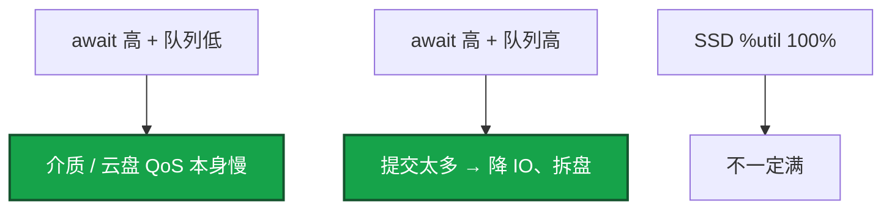
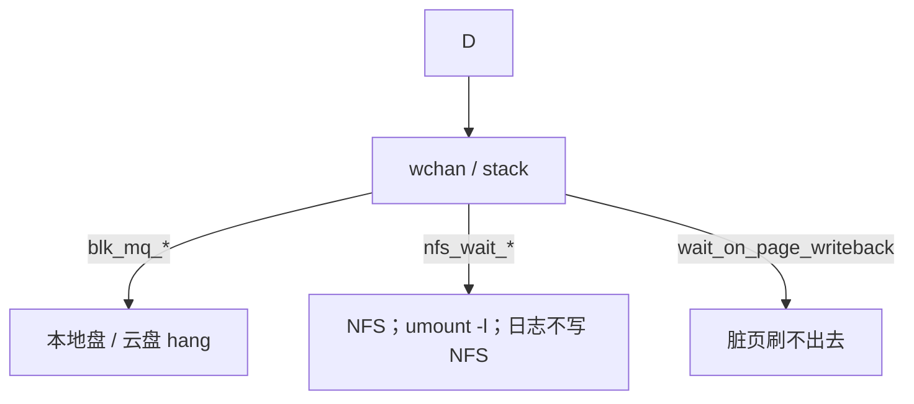

# 05｜磁盘与 IO · 练习题

先对照 [知识点](知识点.md) **本章主线** 自己口述，再对答案。关键字（await、%util、dirty_ratio、lsof deleted、df -i）要能分型。每题标了覆盖范围：

| 标记 | 含义 |
|------|------|
| **核心** | 不懂整章就没建立起来 |
| **必会** | 值班和面试都要能讲 |
| **常用** | 线上会反复碰到 |
| **常考** | 白板和追问的高频口径 |

## 本题目录

- [Q1 iostat 三字段](#q1)
- [Q2 df ≠ du](#q2)
- [Q3 inode 满](#q3)
- [Q4 D 与 %wa](#q4)
- [Q5 dirty_ratio](#q5)
- [Q6 buffered vs O_DIRECT](#q6)
- [Q7 %wa 不一定是盘](#q7)
- [Q8 日志打满止血](#q8)
- [Q9 LVM 在线扩](#q9)
- [Q10 RAID](#q10)
- [Q11 云盘 burst](#q11)
- [合上书](#合上书)

---

## Q1

**★★★★★｜iostat 的 await、aqu-sz、%util 怎么读？SSD 看哪个？**

**覆盖**：核心 · 必会 · 常用

**对应**：知识点 §3.1

### 场景

NVMe 数据盘 `%util` 100%，有人说盘满了要换。await 2ms，aqu-sz 不高。另一块云盘 await 80ms，%util 只有 40%。

### 完整解答

**一句话**：SSD 瓶颈看 await 和 aqu-sz，%util 100% 仍可能还能吃；HDD 才用 %util>90% 当饱和。

await = 单次 IO 平均耗时（排队+服务）。aqu-sz = 在飞队列深度。%util = 盘忙时间占比。

SSD 能并行，%util 100% 仍可能吃更多 IO，瓶颈看 **await 和队列**。HDD 才把 %util>90% 当饱和信号。



云盘要对着 IOPS 上限和 burst balance 看。NVMe 常见 **<1–5ms**。**20ms** 要查磨损、RAID、写放大、邻居抢 IOPS。

%wa / await / %util 不是同一个数：wa 是 CPU 空闲在等 IO 的比例；await 是一笔 IO；util 是盘忙时间。CPU 打满时 wa 可被挤成 0。

### 再追问

- await 20ms 在 NVMe 上正常吗？——不正常。20ms 对 NVMe 已经是事故级，不是「SSD 嘛差不多」。

---

## Q2

**★★★★★｜df 显示 100%，du 加起来只有一半，怎么查？**

**覆盖**：核心 · 必会 · 常用

**对应**：知识点 §3.3

### 场景

有人 `rm` 了 40G 的 `logic.log`。`df` 一点没降。进程还在跑。

### 完整解答

**一句话**：df 不降是进程还握着已 unlink 的 fd，用 lsof +L1 找 deleted 再截断。

有进程握着已 unlink 的 fd。`rm` 只摘文件名，空间等最后一个 fd 关闭才释放。

```bash
lsof +L1 | grep deleted
# 不重启：> /proc/<PID>/fd/<N> 截断
```

轮转要用截断或让进程 reopen（nginx USR1）。Docker `json-file` 不限 size 也会把盘写满。进程继续写会从空文件再涨，必须同时修轮转。游戏服 `catalina.out` / `logic.log` 被 rm 但进程还写，几十 GB 挂着。

### 再追问

- 不重启怎么放空间？——对仍打开的 fd 做 truncate（重定向写空）。必须同时修轮转。

---

## Q3

**★★★★☆｜有空间但 touch 失败 No space left，为什么？**

**覆盖**：必会 · 常用 · 常考

**对应**：知识点 §3.3

### 场景

`df -h` 还有 30%。热更目录里几十万个小补丁文件。`touch` 报 No space left。

### 完整解答

**一句话**：有空间却 touch 失败是 inode 耗尽，查 df -i，清的是文件个数不是大文件。

inode 耗尽，`df -i`。大量小文件：overlay2、session 目录、邮件队列、热更每层留小文件。清的是文件**个数**，不是几个大文件。目录按日期分桶，别在一个目录放百万文件。细节在 [14](../14-文件系统与inode/)。

### 再追问

- 清几个大日志能好吗？——好不了。inode 和数据块是两套配额。大文件只还块，不还那么多 inode。

---

## Q4

**★★★★☆｜D 状态进程怎么排查？和 %wa 什么关系？**

**覆盖**：必会 · 常用

**对应**：知识点 §3.3

### 场景

Load 40，idle 70%，一排进程 STAT=D。有人已经 kill -9。本地 `iostat` 看起来还行。

### 完整解答

**一句话**：D 状态等不可中断 IO 计入 Load，kill -9 无效，用 wchan 分 NFS/盘/脏页。

D 等不可中断 IO，计入 Load。`kill -9` 无效（[02](../02-进程与信号/)）。`wchan` 区分本地盘 / NFS / 脏页。



%wa 高常伴随 D，但 CPU 打满时 wa 可被挤掉，仍以 iostat 为准。本地盘闲、wa 高：远程存储 / NFS，iostat 看不见。

### 再追问

- NFS D 状态 umount 卡死？——`umount -l` 懒卸载。长期：soft mount，日志不写 NFS。见 02。

---

## Q5

**★★★★★｜dirty_ratio 触发后应用会怎样？**

**覆盖**：核心 · 必会 · 常用

**对应**：知识点 §3.2

### 场景

全机接口超时，CPU 不高。`/proc/meminfo` Dirty 很大。凌晨备份和日志在同一块盘。

### 完整解答

**一句话**：dirty_ratio 一到全机 write() 阻塞，治理是限写和独立日志盘，不是加大阈值。

脏页超过 `dirty_ratio`（约 **20%**），内核让写进程阻塞在 `write()`，直到刷盘。表现为全机卡死、Load 高、CPU 不一定高。`dirty_background_ratio` ~10% 开始后台刷；`dirty_expire_centisecs` 30s。

狂写日志、drop_caches 后回填、备份。治理是限写和独立日志盘，不是盲目加大 `dirty_ratio`（加大只是推迟爆炸，爆炸时阻塞更久）。available 这时会偏乐观（[04](../04-内存与OOM/)）。

### 再追问

- 加大 dirty_ratio 当优化行不行？——多撑一会儿，爆炸时阻塞更久。根因是写超过刷盘能力。

---

## Q6

**★★★☆☆｜buffered IO 和 O_DIRECT 怎么选？**

**覆盖**：必会 · 常考

**对应**：知识点 §3.1

### 场景

有人要把逻辑服日志也改成 O_DIRECT「更安全」。库盘和 OS cache 叠在一起把内存吃满。

### 完整解答

**一句话**：普通日志用 buffered IO，数据库用 O_DIRECT 防双缓冲；write 返回 ≠ 在盘上。

普通日志/文件用 buffered，靠轮转和 fsync 策略。数据库用 O_DIRECT 或自己管 cache，避免双缓冲骗内存。掉电安全靠 **fsync**，不靠「write 返回了」。buffered 下数据在 Page Cache 里。

日志走 O_DIRECT 没有好处，只会把延迟绑死在盘上。InnoDB 具体参数见 [MySQL](../../03-中间件与数据库/01-MySQL/)。控制面 etcd 最贵的一步也是 WAL fsync，和游戏日志同盘会把 API 拖死。

### 再追问

- write 返回了数据在盘上吗？——buffered 下不一定。在 Page Cache 里。要落盘靠 fsync 或后续 writeback。

---

## Q7

**★★★☆☆｜为什么说 %wa 高不一定是磁盘瓶颈？**

**覆盖**：核心 · 常考

**对应**：知识点 §3.4

### 场景

`%wa` 40%。本地 NVMe await 很好。逻辑服日志在 NFS。

### 完整解答

**一句话**：wa 高但本地 await 好，多半是 NFS/远程盘；CPU 100% 时 wa 也可为 0。

wa 是「CPU 空闲且等 IO」的比例。NFS / 远程盘会让 wa 高但 iostat 本地盘很闲。反过来 CPU 100% 时盘再慢 wa 也可能 0。交叉 iostat + wchan。

三个数：磁盘慢以 **await** 为准；Load 型先看 b 和 D；远程 IO 看 wchan，不要只看 wa。SSD 不要用 %util 结案。

### 再追问

- 那到底听谁的？——磁盘慢以 await 为准；Load 型先看 b 和 D；远程 IO 看 wchan，不要只看 wa。

---

## Q8

**★★★☆☆｜游戏服日志把盘写满，止血顺序？**

**覆盖**：必会 · 常用

**对应**：知识点 §7

### 场景

活动高峰 `logic.log` 把盘打到 100%。有人准备 `rm`。inode 也可能紧。

### 完整解答

**一句话**：日志打满先截断正在写的文件，同时 df -h/-i，不要先 rm。

1. 截断正在写的日志（不要 rm）。
2. 确认 df 下降。
3. 调日志级别 / 轮转；查 deleted。
4. 同时 `df -i`，防止 inode 也满。

先 rm 会遇到 df 不变。止血后根因仍是没轮转或级别太高。开服 checklist 包含 `df -h/-i` 和日志轮转。

### 再追问

- Docker 容器把节点盘写满？——`json-file` 没配 `max-size` / `max-file`。配限额，或改 journald / Loki，不要默认无限 json。

---

## Q9

**★★★★☆｜生产 /data 不够了，怎么在线扩容？XFS 能缩吗？**

**覆盖**：必会 · 常用 · 常考

**对应**：知识点 §4.1

### 场景

LVM 上的 XFS `/data` 到 90%。新盘 `/dev/sdd` 已经挂上。不能停服。

### 完整解答

**一句话**：LVM 在线扩：pvcreate→vgextend→lvextend→xfs_growfs/resize2fs，XFS 不能缩。

```bash
pvcreate /dev/sdd
vgextend vg_data /dev/sdd
lvextend -l +100%FREE /dev/vg_data/lv_data
xfs_growfs /data        # XFS 针对挂载点
# resize2fs /dev/vg_data/lv_data  # ext4
df -h /data
```

全程不需要停服。XFS / ext4 都支持在线扩。盘用到 **85%** 就要当故障。fstab 用 UUID 或 `/dev/vg_data/lv_data`，不要 `/dev/sdb1`（[14](../14-文件系统与inode/)）。

### 再追问

- XFS 支持缩容吗？——不支持。需要缩容选 ext4，或新建 LV 迁移数据。LVM 本身也不做冗余，坏盘靠 RAID 或云盘副本。

---

## Q10

**★★★☆☆｜数据库盘选 RAID 几？云上还要自己做 RAID 吗？**

**覆盖**：必会 · 常考

**对应**：知识点 §4.2

### 场景

新上物理机跑库。有人说 RAID 5 省一块盘。云上另一套也要做 RAID 10。逻辑服日志还想和库同盘。

### 完整解答

**一句话**：数据库盘选 RAID 10，云上不自建 RAID；库盘和日志盘要分开。

数据库选 **RAID 10**：写性能好（比 RAID 5 强，RAID 5 要算校验），各镜像组容忍 1 块坏。文件服务才考虑 RAID 5 省钱。游戏日志盘可以 RAID 0 或不 RAID。

云上不需要配 RAID，云盘底层已三副本，再做浪费。能先 RAID 再在 RAID 设备上建 LVM。重建期当变更窗口。

库盘要独立，避免和逻辑服日志抢 IOPS。`innodb_io_capacity` 按真实 IOPS 的约 70% 配。活动高峰同盘会掉登录。

### 再追问

- SSD 的 IO 调度器怎么选？——`none`（多队列，不再二次排队）。HDD 才考虑 mq-deadline。看 `/sys/block/<dev>/queue/scheduler`。云盘 QoS 在宿主机侧，换调度器救不了 burst 耗尽。

---

## Q11

**★★★☆☆｜云盘昨天 await 2ms，今天 50ms，iostat %util 一般，先怀疑什么？**

**覆盖**：常用 · 常考

**对应**：知识点 §3.1

### 场景

没发版。同一块云盘。业务写入量没翻倍。

### 完整解答

**一句话**：云盘 await 从 2ms 变 50ms 先查 burst 额度和 IOPS 上限，换调度器救不了。

先看云监控的 **burst 额度 / IOPS 上限 / 邻居**。gp2 类突发盘额度耗尽后掉到基线，await 从 2ms 变 50ms，%util 不一定吓人。调度器救不了这件事。

SSD 接近满盘时 GC 写放大也会让 await 自己变差，盘用到 85% 就要当故障。

### 再追问

- 换 none 调度器能好吗？——云盘 QoS 在 hypervisor。调度器已经是 none 也救不了 burst。升档或把备份挪走。

---

## 合上书

- [ ] 一次 write 经过哪？SSD 看 await 还是 %util？wa / await / util 各是谁的视角？
- [ ] dirty_ratio 触发后应用会怎样？加大阈值行不行？
- [ ] df ≠ du 先查什么？有空间却 create 失败呢？
- [ ] LVM 在线扩四步？XFS 能缩吗？
- [ ] 数据库盘 RAID 几？云上还要自己做 RAID 吗？库盘和日志盘为什么要分开？
- [ ] 云盘昨天 2ms 今天 50ms 先怀疑什么？SSD 调度器怎么选？
