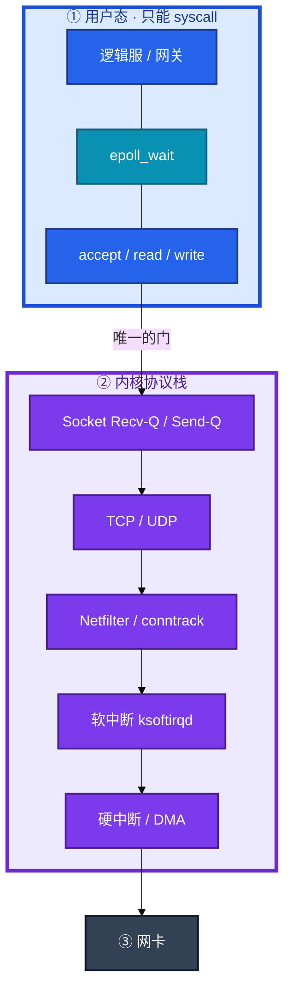
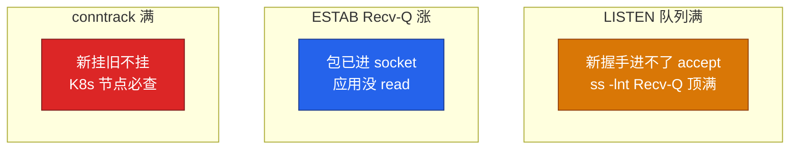
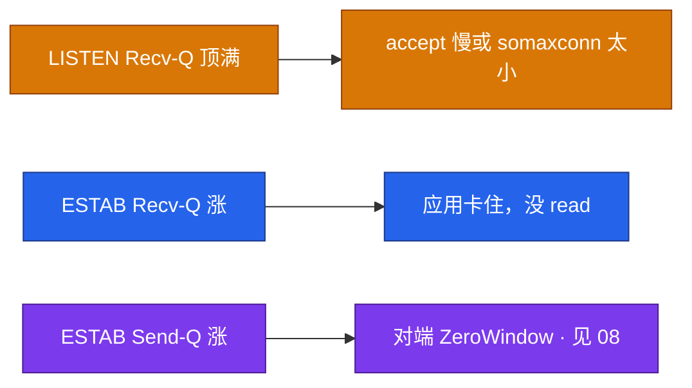
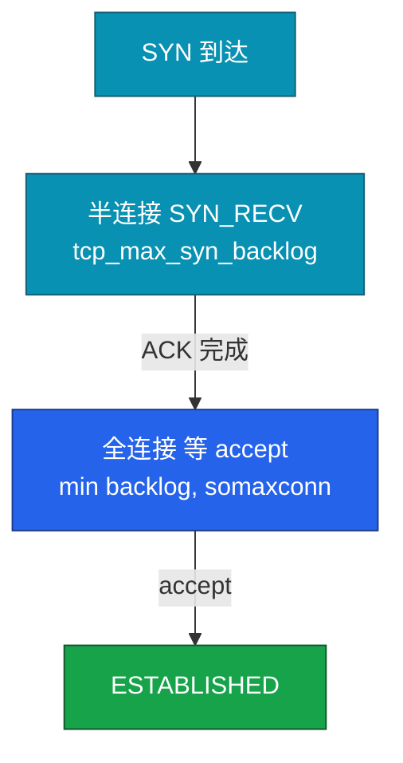
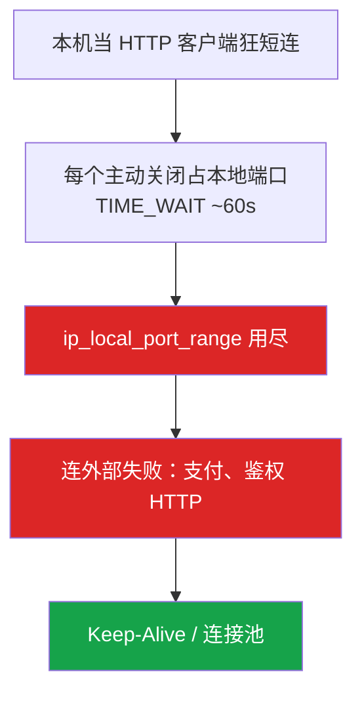
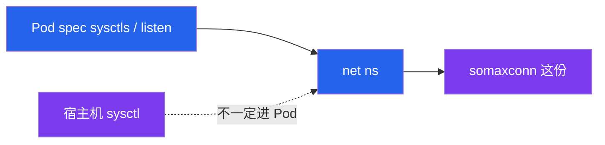
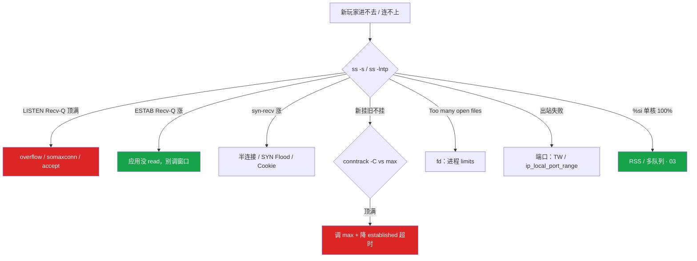

# 网络栈与 Socket


活动高峰，新玩家进不去，在线长连接还在跑。安全组没改。这一章只做一件事——**先分清 LISTEN 和 ESTAB 的两个 Q，再动 backlog / conntrack / fd**。

**本章主线（排障就按这三步想）：**

1. **读 Q**：`ss -lntp` 看 LISTEN（连接个数）；`ss -antp` 看 ESTAB（字节）——两个 Recv-Q 不是一回事。
2. **分「满」**：backlog 满 / conntrack 满 / fd 满 / 端口满——新挂旧不挂最像 conntrack。
3. **对症**：accept 慢改 backlog；应用不 read 改消费；短连接堆 TW 用连接池，不是 recycle。

**读完你能：** 白板上画出包从网卡到 `accept()`/`read()`；`ss` 一行分清 accept 慢还是应用没读；会处理 backlog、TW、CW、conntrack、fd、端口四个「满」；游戏长连接和短连接 HTTP 不会用同一套调参。

## 本章目录

- [1. 基本概念](#1-基本概念)
- [2. 架构图](#2-架构图)
- [3. 原理](#3-原理)
- [4. 落地](#4-落地)
- [5. 核心配置](#5-核心配置)
- [6. 命令与操作](#6-命令与操作)
- [7. 生产排障](#7-生产排障)
- [8. 必会 · 常考](#8-必会--常考)
- [合上书](#合上书问自己)

**本章不讲：** 三次握手、重传、ZeroWindow 原理 → [08](../08-TCP与UDP/)；抓包、RST → [11](../11-网络排障与抓包/)；iptables、conntrack 表结构 → [15](../15-iptables与conntrack/)；sysctl 落盘 → [18](../18-内核参数与sysctl/)；fd 泄漏、strace → [02](../02-进程与信号/)。

---

## 1. 基本概念

逻辑服、网关**不能直接读写网卡**。进程能做的只有 `socket` / `bind` / `listen` / `accept` / `read` / `write`——每一记都是 syscall。包到了机器上，不等于进了你的进程（和 [01](../01-内核与系统/) 同一扇门）。

| 在 socket / 协议栈里 | 不在这一层 |
|----------------------|------------|
| Recv-Q / Send-Q、LISTEN backlog、ESTAB 缓冲 | 应用业务错误码 |
| SYN_RECV、TIME_WAIT、CLOSE_WAIT | 安全组误改（新旧通常一起死） |
| conntrack 条目、本机出站端口 | 对端应用死锁根因（只能看见 Send-Q） |
| epoll 就绪集合 | HTTP 状态码、TLS 握手 RTT |

三个「队列」不要混：

| 队列 | 单位 | ss 里看哪 |
|------|------|-----------|
| **半连接**（SYN_RECV） | 连接个数 | `ss -s` 的 syn-recv |
| **全连接**（等 accept） | 连接个数 | **LISTEN** 的 Recv-Q |
| **socket 缓冲** | 字节 | **ESTAB** 的 Recv-Q / Send-Q |

游戏网关与逻辑服是**长连接**：小时级 ESTAB，TIME_WAIT 通常不多。登录、支付回调才是短连接 HTTP，才会堆 TIME_WAIT、打满 conntrack。

> **记住**：新挂旧不挂，先想队列和 conntrack，不是网卡坏了。ESTAB Recv-Q 涨 = 应用没 `read`，不要先调 TCP 窗口。

---

## 2. 架构图

后面命令、配置、排障都对着这张图。



**读图三句话：**

1. **没有箭头从逻辑服指向网卡。** 进程只能 syscall。
2. **LISTEN 和 ESTAB 的 Recv-Q 不是同一个数**：一个是连接个数，一个是字节。
3. **conntrack 在 Netfilter**，表满时新包在 PREROUTING 就被丢，已有长连接通常还在。

三种生产形态（挂的时候故障域不一样）：



`%si` 单核 100%：收包处理不过来（03）。Recv-Q 堆积是包**已经进 socket**，不是网卡层。

---

## 3. 原理

### 3.1 Recv-Q / Send-Q：两种含义

**一句话：** LISTEN 的 Q 是**连接个数**，ESTAB 的 Q 是**字节**——混了就会用 rmem 治 accept 慢。

| 状态 | Recv-Q | Send-Q |
|------|--------|--------|
| **LISTEN** | 已握手、还没 `accept()` 的**连接个数** | backlog 上限 |
| **ESTAB** | 内核里应用还没 `read()` 的**字节** | 已发出、对端未 ACK 的**字节** |



LISTEN Recv-Q>0 且逼近 Send-Q → accept 太慢或 backlog 太小；加大 rmem **治不了**。ESTAB Recv-Q 持续涨 → 线程卡死/GC，看 ESTAB Recv-Q 比应用日志更早。ESTAB Send-Q 涨 → 对端慢或 ZeroWindow（08）。

### 3.2 半连接与全连接队列

**一句话：** 有效全连接队列 = **`min(listen backlog, somaxconn)`**，只改一边等于没改。



半连接满：SYN 丢弃或 SYN Cookie，表现像丢包，应用日志往往什么都没有。全连接满：`ss -lnt` Recv-Q 顶满。`somaxconn` 常默认 **128**，生产过小。容器里 somaxconn 是**命名空间里的值**，改宿主机不一定进 Pod。

`tcp_abort_on_overflow=1`：满时直接 RST（快失败）；默认 **0** 是丢握手、客户端重试。SYN Cookie 防 SYN Flood，正常负载不应长期靠 Cookie。

### 3.3 TIME_WAIT 与 CLOSE_WAIT

**一句话：** TW 是主动关方的正常现象（短连接）；CW 持续涨是应用忘了 `close()`，修代码不调内核。

主动关：FIN_WAIT → TIME_WAIT（2MSL，常 **60s**）。短连接 HTTP 客户端 TW 爆炸 → 连接池，不是改 2MSL。



`tcp_tw_reuse=1`：仅**出站客户端**，要 `tcp_timestamps=1`。`tcp_tw_recycle` **已删除**，NAT 下有害。CLOSE_WAIT 持续增长 = 泄漏，调 `tcp_fin_timeout` 盖不住。

### 3.4 conntrack、fd、端口：三个「满」

**一句话：** conntrack 满 = **新挂旧不挂**；fd 看进程 limits，端口看出站四元组——网关 CCU ≈ `min(ulimit-n, 内存, conntrack, 端口)`。


ESTABLISHED 默认超时 **5 天**，短连接+长超时最容易堆满。止血调大 max；长期 `timeout_established=3600` + 使用率告警 **80%**。只调大 max 不治超时，风暴来了照样满。

**fd 耗尽：** `/proc/PID/fd` 顶 Max open files（02）。**端口耗尽：** 本机出站 `ip_local_port_range` 被 TIME_WAIT/ESTAB 占满。

### 3.5 epoll：网关为什么能扛万级 CCU

**一句话：** epoll 只返回就绪集合，万级 CCU 必须 epoll；ready ≠ 已 read，线程卡死时 Recv-Q 照样涨。

| | select / poll | epoll |
|--|---------------|-------|
| 规模 | 几百 fd | 网关万级标配 |
| 通知 | 每次拷整个集合 | 就绪列表 |
| ET | — | 必须读到 EAGAIN，漏读就静默 |

网关几万条长连接睡在 `epoll_wait` 上，进程 STAT 全是 **S**，**不进 Load**（02）。

---

## 4. 落地

### 4.1 生产怎么选

| 项 | 选 | 不选 |
|----|----|------|
| 网关模型 | 长连接 + epoll + 显式 backlog | 短连接扫、select |
| somaxconn | 4096～65535，与 listen 一起改 | 默认 128 |
| TIME_WAIT | Keep-Alive / 连接池；必要时 tw_reuse | recycle、2MSL=5s |
| conntrack | 使用率告警 80%；established 3600s | 只调大 max 当根治 |
| CCU 容量 | min(ulimit-n, 内存, conntrack, 端口) | 只把 ulimit 提到 65535 |
| 容器 backlog | Pod sysctl 或进程 listen(65535) | 只改宿主机 somaxconn |

验收：必须 `ss -lntp` 看到在听、Listen Recv-Q 不顶满、`ss -s` 的 syn-recv / time-wait 在预期、conntrack 使用率 < 80%。不要只探 TCP 端口通。

### 4.2 容器里你实际看到什么

`somaxconn`、conntrack、端口范围在容器里是**网络命名空间**里的值。K8s 用 `securityContext.sysctls` 或入口进程 `listen(65535)`。conntrack 表在**宿主机节点**上，查 `conntrack -C` 要上节点。



---

## 5. 核心配置

只动有证据的项。改 sysctl 走评审（18）。`tcp_tw_reuse` 必须同时确认 timestamps。

| 参数 | 默认 | 生产怎么用 | 改错会怎样 |
|------|------|------------|------------|
| `net.core.somaxconn` | 常 **128** | 与 listen 一起加大 | 只改一边无效；容器是自己的 ns |
| `net.ipv4.tcp_max_syn_backlog` | 发行版各异 | 防半连接打满 | 过小 SYN 丢，像丢包 |
| `net.ipv4.tcp_syncookies` | 常开 | SYN Flood 时靠它 | 长期靠 Cookie = 半连接长期满 |
| `net.ipv4.tcp_abort_on_overflow` | **0** | 网关选快失败还是让客户端再试 | 1 = 满时 RST |
| `net.ipv4.tcp_tw_reuse` | 0 | 仅出站客户端；要 timestamps=1 | 关 timestamps 不安全 |
| `tcp_tw_recycle` | **已删除** | 不要提 | NAT 下丢连接 |
| `nf_conntrack_max` | 常 65536 级 | 按 CCU 规划；告警 80% | 只加大不治超时 |
| `nf_conntrack_tcp_timeout_established` | **5 天** | 生产常降到 3600 | 长连接+5 天最容易堆满 |
| `net.ipv4.ip_local_port_range` | 约 3 万个 | 短连接客户端要够 | 范围不够 + TW = 连外部失败 |

> **记住**：有效 backlog = min(listen, somaxconn)；recycle 已死。

---

## 6. 命令与操作

**生产优先 `ss`。** `netstat` 来自 net-tools，很多发行版已弃用。内核计数仍常用 `netstat -s` 或 `nstat`。

### 6.1 值班第一眼

```bash
ss -s
ss -lntp
ss -antp | head
netstat -s | grep -i overflow
conntrack -C
cat /proc/sys/net/netfilter/nf_conntrack_max
mpstat -P ALL 1
```

### 6.2 读 ss：两种 Q

```bash
ss -lnt
# LISTEN：Recv-Q=12  Send-Q=128  → 12 个已握手还没 accept，上限 128
ss -antp | head
# ESTAB：Recv-Q=256000  → 内核堆了 256KB 应用还没 read
```

典型 `ss -s` 输出：

```text
TCP:   12450 (estab 11800, closed 500, orphaned 0, timewait 150)
       3200 synrecv
```

典型 overflow 计数：

```text
    15234 times the listen queue of a socket overflowed
     8921 SYNs to LISTEN sockets dropped
```

`ss -lntp` 示例：

```text
State  Recv-Q Send-Q Local Address:Port  Peer Address:Port  Process
LISTEN 128    128    0.0.0.0:8080       0.0.0.0:*          users:(("gateway",pid=28451,fd=8))
```

Recv-Q=128 且 Send-Q=128 → 全连接队列顶满，accept 或 somaxconn 是瓶颈。

### 6.3 速查表

| 目的 | 命令 | 看什么 |
|------|------|--------|
| 听没听、Listen 两个 Q | `ss -lntp` | Recv-Q=未 accept 个数 |
| 状态分布 | `ss -s` | estab / syn-recv / time-wait |
| ESTAB + 进程 | `ss -antp` | Recv-Q 是字节 |
| TW 条数 | `ss -antp state time-wait \| wc -l` | 先确认是不是真的 TW |
| CW 归属 | `ss -antp state close-wait` | 哪个进程没 close |
| overflow | `netstat -s \| grep -i overflow` | ListenOverflows / ListenDrops |
| conntrack | `conntrack -C` | 使用率 vs max |
| fd | `ls /proc/<pid>/fd \| wc -l` | 对 Max open files |

### 6.4 常见操作

**加大 backlog：** 应用 `listen()` 和 `somaxconn` **一起改**；容器改 Pod sysctl 或进程 `listen(65535)`；队列加大只是缓冲，accept 太慢还是会满。

**TIME_WAIT：** `ss -s` 确认 → Keep-Alive / 连接池 → 出站客户端必要时 `tcp_tw_reuse=1` + timestamps。不要 recycle，不要把 2MSL 改成 5s。

**CLOSE_WAIT：**

```bash
ss -antp state close-wait | awk '{print $NF}' | sort | uniq -c | sort -rn
```

持续增长 = 泄漏，修代码。

**conntrack：** 止血调大 max；长期降 established 超时、短连接改池子、告警 80%。K8s 节点必查。

---

## 7. 生产排障

和 01 同一套三问：进程还在不在？还能不能接新连接？已有长连接还通不通？

**conntrack / Listen 队列满 = 新玩家进不去，不是立刻踢在线。**



| 现象 | 先做 | 别做 |
|------|------|------|
| LISTEN Recv-Q 顶满 | overflow、somaxconn、加速 accept | 加大 rmem |
| ESTAB Recv-Q 涨 | 看线程 / GC，strace | 先调 TCP 窗口 |
| ESTAB Send-Q 涨 | 对端 Recv-Q / ZeroWindow（08） | 加大本端 sndbuf 当根因 |
| TIME_WAIT 万级 | 连接池 / Keep-Alive，再 tw_reuse | recycle、2MSL=5s |
| CLOSE_WAIT 涨 | 修代码 | 调 tcp_fin_timeout |
| 新挂旧不挂 | conntrack -C vs max | 先改安全组 |
| `%si` 100% 丢包 | 多队列 RSS（03） | 当成 Recv-Q 去调应用 |
| Recv-Q 涨且 `%si` 正常 | 调应用消费 | 扩容复制卡死 |
| 容器 overflow | Pod 内 somaxconn / listen | 只改宿主机 |

活动高峰短连鉴权把 conntrack 打满：新玩家进不去、在线还在跑——最像 conntrack。确认长连接还在 → 停短连接风暴 / 救表 → 不要重启还活着的战斗服。

---

## 8. 必会 · 常考

| 说法 | 对错 | 口径 |
|------|:----:|------|
| LISTEN Recv-Q 和 ESTAB Recv-Q 是一回事 | 错 | 一个是连接个数，一个是字节 |
| LISTEN 顶满加大 rmem | 错 | 那是 backlog，治 accept 和 somaxconn |
| 只改 listen(1024) 或只改宿主机 somaxconn | 错 | 有效值 = min；容器是自己的 ns |
| TIME_WAIT 多是内核 bug | 错 | 短连接正常；优先连接池 |
| CLOSE_WAIT 调 tcp_fin_timeout | 错 | 应用没 close，修代码 |
| 开 tcp_tw_recycle 治 TW | 错 | 已删除，NAT 有害 |
| tw_reuse 可关 timestamps | 错 | reuse 依赖 timestamps |
| 把 2MSL 改成 5s | 错 | 串话风险 |
| conntrack 满会踢掉在线长连接 | 错 | 新挂旧不挂 |
| 只调大 conntrack max 就根治 | 错 | 要治超时和连接模式 |
| 游戏长连接会 TW 爆炸 | 错 | 正常不会；爆炸说明短连接打在这台 |
| fd 耗尽和端口耗尽是一回事 | 错 | 一个看 limits，一个看出站四元组 |
| `%si` 满和 Recv-Q 涨都调应用 | 错 | si 调多队列，Recv-Q 调消费 |
| 网关只把 ulimit -n 提到 65535 就够 | 错 | CCU ≈ min(ulimit, 内存, conntrack, 端口) |

数字：somaxconn 常默认 **128**；2MSL 常 **60s**；conntrack established 默认 **5 天**；使用率告警 **80%**；`tcp_abort_on_overflow` 默认 **0**。

易混：LISTEN Q vs ESTAB Q；半连接 vs 全连接；TIME_WAIT vs CLOSE_WAIT；tw_reuse vs recycle；conntrack 满 vs 安全组；`%si` vs Recv-Q；fd vs 端口；宿主机 somaxconn vs 容器 ns。

---

## 合上书，问自己

1. LISTEN Recv-Q 和 ESTAB Recv-Q 各是什么？加大 rmem 能治哪一个？
2. 有效 backlog 怎么算？只改一边为什么无效？容器里 somaxconn 在哪？
3. TIME_WAIT 和 CLOSE_WAIT 谁在主动关、谁忘了 close？recycle 还能提吗？
4. conntrack 满什么现象？established 默认多久？K8s 为什么必查？
5. fd 耗尽和端口耗尽怎么分？网关 CCU 上限怎么算？
6. `%si` 打满和 Recv-Q 涨各调什么？游戏长连接该监控哪两个数？

六题能口述，这一章就过了。下一章：[cgroup 与容器](../07-cgroup与容器/)——容器里 free/nproc 为什么撒谎，cpu.stat 和 memory.events 怎么读。
