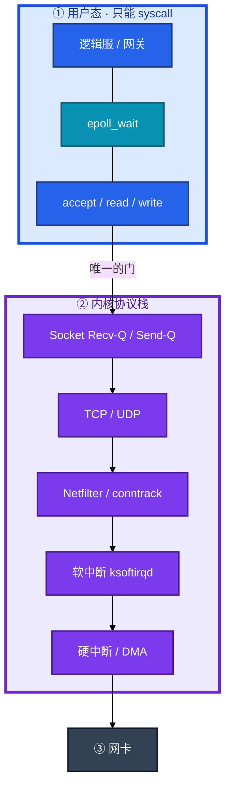
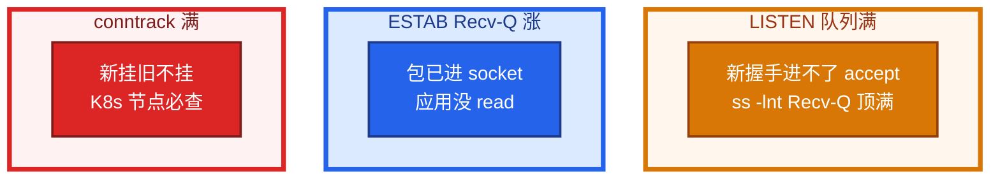
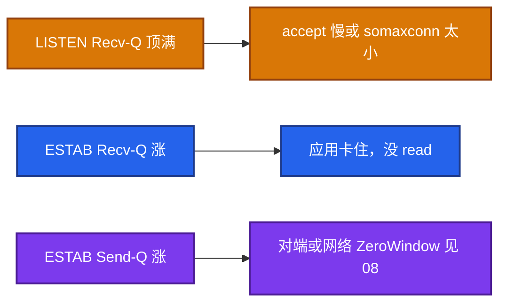
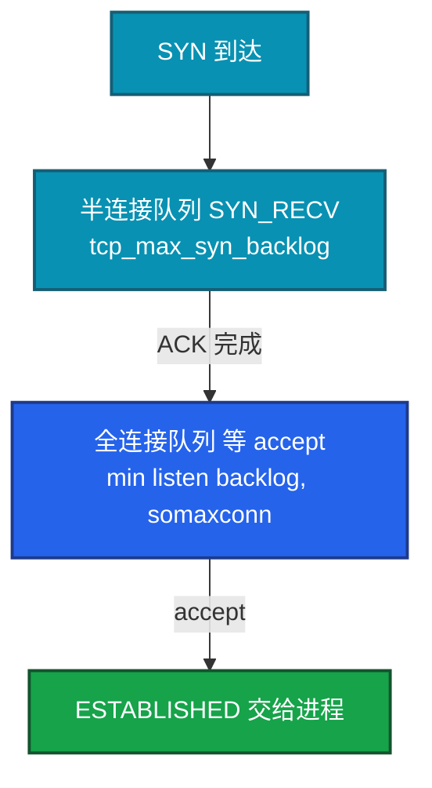
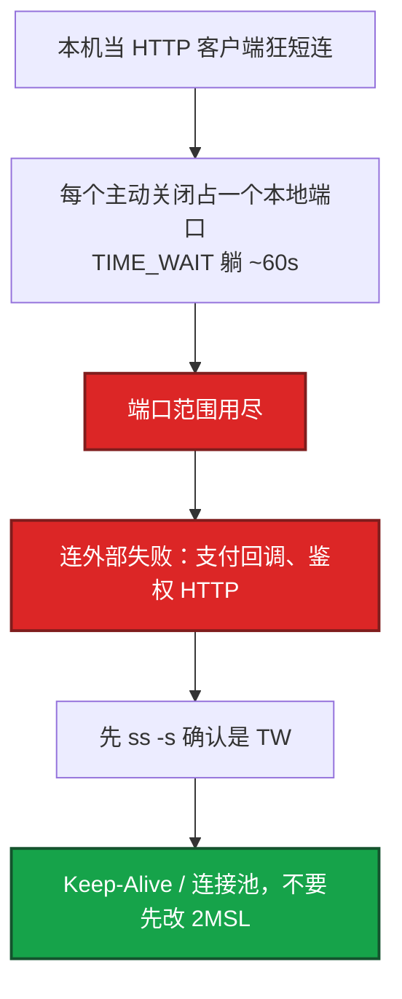
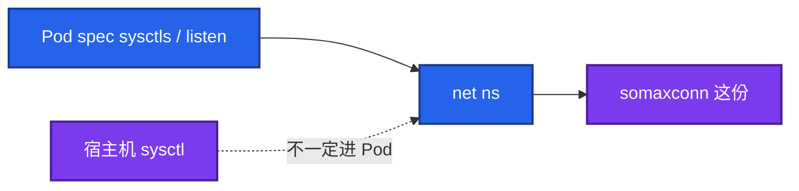
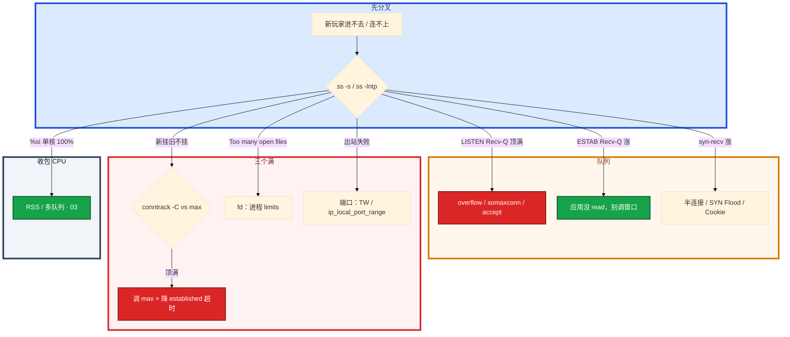

# 网络栈与 Socket


活动高峰，新玩家进不去，在线长连接还在跑。安全组没改。有人说「网卡坏了」，有人要加大 TCP 窗口，另有人已经在调 `rmem`。

先别动手。这一章后半全是你会动手的：**怎么读 ss、怎么分 LISTEN 和 ESTAB 的两个 Q、怎么看 overflow、怎么处理 TIME_WAIT / CLOSE_WAIT / conntrack 满。** 前面的概念和原理，是为了让你动手时不选错层。

**读完你能：** 白板上画出包从网卡到 `accept()`/`read()`；`ss` 一行能分清是 accept 慢还是应用没读；会处理 backlog、TW、CW、conntrack、fd、端口四个「满」；游戏长连接和短连接 HTTP 不会用同一套调参。

## 本章目录

缩进 = 上下级。3 下面才是 3.1。

想钉在**正文左边**跟着滚：菜单 **查看 → 打开视图 → 大纲**。Markdown 预览做不到独立左栏，目录只能写在文章开头。

- [1. 基本概念](#1-基本概念)
- [2. 架构图](#2-架构图)
- [3. 原理](#3-原理)
  - [3.1 Recv-Q / Send-Q](#31-recv-q--send-q两种含义)
  - [3.2 半连接与全连接](#32-半连接队列和全连接队列)
  - [3.3 TIME_WAIT 与 CLOSE_WAIT](#33-time_wait-与-close_wait)
  - [3.4 conntrack、fd、端口](#34-conntrackfd端口三个满)
  - [3.5 epoll](#35-epoll网关为什么能扛万级-ccu)
- [4. 安装部署](#4-安装部署)
  - [4.1 生产怎么选](#41-生产怎么选)
  - [4.2 容器里你实际看到什么](#42-容器里你实际看到什么)
- [5. 核心配置](#5-核心配置)
- [6. 常用命令](#6-常用命令)
- [7. 常用操作](#7-常用操作)
  - [7.1 读 ss / netstat](#71-读-ss--netstat)
  - [7.2 加大 backlog](#72-加大-backlog)
  - [7.3 TIME_WAIT](#73-time_wait)
  - [7.4 CLOSE_WAIT](#74-close_wait)
  - [7.5 conntrack](#75-conntrack)
  - [7.6 fd 与端口](#76-fd-与端口)
- [8. 生产排障](#8-生产排障)
- [9. 必会 · 常考](#9-必会--常考)
- [合上书](#合上书问自己)

**本章不讲：** 三次握手为什么、重传、ZeroWindow 原理 → [08 TCP与UDP](../08-TCP与UDP/)；抓包、RST 是谁发的 → [11 网络排障与抓包](../11-网络排障与抓包/)；iptables 五链、conntrack 表结构 → [15 iptables与conntrack](../15-iptables与conntrack/)；somaxconn 等 sysctl 怎么落盘 → [18 内核参数与sysctl](../18-内核参数与sysctl/)；fd 泄漏、strace → [02 进程与信号](../02-进程与信号/)。

---

## 1. 基本概念

逻辑服、网关**不能直接读写网卡**。网卡、DMA、中断只许内核碰。进程能做的只有 `socket` / `bind` / `listen` / `accept` / `read` / `write`——每一记都是请客内核办。卡在内核哪一层，应用日志经常还是 timeout。

和 [01 内核](../01-内核与系统/) 同一扇门：用户态碰不到硬件。包已经到了机器上，不等于进了你的进程。

| 在 socket / 协议栈里 | 不在这一层 |
|----------------------|------------|
| Recv-Q / Send-Q、LISTEN backlog、ESTAB 缓冲 | 应用业务错误码 |
| SYN_RECV、TIME_WAIT、CLOSE_WAIT | 安全组误改（新旧通常一起死） |
| conntrack 条目、本机出站端口 | 对端应用死锁的根因（只能看见 Send-Q） |
| epoll 就绪集合 | HTTP 状态码、TLS 握手 RTT |

三个「队列」不要混：

| 队列 | 单位 | 你在 ss 里看哪一行 |
|------|------|-------------------|
| **半连接**（SYN_RECV） | 连接个数 | `ss -s` 的 syn-recv |
| **全连接**（已握手、等 accept） | 连接个数 | **LISTEN** 的 Recv-Q |
| **socket 缓冲** | 字节 | **ESTAB** 的 Recv-Q / Send-Q |

游戏网关与逻辑服是**长连接**：小时级 ESTAB，TIME_WAIT 通常不多。登录、支付回调才是短连接 HTTP，才会堆 TIME_WAIT、打满 conntrack。两套调参不能混。

> **记住**：新挂旧不挂，先想队列和 conntrack，不是网卡坏了。ESTAB Recv-Q 涨，包在内核堆着，逻辑线程没 `read`，不要先调 TCP 窗口。

---

## 2. 架构图

先把整张图钉住。后面命令、配置、排障都对着这张图说话。



图上三条线：

1. **没有箭头从逻辑服指向网卡。** 进程只能 syscall。
2. **LISTEN 和 ESTAB 的 Recv-Q 不是同一个数**：一个是连接个数，一个是字节。
3. **conntrack 在 Netfilter**，表满时新包在 PREROUTING 就被丢，已有长连接通常还在。

三种生产形态（挂的时候故障域不一样）：



`%si` 单核 100%：收包处理不过来，丢包、RTT 抖（03）。那是包还在网卡/软中断层。Recv-Q 堆积是包已经进 socket。

---

## 3. 原理

原理只保留动手和面试会用到的：两个 Q 怎么读、握手卡在哪一层、谁在主动关、三个「满」怎么分、网关为什么必须 epoll。

**本节 5 块：** 3.1 Recv-Q · 3.2 backlog · 3.3 TW/CW · 3.4 三个满 · 3.5 epoll

### 3.1 Recv-Q / Send-Q：两种含义

网关 `ss -lnt` Recv-Q 顶着 Send-Q。有人说「内核接收缓冲满了，加大 rmem」。另一次是 ESTAB 上 Recv-Q 持续涨。两件事差了整整一层。

| 状态 | Recv-Q | Send-Q |
|------|--------|--------|
| **LISTEN** | 已握手、还没被 `accept()` 的**连接个数** | backlog 上限 |
| **ESTAB** | 内核里应用还没 `read()` 的**字节** | 已发出、对端未 ACK 的**字节** |



LISTEN Recv-Q>0 且逼近 Send-Q → accept 太慢或 backlog 太小。客户端侧常见 SYN 成功后 RST 或超时。加大 rmem **治不了**：那是连接个数队列，不是字节缓冲。

ESTAB Recv-Q 持续涨 → 应用不读（线程卡死、GC）。游戏网关 Recv-Q 涨：逻辑线程卡了没读 socket，玩家感觉延迟，其实包在内核堆着。看 ESTAB Recv-Q 比看应用日志更早。不要先调 TCP 窗口。

ESTAB Send-Q 持续涨 → 对端慢或网络堵（ZeroWindow 见 08）。两边 Q 都大于 0 就是双向都堵：自己不读 + 对面不收。strace 看线程在干什么（02）。

> **记住**：LISTEN 的 Q 是连接个数，ESTAB 的 Q 是字节；不要混，不要用 rmem 治 accept 慢。

### 3.2 半连接队列和全连接队列

玩家偶发进不去房，应用错误码没有。`ss -lnt` 上 Recv-Q 顶满。这是握手卡在内核，还没到 `accept()`。



半连接满：SYN 丢弃或 SYN Cookie；表现像丢包，客户端重试，应用日志往往什么都没有——包还没进进程。全连接满：`ss -lnt` Recv-Q 顶满；第三次 ACK 已经完成，只是没人 `accept()`。

**有效全连接队列 = `min(listen backlog, somaxconn)`。** 只改应用 `listen(1024)` 不改 somaxconn 等于没改。只改 somaxconn 不改 listen 同样无效。

`somaxconn` 常默认 **128**，生产过小。网关、Redis、Nginx 都要显式加大。容器里 somaxconn 是**命名空间里的值**，改宿主机不一定进 Pod。要在 Pod sysctl 或入口进程自己 `listen(65535)`。

`tcp_abort_on_overflow=1`：全连接队列满时直接 RST，客户端立刻失败而不是重试 SYN。默认 **0** 是丢握手，客户端超时重试。网关要明确选「快速失败」还是「让客户端再试」，并监控 overflow 计数。

SYN Cookie：半连接满时不占队列槽，把状态编码进序列号。防 SYN Flood。正常负载不应长期靠 Cookie。握手细节见 08。

### 3.3 TIME_WAIT 与 CLOSE_WAIT

登录服 TW 几十万。战斗长连接那台 TW 很少。另一台 CLOSE_WAIT 在涨。有人要开 `tcp_tw_recycle`，有人要把 2MSL 改成 5s。先分清谁在主动关、谁忘了 close。

主动关：FIN_WAIT → TIME_WAIT（2MSL，常 **60s**）。为了最后 ACK 丢失可重传、旧包不污染新四元组。TIME_WAIT 在**主动关闭方**。

TIME_WAIT 多 = 短连接多，不是内核 bug。客户端会耗尽本地端口（`ip_local_port_range`）。



优先：HTTP Keep-Alive、连接池、游戏用长连接。内核参数是最后手段。不要调大 TW 超时当优化，该减短连接。把 2MSL 改成 **5s** 有串话风险。

`tcp_tw_reuse=1`：仅作**出站客户端**复用 TIME_WAIT 端口；依赖 `tcp_timestamps=1`。关 timestamps 时 reuse 不安全或失效。`tcp_tw_recycle` **已删除**，NAT 下会丢连接，禁止提它当方案。

游戏网关与逻辑服是长连接，TIME_WAIT 通常不多；**短连接 HTTP 登录、支付回调**才会堆 TIME_WAIT。爆炸说明有人在用短连接扫或 HTTP 没复用。先 `ss -s` 看是不是真的 TW。

CLOSE_WAIT：收到 FIN 应用没 `close()`。持续增长就是泄漏，修代码，不调内核。调 `tcp_fin_timeout` 盖不住 CLOSE_WAIT。

> **记住**：TW 是短连接正常现象，优先连接池；CW 是 bug，修代码；recycle 已死，不要提。

### 3.4 conntrack、fd、端口：三个「满」

活动高峰新玩家进不去，在线玩家还在跑。安全组没变。K8s 节点上 `conntrack -C` 顶着 max。这是三个「满」里最像「网络抖动」的那一个。

K8s 里 Pod 出站 MASQUERADE、Service DNAT 都占 conntrack。满了你眼睛看到的是：新连接 `timeout` / `refused` / `no route`，**已建立长连接仍通**。这个不对称要立刻想到表满。安全组误改通常新旧一起死——先拿这个分型，再动表。

ESTABLISHED 默认超时 **5 天**，短连接+长超时最容易堆满。止血：调大 max；长期：`timeout_established=3600` + 使用率告警 **80%**。只调大 max 能止血，表更大更耗内存，风暴来了照样满。要治超时和连接模式。长连接也会占表。


**fd 耗尽：** 单进程 `/proc/PID/fd` 顶 Max open files，新 accept/open 失败（02）。  
**端口耗尽：** 本机出站 `ip_local_port_range` 被 TIME_WAIT/ESTAB 占满，连外部失败。一个看进程 limits，一个看四元组本地端口。`ss -s` 一眼看分布。

一个 ESTAB 至少占 1 个 fd。网关 CCU 上限 ≈ `min(ulimit-n, 内存, conntrack, 端口)`。只把 `ulimit -n` 提到 65535，conntrack 还是 65536 默认，活动一来换一个瓶颈。容量规划要把四者一起算。

内核参数改动要懂副作用：`tcp_tw_reuse` 要 timestamps；随意降 TIME_WAIT 时间可能串会话。生产变更走评审（18）。

> **记住**：conntrack 满：新挂旧不挂，K8s 必查；fd 看进程 limits，端口看出站四元组；网关容量四者一起算。

### 3.5 epoll：网关为什么能扛万级 CCU

游戏网关几万条长连接睡在 `epoll_wait` 上，进程 STAT 全是 **S**，**不进 Load**（02）。select/poll 每次扫描全部 fd，O(n)；epoll 只返回就绪集合，万级 CCU 必须 epoll。

| | select / poll | epoll |
|--|---------------|-------|
| 规模 | 几百 fd 还能撑 | 网关万级标配 |
| 通知 | 每次把整个集合拷进内核 | 就绪列表 |
| 游戏网关 | 不要用 | LT 或 ET |

LT（水平触发）：有数据就一直通知，漏读下次还会来。ET（边缘触发）：只通知一次，必须一次读完，漏读就静默——Recv-Q 会涨而 epoll 不再叫醒你。生产网关用 ET 必须把 socket 读到 EAGAIN。

epoll 报 ready ≠ 应用已经 `read`。线程卡死、GC STW 时，内核 Recv-Q 照样涨。先看 Recv-Q 和线程，不要先调 TCP。

---

## 4. 安装部署

### 4.1 生产怎么选

| 项 | 选 | 不选 |
|----|----|------|
| 网关模型 | 长连接 + epoll + 显式 backlog | 短连接扫、select |
| somaxconn | 4096～65535，与 listen 一起改 | 默认 128 |
| TIME_WAIT | Keep-Alive / 连接池；必要时 tw_reuse | recycle、把 2MSL 改成 5s |
| conntrack | 使用率告警 80%；established 3600s | 只调大 max 当根治 |
| CCU 容量 | min(ulimit-n, 内存, conntrack, 端口) | 只把 ulimit 提到 65535 |
| 容器 backlog | Pod sysctl 或进程 listen(65535) | 只改宿主机 somaxconn |

验收：进程在不算数。必须 `ss -lntp` 看到在听、Listen Recv-Q 不顶满、`ss -s` 的 syn-recv / time-wait 在预期、conntrack 使用率 < 80%。不要只探 TCP 端口通。

### 4.2 容器里你实际看到什么

`somaxconn`、conntrack、端口范围在容器里是**网络命名空间**里的值。改宿主机 sysctl 不一定进 Pod。K8s 要用 `securityContext.sysctls` 或入口进程自己 `listen(65535)`。内核参数变更走评审，细节在 18。



conntrack 表在**宿主机节点**上，Pod 出站 MASQUERADE、Service DNAT 都占这一张表。查 `conntrack -C` 要上节点，不是进容器。

---

## 5. 核心配置

只动有证据的项。改 sysctl 走评审（18）。`tcp_tw_reuse` 必须同时确认 timestamps。

| 参数 | 默认 | 生产怎么用 | 改错会怎样 |
|------|------|------------|------------|
| `net.core.somaxconn` | 常 **128** | 与 listen 一起加大 | 只改一边无效；容器是自己的 ns |
| `net.ipv4.tcp_max_syn_backlog` | 发行版各异 | 防半连接打满 | 过小 SYN 丢，像丢包 |
| `net.ipv4.tcp_syncookies` | 常开 | SYN Flood 时靠它；正常负载不应长期靠 Cookie | 长期靠 Cookie = 半连接长期满 |
| `net.ipv4.tcp_abort_on_overflow` | **0** | 网关要选快失败还是让客户端再试 | 1 = 满时 RST；0 = 丢握手 |
| `net.ipv4.tcp_tw_reuse` | 0 | 仅出站客户端；要 `tcp_timestamps=1` | 关 timestamps 时 reuse 不安全 |
| `net.ipv4.tcp_timestamps` | 1 | 保持开；reuse 依赖它 | 关掉再开 reuse = 踩坑 |
| `tcp_tw_recycle` | **已删除** | 不要提 | NAT 下丢连接 |
| `nf_conntrack_max` | 常 65536 级 | 按 CCU 规划；告警 80% | 只加大不治超时会再满 |
| `nf_conntrack_tcp_timeout_established` | **5 天** | 生产常降到 3600 | 长连接+5 天最容易堆满 |
| `net.ipv4.ip_local_port_range` | 约 3 万个 | 短连接客户端要够 | 范围不够 + TW = 连外部失败 |

> **记住**：有效 backlog = min(listen, somaxconn)；只改一边无效。容器里 somaxconn 是自己的命名空间。recycle 已死。

---

## 6. 常用命令

`ss` 来自 iproute2，看 socket；`netstat` 来自 net-tools，很多发行版默认不装或已弃用。**生产优先 ss。** 内核计数（ListenOverflows）仍常用 `netstat -s` 或 `nstat`。Recv-Q / Send-Q 在两种工具里含义相同。

| 目的 | 命令 | 看什么 |
|------|------|--------|
| 听没听、Listen 两个 Q | `ss -lntp` | Recv-Q=未 accept 个数，Send-Q=backlog |
| 状态分布 | `ss -s` | estab / syn-recv / time-wait |
| 各连接 + 进程 | `ss -antp` | ESTAB 的 Recv-Q 是字节 |
| TW 条数 | `ss -antp state time-wait \| wc -l` | 先确认是不是真的 TW |
| CW 归属 | `ss -antp state close-wait` | 哪个进程没 close |
| TCP 内部 | `ss -ti dst <ip>` | rtt / cwnd / retrans（08） |
| overflow | `netstat -s \| grep -i overflow` | ListenOverflows / ListenDrops |
| 软中断 | `mpstat -P ALL 1` | 单核 `%si` 有没有打满 |
| conntrack | `conntrack -C`；`cat /proc/sys/net/netfilter/nf_conntrack_max` | 使用率 |
| fd | `ls /proc/<pid>/fd \| wc -l` | 对 Max open files |
| somaxconn | `sysctl net.core.somaxconn` | 容器里是自己的 ns |

值班先跑这几条：

```bash
ss -s
ss -lntp
ss -antp | head
netstat -s | grep -i overflow
conntrack -C
cat /proc/sys/net/netfilter/nf_conntrack_max
mpstat -P ALL 1
```

读 `ss -lnt` 之前先记住：**LISTEN 上的 Recv-Q/Send-Q 和 ESTAB 上的完全不是一回事。**

```bash
ss -lnt
# LISTEN 那一行：Recv-Q=12  Send-Q=128  表示 12 个已握手还没被 accept，上限 128
ss -antp | head
# ESTAB 那一行：Recv-Q=256000  表示内核里堆了 256KB 应用还没 read
```

```bash
sysctl net.core.somaxconn
sysctl net.ipv4.tcp_max_syn_backlog
sysctl net.ipv4.tcp_syncookies
sysctl net.ipv4.tcp_tw_reuse
sysctl net.ipv4.tcp_timestamps
```

---

## 7. 常用操作

### 7.1 读 ss / netstat

连不上：没监听 / 队列满 / 安全组 / conntrack / 端口耗尽，按这个顺序排除，再抓包（11）。本机 curl vs 远端用来区分应用和防火墙。

`ss -s` 看分布；`ss -lntp` 看听没听和 Listen 队列；`netstat -s` 看 overflow 累计。`nstat -az | grep -i listen` 更干净。不要用 `netstat -an` 在万级连接上刷全表当第一刀。

### 7.2 加大 backlog

1. 应用 `listen()` 和 `net.core.somaxconn` **一起改**，有效值取 min。
2. 容器里改 Pod sysctl 或进程自己 `listen(65535)`，不要只改宿主机。
3. 队列加大只是缓冲。accept 太慢还是会满。要加速 accept 或前面加层限流。
4. 监控 `ListenOverflows`；网关选定 `tcp_abort_on_overflow` 的语义。

### 7.3 TIME_WAIT

1. `ss -s` 确认是 TW。
2. HTTP Keep-Alive、连接池、游戏用长连接。
3. 出站客户端必要时 `tcp_tw_reuse=1`，确认 `tcp_timestamps=1`。
4. 不要 recycle，不要把 2MSL 改成 5s。

```bash
ss -s
sysctl net.ipv4.tcp_tw_reuse=1
sysctl net.ipv4.tcp_timestamps
```

### 7.4 CLOSE_WAIT

```bash
ss -antp state close-wait | awk '{print $NF}' | sort | uniq -c | sort -rn
```

持续增长 = 泄漏。修代码，不调 `tcp_fin_timeout`。

### 7.5 conntrack

```bash
conntrack -C
cat /proc/sys/net/netfilter/nf_conntrack_max
```

止血调大 max；长期降 established 超时、短连接改池子、使用率告警 80%。K8s 节点必查。活动高峰登录短连接最容易打满。

### 7.6 fd 与端口

fd：`/proc/PID/fd` vs Max open files。端口：`ip_local_port_range` 被 TW/ESTAB 占满。重启为什么都好：进程退出内核收 fd；TW 也会随时间消散。不是根因消失（02）。网关 CCU 四者一起算。

---

## 8. 生产排障

和 01 同一套三问：进程还在不在？还能不能接新连接？已有长连接还通不通？

**conntrack / Listen 队列满 = 新玩家进不去，不是立刻踢在线。** 已有 ESTAB、已有 NAT 条目通常还在。



现场顺序：

```bash
ss -s
ss -lntp
netstat -s | grep -i overflow
conntrack -C
cat /proc/sys/net/netfilter/nf_conntrack_max
ls /proc/<pid>/fd | wc -l
mpstat -P ALL 1
```

| 现象 | 先做什么 | 不要做什么 |
|------|----------|------------|
| LISTEN Recv-Q 顶满 | overflow、somaxconn、加速 accept | 加大 rmem |
| ESTAB Recv-Q 涨 | 看线程 / GC，strace | 先调 TCP 窗口 |
| ESTAB Send-Q 涨 | 对端 Recv-Q / ZeroWindow（08） | 先加大本端 sndbuf 当根因 |
| TIME_WAIT 万级 | 连接池 / Keep-Alive，再 tw_reuse | recycle、改 2MSL=5s |
| CLOSE_WAIT 涨 | 修代码 | 调 tcp_fin_timeout |
| 新挂旧不挂 | conntrack -C vs max | 先改安全组 |
| `%si` 100% 丢包 | 多队列 RSS（03） | 当成 Recv-Q 去调应用 |
| Recv-Q 涨且 `%si` 正常 | 调应用消费 | 扩容网关复制卡死 |
| 容器 overflow | Pod 内 somaxconn / listen | 只改宿主机 |

活动高峰短连鉴权把 conntrack 打满，表现为「新玩家进不去，在线玩家还在跑」——和长连接存活同时出现，最像 conntrack。安全组没变。正确处理：确认长连接还在 → 停短连接风暴 / 救表 → 不要重启还活着的战斗服。

长连接游戏：监控 ESTAB 和 Recv-Q，不要用短连接思维调 tw。网关 Recv-Q 涨：逻辑线程卡了没读 socket。先看线程，别先调 TCP。

`%si` 打满是协议栈收包 CPU 不够，包可能在网卡/软中断层就丢。Recv-Q 堆积是包已经进 socket，应用慢。一个调 RSS，一个调应用消费。si 满扩容有用（包分散到多机）。Recv-Q 涨扩容不一定有用——每个进程自己不读，加实例只是把卡死复制一份。

---

## 9. 必会 · 常考

白板和追问高频，能一口回：

| 说法 | 对错 | 口径 |
|------|:----:|------|
| LISTEN Recv-Q 和 ESTAB Recv-Q 是一回事 | 错 | 一个是连接个数，一个是字节 |
| LISTEN 顶满加大 rmem | 错 | 那是 backlog，治 accept 和 somaxconn |
| 只改 listen(1024) 或只改宿主机 somaxconn | 错 | 有效值 = min；容器是自己的 ns |
| TIME_WAIT 多是内核 bug | 错 | 短连接正常；优先连接池 |
| CLOSE_WAIT 调 tcp_fin_timeout | 错 | 应用没 close，修代码 |
| 开 tcp_tw_recycle 治 TW | 错 | 已删除，NAT 有害 |
| tw_reuse 可关 timestamps | 错 | reuse 依赖 timestamps |
| 把 2MSL 改成 5s | 错 | 串话风险 |
| conntrack 满会踢掉在线长连接 | 错 | 新挂旧不挂 |
| 只调大 conntrack max 就根治 | 错 | 要治超时和连接模式 |
| 游戏长连接会 TW 爆炸 | 错 | 正常不会；爆炸说明短连接打在这台 |
| fd 耗尽和端口耗尽是一回事 | 错 | 一个看进程 limits，一个看出站四元组 |
| `%si` 满和 Recv-Q 涨都调应用 | 错 | si 调多队列，Recv-Q 调消费 |
| 网关只把 ulimit -n 提到 65535 就够 | 错 | CCU ≈ min(ulimit, 内存, conntrack, 端口) |

数字：somaxconn 常默认 **128**；2MSL 常 **60s**；conntrack established 默认 **5 天**；使用率告警 **80%**；`tcp_abort_on_overflow` 默认 **0**；证书/内核变更走评审。

易混：LISTEN Q vs ESTAB Q；半连接 vs 全连接；TIME_WAIT vs CLOSE_WAIT；tw_reuse vs recycle；conntrack 满 vs 安全组；`%si` vs Recv-Q；fd vs 端口；宿主机 somaxconn vs 容器 ns。

---

## 合上书，问自己

1. LISTEN Recv-Q 和 ESTAB Recv-Q 各是什么？加大 rmem 能治哪一个？
2. 有效 backlog 怎么算？只改一边为什么无效？容器里 somaxconn 在哪？
3. TIME_WAIT 和 CLOSE_WAIT 谁在主动关、谁忘了 close？recycle 还能提吗？
4. conntrack 满什么现象？established 默认多久？K8s 为什么必查？
5. fd 耗尽和端口耗尽怎么分？网关 CCU 上限怎么算？
6. `%si` 打满和 Recv-Q 涨各调什么？游戏长连接该监控哪两个数？

六题都能口述，这一章就过了。下一章把 cgroup 剖开：容器里 free/nproc 为什么撒谎，cpu.stat 和 memory.events 怎么读。
