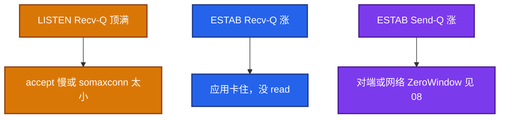
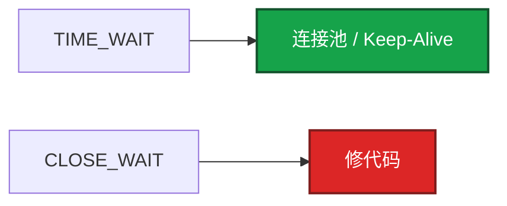
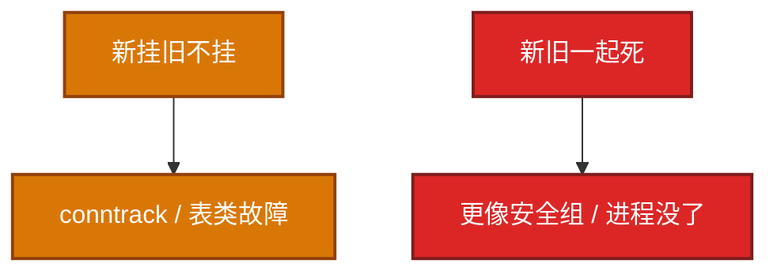
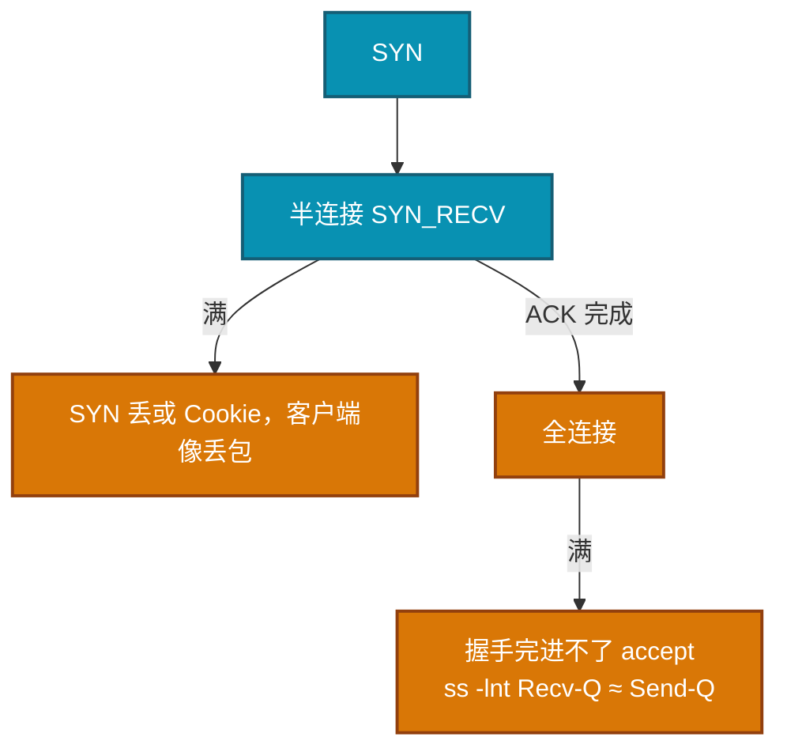

# 06｜网络栈与 Socket · 练习题

先自己画图或口述，再对照解答。每题标了覆盖范围：

| 标记 | 含义 |
|------|------|
| **核心** | 不懂整章就没建立起来 |
| **必会** | 值班和面试都要能讲 |
| **常用** | 线上会反复碰到 |
| **常考** | 白板和追问的高频口径 |

## 本题目录

- [Q1 Recv-Q / Send-Q](#q1)
- [Q2 TIME_WAIT / CLOSE_WAIT](#q2)
- [Q3 conntrack 满](#q3)
- [Q4 半连接 / 全连接](#q4)
- [Q5 fd 与端口](#q5)
- [Q6 ESTAB Recv-Q](#q6)
- [Q7 somaxconn](#q7)
- [Q8 新挂旧不挂](#q8)
- [Q9 tcp_tw_reuse](#q9)
- [Q10 %si 与 Recv-Q](#q10)
- [合上书](#合上书)

---

## Q1

**★★★★★｜ss 的 Recv-Q/Send-Q 在 LISTEN 和 ESTAB 下分别是什么？**

**覆盖**：核心 · 必会 · 常考

### 场景

网关 `ss -lnt` Recv-Q 顶着 Send-Q。有人说「内核接收缓冲满了，加大 rmem」。另一次是 ESTAB 上 Recv-Q 持续涨。

### 完整解答

LISTEN：Recv-Q=已完成握手未 accept 的连接数，Send-Q=backlog 上限。  
ESTAB：Recv-Q=内核里未读字节，Send-Q=未收到对端 ACK 的发送缓冲。



两边 Q 都大于 0（ESTAB）：自己不读 + 对面不收。strace 看线程在干什么。生产优先 `ss`；`netstat -s` 看 overflow 计数。

### 再追问

加大 rmem 能治 LISTEN 顶满吗？——不能。那是连接个数队列，不是字节缓冲。治 accept 速度和 backlog。

---

## Q2

**★★★★★｜TIME_WAIT 多怎么办？CLOSE_WAIT 多是谁的问题？**

**覆盖**：核心 · 必会 · 常考

### 场景

登录服 TW 几十万。战斗长连接那台 TW 很少。另一台 CLOSE_WAIT 在涨。有人要开 `tcp_tw_recycle`。

### 完整解答

TIME_WAIT 在主动关闭方，短连接正常现象。开 Keep-Alive / 连接池，必要时 `tcp_tw_reuse`（要 timestamps）。客户端端口耗尽才会把 TIME_WAIT 当故障。

CLOSE_WAIT 在被动方，没 close，修代码，不调内核。

`tcp_tw_recycle` 已移除，NAT 环境有害，不要当答案。

游戏长连接正常不会 TW 爆炸。爆炸说明有人在用短连接扫或 HTTP 没复用。先 `ss -s` 看是不是真的 TW。



### 再追问

游戏长连接会不会 TIME_WAIT 爆炸？——正常不会。先确认是不是登录/支付短连接打在这台机上。把 2MSL 改成 5s？——串话风险，先改应用。

---

## Q3

**★★★★★｜conntrack 满了什么现象？怎么处理？**

**覆盖**：核心 · 必会 · 常用

### 场景

活动高峰新玩家进不去，在线玩家还在跑。安全组没改。K8s 节点上 `conntrack -C` 顶着 max。

### 完整解答

新连接失败，已有长连接正常。表满只挡新建 NAT/跟踪，已有条目的连接还能转发。



止血调大 max；长期降 `tcp_timeout_established`（默认 **5 天**）、短连接改池子、使用率告警 **80%**。K8s SNAT/DNAT 每条连接一张表。活动高峰登录短连接最容易打满。表现像「网络抖动」。

### 再追问

只调大 max 行不行？——能止血，表更大更耗内存，风暴来了照样满。要治超时和连接模式。长连接也会占表。

---

## Q4

**★★★★★｜半连接队列和全连接队列溢出各什么表现？**

**覆盖**：核心 · 必会 · 常考

### 场景

客户端偶发进不去房，像丢包。`ss -lnt` 有时 Recv-Q≈Send-Q。`somaxconn` 还是 128。

### 完整解答



```bash
netstat -s | grep -i 'overflow\|listen queue'
sysctl net.core.somaxconn
```

有效 backlog=`min(listen(), somaxconn)`。只改一边无效。网关、Redis、Nginx 都要显式加大。容器里 somaxconn 是命名空间的值，改宿主机不一定进 Pod。

### 再追问

SYN Cookie 干什么？——半连接满时不占队列槽，把状态编码进序列号。防 SYN Flood。正常负载不应长期靠 Cookie。握手细节见 08。

---

## Q5

**★★★★☆｜fd 耗尽和端口耗尽怎么区分？**

**覆盖**：必会 · 常用

### 场景

新玩家连不上。一台是 `Too many open files`，另一台是连 Redis 失败、本机出站。

### 完整解答

fd：单进程 `/proc/PID/fd` 顶 Max open files，新 accept/open 失败。  
端口：本机出站 `ip_local_port_range` 被 TIME_WAIT/ESTAB 占满，连外部失败。

一个看进程 limits，一个看四元组本地端口。网关 CCU 上限 ≈ `min(ulimit-n, 内存, conntrack, 端口)`，只调一个会换一个瓶颈。

### 再追问

重启为什么都好？——进程退出内核收 fd；TW 也会随时间消散。不是根因消失。见 02。

---

## Q6

**★★★★☆｜ESTAB Recv-Q 持续增长说明什么？游戏里呢？**

**覆盖**：必会 · 常用 · 常考

### 场景

抓包已经看到 payload。玩家喊延迟。网关 ESTAB Recv-Q 在涨。有人要调 TCP 窗口。

### 完整解答

内核已经收到数据，用户态没 read。线程死锁、GC STW、业务堵在 DB。游戏网关表现为延迟涨但抓包已经看到 payload。先看线程，别先调 TCP 窗口。epoll 报 ready 也不等于已经 read。

### 再追问

Send-Q 涨呢？——对端没 ACK，可能对端 Recv-Q 满了（ZeroWindow，08）或网络丢包。治对端消费或查丢包，不先加大本端 sndbuf 当根因。

---

## Q7

**★★★★☆｜somaxconn 默认 128 为什么生产要改？**

**覆盖**：必会 · 常用 · 常考

### 场景

应用 `listen(1024)`。突发握手时仍 overflow。宿主机 somaxconn=4096，Pod 里还是 128。

### 完整解答

突发握手时全连接队列 128 很容易溢。有效值取 min。只改应用或只改宿主机，容器里可能仍是 128。要在 Pod sysctl 或进程自己 `listen(65535)`。

`tcp_abort_on_overflow=1` 会在满时直接 RST（快速失败）；默认 0 让客户端超时重试。网关要选清楚并监控 overflow。

### 再追问

改成 65535 就结束了吗？——队列加大只是缓冲。accept 太慢还是会满。要加速 accept 或前面加层限流。

---

## Q8

**★★★☆☆｜为什么说「新连接全挂、旧长连接还在」要优先查 conntrack？**

**覆盖**：必会 · 常用

### 场景

战斗服长连接还在打。登录全超时。安全组页面没人改过。

### 完整解答

表满只挡新建 NAT/跟踪，已有条目的连接还能转发。安全组误改通常新旧一起死。这个不对称是 conntrack/表类故障的签名。

活动高峰登录短连接最容易打满。K8s 节点必查 `conntrack -C` vs max。

### 再追问

长连接会不会把 conntrack 堆满？——会，尤其 established 超时 5 天。不是只有短连接才会满。

---

## Q9

**★★★☆☆｜tcp_tw_reuse 和打开 timestamps 的关系？**

**覆盖**：常用 · 常考

### 场景

有人关了 timestamps「减开销」，同时开了 tw_reuse 治客户端端口耗尽。

### 完整解答

reuse 依赖 TCP timestamps 判断旧包。关 timestamps 时 reuse 不安全或失效。改之前确认 `net.ipv4.tcp_timestamps=1`。仍优先应用层复用连接。

### 再追问

tw_recycle 呢？——已经从内核删除。NAT 下会丢连接。不要当方案。

---

## Q10

**★★★☆☆｜%si 打满和 Recv-Q 堆积如何分工？**

**覆盖**：必会 · 常用

### 场景

一台 CPU0 `%si` 100% 丢包；另一台 `%si` 正常但 ESTAB Recv-Q 涨。有人把两台都当成「网络栈不行」。

### 完整解答

si 满是协议栈收包 CPU 不够，包可能在网卡/软中断层就丢。Recv-Q 堆积是包已经进 socket，应用慢。一个调 RSS（03），一个调应用消费。


### 再追问

两台都扩容网关有用吗？——si 满扩容有用（包分散到多机）。Recv-Q 涨扩容不一定有用——每个进程自己不读，加实例只是把卡死复制一份，要修线程/GC。

---

## 合上书

- [ ] 能画出包从网卡到 accept/read，并分清 LISTEN 与 ESTAB 的两个 Q
- [ ] 能说出有效 backlog = min(listen, somaxconn)，容器里 somaxconn 是自己的 ns
- [ ] 能区分 TIME_WAIT 与 CLOSE_WAIT；recycle 已死；tw_reuse 要 timestamps
- [ ] 能用 `ss -s` / `ss -lntp` / `netstat -s` overflow / `conntrack -C` 值班
- [ ] 能解释新挂旧不挂是 conntrack 签名；established 默认 5 天
- [ ] 能分清 fd 耗尽 vs 端口耗尽，网关 CCU 四者一起算
- [ ] 能分清 %si 满调多队列、Recv-Q 涨调应用；游戏长连接监控 ESTAB 和 Recv-Q
