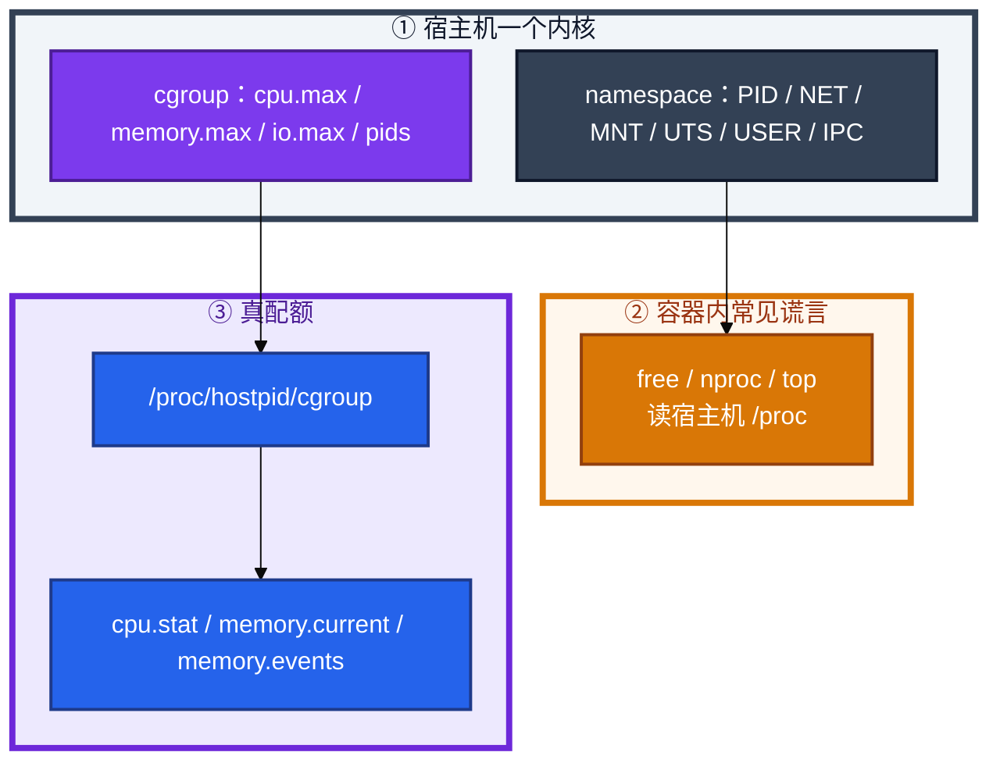
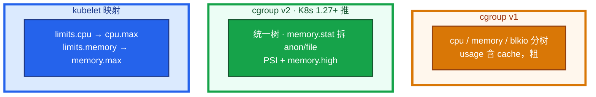
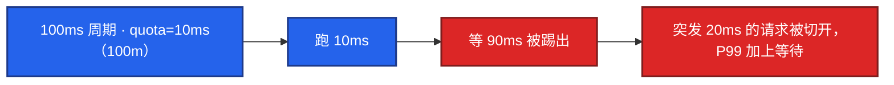
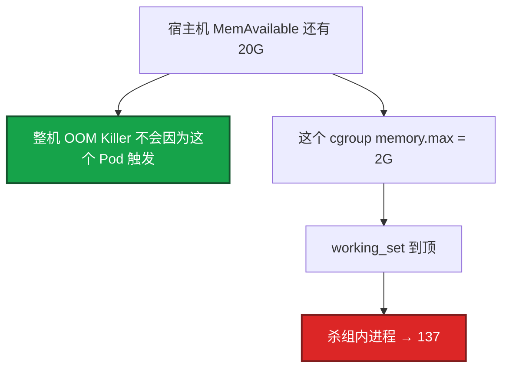
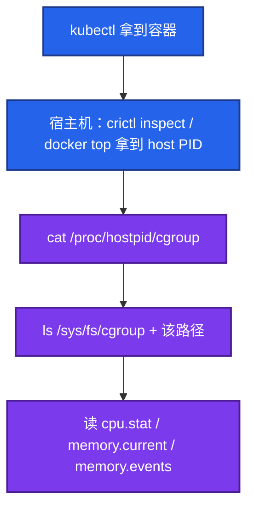
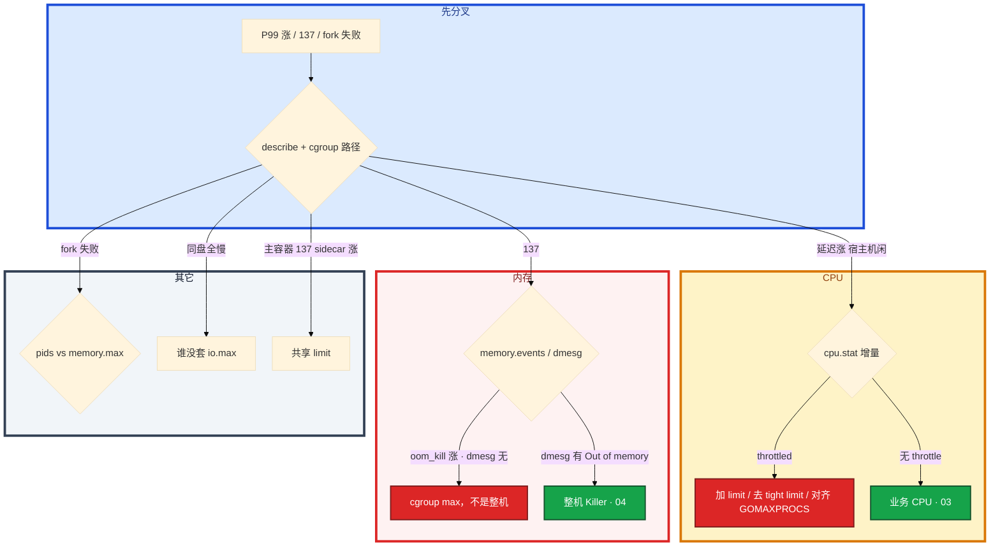

# cgroup 与容器


匹配服 P99 炸了。有人进容器看 `free` 说内存够、看 `nproc` 说有 32 核。十分钟后 137。群里有人要扩节点，另有人要把 limit 开到宿主机核数。

先别动手。这一章后半全是你会动手的：**怎么从 host PID 找到 cgroup 路径、怎么读 cpu.stat / memory.events、v1 和 v2 文件差在哪。** 前面的概念和原理，是为了让你动手时不信容器里的谎言。

**读完你能：** 白板上画出 namespace 管看见什么、cgroup 管能用多少；容器内现象能跳到宿主机 cgroup 文件；会解释 throttle 和 137；会处理 sidecar 泄漏、pids、io.max。

## 本章目录

缩进 = 上下级。3 下面才是 3.1。

想钉在**正文左边**跟着滚：菜单 **查看 → 打开视图 → 大纲**。Markdown 预览做不到独立左栏，目录只能写在文章开头。

- [1. 基本概念](#1-基本概念)
- [2. 架构图](#2-架构图)
- [3. 原理](#3-原理)
  - [3.1 CPU quota 与 throttle](#31-cpuquota-与-throttle)
  - [3.2 内存 cgroup OOM](#32-内存cgroup-oom-与-v1v2)
  - [3.3 容器里怎么看 CPU / 内存](#33-容器里怎么看-cpu--内存)
  - [3.4 IO 与 pids](#34-io-与-pids)
  - [3.5 和 K8s 的对应](#35-和-k8s-的对应只到文件这一层)
- [4. 安装部署](#4-安装部署)
  - [4.1 生产怎么选](#41-生产怎么选)
  - [4.2 kubelet 落地你实际看到什么](#42-kubelet-落地你实际看到什么)
- [5. 核心配置](#5-核心配置)
- [6. 常用命令](#6-常用命令)
- [7. 常用操作](#7-常用操作)
  - [7.1 找路径](#71-找-cgroup-路径)
  - [7.2 读 CPU](#72-读-cpu-throttle)
  - [7.3 读内存](#73-读内存-oom)
  - [7.4 对齐运行时](#74-对齐-gomaxprocs--java)
  - [7.5 sidecar / pids / io](#75-sidecar--pids--io)
- [8. 生产排障](#8-生产排障)
- [9. 必会 · 常考](#9-必会--常考)
- [合上书](#合上书问自己)

**本章不讲：** K8s request/limit YAML、QoS、HPA → [04-Pod生命周期](../../04-Kubernetes/04-Pod生命周期/)；整机 OOM Killer、Java 堆外预算 → [04 内存与OOM](../04-内存与OOM/)；Load、perf、绑核 → [03 CPU与Load](../03-CPU与Load/)；容器 PID 1 吃不到 SIGTERM → [02 进程与信号](../02-进程与信号/)；Docker 镜像/构建 → 05-工程化 07-Docker。

---

## 1. 基本概念

容器是**普通进程**加上两套内核设施：namespace 管「看见什么」，cgroup 管「能用多少」。共用同一个内核、同一份时钟源（除了部分虚拟化）。内核 panic 全机一起死，cgroup 挡不住。隔离故障域要虚机/节点池，不是再套一层 cgroup。

容器不是小虚机。容器里 `free` / `nproc` / `top` 经常在撒谎。

| | cgroup | namespace |
|--|--------|-----------|
| 问题 | 用超配额 | 看到/碰到不该看的 |
| 故障 | OOM、throttle、IO 限速、fork 失败 | 逃逸、PID 1 语义、网络叠套 |
| 接口 | `/sys/fs/cgroup` | clone / unshare |

| 在 cgroup 里 | 不在 cgroup 里 |
|--------------|----------------|
| cpu.max / memory.max / io.max / pids.max | 容器进程、可写层内容 |
| throttle、cgroup OOM、PSI | 整机 OOM Killer 的选杀顺序（04） |
| kubelet 写下的 limit | YAML 里的 QoS 公式（K8s 04） |

三个角色不要混：

| 角色 | 干什么 |
|------|--------|
| **namespace** | 你看到的进程表、网卡、挂载是这份「视图」 |
| **cgroup** | 超了 throttle、OOM、IO 限速、fork 失败 |
| **容器内 /proc** | `free` / `nproc` 读的是宿主机 meminfo 和 CPU 个数，**不是配额** |

`free` / `nproc` 读 `/proc/meminfo` 和 CPU 个数，mount namespace **不隔离**这两份宿主机视图。Pod limit 2G / 2 核时，容器里仍可能看到 64G / 32 核。Go 的 `GOMAXPROCS`、Java GC 线程会按谎言来配，然后被 cgroup 卡住。见 01。

容器内 `ps` 看到的 PID 1 是命名空间里的号码，到宿主机上对不上。排障必须用容器主进程的 **host PID**。

> **记住**：cgroup 是配额，namespace 是视图；free/nproc 不可信，路径从 `/proc/<hostpid>/cgroup` 找。

---

## 2. 架构图

先把整张图钉住。后面命令、排障都对着这张图说话。



图上三条线：

1. **没有箭头从 free/nproc 指向配额。** 那两行数字不是 cgroup。
2. **真路径在 `/proc/<hostpid>/cgroup`**，再进 `/sys/fs/cgroup/...`。
3. **内核是一份。** cgroup 挡不住 panic。

三种生产形态（迁版本和排障文件不一样）：



v1 容易「cache 算进 usage → 更早 OOM」。v2 可把可回收 file 看清楚。迁 v2 的生产理由就是排障能拆 anon/file，OOM 更可解释。

---

## 3. 原理

原理只保留动手和面试会用到的：quota 怎么切 P99、137 为什么和整机无关、容器里到底读哪个文件、sidecar 为什么能带走主容器。

**本节 5 块：** 3.1 CPU · 3.2 内存 · 3.3 容器里怎么看 · 3.4 IO/pids · 3.5 K8s 映射

### 3.1 CPU：quota 与 throttle

匹配服 limit=500m。宿主机 idle 60%。P99 从 30ms 到 400ms。镜像没设 `GOMAXPROCS`，进容器 `nproc` 是 32。扩节点没用——配额在这个 cgroup 上，节点再空也会被踢出运行队列。

v2：`cpu.max` = `$MAX $PERIOD`，如 `100000 100000` = 1 核。CFS 周期默认 **100ms**。周期内跑满被踢出运行队列。

算术：100m = 每 100ms 周期只有 **10ms** 配额。平时请求 8ms 能跑通；活动突发 20ms，必被切成「跑 10ms + 等 90ms + 再跑 10ms」，P99 直接加上那 90ms 的等待。500m 同理是每周期 50ms。扩节点改变不了这个账。



宿主机 `%id` 可以很高。这不是「CPU 没用满所以不是 CPU 问题」，是配额用完在排队。

`nr_throttled` 是累计值，看增量；重启后的绝对值没有意义。Prometheus：`rate(container_cpu_cfs_throttled_seconds_total[5m])`。阈值经验：`nr_throttled / nr_periods > 5%` 且延迟涨，就是故障。

GOMAXPROCS、Java GC 线程若按 `nproc`（宿主机 32 核）配，limit=2 核会自己把自己 throttle 死：32 个运行线程抢 2 核配额。修复：`uber-go/automaxprocs`、把 `GOMAXPROCS` 对齐 limit、Java `-XX:ActiveProcessorCount`。只加 limit 到 32 核能消掉 throttle，但会在节点上抢光 CPU。正道是对齐，不是把 quota 开到宿主机核数。

request 映射到 shares/weight，闲时能超发，**不是硬顶**。只有 limit（quota）造成 throttle。request=1 核、limit=1 核，高峰仍会 throttle。YAML 和 Guaranteed QoS 怎么配，去 K8s 04。

生产选择（机制层）：

- 延迟敏感（逻辑、匹配、KCP 网关）：request 保调度，limit 放宽或不设，靠节点隔离。tight limit 换来的「省资源」往往变成难以解释的 P99。
- 批处理、工具：紧 limit，防止吵邻居。

不设 CPU limit：无 throttle，可能吵邻居。具体 YAML 去 K8s 04。本章只要求你会读 `cpu.stat`，知道扩节点修不好 100m throttle。

> **记住**：throttle 看 cpu.stat 增量，宿主机可以很闲；GOMAXPROCS 必须对齐 cpu limit。

### 3.2 内存：cgroup OOM 与 v1/v2

Pod 137。节点 MemAvailable 20G。容器里 `free` 显示 64G。Java `-Xmx` 贴着 limit。开发说「宿主机明明还有内存」。

碰到 `memory.max` 就杀组内进程，**不需要**整机没内存。working_set 到顶 → 杀容器主进程 → 137 / OOMKilled。很多环境宿主机 dmesg **没有** 经典 Out of memory 行。



逐步对上：

1. **describe 是 OOMKilled，宿主机 dmesg 没有 Out of memory**：cgroup 杀的，不是整机 Killer。
2. **memory.current 贴着 memory.max，events 里 oom_kill 在涨**：就是这份配额。
3. **Java `-Xmx` 贴着 limit**：堆外没地方放，去 04 留 **30%+**。
4. **Guaranteed（request=limit）仍然 137**：QoS 只排节点争抢时谁先被整机 Killer 点名，挡不住自己的 max。节点选杀顺序见 04 和 K8s 04。

不要在容器里用 free 反驳「怎么会没内存」。监控 working_set vs limits，**80% 告警**。cgroup 统计的是 RSS+部分 cache，不是 `-Xmx`。接近 `memory.max` 再 `fork` 可能 ENOMEM（02）。

| | v1 | v2 |
|--|----|----|
| 树 | cpu / memory / blkio 分开 | 统一树 |
| 内存文件 | `limit_in_bytes` `usage_in_bytes` | `memory.max` `memory.current` |
| 统计 | usage 含 cache，粗 | `memory.stat` 拆 file / anon / slab |
| 压力 | 只有硬 OOM | PSI + `memory.high` 软顶 |

v1 上 usage 已经贴 limit，anon 其实不高——迁 v2 之后同样负载不再 OOM，是因为算法变了。K8s 1.27+ 推 v2。

`memory.high`（v2）是软顶：超了回收 / PSI，尽量不杀。`memory.max` 是硬顶，超了 OOM。编排器目前主要暴露 max（limit）。

PSI（Pressure Stall Information）回答「有多少时间在等 CPU / 内存 / IO」。`/proc/pressure/memory` 里 `some` 是部分任务在等，`full` 是大家都在等。比「usage 百分比」更早提示要炸。能说到 PSI 即可，不必背文件格式。

> **记住**：容器 OOM 看 memory.max / memory.events，与整机无关；Guaranteed 仍会 137。

### 3.3 容器里怎么看 CPU / 内存

排障必须能从「容器内现象」跳到「宿主机 cgroup 文件」。路径不要猜。



**在容器内看（cgroup namespace 已挂）：**

```bash
cat /sys/fs/cgroup/cpu.max
cat /sys/fs/cgroup/cpu.stat
# nr_periods / nr_throttled / throttled_usec
cat /sys/fs/cgroup/memory.max
cat /sys/fs/cgroup/memory.current
cat /sys/fs/cgroup/memory.events
# oom / oom_kill
cat /sys/fs/cgroup/memory.stat | egrep 'anon|file|slab'
```

容器内若挂了 cgroup namespace，直接 `cat /sys/fs/cgroup/cpu.stat` 看到的就是自己这份。没挂的话读到的可能是宿主机根 cgroup，数字会对不上——这时必须回宿主机用 host PID。

**在宿主机看（最稳）：**

```bash
cat /proc/<hostpid>/cgroup
# v2 常见：0::/kubepods.slice/kubepods-burstable.slice/... 
ls /sys/fs/cgroup$(awk -F: '{print $3}' /proc/<hostpid>/cgroup)
cat /sys/fs/cgroup/.../cpu.stat
cat /sys/fs/cgroup/.../memory.current
cat /sys/fs/cgroup/.../memory.max
cat /sys/fs/cgroup/.../memory.events
```

v1 路径按子系统拆：`/sys/fs/cgroup/cpu/.../cpu.cfs_quota_us`、`/sys/fs/cgroup/memory/.../memory.limit_in_bytes`、`memory.usage_in_bytes`、`memory.oom_control`。不要用 v2 文件名去 v1 树上找。

**对照表（值班默写）：**

| 你想知道 | 容器内（cgroupns） | 宿主机 | v1 文件 |
|----------|-------------------|--------|---------|
| CPU 配额 | `cpu.max` | 同左，路径从 cgroup 找 | `cpu.cfs_quota_us` / `cpu.cfs_period_us` |
| 是否 throttle | `cpu.stat` 增量 | 同左 | `cpu.stat` 的 nr_throttled |
| 内存上限 | `memory.max` | 同左 | `memory.limit_in_bytes` |
| 当前用量 | `memory.current` | 同左 | `memory.usage_in_bytes` |
| 是否 cgroup OOM | `memory.events` 的 oom_kill | 同左 | `memory.oom_control` / event |
| 谎言 | `free` / `nproc` | 节点 `free` 是整机 | 一样不可信当配额 |

`kubectl top` 是 working_set 近似，用来对 limits，不能替代 `memory.events`。现场：`kubectl describe` 看 OOMKilled；`kubectl top pod --containers` 拆 sidecar。

### 3.4 IO 与 pids

凌晨备份把同盘逻辑服拖死。内存还够，`fork` 却报 `Resource temporarily unavailable`。两件都不是「再买一块盘 / 再加内存」能直接解释的。

`io.max`（v2）/ blkio：限制读写 IOPS/带宽，防止一个容器把云盘打满拖死同盘实例。游戏备份、日志采集要单独限。活动中备份打死盘，是没给备份套 IO max。机制在 cgroup，不是「磁盘再买一块就行」的替代品，但能隔离邻居。

`pids.max`：防 fork 炸弹。碰到 `Resource temporarily unavailable` 查 pids，不一定是内存。贴着 `memory.max` 再 fork 则是 ENOMEM（02）。两件事报错不一样，路径也不一样。

> **记住**：io.max 给备份；pids.max 防 fork 炸弹；报错先分是 pids 还是内存。

### 3.5 和 K8s 的对应（只到文件这一层）

追问「limit 写在 YAML 里，内核到底改了哪个文件？」不要在这章展开 QoS 公式。

kubelet 把 Pod spec 写成 cgroup 文件：`limits.cpu` → `cpu.max` / cfs_quota；`limits.memory` → `memory.max`。requests 主要是调度和 CFS shares/weight。超 request 未超 limit 可能被压缩，但不一定 OOM。细节（QoS 类、Burstable 公式、LimitRange）全部在 K8s 04。

sidecar 和主容器共享一个 Pod 内存 limit 时，sidecar 泄漏会把逻辑进程一起 OOM。现场是主容器 137，`kubectl top pod --containers` 才能看见是日志剂在涨，不是逻辑服。limit 要按 **主容器+sidecar** 加总，监控按 container 拆。这也是机制：内存账在这一层是共享的。

> **记住**：YAML 的 limit 落到 cpu.max / memory.max；sidecar 泄漏能带走主容器。

---

## 4. 安装部署

### 4.1 生产怎么选

| 项 | 选 | 不选 |
|----|----|------|
| 版本 | cgroup v2（K8s 1.27+） | 长期停在 v1 还用 usage 含 cache 排障 |
| 延迟敏感服 | request 保调度，宽 limit 或不设 | 匹配服 100m tight limit |
| 批处理 | 紧 limit | 不限、吵邻居 |
| 运行时 | GOMAXPROCS / ActiveProcessorCount 对齐 limit | 信 nproc=32 |
| Java 内存 | limit 留 30%+ 给堆外 | -Xmx 贴满 memory.max |
| 备份 | 套 io.max | 活动中全盘狂写 |
| 监控 | working_set 80%；cpu.stat 增量 | 只看宿主机 idle / 容器内 free |

托管节点：ssh 不进机器时，靠 metrics 的 throttle 秒数和 OOMKilled 事件；路径原理不变。

### 4.2 kubelet 落地你实际看到什么


v2 常见路径形如：`/sys/fs/cgroup/kubepods.slice/kubepods-burstable.slice/kubepods-burstable-pod<uid>.slice/cri-containerd-<id>.scope/`。不要猜目录，从 `/proc/<hostpid>/cgroup` 找。

验收：进程在不算数。必须能读到该容器的 `cpu.max` / `memory.max` 与 YAML 一致，且 `kubectl describe` 的 Limit 对得上。不要只看容器内 `nproc`。

---

## 5. 核心配置

只动有证据的项。limit 写在 YAML，内核文件由 kubelet 写。本章不改 QoS 公式。

| 参数 / 文件 | 默认 / 来源 | 生产怎么用 | 改错会怎样 |
|-------------|-------------|------------|------------|
| `cpu.max` | limits.cpu | 延迟敏感放宽；批处理收紧 | 100m 把突发切成 10ms+90ms 等待 |
| `cpu.stat` | 内核累计 | 看增量、Prometheus rate | 看绝对值当故障 |
| CFS period | **100ms** | 一般不动 | — |
| `memory.max` | limits.memory | Java 留 30%+；sidecar 加总 | 贴 -Xmx 则堆外一来就 137 |
| `memory.high` | v2 软顶 | 编排器目前少暴露 | 和 max 不要混 |
| `memory.events` | 内核 | oom_kill 增量 = cgroup 杀 | 只看 dmesg 会漏 |
| `pids.max` | 运行时/策略 | 防 fork 炸弹 | 满了 `Resource temporarily unavailable` |
| `io.max` | 可选 | 备份、日志采集 | 没套 = 活动中备份打死同盘 |
| GOMAXPROCS | 默认 = nproc 谎言 | 对齐 limit 或 automaxprocs | 32 线程抢 2 核 |

> **记住**：只有 limit（quota）造成 throttle。request=1 核、limit=1 核，高峰仍会 throttle。扩节点修不好本 cgroup 的 100m。

---

## 6. 常用命令

值班先跑：describe → host PID → cgroup 路径 → cpu.stat / memory.*。

```bash
kubectl describe pod <name>
kubectl top pod <name> --containers
```

```bash
# 宿主机上
crictl inspect <cid> | grep pid
cat /proc/<hostpid>/cgroup
ls /sys/fs/cgroup$(awk -F: '{print $3}' /proc/<hostpid>/cgroup)
```

```bash
# 容器内（已挂 cgroupns）
cat /sys/fs/cgroup/cpu.max
cat /sys/fs/cgroup/cpu.stat
cat /sys/fs/cgroup/memory.max
cat /sys/fs/cgroup/memory.current
cat /sys/fs/cgroup/memory.events
cat /proc/pressure/memory
```

| 目的 | 命令 | 看什么 |
|------|------|--------|
| 是不是 OOMKilled | `kubectl describe` | Reason / Last State |
| 谁在涨 | `kubectl top pod --containers` | sidecar vs 主容器 |
| 真路径 | `cat /proc/<hostpid>/cgroup` | 不要猜 kubepods 目录 |
| throttle | `cpu.stat` 的 nr_throttled 增量 | 宿主机可以很闲 |
| cgroup OOM | `memory.current` vs `memory.max`；`memory.events` | dmesg 可能没有 |
| 谎言 | 容器内 `free` / `nproc` | 不可信 |
| PSI | `cat /proc/pressure/memory` | some / full |
| pids | `cat .../pids.current` `pids.max` | fork 失败先分 pids 还是 ENOMEM |

指标（Prometheus）：

| 指标 | 阈值 | 级别 |
|------|------|------|
| `container_cpu_cfs_throttled_seconds_total` rate | 延迟涨且 throttle > 0 | P1 |
| nr_throttled / nr_periods | **> 5%** 且 P99 涨 | P1 |
| working_set / limit | **> 0.8** | P1；到 1.0 = 137 |
| oom_kill 增量 | > 0 | P0/P1 |

---

## 7. 常用操作

### 7.1 找 cgroup 路径

1. `kubectl` 定位 Pod / 容器。
2. 上节点：`crictl inspect` / `docker top` 拿 **host PID**。
3. `cat /proc/<hostpid>/cgroup`。
4. 拼到 `/sys/fs/cgroup` 再读文件。
5. 容器内若已挂 cgroupns，可直接读 `/sys/fs/cgroup/cpu.stat`；对不上就回宿主机。

### 7.2 读 CPU throttle

```bash
cat /sys/fs/cgroup/.../cpu.stat
# nr_periods / nr_throttled / throttled_usec
```

看增量。`GOMAXPROCS` 远大于 limit 会加重。修复：对齐并发、加 limit、或核心链路不设 tight limit。

### 7.3 读内存 OOM

```bash
cat /sys/fs/cgroup/memory.max
cat /sys/fs/cgroup/memory.current
cat /sys/fs/cgroup/memory.events
```

describe 看 OOMKilled；核对 Java Xmx（堆外见 04）。不要在容器里用 free 反驳。

### 7.4 对齐 GOMAXPROCS / Java

Go：`GOMAXPROCS=<limit 核数>` 或 `uber-go/automaxprocs`。Java：`-XX:ActiveProcessorCount`。不要只把 limit 开到宿主机核数。

### 7.5 sidecar / pids / io

limit 按主容器+sidecar 加总，监控按 container 拆。`Resource temporarily unavailable` 先查 `pids.max`。备份套 `io.max`。

---

## 8. 生产排障

和 01 同一套三问：进程还在不在？还能不能跑满配额？已有流量还通不通？

**cgroup throttle = P99 爆炸，不是宿主机没 CPU。** **cgroup OOM = 137，不是节点没内存。**



现场顺序：

```bash
kubectl describe pod <name>
kubectl top pod <name> --containers
cat /proc/<hostpid>/cgroup
cat /sys/fs/cgroup/.../cpu.stat
cat /sys/fs/cgroup/.../memory.current
cat /sys/fs/cgroup/.../memory.max
cat /sys/fs/cgroup/.../memory.events
```

| 现象 | 先做什么 | 不要做什么 |
|------|----------|------------|
| P99 涨、宿主机 idle 高 | cpu.stat 增量；对齐 GOMAXPROCS | 先扩节点 |
| 100m limit 活动超时 | 配额在这个 cgroup | 扩节点当修复 |
| 137、节点还有内存 | memory.events；不要信 free | 用容器内 free 反驳 |
| Guaranteed 仍 137 | 自己的 max | 当 QoS 选杀 |
| nproc=32、limit=2 | 设 GOMAXPROCS / ActiveProcessorCount | 把 limit 开到 32 当正道 |
| fork 失败、内存还够 | pids.max | 先加内存 |
| 同盘实例全慢 | 备份/日志的 io.max | 只买盘当隔离 |
| 主容器 137 | top --containers | 只重启逻辑服 |

匹配服 limit 500m，活动瞬间计算高峰被 throttle，匹配超时，宿主机 CPU 60% idle。扩节点没用，要加 limit 或去 limit。`GOMAXPROCS` 还是 16。

有状态逻辑服和 Sidecar 共享一个 Pod 内存 limit，sidecar 日志剂泄漏把逻辑进程 OOM。监控按 container 拆才能看见是谁涨。

---

## 9. 必会 · 常考

白板和追问高频，能一口回：

| 说法 | 对错 | 口径 |
|------|:----:|------|
| 容器是微型虚拟机 | 错 | 共享内核的进程隔离 |
| 容器里 free/nproc 就是配额 | 错 | 读宿主机 /proc |
| cgroup 能隔离内核崩溃 | 错 | panic 全机一起死 |
| 宿主机 idle 高所以不是 CPU 问题 | 错 | 可能在 throttle |
| request 造成 throttle | 错 | 只有 limit/quota |
| 扩节点能修好 100m throttle | 错 | 配额在这个 cgroup 上 |
| 只加 limit 到 32 核替代 GOMAXPROCS | 错 | 正道是对齐 |
| 节点还有内存就不会 137 | 错 | 碰到 memory.max 就杀 |
| Guaranteed 不会 OOMKilled | 错 | 挡不住自己的 max |
| compact/v1 usage 贴 limit 就是 anon 满 | 错 | v1 usage 含 cache |
| memory.high 和 memory.max 一样 | 错 | high 软顶，max 硬顶 |
| sidecar 泄漏只死 sidecar | 错 | 共享 Pod 内存能带走主容器 |
| fork 失败一定是内存 | 错 | 先查 pids.max |

数字：CFS 周期 **100ms**；100m = 每周期 **10ms**；throttle 经验 **5%**；working_set 告警 **80%**；Java 堆外留 **30%+**；K8s **1.27+** 推 v2。

易混：cgroup vs namespace；throttle vs 整机缺 CPU；cgroup OOM vs 整机 Killer；v1 usage vs v2 anon/file；memory.high vs max；pids vs ENOMEM；容器内 cgroupns vs 宿主机根。

---

## 合上书，问自己

1. cgroup 和 namespace 各管什么？free/nproc 为什么撒谎？
2. 从容器内现象怎么跳到宿主机 cgroup 文件？cpu.stat / memory.events 读哪几行？
3. 100m 在 100ms 周期里是多少配额？扩节点为什么修不好 throttle？
4. 137 但节点还有内存，怎么证明是 cgroup 杀的？Guaranteed 还会吗？
5. v1 和 v2 对内存排障差在哪？PSI、memory.high 是什么？
6. sidecar 泄漏谁死？pids.max 和 io.max 各防什么？

六题都能口述，这一章就过了。下一章把 TCP/UDP 剖开：三次握手、长连接心跳、游戏什么时候该 KCP。
