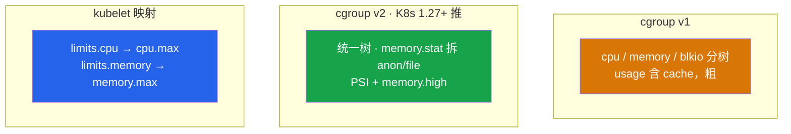
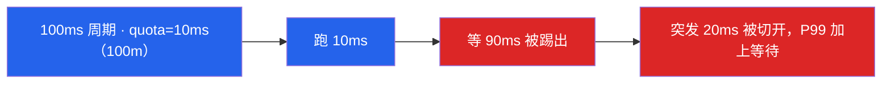
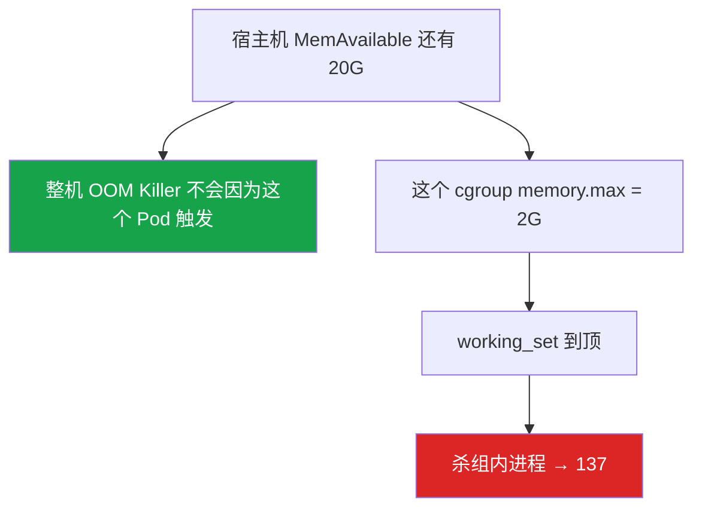
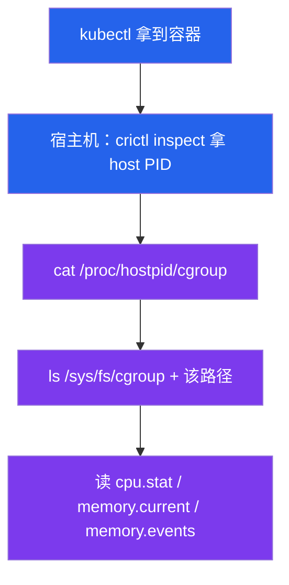
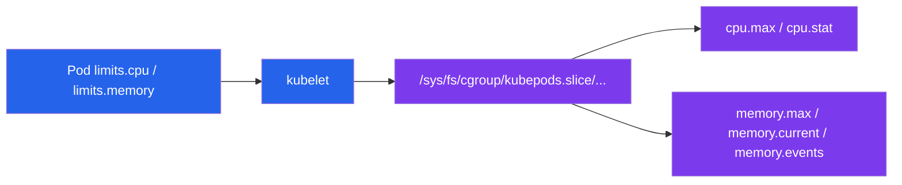
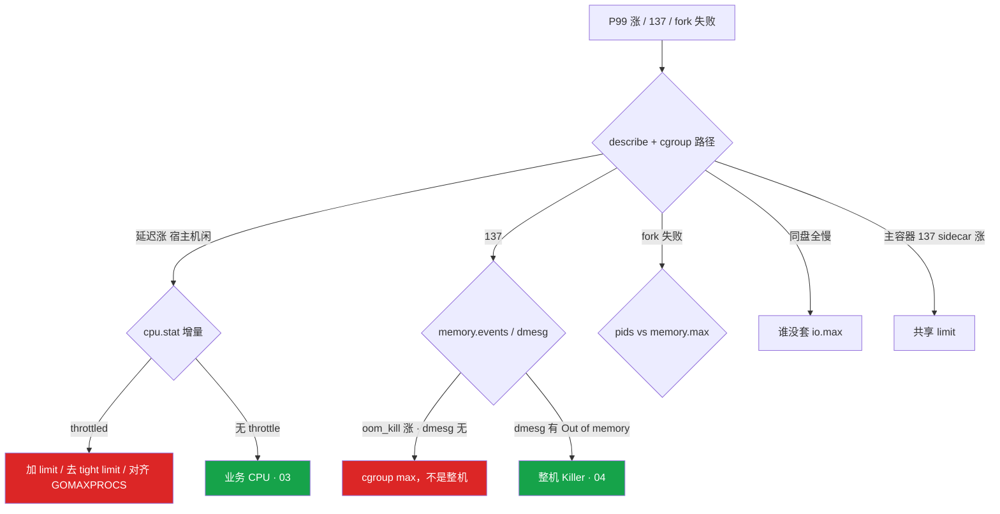

# cgroup 与容器


匹配服 P99 炸了。有人进容器看 `free` 说内存够、看 `nproc` 说有 32 核。十分钟后 137。这一章只做一件事——**不信容器里的谎言，从 host PID 找到 cgroup 文件**。

**本章主线（排障就按这三步想）：**

1. **认脸**：namespace 管看见什么，cgroup 管能用多少；`free`/`nproc` 读的是宿主机 `/proc`，不是配额。
2. **找路径**：host PID → `/proc/<pid>/cgroup` → `/sys/fs/cgroup/...` → 读 `cpu.stat` / `memory.events`。
3. **分杀法**：throttle 看 `nr_throttled` 增量；137 看 `memory.events` 的 `oom_kill`——和整机 OOM 不是一回事。

**读完你能：** 白板上画出 namespace 管看见什么、cgroup 管能用多少；容器内现象能跳到宿主机 cgroup 文件；会解释 throttle 和 137；会处理 sidecar 泄漏、pids、io.max。

## 本章目录

- [1. 基本概念](#1-基本概念)
- [2. 架构图](#2-架构图)
- [3. 原理](#3-原理)
- [4. 落地](#4-落地)
- [5. 核心配置](#5-核心配置)
- [6. 命令与操作](#6-命令与操作)
- [7. 生产排障](#7-生产排障)
- [8. 必会 · 常考](#8-必会--常考)
- [合上书](#合上书问自己)

**本章不讲：** K8s request/limit YAML、QoS、HPA → [04-Pod生命周期](../../04-Kubernetes/04-Pod生命周期/)；整机 OOM Killer、Java 堆外 → [04](../04-内存与OOM/)；Load、perf、绑核 → [03](../03-CPU与Load/)；容器 PID 1 吃不到 SIGTERM → [02](../02-进程与信号/)；Docker 镜像/构建 → 05-工程化 07-Docker。

---

## 1. 基本概念

容器是**普通进程**加上两套内核设施：namespace 管「看见什么」，cgroup 管「能用多少」。内核 panic 全机一起死，cgroup 挡不住。

| | cgroup | namespace |
|--|--------|-----------|
| 问题 | 用超配额 | 看到/碰到不该看的 |
| 故障 | OOM、throttle、IO 限速、fork 失败 | 逃逸、PID 1 语义、网络叠套 |
| 接口 | `/sys/fs/cgroup` | clone / unshare |

| 在 cgroup 里 | 不在 cgroup 里 |
|--------------|----------------|
| cpu.max / memory.max / io.max / pids.max | 容器进程、可写层内容 |
| throttle、cgroup OOM、PSI | 整机 OOM Killer 选杀顺序（04） |
| kubelet 写下的 limit | YAML 里 QoS 公式（K8s 04） |

三个角色不要混：

| 角色 | 干什么 |
|------|--------|
| **namespace** | 你看到的进程表、网卡、挂载是这份「视图」 |
| **cgroup** | 超了 throttle、OOM、IO 限速、fork 失败 |
| **容器内 /proc** | `free` / `nproc` 读宿主机 meminfo 和 CPU 个数，**不是配额** |

Pod limit 2G / 2 核时，容器里仍可能看到 64G / 32 核。Go `GOMAXPROCS`、Java GC 线程会按谎言来配，然后被 cgroup 卡住（见 01）。

> **记住**：cgroup 是配额，namespace 是视图；free/nproc 不可信，路径从 `/proc/<hostpid>/cgroup` 找。

---

## 2. 架构图

后面命令、排障都对着这张图。


**读图三句话：**

1. **没有箭头从 free/nproc 指向配额。** 那两行数字不是 cgroup。
2. **真路径在 `/proc/<hostpid>/cgroup`**，再进 `/sys/fs/cgroup/...`。
3. **内核是一份。** cgroup 挡不住 panic。

v1 vs v2 vs kubelet 映射：



v1 容易「cache 算进 usage → 更早 OOM」。v2 可把可回收 file 看清楚。

---

## 3. 原理

### 3.1 CPU：quota 与 throttle

**一句话：** limit=100m 意味着每 **100ms** 周期只有 **10ms** 配额——突发被切开，P99 加上等待；宿主机 `%id` 可以很高。

v2：`cpu.max` = `$MAX $PERIOD`，如 `100000 100000` = 1 核。CFS 周期默认 **100ms**。



`nr_throttled` 是累计值，看增量。Prometheus：`rate(container_cpu_cfs_throttled_seconds_total[5m])`。阈值：`nr_throttled / nr_periods > 5%` 且延迟涨 = 故障。

GOMAXPROCS 若按 `nproc`（宿主机 32 核）配，limit=2 核会自己 throttle 死。修复：`uber-go/automaxprocs`、`-XX:ActiveProcessorCount`。只有 **limit（quota）** 造成 throttle，request 不会。

### 3.2 内存：cgroup OOM 与 v1/v2

**一句话：** 碰到 `memory.max` 就杀组内进程，**不需要**整机没内存——137 和 dmesg 整机 OOM 不是一回事。



逐步对上：

1. **describe 是 OOMKilled，dmesg 无 Out of memory** → cgroup 杀的。
2. **memory.current 贴着 memory.max，events 里 oom_kill 在涨** → 就是这份配额。
3. **Java `-Xmx` 贴着 limit** → 堆外没地方放，去 04 留 **30%+**。
4. **Guaranteed（request=limit）仍然 137** → QoS 挡不住自己的 max。

| | v1 | v2 |
|--|----|----|
| 树 | cpu / memory / blkio 分开 | 统一树 |
| 内存文件 | `limit_in_bytes` `usage_in_bytes` | `memory.max` `memory.current` |
| 统计 | usage 含 cache，粗 | `memory.stat` 拆 file / anon / slab |
| 压力 | 只有硬 OOM | PSI + `memory.high` 软顶 |

`memory.high`（v2）是软顶：超了回收/PSI，尽量不杀。`memory.max` 是硬顶，超了 OOM。

### 3.3 容器里怎么看 CPU / 内存

**一句话：** 路径不要猜——host PID → `/proc/<pid>/cgroup` → 拼到 `/sys/fs/cgroup`。



**容器内（cgroupns 已挂）：**

```bash
cat /sys/fs/cgroup/cpu.max
cat /sys/fs/cgroup/cpu.stat
cat /sys/fs/cgroup/memory.max
cat /sys/fs/cgroup/memory.current
cat /sys/fs/cgroup/memory.events
```

**宿主机（最稳）：**

```bash
cat /proc/<hostpid>/cgroup
ls /sys/fs/cgroup$(awk -F: '{print $3}' /proc/<hostpid>/cgroup)
cat /sys/fs/cgroup/.../cpu.stat
cat /sys/fs/cgroup/.../memory.events
```

| 你想知道 | 容器内（cgroupns） | v1 文件 |
|----------|-------------------|---------|
| CPU 配额 | `cpu.max` | `cpu.cfs_quota_us` / `cpu.cfs_period_us` |
| 是否 throttle | `cpu.stat` 增量 | `cpu.stat` 的 nr_throttled |
| 内存上限 | `memory.max` | `memory.limit_in_bytes` |
| 是否 cgroup OOM | `memory.events` 的 oom_kill | `memory.oom_control` |
| 谎言 | `free` / `nproc` | 一样不可信当配额 |

`kubectl top` 是 working_set 近似，不能替代 `memory.events`。

### 3.4 IO 与 pids

**一句话：** `io.max` 防备份拖死同盘邻居；`pids.max` 防 fork 炸弹——报错先分 pids 还是 ENOMEM。

`io.max`（v2）/ blkio：限制读写 IOPS/带宽。活动中备份打死盘 = 没给备份套 IO max。

`pids.max`：防 fork 炸弹。`Resource temporarily unavailable` 查 pids，不一定是内存。贴着 `memory.max` 再 fork 则是 ENOMEM（02）。

### 3.5 和 K8s 的对应（只到文件这一层）

**一句话：** YAML 的 limit 落到 `cpu.max` / `memory.max`；sidecar 和主容器共享 Pod 内存 limit，sidecar 泄漏能带走主容器。

kubelet 把 Pod spec 写成 cgroup 文件。requests 主要是调度和 CFS shares/weight。QoS 公式在 K8s 04。

---

## 4. 落地

### 4.1 生产怎么选

| 项 | 选 | 不选 |
|----|----|------|
| 版本 | cgroup v2（K8s 1.27+） | 长期停在 v1 还用 usage 含 cache 排障 |
| 延迟敏感服 | request 保调度，宽 limit 或不设 | 匹配服 100m tight limit |
| 批处理 | 紧 limit | 不限、吵邻居 |
| 运行时 | GOMAXPROCS / ActiveProcessorCount 对齐 limit | 信 nproc=32 |
| Java 内存 | limit 留 30%+ 给堆外 | -Xmx 贴满 memory.max |
| 备份 | 套 io.max | 活动中全盘狂写 |
| 监控 | working_set 80%；cpu.stat 增量 | 只看宿主机 idle / 容器内 free |

### 4.2 kubelet 落地你实际看到什么



v2 常见路径：`/sys/fs/cgroup/kubepods.slice/kubepods-burstable.slice/kubepods-burstable-pod<uid>.slice/cri-containerd-<id>.scope/`。不要猜目录，从 `/proc/<hostpid>/cgroup` 找。

验收：必须能读到该容器的 `cpu.max` / `memory.max` 与 YAML 一致。不要只看容器内 `nproc`。

---

## 5. 核心配置

| 参数 / 文件 | 默认 / 来源 | 生产怎么用 | 改错会怎样 |
|-------------|-------------|------------|------------|
| `cpu.max` | limits.cpu | 延迟敏感放宽；批处理收紧 | 100m 把突发切成 10ms+90ms 等待 |
| `cpu.stat` | 内核累计 | 看增量、Prometheus rate | 看绝对值当故障 |
| CFS period | **100ms** | 一般不动 | — |
| `memory.max` | limits.memory | Java 留 30%+；sidecar 加总 | 贴 -Xmx 则堆外一来就 137 |
| `memory.high` | v2 软顶 | 编排器目前少暴露 | 和 max 不要混 |
| `memory.events` | 内核 | oom_kill 增量 = cgroup 杀 | 只看 dmesg 会漏 |
| `pids.max` | 运行时/策略 | 防 fork 炸弹 | 满了 `Resource temporarily unavailable` |
| `io.max` | 可选 | 备份、日志采集 | 没套 = 活动中备份打死同盘 |
| GOMAXPROCS | 默认 = nproc 谎言 | 对齐 limit 或 automaxprocs | 32 线程抢 2 核 |

> **记住**：只有 limit（quota）造成 throttle。扩节点修不好本 cgroup 的 100m。

---

## 6. 命令与操作

### 6.1 值班第一眼

```bash
kubectl describe pod <name>
kubectl top pod <name> --containers
```

```bash
# 宿主机上
crictl inspect <cid> | grep pid
cat /proc/<hostpid>/cgroup
ls /sys/fs/cgroup$(awk -F: '{print $3}' /proc/<hostpid>/cgroup)
```

```bash
# 容器内（已挂 cgroupns）
cat /sys/fs/cgroup/cpu.max
cat /sys/fs/cgroup/cpu.stat
cat /sys/fs/cgroup/memory.max
cat /sys/fs/cgroup/memory.current
cat /sys/fs/cgroup/memory.events
cat /proc/pressure/memory
```

典型 `cpu.stat` 输出：

```text
nr_periods 28451
nr_throttled 1523
throttled_usec 89432000
```

`nr_throttled` 在涨 = throttle 在发生，宿主机可以很闲。

### 6.2 速查表

| 目的 | 命令 | 看什么 |
|------|------|--------|
| 是不是 OOMKilled | `kubectl describe` | Reason / Last State |
| 谁在涨 | `kubectl top pod --containers` | sidecar vs 主容器 |
| 真路径 | `cat /proc/<hostpid>/cgroup` | 不要猜 kubepods 目录 |
| throttle | `cpu.stat` 的 nr_throttled 增量 | 宿主机可以很闲 |
| cgroup OOM | `memory.current` vs `memory.max`；`memory.events` | dmesg 可能没有 |
| 谎言 | 容器内 `free` / `nproc` | 不可信 |
| PSI | `cat /proc/pressure/memory` | some / full |
| pids | `pids.current` / `pids.max` | fork 失败先分 pids 还是 ENOMEM |

指标（Prometheus）：

| 指标 | 阈值 | 级别 |
|------|------|------|
| `container_cpu_cfs_throttled_seconds_total` rate | 延迟涨且 throttle > 0 | P1 |
| nr_throttled / nr_periods | **> 5%** 且 P99 涨 | P1 |
| working_set / limit | **> 0.8** | P1；到 1.0 = 137 |
| oom_kill 增量 | > 0 | P0/P1 |

### 6.3 常见操作

**找路径：** kubectl 定位 → 上节点拿 host PID → `/proc/<hostpid>/cgroup` → 拼 `/sys/fs/cgroup`。

**读 CPU throttle：** 看 `cpu.stat` 增量；修复对齐 GOMAXPROCS、加 limit、或核心链路不设 tight limit。

**读内存 OOM：** describe 看 OOMKilled；核对 Java Xmx（堆外见 04）。不要在容器里用 free 反驳。

**对齐 GOMAXPROCS / Java：** Go：`GOMAXPROCS=<limit 核数>` 或 `uber-go/automaxprocs`。Java：`-XX:ActiveProcessorCount`。

**sidecar / pids / io：** limit 按主容器+sidecar 加总，监控按 container 拆。备份套 `io.max`。

---

## 7. 生产排障

**cgroup throttle = P99 爆炸，不是宿主机没 CPU。** **cgroup OOM = 137，不是节点没内存。**



| 现象 | 先做 | 别做 |
|------|------|------|
| P99 涨、宿主机 idle 高 | cpu.stat 增量；对齐 GOMAXPROCS | 先扩节点 |
| 100m limit 活动超时 | 配额在这个 cgroup | 扩节点当修复 |
| 137、节点还有内存 | memory.events；不要信 free | 用容器内 free 反驳 |
| Guaranteed 仍 137 | 自己的 max | 当 QoS 选杀 |
| nproc=32、limit=2 | 设 GOMAXPROCS / ActiveProcessorCount | 把 limit 开到 32 当正道 |
| fork 失败、内存还够 | pids.max | 先加内存 |
| 同盘实例全慢 | 备份/日志的 io.max | 只买盘当隔离 |
| 主容器 137 | top --containers | 只重启逻辑服 |

匹配服 limit 500m，活动瞬间计算高峰被 throttle，宿主机 CPU 60% idle。扩节点没用，要加 limit 或去 limit。

---

## 8. 必会 · 常考

| 说法 | 对错 | 口径 |
|------|:----:|------|
| 容器是微型虚拟机 | 错 | 共享内核的进程隔离 |
| 容器里 free/nproc 就是配额 | 错 | 读宿主机 /proc |
| cgroup 能隔离内核崩溃 | 错 | panic 全机一起死 |
| 宿主机 idle 高所以不是 CPU 问题 | 错 | 可能在 throttle |
| request 造成 throttle | 错 | 只有 limit/quota |
| 扩节点能修好 100m throttle | 错 | 配额在这个 cgroup 上 |
| 只加 limit 到 32 核替代 GOMAXPROCS | 错 | 正道是对齐 |
| 节点还有内存就不会 137 | 错 | 碰到 memory.max 就杀 |
| Guaranteed 不会 OOMKilled | 错 | 挡不住自己的 max |
| v1 usage 贴 limit 就是 anon 满 | 错 | v1 usage 含 cache |
| memory.high 和 memory.max 一样 | 错 | high 软顶，max 硬顶 |
| sidecar 泄漏只死 sidecar | 错 | 共享 Pod 内存能带走主容器 |
| fork 失败一定是内存 | 错 | 先查 pids.max |

数字：CFS 周期 **100ms**；100m = 每周期 **10ms**；throttle 经验 **5%**；working_set 告警 **80%**；Java 堆外留 **30%+**；K8s **1.27+** 推 v2。

易混：cgroup vs namespace；throttle vs 整机缺 CPU；cgroup OOM vs 整机 Killer；v1 usage vs v2 anon/file；memory.high vs max；pids vs ENOMEM；容器内 cgroupns vs 宿主机根。

---

## 合上书，问自己

1. cgroup 和 namespace 各管什么？free/nproc 为什么撒谎？
2. 从容器内现象怎么跳到宿主机 cgroup 文件？cpu.stat / memory.events 读哪几行？
3. 100m 在 100ms 周期里是多少配额？扩节点为什么修不好 throttle？
4. 137 但节点还有内存，怎么证明是 cgroup 杀的？Guaranteed 还会吗？
5. v1 和 v2 对内存排障差在哪？PSI、memory.high 是什么？
6. sidecar 泄漏谁死？pids.max 和 io.max 各防什么？

六题能口述，这一章就过了。下一章：[TCP 与 UDP](../08-TCP与UDP/)——三次握手、长连接心跳、游戏什么时候该 KCP。
