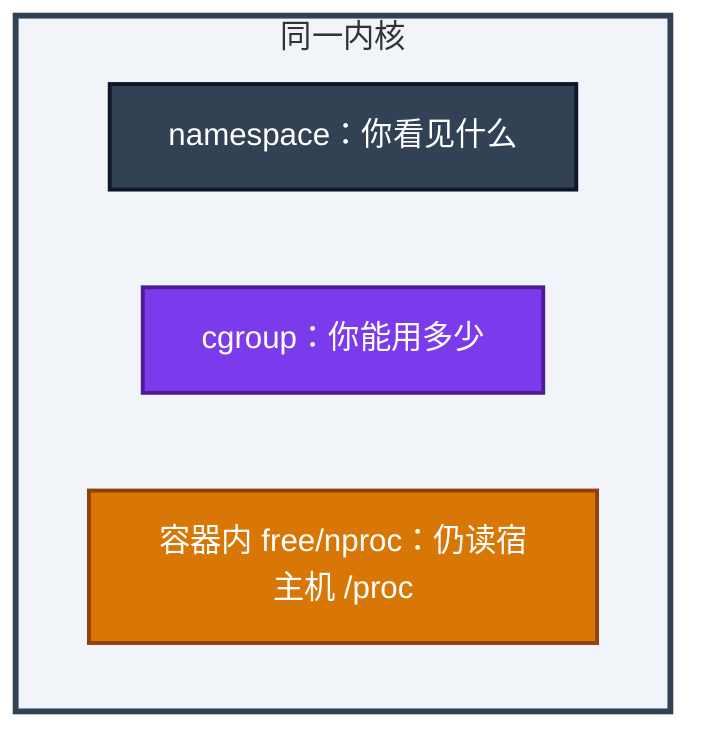
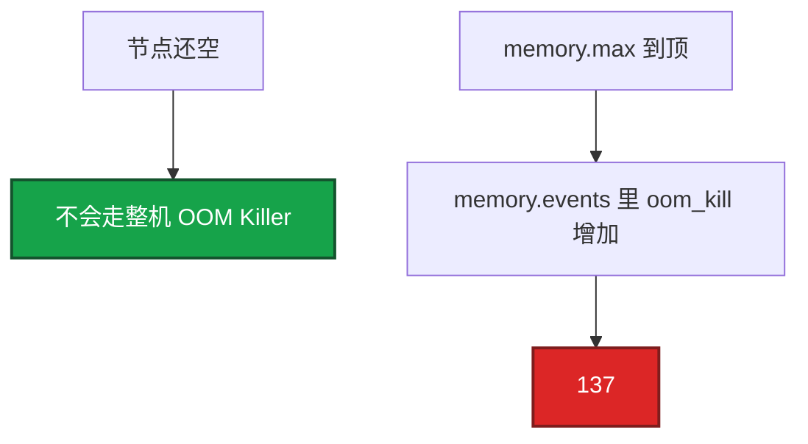
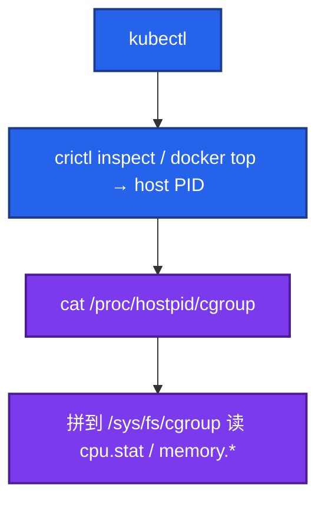

# 07｜cgroup 与容器 · 练习题

先自己画图或口述，再对照解答。每题标了覆盖范围：

| 标记 | 含义 |
|------|------|
| **核心** | 不懂整章就没建立起来 |
| **必会** | 值班和面试都要能讲 |
| **常用** | 线上会反复碰到 |
| **常考** | 白板和追问的高频口径 |

## 本题目录

- [Q1 cgroup vs namespace](#q1)
- [Q2 CPU throttling](#q2)
- [Q3 137 与整机内存](#q3)
- [Q4 nproc 与 GOMAXPROCS](#q4)
- [Q5 v1 / v2](#q5)
- [Q6 limits 落到哪个文件](#q6)
- [Q7 核心服要不要 CPU limit](#q7)
- [Q8 sidecar / pids](#q8)
- [Q9 容器里怎么看 CPU/内存](#q9)
- [合上书](#合上书)

---

## Q1

**★★★★★｜cgroup 和 namespace 分别解决什么？失效各什么样？**

**覆盖**：核心 · 必会 · 常考

### 场景

有人把容器说成「微型虚拟机」。排障时在容器里看 `free` 说内存够，十分钟后 137。

### 完整解答

cgroup 限制用量，超了 OOM / throttle。namespace 限制视图，失效会看到宿主机 PID / 网络。容器是共享内核的进程隔离，不是微型 VM。

排障时「容器里看到的」和「真配额」经常不一致：free 是 namespace 没骗到的宿主机 meminfo，配额在 cgroup。

### 再追问

cgroup 能隔离内核崩溃吗？——不能。内核 panic 全机一起死。隔离故障域要虚机/节点池。

---

## Q2

**★★★★★｜CPU throttling 怎么发现？为什么 P99 会飙？**

**覆盖**：核心 · 必会 · 常用

### 场景

匹配服 limit=500m。宿主机 idle 60%。P99 从 30ms 到 400ms。`GOMAXPROCS=16`。

### 完整解答

读 `cpu.stat` 的 `nr_throttled`（看增量）。被踢出运行队列的时间算进请求耗时，所以 wall clock P99 飙，宿主机 idle 仍可很高。

`GOMAXPROCS` 远大于 limit 会加重：16 个线程抢 0.5 核。修复：对齐并发、加 limit、或核心链路不设 tight limit。`nr_throttled` 是累计值，Prometheus 用 rate。

### 再追问

request 和 limit 哪个造成 throttle？——只有 limit（quota）。request 影响调度和 shares。request=1 核、limit=1 核，高峰仍会 throttle。YAML 怎么写见 K8s 04。

---

## Q3

**★★★★★｜OOMKilled 但宿主机内存很多，怎么解释、怎么查？**

**覆盖**：核心 · 必会 · 常考

### 场景

Pod 137。节点 MemAvailable 20G。容器里 `free` 显示 64G。Java `-Xmx` 贴着 limit。

### 完整解答

碰到了 cgroup `memory.max`，杀组内进程。跟宿主机剩余无关。

describe 看 OOMKilled；节点上 `cat /proc/<hostpid>/cgroup` 找路径，读 `memory.current` vs `memory.max`、`memory.events`。核对 Java Xmx（堆外见 04）。不要在容器里用 free 反驳「怎么会没内存」。监控 working_set vs limits。

### 再追问

Guaranteed 还会 OOMKilled？——会。那是自己的 max，不是 QoS 选杀。QoS 只在节点内存争抢时排谁先被整机 Killer 点名。

---

## Q4

**★★★★☆｜容器里 nproc=32、limit=2 核对 Go 服务意味着什么？**

**覆盖**：必会 · 常用 · 常考

### 场景

游戏网关 P99 毛刺。镜像没设 `GOMAXPROCS`。进容器 `nproc` 是 32。

### 完整解答

默认 32 个运行线程抢 2 核配额，大量 throttle。设 `GOMAXPROCS=2` 或 automaxprocs。这是游戏网关 P99 的常见根因。`nproc` 读的是宿主机核数，namespace 不改它。

Java 同理：GC 线程按宿主机核来，要用 `ActiveProcessorCount`。

### 再追问

只加 limit 到 32 核能替代设 GOMAXPROCS 吗？——能消掉 throttle，但会在节点上抢光 CPU。正道是对齐，不是把 quota 开到宿主机核数。

---

## Q5

**★★★★☆｜cgroup v1 和 v2 对内存排障差在哪？**

**覆盖**：必会 · 常考

### 场景

v1 上 usage 已经贴 limit，anon 其实不高。迁 v2 之后同样负载不再 OOM。

### 完整解答

v1 子系统分树，`usage_in_bytes` 含 cache 且难拆，容易更早 OOM。v2 统一树，`memory.stat` 拆 file/anon，有 PSI 和 `memory.high`。OOM 误杀和「看不清 cache」是迁 v2 的生产理由。K8s 1.27+ 推 v2。

### 再追问

memory.high 和 memory.max？——high 是软顶，超了回收/PSI，尽量不杀。max 是硬顶，超了 OOM。编排器目前主要暴露 max。

---

## Q6

**★★★☆☆｜K8s limits 是怎么落到内核的？request 呢？**

**覆盖**：必会 · 常用

### 场景

追问「limit 写在 YAML 里，内核到底改了哪个文件？」不要展开 QoS 公式。

### 完整解答

kubelet 写 cgroup：cpu quota（v2 `cpu.max`）、`memory.max`。requests 主要是调度和 CFS shares/weight，不是硬顶。超 request 未超 limit 可能被压缩，但不一定 OOM。

现场找文件：`cat /proc/<hostpid>/cgroup`，不要猜目录。

### 再追问

不设 CPU limit 会怎样？——无 throttle，可能吵邻居。延迟敏感服常用 request 保底、宽 limit 或不设，用节点隔离。具体 YAML 去 K8s 04。

---

## Q7

**★★★☆☆｜核心游戏服要不要设 CPU limit？**

**覆盖**：必会 · 常考

### 场景

匹配服 100m limit，平时能跑，活动全超时。宿主机空闲。

### 完整解答

延迟敏感有状态服倾向只设 request、宽 limit 或不设，用节点隔离。tight limit 换来的「省资源」往往变成难以解释的 P99。100m 在 100ms 周期里只有 10ms 配额，突发必被切开。批处理、工具链相反，紧 limit 保护节点。

### 再追问

扩节点能修好 100m throttle 吗？——不能。配额在这个 cgroup 上，节点再空也会被踢出运行队列。

---

## Q8

**★★★☆☆｜sidecar 泄漏谁死？pids.max 碰到什么报错？**

**覆盖**：必会 · 常用

### 场景

逻辑服和日志 sidecar 一个 Pod。sidecar RSS 涨，主容器 137。另一台 `fork` 报 `Resource temporarily unavailable`，内存还够。

### 完整解答

共享 Pod 内存 limit 时，sidecar 泄漏能把主容器一起带走。limit 按主容器+sidecar 加总，监控按 container 拆。

`pids.max` 防 fork 炸弹。`Resource temporarily unavailable` 先查 pids，不一定是内存。贴着 `memory.max` 再 fork 则是 ENOMEM（02）。

### 再追问

io.max 什么时候上？——给备份、日志采集套 IO 上限，防止活动中把同盘实例打满。机制在 cgroup，不是「磁盘再买一块就行」的替代品，但能隔离邻居。

---

## Q9

**★★★★☆｜容器里怎么看 CPU / 内存配额？路径从哪找？**

**覆盖**：核心 · 必会 · 常用

### 场景

进容器 `cat /sys/fs/cgroup/cpu.stat` 数字像宿主机根。有人猜 `kubepods` 目录。另一台已经挂了 cgroupns。

### 完整解答

不要猜路径。用容器主进程的 **host PID**：

容器内若已挂 cgroup namespace，直接读 `/sys/fs/cgroup/cpu.max`、`cpu.stat`、`memory.max`、`memory.current`、`memory.events` 就是自己这份。没挂则可能读到宿主机根，数字对不上，必须回宿主机。v1 用 `cpu.cfs_quota_us`、`memory.limit_in_bytes`，不要拿 v2 文件名去 v1 树上找。`free` / `nproc` 永远不是配额。

### 再追问

`kubectl top` 能替代 memory.events 吗？——不能。top 是 working_set 近似，OOM 要看 events 的 oom_kill 增量。dmesg 没有 Out of memory 也很常见。

---

## 合上书

- [ ] 能画出 namespace 管视图、cgroup 管配额，并说明 free/nproc 不可信
- [ ] 能从 host PID 找到 cgroup 路径，读 cpu.stat / memory.current / memory.events
- [ ] 能把 100m throttle 讲到 100ms 周期里只有 10ms；扩节点修不好
- [ ] 能解释 137 与整机无关；Guaranteed 仍会 OOM
- [ ] 能对比 v1/v2，说出 PSI 和 memory.high
- [ ] 能处理 sidecar 泄漏、pids.max、io.max；GOMAXPROCS 必须对齐 limit
