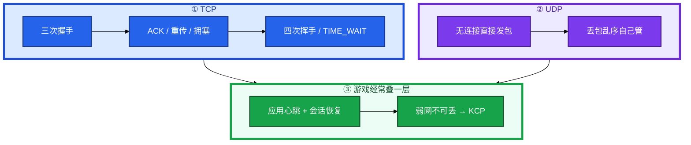
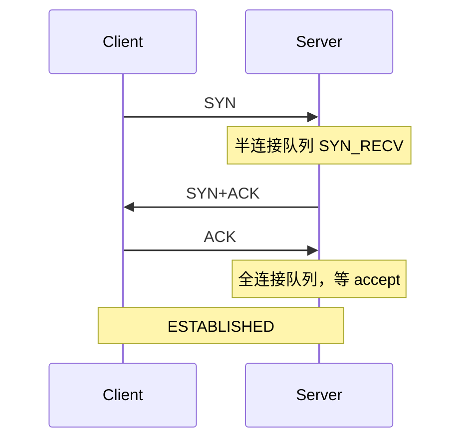
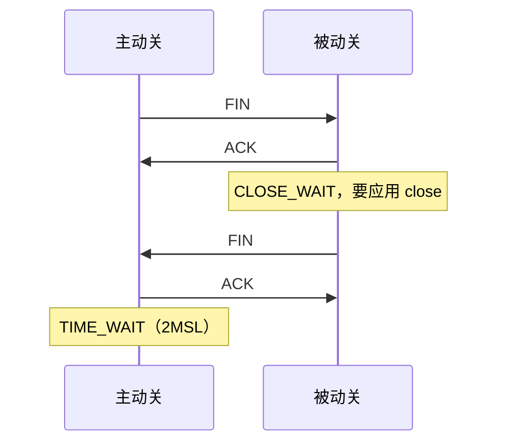
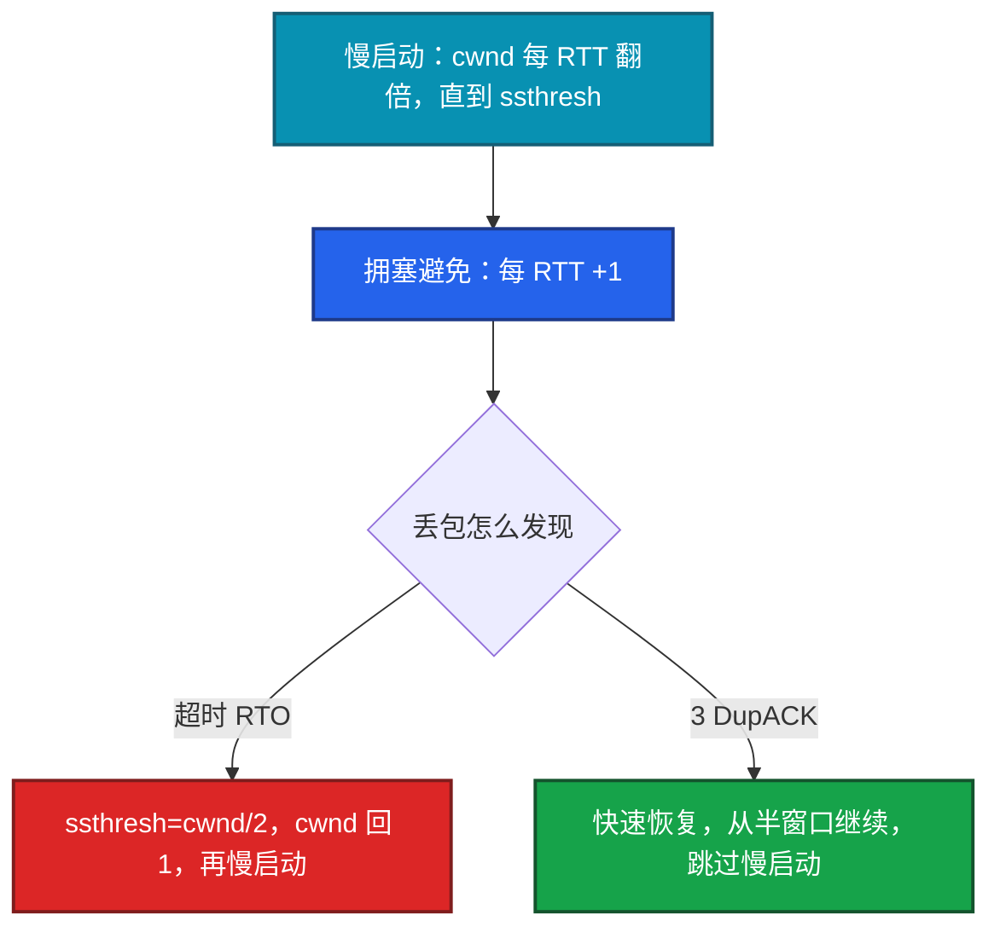
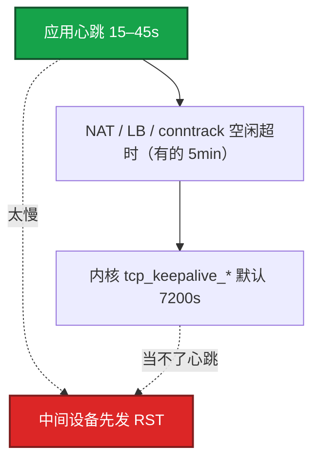
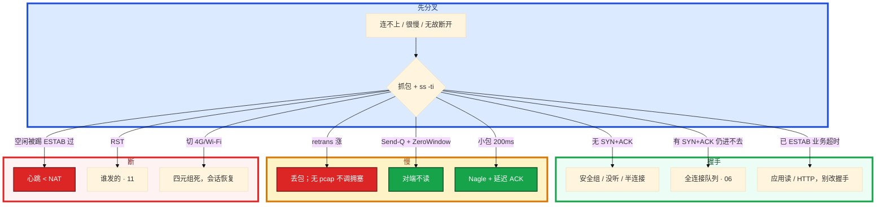

# TCP 与 UDP


策划要把所有战斗协议改 KCP「更流畅」，支付回调也有人提议走同一条通道。跨海玩家技能同步卡。另一次：玩家挂机 8 分钟被踢，TCP 状态还是 ESTAB。

先别动手。这一章后半全是你会动手的：**怎么读 ss -ti、怎么解释重传和 ZeroWindow、心跳间隔怎么定、游戏什么时候 UDP/KCP。** 前面的概念和原理，是为了让你动手时不选错传输。

**读完你能：** 白板上画出三次握手和四次挥手；能讲清 min(rwnd,cwnd)、RTO vs 3 DupACK；会配应用心跳而不是内核 keepalive；能按「能不能丢」选 TCP/UDP/KCP。

## 本章目录

缩进 = 上下级。3 下面才是 3.1。

想钉在**正文左边**跟着滚：菜单 **查看 → 打开视图 → 大纲**。Markdown 预览做不到独立左栏，目录只能写在文章开头。

- [1. 基本概念](#1-基本概念)
- [2. 架构图](#2-架构图)
- [3. 原理](#3-原理)
  - [3.1 三次握手、四次挥手](#31-三次握手四次挥手)
  - [3.2 TIME_WAIT 与 CLOSE_WAIT](#32-time_wait-与-close_wait协议视角)
  - [3.3 可靠传输](#33-可靠传输重传窗口拥塞)
  - [3.4 游戏长连接](#34-长连接游戏标配)
  - [3.5 UDP、KCP、QUIC](#35-udpkcpquic)
  - [3.6 Nagle 与延迟 ACK](#36-nagle-与延迟-ack)
- [4. 安装部署](#4-安装部署)
  - [4.1 生产怎么选](#41-生产怎么选)
  - [4.2 落地你实际看到什么](#42-落地你实际看到什么)
- [5. 核心配置](#5-核心配置)
- [6. 常用命令](#6-常用命令)
- [7. 常用操作](#7-常用操作)
  - [7.1 读握手与挥手](#71-读握手与挥手)
  - [7.2 读 ss -ti](#72-读-ss--ti)
  - [7.3 心跳](#73-心跳)
  - [7.4 选 UDP/KCP](#74-选-udpkcp)
  - [7.5 TCP_NODELAY](#75-tcp_nodelay)
- [8. 生产排障](#8-生产排障)
- [9. 必会 · 常考](#9-必会--常考)
- [合上书](#合上书问自己)

**本章不讲：** Recv-Q、somaxconn、conntrack、CLOSE_WAIT 堆积怎么查 → [06 网络栈与Socket](../06-网络栈与Socket/)；抓包、假 checksum、MTU → [11 网络排障与抓包](../11-网络排障与抓包/)；停服 TERM/KILL、优雅关 socket → [02 进程与信号](../02-进程与信号/)；sysctl 怎么落盘 → [18 内核参数与sysctl](../18-内核参数与sysctl/)。本章偏协议与传输，不背状态机每一个边角。

---

## 1. 基本概念

TCP 给的是可靠、有序的字节流：握手占资源、丢包要等重传、一条连接上后面的字节会等前面的洞。UDP 给的是报文：无握手、无内核拥塞控制、无重传，丢了就是丢了。

要可靠的，和能丢下一帧的，不是同一种传输。登录、支付、GM 走 TCP/HTTP。位置广播 20Hz 可丢，走 UDP。弱网又不可丢才上 KCP。支付不要跟战斗混一条通道。

| TCP | UDP |
|-----|-----|
| SYN 三次握手 | 无连接，直接发包 |
| ACK / 重传 / 拥塞 | 丢包、乱序自己管 |
| 四次挥手 / TIME_WAIT | 内核不管可靠 |
| 发送 = min(rwnd, cwnd) | 适合可丢的实时帧 |

| 在传输层 | 不在这一层 |
|----------|------------|
| 握手、窗口、重传、心跳间隔 | Listen 队列、conntrack 表（06） |
| RST vs FIN | HTTP 状态码（09） |
| KCP 用户态 ARQ | 抓包手法（11） |

内核 keepalive 默认 **7200s**，当不了游戏心跳。NAT/LB 往往几分钟就掐空闲连接。必须应用层心跳。

> **记住**：可靠走 TCP；可丢走 UDP；弱网又不可丢才上 KCP，支付不要跟战斗混一条通道。

---

## 2. 架构图

先把整张图钉住。后面握手、拥塞、选协议都对着这张图说话。



图上三条线：

1. **TCP 可靠有序，UDP 尽最大努力。**
2. **游戏长连接必须应用心跳**，内核 keepalive 太慢。
3. **KCP 是用户态可靠 UDP**，不是「全部改 KCP」银弹。

三种生产通道（选的时候故障域不一样）：


---

## 3. 原理

原理只保留动手和面试会用到的：两次为什么不行、TW 为什么等 2MSL、发送受什么限制、心跳为什么必须应用层。

**本节 6 块：** 3.1 握手挥手 · 3.2 TW/CW · 3.3 窗口拥塞 · 3.4 长连接 · 3.5 UDP/KCP · 3.6 Nagle

### 3.1 三次握手、四次挥手

开场让你画握手。有人答「因为要双方都确认」。追问「两次为什么不行」。用一次登录把状态对上 `ss` 里你能看见的东西。



两次握手不行：迟到的旧 SYN 会让 Server 进入 ESTABLISHED 并占资源，Client 不认。第三次 ACK 证明「这是我这次发起的」。

逐步对应你眼睛看到的：

1. **SYN 发出去，对端没有 SYN+ACK**：安全组、进程没听、半连接满把 SYN 丢了。抓包见 11，队列见 06。
2. **对端回了 SYN+ACK，本端 ACK 之后仍进不去**：全连接队列满，`ss -lnt` Recv-Q 顶满，应用还没 `accept()`。看 `ListenOverflows`（06），不是应用错误码。
3. **`ss` 已经 ESTAB，业务仍超时**：握手成功了，卡在应用读或后面的 HTTP。不要回头改握手参数。

半连接满时 SYN Cookie 把状态编进序列号，防 SYN Flood；正常负载不应长期靠 Cookie。半连接溢出表现像丢包。全连接在第三次之后。

挥手：收 FIN 的一侧若还有数据，必须先 ACK 再稍后 FIN，所以常见四次。若同时没有数据，部分实现可合并成三次（FIN+ACK），不要死磕「必须四次包」。能讲清半关闭和「无数据可合并」就对。



RST 是异常终止，不保证对端收完数据，缓冲区可丢。你眼睛看到的差别：

- 正常下线：抓包是 FIN，对端从 ESTAB 走到 CLOSE_WAIT 再关。
- 进程崩溃、端口未听、防火墙、LB 掐空闲：抓包是 RST。停服时客户端全是 RST，会被当成故障。

TERM 后停新连接、等 in-flight、再关 socket（02）。直接 `kill -9` 往往就是 RST。

> **记住**：三次握手防幽灵 SYN；四次挥手是半关闭，无数据时可合并 ACK+FIN；TW 在主动方等 2MSL。

### 3.2 TIME_WAIT 与 CLOSE_WAIT（协议视角）

TIME_WAIT 在**主动关闭方**。意义要拆开说，不要只背「等 2MSL」：

1. 最后那记 ACK 如果丢了，对端会再发 FIN；主动方还在 TIME_WAIT，才能再回 ACK。
2. 同一四元组（源IP/端口、目的IP/端口）上，旧包从网络里消失，才允许新连接复用，否则串话。

2MSL 常见 **60s**。短连接 HTTP 客户端 TW 爆炸 → 连接池，不是关掉 TIME_WAIT。`tcp_tw_recycle` 已删除。把 2MSL 改成 **5s** 有串话风险。`tcp_tw_reuse` 仅出站客户端，要 timestamps（06）。

CLOSE_WAIT：被动方收到 FIN 未 `close()`，泄漏。处理完全不同：一个调连接模型，一个改代码。调 `tcp_fin_timeout` 盖不住 CLOSE_WAIT。堆积怎么查见 06。

游戏网关应做**被动关闭或统一由一方关**，避免两端同时主动关造成状态难读。服务端若主动关大量短连接，TW 会堆在服务端。游戏应让连接复用，由网关统一生命周期。

| | TIME_WAIT | CLOSE_WAIT |
|--|-----------|------------|
| 谁 | 主动关闭方 | 被动方 |
| 正常？ | 短连接正常 | 持续涨 = bug |
| 处理 | 连接池 / Keep-Alive / tw_reuse | 修代码 |
| 调内核时间 | 不要把 2MSL 改成 5s | 盖不住 |

### 3.3 可靠传输：重传、窗口、拥塞

跨海玩家技能同步卡。`ss -ti` 里 retrans 在涨。有人要换 BBR。短连接每次都在爬窗口。先把发送受什么限制说清，再谈算法名字。

实际发送速率 = **min(rwnd, cwnd)**。rwnd 是对端还能收多少；cwnd 是本端认为网络还能塞多少。窗口不够，吞吐上不去，别先骂带宽。



| 机制 | 触发 | 注意 |
|------|------|------|
| RTO 重传 | 超时无 ACK | 指数退避，尾延迟杀手 |
| 快速重传 | 3×DupACK | 丢包时更快 |
| SACK | 选择性确认 | 只补洞，减浪费 |
| rwnd | 接收窗口 | 0 = ZeroWindow，应用读太慢 |
| cwnd | 拥塞窗口 | 慢启动指数 → 拥塞避免线性 |

跨海 RTT 大，慢启动爬坡久，短连接每次都爬 → 要用长连接。带宽时延积（BDP）= 带宽 × RTT，窗口小于 BDP 时吞吐上不去，别先骂带宽。丢包误判（无线）会把 cwnd 打下去。

读 `ss -ti` 的方法：`rtt` 大且稳定是跨海；`retrans` 在涨才是丢包；`cwnd` 被打回很小是刚超时走了慢启动。应用慢（Recv-Q 涨）时 cwnd 可能还很大——那是 ZeroWindow，不是拥塞。抓包确认是丢包再谈参数（11）。

ZeroWindow：对端 Recv-Q 堆满（06）。本端看到 Send-Q 堆积、抓包 ZeroWindow。治对端消费，不调本端 sndbuf 当根因。反过来：本端 Recv-Q 涨，对端会看到 Send-Q 涨、抓包 ZeroWindow。两边是同一件事的两端。

默认拥塞算法 Cubic 够用。高带宽高延迟可评估 BBR，要压测，不是背名词。没有 pcap 不要调 `tcp_congestion_control`。不要在生产用 `tcp_retries2` 无限加大「让它自己恢复」——重试变长等于故障检测变慢，游戏匹配会把死连接当高延迟。宁可快速失败重连。

> **记住**：发送 = min(rwnd, cwnd)；ZeroWindow=对端不读；RTO 退避慢，3 DupACK 快重传。

### 3.4 长连接：游戏标配

玩家挂机 8 分钟被踢。TCP 状态还是 ESTAB。NAT 超时 5 分钟。`tcp_keepalive_time=7200`。有人说「内核 keepalive 不够吗」。

逻辑服–网关、网关–客户端多为**小时级 TCP**。内核 keepalive 默认 **2 小时**，NAT / LB / conntrack 空闲超时往往**分钟级**。中间设备先发 RST，连接「无故」断。必须应用层心跳，间隔小于最小中间超时。游戏常见 **15–45s**，是为了 NAT，不是为了 TCP 状态机。



1. **空闲被中间 NAT/LB 掐**：要应用层心跳，间隔 < 最小中间超时。心跳还能检测逻辑死（进程活着不读包）。只靠 TCP ESTAB 看不出业务卡死。即使把 `tcp_keepalive_time` 改短，也检测不到「进程活着但不读业务」。
2. **LB 会话保持**：四层 LB 按五元组；闪断重连要能恢复会话（token），不要假设连接永不断。
3. **优雅退出**：TERM 后停新连接、等 in-flight、再关 socket，否则客户端全是 RST，会被当成故障（02）。
4. **队头阻塞**：一条 TCP 上多路复用，一包丢失整条流等重传。这是上 UDP/KCP/QUIC 的理由。HTTP/2 多流仍跑在一条 TCP 上，传输层仍阻塞——上了 HTTP/2 不等于没有队头阻塞。HTTP/3 / QUIC 流独立。游戏把移动和可靠指令复用同一 TCP 时，移动丢包会拖技能指令——拆 UDP+TCP 或 KCP 多通道。

游戏长连接在 06 的表现：TIME_WAIT 通常不多；监控 ESTAB 和 Recv-Q，不要用短连接思维调 tw。心跳丢了才重连，不要把短连接 HTTP 的 tw_reuse 套到战斗服上。

> **记住**：游戏心跳必须应用层，内核 keepalive 太慢；心跳间隔小于 NAT 超时。

### 3.5 UDP、KCP、QUIC

策划要把所有战斗协议改 KCP「更流畅」，支付回调也想走同一条通道。弱网压测里激进重传把带宽打满，更卡。按「能不能丢」选，不要按「听起来更快」选。

UDP：无握手、无内核拥塞控制、无重传。适合：实时位置、语音、房间广播；能接受丢，不能接受「等重传」。位置广播 20Hz，丢了用下一帧补上，等 TCP 重传反而更假。

| 场景 | 倾向 |
|------|------|
| 登录、支付、GM、配置 | TCP/HTTP，要可靠 |
| 帧同步关键指令 | 可靠：TCP 或 KCP 全可靠 |
| 位置广播 20Hz | UDP，丢了用下一帧 |
| 弱网手机、RTO 被抬飞 | KCP / 自研可靠 UDP |
| 公司出口只放行 443 | TCP/QUIC 走 443，纯 UDP 可能被墙 |

KCP：用户态 ARQ，通常比 TCP 更激进（更快重传、不盲从内核 cwnd）。代价：带宽浪费、CPU、要自己抗拥塞，否则会打爆链路。不要「全部改 KCP」当银弹；先测 RTT/丢包下的尾延迟。激进重传打满带宽，自己造成丢包，就会更卡。弱网可能快，也可能更卡。

QUIC：UDP + 加密 + 多流无 TCP 队头阻塞 + 连接迁移（换网不重连）。HTTP/3 用它。游戏自研协议多数仍是 TCP 或 KCP，说到「队头阻塞和迁移」即可。

手机切 4G/Wi-Fi：源 IP 变，TCP 四元组失效，连接死。要重连+会话令牌恢复；QUIC 有 CID 迁移，自研 TCP 必须应用层做。不要承诺「TCP 自己会续」。切网和 Nagle 无关——Nagle 是小包延迟。

> **记住**：可丢用 UDP；要可靠又要低延迟才 KCP，并做带宽上限；切网 = TCP 死，要会话恢复。

### 3.6 Nagle 与延迟 ACK

实时操作「200ms 卡一下」。包只有 50–100 字节。有人在调拥塞算法。先看 Nagle 关了没有。

小包合并减包量，但游戏操作包 50–100 字节会被攒到约 **40ms** 才发。实时操作必须 `TCP_NODELAY`。延迟 ACK 常见再等约 **40～200ms** 才确认。两端 Nagle 叠延迟 ACK：本端等凑包、对端等凑 ACK，体感就是「200ms 卡一下」。两端都关 Nagle，或一端关延迟 ACK。切网（四元组变了）和这件事无关。

> **记住**：实时操作必须 TCP_NODELAY；Nagle 叠延迟 ACK 就是那一下 200ms。

---

## 4. 安装部署

### 4.1 生产怎么选

| 项 | 选 | 不选 |
|----|----|------|
| 登录支付 | TCP/HTTPS | 战斗 KCP 通道 |
| 位置广播 | UDP | 等 TCP 重传 |
| 弱网关键指令 | KCP + 发送限速 | 全部改 KCP 当银弹 |
| 心跳 | 应用层 15–45s | 内核 keepalive 7200s |
| 拥塞 | 默认 Cubic；BBR 要压测 | 没有 pcap 改算法 |
| 实时操作 | TCP_NODELAY | Nagle 默认 |
| 切网 | 重连 + 会话 token | 「TCP 自己会续」 |
| TIME_WAIT | 连接池；不要 recycle | 2MSL=5s |

生产默认：TCP + 应用心跳 + 连接池（对 HTTP 下游）。实时且可丢 → UDP；实时且不可丢且 TCP 尾延迟不可接受 → KCP，并做发送限速。

### 4.2 落地你实际看到什么

应用 `setsockopt(TCP_NODELAY)`、自研心跳定时器、会话 token 在业务里。内核侧：`tcp_keepalive_time`、`tcp_retries2`、拥塞算法。sysctl 落盘见 18。队列和 conntrack 见 06。

验收：`ss -ti` 能看到 rtt/cwnd；心跳间隔小于 NAT 超时；停服用 FIN 不是 RST。不要只探端口通。

---

## 5. 核心配置

只动有证据的项。没有 pcap 不要调拥塞。游戏心跳是应用配置，不是 sysctl。

| 参数 | 默认 | 生产怎么用 | 改错会怎样 |
|------|------|------------|------------|
| `tcp_keepalive_time` | **7200s** | 只能清死连接，当不了心跳 | 当心跳 = NAT 先掐 |
| 应用心跳 | — | **15–45s** < 最小中间超时 | 太慢被 RST；太快浪费 |
| `TCP_NODELAY` | 关（Nagle 开） | 实时操作必须开 | 50 字节包攒 40ms |
| `tcp_congestion_control` | Cubic | 默认够用；BBR 要压测 | 无 pcap 乱改 |
| `tcp_retries2` | 发行版各异 | 不要无限加大 | 故障检测变慢 |
| `tcp_tw_reuse` | 0 | 仅出站客户端，要 timestamps（06） | 关 timestamps 不安全 |
| `tcp_tw_recycle` | **已删除** | 不要提 | NAT 丢连接 |
| 2MSL / TIME_WAIT | 常 **60s** | 不要改成 5s | 串话 |

> **记住**：心跳间隔小于 NAT 超时；实时必须 TCP_NODELAY；没有 pcap 不要调拥塞算法。

---

## 6. 常用命令

| 目的 | 命令 | 看什么 |
|------|------|--------|
| TCP 内部 | `ss -ti dst <ip>` | rtt / cwnd / retrans |
| 重传计数 | `netstat -s \| grep -i retransmit` | 内核累计 |
| 状态 | `ss -s` | estab / time-wait / syn-recv |
| LISTEN 队列 | `ss -lnt` | 全连接是否顶满（06） |
| keepalive | `sysctl net.ipv4.tcp_keepalive_time` | 默认 7200 |
| 拥塞算法 | `sysctl net.ipv4.tcp_congestion_control` | 默认 Cubic |

值班先跑：

```bash
ss -ti dst <ip>
ss -s
netstat -s | grep -i retransmit
sysctl net.ipv4.tcp_keepalive_time
sysctl net.ipv4.tcp_congestion_control
```

读 `ss -ti`：`rtt` 大且稳定是跨海；`retrans` 在涨才是丢包；`cwnd` 很小是刚超时；Recv-Q 涨且 cwnd 仍大是 ZeroWindow。

---

## 7. 常用操作

### 7.1 读握手与挥手

连不上：SYN 有无 SYN+ACK（抓包）→ 队列 / 安全组 / 进程。半连接满像丢包；全连接满在第三次之后。挥手能合并就合并，死磕四次包没必要。

### 7.2 读 ss -ti

很慢：看 rtt、retrans；区分丢包 vs 应用慢。ZeroWindow 治对端消费。抓包确认是丢包再谈拥塞参数。

### 7.3 心跳

应用层 15–45s，小于 NAT/LB/conntrack 空闲超时。不要用内核 keepalive 替代。心跳同时保连接和保活业务。

### 7.4 选 UDP/KCP

状态可丢用 UDP。必须到达且 TCP 在弱网下 RTO / 队头阻塞不可接受，用 KCP 并做发送限速。登录支付用 TCP/HTTPS。公司出口只放行 443 时纯 UDP 可能被墙。

### 7.5 TCP_NODELAY

实时操作必须开。两端 Nagle 叠延迟 ACK = 200ms 卡一下。切网和 Nagle 无关。

---

## 8. 生产排障

和 01 同一套三问：进程还在不在？连接还 ESTAB 吗？已有流量还通不通？

**NAT 掐空闲 = 连接「无故」断，ss 里可能已经没了或对端 RST。** 不要先调拥塞。



现场顺序：

```bash
ss -s
ss -lnt
ss -ti dst <ip>
netstat -s | grep -i retransmit
```

| 现象 | 先做什么 | 不要做什么 |
|------|----------|------------|
| 连不上 | SYN 有无 SYN+ACK | 先调窗口 |
| 跨海技能卡 | rtt/retrans；长连接 | 无 pcap 换 BBR |
| ZeroWindow | 治对端 read | 加大本端 sndbuf 当根因 |
| 挂机被踢、仍 ESTAB | 应用心跳 vs NAT | 怪内核 keepalive |
| TW 几十万 | 连接池（06） | recycle、2MSL=5s |
| CW 涨 | 修代码 | tcp_fin_timeout |
| 停服全 RST | TERM 后优雅关 | kill -9 |
| 切网断开 | 重连+token | 「TCP 会续」 |
| 全部改 KCP | 按能不能丢选 | 支付走 KCP |
| 加大 tcp_retries2 | 不要 | 故障检测变慢 |

手机切 4G/Wi-Fi：TCP 四元组变了，连接死。要重连+会话令牌恢复。

跨海：TCP 慢启动 + 丢包进入拥塞避免，技能同步卡 200ms。KCP 激进重传把操作延迟打下来，带宽涨 20%。支付回调仍走 HTTPS，不走 KCP。

不要用调 `tcp_fin_timeout` 掩盖短连接设计。

---

## 9. 必会 · 常考

白板和追问高频，能一口回：

| 说法 | 对错 | 口径 |
|------|:----:|------|
| 两次握手就够，双方都确认了 | 错 | 防幽灵 SYN，要第三次 ACK |
| 挥手必须正好四个包 | 错 | 无数据可合并 ACK+FIN |
| TIME_WAIT 在被动方 | 错 | 主动关闭方，2MSL |
| CLOSE_WAIT 调内核时间 | 错 | 应用没 close |
| 把 2MSL 改成 5s | 错 | 串话风险 |
| 发送只看带宽 | 错 | min(rwnd, cwnd) |
| ZeroWindow 加大本端 sndbuf | 错 | 对端不读 |
| 内核 keepalive 当游戏心跳 | 错 | 默认 7200s，NAT 分钟级 |
| 上了 HTTP/2 就没有队头阻塞 | 错 | 仍是一条 TCP |
| 全部战斗改 KCP 更流畅 | 错 | 激进重传可打满带宽 |
| 支付走 KCP | 错 | 登录支付 TCP/HTTPS |
| TCP 切网会自动续 | 错 | 四元组死，要会话恢复 |
| 没有 pcap 换 BBR | 错 | 默认 Cubic，BBR 要压测 |
| 加大 tcp_retries2 让它恢复 | 错 | 故障检测变慢 |
| Nagle 和切网有关 | 错 | Nagle 是小包延迟 |

数字：2MSL 常 **60s**；keepalive **7200s**；游戏心跳 **15–45s**；NAT 有的 **5min**；Nagle 约 **40ms**；叠延迟 ACK 约 **200ms**；快速重传 **3** DupACK。

易混：半连接 vs 全连接；TW vs CW；RTO vs 快速重传；rwnd vs cwnd；应用心跳 vs 内核 keepalive；HTTP/2 vs HTTP/3 队头；UDP vs KCP；Nagle vs 切网。

---

## 合上书，问自己

1. 两次握手为什么不行？四次挥手何时能合成三次？
2. TIME_WAIT 为什么等 2MSL？和 CLOSE_WAIT 怎么分工？
3. 发送 = min(谁，谁)？ZeroWindow 治哪一端？
4. 游戏为什么还要应用心跳？内核 keepalive 为什么不够？
5. 什么时候 UDP，什么时候 KCP？支付能走同一条吗？
6. 切网之后 TCP 怎样？实时操作为什么必须 TCP_NODELAY？

六题都能口述，这一章就过了。下一章把 HTTP/TLS 剖开：499/502/504、证书链、HTTP/2 仍有 TCP 队头阻塞。
