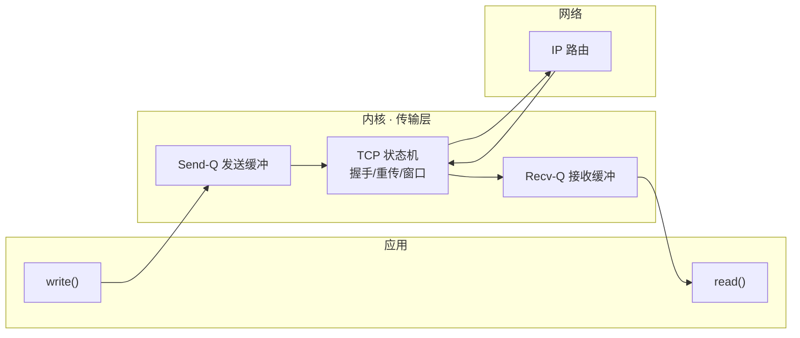
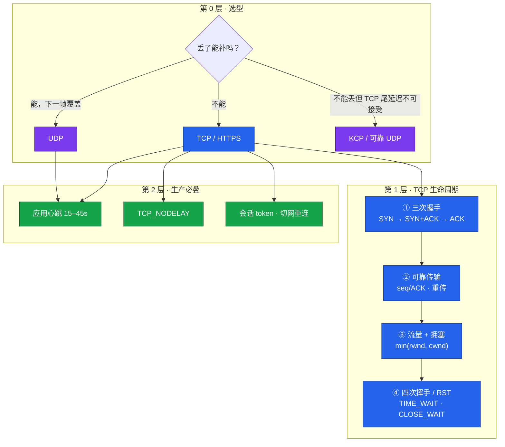
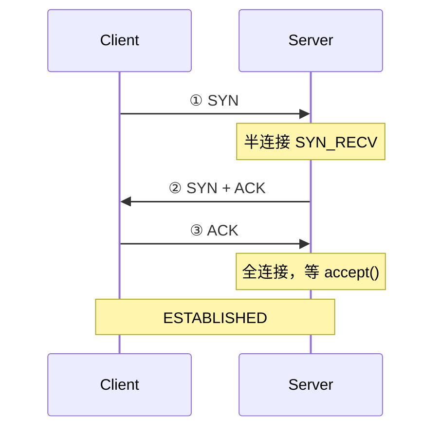
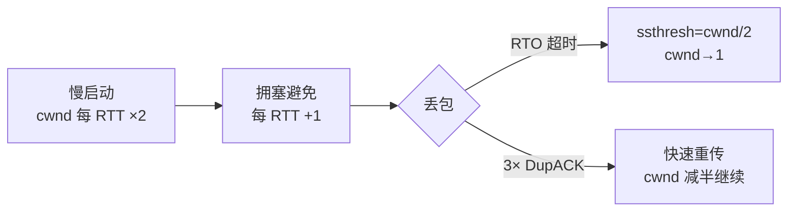
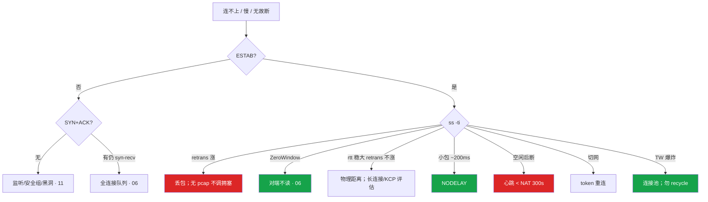

# TCP 与 UDP

> **这章解决什么**：连不上、慢、无故断、切网掉线——到底是协议层、内核队列，还是应用没做心跳？  
> **读法**：§1 扫盲建感 → §2 架构图建轮廓 → §3 逐块吃透 → §4 值班怎么用 → §6 面试怎么背。

**标记说明**（全书统一）：

| 标记 | 含义 |
|------|------|
| 🎯 **重点** | 不懂这章就没建立起来 |
| 🔥 **难点** | 容易讲错或排障走偏 |
| ⭐ **常考** | 白板 / 口述高频 |
| 🔧 **实操** | 值班必会命令或配置 |

---

## §1 基础扫盲（从 0 建立整体感）

### 1.1 传输层在这套体系里干什么

应用（游戏服、Nginx、MySQL）要发数据，不能直接把字节丢进网线。内核把应用数据**打包、寻址、送达**，传输层就是「**端到端**」这一层：只关心**本机某进程 ↔ 对端某进程**，不管中间经过多少路由器。

```
应用层    HTTP / 游戏协议 / SQL
传输层    TCP / UDP          ← 本章
网络层    IP（寻址、路由）
链路层    以太网 / Wi-Fi
```

🎯 **重点**：运维排障时，**连不上**先分清是传输层（SYN 有没有回应）还是应用层（已 ESTAB 但 HTTP 504）。

---

### 1.2 TCP 和 UDP：两种截然不同的「送货方式」

| | **TCP** | **UDP** |
|--|---------|---------|
| 形象理解 | 打电话：先拨通，确认对方在，再一句句聊，漏了会重说 | 喊话：往对面扔纸条，不保证对方收到 |
| 连接 | **有连接**（三次握手建连） | **无连接**（发就完） |
| 数据形态 | **字节流**（无边界，应用自己切帧） | **报文**（一包一包，有边界） |
| 可靠 | 有序、不丢（内核重传） | 尽最大努力，丢了不管 |
| 开销 | 握手、ACK、窗口、拥塞控制 | 头部 8 字节，极轻 |
| 典型场景 | 登录、支付、HTTP、GM 指令 | 位置广播 20Hz、语音、DNS 查询 |

🎯 **重点**：选协议的第一问永远是——**这包数据丢了，能不能用下一帧/重试补上？** 不能 → TCP；能 → UDP。

⭐ **常考**：UDP 不是「更快」，是「**不保证可靠**」；快是因为少了握手和重传，适合**可丢**的高频小数据。

---

### 1.3 必会名词（后面全文都靠这些词）

| 名词 | 是什么 | 值班里什么时候碰到 |
|------|--------|-------------------|
| **Socket** | 内核里「IP + 端口 + 协议」的句柄 | `ss -lntp` 看监听 |
| **四元组** | `(源IP, 源端口, 目的IP, 目的端口)` | 一条 TCP 连接的唯一身份证；**切网四元组变 → 连接必死** |
| **seq / ACK** | 字节序号 / 确认号 | 抓包、看重传 |
| **半连接** | 收到 SYN，还没第三次 ACK | SYN 洪水、队列满 |
| **全连接** | 三次握手完成，等 `accept()` | 连接堆积 |
| **rwnd** | 接收窗口（对端还能收多少） | ZeroWindow |
| **cwnd** | 拥塞窗口（网络还能塞多少） | 慢启动、丢包后变小 |
| **2MSL** | 报文在网络里最多存活时间的 2 倍 | TIME_WAIT 等多久 |

> **记住**：发送速率 = **min(rwnd, cwnd)**——对端读得慢和网络拥塞，**任意一个**都会把发送压下来。

---

### 1.4 一张图建立「数据怎么走」



- 应用 `write()` 只是进 **Send-Q**；真正发出去受 **min(rwnd,cwnd)** 限制。
- 对端 `read()` 慢 → **Recv-Q 满** → rwnd=0 → **ZeroWindow**，本端 Send-Q 堆满。
- Recv-Q / 队列细节 → [06 网络栈与 Socket](../06-网络栈与Socket/)

🔥 **难点**：很多「慢」不是带宽不够，是**窗口**或**应用不读**——别一上来调 sysctl。

---

### 1.5 扫盲阶段你应该有的三句话

1. **TCP 可靠但有代价**：握手、重传、队头阻塞；适合**不能丢**的数据。
2. **UDP 轻量但自负**：丢包、乱序自己管；适合**可丢、高频**的状态同步。
3. **内核只管连接，不管业务**：NAT 超时、切网、Nagle——**应用必须叠心跳、NODELAY、会话 token**。

**本章不讲**：队列/conntrack → [06](../06-网络栈与Socket/)；抓包/MTU → [11](../11-网络排障与抓包/)；HTTP/TLS → [09](../09-HTTP与TLS/)；sysctl 落盘 → [18](../18-内核参数与sysctl/)。

---

## §2 整体架构图（知识脉络）

下面这张图是**全章地图**。先能指着讲三条线，再进 §3 补细节。



### 三条主线（排障 / 面试都按这个顺序想）

| # | 主线 | 关键问题 | 第一刀 |
|---|------|----------|--------|
| 1 | **建连** | SYN 有没有 SYN+ACK？ | `ss -s` / 抓包 → 队列见 06 |
| 2 | **传输** | 丢包？对端不读？纯距离远？ | `ss -ti` → rtt / retrans / cwnd |
| 3 | **断连 / 保活** | 谁关的？NAT 掐了？切网了？ | 心跳 vs keepalive；四元组 vs token |

### 读图五句话

1. **最上面**：选型——运维最常改错的是「为了快全改 UDP/KCP」。
2. **中间四条**：TCP 从建连到可靠传到挥手，**ESTAB 之后**问题多半不在握手。
3. **最下面三块**：内核**不会**替你做的——心跳、禁 Nagle、切网重连。
4. **UDP 分支**：只有心跳（防 NAT），没有握手和重传。
5. **KCP**：叠在 UDP 上的用户态可靠层——弱网场景，**不是**支付通道。

**读完你能**：白板画出上图；按「能不能丢」选型；用 `ss -ti` 区分丢包 / ZeroWindow / 物理 RTT；口述 min(rwnd,cwnd)、RTO vs 3 DupACK、TW vs CW。

---

## §3 核心知识详解

> 每节结构：**机制 → 重点/难点/常考 → 关键数字 → 易混**

---

### 3.1 协议选型：TCP / UDP / KCP / QUIC

**机制**

| 协议 | 内核给什么 | 不给什么 | 典型场景 |
|------|------------|----------|----------|
| **TCP** | 可靠有序字节流；握手、ACK、重传、拥塞 | 低延迟保证；切网续连 | 登录、支付、GM、HTTP |
| **UDP** | 报文送达尽最大努力 | 可靠、重传、拥塞公平 | 位置 20Hz、可丢帧 |
| **KCP** | 用户态 ARQ 叠 UDP；重传比 TCP 激进 | 内核拥塞公平；需自限速 | 弱网关键指令 |
| **QUIC** | UDP + 加密 + **多流** + 连接迁移 | 生态/调试成本 | HTTP/3 |

**决策表**

| 场景 | 选 | 不选 | 原因 |
|------|----|------|------|
| 登录 / 支付 / GM | TCP/HTTPS | KCP 同通道 | 可靠 + 审计 |
| 位置广播 20Hz | UDP | TCP | 丢了用下一帧；TCP 重传拖尾 |
| 弱网关键指令 | KCP + **发送限速** | 全服改 KCP | 激进重传会打满带宽 |
| 切 Wi-Fi / 4G | **会话 token 重连** | 「TCP 会续」 | 四元组变了 |

🎯 **重点**：按**业务语义**选，不是按「谁听起来更快」。

⭐ **常考**：HTTP/2 多路复用仍跑在**一条 TCP** 上 → 仍有 **TCP 队头阻塞**；QUIC(HTTP/3) 在传输层拆流才解。

🔥 **难点**：KCP 带宽 +20% 常见，**必须限速**；支付/登录永远 TCP/HTTPS。

---

### 3.2 三次握手 · 四次挥手 · RST

**机制**



```
挥手（理想四次）：FIN → ACK → FIN → ACK
合并：无数据时 ACK 可与 FIN 合并 → 三次包
RST：异常终止，不保证对端收完缓冲数据
```

⭐ **常考 · 为什么三次握手？**

两次时 Server 收到 SYN 就 ESTABLISHED 并占资源。**迟到的历史 SYN** 会造成幽灵连接。第三次 ACK 让 Client 确认「这次 SYN+ACK 是我要的」——确认双方 **alive** 且 **同步初始 seq**。

**建连定责表** 🔧

| 本机/抓包看到 | 含义 | 下一步 |
|---------------|------|--------|
| 重复 SYN，无 SYN-ACK | drop / 没监听 / 路由黑洞 | `ss -lntp`、安全组、[11 抓包](../11-网络排障与抓包/) |
| SYN → 立刻 RST | reject 或无进程 | `ss -lntp` |
| 有 SYN-ACK，仍 syn-recv 堆积 | **全连接队列满** | [06](../06-网络栈与Socket/) somaxconn |
| 已 ESTAB，业务超时 | **握手已成功** | 查应用/HTTP，**别改握手参数** |

🔥 **难点**：ESTAB 之后还慢——**别回头调三次握手**；查 §3.4 `ss -ti` 或应用。

**TIME_WAIT vs CLOSE_WAIT**

| | TIME_WAIT | CLOSE_WAIT |
|--|-----------|------------|
| **谁** | **主动**关闭方 | **被动**关闭方 |
| **等什么** | 2MSL（防 ACK 丢 + 旧包不串新连接） | 等应用 `close()` |
| **正常？** | 短连接多 → 数量大，**可接受** | **持续涨 = bug** |
| **处理** | 连接池 / Keep-Alive / `tw_reuse`（出站+timestamps） | **修代码** close |
| **别做** | `tcp_tw_recycle`（已删）、2MSL→5s | `tcp_fin_timeout` 盖不住 |

⭐ **常考**：TIME_WAIT 在**主动关**的一方；CLOSE_WAIT 是**应用没 close**。

**关键数字**：2MSL 常见 **60s**（Linux 默认 MSL 30s × 2）。

---

### 3.3 可靠传输：seq / ACK / 重传 / 窗口

**机制**

- 每个字节有 **seq**；ACK = 「期望收到的下一个 seq」（**累计确认**）。
- **丢包检测两条路**：
  - **超时 RTO** → 指数退避重传，**cwnd 回 1**，尾延迟杀手
  - **3 个重复 ACK（DupACK）** → **快速重传** + 快速恢复（cwnd **减半**，不全回 1）



🎯 **重点**：**实际发送速率 = min(rwnd, cwnd)**

| 窗口 | 谁控制 | 为 0 说明 |
|------|--------|-----------|
| **rwnd** | 接收方（应用 `read()` 速度） | Recv-Q 满 → **ZeroWindow** |
| **cwnd** | 拥塞控制（丢包反馈） | 刚 RTO → cwnd 很小，慢启动 |

**BDP（带宽时延积）**：BDP = 带宽 × RTT。窗口 < BDP 时，**物理带宽够也跑不满**——短连接每次新建都要重新爬 cwnd。

⭐ **常考**：RTO vs 3 DupACK 对 cwnd 的影响——RTO **回 1**；DupACK **减半**继续。

🔥 **难点**：加大本端 **sndbuf** 治不了 ZeroWindow——根因在对端 **read()** 慢（06 Recv-Q）。

---

### 3.4 读 `ss -ti`：传输问题第一刀

🔧 **实操**

```bash
ss -ti dst 203.0.113.88
```

典型输出：

```text
ESTAB  0  0  10.0.1.5:9000  203.0.113.88:54321
     cubic wscale:7,7 rto:204 rtt:185.2/42.1 cwnd:4 retrans:12/28
     send 524288bps rcv_space:65535
```

| 字段 | 含义 | 怎么读 |
|------|------|--------|
| `rtt:185/42` | 当前/偏差 ms | 稳定大 = 距离；**突然跳** = 拥塞 |
| `retrans:12/28` | 当前窗口/累计 | **累计在涨** = 有丢包 |
| `cwnd:4` | 拥塞窗口 | 很小 = 刚超时，慢启动 |
| `rcv_space` | 对端通告 rwnd | **0 = ZeroWindow** |
| `cubic` | 拥塞算法 | 默认够用；**无 pcap 不换 BBR** |

**三类「慢」定责**

| 现象 | rtt | retrans | cwnd | 定责 |
|------|-----|---------|------|------|
| 跨海距离 | 稳定大 | 不涨 | 正常 | 物理 RTT；长连接 |
| 丢包拥塞 | 跳变 | **涨** | 小 | 链路/中间设备 |
| 对端不读 | 正常 | 不涨 | Send-Q 堆 | ZeroWindow，**治对端** |

---

### 3.5 长连接 · 心跳 · NAT · 队头阻塞

**矛盾**

| 层 | 典型超时 | 能当游戏心跳？ |
|----|----------|----------------|
| 应用心跳 | **15–45s** | ✅ **必须** |
| NAT/LB/conntrack 空闲 | ~**300s（5min）** | 决定心跳上限 |
| `tcp_keepalive_time` | **7200s** | ❌ 只能清**已死**连接 |

🎯 **重点**：keepalive **7200s**，NAT **~5min** 先掐——长连接**必须应用层心跳**。

**队头阻塞**：一条 TCP 上 seq 有序——**丢一包，后面全等**。多业务挤一条 TCP（含 HTTP/2）会互相拖。

🔧 常见拆法：**TCP 指令 + UDP 状态**；HTTP/3 用 QUIC 拆流。

⭐ **常考**：游戏为什么还要心跳？——不是 TCP 会断，是 **NAT/conntrack 空闲超时**。

---

### 3.6 Nagle 算法 · 延迟 ACK

**机制**：Nagle 攒小包（~**40ms**）再发；对端**延迟 ACK** 再等 **40–200ms** → 实时操作固定 ~**200ms** 卡顿，**与 RTT、切网无关**。

🔧 **修复**：`setsockopt(TCP_NODELAY, 1)` — 技能/操作通道必开。

🔥 **易混**：Nagle 是小包**发送**延迟；切网是**四元组变** → **会话 token 重连**，两回事。

---

### 3.7 UDP · KCP · QUIC 补充

| | UDP | KCP | QUIC |
|--|-----|-----|------|
| 基础 | 裸报文 | UDP + 用户态 ARQ | UDP + TLS 1.3 + 多流 |
| 可靠 | 无 | 有（更激进） | 有 |
| 队头阻塞 | 无（应用自管） | 可拆通道 | **流级别无** |
| 切网 | 无连接概念 | 同 UDP | **连接迁移** |
| 代价 | 丢包自负 | 带宽/CPU，要限速 | 实现复杂 |

KCP 适用：**弱网 + 不可丢 + TCP RTO/队头不可接受**。支付/登录仍走 TCP/HTTPS。

---

## §4 运维实操与排障

### 4.1 定责决策树



### 4.2 现象 → 先做 → 别做

| 现象 | 先做 | 别做 |
|------|------|------|
| 连不上 | SYN 有无 SYN+ACK | 先调窗口 |
| 已 ESTAB 业务慢 | 应用/HTTP；`ss -ti` | 改握手参数 |
| 跨海卡 + retrans 涨 | 长连接；评估 KCP | 无 pcap 换 BBR |
| TW 几十万 | 连接池 / Keep-Alive | recycle、2MSL=5s |
| CLOSE_WAIT 持续涨 | 查进程 `close()` | tcp_fin_timeout |
| 全改 KCP | 按「能不能丢」分通道 | 支付走 KCP |
| 空闲后无故断 | 查应用心跳 interval | 指望 keepalive 7200s |

### 4.3 生产选型落地

| 通道 | 协议 | 必配 |
|------|------|------|
| 登录 / 支付 / GM | TCP/HTTPS | — |
| 位置 / 状态广播 | UDP | 丢帧可接受 |
| 弱网关键指令 | KCP | **发送限速** + 带宽上限 |
| 所有长连接 | — | 心跳 15–45s、NODELAY（实时）、token（切网） |
| HTTP 下游 | TCP | **连接池**（减 TIME_WAIT） |

### 4.4 命令走查（带输出含义）

```bash
# 传输第一刀
ss -ti dst <ip>

# 连接状态计数
ss -s                          # syn-recv / timewait / close-wait

# 有没有人在听
ss -lntp | grep :9000

# TW / CW 数量
ss -ant state time-wait | wc -l
ss -ant state close-wait | wc -l

# 内核累计重传
netstat -s | grep -i retrans

# keepalive（别当游戏心跳）
sysctl net.ipv4.tcp_keepalive_time net.ipv4.tcp_keepalive_intvl net.ipv4.tcp_keepalive_probes
# 常见 7200 75 9
```

| 目的 | 命令 | 异常信号 |
|------|------|----------|
| 丢包？ | `ss -ti` → retrans 累计 | 不涨 = 不是丢包 |
| 半连接满？ | `ss -s` → synrecv | 涨 = SYN 洪水或队列小 |
| 对端不读？ | Send-Q 堆 + ZeroWindow | 治对端 read |
| 心跳够？ | 应用配置 vs NAT 300s | keepalive 7200s 不够 |

---

## §5 核心参数速查

| 参数 | 默认/典型 | 生产建议 | 改错后果 |
|------|-----------|----------|----------|
| 应用心跳 | — | **15–45s** | 太慢 → NAT RST |
| `tcp_keepalive_time` | **7200s** | 不当心跳用 | NAT 先掐 |
| `TCP_NODELAY` | 关 | 实时必开 | ~200ms 小包延迟 |
| `tcp_congestion_control` | cubic | 默认；BBR 压测后 | 无 pcap 乱改 |
| `tcp_tw_reuse` | 0 | 出站+timestamps | 关 timestamps 不安全 |
| `tcp_tw_recycle` | **已删除** | 别提 | NAT 丢连接 |
| 2MSL | ~**60s** | 别改 5s | 旧包串话 |
| 快速重传 | **3** DupACK | — | — |

---

## §6 面试锚点

| 问法 | 30 秒答 |
|------|---------|
| TCP 和 UDP 怎么选？ | 按**能不能丢**：支付 TCP，位置 UDP，弱网不可丢才 KCP 并限速。 |
| 为什么三次握手？ | 防**幽灵 SYN**；两次无法确认客户端 alive。 |
| TIME_WAIT 干什么？ | 主动关的一方等 **2MSL**，防 ACK 丢+旧包串话；短连接多用连接池。 |
| CLOSE_WAIT 谁的问题？ | **应用没 close()**；调内核时间盖不住。 |
| 发送速率由什么决定？ | **min(rwnd, cwnd)**；ZeroWindow 是对端不读。 |
| RTO 和快速重传区别？ | RTO 超时→cwnd 回 1；**3 DupACK**→快速重传，cwnd 减半。 |
| 游戏为什么还要心跳？ | keepalive **7200s**，NAT **~5min** 先掐；要 **15–45s** 应用心跳。 |
| HTTP/2 还有队头阻塞吗？ | 有，仍一条 TCP；QUIC/HTTP/3 才拆。 |
| 切网 TCP 会怎样？ | **四元组死**，要 token 重连；和 Nagle 无关。 |
| 什么时候上 KCP？ | 弱网+不可丢+TCP 尾延迟不可接受；**支付不能同通道**。 |

---

## §7 与相邻章节的接口

| 本章节点 | 细节在哪章 |
|----------|------------|
| 半连接/全连接队列、Recv-Q、CLOSE_WAIT 堆积 | [06 网络栈与 Socket](../06-网络栈与Socket/) |
| SYN 抓包、RST 源 IP、MTU | [11 网络排障与抓包](../11-网络排障与抓包/) |
| 499/502/504、Keep-Alive、HTTP/2 队头 | [09 HTTP 与 TLS](../09-HTTP与TLS/) |
| conntrack 表满、新挂旧不挂 | [15 iptables 与 conntrack](../15-iptables与conntrack/) |
| sysctl 持久化 | [18 内核参数](../18-内核参数与sysctl/) |

---

## §8 必会 · 常考

| 说法 | 对错 | 一句话反驳 |
|------|:----:|------------|
| 两次握手就够 | ✗ | 防幽灵 SYN，要第三次 ACK |
| 挥手必须四个包 | ✗ | 无数据可合并 ACK+FIN |
| TIME_WAIT 在被动方 | ✗ | 主动关闭方，2MSL |
| CLOSE_WAIT 调内核就好 | ✗ | 应用没 close |
| 2MSL 改成 5s | ✗ | 串话风险 |
| 发送只看带宽 | ✗ | min(rwnd, cwnd) |
| ZeroWindow 加大 sndbuf | ✗ | 对端不读 |
| keepalive 当游戏心跳 | ✗ | 7200s vs NAT 5min |
| HTTP/2 无队头阻塞 | ✗ | 仍一条 TCP |
| 全改 KCP 更流畅 | ✗ | 激进重传打满带宽 |
| 支付走 KCP | ✗ | TCP/HTTPS |
| TCP 切网会续 | ✗ | 四元组死，要 token |
| 无 pcap 换 BBR | ✗ | 默认 cubic |
| Nagle 和切网有关 | ✗ | Nagle 是小包延迟 |

**数字**：2MSL **60s** · keepalive **7200s** · 心跳 **15–45s** · NAT **~5min** · Nagle **~40ms** · +延迟 ACK **~200ms** · 快重传 **3** DupACK

**易混**：半连接 vs 全连接 · TW vs CW · RTO vs DupACK · rwnd vs cwnd · 应用心跳 vs keepalive · HTTP/2 vs QUIC · UDP vs KCP · Nagle vs 切网

---

## 合上书，问自己

1. 不看笔记：TCP 和 UDP 各解决什么问题？选型第一问是什么？
2. 白板：画出 §2 架构图，标出 TCP 生命周期 + 生产必叠三块。
3. 连不上：SYN 有无 SYN+ACK 之后各查什么？**ESTAB 后**还慢查什么？
4. min(rwnd, cwnd) 各代表什么？ZeroWindow 该治哪一端？
5. RTO 和 3 DupACK 对 cwnd 有什么不同？
6. 心跳 15–45s、keepalive 7200s、NAT 5min 三者关系？
7. 登录、位置广播、弱网指令、支付各用什么协议？为什么？

七题能讲清楚，这一章就过了。下一章：[HTTP 与 TLS](../09-HTTP与TLS/) — 499/502/504、TLS 握手、HTTP/2 与 TCP 队头的关系。
