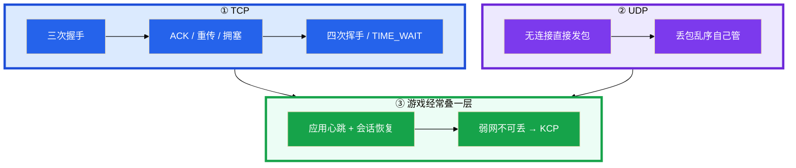
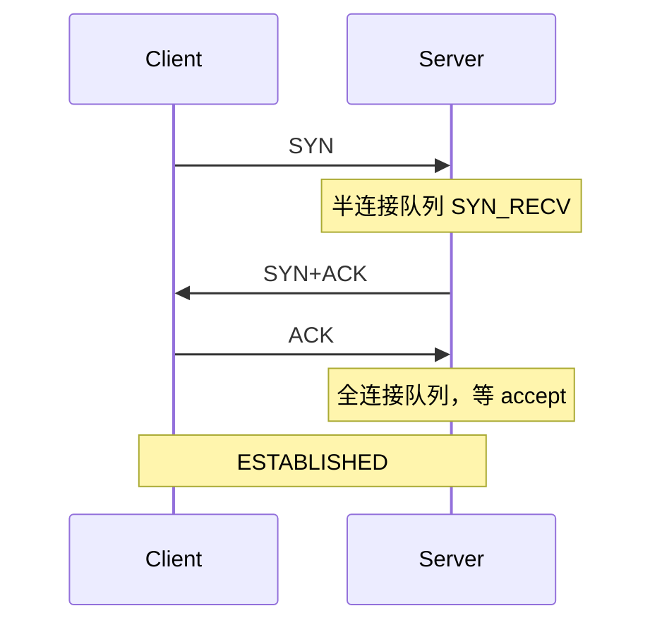
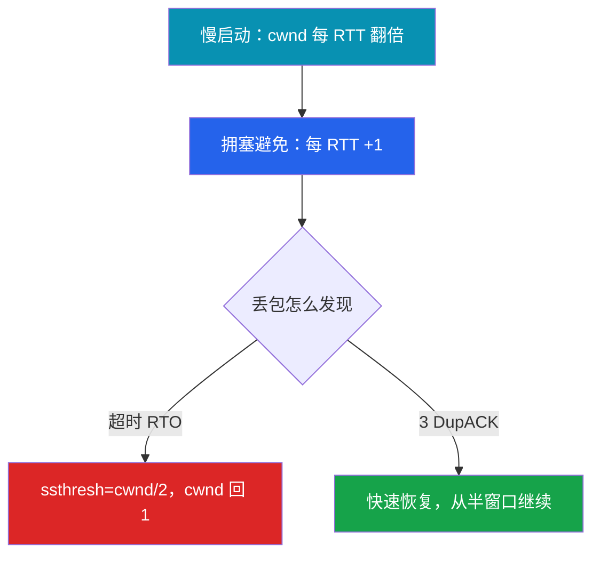
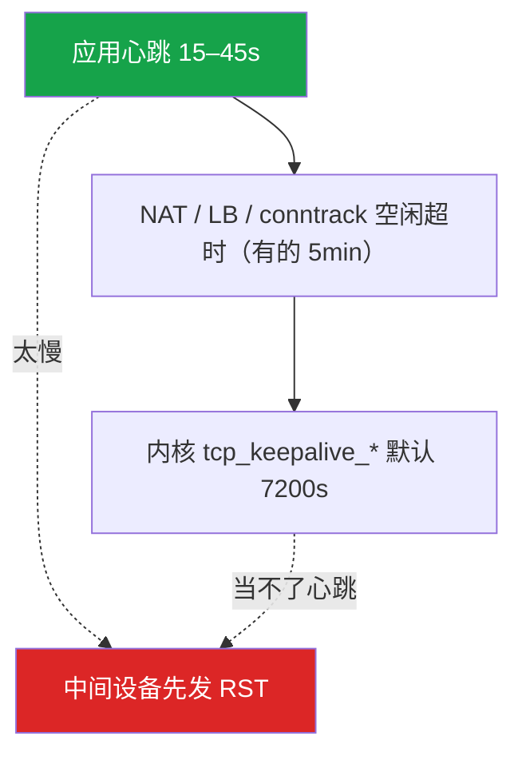
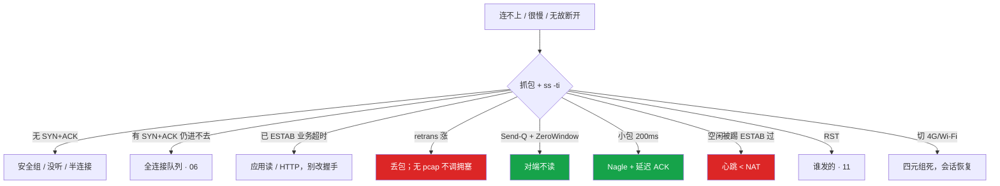

# TCP 与 UDP


策划要把所有战斗协议改 KCP「更流畅」，支付回调也想走同一条通道。运维在群里问「TCP 不是可靠的吗，为什么弱网还卡」——这一章只做一件事：**按「能不能丢」选传输，不要按「听起来更快」选**。

**本章主线（排障就按这三步想）：**

1. **握手**：SYN 有无 SYN+ACK → 全连接队列（06）→ ESTAB 后看应用，别回头改握手参数。
2. **慢/卡**：`ss -ti` 看 rtt/retrans/cwnd——发送 = min(rwnd,cwnd)；ZeroWindow 治对端消费。
3. **断线**：应用心跳 < NAT 超时；切网 = 四元组死，要会话恢复，不是 TCP 自己会续。

**读完你能：** 白板上画出三次握手和四次挥手；能讲清 min(rwnd,cwnd)、RTO vs 3 DupACK；会配应用心跳而不是内核 keepalive；能按「能不能丢」选 TCP/UDP/KCP。

## 本章目录

- [1. 基本概念](#1-基本概念)
- [2. 架构图](#2-架构图)
- [3. 原理](#3-原理)
- [4. 落地](#4-落地)
- [5. 核心配置](#5-核心配置)
- [6. 命令与操作](#6-命令与操作)
- [7. 生产排障](#7-生产排障)
- [8. 必会 · 常考](#8-必会--常考)
- [合上书](#合上书问自己)

**本章不讲：** Recv-Q、somaxconn、conntrack、CLOSE_WAIT 堆积怎么查 → [06](../06-网络栈与Socket/)；抓包、假 checksum、MTU → [11](../11-网络排障与抓包/)；停服 TERM/KILL、优雅关 socket → [02](../02-进程与信号/)；sysctl 落盘 → [18](../18-内核参数与sysctl/)。

---

## 1. 基本概念

TCP 给的是可靠、有序的字节流：握手占资源、丢包要等重传、一条连接上后面的字节会等前面的洞。UDP 给的是报文：无握手、无内核拥塞控制、无重传，丢了就是丢了。

**值班里怎么认现象**（先听玩家/监控怎么说，再对表）：

| 玩家/监控说的 | 技术含义 | 你的第一刀 |
|---------------|----------|------------|
| 「连不上、一直转圈」 | SYN 无回复或 timeout | 抓 SYN / ss -s（11） |
| 「技能放了没反应、跨海卡」 | RTT 大 + 重传 / 慢启动 | `ss -ti` 看 rtt/retrans |
| 「挂机一会儿就被踢」 | NAT/LB 掐空闲连接 | 应用心跳 vs NAT 超时 |
| 「切 Wi-Fi 就掉线」 | 四元组变了，TCP 不会续 | 会话 token 恢复 |
| 「操作有 200ms 延迟」 | 可能是 Nagle + 延迟 ACK | `TCP_NODELAY` |

| TCP | UDP |
|-----|-----|
| SYN 三次握手 | 无连接，直接发包 |
| ACK / 重传 / 拥塞 | 丢包、乱序自己管 |
| 四次挥手 / TIME_WAIT | 内核不管可靠 |
| 发送 = min(rwnd, cwnd) | 适合可丢的实时帧 |

| 在传输层 | 不在这一层 |
|----------|------------|
| 握手、窗口、重传、心跳间隔 | Listen 队列、conntrack 表（06） |
| RST vs FIN | HTTP 状态码（09） |
| KCP 用户态 ARQ | 抓包手法（11） |

内核 keepalive 默认 **7200s**，当不了游戏心跳。NAT/LB 往往几分钟就掐空闲连接。必须应用层心跳 **15–45s**。

**打个比方**：TCP 像挂号快递——签收、排序、丢件会重发；UDP 像往楼下扔传单——快，但风大（丢包）你管不着。游戏位置广播 20Hz 丢了用下一帧，像传单丢一张无所谓；支付回调像合同，必须走快递（TCP/HTTPS）。

> **记住**：可靠走 TCP；可丢走 UDP；弱网又不可丢才上 KCP，支付不要跟战斗混一条通道。

**面试怎么说**：「我按能不能丢选协议：登录支付 TCP/HTTPS，位置广播 UDP，弱网关键指令才 KCP。长连接必须应用心跳 15–45s，内核 keepalive 7200s 当不了心跳。」

---

## 2. 架构图

后面握手、拥塞、选协议都对着这张图。



**读图三句话：**

1. **TCP 可靠有序，UDP 尽最大努力**——别用 UDP 做支付，别用 TCP 等 20Hz 位置帧的重传。
2. **游戏长连接必须应用心跳**，内核 keepalive 太慢，NAT 分钟级就掐。
3. **KCP 是用户态可靠 UDP**，不是「全部改 KCP」银弹——激进重传会打满带宽。

三种生产通道：


---

## 3. 原理

### 3.1 三次握手、四次挥手

**一句话：** 三次握手防幽灵 SYN；四次挥手是半关闭，无数据时可合并 ACK+FIN。

**打个比方**：握手像打电话确认对方在线——你说「喂」、对方「喂我在」、你说「好我开始说」；两次不够，因为可能是打错的旧号码（迟到的 SYN）。挥手像挂断——你说「我说完了」、对方「收到」、对方「我也说完了」、你说「收到再见」；有时后两句能合并成一句。

**现场走一遍**（新玩家连不上房间服）：

1. 玩家报「房间连不上」，监控 room-server 新建连接失败率飙升。
2. 在 room-server 上看监听和连接状态：

```bash
ss -lntp | grep 9000
ss -s | grep -i syn
```

3. 屏幕可能出现：

```text
LISTEN  0  128  0.0.0.0:9000  *:*  users:(("room-server",pid=1234))
TCP:  synrecv 1523  （半连接队列在涨）
```

4. 抓包确认（缩到 IP+端口，见 11）：

```bash
tcpdump -i eth0 'host 203.0.113.8 and port 9000 and tcp[tcpflags] & tcp-syn != 0' -nn -c 20
```

5. 看到大量重复 SYN、无 SYN-ACK → 对端没听或中间 drop；看到 SYN+ACK 但 `ss` 仍 syn-recv → 全连接队列满（06）。
6. 若 `ss -ti` 已经 ESTAB 但业务超时 → **握手成功了**，别改握手参数，查应用读或 HTTP。

**输出解读：**

| 本机看到 | 定责 | 下一步 |
|----------|------|--------|
| 重复 SYN，无 SYN-ACK | 对端没听、安全组 drop、中间黑洞 | ss -lntp、mtr、两端抓 |
| SYN → **立刻 RST** | 没监听或防火墙 reject | `ss -lntp` |
| SYN+ACK 到了仍 syn-recv | 全连接队列满 | 06 somaxconn |
| 已 ESTAB，业务超时 | 应用层 | 别回头改握手 |



挥手：RST 是异常终止，不保证对端收完数据。TERM 后停新连接、等 in-flight、再关 socket（02），否则客户端全是 RST。

**面试怎么说**：「连不上我先分 SYN 有没有 SYN-ACK。有 SYN-ACK 还进不去查全连接队列；已经 ESTAB 业务超时别改握手，查应用。两次握手不行，要第三次 ACK 防幽灵 SYN。」

> **记住**：ESTAB 后还慢 = 应用问题，不是握手问题。

### 3.2 TIME_WAIT 与 CLOSE_WAIT（协议视角）

**一句话：** TW 在主动关闭方等 2MSL（防 ACK 丢失 + 旧包不串话）；CW 持续涨 = 应用忘了 `close()`。

**打个比方**：TIME_WAIT 像挂断后等两声「嘟——」确认对方真的挂了、旧话不会串到新通话；CLOSE_WAIT 像对方说「我说完了」但你一直握着话筒不放——电话占线，资源泄漏。

**现场走一遍**（短连接网关 TW 爆炸）：

1. 登录网关高峰后，`ss -s` 显示 time-wait 几十万。
2. 查连接状态：

```bash
ss -s
ss -ant state time-wait | wc -l
ss -ant state close-wait | wc -l
```

3. 屏幕出现：

```text
TCP:   estab 1200, closed 45000, orphaned 0, timewait 48000
close-wait: 0
```

4. TW 高、CW 不涨 → 短连接正常副作用，用连接池 / Keep-Alive（09）解决，**不要 tcp_tw_recycle**（已删除）。
5. 若 close-wait 持续涨 → 应用 bug，修代码 `close()`，调 `tcp_fin_timeout` 盖不住。

**输出解读：**

| | TIME_WAIT | CLOSE_WAIT |
|--|-----------|------------|
| 谁 | 主动关闭方 | 被动方 |
| 正常？ | 短连接正常 | 持续涨 = bug |
| 处理 | 连接池 / Keep-Alive / tw_reuse | 修代码 |
| 调内核时间 | 不要把 2MSL 改成 5s | 盖不住 |

2MSL 常见 **60s**。`tcp_tw_recycle` 已删除——NAT 下会丢连接。

**面试怎么说**：「TIME_WAIT 在主动关的一方等 2MSL，短连接多会爆，用连接池和 Keep-Alive。CLOSE_WAIT 涨是应用没 close，调内核时间盖不住。2MSL 别改成 5s，有串话风险。」

### 3.3 可靠传输：重传、窗口、拥塞

**一句话：** 实际发送速率 = **min(rwnd, cwnd)**——窗口不够，吞吐上不去，别先骂带宽。

**打个比方**：rwnd 像收件人仓库还能放多少货；cwnd 像公路限流牌——路堵了（丢包）整队减速。实际发货 = 两者里更小的那个，不是「带宽够大就能跑满」。

**现场走一遍**（跨海玩家技能同步卡 200ms）：

1. 东南亚玩家报技能延迟，国内服 RTT 正常。
2. 在 room-server 上看该玩家连接：

```bash
ss -ti dst 203.0.113.88
```

3. 屏幕出现：

```text
ESTAB  0  0  10.0.1.5:9000  203.0.113.88:54321
     cubic wscale:7,7 rto:204 rtt:185.2/42.1 cwnd:4 retrans:12/28
     send 524288bps rcv_space:65535
```

4. 解读：`rtt:185ms` 稳定大 = 跨海物理距离；`retrans:12/28` 累计 28 次重传且在涨 = 有丢包；`cwnd:4` 很小 = 刚超时走了慢启动。
5. 短连接每次新建都要爬慢启动 → 要用**长连接**；BDP = 带宽 × RTT，窗口小于 BDP 时吞吐上不去。
6. 没有 pcap 不要调 `tcp_congestion_control`——默认 Cubic 够用。

**输出解读：**

| 字段 | 含义 | 异常信号 |
|------|------|----------|
| `rtt` | 往返时延 ms | 稳定大 = 距离；突然跳 = 拥塞 |
| `retrans: A/B` | 当前/累计重传 | B 在涨 = 丢包 |
| `cwnd` | 拥塞窗口 | 很小 = 刚超时慢启动 |
| `rcv_space` | 接收窗口 | 0 = ZeroWindow |



| 机制 | 触发 | 注意 |
|------|------|------|
| RTO 重传 | 超时无 ACK | 指数退避，尾延迟杀手 |
| 快速重传 | **3×** DupACK | 丢包时更快 |
| rwnd | 接收窗口 | 0 = ZeroWindow，应用读太慢 |
| cwnd | 拥塞窗口 | 慢启动指数 → 拥塞避免线性 |

ZeroWindow：对端 Recv-Q 堆满（06）。本端 Send-Q 堆积、抓包 ZeroWindow。治对端消费，不调本端 sndbuf 当根因。

**面试怎么说**：「发送速率是 min(rwnd,cwnd)。ss -ti 看 rtt 和 retrans，跨海 RTT 大且 retrans 涨才是丢包。ZeroWindow 是对端不读，加大本端 sndbuf 没用。没有 pcap 不换 BBR。」

### 3.4 长连接：游戏标配

**一句话：** 内核 keepalive 默认 **7200s**，NAT/LB 分钟级就掐——必须应用层心跳，间隔小于最小中间超时。

**打个比方**：内核 keepalive 像每 2 小时才打一次「还在吗」——中间的门卫（NAT）5 分钟没人进出就锁门了。应用心跳像每 30 秒敲一下门，门卫才让你留着。

**现场走一遍**（挂机 10 分钟被踢，连接看起来还在）：

1. 玩家报「挂机一会儿就掉线」，ss 里连接可能已消失或只剩 RST。
2. 查 NAT/LB 空闲超时和心跳配置：

```bash
sysctl net.ipv4.tcp_keepalive_time net.ipv4.tcp_keepalive_intvl net.ipv4.tcp_keepalive_probes
# 常见 7200 75 9
grep -i heartbeat /path/to/game-server.conf
```

3. 屏幕：`tcp_keepalive_time = 7200`——2 小时才探测；游戏配置心跳可能是 60s 或没配。
4. 中间 NAT/LB 空闲超时常见 **5min**（300s）→ 心跳必须 **15–45s**，小于最小中间超时。
5. LB 会话保持：闪断重连要能恢复会话（token），不是 TCP 自己会续。

**输出解读：**

| 配置 | 典型值 | 能否当游戏心跳 |
|------|--------|----------------|
| `tcp_keepalive_time` | **7200s** | 不能，太慢 |
| NAT/LB 空闲 | **5min** 常见 | 决定心跳上限 |
| 应用心跳 | **15–45s** | 必须 |
| conntrack 超时 | 见 06/15 | 也要小于它 |



队头阻塞：一条 TCP 上多路复用，一包丢失整条流等重传。HTTP/2 多流仍跑在一条 TCP 上——上了 HTTP/2 不等于没有队头阻塞。游戏拆 UDP+TCP 或 KCP 多通道。

**面试怎么说**：「游戏必须应用心跳 15–45s，小于 NAT 超时。内核 keepalive 7200s 当不了心跳。HTTP/2 仍有 TCP 队头阻塞，战斗长连接要拆通道。」

### 3.5 UDP、KCP、QUIC

**一句话：** 可丢用 UDP；要可靠又要低延迟才 KCP，并做带宽上限；切网 = TCP 四元组死，要会话恢复。

**打个比方**：UDP 像广播喇叭——喊出去不管听没听到；KCP 像自己雇的快递员跑 UDP 赛道——比官方快递（TCP）更激进，但费油（带宽）还得自己设限速；切网像换手机号——旧通话（四元组）必然断，得拿暗号（token）重新拨。

**现场走一遍**（弱网手机 + 策划要全改 KCP）：

1. 东南亚弱网 RTT 300ms+，TCP RTO 被抬飞，技能同步卡。
2. 评估 KCP 试点：只改**不可丢的关键指令**，位置广播仍 UDP 20Hz。
3. 压测对比：

```text
TCP:   操作延迟 P99 280ms，带宽 2Mbps
KCP:   操作延迟 P99 80ms，带宽 2.4Mbps（+20%）
UDP:   位置帧丢包 3%，可接受（下一帧覆盖）
```

4. 支付回调仍走 HTTPS/TCP——**不能跟战斗 KCP 混通道**。
5. 手机切 4G/Wi-Fi：源 IP 变，TCP 四元组失效 → 客户端重连 + 会话 token 恢复。

**输出解读：**

| 场景 | 倾向 | 原因 |
|------|------|------|
| 登录、支付、GM | TCP/HTTPS | 要可靠 |
| 位置广播 20Hz | UDP | 丢了用下一帧 |
| 弱网关键指令 | KCP + 发送限速 | RTO/队头不可接受 |
| 公司出口只放行 443 | TCP/QUIC | 纯 UDP 可能被墙 |

KCP：用户态 ARQ，通常比 TCP 更激进。代价：带宽浪费、CPU、要自己抗拥塞。激进重传打满带宽，就会更卡。

QUIC：UDP + 加密 + 多流无 TCP 队头阻塞 + 连接迁移。HTTP/3 用它。

**面试怎么说**：「按能不能丢选：位置 UDP，支付 TCP，弱网不可丢才 KCP 并做带宽上限。全部改 KCP 会打满带宽。切网四元组死，要会话 token，TCP 不会自己续。」

### 3.6 Nagle 与延迟 ACK

**一句话：** 实时操作必须 `TCP_NODELAY`——Nagle 叠延迟 ACK 就是那一下 **200ms** 卡。

**打个比方**：Nagle 像等小件凑满一箱再发货——50 字节的技能包被攒着；延迟 ACK 像收件人故意晚签字——两者叠加，操作包可能等 **40ms + 200ms**。

**现场走一遍**（操作有固定 200ms 卡顿，RTT 正常）：

1. 国内玩家 RTT 20ms，但每个技能固定卡 ~200ms。
2. 抓包看小包间隔（11）或确认应用是否开了 NODELAY：

```bash
ss -ti dst <client-ip> | grep -i nagle
# 或代码里 setsockopt(TCP_NODELAY)
```

3. Nagle 默认开：小包（50–100 字节）被攒到约 **40ms** 才发；对端延迟 ACK 常见再等 **40～200ms**。
4. 修复：`setsockopt(TCP_NODELAY, 1)`——实时操作必须开。
5. 切网和 Nagle 无关——Nagle 是小包延迟，不是换网络。

**输出解读：**

| 现象 | 根因 | 修复 |
|------|------|------|
| 固定 ~200ms 小包延迟 | Nagle + 延迟 ACK | TCP_NODELAY |
| 切 4G 掉线 | 四元组变 | 会话恢复 |
| 跨海 RTT 大 | 物理距离 | 长连接、KCP 评估 |

**面试怎么说**：「实时操作必须 TCP_NODELAY。Nagle 叠延迟 ACK 约 200ms 卡，和切网无关。切网是四元组死，要 token 重连。」

---

## 4. 落地

### 4.1 生产怎么选

| 项 | 选 | 不选 |
|----|----|------|
| 登录支付 | TCP/HTTPS | 战斗 KCP 通道 |
| 位置广播 | UDP | 等 TCP 重传 |
| 弱网关键指令 | KCP + 发送限速 | 全部改 KCP 当银弹 |
| 心跳 | 应用层 15–45s | 内核 keepalive 7200s |
| 拥塞 | 默认 Cubic；BBR 要压测 | 没有 pcap 改算法 |
| 实时操作 | TCP_NODELAY | Nagle 默认 |
| 切网 | 重连 + 会话 token | 「TCP 自己会续」 |
| TIME_WAIT | 连接池；不要 recycle | 2MSL=5s |

生产默认：TCP + 应用心跳 + 连接池（对 HTTP 下游）。实时且可丢 → UDP；实时且不可丢且 TCP 尾延迟不可接受 → KCP，并做发送限速。

### 4.2 落地你实际看到什么

应用 `setsockopt(TCP_NODELAY)`、自研心跳定时器、会话 token 在业务里。内核侧：`tcp_keepalive_time`、`tcp_retries2`、拥塞算法。sysctl 落盘见 18。队列和 conntrack 见 06。

验收：`ss -ti` 能看到 rtt/cwnd；心跳间隔小于 NAT 超时；停服用 FIN 不是 RST。

---

## 5. 核心配置

| 参数 | 默认 | 生产怎么用 | 改错会怎样 |
|------|------|------------|------------|
| `tcp_keepalive_time` | **7200s** | 只能清死连接，当不了心跳 | 当心跳 = NAT 先掐 |
| 应用心跳 | — | **15–45s** < 最小中间超时 | 太慢被 RST；太快浪费 |
| `TCP_NODELAY` | 关（Nagle 开） | 实时操作必须开 | 50 字节包攒 40ms |
| `tcp_congestion_control` | Cubic | 默认够用；BBR 要压测 | 无 pcap 乱改 |
| `tcp_retries2` | 发行版各异 | 不要无限加大 | 故障检测变慢 |
| `tcp_tw_reuse` | 0 | 仅出站客户端，要 timestamps（06） | 关 timestamps 不安全 |
| `tcp_tw_recycle` | **已删除** | 不要提 | NAT 丢连接 |
| 2MSL / TIME_WAIT | 常 **60s** | 不要改成 5s | 串话 |

> **记住**：心跳间隔小于 NAT 超时；实时必须 TCP_NODELAY；没有 pcap 不要调拥塞算法。

---

## 6. 命令与操作

### 6.1 值班第一眼

```bash
ss -ti dst <ip>
ss -s
ss -lnt
netstat -s | grep -i retransmit
sysctl net.ipv4.tcp_keepalive_time
sysctl net.ipv4.tcp_congestion_control
```

读 `ss -ti`：`rtt` 大且稳定是跨海；`retrans` 在涨才是丢包；`cwnd` 很小是刚超时；Recv-Q 涨且 cwnd 仍大是 ZeroWindow。

典型 `ss -ti` 输出：

```text
ESTAB  0  0  10.0.1.5:8080  203.0.113.8:54321
     cubic wscale:7,7 rto:204 rtt:45.2/12.1 cwnd:10 retrans:3/5
```

`retrans:3/5` → 累计 5 次重传、当前窗口 3 次——跨海 RTT 大且 retrans 在涨才是丢包；`cwnd:10` 很小可能是刚超时走了慢启动。正常：retrans 不持续涨；异常：retrans 持续涨 + 延迟飙。

典型重传统计：

```text
    28451 segments retransmitted
     1523 fast retransmits
     8921 retransmits in slow start
```

连不上时分步：

1. 抓包或 `ss -s` 看有没有 syn-recv 涨（半连接满）。
2. `ss -lnt` 看 Recv-Q 是否顶满（全连接满，06）。
3. 已 ESTAB 但业务超时 → 应用读或 HTTP，别改握手参数。

### 6.2 速查表

| 目的 | 命令 | 看什么 | 正常/异常 |
|------|------|--------|-----------|
| TCP 内部 | `ss -ti dst <ip>` | rtt / cwnd / retrans | retrans 涨 = 丢包 |
| 重传计数 | `netstat -s \| grep -i retransmit` | 内核累计 | 持续涨 |
| 状态 | `ss -s` | estab / time-wait / syn-recv | syn-recv 涨 = 半连接满 |
| LISTEN 队列 | `ss -lnt` | 全连接是否顶满（06） | Recv-Q 顶满 |
| keepalive | `sysctl net.ipv4.tcp_keepalive_time` | 默认 7200 | 不能当心跳 |
| 拥塞算法 | `sysctl net.ipv4.tcp_congestion_control` | 默认 Cubic | — |

### 6.3 常见操作

**读握手与挥手：** 连不上按 SYN 有无 SYN+ACK → 队列/安全组/进程。挥手能合并就合并，死磕四次包没必要。

**读 ss -ti：** 很慢看 rtt、retrans；区分丢包 vs 应用慢。ZeroWindow 治对端消费。抓包确认是丢包再谈拥塞参数（11）。

**心跳：** 应用层 15–45s，小于 NAT/LB/conntrack 空闲超时。不要用内核 keepalive 替代。

**选 UDP/KCP：** 状态可丢用 UDP。必须到达且 TCP 在弱网下 RTO/队头阻塞不可接受，用 KCP 并做发送限速。登录支付用 TCP/HTTPS。

**TCP_NODELAY：** 实时操作必须开。切网和 Nagle 无关。

---

## 7. 生产排障

**NAT 掐空闲 = 连接「无故」断，ss 里可能已经没了或对端 RST。** 不要先调拥塞。



| 现象 | 先做 | 别做 |
|------|------|------|
| 连不上 | SYN 有无 SYN+ACK | 先调窗口 |
| 跨海技能卡 | rtt/retrans；长连接 | 无 pcap 换 BBR |
| ZeroWindow | 治对端 read | 加大本端 sndbuf 当根因 |
| 挂机被踢、仍 ESTAB | 应用心跳 vs NAT | 怪内核 keepalive |
| TW 几十万 | 连接池（06） | recycle、2MSL=5s |
| CW 涨 | 修代码 | tcp_fin_timeout |
| 停服全 RST | TERM 后优雅关 | kill -9 |
| 切网断开 | 重连+token | 「TCP 会续」 |
| 全部改 KCP | 按能不能丢选 | 支付走 KCP |
| 加大 tcp_retries2 | 不要 | 故障检测变慢 |

跨海：TCP 慢启动 + 丢包进入拥塞避免，技能同步卡 200ms。KCP 激进重传把操作延迟打下来，带宽涨 20%。支付回调仍走 HTTPS，不走 KCP。

---

## 8. 必会 · 常考

| 说法 | 对错 | 口径 |
|------|:----:|------|
| 两次握手就够，双方都确认了 | 错 | 防幽灵 SYN，要第三次 ACK |
| 挥手必须正好四个包 | 错 | 无数据可合并 ACK+FIN |
| TIME_WAIT 在被动方 | 错 | 主动关闭方，2MSL |
| CLOSE_WAIT 调内核时间 | 错 | 应用没 close |
| 把 2MSL 改成 5s | 错 | 串话风险 |
| 发送只看带宽 | 错 | min(rwnd, cwnd) |
| ZeroWindow 加大本端 sndbuf | 错 | 对端不读 |
| 内核 keepalive 当游戏心跳 | 错 | 默认 7200s，NAT 分钟级 |
| 上了 HTTP/2 就没有队头阻塞 | 错 | 仍是一条 TCP |
| 全部战斗改 KCP 更流畅 | 错 | 激进重传可打满带宽 |
| 支付走 KCP | 错 | 登录支付 TCP/HTTPS |
| TCP 切网会自动续 | 错 | 四元组死，要会话恢复 |
| 没有 pcap 换 BBR | 错 | 默认 Cubic，BBR 要压测 |
| 加大 tcp_retries2 让它恢复 | 错 | 故障检测变慢 |
| Nagle 和切网有关 | 错 | Nagle 是小包延迟 |

数字：2MSL 常 **60s**；keepalive **7200s**；游戏心跳 **15–45s**；NAT 有的 **5min**；Nagle 约 **40ms**；叠延迟 ACK 约 **200ms**；快速重传 **3** DupACK。

易混：半连接 vs 全连接；TW vs CW；RTO vs 快速重传；rwnd vs cwnd；应用心跳 vs 内核 keepalive；HTTP/2 vs HTTP/3 队头；UDP vs KCP；Nagle vs 切网。

---

## 合上书，问自己

1. 两次握手为什么不行？四次挥手何时能合成三次？
2. TIME_WAIT 为什么等 2MSL？和 CLOSE_WAIT 怎么分工？
3. 发送 = min(谁，谁)？ZeroWindow 治哪一端？
4. 游戏为什么还要应用心跳？内核 keepalive 为什么不够？
5. 什么时候 UDP，什么时候 KCP？支付能走同一条吗？
6. 切网之后 TCP 怎样？实时操作为什么必须 TCP_NODELAY？

六题能口述，这一章就过了。下一章：[HTTP 与 TLS](../09-HTTP与TLS/)——499/502/504、证书链、HTTP/2 仍有 TCP 队头阻塞。
