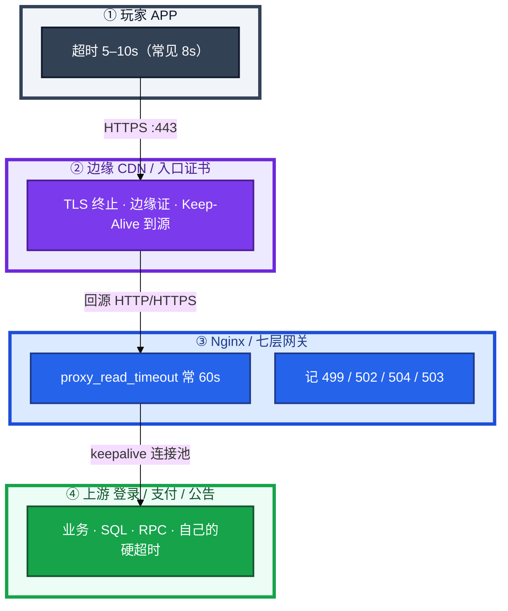
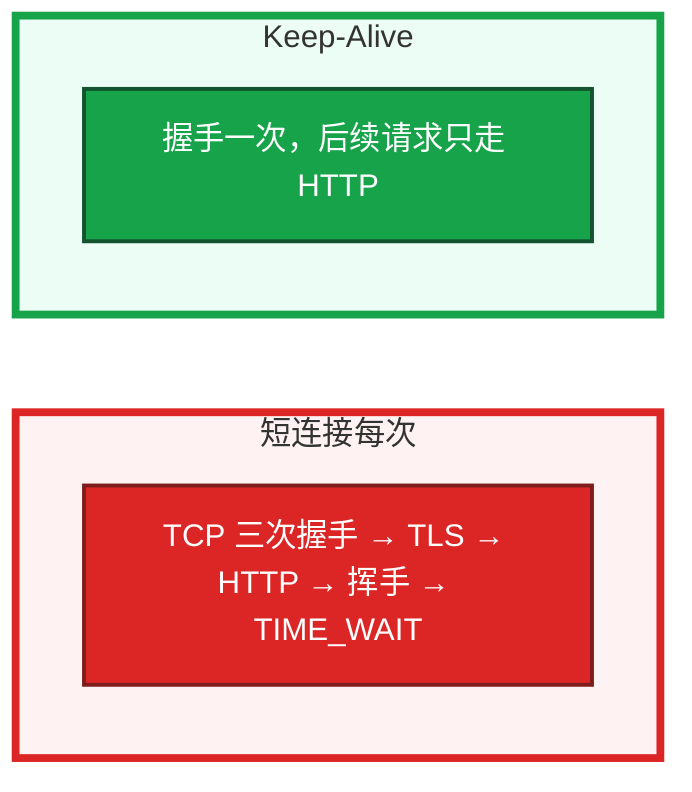
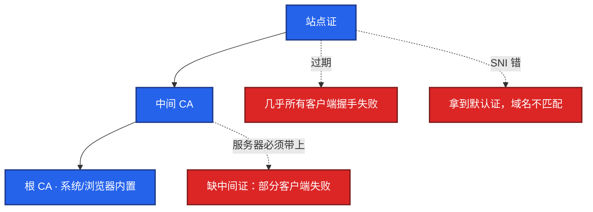
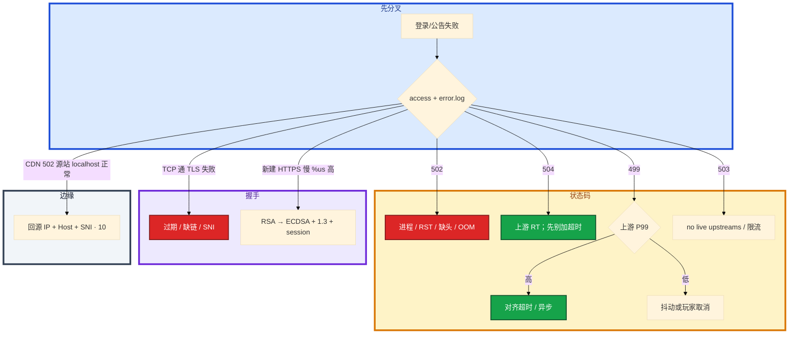

# HTTP 与 TLS


活动开了，登录入口刷失败。有人说「上游挂了」，有人说「超时太短」，另有人要先重启。你先打开网关 access.log。码写在网关里，痛发生在最先超时的那一层。

先别动手。这一章后半全是你会动手的：**怎么分 499/502/504、怎么对超时链、怎么查证书链和 SNI、HTTP/2 和 1.1 差在哪。** 前面的概念和原理，是为了让你动手时不把战斗长连接和 HTTP Keep-Alive 混成一层。

**读完你能：** 白板上画出 APP → 边缘 → 网关 → 上游；能用 error.log 关键字分 502 子类；会配从外到内递减的超时；会用 openssl 看链和日期；知道支付禁止 0-RTT。

## 本章目录

缩进 = 上下级。3 下面才是 3.1。

想钉在**正文左边**跟着滚：菜单 **查看 → 打开视图 → 大纲**。Markdown 预览做不到独立左栏，目录只能写在文章开头。

- [1. 基本概念](#1-基本概念)
- [2. 架构图](#2-架构图)
- [3. 原理](#3-原理)
  - [3.1 502 / 504 / 499](#31-502504499必须能举日志)
  - [3.2 超时链](#32-超时链从外到内递减)
  - [3.3 Keep-Alive](#33-keep-alive短连接会把-tw-和-tls-cpu-一起打爆)
  - [3.4 HTTP/1.1 vs HTTP/2 vs HTTP/3](#34-http11-vs-http2-vs-http3)
  - [3.5 TLS 握手与证书链](#35-tls握手证书链为什么变慢)
  - [3.6 网关相关点到为止](#36-和网关相关但本章只点到为止)
- [4. 安装部署](#4-安装部署)
  - [4.1 生产怎么选](#41-生产怎么选)
  - [4.2 证书落地你实际看到什么](#42-证书落地你实际看到什么)
- [5. 核心配置](#5-核心配置)
- [6. 常用命令](#6-常用命令)
- [7. 常用操作](#7-常用操作)
  - [7.1 分状态码](#71-分状态码)
  - [7.2 对齐超时](#72-对齐超时)
  - [7.3 开 Keep-Alive](#73-开-keep-alive)
  - [7.4 查证书链](#74-查证书链)
  - [7.5 TLS CPU](#75-tls-cpu)
- [8. 生产排障](#8-生产排障)
- [9. 必会 · 常考](#9-必会--常考)
- [合上书](#合上书问自己)

**本章不讲：** curl -w 五段完整 SOP、分层抓包 → [11 网络排障与抓包](../11-网络排障与抓包/)；Nginx timeout / upstream keepalive / 限流 / reload 深配置 → [23 Nginx](../23-Nginx/)；CDN 回源、HIT/MISS、劫持 → [10 DNS与CDN](../10-DNS与CDN/)；TIME_WAIT、长连接、KCP → [08 TCP与UDP](../08-TCP与UDP/)；上游 OOM / 137 → [04 内存与OOM](../04-内存与OOM/)；PromQL、网关 RED → 21；PromQL 深挖在 K8s 18。

---

## 1. 基本概念

玩家点「登录」。这条 HTTPS 至少经过 APP、边缘、网关、上游四层。每一层都有自己的超时。**码写在网关 access.log 里，痛发生在最先超时的那一层。**

游戏 HTTP 入口（登录、支付、公告）走这张图；战斗长连接走 TCP/KCP，和 HTTP Keep-Alive 不是一层，见 08。不要把「入口开了 keepalive」说成「战斗长连接已经有了」。

| 在 HTTP / TLS 里 | 不在这一层 |
|------------------|------------|
| 499 / 502 / 504 / 503 / 500 语义 | iptables、conntrack（06/15） |
| 超时链、Keep-Alive、证书链、SNI | Nginx 指令细节（23） |
| TLS 1.2 2-RTT / 1.3 1-RTT / 0-RTT | 完整 curl -w 五段 SOP（11） |

三个码不要混：

| 码 | 含义 |
|----|------|
| **502** | 网关没拿到合法 HTTP 响应 |
| **504** | 已经转发出去，等上游超时 |
| **499** | 客户端先断开 |

入口证书和回源证书是**两套**。CDN 回源 HTTPS 过期只打 502，浏览器访问边缘仍然绿锁。

> **记住**：超时必须从外到内递减。反过来会 499/504 满天飞，打到 DB 的查询还在跑。入口证书和回源证书是两套。

---

## 2. 架构图

先把整张图钉住。后面状态码、超时、证书都对着这张图说话。



图上三条线：

1. **码在网关，痛在最先超时的那一层。**
2. **入口证 ≠ 回源证。** 边缘绿锁不能证明源站证还活着。
3. **战斗长连接不走这张图。** HTTP Keep-Alive 只覆盖登录/支付/公告这类 HTTP 入口。

三种断法（网关已经把请求转给上游之后）：


---

## 3. 原理

原理只保留动手和面试会用到的：三个码怎么分、超时为什么必须递减、HTTP/2 解的是哪一层阻塞、证书链缺一环会怎样。

**本节 6 块：** 3.1 状态码 · 3.2 超时链 · 3.3 Keep-Alive · 3.4 HTTP 版本 · 3.5 TLS/证书 · 3.6 网关点到为止

### 3.1 502、504、499：必须能举日志

你眼睛先对 error.log 关键字，再看 access 的状态码。

| 码 | 含义 | 先查 | error.log |
|----|------|------|-----------|
| **502** | 网关没拿到合法 HTTP 响应 | 上游进程、端口、RST、OOM | `connect() failed` / `invalid header` / `prematurely closed` |
| **504** | 已经转发出去，等上游超时 | 上游 RT、`proxy_read_timeout` | `upstream timed out` |
| **499** | 客户端先断开 | 客户端超时是不是更短，或玩家杀进程 | 无（或 client closed） |
| **503** | 网关认为没有健康上游，或主动限流熔断 | 健康检查、`no live upstreams` | `no live upstreams` |
| **500** | 上游返回了业务错误 | 应用日志，不是网关连不上 | — |

卡住时按码走，不要混着加超时：

1. **偶发 502** + `prematurely closed`：上游处理中被 OOM/KILL，交叉 04。止血先稳住内存，不要先加超时。
2. **持续 502**：进程没起来、没听端口、健康检查全挂。直接打上游。
3. **504**：先测绕过网关打上游的 RT，不要先把 timeout 改成 300s。超时放大只会藏慢查询。
4. **499 多 + 上游 P99 高**：真慢，对齐超时或把登录异步化。
5. **499 多但上游很快**：网络抖动或玩家取消，不要当成「客户端无脑重试」忽略。

常见误判：把 499 当服务端 bug，或反过来当「客户端问题」直接忽略——先对超时谁更短。监控只看网关 5xx：APP 8s 已失败、网关还在打到 60s 才 504，5xx 会偏低。要以 **APP 失败率和上游 P99** 为准。`upstream prematurely closed` 算 502 一族：上游在响应过程中把连接关了，常见崩溃或超时主动 close，不是 504。

503：网关认为没有健康上游，或主动限流熔断。502：有上游，但响应非法或连接失败。限流返回 503 不算网关 bug，是主动保护。

> **记住**：502 是上游没给出合法 HTTP；504 是等超时了；499 是客户端先走。先对 error.log，不要只看 access 的数字。

### 3.2 超时链：从外到内递减

具体动作：活动 SQL 慢，登录接口从 200ms 变成 12s。网关 `proxy_read_timeout` 仍是 60s，APP 客户端超时 8s。

系统里发生了什么：玩家 8s 就放弃了，网关还在等上游，上游还在打 DB。access 记 499，上游连接和 SQL 继续占着。活动高峰等于用失败请求把库打得更满。


你眼睛看到什么：APP 失败率已经爆了，网关 5xx 还「看起来还好」——因为大量是 499，不算 5xx。绕过网关 curl 登录接口，P99 已经十几秒。

生产怎么配：

1. 客户端最短，每层留余量，上游必须有自己的硬超时（SQL / RPC），不能只靠网关。
2. 504 先优化/扩上游，再考虑超时是否合理。
3. 499 多：对齐客户端超时，或把慢接口异步化（登录排队见游戏专题）。
4. 不要把 timeout 改成 300s 当修复。

> **记住**：外层先停、内层有余量砍请求；超时放大不是修复，是把慢查询藏得更久。

### 3.3 Keep-Alive：短连接会把 TW 和 TLS CPU 一起打爆

活动高峰新建 HTTPS。每次完整 TCP + TLS。HTTP/1.1 默认持久连接；你要是把它关成短连接，网关 `%us` 和 TIME_WAIT 会一起涨。

算术直觉：TLS 1.2 握手约 **2-RTT**，1.3 约 **1-RTT**。高峰每秒新建 1 万条 HTTPS，光握手就能把网关 worker 的 `%us` 打满，还没开始算业务。Keep-Alive 把「每次握手」变成「连上一次，后面只走 HTTP」。



怎么配（概念在本章，指令细节在 23）：

1. 入口对客户端开 Keep-Alive；`keepalive_timeout` 过长占 fd，过短等于短连接。
2. 对上游要连接池（Nginx 在 `upstream` 块里写 `keepalive`），避免活动高峰握手打满。
3. 登录/支付 HTTP 入口必须开。战斗玩法的长连接是另一条 TCP/KCP，不要混着答。

你眼睛看到什么：`ss -s` 里 TIME_WAIT 爆、`top` 里 nginx worker `%us` 高、新建 HTTPS 的 `curl -w` tls 段变慢。卡住先确认两边都开了：只开入口 keepalive、上游仍是短连接——TLS CPU 看起来降了，TIME_WAIT 和上游握手还在。

> **记住**：入口和上游都要复用连接；只开一边，TW 和握手 CPU 还会爆。

### 3.4 HTTP/1.1 vs HTTP/2 vs HTTP/3

内网 gRPC、部分入口已经上了 HTTP/2。有人会说「多路复用就不会堵了」。用一次丢包把这话说穿。

| | HTTP/1.1 | HTTP/2 | HTTP/3 |
|--|----------|--------|--------|
| 传输 | TCP | TCP | QUIC / UDP |
| 一条连接 | 一次一个请求（管线实际很少用） | 多 stream 并行 | 多 stream，流独立 |
| 应用层排队 | 一个响应没完，后面排队 | **已解决** | 已解决 |
| TCP 丢包 | 整条停 | **整条连接上所有 stream 仍等重传** | 丢包只堵那条 stream |
| 游戏入口 | 登录/支付常见 | 内网 gRPC 常用 | 公网看客户端和证书 |

HTTP/2 解决的是**应用层**队头阻塞（不再「一个响应没完，后面的请求排队」）。**TCP 丢一个包，整条连接上的所有 stream 都等重传。** 不要答「上了 HTTP/2 就不会堵」。

HTTP/1.1 默认 Keep-Alive（持久连接），但一条连接同时基本只跑一个请求。要并发得开多条 TCP——于是握手、fd、TIME_WAIT 一起涨。HTTP/2 用一条 TCP 多 stream 减连接数，但传输层队头还在。公网弱网要解队头，才轮到 HTTP/3。

内网 gRPC 常用 HTTP/2，延迟已经很低时通常够。公网是否 HTTP/3 看客户端和证书。内网不必为了「时髦」上 HTTP/3：要改证书、客户端和中间设备对 UDP 的放行。

战斗长连接不是 HTTP/2。移动和技能复用同一条 TCP 的队头阻塞见 08，解法是拆 UDP+TCP 或 KCP，不是给战斗入口上 HTTP/2。

> **记住**：HTTP/2 解的是应用层排队，不解 TCP 丢包；公网弱网要解队头，才轮到 HTTP/3。

### 3.5 TLS：握手、证书链、为什么变慢

公告 HTTPS 突然进不去。玩家说「登录挂了」。你本机 `curl -w`：tcp 段 20ms，tls 段失败或卡死。这不是登录 SQL，是握手。

TLS 1.3 握手约 **1-RTT**；会话恢复可达 **0-RTT**（有重放，支付/登录态变更禁止）。TLS 1.2 是 **2-RTT**。会话复用（ticket/cache）可以开，那是 1-RTT 或 abbreviated handshake，和 0-RTT 早期数据不是一回事。



证书链：站点证 → 中间 CA → 根 CA。根在系统/浏览器里，**中间证必须由服务器带上**，客户端不保证会去下。缺一环，部分客户端直接失败。

系统里发生了什么：客户端先 TCP 连上，再按 SNI 要证、验链、换密钥。链上缺中间证、过期、SNI 指错 Host，握手在这一层就停，应用日志是空的。

`openssl s_client` 出现 `unable to verify the first certificate`：缺中间证。监控 `Not After`，不要靠人工日历。证书到期告警至少提前 **14 天**，且要测真正握手路径，不是只看磁盘上的文件日期。

TLS 变慢的常见原因：

1. 链过长 / OCSP 卡住
2. **RSA 证书在高峰吃 CPU**（网关 `%us` 高、新建 HTTPS 慢）
3. 没开会话 ticket / session cache

生产标配：**ECDSA + TLS 1.3 + session 复用**。CPU 仍高就卸载到独立入口或加实例。先用 curl -w 确认慢在 TLS 段（`time_appconnect - time_connect`），再 `top` 看 nginx worker。完整五段在 11。HTTP 没有 appconnect。要带 `-w` 且 `-o /dev/null`。`time_connect` 包含 DNS，是从 0 到 TCP 完成的累计，本段要用减法。

Host 与 SNI 必须一致。IP 直连 HTTPS 不带 SNI 会拿到默认证。排障用 `--resolve`，不要改完 `/etc/hosts` 忘了 SNI。

双向 TLS（支付）：客户端证书过期表现像「偶发失败」，要单独监控 client cert。**支付禁止 0-RTT。**

灰度换证要核对：中间链是否带全、密钥类型有没有从 RSA 换成 ECDSA、边缘证和源站证是不是一起换。游戏登录域名不要和包体 CDN 共用一张要频繁 Purge 的证。入口证和回源证分开监控。

公告 HTTPS 证书过期：进游戏前补丁检查失败，像「登录挂了」，实际 TCP 通、TLS 失败。`curl -w` 的 tls / appconnect 段立刻能分开，不要先查登录 SQL。

> **记住**：过期全挂、缺中间证部分挂、SNI 错拿到默认证；边缘绿锁不能证明回源证还活着。

### 3.6 和网关相关、但本章只点到为止

这些事实要会，深配置去 23。用一次 504 把缓冲这件事说清：上游已经返回了，网关还在把整份 body 写进缓冲盘，盘满之后客户端看到的也是 504。

1. **`proxy_buffering on`**：网关先收完上游再给客户端。上游快、玩家慢会把内存/缓冲盘打满。**504 有时是缓冲盘满，不只是上游慢。** 关闭缓冲适合流式；游戏 HTTP API 通常保持缓冲，但限制 `proxy_max_temp_file_size`。
2. **`proxy_next_upstream` 配错**：502 重试打成雪崩。非幂等 POST（支付）禁止盲目重试。
3. CDN 上 502、源站本机 curl 正常：测「CDN 回源 IP + Host + SNI」那一跳，见 10。回源 HTTPS 证书过期只打 502，边缘仍然绿锁。HIT 不应 502；若 X-Cache 是 HIT 还 502，那是脏缓存或边缘自己的问题。

> **记住**：504 先问上游慢还是缓冲盘满；支付 POST 不要靠网关自动重试止血。

---

## 4. 安装部署

### 4.1 生产怎么选

| 项 | 选 | 不选 |
|----|----|------|
| 超时 | APP < 边缘 < 网关 < 上游硬超时 | 网关 300s 当修复 |
| Keep-Alive | 入口和上游都开 | 只开一边 |
| HTTP 版本 | 内网 gRPC 用 HTTP/2；公网弱网再考虑 HTTP/3 | 「上了 HTTP/2 就不会堵」 |
| TLS | ECDSA + TLS 1.3 + session 复用 | 高峰仍用 RSA 当唯一入口 |
| 0-RTT | 静态资源才考虑 | 支付 / 登录态变更 |
| 证书 | 全链；入口证与回源证分开；告警 14 天 | 只看磁盘文件日期 |
| 登录域 vs 包体域 | 分开证书 | 和频繁 Purge 的 CDN 证绑在一起 |
| 战斗通道 | TCP/KCP（08） | 用 HTTP Keep-Alive 回答战斗长连接 |

### 4.2 证书落地你实际看到什么

边缘（CDN）一张证，源站回源另一张。nginx/网关 `ssl_certificate` 必须带全链（站点+中间）。client 双向 TLS 的 client cert 单独监控。

验收：`openssl s_client -servername` verify 为 0；`Not After` > 14 天；用 `--resolve` 测真正 VIP，不要只 curl localhost。不要只探 TCP 443。

---

## 5. 核心配置

只动有证据的项。Nginx 指令细节在 23。本章只钉语义。

| 参数 | 默认 / 常见 | 生产怎么用 | 改错会怎样 |
|------|-------------|------------|------------|
| APP 超时 | 常 **8s** | 最短 | 比网关长 = 499 满天飞仍打 DB |
| `proxy_read_timeout` | 常 **60s** | 对齐外层，留余量 | 先改 300s = 藏慢查询 |
| 上游硬超时 | 必须有 | SQL / RPC deadline | 只靠网关，超时后查询还在 |
| 入口 keepalive | HTTP/1.1 默认开 | 必须开；timeout 别过短 | 关 = TW + TLS CPU |
| upstream keepalive | 常忘 | 必须开连接池 | 只开入口不够 |
| TLS 版本 | 1.2 / 1.3 | 标配 1.3 | 1.2 多 1-RTT |
| 0-RTT | 可开早期数据 | **支付禁止** | 重放 |
| 证书链 | — | 服务器带中间证 | 部分客户端失败 |
| 告警 | — | **14 天** + 真握手路径 | 只看文件日期会漏 |

> **记住**：HTTP/2 不解 TCP 队头阻塞；支付禁止 TLS 1.3 0-RTT。RSA 高峰换 ECDSA + TLS1.3 + session 复用。

---

## 6. 常用命令

```bash
grep -E ' 502 | 504 | 499 ' access.log | tail
grep -E 'connect\(\) failed|invalid header|prematurely closed|upstream timed out|no live upstreams' error.log | tail
```

```bash
curl -sv --connect-timeout 2 http://upstream:port/health
```

```bash
openssl s_client -connect host:443 -servername host </dev/null 2>/dev/null \
  | openssl x509 -noout -dates -subject -issuer
openssl s_client -connect host:443 -tls1_2
curl -svI https://host
```

| 目的 | 命令 | 看什么 |
|------|------|--------|
| 分 502/504 | access + error.log 关键字 | prematurely closed vs timed out |
| 绕过网关 | `curl` 打上游 health | 2s 内必须有响应 |
| 证书日期/主体 | `openssl s_client` + `x509 -dates` | Not After、issuer |
| 缺中间证 | `unable to verify the first certificate` | verify 非 0 |
| TLS vs 业务 | `curl -w`：tls = appconnect − connect | 完整五段见 11 |
| 强制 1.2 | `openssl s_client -tls1_2` | 对比 1.3 RTT |

curl -w 做差（时间戳从开始累计）：

| 字段 | 含义 | 本段 |
|------|------|------|
| time_namelookup | DNS | DNS |
| time_connect | 累计到 TCP 完成 | tcp = connect − dns |
| time_appconnect | 累计到 TLS 完成 | tls = appconnect − connect |
| time_starttransfer | 累计到首字节 | ttfb = starttransfer − appconnect |

tls 段高：证书链、RSA CPU、没开会话复用。ttfb 段高：应用/DB，不是公网。

---

## 7. 常用操作

### 7.1 分状态码

先 error.log 再 access。偶发 502 查 OOM。持续 502 查进程端口。504 先测上游 RT。499 对超时谁更短。503 看 live upstream / 限流。

### 7.2 对齐超时

从外到内递减，每层留余量，上游必须有硬超时。504 先优化/扩上游。不要 timeout=300s。

### 7.3 开 Keep-Alive

入口和上游都开。登录/支付 HTTP 入口必须开。战斗长连接是另一层。

### 7.4 查证书链

`s_client` + `-servername` + `-dates`。换证必须带全链。入口证和回源证是两套。告警 14 天，测真正握手路径。排障用 `--resolve`。

### 7.5 TLS CPU

先确认慢在 TLS 段，再换 ECDSA / TLS 1.3 / session，不要先加机器当根因。Keep-Alive 也能少握手。加机器可以止血，RSA 高峰下次还会打满。

---

## 8. 生产排障

和 01 同一套三问：进程还在不在？这次请求拿到正常响应了吗？已有长连接战斗服还通不通？

**登录 HTTP 挂了 ≠ 战斗长连接断了。** 先分通道。



现场顺序：

```bash
grep -E ' 502 | 504 | 499 ' access.log | tail
grep -E 'connect\(\) failed|prematurely closed|upstream timed out' error.log | tail
curl -sv --connect-timeout 2 http://upstream:port/health
openssl s_client -connect host:443 -servername host </dev/null
```

| 现象 | 先做什么 | 不要做什么 |
|------|----------|------------|
| 502 + prematurely closed | 上游 OOM | 先加超时 |
| 504 | 绕过网关测 RT | timeout=300s |
| 499 多、5xx 看起来还好 | 对 APP 超时 vs 网关 | 当客户端无脑重试忽略 |
| 503 | live upstream / 限流 | 按 502 去查 RST |
| 缺中间证部分渠道失败 | 带全链 | 只换站点证 |
| 边缘绿锁、CDN 502 | 回源证 / 安全组 / Host+SNI | 只 curl 源站 localhost |
| RSA 高峰 %us 满 | ECDSA + 1.3 + session | 先加机器当根因 |
| 支付偶发失败 | client cert Not After | 和服务器证混一个告警 |
| HIT 还 502 | 边缘脏缓存（10） | 当回源问题 |

---

## 9. 必会 · 常考

白板和追问高频，能一口回：

| 说法 | 对错 | 口径 |
|------|:----:|------|
| 502 和 504 都是上游挂了 | 错 | 502 没合法响应；504 等超时 |
| prematurely closed 是 504 | 错 | 502 一族 |
| 499 一定是服务端 bug | 错 | 先对谁超时更短 |
| 只看网关 5xx 就能代表失败率 | 错 | 499 不算 5xx；看 APP 失败率 |
| 把 timeout 改成 300s 消灭 504 | 错 | 藏慢查询、打满 DB |
| 只给客户端开 Keep-Alive 够了 | 错 | 上游连接池也要开 |
| HTTP Keep-Alive 就是战斗长连接 | 错 | 两层；战斗见 08 |
| 上了 HTTP/2 就不会堵 | 错 | TCP 丢包仍堵所有 stream |
| 支付可以开 0-RTT | 错 | 重放风险 |
| 边缘绿锁证明源站证没问题 | 错 | 两套证 |
| 缺中间证一定全量失败 | 错 | 部分客户端会下中间证 |
| SNI 错会过期 | 错 | 拿到默认证，域名不匹配 |
| 证书只看磁盘日期 | 错 | 测真正握手路径；告警 14 天 |
| RSA 高峰先加机器就根治 | 错 | 换 ECDSA + 1.3；加机器只是摊 CPU |

数字：APP 常见 **8s**；Nginx `proxy_read_timeout` 常 **60s**；TLS 1.2 **2-RTT**、1.3 **1-RTT**；证书告警 **14 天**。

易混：502 vs 504 vs 499 vs 503；入口证 vs 回源证；HTTP/1.1 vs 2 vs 3 队头；0-RTT vs session 复用；Keep-Alive vs 战斗长连接；tls 段 vs ttfb 段。

---

## 合上书，问自己

1. 502 / 504 / 499 各是谁先放手？error.log 关键字是什么？
2. 超时为什么必须从外到内递减？timeout=300s 为什么不是修复？
3. HTTP/1.1 和 HTTP/2 对队头阻塞差在哪？战斗长连接能用 Keep-Alive 回答吗？
4. 证书链三截是什么？过期、缺中间证、SNI 错各什么表现？
5. 支付为什么禁止 0-RTT？RSA 高峰怎么治？
6. CDN 502、源站 localhost 正常、边缘绿锁，先查哪一跳？

六题都能口述，这一章就过了。下一章把 DNS/CDN 剖开：递归和权威、TTL 切流、回源风暴。
