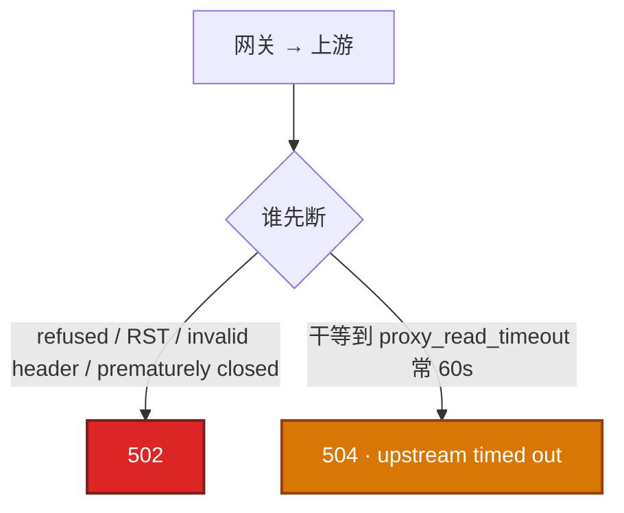
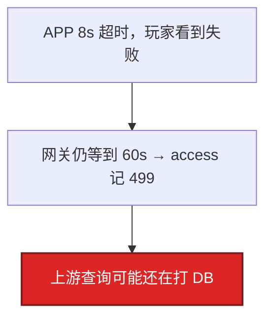
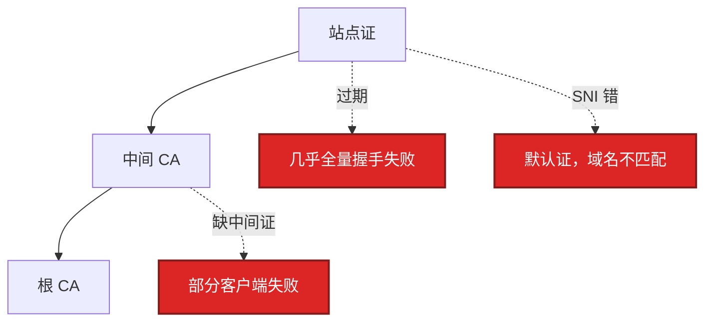

# 09｜HTTP 与 TLS · 练习题

先自己画图或口述，再对照解答。每题标了覆盖范围：

| 标记 | 含义 |
|------|------|
| **核心** | 不懂整章就没建立起来 |
| **必会** | 值班和面试都要能讲 |
| **常用** | 线上会反复碰到 |
| **常考** | 白板和追问的高频口径 |

## 本题目录

- [Q1 502 vs 504](#q1)
- [Q2 499](#q2)
- [Q3 curl -w 拆 TLS](#q3)
- [Q4 证书链](#q4)
- [Q5 Keep-Alive](#q5)
- [Q6 HTTP/2 vs HTTP/3](#q6)
- [Q7 503 vs 502](#q7)
- [Q8 超时链](#q8)
- [Q9 0-RTT](#q9)
- [Q10 RSA / TLS CPU](#q10)
- [Q11 CDN 502](#q11)
- [合上书](#合上书)

---

## Q1

**★★★★★｜502 和 504 本质区别？怎么从 Nginx 日志确认？**

**覆盖**：核心 · 必会 · 常考

### 场景

活动开始网关 5xx 涨。有人说「上游挂了」，有人说「超时太短」。error.log 还没打开。

### 完整解答

断点不同。502 是网关**没拿到合法 HTTP 响应**；504 是**已经转发出去，等超过 `proxy_read_timeout`**。



error.log：`connect() failed` / `invalid header` / `prematurely closed` → 502；`upstream timed out` → 504。偶发 502 查上游 OOM（137）。持续 502 查进程和端口，直接 `curl` 打上游。504 先测绕过网关的 RT，不要先加超时。

### 再追问

upstream prematurely closed 算哪类？——502 一族：上游在响应过程中把连接关了，常见崩溃或超时主动 close，不是 504。

---

## Q2

**★★★★★｜499 是什么？为什么游戏登录会大量 499？**

**覆盖**：核心 · 必会 · 常考

### 场景

登录失败率飙高，网关 5xx 看起来还好。access.log 里全是 499。APP 超时 8s，网关 `proxy_read_timeout` 60s。

### 完整解答

499 = 客户端在服务端返回前断开。玩家已经失败，网关还在等，上游可能还在跑 SQL。



怎么分：499 多加上游 P99 高 = 真慢，对齐超时或把登录异步化。499 多但上游很快 = 网络抖动或玩家取消。监控不要只看网关 5xx，要以 APP 失败率和上游 P99 为准。超时必须从外到内递减：APP < 边缘 < 网关 < 上游硬超时。

### 再追问

499 是服务端 bug 吗？——不一定。先对超时谁更短。不要把它当「客户端无脑重试」直接忽略。

---

## Q3

**★★★★★｜curl 访问 HTTPS 慢，如何判断是 TLS 还是业务？**

**覆盖**：核心 · 必会 · 常用

### 场景

公告 HTTPS 打开要好几秒。有人让网络组查公网。你只有一台能出网的跳板。

### 完整解答

看 `curl -w` 做差。时间戳是从开始累计的，本段要用减法。完整五段 SOP 在 11，本章只要会拆 TLS 和业务。

time_namelookup = DNS。time_connect = 累计到 TCP 完成 → 本段 tcp = connect − dns。time_appconnect = 累计到 TLS 完成 → 本段 tls = appconnect − connect。time_starttransfer = 累计到首字节 → 本段 ttfb = starttransfer − appconnect。

tls 段高：证书链、RSA CPU、没开会话复用。ttfb 段高：应用/DB，不是公网。HTTP 没有 appconnect。要带 `-w` 且 `-o /dev/null`。公告证书过期的典型表现：TCP 通、TLS 失败，像「登录挂了」。

### 再追问

time_connect 包含 DNS 吗？——包含，是从 0 到 TCP 完成的累计。本段要用减法。

---

## Q4

**★★★★★｜证书过期和证书链不完整分别什么表现？**

**覆盖**：核心 · 必会 · 常考

### 场景

部分渠道进游戏前补丁检查失败，另一部分正常。`openssl s_client` 打出 `unable to verify the first certificate`。

### 完整解答

证书链：站点证 → 中间 CA → 根 CA（系统/浏览器内置）。中间证必须由服务器带上。



过期：几乎全量失败，监控 `Not After`。缺中间证：部分客户端失败，`openssl` verify 非 0，日志常见 `unable to verify the first certificate`。都用 `s_client` + `-servername` + `-dates`。换证必须带全链。入口证和回源证是两套；CDN 回源过期只打 502，边缘仍然绿锁。告警至少提前 14 天，测真正握手路径，不要只看文件日期。

```bash
openssl s_client -connect host:443 -servername host </dev/null 2>/dev/null \
  | openssl x509 -noout -dates -subject -issuer
```

### 再追问

SNI 配错是什么表现？——拿到默认证，浏览器报域名不匹配。IP 直连 HTTPS 不带 SNI 就会这样。排障用 `--resolve`，不要改完 hosts 忘了 SNI。

---

## Q5

**★★★★☆｜Keep-Alive 不开会怎样？游戏 HTTP 入口要开吗？**

**覆盖**：必会 · 常用 · 常考

### 场景

活动高峰网关 TIME_WAIT 爆炸，新建 HTTPS 变慢。upstream 没配 keepalive。

### 完整解答

短连接 = 每次完整 TCP + TLS。TW 和网关 CPU 一起涨。TLS 1.2 约 2-RTT，1.3 约 1-RTT。登录/支付 HTTP 入口必须开。上游连接池同样要开，只开入口不够。`keepalive_timeout` 过长占 fd，过短等于短连接。战斗长连接走 TCP/KCP，和 HTTP Keep-Alive 是两层。

### 再追问

只给客户端开、上游仍短连接，会怎样？——入口 TLS CPU 看起来好一点，上游握手和 TW 还在。两边都要开。

---

## Q6

**★★★★☆｜HTTP/2 和 HTTP/3 对队头阻塞差在哪？和 HTTP/1.1 呢？**

**覆盖**：必会 · 常考

### 场景

有人提议登录入口全面上 HTTP/2，「就不会堵了」。公网丢包并不少。

### 完整解答

HTTP/1.1：一条连接一次一个请求，并发靠多开 TCP。HTTP/2 解决的是应用层队头阻塞：一条 TCP 上多 stream 并行。**TCP 丢包仍堵整条连接上的所有 stream。** HTTP/3 跑 QUIC/UDP，流之间不堵。

内网延迟已经很低时 HTTP/2 通常够（gRPC 常用）。公网是否 HTTP/3 看客户端和证书。不要答「上了 HTTP/2 就不会堵」。战斗长连接的队头阻塞见 08，不是给战斗上 HTTP/2。

### 再追问

内网 gRPC 要不要上 HTTP/3？——通常不必。内网丢包低，HTTP/2 够；上 HTTP/3 要改证书、客户端和中间设备对 UDP 的放行。

---

## Q7

**★★★☆☆｜503 和 502 怎么分？**

**覆盖**：必会 · 常用

### 场景

健康检查把一组登录 Pod 摘光。网关开始 503。有人按 502 去查 RST。

### 完整解答

503：网关认为**没有健康上游**，或主动限流熔断。502：有上游，但响应非法或连接失败。error.log：`no live upstreams` → 503。先看有没有 live upstream，再决定是扩容/修健康检查，还是去查上游进程。

### 再追问

限流返回 503 算网关 bug 吗？——不算，是主动保护。要看限流阈值和上游容量是否匹配，不要先当 502 去重启上游。

---

## Q8

**★★★★☆｜超时应该怎么配一条链路？**

**覆盖**：必会 · 常用 · 常考

### 场景

有人为了消灭 504，把网关 timeout 改成 300s。活动高峰 DB 被慢查询打满。

### 完整解答

从外到内递减，每层留余量，上游必须有自己的硬超时。对：APP 8s < 边缘 10s < 网关 12s < 上游硬超时 15s。错：APP 8s < 网关 60s < 上游无硬超时 → 玩家已失败，查询还在打 DB。504 先优化/扩上游，再考虑超时是否合理。不要把 timeout 改成 300s 当修复。

### 再追问

上游硬超时设在哪？——应用自己的 SQL / RPC deadline，不能只靠网关。网关超时之后，没有硬超时的查询还会继续占着连接。

---

## Q9

**★★★☆☆｜TLS 1.3 0-RTT 能用于支付回调吗？**

**覆盖**：必会 · 常考

### 场景

网关开了 TLS 1.3 session 复用，有人想把 0-RTT 开到支付回调「再省 1-RTT」。

### 完整解答

不能。0-RTT 有重放风险：中间人可以重放早期数据。支付、登录态变更用 1-RTT。静态资源才考虑。会话复用（ticket/cache）可以开，那是 1-RTT 或 abbreviated handshake，和 0-RTT 早期数据不是一回事。

### 再追问

双向 TLS 的客户端证书过期是什么表现？——像「偶发失败」——只有带过期 client cert 的调用方挂。要单独监控 client cert 的 `Not After`，不要和服务器证混在一个告警里。

---

## Q10

**★★★☆☆｜高峰期 Nginx `%us` 高、新建 HTTPS 慢，怎么治？**

**覆盖**：必会 · 常用

### 场景

开服瞬间网关 CPU 打满，HTTP 健康检查还行，玩家 HTTPS 登录排队。证书是 RSA。

### 完整解答

RSA 握手吃 CPU。先确认慢在 TLS 段，再换算法，不要先加机器。curl -w 看 tls 段（appconnect − connect）。tls 高 + nginx worker %us 高 + RSA 证书 → ECDSA、TLS 1.3、session ticket、SSL 卸载或加入口实例。tls 低、ttfb 高 → 不是握手问题，去查上游。生产标配：ECDSA + TLS 1.3 + session 复用。Keep-Alive 也能少握手。

### 再追问

先加机器可以吗？——可以当止血，根因仍是握手算法。RSA 高峰加机器只是把 CPU 摊开，下次更大的活动还会打满。

---

## Q11

**★★★☆☆｜CDN 上 502，源站 curl 正常，先查什么？**

**覆盖**：必会 · 常用

### 场景

公告 HTTPS 走 CDN。边缘 502，你 ssh 到源站 `curl localhost` 完全正常。浏览器看边缘是绿锁。

### 完整解答

入口证书和回源证书是两套。边缘绿锁只说明**边缘证**没问题。502 出在回源那一跳。用「源站 IP + Host 头 + SNI」从公网或模拟回源测，不要只在源站 localhost 测。安全组放行 CDN 回源网段。HIT 不应 502；若 X-Cache 是 HIT 还 502，那是脏缓存或边缘自己的问题，交叉 10。登录域名不要和包体 CDN 共用一张要频繁 Purge 的证。


### 再追问

为什么登录域名不要和包体 CDN 共用一张证？——包体要频繁 Purge。证和 Purge 绑在一起，容易误伤登录握手。入口证和回源证、登录域和包体域，都分开。

---

## 合上书

- [ ] 能用 error.log 关键字分 502 / 504 / 499 / 503
- [ ] 能配从外到内递减的超时，并拒绝 timeout=300s
- [ ] 能说明入口和上游都要 Keep-Alive；战斗长连接是另一层
- [ ] 能对比 HTTP/1.1、HTTP/2、HTTP/3 的队头阻塞
- [ ] 能讲证书链：过期全挂、缺中间证部分挂、SNI 错拿到默认证；告警 14 天
- [ ] 能说明支付禁止 0-RTT；RSA 高峰换 ECDSA+TLS1.3；CDN 502 查回源那一跳
