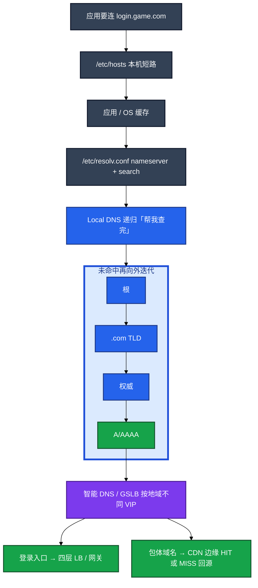
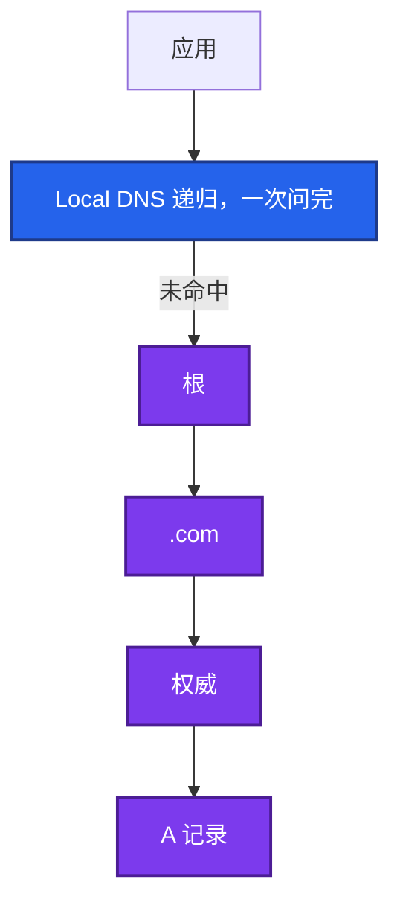
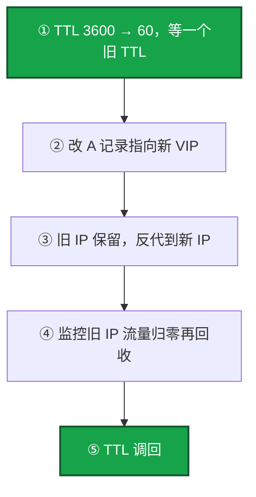
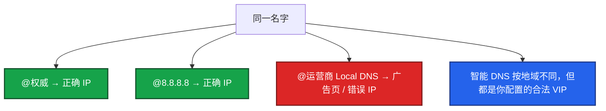
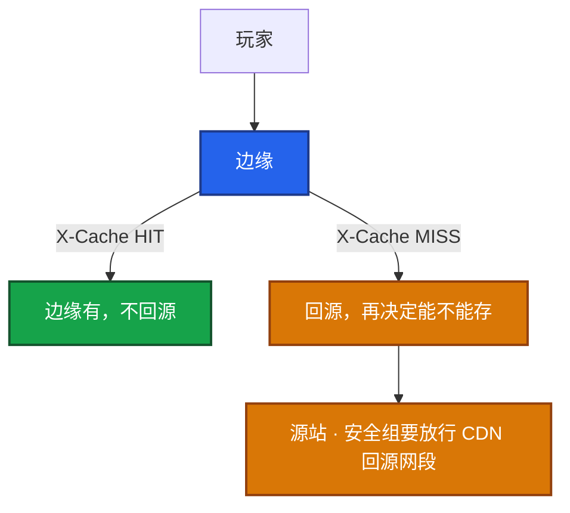
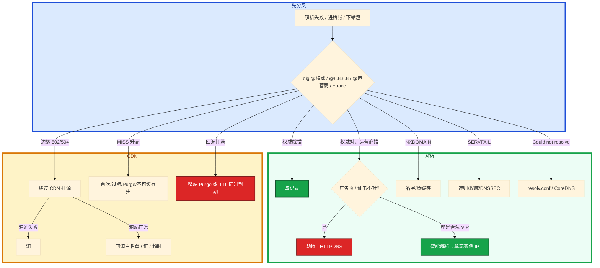

# DNS 与 CDN


开服要把登录域名从旧 VIP 切到新机房。你改完 A 记录，自己电脑已经是新 IP，部分渠道还进旧服。另一次：热更窗口 Purge 了整站，源站出口打满。群里有人要先 Purge，有人说被劫持了。

先别动手。这一章后半全是你会动手的：**怎么 dig 分递归/权威、怎么按 TTL 切流、怎么判断劫持、CDN 回源 502 怎么测。** 前面的概念和原理，是为了让你动手时不用自己电脑的解析当全集群真相。

**读完你能：** 白板上画出客户端→递归→权威；会用 `+trace` 和多 DNS 对比；会做「先降 TTL 再改记录」；会绕过 CDN 打源；包体 URL 带 hash、禁止整站 Purge。

## 本章目录

缩进 = 上下级。3 下面才是 3.1。

想钉在**正文左边**跟着滚：菜单 **查看 → 打开视图 → 大纲**。Markdown 预览做不到独立左栏，目录只能写在文章开头。

- [1. 基本概念](#1-基本概念)
- [2. 架构图](#2-架构图)
- [3. 原理](#3-原理)
  - [3.1 递归与权威](#31-递归与权威)
  - [3.2 hosts 与 resolv.conf](#32-hosts-与-resolvconf)
  - [3.3 TTL 与切流](#33-ttl切流故障表现)
  - [3.4 劫持与 HTTPDNS](#34-劫持与-httpdns)
  - [3.5 CDN 命中与回源](#35-cdn命中回源包体)
- [4. 安装部署](#4-安装部署)
  - [4.1 生产怎么选](#41-生产怎么选)
  - [4.2 落地你实际看到什么](#42-落地你实际看到什么)
- [5. 核心配置](#5-核心配置)
- [6. 常用命令](#6-常用命令)
- [7. 常用操作](#7-常用操作)
  - [7.1 对比解析](#71-对比解析)
  - [7.2 切流](#72-切流)
  - [7.3 劫持](#73-劫持)
  - [7.4 绕过 CDN 打源](#74-绕过-cdn-打源)
  - [7.5 包体发版](#75-包体发版)
- [8. 生产排障](#8-生产排障)
- [9. 必会 · 常考](#9-必会--常考)
- [合上书](#合上书问自己)

**本章不讲：** curl -w dns 段、分层抓包 → [11 网络排障与抓包](../11-网络排障与抓包/)；证书 / 回源 HTTPS / SNI → [09 HTTP与TLS](../09-HTTP与TLS/)；CoreDNS、ndots 细节 → K8s 09；包体热更、渠道包流程 → 游戏专题 06；Nginx 回源超时深配置 → [23 Nginx](../23-Nginx/)。

---

## 1. 基本概念

客户端几乎从不自己去问根。APP 要连 `login.game.com`，先问 Local DNS（**递归**），Local DNS 再向根 / TLD / **权威**做**迭代**。中间任何一层缓存脏了，权威改了记录用户仍可能打旧 IP。

| 角色 | 干什么 |
|------|--------|
| **递归**（Local DNS） | 客户端问它「帮我查完」；它自己去迭代，并缓存答案 |
| **权威** | 这个域名的真相；改 A 记录改的是这里 |
| **根 / TLD** | 只做转介：根指到 .com，.com 指到权威 |
| **智能 DNS / GSLB** | 按地域返回不同 VIP，都是你配的合法地址 |

| 在 DNS / CDN 里 | 不在这一层 |
|-----------------|------------|
| 递归缓存、TTL、负缓存、劫持 | TCP 握手、TLS 链（08/09） |
| X-Cache HIT/MISS、回源、Purge | Nginx 指令细节（23） |
| hosts / resolv.conf / ndots | CoreDNS 部署深挖（K8s 09） |

`nsswitch` 里 `files dns` 表示 hosts 优先。`dig +trace` 从根走迭代，用来证明「权威没问题还是中间缓存有问题」。

常见误判：本机 `ping` 通就宣布「DNS 没问题」。智能解析按地域返回不同 VIP，你电脑解析到的是另一机房。排障必须让玩家提供 `dig` 结果或客户端日志里的 IP。

> **记住**：客户端问递归，递归再问权威；权威对了用户仍可能打旧 IP，要用 +trace 和多 DNS 对比。

---

## 2. 架构图

先把整张图钉住。后面切流、劫持、回源都对着这张图说话。



图上三条线：

1. **客户端不对根说话。** 问的是递归。
2. **权威改了 ≠ 用户切了。** 递归、运营商、客户端、连接池都可能还拿旧 IP。
3. **登录走 LB，包体走 CDN。** 回源是另一跳，边缘绿锁证明不了源站。

三种解析结果（挂的时候处理不一样）：


---

## 3. 原理

原理只保留动手和面试会用到的：谁递归谁迭代、TTL 切流纪律、劫持怎么和智能解析分开、MISS 算不算故障、回源风暴从哪来。

**本节 5 块：** 3.1 递归权威 · 3.2 hosts/resolv · 3.3 TTL · 3.4 劫持 · 3.5 CDN 回源

### 3.1 递归与权威

递归：客户端一次问完，Local DNS 负责帮你查到答案（或失败）。迭代：Local DNS 拿着转介，自己去问根 → TLD → 权威。权威只回答自己管的区。



`dig +trace` 从根打印整条转介直到权威 A 记录，用来排除「缓存脏了还是权威错了」。`dig @ns1.example.com` 直问权威。`dig @8.8.8.8` 对比公共 DNS。

权威正常、公共 DNS 正常、公司/运营商 DNS 错 → 缓存或劫持。权威就错 → 改记录。

NXDOMAIN：权威说没有。会缓存负缓存 TTL，你立刻补回去，部分地区仍解析失败。SERVFAIL：权威或递归坏、或 DNSSEC 失败；不要当「域名不存在」去改业务名。超时：resolv.conf、DNS 不可达、CoreDNS 挂。

> **记住**：客户端对 Local DNS 是递归；Local DNS 对根/TLD/权威是迭代。`dig +trace` 用来分缓存和权威。

### 3.2 hosts 与 resolv.conf

调试登录时有人手改 `/etc/hosts` 指到新 VIP。改一台漏一台，生产不要靠它做服务发现。`nsswitch` 里 `files` 在 `dns` 前，hosts 命中就再也不会去问 DNS。调试可以临时写，变更要有回滚。

`/etc/resolv.conf` 常被 DHCP / NetworkManager 覆盖，改完重启丢。要钉死就用 `resolvconf` 或 NM 的 dns 配置，不要只手改这一份文件。云上优先改 DHCP 选项 / 内网 DNS，不要在每台机堆一份。

`search` 域过长和 K8s `ndots` 一样会拖慢短名字解析：每次先补后缀查集群内，再查真外网。你眼睛看到的是 `curl -w` dns 段到几百毫秒，TCP 其实很快。

K8s：Pod 默认 `ndots:5`，`cluster.local` 搜索列表会导致高频外网域名先补成 in-cluster FQDN 查好几次。容器里访问 `api.xxx.com`（没有末尾点）。系统先当短名字，依次补 `api.xxx.com.svc.cluster.local`、`api.xxx.com.cluster.local`……全 NXDOMAIN 之后才问真外网。活动高峰等于用失败查询打满 CoreDNS。域名写成 `api.xxx.com.`（FQDN 带点），或调 ndots、加 CoreDNS 缓存。细节在 K8s 09。

卡住先看哪：`Could not resolve host` 先看 resolv.conf 的 nameserver 通不通、CoreDNS 在不在，不要先改业务域名。

> **记住**：hosts 只给本机短路；resolv.conf 会被 DHCP 覆盖；K8s ndots 会让外网解析先在集群里空转几圈。

### 3.3 TTL、切流、故障表现

开服要把登录域名从旧 VIP 切到新机房。正确切流：先把 TTL 从 3600 降到 60，等旧 TTL 过期，再改 A 记录，切完再调回。直接改记录会有最长一个旧 TTL 的双活——部分渠道还打旧服。



「DNS 已切」≠「用户已切」。GSLB / CDN 健康检查摘掉源之后，递归缓存里可能还是死 VIP。摘流量要 VIP 级（LB 摘）+ DNS，不要只改 DNS。

国内运营商可能**不遵守 TTL**。预案：旧 IP 保留反代到新 IP，监控旧 IP 流量归零再回收。不要只 ping 自己电脑当验证。TTL 已经 60s，几小时还有人打旧 IP：运营商缓存、客户端自己的缓存、连接池里的旧 IP。HTTPDNS 可缩短不可控缓存。

| 现象 | 方向 |
|------|------|
| Could not resolve host | resolv.conf、DNS 不可达、CoreDNS 挂 |
| NXDOMAIN | 名字错、记录删了；会缓存负缓存 TTL |
| SERVFAIL | 权威或递归坏、DNSSEC 失败；不要当「域名不存在」去改业务名 |
| 部分地区错 IP | 劫持，或智能解析/CDN 调度（先对比权威） |

开服当天不要把登录域名 TTL 和 CDN 规则叠在一起改。DNS 未收敛时 Purge，会让部分地区回源、部分打旧缓存，现象像「随机进错版本」。先 DNS 稳定再发包体。

> **记住**：先降 TTL 再改记录；「DNS 已切」不等于用户已切，运营商不守 TTL 时旧 IP 要托底。

### 3.4 劫持与 HTTPDNS

部分渠道下载包体失败，证书报域名不匹配。同一名字你本机 dig 是对的。这不一定是 CDN 坏了。

怎么确认：同一名字在权威、`8.8.8.8`、运营商 DNS 结果不一致。再换 4G/Wi-Fi、换 DoH 交叉。



智能解析与 GSLB：同一名字按地域返回不同 VIP，对比 `dig @本地 ISP` 与权威。智能 DNS 按地域不同但都合法，不要和劫持混为一谈。劫持则权威和运营商不一致，证书往往对不上。

HTTPDNS：客户端用 HTTPS 问业务自己的解析接口拿 IP，再 `curl --resolve` 或连接时指定 IP。绕过 Local DNS。代价：要自己做容灾和调度。**证书校验仍用原域名**（SNI / Host），不要改成校验证 IP。

> **记住**：劫持用多 DNS 对比；智能解析也是不同 IP，但都是你配的合法 VIP。HTTPDNS 绕 Local DNS，证书仍校域名。

### 3.5 CDN：命中、回源、包体

玩家下包体。智能 DNS 把用户解析到近的边缘。静态：包体、公告图、语音。动态 API 一般不缓存或短缓存。



| Header | 用途 |
|--------|------|
| X-Cache: HIT/MISS | 是否回源 |
| Age | 已缓存多久 |
| Cache-Control | 源站说能不能存 |

不缓存：`Set-Cookie`、`private` / `no-store`、4xx/5xx（默认）、带 Authorization。客户端强制刷新会 MISS。MISS 不是 CDN 坏了：首次、过期、Purge、不可缓存头都会 MISS。包体哈希 URL 应 HIT；随机 MISS 要查 Cache-Control。配置表要秒级生效：不要靠超长 TTL。短 TTL、或根本不走 CDN、或发版改哈希 URL。

CDN 502：边缘连不上源。CDN 504：源太慢。HIT 不应 502。回源 HTTPS 证书过期只打 502，边缘仍然绿锁（09）。安全组放行 CDN 回源网段；源站只允许办公网是经典坑。绕过 CDN，用源站 IP + Host 头测。源站失败就是源；源站正常查回源白名单、回源证书、回源超时。

游戏包体：大文件、版本多。

1. URL 带 content hash，不要同 URL 覆盖发布。CDN 偶发脏缓存（源更新未 Purge），哈希路径是硬纪律。
2. 分版本路径、长 TTL；发版 Purge **指定 URL**，禁止整站刷新。整站 Purge 会打爆源站。
3. 热更小补丁走 CDN；配置表若要秒级生效不要靠超长 TTL。
4. 回源风暴：TTL 同时到期或 Purge。错峰 TTL、预热（preload）、源站扩容 + 限流。发版窗口盯回源带宽。
5. 渠道包若走不同 CDN 域名，要分别预热，不要假设「主站 HIT 了渠道也 HIT」。

回源风暴怎么来的：整站 Purge 或同一 TTL 同时到期，边缘一起 MISS，源站带宽从平时的回源基线跳到接近全量下载。你眼睛看源站出口和 CDN 回源监控，不是看边缘 HIT 率——HIT 率掉是结果。发版窗口盯回源带宽，预热指定 URL，错开 TTL。发现脏缓存就 Purge 该 URL，不要整站刷。

> **记住**：MISS 不一定是故障；502 当源站查；整站 Purge 会打死源站，包体 URL 必须带 hash。

---

## 4. 安装部署

### 4.1 生产怎么选

| 项 | 选 | 不选 |
|----|----|------|
| 切流记录 TTL | 先降到分钟级，切完再调回 | 直接改 A，TTL 还 3600 |
| 包体 | CDN + 哈希 URL + 按文件 Purge | 同 URL 覆盖、整站 Purge |
| API | 慎用缓存 | 当静态资源长 TTL |
| 登录调度 | 智能 DNS 可以；核心实时服常用固定 + 四层 LB | 只靠短 TTL 调度实时服 |
| 劫持 | 多 DNS 对比 + HTTPDNS | 和智能解析混为一谈 |
| hosts | 调试临时写，有回滚 | 生产服务发现 |
| 开服窗口 | 先 DNS 稳定再发包体 | 登录 TTL 和 CDN 规则同一窗口叠改 |

### 4.2 落地你实际看到什么

权威在云解析 / 自建 NSD。递归是运营商 Local DNS 或内网 DNS。CDN 控制台看 HIT、回源带宽、Purge 任务。K8s 里 resolv 由 kubelet 写 ndots/search。

验收：`dig @权威` 已是新 IP 不算用户已切；要旧 IP 流量归零。CDN 验收看指定 URL 的 X-Cache 和回源带宽，不要只看边缘 HIT 率。不要只 ping 自己电脑。

---

## 5. 核心配置

只动有证据的项。Purge 粒度 = 具体文件。

| 参数 | 常见 | 生产怎么用 | 改错会怎样 |
|------|------|------------|------------|
| 登录 TTL | 常 3600 | 切流前降到 **60** | 直接改 A = 最长一个旧 TTL 双活 |
| 包体 TTL | 可天级 | 哈希路径才敢长 | 同 URL 覆盖 → 脏缓存 |
| 负缓存 TTL | 发行版/厂商各异 | 补记录后仍 NXDOMAIN 先等它 | 当权威还没改 |
| ndots | K8s 默认 **5** | 外网写 FQDN 带点 | 先在集群里空转 |
| Cache-Control | 源站说了算 | 包体可缓存；API private/no-store | 动态接口被边缘存下来 |
| Purge | — | **指定 URL** | 整站 = 回源风暴 |
| 回源 HTTPS | 另一张证 | 与边缘证分开监控（09） | 边缘绿锁、回源 502 |

> **记住**：要切流的记录用分钟级 TTL；包体哈希路径可用天级。Purge 粒度 = 具体文件。监控回源带宽。

---

## 6. 常用命令

```bash
dig www.example.com A +short
dig www.example.com +trace
dig www.example.com @ns1.example.com
dig www.example.com @8.8.8.8
```

```bash
curl -I https://cdn.example.com/app.apk
curl -H 'Host: cdn.example.com' http://<源站IP>/app.apk
```

| 目的 | 命令 | 看什么 |
|------|------|--------|
| 本机答案 | `dig ... +short` | 你电脑的 IP，不是玩家的 |
| 分缓存还是权威 | `dig +trace` | 从根到权威整条 |
| 直问权威 | `dig @权威` | 改记录是否生效 |
| 对比公共 DNS | `dig @8.8.8.8` | 和运营商是否一致 |
| CDN 命中 | `curl -I` 看 X-Cache / Age | HIT 不应 502 |
| 绕过 CDN | `curl -H Host: ... http://源站IP/...` | 源站失败就是源 |
| 指定 IP 仍校域名 | `curl --resolve host:443:ip` | HTTPDNS 同款 |

值班先跑：权威、8.8.8.8、运营商、+trace；CDN 再加 X-Cache 和绕过打源。

---

## 7. 常用操作

### 7.1 对比解析

权威 / 公共 DNS / 运营商 / 玩家客户端日志 IP，三份对上才能结案。智能 DNS 下你办公室解析到的 VIP 和玩家手机不是同一个。

### 7.2 切流

TTL 3600→60 → 等一个旧 TTL → 改 A → 旧 IP 反代托底 → 流量归零再回收 → TTL 调回。摘流量要 LB 摘 + DNS。

### 7.3 劫持

权威和 8.8.8.8 都对、只有运营商错，才是劫持。权威自己按地域返回不同合法 VIP，是智能解析。HTTPDNS 绕 Local DNS，证书仍校域名。

### 7.4 绕过 CDN 打源

源站 IP + Host + SNI。源站失败就是源；源站正常查回源白名单、回源证书、回源超时。安全组放行 CDN 回源网段。

### 7.5 包体发版

URL 带版本哈希 → 预热热门节点 → 按文件 Purge → 错开 TTL。渠道包不同 CDN 域名分别预热。开服先 DNS 稳定再发包体。

---

## 8. 生产排障

和 01 同一套三问：名字还能解析吗？解析到的 IP 是不是你要的？已有连接还通不通？

**DNS 未收敛 = 部分用户还打旧 VIP，不是全集群挂了。** 不要先整站 Purge。



现场顺序：

```bash
dig login.game.com +short
dig login.game.com +trace
dig login.game.com @ns1.example.com
dig login.game.com @8.8.8.8
curl -I https://cdn.example.com/app.apk
curl -H 'Host: cdn.example.com' http://<源站IP>/app.apk
```

| 现象 | 先做什么 | 不要做什么 |
|------|----------|------------|
| 部分渠道进旧服 | TTL 纪律 + 旧 IP 托底；拿玩家 dig | ping 自己电脑当验证 |
| 权威对、运营商广告页 | 劫持；HTTPDNS | 先改业务域名 |
| 华北打到华南合法 VIP | 智能 DNS；拿玩家 IP | 当劫持 |
| NXDOMAIN | 核记录和负缓存 | 当 SERVFAIL 改业务名 |
| SERVFAIL | 核递归/权威/DNSSEC | 改业务拼写 |
| 解析外网慢、CoreDNS 不忙 | ndots / FQDN 带点 | 先骂公网 DNS |
| CDN 502、localhost 正常 | 源站 IP+Host+SNI | 只信绿锁 |
| HIT 还 502 | 边缘脏缓存（09） | 当回源 |
| MISS 升高 | 是否不可缓存/Purge/首次 | 工单骂厂商当第一刀 |
| 源站带宽打满 | 是不是整站 Purge | 再整站刷一次 |
| resolv.conf 重启丢 | NM / DHCP 钉死 | 每台手改当变更 |

---

## 9. 必会 · 常考

白板和追问高频，能一口回：

| 说法 | 对错 | 口径 |
|------|:----:|------|
| 用户电脑自己去问根 | 错 | 问递归，递归再迭代 |
| 权威改了用户就切了 | 错 | 「DNS 已切」≠「用户已切」 |
| 只 ping 自己电脑验证切流 | 错 | 智能 DNS 按地域不同 VIP |
| 4 台 TTL 不守也可以只改 A | 错 | 运营商可能不守；旧 IP 要托底 |
| NXDOMAIN 和 SERVFAIL 一样处理 | 错 | 一个是没有，一个是 DNS 坏了 |
| 智能 DNS 不同 IP 就是劫持 | 错 | 合法 VIP vs 广告页 |
| HTTPDNS 拿到 IP 用 IP 校验证书 | 错 | 证书签给域名；SNI/Host 仍用原名 |
| hosts 做生产服务发现 | 错 | 改一台漏一台 |
| resolv.conf 手改能当变更 | 错 | DHCP/NM 会覆盖 |
| MISS 一定是 CDN 坏了 | 错 | 首次/过期/Purge/不可缓存头 |
| HIT 还 502 是回源问题 | 错 | 边缘自己的问题 |
| 整站 Purge 最快 | 错 | 回源风暴打爆源站 |
| 同 URL 覆盖发布 | 错 | 脏缓存；哈希路径是硬纪律 |
| 开服当天 DNS 和 CDN 一起改 | 错 | 先 DNS 稳定再发包体 |
| 健康检查摘了死 VIP 就没人打了 | 错 | TTL 内仍可能打到 |

数字：切流前 TTL **3600→60**；K8s ndots 默认 **5**；证书/回源交叉 09 的 **14 天**。

易混：递归 vs 权威 vs 迭代；NXDOMAIN vs SERVFAIL；劫持 vs 智能解析；HIT vs MISS vs 回源 502；边缘证 vs 源站证；hosts 短路 vs DNS 已切。

---

## 合上书，问自己

1. 客户端问谁？递归和迭代各发生在哪一段？`dig +trace` 用来证明什么？
2. 切流五步是什么？运营商不守 TTL 时旧 IP 怎么办？
3. NXDOMAIN 和 SERVFAIL 怎么分？负缓存会怎样？
4. 劫持和智能解析怎么在排障时分开？HTTPDNS 证书校谁？
5. CDN 502 怎么判断是 CDN 还是源站？MISS 一定是故障吗？
6. 2GB 包体发版怎么避免回源打爆？开服为什么先稳定 DNS？

六题都能口述，这一章就过了。下一章把抓包剖开：curl -w 五段、RST 是谁发的。
