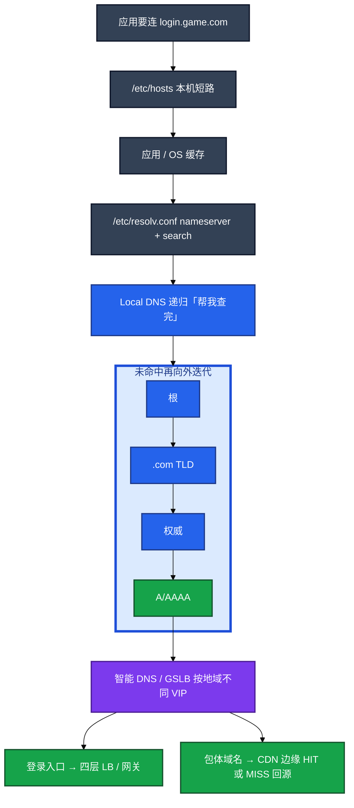
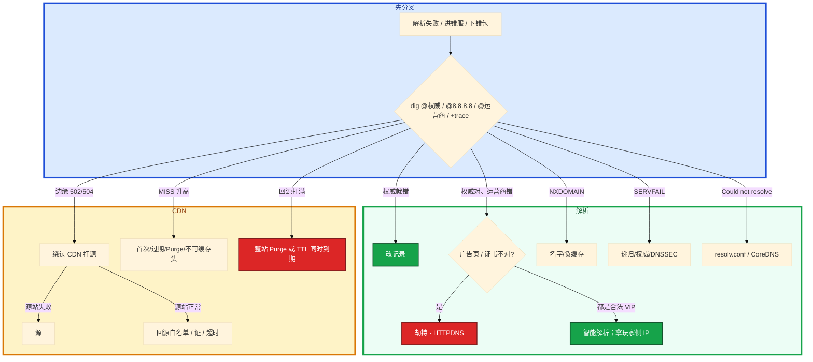

# DNS 与 CDN


开服要把登录域名从旧 VIP 切到新机房。你改完 A 记录，自己电脑 `dig` 已是新 IP，渠道 A 还在进旧服；热更时有人点了「整站 Purge」，源站出口瞬间打满。群里有人要先 Purge 清缓存，有人说「被劫持了」——其实权威对了，只是运营商 Local DNS 还缓存着旧答案。

**本章主线（排障就按这三步想）：**

1. **分层**：客户端问递归，递归迭代问权威；登录走 LB，包体走 CDN，回源是另一跳——别在 CDN 502 时只查 DNS。
2. **对比**：`dig @权威` / `@8.8.8.8` / `@运营商` / `+trace` 分「权威错了还是中间缓存脏了」。
3. **切流**：先降 TTL 再改 A；旧 IP 托底；包体 URL 带 hash，禁止整站 Purge。

**读完你能：** 白板上画客户端→递归→权威；会用 `+trace` 和多 DNS 对比；会做「先降 TTL 再改记录」；会绕过 CDN 打源；包体 URL 带 hash、禁止整站 Purge。

## 本章目录

- [1. 基本概念](#1-基本概念)
- [2. 架构图](#2-架构图)
- [3. 原理](#3-原理)
- [4. 落地](#4-落地)
- [5. 核心配置](#5-核心配置)
- [6. 命令与操作](#6-命令与操作)
- [7. 生产排障](#7-生产排障)
- [8. 必会 · 常考](#8-必会--常考)
- [合上书](#合上书问自己)

**本章不讲：** curl -w dns 段、分层抓包 → [11](../11-网络排障与抓包/)；证书 / 回源 HTTPS / SNI → [09 HTTP与TLS](../09-HTTP与TLS/)；CoreDNS、ndots 细节 → K8s 09；包体热更、渠道包流程 → 游戏专题 06；Nginx 回源超时深配置 → [23 Nginx](../23-Nginx/)。

---

## 1. 基本概念

DNS/CDN 排障是 **先分清「名字解析」和「内容分发」**，不是 ping 通就结案。客户端几乎从不自己去问根——APP 要连 `login.game.com`，先问 Local DNS（**递归**），Local DNS 再向根 / TLD / **权威**做**迭代**。中间任何一层缓存脏了，权威改了用户仍可能打旧 IP。

**值班里怎么认现象**（先听玩家/渠道怎么说，再对表）：

| 玩家/渠道说的 | 技术含义 | 你的第一刀 |
|---------------|----------|------------|
| 「进错服了」「连到测试服」 | 解析到旧 VIP 或智能解析调度 | 拿玩家侧 `dig` 或客户端日志 IP |
| 「打不开」「Could not resolve」 | resolv / CoreDNS / 权威 NXDOMAIN | `dig @权威` + `+trace` |
| 「下载慢 / 下错版本包」 | CDN MISS 或脏缓存 | `curl -I` 看 X-Cache / Age |
| 「部分地区不行」 | 劫持或智能 DNS 地域调度 | 对比 `@权威` vs `@运营商` |

| 角色 | 干什么 | 值班里什么时候碰到 |
|------|--------|-------------------|
| **递归**（Local DNS） | 客户端问它「帮我查完」；它自己去迭代，并缓存答案 | 玩家手机运营商 DNS、公司内网 DNS |
| **权威** | 这个域名的真相；改 A 记录改的是这里 | 云解析控制台、自建 NSD |
| **根 / TLD** | 只做转介：根指到 .com，.com 指到权威 | `dig +trace` 里看到的那几跳 |
| **智能 DNS / GSLB** | 按地域返回不同 VIP，都是你配的合法地址 | 华北/华南进不同机房 |

| 在 DNS / CDN 里 | 不在这一层 |
|-----------------|------------|
| 递归缓存、TTL、负缓存、劫持 | TCP 握手、TLS 链（08/09） |
| X-Cache HIT/MISS、回源、Purge | Nginx 指令细节（23） |
| hosts / resolv.conf / ndots | CoreDNS 部署深挖（K8s 09） |

`nsswitch` 里 `files dns` 表示 hosts 优先。`dig +trace` 从根走迭代，用来证明「权威没问题还是中间缓存有问题」。

**打个比方**：DNS 像查通讯录——客户端只打「114 查号台」（递归），查号台再去翻黄页（权威）。你改了黄页上的号码，查号台记事本上还记着旧号，打电话的人仍可能打到旧地址。CDN 像连锁便利店——门口有货就不去仓库拿（HIT），没货才回源（MISS）；整站 Purge 等于把所有分店货架清空，顾客全涌向仓库。

常见误判：本机 `ping` 通就宣布「DNS 没问题」。智能解析按地域返回不同 VIP，你电脑解析到的是另一机房。排障必须让玩家提供 `dig` 结果或客户端日志里的 IP。

> **记住**：客户端问递归，递归再问权威；权威对了用户仍可能打旧 IP，要用 +trace 和多 DNS 对比。

**面试怎么说**：「DNS 我先 dig @权威 和 @8.8.8.8 对比，+trace 分缓存还是权威；CDN 502 我绕过 CDN 打源，看 X-Cache 分 HIT 还是 MISS。」

---

## 2. 架构图

后面切流、劫持、回源都对着这张图。



**读图三句话：**

1. **客户端不对根说话**，问的是递归；`+trace` 模拟的是递归的迭代路径，不是客户端直连。
2. **权威改了 ≠ 用户切了**——递归、运营商、客户端、连接池都可能还拿旧 IP；「DNS 已切」≠「用户已切」。
3. **登录走 LB，包体走 CDN**——回源是另一跳，边缘绿锁证明不了源站；502 要分 CDN 还是源。

三种解析结果（挂的时候处理不一样）：


---

## 3. 原理

### 3.1 递归与权威：查号台和黄页

**一句话：** 客户端对 Local DNS 是递归（一次问完）；Local DNS 对根/TLD/权威是迭代；`dig +trace` 用来分缓存和权威。

**打个比方**：你打 114 查号（递归），114 自己去翻黄页、问总机（迭代），最后告诉你号码。你改黄页上的号码，114 记事本还记着旧号——得等 TTL 过期或换一家查号台验证。

**现场走一遍**（渠道报「进错服」，先别改业务域名）：

1. 跳板机上跑四组对比：

```bash
dig login.game.com @ns1.example.com +short    # 直问权威
dig login.game.com @8.8.8.8 +short            # 公共 DNS
dig login.game.com +short                     # 本机默认（可能是公司 DNS）
dig login.game.com +trace                     # 从根走迭代
```

2. 屏幕出现（示例）：

```text
# @权威
203.0.113.50

# @8.8.8.8
203.0.113.50

# 本机默认（公司 DNS）
198.51.100.10

# +trace 最后一行
login.game.com.        300     IN  A   203.0.113.50
```

3. **读数**：权威和 8.8.8.8 都是 `203.0.113.50`（新 VIP），公司 DNS 还是 `198.51.100.10`（旧 VIP）→ **递归缓存脏了**，不是权威没改。

4. 让玩家手机 4G 再 `dig @223.5.5.5` 或提供客户端日志里的 IP，三份对上才能结案。

5. 若权威本身就错 → 去云解析改 A 记录；若 SERVFAIL → 查递归/权威/DNSSEC，不要当 NXDOMAIN 改业务名。

**输出解读**：

| 响应 | 含义 | 别当什么 |
|------|------|----------|
| NXDOMAIN | 权威说没有；会缓存负缓存 TTL | 立刻补回去仍可能 NXDOMAIN，要等负缓存过期 |
| SERVFAIL | 权威或递归坏、DNSSEC 失败 | 「域名不存在」去改业务名 |
| 超时 | resolv.conf、DNS 不可达、CoreDNS 挂 | 先查 nameserver 通不通 |

**面试怎么说**：「权威和 8.8.8.8 一致、运营商不一致，是递归缓存或劫持；+trace 从根到权威整条对，说明权威没问题，问题在中间层。」

> **记住**：`dig +trace` 用来分缓存和权威；NXDOMAIN 和 SERVFAIL 处理方式完全不同。

### 3.2 hosts 与 resolv.conf：本机短路和查号台地址

**一句话：** hosts 只给本机短路；resolv.conf 会被 DHCP 覆盖；K8s ndots 会让外网解析先在集群里空转几圈。

**打个比方**：hosts 像你在通讯录里手写备注——只对你这台手机生效，改一台漏一台。resolv.conf 是「默认查号台号码」，DHCP 一刷新可能被运营商改掉。

**现场走一遍**（登录连不上，Could not resolve host）：

1. 先看本机有没有短路：

```bash
grep login.game.com /etc/hosts
cat /etc/nsswitch.conf | grep hosts
cat /etc/resolv.conf
```

2. 屏幕出现：

```text
# /etc/hosts 无匹配

# nsswitch.conf
hosts:      files dns myhostname

# resolv.conf
nameserver 10.96.0.10
search default.svc.cluster.local svc.cluster.local cluster.local
```

3. **读数**：`files` 在 `dns` 前，hosts 命中就不会问 DNS——本机没写，继续。nameserver 是 `10.96.0.10`（CoreDNS），search 域很长 → K8s Pod 里短名字会先补 cluster 域查好几圈。

4. 测 nameserver 通不通：

```bash
dig login.game.com @10.96.0.10 +short
dig login.game.com. +short    # FQDN 带点，跳过 search 补全
```

5. `@10.96.0.10` 超时 → CoreDNS 挂了或网络不通，不是业务域名拼错。FQDN 带点快很多 → ndots 问题，见 K8s 09。

**输出解读**：

| 现象 | 说明 | 下一步 |
|------|------|--------|
| hosts 有旧 IP | 本机短路，不会问 DNS | 删 hosts 或改对；生产不要靠它做服务发现 |
| resolv 重启丢 | DHCP / NetworkManager 覆盖 | 用 NM 的 dns 配置或 resolvconf 钉死 |
| ndots 空转 | `api.xxx.com` 先变 `api.xxx.com.default.svc...` | 写 FQDN 带点，或调 ndots |

**面试怎么说**：「Could not resolve 我先看 resolv.conf 的 nameserver 通不通、CoreDNS 在不在；K8s 外网域名写 FQDN 带点，避免 ndots 空转打满 CoreDNS。」

> **别混**：调试时手改 hosts 指新 VIP——改一台漏一台，生产不要靠它做服务发现。

### 3.3 TTL、切流、故障表现：改黄页前先告诉查号台「别记太久」

**一句话：** 先降 TTL 再改记录；「DNS 已切」不等于用户已切，运营商不守 TTL 时旧 IP 要托底。

**打个比方**：你要搬家换电话，先告诉查号台「这号码只记 1 分钟」（降 TTL），等旧记录过期再公布新号；有些查号台不守规矩仍记旧号——旧号码留语音信箱转接到新号（托底）。

**现场走一遍**（开服切登录域名到新 VIP）：

1. **切流前五步**（按顺序，不能跳）：

```bash
# ① 先把 TTL 从 3600 降到 60，等一个旧 TTL（3600 秒）
dig login.game.com @ns1.example.com | grep -E '^login|IN A'

# ② 改 A 记录指向新 VIP 203.0.113.50
# ③ 旧 IP 198.51.100.10 保留，Nginx 反代到新 IP（托底）
# ④ 监控旧 IP 流量归零再回收
# ⑤ TTL 调回 3600
```

2. 改完权威后验证：

```bash
dig login.game.com @ns1.example.com +short   # 应是新 IP
dig login.game.com @8.8.8.8 +short           # 可能还是旧 IP（TTL 内）
```

3. **读数**：权威已是新 IP，但 8.8.8.8 还是旧 IP → 正常，等 TTL 过期。**「DNS 已切」≠「用户已切」**——部分渠道还会打旧 VIP 长达一个旧 TTL。

4. 国内运营商可能**不遵守 TTL**——旧 IP 必须保留反代到新 IP，监控旧 IP 流量归零再回收。

5. 开服当天不要把登录域名 TTL 和 CDN 规则叠在一起改。DNS 未收敛时 Purge，会让部分地区回源、部分打旧缓存。

**输出解读**：

| 现象 | 方向 |
|------|------|
| Could not resolve host | resolv.conf、DNS 不可达、CoreDNS 挂 |
| NXDOMAIN | 名字错、记录删了；负缓存 TTL |
| SERVFAIL | 递归/权威/DNSSEC |
| 部分地区错 IP | 劫持，或智能解析/CDN 调度（先对比权威） |

**面试怎么说**：「切流我先 TTL 3600→60 等一个周期，再改 A；旧 IP 反代托底，监控流量归零；运营商可能不守 TTL，不能权威改了就算切完。」

> **记住**：摘流量要 VIP 级（LB 摘）+ DNS，不要只改 DNS；健康检查摘了死 VIP，TTL 内仍可能打到。

### 3.4 劫持与 HTTPDNS：查号台给你假号码

**一句话：** 劫持用多 DNS 对比；智能解析也是不同 IP，但都是你配的合法 VIP；HTTPDNS 绕 Local DNS，证书仍校域名。

**打个比方**：正常查号台告诉你正确号码；被劫持的查号台给你广告热线。智能 DNS 像「北方用户接北京分机、南方接广州分机」——号码不同，但都是你们公司合法线路。HTTPDNS 像 APP 内置专用查号 API，绕过本地查号台。

**现场走一遍**（玩家报「打开是广告页」）：

1. 四路对比同一域名：

```bash
dig cdn.game.com @ns1.example.com +short
dig cdn.game.com @8.8.8.8 +short
dig cdn.game.com @223.5.5.5 +short          # 阿里公共 DNS
dig cdn.game.com @114.114.114.114 +short    # 运营商常用
```

2. 屏幕出现：

```text
# @权威 / @8.8.8.8
203.0.113.20

# @223.5.5.5 / @114
59.24.3.174    # 广告页 IP，不是你们配置的
```

3. **读数**：权威和 8.8.8.8 一致，只有运营商 DNS 错 → **劫持**。换 4G/Wi-Fi、换 DoH 交叉验证。

4. 若华北玩家解析到华南 VIP、但都是你配的合法地址 → **智能 DNS**，不是劫持；拿玩家侧 IP 对比调度策略。

5. HTTPDNS 方案：客户端用 HTTPS 问业务自己的解析接口拿 IP，再连接时指定 IP。**证书校验仍用原域名**（SNI / Host），不要改成校验证 IP。

```bash
curl --resolve login.game.com:443:203.0.113.50 https://login.game.com/
```

**面试怎么说**：「劫持是权威和公共 DNS 对、运营商错且是广告 IP；智能 DNS 不同 IP 但都是合法 VIP。HTTPDNS 绕过 Local DNS，证书仍校域名，SNI 用原名。」

> **别混**：智能 DNS 不同 IP 是合法 VIP；劫持是广告页或错误 IP。

### 3.5 CDN：命中、回源、包体

**一句话：** MISS 不一定是故障；502 当源站查；整站 Purge 会打死源站，包体 URL 必须带 hash。

**打个比方**：CDN 边缘像连锁便利店——门口有货（HIT）就不去仓库（源站）；没货（MISS）才回源拿。整站 Purge 等于把所有分店货架清空，顾客全涌向仓库，仓库瞬间被挤爆。

**现场走一遍**（包体下载 502，先别 Purge）：

1. 看 CDN 响应头：

```bash
curl -I https://cdn.game.com/patch/v1.2.3/app.apk
```

2. 屏幕出现：

```text
HTTP/2 502
x-cache: MISS
via: 1.1 cache-node-03
```

3. **读数**：502 + MISS → 边缘回源失败，**当源站查**，不是 CDN 坏了。HIT 不应 502——HIT 还 502 是边缘脏缓存（09）。

4. 绕过 CDN 打源：

```bash
curl -I -H 'Host: cdn.game.com' http://203.0.113.100/patch/v1.2.3/app.apk
```

5. 源站也 502 → 源站问题；源站 200 → 查回源白名单、回源证书、回源超时。安全组要放行 CDN 回源网段。

**输出解读**：

| Header | 用途 |
|--------|------|
| X-Cache: HIT/MISS | 是否回源 |
| Age | 已缓存多久 |
| Cache-Control | 源站说能不能存 |

不缓存：`Set-Cookie`、`private` / `no-store`、4xx/5xx（默认）、带 Authorization。CDN 502：边缘连不上源；504：源太慢。回源 HTTPS 证书过期只打 502，边缘仍然绿锁（09）。

**游戏包体纪律**：

1. URL 带 content hash，不要同 URL 覆盖发布。
2. 分版本路径、长 TTL；发版 Purge **指定 URL**，禁止整站刷新。
3. 热更小补丁走 CDN；配置表若要秒级生效不要靠超长 TTL。
4. 回源风暴：TTL 同时到期或 Purge。错峰 TTL、预热（preload）、源站扩容 + 限流。
5. 渠道包若走不同 CDN 域名，要分别预热。

**面试怎么说**：「CDN 502 我先 curl -I 看 X-Cache；MISS 回源失败查源站，绕过 CDN 打源分锅；包体 URL 带 hash，禁止整站 Purge。」

> **记住**：MISS 不一定是故障——首次、过期、Purge、不可缓存头都会 MISS。

---

## 4. 落地

| 项 | 选 | 不选 |
|----|----|------|
| 切流记录 TTL | 先降到分钟级，切完再调回 | 直接改 A，TTL 还 3600 |
| 包体 | CDN + 哈希 URL + 按文件 Purge | 同 URL 覆盖、整站 Purge |
| API | 慎用缓存 | 当静态资源长 TTL |
| 登录调度 | 智能 DNS 可以；核心实时服常用固定 + 四层 LB | 只靠短 TTL 调度实时服 |
| 劫持 | 多 DNS 对比 + HTTPDNS | 和智能解析混为一谈 |
| hosts | 调试临时写，有回滚 | 生产服务发现 |
| 开服窗口 | 先 DNS 稳定再发包体 | 登录 TTL 和 CDN 规则同一窗口叠改 |

权威在云解析 / 自建 NSD。递归是运营商 Local DNS 或内网 DNS。CDN 控制台看 HIT、回源带宽、Purge 任务。K8s 里 resolv 由 kubelet 写 ndots/search。

验收：`dig @权威` 已是新 IP 不算用户已切；要旧 IP 流量归零。CDN 验收看指定 URL 的 X-Cache 和回源带宽，不要只看边缘 HIT 率。不要只 ping 自己电脑。

---

## 5. 核心配置

只动有证据的项。Purge 粒度 = 具体文件。

| 参数 | 常见 | 生产怎么用 | 改错会怎样 |
|------|------|------------|------------|
| 登录 TTL | 常 3600 | 切流前降到 **60** | 直接改 A = 最长一个旧 TTL 双活 |
| 包体 TTL | 可天级 | 哈希路径才敢长 | 同 URL 覆盖 → 脏缓存 |
| 负缓存 TTL | 发行版/厂商各异 | 补记录后仍 NXDOMAIN 先等它 | 当权威还没改 |
| ndots | K8s 默认 **5** | 外网写 FQDN 带点 | 先在集群里空转 |
| Cache-Control | 源站说了算 | 包体可缓存；API private/no-store | 动态接口被边缘存下来 |
| Purge | — | **指定 URL** | 整站 = 回源风暴 |
| 回源 HTTPS | 另一张证 | 与边缘证分开监控（09） | 边缘绿锁、回源 502 |

> **记住**：要切流的记录用分钟级 TTL；包体哈希路径可用天级。Purge 粒度 = 具体文件。监控回源带宽。

---

## 6. 命令与操作

### 6.1 命令速查

```bash
dig www.example.com A +short
dig www.example.com +trace
dig www.example.com @ns1.example.com
dig www.example.com @8.8.8.8
curl -I https://cdn.example.com/app.apk
curl -H 'Host: cdn.example.com' http://<源站IP>/app.apk
curl --resolve host:443:ip https://host/
```

典型 `+trace` 输出（节选）：

```text
.                       518400  IN  NS  a.root-servers.net.
com.                    172800  IN  NS  a.gtld-servers.net.
example.com.            86400   IN  NS  ns1.example.com.
www.example.com.        300     IN  A   203.0.113.10
```

典型 CDN 响应头：

```text
HTTP/2 200
x-cache: HIT
age: 3600
cache-control: public, max-age=86400
```

| 目的 | 命令 | 看什么 | 正常/异常 |
|------|------|--------|-----------|
| 本机答案 | `dig ... +short` | 你电脑的 IP，不是玩家的 | 和权威不一致可能是缓存 |
| 分缓存还是权威 | `dig +trace` | 从根到权威整条 | 最后一行 A 记录是真相 |
| 直问权威 | `dig @权威` | 改记录是否生效 | 权威错 → 改控制台 |
| 对比公共 DNS | `dig @8.8.8.8` | 和运营商是否一致 | 不一致 → 缓存或劫持 |
| CDN 命中 | `curl -I` 看 X-Cache / Age | HIT 不应 502 | MISS + 502 → 源站 |
| 绕过 CDN | `curl -H Host: ... http://源站IP/...` | 源站失败就是源 | 源站 200 → 回源配置 |
| 指定 IP 仍校域名 | `curl --resolve host:443:ip` | HTTPDNS 同款 | 证书仍校域名 |

值班先跑：权威、8.8.8.8、运营商、+trace；CDN 再加 X-Cache 和绕过打源。

### 6.2 现场操作

**对比解析：** 权威 / 公共 DNS / 运营商 / 玩家客户端日志 IP，三份对上才能结案。智能 DNS 下你办公室解析到的 VIP 和玩家手机不是同一个。

**切流：** TTL 3600→60 → 等一个旧 TTL → 改 A → 旧 IP 反代托底 → 流量归零再回收 → TTL 调回。摘流量要 LB 摘 + DNS。

**劫持：** 权威和 8.8.8.8 都对、只有运营商错，才是劫持。HTTPDNS 绕 Local DNS，证书仍校域名。

**绕过 CDN 打源：** 源站 IP + Host + SNI。源站失败就是源；源站正常查回源白名单、回源证书、回源超时。安全组放行 CDN 回源网段。

**包体发版：** URL 带版本哈希 → 预热热门节点 → 按文件 Purge → 错开 TTL。渠道包不同 CDN 域名分别预热。开服先 DNS 稳定再发包体。

---

## 7. 生产排障

和 01 同一套三问：名字还能解析吗？解析到的 IP 是不是你要的？已有连接还通不通？

**DNS 未收敛 = 部分用户还打旧 VIP，不是全集群挂了。** 不要先整站 Purge。



| 现象 | 先做什么 | 不要做什么 |
|------|----------|------------|
| 部分渠道进旧服 | TTL 纪律 + 旧 IP 托底；拿玩家 dig | ping 自己电脑当验证 |
| 权威对、运营商广告页 | 劫持；HTTPDNS | 先改业务域名 |
| 华北打到华南合法 VIP | 智能 DNS；拿玩家 IP | 当劫持 |
| NXDOMAIN | 核记录和负缓存 | 当 SERVFAIL 改业务名 |
| SERVFAIL | 核递归/权威/DNSSEC | 改业务拼写 |
| 解析外网慢、CoreDNS 不忙 | ndots / FQDN 带点 | 先骂公网 DNS |
| CDN 502、localhost 正常 | 源站 IP+Host+SNI | 只信绿锁 |
| HIT 还 502 | 边缘脏缓存（09） | 当回源 |
| MISS 升高 | 是否不可缓存/Purge/首次 | 工单骂厂商当第一刀 |
| 源站带宽打满 | 是不是整站 Purge | 再整站刷一次 |
| resolv.conf 重启丢 | NM / DHCP 钉死 | 每台手改当变更 |

活动高峰常见误操作：**DNS 未收敛就 Purge** 和 **只 ping 自己电脑验证切流**。正确处理：四路 dig 对比 → 分权威/缓存/劫持 → CDN 502 绕过打源 → 包体带 hash 按文件 Purge。

---

## 8. 必会 · 常考

| 说法 | 对错 | 口径 |
|------|:----:|------|
| 用户电脑自己去问根 | 错 | 问递归，递归再迭代 |
| 权威改了用户就切了 | 错 | 「DNS 已切」≠「用户已切」 |
| 只 ping 自己电脑验证切流 | 错 | 智能 DNS 按地域不同 VIP |
| 4 台 TTL 不守也可以只改 A | 错 | 运营商可能不守；旧 IP 要托底 |
| NXDOMAIN 和 SERVFAIL 一样处理 | 错 | 一个是没有，一个是 DNS 坏了 |
| 智能 DNS 不同 IP 就是劫持 | 错 | 合法 VIP vs 广告页 |
| HTTPDNS 拿到 IP 用 IP 校验证书 | 错 | 证书签给域名；SNI/Host 仍用原名 |
| hosts 做生产服务发现 | 错 | 改一台漏一台 |
| resolv.conf 手改能当变更 | 错 | DHCP/NM 会覆盖 |
| MISS 一定是 CDN 坏了 | 错 | 首次/过期/Purge/不可缓存头 |
| HIT 还 502 是回源问题 | 错 | 边缘自己的问题 |
| 整站 Purge 最快 | 错 | 回源风暴打爆源站 |
| 同 URL 覆盖发布 | 错 | 脏缓存；哈希路径是硬纪律 |
| 开服当天 DNS 和 CDN 一起改 | 错 | 先 DNS 稳定再发包体 |
| 健康检查摘了死 VIP 就没人打了 | 错 | TTL 内仍可能打到 |

数字：切流前 TTL **3600→60**；K8s ndots 默认 **5**；证书/回源交叉 09 的 **14 天**。

易混：递归 vs 权威 vs 迭代；NXDOMAIN vs SERVFAIL；劫持 vs 智能解析；HIT vs MISS vs 回源 502；边缘证 vs 源站证；hosts 短路 vs DNS 已切。

---

## 合上书，问自己

1. 客户端问谁？递归和迭代各发生在哪一段？`dig +trace` 用来证明什么？
2. 切流五步是什么？运营商不守 TTL 时旧 IP 怎么办？
3. NXDOMAIN 和 SERVFAIL 怎么分？负缓存会怎样？
4. 劫持和智能解析怎么在排障时分开？HTTPDNS 证书校谁？
5. CDN 502 怎么判断是 CDN 还是源站？MISS 一定是故障吗？
6. 2GB 包体发版怎么避免回源打爆？开服为什么先稳定 DNS？

六题都能口述，这一章就过了。下一章把抓包剖开：curl -w 五段、RST 是谁发的 → [11 网络排障与抓包](../11-网络排障与抓包/)。
