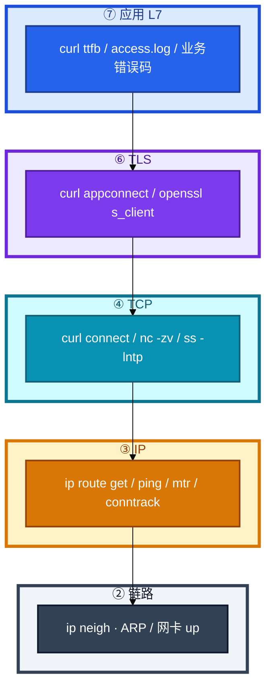
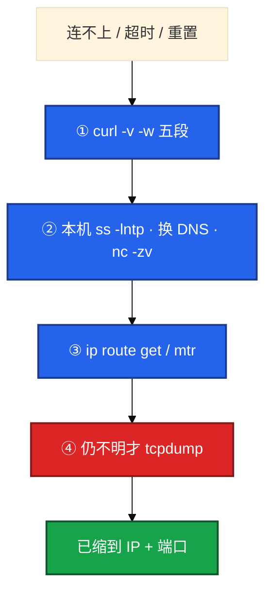
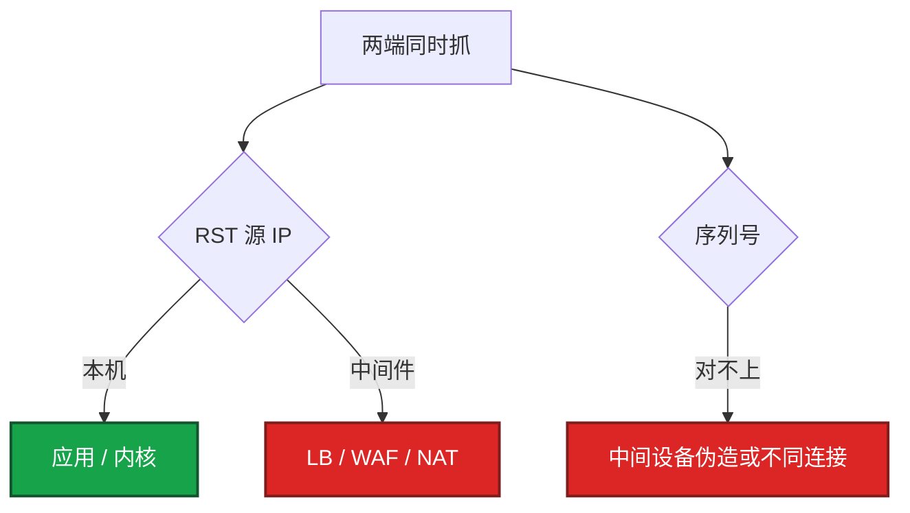
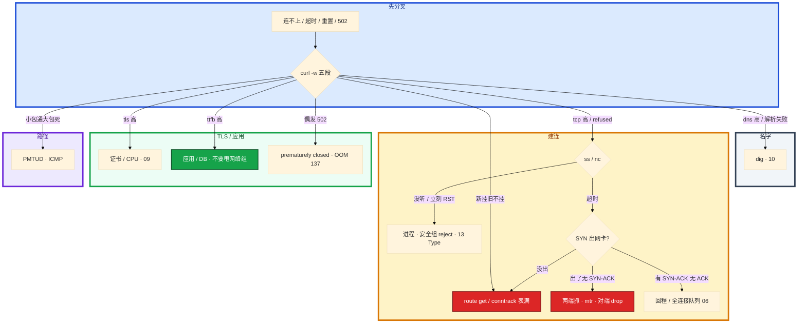

# 网络排障与抓包


玩家报「登录连不上」。群里有人已经在生产机 `tcpdump -i any` 打到终端滚屏，SSH 卡到怀疑人生；另有人把工单甩给网络组查专线——其实 API、大厅、房间是**三条连接、三个端口**，在登录域名上抓房间包等于白抓。

**本章主线（排障就按这三步想）：**

1. **定层**：连不上 / 超时 / 重置 / 解析失败——先用 `curl -w` 五段分到 DNS / TCP / TLS / 应用，**别跳层**。
2. **缩范围**：`ss -lntp` → `ip route get` → 缩到「这个 IP + 这个端口」再抓，禁止 `-i any` 裸抓。
3. **留证**：握手卡在哪一包、RST 源 IP 是谁——NAT 后面必须**两端同时抓**才是铁证。

**读完你能：** 白板上画出 L7→L2；连不上 / 超时 / 重置能一口定责；会 `curl -w` 做差、`ip route get`、tcpdump/Wireshark 过滤；三次握手丢包能指到 SYN / SYN-ACK / ACK 哪一步。

## 本章目录

- [1. 基本概念](#1-基本概念)
- [2. 架构图](#2-架构图)
- [3. 原理](#3-原理)
- [4. 落地](#4-落地)
- [5. 核心配置](#5-核心配置)
- [6. 命令与操作](#6-命令与操作)
- [7. 生产排障](#7-生产排障)
- [8. 必会 · 常考](#8-必会--常考)
- [合上书](#合上书问自己)

**本章不讲：** TCP 状态机、窗口、重传算法 → [08 TCP与UDP](../08-TCP与UDP/)；conntrack 表满、五链四表 → [15 iptables与conntrack](../15-iptables与conntrack/)；HTTP 499/502/504、证书语义 → [09 HTTP与TLS](../09-HTTP与TLS/)；DNS 劫持 / TTL / CDN → [10 DNS与CDN](../10-DNS与CDN/)；TIME_WAIT / CLOSE_WAIT / 队列 → [06 网络栈与Socket](../06-网络栈与Socket/)。

---

## 1. 基本概念

网络排障是 **按层定责**，不是一上来 tcpdump。现场 80% 死在 DNS / TCP / TLS / 应用——抓包是**缩小范围之后**的确认手段，不是第一刀。

**值班里怎么认现象**（先听玩家/监控怎么说，再对表）：

| 玩家/客户端说的 | 技术含义 | 你的第一刀 |
|-----------------|----------|------------|
| 「连不上」「打不开」 | 可能是 refused / timeout / DNS | 先问清**完整报错句** |
| 「一直转圈」 | 多半是 timeout 或 ttfb 慢 | `curl -w` 五段 |
| 「闪退 / 立刻失败」 | 可能是 refused 或 RST | `ss -lntp` + 五段 |
| 「能进大厅进不了房间」 | **两条连接** | 别在登录域名上抓房间端口 |

| 现象 | 含义 | 第一刀 |
|------|------|--------|
| Connection refused | 对端 RST 或无监听 | `ss -lntp`、安全组 **reject** |
| Timed out | SYN 无回复或中途黑洞 | 抓 SYN、mtr、conntrack |
| Reset | 有人发 RST | 抓包看 RST **源 IP** |
| Could not resolve | DNS | `dig`（见第 10 章） |

**打个比方**：像快递查不到——要先分清是「地址写错」（DNS）、「路不通」（TCP 超时）、「门卫不让进」（refused/RST）、还是「仓库拣货慢」（ttfb 高）。别一接到电话就让司机全程跟车录像（tcpdump -i any）。

安全组 **drop** = 超时（包被吃掉，像石沉大海）；**reject** = RST（门卫明确说「不让进」）。ping 不通 TCP 通 → ICMP 被禁，正常。ping 通**不能**证明 TCP 通——ICMP 和 TCP 走的不完全是同一条路。

> **记住**：先五段和 ss，后抓包；卡在哪一层就在哪一层取证，不要跳层。

**面试怎么说**：「连不上我先 curl -w 做差定层，refused 查监听和 reject，timeout 查 SYN 和 conntrack，不会一上来 tcpdump -i any。」

---

## 2. 架构图

后面五段、握手、抓包都对着这张图。



**读图三句话：**

1. **L7→L2 逐层下**，dns 高走 10，tls 高走 09，ttfb 高进应用，别跳层抓包。
2. **大厅 HTTP 用五段**；房间长连接用 ss + 抓 SYN / 心跳。
3. **现场顺序**：五段 → ss → route get → 仍不明才 tcpdump。



---

## 3. 原理

### 3.1 curl -w 五段：像快递轨迹，看卡在哪一站

**一句话：** 五段是**累计**计时，本段必须**做差**；connect 2ms、ttfb 3.5s → 路通了，慢在对方「拣货」（应用），不是路上堵车（公网）。

**打个比方**：查快递轨迹——`dns` 是查单号、`tcp` 是车出库、`tls` 是安检、`ttfb` 是对方开始拣货、`total` 是签收。总耗时 3.5 小时，得看卡在「运输」还是「拣货」。

**现场走一遍**（登录慢，先别抓包）：

1. 跳板机执行（`-o /dev/null` 不要存 body，只要计时）：

```bash
curl -o /dev/null -s -w \
  'dns:%{time_namelookup} tcp:%{time_connect} tls:%{time_appconnect} ttfb:%{time_starttransfer} total:%{time_total} code:%{http_code}\n' \
  https://login.example.com
```

2. 屏幕出现：

```text
dns:0.018 tcp:0.020 tls:0.018 ttfb:3.520 total:3.545 code:200
```

3. **做差读数**（累计值不能直接当本段）：

| 字段 | 怎么算本段 | 上面例子 | 高了找谁 |
|------|------------|----------|----------|
| dns | = namelookup | 0.018s | DNS / 劫持 / ndots |
| tcp | connect − dns | **2ms** | 防火墙、对端远、SYN 黑洞 |
| tls | appconnect − connect | ~0 | 证书、握手 CPU |
| ttfb | starttransfer − appconnect | **≈3.5s** | **服务端 / DB** |
| body | total − starttransfer | 很小 | 响应体大、带宽 |

4. 结论：TCP/TLS 都正常，**ttfb 3.5s** → 下一步查 login 服务和 DB，**不要甩网络组查专线**。

5. 辅助：`curl -v` 卡在哪一行也能分层——`Trying IP` / `Connected` / `SSL connection` / 首字节。

**面试怎么说**：「connect 快、ttfb 慢，我定责应用层，先查服务和 DB，不会先 tcpdump。」

> **记住**：HTTP 才有 tls 段；纯 TCP 看 connect 和 ttfb 就够。五段要做差四次。

### 3.2 路由、ARP、NAT、mtr

**一句话：** 双网卡必须 `route get`；mtr 后面跳同样丢才是真丢，中间一跳 ICMP 丢不能当事故。

**打个比方**：`route show` 像看地图册里有哪些路；`route get` 像 GPS 算「去这个地址实际走哪条」——双网卡、策略路由时，地图册和 GPS 可能不一致。

**现场走一遍**（新机器连 DB 超时，ping 通但业务连不上）：

1. 先看内核真实决策：

```bash
ip route get 10.0.1.50
```

```text
10.0.1.50 via 10.0.0.1 dev eth1 src 10.0.2.88 uid 0
    cache
```

2. **输出解读**：包从 **eth1** 出、源 IP **10.0.2.88**——若 DB 白名单只放了 eth0 的源 IP，就会 timeout，ping 却可能走 eth0 所以「通」。

3. 同网段再查 ARP：

```bash
ip neigh show dev eth1 | grep 10.0.1.50
```

`FAILED` = 二层不通或对端 down；`REACHABLE` = MAC 已学到。

4. 跨网段用 mtr 看路径（**看形态，不单看某一跳丢包率**）：

| mtr 形态 | 含义 |
|----------|------|
| 某跳丢、后面不丢 | 该跳限 ICMP，不是真丢业务包 |
| 某跳起后面同样丢 | 该跳开始真丢 |
| 跨区延迟 | 看哪一跳起 RTT 台阶 |

NAT（表满细节见第 15 章）：DNAT 改目的、SNAT 改源，都依赖 conntrack。

**面试怎么说**：「双网卡我必打 `ip route get`，不看 `route show` 就猜。mtr 中间一跳 30% 丢、后面 0%，是 ICMP 限速不是光纤断。」

### 3.3 MTU 与 PMTUD：小包通、大包死

**一句话：** 默认 ping 会骗你；小包通大包死，先查 ICMP「需要分片」是不是被墙。

**打个比方**：像寄小信封能进小区门，寄大沙发卡在大门——默认 ping 只寄「小信封」（56 字节），大门多窄发现不了。

**现场走一遍**（跨云 TLS 偶发失败、小 API 正常）：

1. 小包（常骗你）：

```bash
ping -c 3 203.0.113.10
```

2. 大包带 DF（不允许分片，测路径 MTU）：

```bash
ping -M do -s 1472 -c 3 203.0.113.10    # 1472 + 28 头 = 1500
```

若 **100% 丢** 而小 ping 通 → PMTUD 路径上某段 MTU 更小，且 ICMP「Fragmentation needed」可能被墙 → 发送方不知道降 MSS，大 TLS 记录挂死。

3. 处理：VPN/GRE/专线降 MSS；或放行 ICMP 需要分片；游戏 UDP 大包同理。

**面试怎么说**：「小包通大包死我先怀疑 PMTUD，用 `ping -M do -s 1472` 复现，不是先换证书。」

### 3.4 三次握手丢包定位

**一句话：** 超时 = 重复 SYN 无 SYN-ACK；拒绝 = SYN 立刻 RST；先证明 SYN 出了本机，再怪中间，再怪对端。

**打个比方**：握手像敲门——timeout 是没人应门（可能门牌错、门卫不让进、路断了）；refused 是门一开就被推出来（没监听或 reject）。

**现场走一遍**（新连接全挂，老连接还在）：

1. 本机只看 SYN/RST 摘要（先缩 IP+端口）：

```bash
tcpdump -i eth0 'tcp[tcpflags] & (tcp-syn|tcp-rst) != 0' and host 10.0.0.5 and port 443 -nn -c 50
```

2. **输出解读**：

| 本机看到 | 定责 | 下一步 |
|----------|------|--------|
| 重复 SYN，无 SYN-ACK | drop / 黑洞 / conntrack | `conntrack -C`、对端抓 |
| SYN → **立刻 RST** | 没监听 / reject | `ss -lntp` |
| 本机 SYN 出网卡，对端抓不到 | 源 IP / 策略路由错 | `ip route get` |
| 对端 SYN-ACK，本机没收到 | 回程黑洞 | 两端同时抓 |
| 已 ESTAB 仍慢 | 别回头改握手 | 五段 ttfb / TLS |

3. 新挂旧不挂 → **先 conntrack 表满**（第 15 章），不是光纤断。

**面试怎么说**：「timeout 我先证 SYN 出没出网卡，再两端抓；refused 先 ss 看监听；NAT 后定 RST 必须两端对序列号。」

### 3.5 TSO / GRO：假 checksum

**一句话：** 本机 Wireshark 里巨大帧 + incorrect checksum，多半是网卡卸载假象；对端抓才是真包。

**打个比方**：像本机看「打包好的整箱货」——网卡 TSO 在硬件里才拆成小件，本机抓包看到的是「整箱」，checksum 字段还没填真值。

**现场走一遍**（本机抓包满屏红 checksum，应用坚称没改包）：

1. 看卸载能力：

```bash
ethtool -k eth0 | egrep 'tcp-segmentation-offload|tx-checksumming'
```

2. **输出解读**：`tx-checksumming: on` + `tcp-segmentation-offload: on` → 本机 pcap 里 checksum 红 **正常**，不是应用 bug。

3. 要看真包：在 **对端** 抓；或生产**临时**关卸载、抓完立刻开——关 TSO 会把分段打回 CPU，高峰慎用。

**面试怎么说**：「本机 incorrect checksum 我先查 ethtool 卸载，对端抓验证；不会当应用改包去修代码。」

---

## 4. 落地

| 项 | 选 | 不选 |
|----|----|------|
| 机器 | 业务机短窗口抓，或旁路镜像到分析机 | 生产机开 Wireshark GUI |
| 权限 | `tcpdump` 组 / `CAP_NET_RAW` | 长期 root 裸跑、无过滤 |
| 落盘 | `/tmp` 或独立盘，`-c` / `-C` 限量 | 把大流量打印到 SSH 终端 |
| 分析 | pcap 带回来用本地 Wireshark | 在战斗服上 `follow stream` |

```bash
yum install -y tcpdump    # 或 apt install tcpdump
```

容器里默认看不到宿主机 veth 对端：要在 **宿主机网卡或 CNI 接口** 上抓。K8s 用 ephemeral debug / 节点上指定 Pod IP+端口。验收：能按 host+port 写出非空 pcap。

---

## 5. 核心配置

五段已经缩到「这个 IP、这个端口、这个方向」再抓。

| 参数 | 作用 | 生产怎么用 | 改错会怎样 |
|------|------|------------|------------|
| `-i eth0` | 指定网卡 | 先 `ip route get` 再定口 | `-i any` 聚合多口，TSO/方向都乱 |
| `-nn` | 不反解 DNS / 端口名 | **必开** | 抓包过程再解析，拖慢、污染 |
| `-s0` | 抓全包 | 要看 HTTP/TLS 明文或长度时开 | 默认 snaplen 截断 |
| `-c 1000` | 限包数 | **必开** | 活动高峰无限抓，把盘打满 |
| `-w file` | 写 pcap | 必写文件 | `-A` 打到终端 = 自造事故 |
| `-C 100 -W 5` | 单文件 MB、保留个数 | 长抓才用 | 不限会写满根盘 |
| `-B 4096` | 抓包缓冲 KB | 丢内核包时加大 | 缓冲不够 → pcap 自己丢 |

最小闭环：

```bash
tcpdump -i eth0 host 10.0.0.5 and port 8080 -nn -s0 -c 1000 -w /tmp/a.pcap
```

> **记住**：先缩到 IP+端口再抓；过滤 + `-c` + `-w` + `-nn`；禁止 `-i any` 裸抓。

---

## 6. 命令与操作

### 6.1 命令速查

```bash
dig +short $HOST
ip route get $IP
ping -c 3 $IP
mtr -r -c 10 $IP
nc -zv $IP 443
ss -lntp | grep 443
openssl s_client -connect $IP:443 -servername $HOST
conntrack -C
```

| 目的 | 命令 | 看什么 |
|------|------|--------|
| 五段 | `curl -w` 见 3.1 | 本段做差，不是累计值 |
| 出接口 | `ip route get $IP` | 源 IP、出网卡、策略路由 |
| ARP | `ip neigh show` | FAILED = 二层 |
| 有没有人听 | `ss -lntp` | 端口、PID |
| 握手摘要 | `tcpdump ... 'tcp[tcpflags] & (tcp-syn\|tcp-rst) != 0' -nn` | SYN / RST |
| 读 pcap | `tcpdump -nn -r /tmp/a.pcap` | 离线确认 |
| 卸载 | `ethtool -k eth0` | TSO / checksum offload |

nc 通 curl 不通 → 应用 / TLS，不要再查路由。nc 不通、ping 通 → 三层通、四层被挡。

### 6.2 tcpdump 过滤

```bash
# 握手和复位（第一刀）
tcpdump -i eth0 'tcp[tcpflags] & (tcp-syn|tcp-rst) != 0' -nn
tcpdump -i eth0 'tcp[tcpflags] = tcp-syn' -nn               # 纯 SYN
tcpdump -i eth0 host 10.0.0.5 and port 8080 -nn -s0 -c 1000 -w /tmp/a.pcap

# UDP 房间 / ICMP（PMTUD）
tcpdump -i eth0 udp port 9000 -nn -c 500 -w /tmp/room.pcap
tcpdump -i eth0 icmp -nn
tcpdump -i eth0 'not port 22' -nn                           # 别抓 SSH 撑死
```

| 要看的问题 | 过滤怎么写 |
|------------|------------|
| 登录超时 | `host <vip> and port 443`，再加 SYN/RST 摘要 |
| 房间进不去 | **房间端口**，不要登录域名 |
| RST 谁发的 | `tcp[tcpflags] & tcp-rst != 0`，看源 IP |

### 6.3 Wireshark 显示过滤

| 目的 | 显示过滤 |
|------|----------|
| 重传 | `tcp.analysis.retransmission` |
| 重复 ACK | `tcp.analysis.duplicate_ack` |
| 零窗口 | `tcp.analysis.zero_window` |
| RST | `tcp.flags.reset==1` |
| 纯 SYN | `tcp.flags.syn==1 && tcp.flags.ack==0` |
| SYN-ACK | `tcp.flags.syn==1 && tcp.flags.ack==1` |
| HTTP 502 | `http.response.code==502` |
| 某两端 | `ip.addr==10.0.0.5 && tcp.port==8080` |

Follow TCP Stream 看 HTTP 502 发生在哪一跳；Statistics → Flow Graph 看哪边不回。

### 6.4 两端同时抓与五条 SOP



**① Connection refused：** `ss -lntp` 没监听 → journal 是否 failed → Address already in use 则旧进程占口（Type=forking，见 13）。

**② 偶发 502：** error.log `prematurely closed` → 上游 OOM / 137 → cgroup limit vs Xmx。三条证据：网关日志、上游退出码 / dmesg、抓包中途断开。

**③ 新连接全挂、长连接还在：** conntrack 满（06 / 15）。dmesg 有 `nf_conntrack: table full, dropping packet`。

**④ CLOSE_WAIT 涨：** `ss` 按 PID 聚合 → 连接池不探活或没 close（06）。

**⑤ TLS 偶发超时：** curl tls 段高 → RSA CPU、证书链、未复用 session（09）。用 `--resolve` 或 `-servername`，不要只 IP 直连。

---

## 7. 生产排障

三问：进程还在不在？还能不能建新连接？已有流量还通不通？



| 现象 | 先做什么 | 不要做什么 |
|------|----------|------------|
| refused | `ss -lntp`、journal、占口 | 先抓包、先改安全组 |
| timeout | SYN 出没出网卡；conntrack；两端抓 | 默认 ping 结案 |
| 大厅能进房间不能 | 抓 **房间端口** | 在登录域名上抓 |
| ttfb 3s、tcp 2ms | 应用 / DB | 甩网络组 |
| 新挂旧不挂 | conntrack -C、dmesg table full | 先改安全组、当光纤断 |
| 偶发 502 | prematurely closed + 137 + 中途 RST | 重启还活着的长连接服 |
| 本机 incorrect checksum | ethtool -k，对端抓 | 修应用校验、关 TSO 当修复 |
| mtr 中间一跳 30% 后面 0 | 当 ICMP 限速 | 开网络事故 |
| nc 通 HTTPS 失败 | openssl / 五段 tls | 再查路由 |

活动高峰最常见的误操作：**裸抓打满 SSH** 和 **跳层**。正确处理：五段定层 → 缩到 IP+端口 → 过滤 + `-c` + `-w` → RST 看源 IP。

---

## 8. 必会 · 常考

| 说法 | 对错 | 口径 |
|------|:----:|------|
| 一上来 tcpdump -i any | 错 | 先五段和 ss，缩到 IP+端口 |
| ping 通就能证明 TCP 通 | 错 | ICMP 和 TCP 不是一条路 |
| 安全组 drop 是 Connection refused | 错 | drop=超时；reject=RST |
| time_connect 就是本段 TCP | 错 | 累计值，要减 namelookup |
| ttfb 高先查专线 | 错 | tcp 很快则锅在应用 |
| `ip route show` 等于内核决策 | 错 | 双网卡必须 `route get` |
| mtr 某一跳丢包就是该跳坏了 | 错 | 后面跳同样丢才是真丢 |
| 默认 ping 通 = 网络好 | 错 | 小包通大包死是 PMTUD |
| 本机 incorrect checksum 要修应用 | 错 | TSO 假象，对端抓 |
| NAT 后只在本机抓就能定 RST | 错 | 两端同时抓，对序列号 |
| 光纤断了会只死新连接 | 错 | 新旧一起死；不对称先 conntrack |
| `-nn` 可省 | 错 | 反解 DNS 会污染正在查的问题 |
| 大厅能进就在登录域名上抓房间 | 错 | 两条连接两个端口 |

数字：以太网 MTU **1500**；`ping -M do -s 1472`（+28=1500）；tcpdump 必带 `-c` 和 `-w`；五段做差四次。

易混：timeout vs refused；drop vs reject；`route get` vs `show`；BPF 抓包过滤 vs Wireshark 显示过滤；SYN 没出网卡 vs 出了无 SYN-ACK；TSO 假 checksum vs 真坏包；conntrack 丢 vs 中间黑洞。

---

## 合上书，问自己

1. 连不上 / 超时 / 重置 / 解析失败，第一刀各是什么？drop 和 reject 差在哪？
2. 五段哪些是累计值？connect 2ms、ttfb 3.5s 锅在谁？
3. 三次握手卡在 SYN、SYN-ACK、ACK 各查什么？为什么要两端抓？
4. tcpdump 生产禁止什么？`-nn -c -w -i` 各干什么？只看握手的 BPF 怎么写？
5. Wireshark 重传 / RST / Follow Stream / 纯 SYN 的显示过滤？
6. 新挂旧不挂、小包通大包死、本机巨大帧 checksum 红，各先怀疑什么？

六题都能口述，这一章就过了。下一章把 30 秒全景和 USE/RED 剖开：告警响了先定域，而不是对着 top 盲重启。
