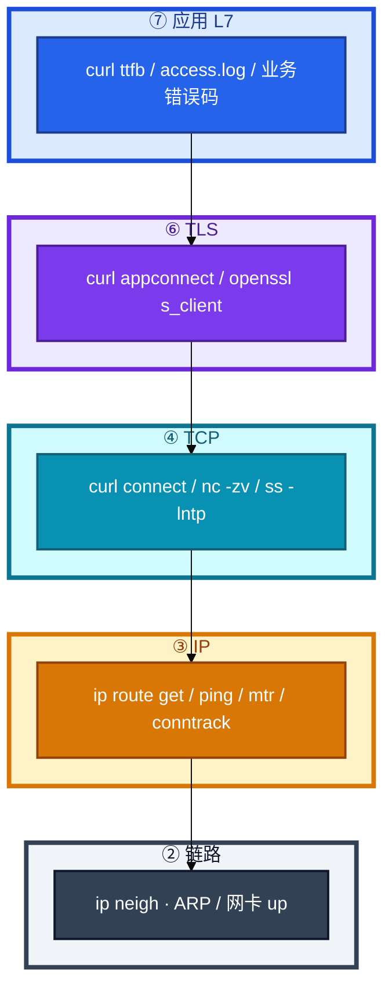
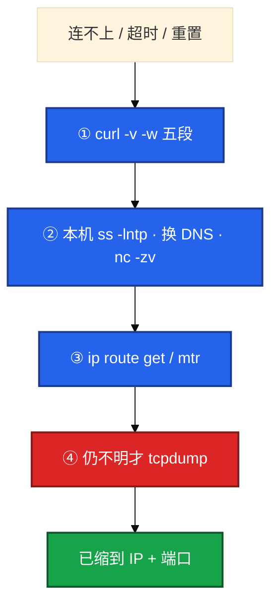
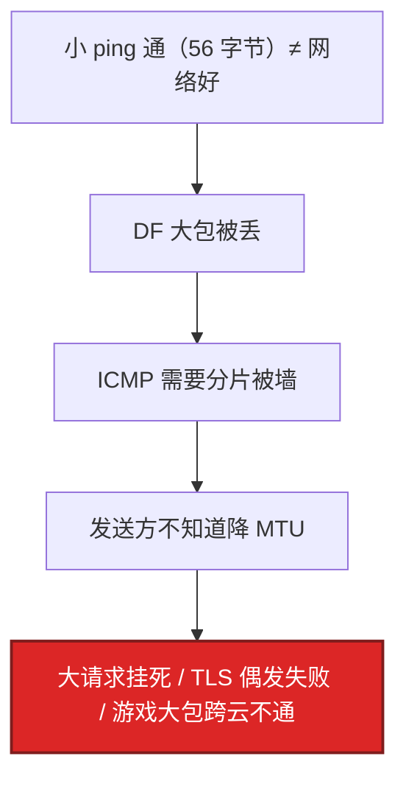
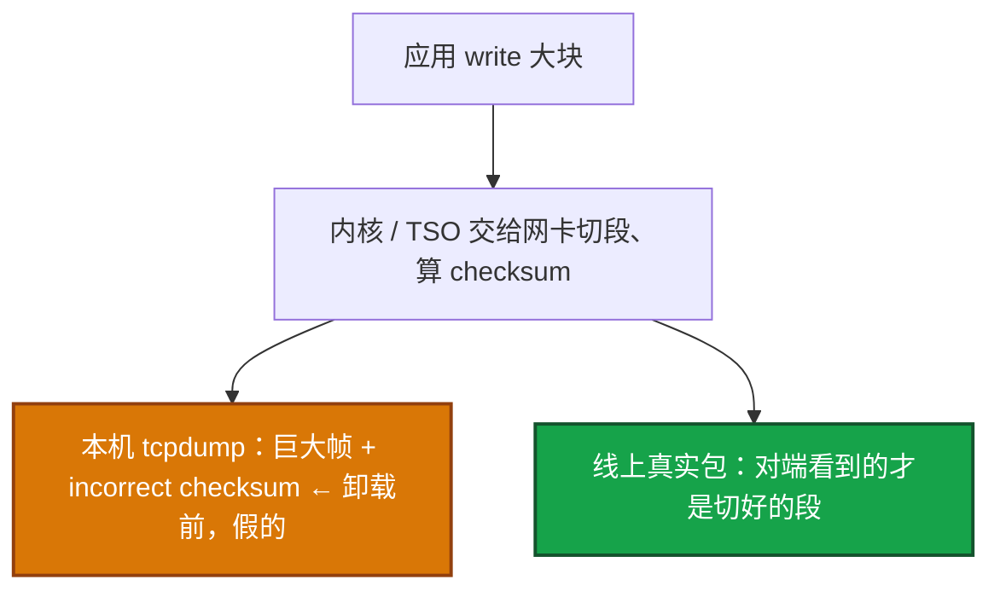
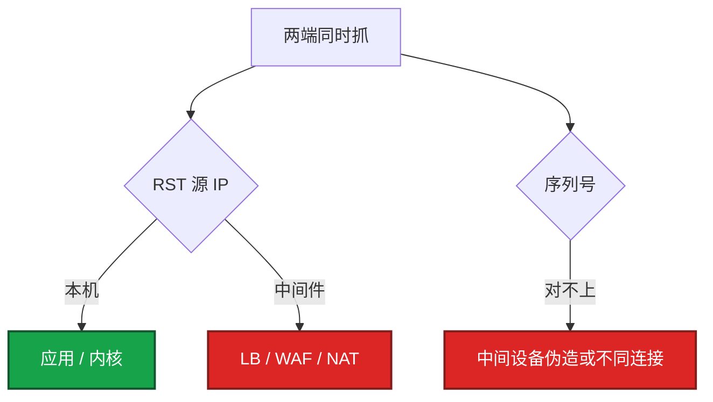
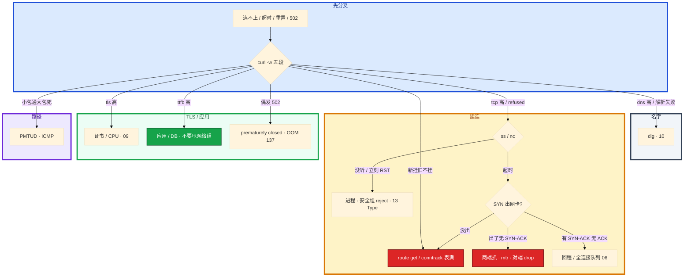

# 网络排障与抓包


玩家报「登录连不上」。群里有人已经在生产机 `tcpdump -i any` 打到终端，另有人把工单甩给网络组查专线。API / 大厅 / 房间三条连接搅在一起。

先别动手。这一章后半全是你会动手的：**怎么用五段定层、怎么过滤抓包、三次握手卡在哪一包、RST 看谁的源 IP。** 前面的分层和原理，是为了让你动手时不跳层、不裸抓。

**读完你能：** 白板上画出 L7→L2；连不上 / 超时 / 重置能一口定责；会 `curl -w` 做差、`ip route get`、tcpdump/Wireshark 过滤；三次握手丢包能指到 SYN / SYN-ACK / ACK 哪一步。

## 本章目录

缩进 = 上下级。3 下面才是 3.1。

想钉在**正文左边**跟着滚：菜单 **查看 → 打开视图 → 大纲**。Markdown 预览做不到独立左栏，目录只能写在文章开头。

- [1. 基本概念](#1-基本概念)
- [2. 架构图](#2-架构图)
- [3. 原理](#3-原理)
  - [3.1 五段做差](#31-curl--w-五段做差)
  - [3.2 路由 ARP NAT](#32-路由-arp-nat-mtr)
  - [3.3 MTU / PMTUD](#33-mtu-与-pmtud小包通大包死)
  - [3.4 三次握手丢包](#34-三次握手丢包定位)
  - [3.5 TSO / GRO](#35-tso--gro假-checksum)
- [4. 安装部署](#4-安装部署)
- [5. 核心配置](#5-核心配置)
- [6. 常用命令](#6-常用命令)
- [7. 常用操作](#7-常用操作)
  - [7.1 tcpdump 过滤](#71-tcpdump-过滤)
  - [7.2 Wireshark 过滤](#72-wireshark-显示过滤)
  - [7.3 两端同时抓](#73-两端同时抓定-rst)
  - [7.4 五条 SOP](#74-五条现场-sop)
- [8. 生产排障](#8-生产排障)
- [9. 必会 · 常考](#9-必会--常考)
- [合上书](#合上书问自己)

**本章不讲：** TCP 状态机、窗口、重传算法 → [08 TCP与UDP](../08-TCP与UDP/)；conntrack 表满、五链四表 → [15 iptables与conntrack](../15-iptables与conntrack/)；HTTP 499/502/504、证书语义 → [09 HTTP与TLS](../09-HTTP与TLS/)；DNS 劫持 / TTL / CDN → [10 DNS与CDN](../10-DNS与CDN/)；TIME_WAIT / CLOSE_WAIT / 队列 → [06 网络栈与Socket](../06-网络栈与Socket/)。

---

## 1. 基本概念

网络排障是 **按层定责**，不是一上来 tcpdump。现场 80% 死在 DNS / TCP / TLS / 应用。抓包是缩小范围后的确认。

三种人话必须先分开，工单才能定责：

| 现象 | 含义 | 第一刀 |
|------|------|--------|
| Connection refused | 对端 RST 或无监听 | `ss -lntp`、安全组 **reject** |
| Timed out | SYN 无回复或中途黑洞 | 抓 SYN、mtr、conntrack |
| Reset | 有人发 RST | 抓包看 RST **源 IP** |
| Could not resolve | DNS | `dig`（10） |

安全组 **drop** = 超时；**reject** = RST。ping 不通 TCP 通 → ICMP 被禁，正常。ping 通不能证明 TCP 通。

玩家「连不上」先问清卡在哪一句人话，再对到哪一层。进得去大厅进不去房间，是 **两条连接、两个端口**，不要在登录域名上抓房间端口。

> **记住**：先五段和 ss，后抓包；卡在哪一层就在哪一层取证，不要跳层。

---

## 2. 架构图

先把整张图钉住。后面五段、握手、抓包都对着这张图说话。



用一次游戏登录把层走完（不要跳层）：

1. **L7**：APP 报失败码 / 网关 499·502·504（09）。ttfb 高就停在这一层，别抓包。
2. **L6**：curl tls 段高、证书报错 → openssl，别查路由。
3. **L4**：connect 超时或 refused → ss / nc / 安全组。
4. **L3**：connect 超时且本机 SYN 已出网卡 → `ip route get`、mtr、conntrack。
5. **L2**：同网段却不通 → `ip neigh`，ARP FAILED 才是二层。

现场顺序对着图：



大厅 HTTP 用五段；房间长连接用 ss + 抓 SYN / 心跳。

---

## 3. 原理

原理只保留动手和面试会用到的：五段怎么做差、包从哪出、小包为什么骗你、握手卡在哪一包、本机 checksum 为什么是假的。

**本节 5 块：** 3.1 五段 · 3.2 路由/ARP/NAT · 3.3 MTU · 3.4 握手丢包 · 3.5 TSO

### 3.1 curl -w 五段：做差

登录慢。对入口跑一条带 `-w` 的 curl，不要先让网络组查专线。

```bash
curl -o /dev/null -s -w \
  'dns:%{time_namelookup} tcp:%{time_connect} tls:%{time_appconnect} ttfb:%{time_starttransfer} total:%{time_total} code:%{http_code}\n' \
  https://example.com
```

时间戳是 **从开始累计** 的，本段要用减法。数字是累计值，不做差就会把 dns 算进 tcp。


| 字段 | 本段耗时 | 高了找谁 |
|------|----------|----------|
| dns | namelookup | DNS / 劫持 / ndots（10） |
| tcp | connect − dns | 建连、防火墙、对端远 |
| tls | appconnect − connect | 证书、握手 CPU（09） |
| ttfb | starttransfer − appconnect | **服务端处理** |
| body | total − starttransfer | 体积 / 带宽 |

生产案例：connect 2ms、ttfb 3.5s → 不是公网，是应用/DB。算术：`time_starttransfer=3.520`、`time_appconnect=0.018`，本段 ttfb = 3.502s；`time_connect=0.020`、`time_namelookup=0.018`，本段 tcp = 2ms。数字已经把锅划给应用。HTTP 无 tls 段。

`curl -v` 卡在哪一行也能分层：resolve / Trying IP / Connected / SSL / HTTP。

卡住先看哪：dns 高走 10；tcp 高走安全组 / 路由；tls 高走 09；ttfb 高进应用和盘。CDN 包体慢常常是 body 大、dns / tcp 正常。

> **记住**：五段是累计值，本段靠减法；connect 很快、ttfb 很慢，锅在应用不在公网。

### 3.2 路由、ARP、NAT、mtr

双网卡机器「偶发连不上」。你以为走 eth0，内核实际走了另一张表。必须用 `ip route get`，不要只 `ip route show`。

```bash
ip route get 8.8.8.8          # 内核真实决策（含策略路由、源 IP、出接口）
ip route show                 # 只是 main 表清单
ip neigh show                 # ARP；FAILED = 对端不响应
ip rule list                  # 多路由表
```

`get` 回答「这个包从哪出、源 IP 谁」。双网卡、策略路由、容器 **必须用 get**。`show` 只是打印表，不是内核决策。

ARP FAILED：同网段 IP 不回应 ARP，对端 down 或二层不通。路由失败是 `ip route get` 无路由。先 get 再 neigh。

NAT（概念在本章，表满在 15）：

1. DNAT 在 PREROUTING 改目的。K8s Service → Pod 是 DNAT。
2. SNAT / MASQUERADE 在 POSTROUTING 改源。Pod 出站是 MASQUERADE。
3. 都依赖 conntrack。`iptables -t nat -L -n -v` 看命中。

**mtr** 优于 ping + traceroute：逐跳 Loss% + RTT。跨区延迟看哪一跳起 RTT 台阶。

| mtr 形态 | 含义 |
|----------|------|
| 某跳丢、后面不丢 | 该跳限 ICMP，不是真丢业务包 |
| 某跳起后面同样丢 | 该跳开始真丢 |
| 跨区延迟 | 看哪一跳起 RTT 台阶 |

业务以 TCP 抓包 / 业务丢包率为准，不要对着中间一跳 ICMP 丢包开网络事故。

> **记住**：双网卡必须 `route get`；mtr 后面跳同样丢才是真丢，中间一跳 ICMP 丢不能当事故。

### 3.3 MTU 与 PMTUD：小包通、大包死

游戏大包协议跨云专线不通。默认 ping 56 字节是通的，有人宣布「网络好」。以太网 MTU 1500。PMTUD 靠 ICMP「需要分片」。防火墙丢 ICMP → **小包通、大包死或 TLS 握手挂死**。



复现：`ping -M do -s 1472`（1472 + 28 = 1500，IP 20 + ICMP 8）。处理：VPN / GRE / 专线降 MSS；放行 ICMP 需要分片。隧道 MTU 更小，测完再定 MSS。

你眼睛看到什么：小 ping 通、TCP 小包通，一发接近 1500 的包就挂；TLS 握手偶发失败（ClientHello / 证链偏大）。卡住先 `ping -M do -s 1472`，不要用默认 ping 宣称网络正常。

> **记住**：默认 ping 会骗你；小包通大包死，先查 ICMP 分片消息是不是被墙。

### 3.4 三次握手丢包定位

`curl` tcp 段高或 connect 超时，不要先怀疑应用。对着三次握手逐包看，卡在哪一包，锅在哪一侧。握手为什么是三次、队列溢出 → [08](../08-TCP与UDP/)、[06](../06-网络栈与Socket/)。本章只定位 **哪一包没了**。


| 本机看到 | 对端 / 路径 | 定责 |
|----------|-------------|------|
| 重复 SYN，无 SYN-ACK | 对端没听、安全组 drop、中间黑洞、本机 conntrack 丢掉 SYN | 超时。先证明 SYN **出了本机网卡** |
| SYN → **立刻 RST** | 没监听或防火墙 reject | refused。`ss -lntp` |
| 本机发出 SYN，对端抓不到 | 出接口 / 源 IP 错、策略路由、本机墙 | `ip route get`，本机再抓一次出接口 |
| 对端回了 SYN-ACK，本机没收到 | 回程黑洞、非对称路由、对端安全组只放了入方向 | **两端同时抓** |
| 本机收到 SYN-ACK，ACK 发出去，对端仍 SYN_RECV | ACK 在回程丢；或对端全连接队列满（06） | 对端 `ss -lnt` Recv-Q；抓 ACK 有没有到 |
| 已经 ESTAB，业务仍超时 | 握手成功 | 不要回头改握手；上 TLS / 应用 / 五段 ttfb |

定位顺序（不要跳）：

1. 本机：SYN 有没有出网卡（指定 `-i eth0`，不要 `-i any` 看错口）。
2. 对端：有没有收到 SYN、有没有回 SYN-ACK、本机 ACK 到了没有。
3. 只在一侧抓，NAT 后序列号会变，定不了 RST / 丢包责任。

游戏登录：大厅 HTTPS 卡 tcp 段 → 抓 443 的 SYN；房间进不去 → 抓房间端口的 SYN / 心跳，不要在登录域名上抓。新连接全挂、长连接还在 → 先 conntrack（15），SYN 可能在 PREROUTING 就被丢，网卡上看不到出站 SYN。

> **记住**：超时 = 重复 SYN 无 SYN-ACK；拒绝 = SYN 立刻 RST。先证明 SYN 出了本机，再怪中间，再怪对端。

### 3.5 TSO / GRO：假 checksum，不是真坏包

本机 tcpdump 看到 `incorrect checksum`、包异常大，对端却正常。有人要对着应用「修校验」。先停。

网卡把分段 / 校验卸载到硬件。本机抓到的是卸载前的帧。



```bash
ethtool -k eth0    # 看 tx-checksumming / tcp-segmentation-offload
```

要看真实线上包，在 **对端抓**，或临时关卸载再抓（生产只临时关、抓完打开）。不要对着假 checksum 去「修」应用。关卸载会把分段打回 CPU，高峰会伤性能，不能当修复。

> **记住**：本机巨大帧 + incorrect checksum 多半是 TSO 假象，对端抓才是真包。

---

## 4. 安装部署

生产抓包是有纪律的工具，不是随手装个 GUI。

| 项 | 选 | 不选 |
|----|----|------|
| 机器 | 业务机短窗口抓，或旁路镜像到分析机 | 生产机开 Wireshark GUI |
| 权限 | `tcpdump` 组 / `CAP_NET_RAW` | 长期 root 裸跑、无过滤 |
| 落盘 | `/tmp` 或独立盘，`-c` / `-C` 限量 | 把大流量打印到 SSH 终端 |
| 分析 | pcap 带回来用本地 Wireshark | 在战斗服上 `follow stream` |

```bash
# 常见发行版
yum install -y tcpdump    # 或 apt install tcpdump
# 分析机再装 Wireshark；生产只要 tcpdump / dumpcap
```

抓包需要网卡混杂或至少能看到本机流量。容器里默认看不到宿主机 veth 对端：要在 **宿主机网卡或 CNI 接口** 上抓，或给容器 `NET_ADMIN` / `NET_RAW`（生产谨慎）。K8s 用 ephemeral debug / 节点上指定 Pod IP+端口。

验收：能按 host+port 写出非空 pcap，用 `tcpdump -r` 或 Wireshark 打开；不是「命令能跑」。

---

## 5. 核心配置

五段已经缩到「这个 IP、这个端口、这个方向」再抓。生产：**有过滤、有 `-c`、写文件、禁止 `-i any` 裸抓、不要把大流量打印到终端。**

| 参数 | 作用 | 生产怎么用 | 改错会怎样 |
|------|------|------------|------------|
| `-i eth0` | 指定网卡 | 先 `ip route get` 再定口 | `-i any` 聚合多口，TSO/方向都乱 |
| `-nn` | 不反解 DNS / 端口名 | **必开** | 抓包过程再解析，拖慢、污染、触发正在查的 DNS |
| `-s0` | 抓全包 | 要看 HTTP/TLS 明文或长度时开 | 默认 snaplen 截断，Follow Stream 残 |
| `-c 1000` | 限包数 | **必开** | 活动高峰无限抓，把盘和 SSH 打满 |
| `-w file` | 写 pcap | 必写文件，终端只看 SYN/RST 摘要 | `-A` 打到终端 = 自造事故 |
| `-C 100 -W 5` | 单文件 MB、保留个数 | 长抓才用 | 不限会写满根盘 |
| `-B 4096` | 抓包缓冲 KB | 丢内核包时加大 | 缓冲不够 → pcap 自己丢，误判网络丢 |

最小闭环：

```bash
tcpdump -i eth0 host 10.0.0.5 and port 8080 -nn -s0 -c 1000 -w /tmp/a.pcap
```

> **记住**：先缩到 IP+端口再抓；过滤 + `-c` + `-w` + `-nn`；禁止 `-i any` 裸抓。

---

## 6. 常用命令

开口按这个顺序，不要跳着敲：

```bash
dig +short $HOST
ip route get $IP
ping -c 3 $IP                  # 通不能证明 TCP 通
mtr -r -c 10 $IP
nc -zv $IP 443
ss -lntp | grep 443
# curl -w 五段（见 3.1）
openssl s_client -connect $IP:443 -servername $HOST
conntrack -C                   # 新连接全挂时
```

nc 通 curl 不通 → 应用 / TLS，不要再查路由。nc 不通、ping 通 → 三层通、四层被挡。

| 目的 | 命令 | 看什么 |
|------|------|--------|
| 五段 | `curl -w` 见上 | 本段做差，不是累计值 |
| 出接口 | `ip route get $IP` | 源 IP、出网卡、策略路由 |
| ARP | `ip neigh show` | FAILED = 二层 |
| 有没有人听 | `ss -lntp` | 端口、PID |
| 握手摘要 | `tcpdump -i eth0 'tcp[tcpflags] & (tcp-syn\|tcp-rst) != 0' -nn` | SYN / RST |
| 读 pcap | `tcpdump -nn -r /tmp/a.pcap` | 离线确认 |
| 卸载 | `ethtool -k eth0` | TSO / checksum offload |
| 表满 | `conntrack -C` | 新挂旧不挂时 |

值班先跑：五段 → `ss -lntp` → `ip route get` → 仍不明再抓。

---

## 7. 常用操作

### 7.1 tcpdump 过滤

过滤是 BPF（抓的时候就丢），不是事后再筛。写错等于没抓到，或把盘打满。

```bash
# 主机 / 端口 / 网段
tcpdump -i eth0 host 10.0.0.5 -nn -c 200 -w /tmp/h.pcap
tcpdump -i eth0 port 8080 -nn
tcpdump -i eth0 src 10.0.0.5 and dst port 443 -nn
tcpdump -i eth0 net 10.0.0.0/8 -nn
tcpdump -i eth0 host 10.0.0.5 and port 8080 -nn -s0 -c 1000 -w /tmp/a.pcap

# 只看握手和复位（三次握手丢包定位的第一刀）
tcpdump -i eth0 'tcp[tcpflags] & (tcp-syn|tcp-rst) != 0' -nn
tcpdump -i eth0 'tcp[tcpflags] & tcp-syn != 0' -nn          # 含 SYN、SYN-ACK
tcpdump -i eth0 'tcp[tcpflags] = tcp-syn' -nn               # 纯 SYN，不含 ACK
tcpdump -i eth0 'tcp[tcpflags] & tcp-rst != 0' -nn
tcpdump -i eth0 'tcp[tcpflags] & tcp-fin != 0' -nn

# UDP 房间 / ICMP（PMTUD）
tcpdump -i eth0 udp port 9000 -nn -c 500 -w /tmp/room.pcap
tcpdump -i eth0 icmp -nn                                    # 需要分片 / 不可达
tcpdump -i eth0 'icmp[icmptype] == 3' -nn                   # destination unreachable

# 组合：and / or / not，括号要引号
tcpdump -i eth0 'host 10.0.0.5 and (port 443 or port 8080)' -nn
tcpdump -i eth0 'not port 22' -nn                           # 别把自己的 SSH 抓进来撑死
```

| 要看的问题 | 过滤怎么写 |
|------------|------------|
| 登录超时 | `host <vip> and port 443`，再加 SYN/RST 摘要 |
| 房间进不去 | **房间端口**，不要登录域名 |
| RST 谁发的 | `tcp[tcpflags] & tcp-rst != 0`，看源 IP |
| 大包死 | `icmp` + 对应 TCP 大包 |
| 别抓 SSH | `not port 22` |

先用 SYN/RST 摘要确认有没有握手，再 `-s0 -w` 抓全包看 payload。活动高峰禁止无过滤、禁止打印到终端。

### 7.2 Wireshark 显示过滤

pcap 带回来离线分析。显示过滤 **不减少抓到的包**，只影响你看见什么。和 tcpdump BPF 不是同一种语法。

| 目的 | 显示过滤 |
|------|----------|
| 重传 | `tcp.analysis.retransmission` |
| 重复 ACK | `tcp.analysis.duplicate_ack` |
| 零窗口 | `tcp.analysis.zero_window` |
| RST | `tcp.flags.reset==1` |
| 纯 SYN | `tcp.flags.syn==1 && tcp.flags.ack==0` |
| SYN-ACK | `tcp.flags.syn==1 && tcp.flags.ack==1` |
| HTTP 502 | `http.response.code==502` |
| 某两端 | `ip.addr==10.0.0.5 && tcp.port==8080` |
| 握手失败 | `tcp.flags.syn==1` 看有没有成对的 SYN-ACK |
| 时间间隔 | `frame.time_delta > 1` 找卡住的一秒 |

操作：

1. Follow TCP Stream：看 HTTP 502 发生在哪一跳、响应中途 FIN/RST。
2. Statistics → Flow Graph：哪边不回。
3. 三次握手：过滤 `tcp.flags.syn==1`，对一下 ①SYN ②SYN-ACK ③ACK 缺哪只。
4. Expert Information：重传 / ZeroWindow / checksum（本机抓先怀疑 TSO）。

`-nn` 对应 Wireshark 不要在分析时再做 DNS 反查（View → Name Resolution 关掉）。

### 7.3 两端同时抓：定 RST

RST 源 IP 是本机应用/内核，还是中间件，决定找谁。NAT 后要在两端各抓一次对比序列号。



中间设备 RST：TTL / 源 IP 与两端主机不一致，或两端抓包序列号对不上。WAF / LB 空闲超时常见。两端同时抓是铁证。

手机 NAT 杀空闲连接：应用心跳（08）。抓包能看到对端 RST，而本端还在 ESTAB 直到发数据。

> **记住**：RST 必须看到源 IP；NAT 后两端同时抓才是铁证。只在本机抓不够。

### 7.4 五条现场 SOP

**① Connection refused**  
`ss -lntp` 没监听 → journal 是否 failed → Address already in use 则旧进程占口（Type=forking，见 13）。

**② 偶发 502**  
error.log `prematurely closed` → 上游 OOM / 137 → cgroup limit vs Xmx。抓包可见响应中途 FIN / RST。止血加 limit，根因堆外或泄漏。三条证据：网关日志、上游退出码 / dmesg、抓包中途断开。缺一就是猜测。持续 502：进程没起来或健康检查全挂，直接 curl 打上游端口，不要按偶发 OOM 路径走。

**③ 新连接全挂、长连接还在**  
conntrack 满（06 / 15）。不要先改安全组。光纤断了是新旧一起死，这个不对称优先表满 / 端口耗尽。dmesg 有 `nf_conntrack: table full, dropping packet`。抓包看到 SYN 出了网卡、对端没有 SYN-ACK，才轮到中间黑洞 / 对端 drop。先证明本机 conntrack 没把包丢掉。

**④ CLOSE_WAIT 涨**  
`ss` 按 PID 聚合 → 连接池不探活或没 close（06）。

**⑤ TLS 偶发超时**  
curl tls 段高 → RSA CPU、证书链、未复用 session（09）。SNI 错会拿到默认证。用 `--resolve` 或 `-servername`，不要只 IP 直连。

---

## 8. 生产排障

和全库同一套三问：进程还在不在？还能不能建新连接？已有流量还通不通？



现场顺序：

```bash
# ① 五段
curl -o /dev/null -s -w '...见 3.1...' https://login.example.com
# ② 本机
ss -lntp | grep 443
ip route get $IP
conntrack -C
# ③ 握手摘要（已缩到 IP+端口）
tcpdump -i eth0 host $IP and port 443 -nn 'tcp[tcpflags] & (tcp-syn|tcp-rst) != 0'
```

| 现象 | 先做什么 | 不要做什么 |
|------|----------|------------|
| refused | `ss -lntp`、journal、占口 | 先抓包、先改安全组 |
| timeout | SYN 出没出网卡；conntrack；两端抓 | 默认 ping 结案 |
| 大厅能进房间不能 | 抓 **房间端口** | 在登录域名上抓 |
| ttfb 3s、tcp 2ms | 应用 / DB | 甩网络组 |
| 新挂旧不挂 | conntrack -C、dmesg table full | 先改安全组、当光纤断 |
| 偶发 502 | prematurely closed + 137 + 中途 RST | 重启还活着的长连接服 |
| 本机 incorrect checksum | ethtool -k，对端抓 | 修应用校验、关 TSO 当修复 |
| mtr 中间一跳 30% 后面 0 | 当 ICMP 限速 | 开网络事故 |
| nc 通 HTTPS 失败 | openssl / 五段 tls | 再查路由 |

活动高峰 etcd 和日志同盘是 04/05 的事；网络这边最常见的误操作是 **裸抓打满 SSH** 和 **跳层**。正确处理：五段定层 → 缩到 IP+端口 → 过滤 + `-c` + `-w` → RST 看源 IP。

---

## 9. 必会 · 常考

白板和追问高频，能一口回：

| 说法 | 对错 | 口径 |
|------|:----:|------|
| 一上来 tcpdump -i any | 错 | 先五段和 ss，缩到 IP+端口 |
| ping 通就能证明 TCP 通 | 错 | ICMP 和 TCP 不是一条路 |
| 安全组 drop 是 Connection refused | 错 | drop=超时；reject=RST |
| time_connect 就是本段 TCP | 错 | 累计值，要减 namelookup |
| ttfb 高先查专线 | 错 | tcp 很快则锅在应用 |
| `ip route show` 等于内核决策 | 错 | 双网卡必须 `route get` |
| mtr 某一跳丢包就是该跳坏了 | 错 | 后面跳同样丢才是真丢 |
| 默认 ping 通 = 网络好 | 错 | 小包通大包死是 PMTUD |
| 本机 incorrect checksum 要修应用 | 错 | TSO 假象，对端抓 |
| NAT 后只在本机抓就能定 RST | 错 | 两端同时抓，对序列号 |
| 光纤断了会只死新连接 | 错 | 新旧一起死；不对称先 conntrack |
| `-nn` 可省 | 错 | 反解 DNS 会污染正在查的问题 |
| 大厅能进就在登录域名上抓房间 | 错 | 两条连接两个端口 |

数字：以太网 MTU **1500**；`ping -M do -s 1472`（+28=1500）；tcpdump 必带 `-c` 和 `-w`；五段做差四次。

易混：timeout vs refused；drop vs reject；`route get` vs `show`；BPF 抓包过滤 vs Wireshark 显示过滤；SYN 没出网卡 vs 出了无 SYN-ACK；TSO 假 checksum vs 真坏包；conntrack 丢 vs 中间黑洞。

---

## 合上书，问自己

1. 连不上 / 超时 / 重置 / 解析失败，第一刀各是什么？drop 和 reject 差在哪？
2. 五段哪些是累计值？connect 2ms、ttfb 3.5s 锅在谁？
3. 三次握手卡在 SYN、SYN-ACK、ACK 各查什么？为什么要两端抓？
4. tcpdump 生产禁止什么？`-nn -c -w -i` 各干什么？只看握手的 BPF 怎么写？
5. Wireshark 重传 / RST / Follow Stream / 纯 SYN 的显示过滤？
6. 新挂旧不挂、小包通大包死、本机巨大帧 checksum 红，各先怀疑什么？

六题都能口述，这一章就过了。下一章把 30 秒全景和 USE/RED 剖开：告警响了先定域，而不是对着 top 盲重启。
