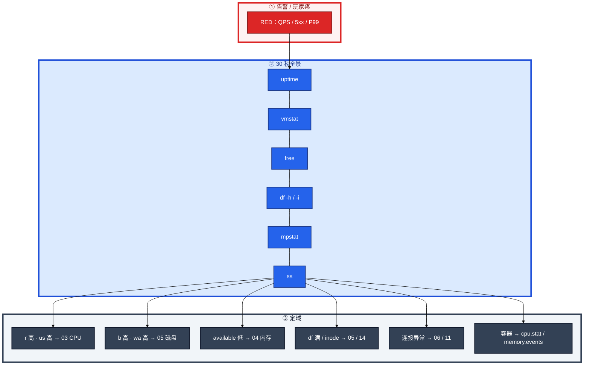
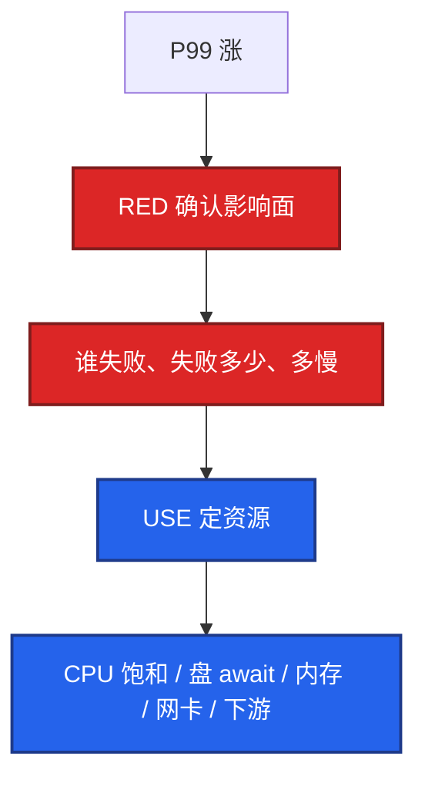
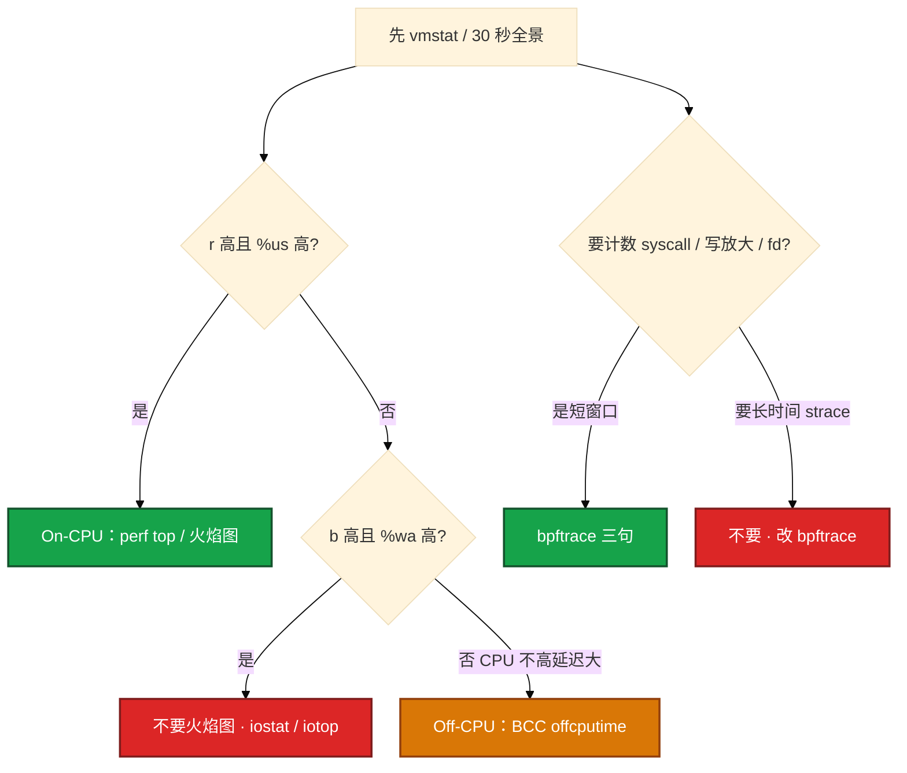
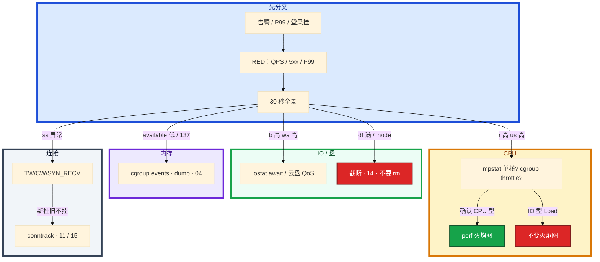

# 性能观测与排障


活动开始，登录 P99 告警。旁边有人已经在 top 里来回排序，另有人要对战斗服上 `perf record -a`。CPU 平均 40%，有人宣布「机器没问题」。

先别动手。这一章后半全是你会动手的：**30 秒定域、USE/RED 怎么分开问、perf 和 bpftrace 什么时候上、先止血再根因。** 前面的全景和两个框架，是为了让你动手时不选错工具。

**读完你能：** 开口 30 秒全景定域；用 USE 讲资源、用 RED 讲入口；CPU 链和 IO 链能分叉；知道何时火焰图、何时 bpftrace、何时根本不要图。

## 本章目录

缩进 = 上下级。3 下面才是 3.1。

想钉在**正文左边**跟着滚：菜单 **查看 → 打开视图 → 大纲**。Markdown 预览做不到独立左栏，目录只能写在文章开头。

- [1. 基本概念](#1-基本概念)
- [2. 架构图](#2-架构图)
- [3. 原理](#3-原理)
  - [3.1 USE](#31-use资源)
  - [3.2 RED](#32-red服务)
  - [3.3 四条资源链](#33-四条资源链)
  - [3.4 perf / bpftrace 何时用](#34-perf--bpftrace-何时用)
- [4. 安装部署](#4-安装部署)
- [5. 核心配置](#5-核心配置)
- [6. 常用命令](#6-常用命令)
- [7. 常用操作](#7-常用操作)
  - [7.1 30 秒全景](#71-30-秒全景)
  - [7.2 火焰图怎么出](#72-火焰图怎么出)
  - [7.3 现场 awk](#73-现场-awk)
  - [7.4 SOP](#74-先止血三条证据再根因)
- [8. 生产排障](#8-生产排障)
- [9. 必会 · 常考](#9-必会--常考)
- [合上书](#合上书问自己)

**本章不讲：** Load vs util、软中断、steal、perf 指令级细节 → [03 CPU与Load](../03-CPU与Load/)；OOM、cgroup memory → [04 内存与OOM](../04-内存与OOM/)；await、脏页 → [05 磁盘与IO](../05-磁盘与IO/)；TW/CW、fd、conntrack → [06 网络栈与Socket](../06-网络栈与Socket/)；curl 五段、抓包 → [11 网络排障与抓包](../11-网络排障与抓包/)；主机黄金指标、告警分级 → [21 监控与告警](../21-监控与告警/)；PromQL、kube-prometheus、SLO 面板 → [K8s 18](../../04-Kubernetes/18-监控可观测性/)；Cilium / 内核探针 → [K8s 23](../../04-Kubernetes/23-eBPF与Cilium/)。

---

## 1. 基本概念

性能排障是 **先定域、再下钻**。30 秒全景用来回答「进哪一章」，不是根因。没有这套就 top 乱翻，后面全是猜。

告警响了先问两句，不要混成一句「CPU 挺高的」：

| 问题 | 框架 | 对象 |
|------|------|------|
| 玩家疼不疼？谁失败、失败多少、多慢？ | **RED** | 网关 / 登录 / 接口 |
| 哪块资源炸了？ | **USE** | CPU / 盘 / 网卡 / 内存 |

不要把 Load 当利用率。Load 是饱和度（队列长度）。平均 CPU 40%、P99 从 50ms 到 800ms，平均 CPU 会骗人：单核热点、cgroup throttle、锁、下游 RT、丢包。throttle 是 CPU 配额饱和，宿主机利用率可以低。

现场 top 只代表现在。昨天凌晨的尖峰要 `sar` 或监控曲线，没有历史等于无法结案。没有当时的图，现在的 top 不能当证据。

> **记住**：30 秒全景用来定域，不是根因；RED 回答疼不疼，USE 回答哪块资源炸；没有当时的图，现在的 top 不能结案。

---

## 2. 架构图

先把定域图钉住。后面 USE/RED、命令、排障都对着这张图说话。



读法：Load 趋势 → `r/b/wa/st/cs` → available → 磁盘/inode → 是否单核/steal → 连接状态分布。

30 秒够你看完这些；不够你做火焰图。工具按阶段上场，不一次开齐：全景之后才 pidstat / iotop / perf。

---

## 3. 原理

原理只保留动手和面试会用到的：USE 三个数、RED 三个数、定域之后四条链、什么时候上 perf / bpftrace。

**本节 4 块：** 3.1 USE · 3.2 RED · 3.3 资源链 · 3.4 何时用 perf/bpftrace

### 3.1 USE：资源

USE（Brendan Gregg）看 **每一种资源** 的三个数。利用率高且饱和才是瓶颈；只有利用率高可能还能吃。

| 字母 | 含义 | 你在机器上对应什么 |
|------|------|-------------------|
| **U** Utilization | 忙碌的比例 | CPU `%us+%sy`；盘 `%util`；网卡带宽占比；内存 used |
| **S** Saturation | 排队 / 等待 | Load / run queue；盘 await、avgqu-sz；steal、cgroup throttle；换页 |
| **E** Errors | 出错次数 | 重传、OOM、磁盘 error、网卡 drop、cgroup oom_kill |

按资源拆开（值班能点名）：

| 资源 | U | S | E |
|------|---|---|---|
| CPU | `mpstat` %us/%sy | `vmstat` r、Load、steal、`cpu.stat` throttled | 少见；软锁 / MCE 另说 |
| 内存 | used / working_set | si/so 换页、available 逼近 0 | OOM、`memory.events` |
| 磁盘 | `%util` | await、avgqu-sz、`b`/`wa` | iostat 错误、云盘 QoS 打满 |
| 网卡 | 带宽 / pps | 队列溢出、丢包 | 重传、`ethtool -S` drop |
| 连接表 | conntrack count/max | 表接近满时新 SYN 排队/丢 | `table full, dropping packet` |

只有利用率高、没有队列，不一定是瓶颈。还能吃就先看错误数和 RED。不要把 Load 当 U——Load 是 S。

活动开始 P99 涨：常是登录 SQL 或 conntrack，不是「服务器 CPU 平均 40% 所以没问题」。单核、throttle、云盘 QoS 都要点名。

> **记住**：USE 要求利用率高 **且饱和** 才是瓶颈；Load 是队列，不是利用率；平均 CPU 40% 结不了案。

### 3.2 RED：服务

RED 看 **入口**，不是机器。游戏网关、登录、支付回调都用 RED。

| 字母 | 含义 | 游戏入口怎么看 |
|------|------|----------------|
| **R** Rate | QPS / 登录尝试 | 网关 access 里请求速率 |
| **E** Errors | 失败比例 | 5xx、499、业务失败码 |
| **D** Duration | 耗时 | P99 / P50，不要只看平均 |



两个框架不要混：

- 只有 USE 没有 RED → 空谈资源，不知道玩家疼不疼。
- 只有 RED 没有 USE → 知道疼，不知道打哪块硬件 / 依赖。

P99 涨但 CPU 利用率低、磁盘 await 高 → IO 饱和。throttle 是 CPU 配额饱和，宿主机利用率可以低（07）。云盘 QoS 打满时 iostat `%util` 可以看起来「没满」，await 已经几百毫秒（05）。

> **记住**：RED 回答疼不疼，USE 回答哪块资源炸；游戏网关用 RED，机器用 USE。

### 3.3 四条资源链

全景已经把你推进某一格，再下钻。

**CPU 高**  
先 vmstat 排除 IO 型 Load。`r` + `%us` 高：top → PID → `top -H` → perf / jstack。单核打满用 mpstat。throttle 读 cgroup。不要在 IO 型 Load 上做火焰图。

**内存 / OOM**  
available、dmesg OOM、cgroup events、RSS 斜线 vs 台阶。137 先 OOM 后谈 kill。泄漏重启止血并留 dump；打满则扩 / 限流。

**磁盘满 / IO**  
`df -h` / `-i`、iostat await、`lsof` deleted、D 的 wchan。截断日志不要 rm。inode 满见 14。

**Load 异常**  
`r` 高走 CPU 链；`b` + `wa` 走 IO 链；远程盘 iostat 可能干净。

**连接异常**

```bash
ss -ant | awk '{print $1}' | sort | uniq -c | sort -rn
```

TW → 短连接 / 池子；CW → 没 close；SYN_RECV → 攻击或 backlog；ESTAB 猛涨 → 泄漏或活动。

**进程消失**  
137 KILL、139 段错误、143 TERM。journal + dmesg。

pidstat `-w`/`-d` 找谁在切谁在 IO；iotop 确认写什么；perf 仅 CPU 型函数级。

> **记住**：CPU 链先排除 IO Load；OOM 先看 137/cgroup；盘先截断不要 rm；连接先看 ss 状态分布。

### 3.4 perf / bpftrace 何时用

大厅进程 `%us` 打满，你才需要函数级证据。工具选错，窗口就浪费掉。



| 工具 | 何时用 | 何时不用 |
|------|--------|----------|
| **perf top / 火焰图** | `r` 高、`%us` 高，要函数级热点 | IO 型 Load；`%us` 不高；还没跑 30 秒全景 |
| **Off-CPU（offcputime）** | CPU 不高但延迟大：等 IO / 锁 / 网络 | 已经确认是 CPU 忙 |
| **bpftrace** | 短窗口计数：谁在 write、谁在 openat、哪个 syscall 慢；替代长时间 strace | 写内核探针、改 Cilium；活动高峰对战斗服长时间跟踪 |
| **strace** | 单进程怀疑卡在某个 syscall，几秒即可 | 高峰长时间跟，会把进程拖死 |
| **perf record -a** | 不知道 PID、短窗口全机采样 | 开服高峰一直开：伤性能、文件巨大 |

读 On-CPU 图：

1. X 轴 = 函数在采样中出现的比例（越宽越热）；Y 轴 = 调用栈深度。颜色无含义。
2. 看 **宽而平** 的函数 → 热点。从上往下找平顶 → 真正耗时的叶子。
3. 顶层宽 = 自身耗时；底层宽但顶层细 = 被多处调用。

bpftrace 三句够应付「你们用过 eBPF 吗」。写探针、改内核不是本章范围。Cilium 网络见 K8s 23。

生产：短窗口、指定 PID、可随时 Ctrl-C。活动高峰不要对战斗服挂长时间跟踪。会 perf 就能把 CPU 型问题讲完；补三句 bpftrace 即可，不要把 Cilium 和主机排障混成一章。

> **记住**：火焰图只给 CPU 型；IO / 锁等待走 Off-CPU，或者根本不要图。bpftrace 是短窗口计数，不是长时间 strace。

---

## 4. 安装部署

定域靠的是机器上已有的命令和 1s 粒度监控，不是临时编译 BCC。

| 项 | 选 | 不选 |
|----|----|------|
| 历史 | node_exporter **1s** 粒度 + 面板；sar 作备用 | 只有现在的 top |
| 全景工具 | procps、sysstat（vmstat/mpstat/iostat/sar、pidstat） | 没有 sysstat 的精简镜像当生产 |
| 火焰图 | 分析机装 FlameGraph 脚本；生产只 `perf record` 短窗口 | 生产机出 SVG 开浏览器 |
| eBPF | 发行版 bcc / bpftrace 包；内核支持 BTF | 活动中现场编译内核 |
| 容器 | 宿主机用容器主 PID 采；或 privileged debug | 默认 Pod 里以为能看到宿主机 CPU |

```bash
yum install -y sysstat perf
# 分析机
# FlameGraph: https://github.com/brendangregg/FlameGraph
# bpftrace / bcc 按发行版装；没有就不要在高峰现编
```

托管 / 容器节点：宿主机利用率低也可能是 throttle，必须能读 `cpu.stat` / `memory.events`。验收：30 秒六条命令能跑；监控能拉出 **当时** 的 CPU / await / available / conntrack，不是现在的空闲 top。

---

## 5. 核心配置

生产必须有 1s 粒度监控（node_exporter）；sar 是备用。PromQL 怎么写在 K8s 18，本章只要求：没有当时的图，现在的 top 不能当证据。

| 项 | 生产怎么用 | 缺了会怎样 |
|----|------------|------------|
| 采样粒度 | 主机 **1s**；容器 cAdvisor 不要 30s 糊过去 | 尖峰被平均掉，P99 对不上 |
| 告警红线 | available、await、conntrack%、throttle | 只有 CPU 平均，平均 40% 结不了案 |
| sar 保留 | `/var/log/sa/` 按天 | 老板问昨天凌晨，现在 top 是空闲 |
| perf | 短窗口、`-p PID`；`-a` 只偶尔 | 高峰 `-a` 一直开 |
| bpftrace | 指定 pid / comm，Ctrl-C 能停 | 无过滤全机 trace |

开服 checklist（SOP 左移，不是出了事才学命令）：df / inode、conntrack 水位、证书有效期、DNS TTL、日志轮转。runbook 写成 30 秒全景 + 分域链接。

> **记住**：监控缺 working_set / conntrack / await，补监控比背更多命令值钱。

---

## 6. 常用命令

值班先跑这六条（定域）：

```bash
uptime
vmstat 1 5
free -h
df -h && df -i
mpstat -P ALL 1 2
ss -s
```

| 目的 | 命令 | 看什么 |
|------|------|--------|
| Load 趋势 | `uptime` | 1/5/15 是否在涨 |
| 队列 / IO | `vmstat 1 5` | r/b/wa/st/cs |
| 内存 | `free -h` | **available**，不是 free |
| 盘 / inode | `df -h && df -i` | 块满还是 inode 满 |
| 单核 / steal | `mpstat -P ALL 1 2` | 一核 100% 其他闲；云 steal |
| 连接分布 | `ss -s`；`ss -ant \| awk ...` | TW/CW/SYN_RECV/ESTAB |
| 谁在切 / IO | `pidstat -w 1`、`pidstat -d 1` | 全景之后 |
| 谁在写盘 | `iotop` | 确认文件 |
| On-CPU | `perf top -g -p PID` | `%us` 高才上 |
| 计数 | bpftrace 三句见 7.2 | 短窗口 |
| 昨天 | `sar -u -f /var/log/sa/sa$(date -d yesterday +%d)` | 当时 CPU；`-r` 内存、`-b` IO、`-n DEV` 网 |

容器节点再补：`cpu.stat` / `memory.events`。宿主机利用率低也可能是 throttle。

---

## 7. 常用操作

### 7.1 30 秒全景

开口先跑 6. 的六条，用来回答「进哪一章」。读法见架构图。没有这套开口就 top 乱翻。

历史：

```bash
sar -u -f /var/log/sa/sa$(date -d yesterday +%d)  # 昨天 CPU
sar -r    # 内存
sar -b    # IO
sar -n DEV
```

sar 也没有：先承认没有证据，补监控。不要用现在的 top 编故事。

### 7.2 火焰图怎么出

确认 `%us` 高、已经排除 IO Load 再采。

```bash
perf top -p PID                 # 实时热点
perf top -g -p PID              # 带调用栈
perf record -g -p PID sleep 30  # 采样 30 秒
perf report --stdio
perf stat -p PID sleep 10       # task-clock / cache-misses / branch-misses

perf record -g -p PID -o perf.data -- sleep 30
perf script -i perf.data | stackcollapse-perf.pl > out.folded
flamegraph.pl out.folded > flamegraph.svg
```

K8s / 容器：

```bash
PID=$(docker inspect --format '{{.State.Pid}}' container_id)
perf record -g -p $PID sleep 30
# 或 privileged Pod 里直接 perf（生产谨慎）
```

Off-CPU：

```bash
/usr/share/bcc/tools/offcputime -p PID 30 > out.txt
flamegraph.pl --color=io --title="Off-CPU" < out.txt > offcpu.svg
```

bpftrace（短窗口、指定 PID、Ctrl-C）：

```bash
# 谁在同步写（日志打满盘）
bpftrace -e 'tracepoint:syscalls:sys_enter_write /pid==PID/ { @[comm]=count(); }'
# 打开文件过多（fd 泄漏）
bpftrace -e 'tracepoint:syscalls:sys_enter_openat { @[comm]=count(); }'
# 哪个 syscall 最慢（替代长时间 strace）
bpftrace -e 'tracepoint:syscalls:sys_exit_* /pid==PID/ { @[probe]=hist(args->ret); }'
```

全系统 `perf record -g -a sleep 10`：`-a` = all CPUs。开服高峰会伤性能、文件也大。先缩到 PID。

### 7.3 现场 awk

网关被扫还是登录真失败，先两行 awk。Nginx 组合日志常见：`$1=IP $9=状态码`。格式不同先看一行再改字段号。复杂报表离线做。

```bash
# TOP IP
awk '{print $1}' access.log | sort | uniq -c | sort -rn | head

# 5xx 条数与占比
awk '{c++; if($9~/^5/) s++} END{print "5xx",s+0,"total",c, "pct", (c?100*s/c:0)}' access.log

# 状态码分布
awk '{print $9}' access.log | sort | uniq -c | sort -rn

# TCP 状态
ss -ant | awk '{print $1}' | sort | uniq -c | sort -rn
```

机器上最快的是管道。离线复杂统计再 Python。用来判断是否被扫、错误是否集中。one-liner 用于当下；长期用可观测性系统（21，K8s 18）。

> **记住**：现场 TOP IP / 5xx 占比两行 awk 够用；长期看面板，不要用 Python 在生产机上现写报表。

### 7.4 先止血，三条证据，再根因

登录挂了。先问谁、何时、是否发版/活动，再决定回滚还是扩容。不要一上来重启逻辑服——有踢人成本，现场也毁掉了。


1. 影响面：谁、何时、是否发版/活动
2. 止血：回滚、限流、扩容、摘故障机
3. 30 秒全景定域
4. 域内链条拿到数字（await、throttled、oom_score、五段）
5. 根因：变更、容量、代码、依赖
6. 治理：监控告警、限流、checklist，避免下次同样发现方式

停在「重启好了」不够。要有数字和预防。

证据链最低标准：同一时刻的 `vmstat` 片段、一张监控图、一条 error 日志。缺一就只是猜测。变更窗口（发布、扩容、TTL、安全组）必须写进时间线。

oncall 交接：已经止血的写「当前状态 + 未验证假设 + 下一步命令」。不要只写「重启好了」。

先重启什么时候可以：已有监控证据、止血窗口、能复现环境。不行：未留 dmesg / ss / 日志、未知是否泄漏、有状态服会丢内存态。游戏逻辑服重启要当变更。

有变更先怀疑变更，回滚是合法止血。平均 CPU 低不能结案。

OOM：确认 137 / cgroup events，泄漏重启止血并留 dump；打满则扩 / 限流。磁盘满：`df` 定位，**截断**日志或清 deleted fd，不要先 rm。根因是轮转 / inode。进程持有已删文件时 rm 不释放空间，见 14。

> **记住**：先止血，三条证据，再根因治理；停在「重启好了」不够。

---

## 8. 生产排障

和全库同一套三问：进程还在不在？玩家还疼不疼？哪块资源在饱和？



现场顺序：

```bash
uptime; vmstat 1 5; free -h; df -h && df -i; mpstat -P ALL 1 2; ss -s
# 有历史再 sar / 面板；不要对着现在的 top 讲昨天
```

| 现象 | 先做什么 | 不要做什么 |
|------|----------|------------|
| P99 涨、CPU 平均 40% | RED 影响面；mpstat / throttle / await | 「还有余量」结案 |
| Load 40，vmstat 还没跑 | 先 vmstat 分 r 还是 b | 直接 perf 出图 |
| `%us` 打满 | perf -p PID 短窗口 | `perf record -a` 一直开 |
| `%wa` 高 | iostat / iotop | On-CPU 火焰图 |
| 137 | events / dmesg，留 dump 再重启单实例 | 立刻重启全部 Pod |
| `/var` 100% | 截断 / lsof deleted | `rm -rf`、杀逻辑服 |
| 昨天凌晨尖峰 | sar / 当时监控 | 现在的 top |
| 网关 5xx | TOP IP / 5xx 占比 awk | 生产机现写 Python 报表 |
| 群里要 restart | 证据、窗口、有状态服成本 | 未留日志就重启战斗服 |

活动高峰正确处理：RED 确认登录失败率 → 30 秒定域 → 常是 SQL / 盘 await / conntrack，不是平均 CPU。先限流 / 扩 / 回滚，再函数级。

---

## 9. 必会 · 常考

白板和追问高频，能一口回：

| 说法 | 对错 | 口径 |
|------|:----:|------|
| 30 秒全景就是根因 | 错 | 只定域，进哪一章 |
| Load 高 = CPU 利用率高 | 错 | Load 是饱和 / 队列 |
| 平均 CPU 40% 所以没问题 | 错 | 单核、throttle、锁、下游、await |
| 只有利用率高就是瓶颈 | 错 | USE 还要饱和（队列） |
| 游戏入口只看机器 CPU | 错 | 入口用 RED |
| IO 型 Load 上 On-CPU 火焰图 | 错 | 走 iostat；或 Off-CPU |
| 还没定域就 perf | 错 | 先 30 秒 |
| `perf record -a` 生产一直开 | 错 | 短窗口，先缩到 PID |
| bpftrace 等于改内核 / Cilium | 错 | 主机排障三句短窗口即可 |
| 重启好了算结案 | 错 | 要数字、根因、预防 |
| 现在的 top 能解释昨天尖峰 | 错 | sar / 当时的图 |
| 磁盘满先 rm -rf 日志 | 错 | 截断；deleted fd |
| 逻辑服随便重启止血 | 错 | 当变更，有踢人成本 |

数字：全景 **6** 条命令；火焰图采样常见 **30s**；监控粒度 **1s**；证据链 **3** 条（vmstat 片段、监控图、error 日志）。

易混：U vs S（Load 是 S）；RED vs USE；On-CPU vs Off-CPU；perf vs bpftrace vs strace；定域 vs 根因；137 vs 自己 exit。

---

## 合上书，问自己

1. 30 秒六条命令是哪六条？各看什么？容器还补什么？
2. USE 三个字母？Load 为什么不是利用率？平均 CPU 40%、P99 到 800ms 还查什么？
3. RED 三个字母？和 USE 怎么配一次登录故障？
4. 什么时候上 perf 火焰图？什么时候 bpftrace？什么时候根本不要图？
5. 现场 TOP IP / 5xx 两行 awk？昨天尖峰现在 top 空闲怎么办？
6. 先重启何时可以？证据链最低标准？停在「重启好了」差什么？

六题都能口述，这一章就过了。下一章把 Systemd 剖开：unit、Restart 死亡螺旋、LimitNOFILE、journal 和 timer。
