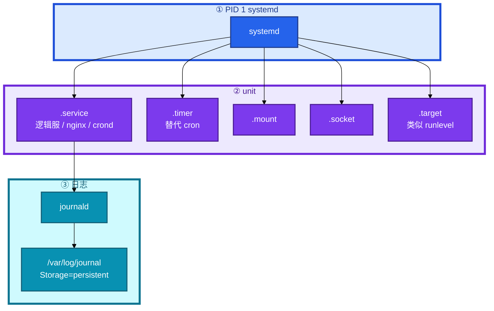
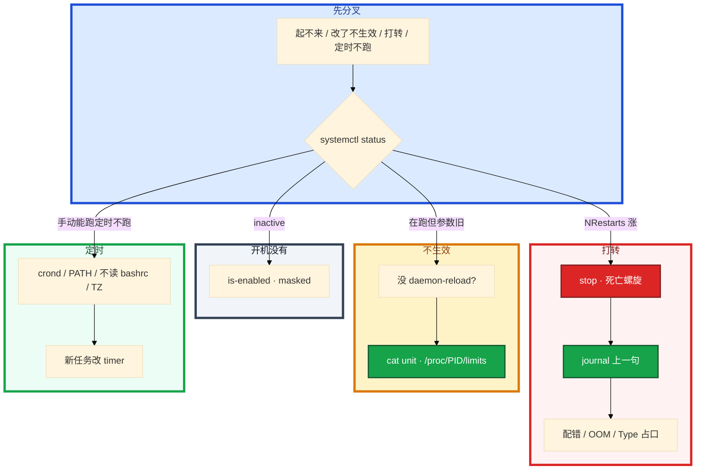

# Systemd 与服务管理


逻辑服改了 `ExecStart` 的配置路径，`systemctl restart` 了，进程还在用旧参数。另一台配置写错，`Restart=always` 每秒拉起，CPU 和 journal 一起爆。有人把 `RestartSec` 改成 0「好让它快点起来」——螺旋转得更快，NRestarts 已经 800 了还在 restart。

**本章主线（排障就按这三步想）：**

1. **看状态**：`systemctl status` → 退出码分 9/137（dmesg）还是 1（journal ERROR）。
2. **改生效**：改 unit → `daemon-reload` → restart → `/proc/PID/limits` 验收。
3. **防螺旋**：崩溃打转先 `stop`；on-failure + RestartSec=5 + StartLimit，不要 always + 0。

**读完你能：** 画出 PID 1 管什么；Type / After / Restart 能一口分清；改 unit 会按顺序落地；崩溃打转先 stop 再 journal；LimitNOFILE 能对到 `/proc/PID/limits`。

## 本章目录

- [1. 基本概念](#1-基本概念)
- [2. 架构图](#2-架构图)
- [3. 原理](#3-原理)
- [4. 落地](#4-落地)
- [5. 核心配置](#5-核心配置)
- [6. 命令与操作](#6-命令与操作)
- [7. 生产排障](#7-生产排障)
- [8. 必会 · 常考](#8-必会--常考)
- [合上书](#合上书问自己)

**本章不讲：** kill / 优雅退出 / 僵尸 → [02 进程与信号](../02-进程与信号/)；日志轮转、journal 打满盘 → [22 日志运维](../22-日志运维/)；时区、NTP、「2 点没跑」 → [19 NTP与时间同步](../19-NTP与时间同步/)；fd 上限与 sysctl → [18 内核参数与sysctl](../18-内核参数与sysctl/)；Nginx reload 细节 → [23 Nginx](../23-Nginx/)。

---

## 1. 基本概念

Systemd 是现代 Linux 的 init（**PID 1**）。它不管业务怎么算，管的是：**用声明式 unit 把进程拉起来、挂了按策略重启、日志进 journald、定时用 timer。** 取代 SysV 的 `/etc/init.d/` 脚本。

**值班里怎么认现象**（先听告警/同事怎么说，再对表）：

| 现场说的 | 技术含义 | 你的第一刀 |
|----------|----------|------------|
| 「改了配置不生效」 | 可能没 daemon-reload | `systemctl cat` + `/proc/PID/cmdline` |
| 「CPU 100%、journal 爆」 | Restart 死亡螺旋 | `systemctl stop`，看 NRestarts |
| 「Connection refused 但进程在」 | Type=forking 盯错 PID | `ss -lntp` + Type |
| 「reboot 后服务没了」 | 可能只 start 没 enable | `is-enabled` |
| 「Too many open files」 | LimitNOFILE 或泄漏 | `/proc/PID/limits` |

生产里游戏逻辑服、nginx、备份脚本，不该再靠 `nohup ./start.sh &`。脚本执行结果依赖环境和顺序，难预测。unit 声明「要什么状态」，systemd 决定怎么达到。

| 相对 SysV 的好处 | 说明 |
|------------------|------|
| 声明式 unit | 不是脚本，结果可预测 |
| 按依赖并行启动 | 不串行 |
| 统一日志、统一 status | journal + systemctl |
| 服务监控和自动重启 | Restart 策略 |
| 管理范围广 | 服务 / 挂载 / 网络 / 定时 / 套接字 |

常见 unit：`.service`、`.timer`、`.mount`、`.socket`、`.target`（一组 unit，类似 runlevel）。

**打个比方**：Systemd 像物业管家——你交一份「服务说明书」（unit），管家负责按说明书拉闸、断电重启、收水电单（journal）、定时巡检（timer）。nohup + start.sh 像自己拉电线，改一台漏一台，断电后没人记得开。

> **记住**：Systemd 管的是拉起、重启、日志、定时；业务怎么算是你的进程的事。生产不要用 nohup + start.sh 当 pid 1。

**面试怎么说**：「改 unit 必须 daemon-reload 再 restart；Restart 用 on-failure + RestartSec=5；LimitNOFILE 验收看 /proc/PID/limits，limits.conf 管不了 systemd 服务。」

---

## 2. 架构图

后面 Type、Restart、journal 都对着这张图。



**读图三句话：**

1. **PID 1 管 unit 生命周期**——拉服务、收 journal、挂 cgroup。
2. **落地路径**：`/etc/systemd/system/` 是你的 unit；drop-in 用 `systemctl edit`，不要改厂商原文件。
3. **journal 默认可能只存内存**——生产设 `Storage=persistent`。

| 路径 | 谁写 |
|------|------|
| `/usr/lib/systemd/system/` | 厂商包 |
| `/etc/systemd/system/` | **你的** unit |
| `/etc/systemd/system/foo.service.d/*.conf` | drop-in（`systemctl edit`） |
| `/etc/systemd/journald.conf` | `Storage=persistent` |

---

## 3. 原理

### 3.1 Type：盯对 PID

**一句话：** Type 选错会盯错 PID、占口；simple 最常用；真会 fork 才用 forking；要真就绪用 notify。

**打个比方**：Type 像告诉管家「主人在哪」——simple 说「门口站着的那个就是主人」；forking 说「主人会派个替身站门口然后自己进屋，替身走了才算就绪」；notify 说「主人自己按门铃说『我好了』」。管家盯错人，以为服务死了会去重启，真主人还在屋里占着端口。

**现场走一遍**（Connection refused，status 显示 active 但新连接失败）：

1. 先看状态和端口：

```bash
systemctl status nginx
ss -lntp | grep :80
systemctl cat nginx | grep -E '^Type=|^ExecStart='
```

2. 屏幕出现：

```text
● nginx.service - nginx
   Active: active (running) since ...
   Main PID: 12345 (nginx)
   ...

# ss -lntp
LISTEN 0 128 0.0.0.0:80 0.0.0.0:* users:(("nginx",pid=12340,fd=6))

# systemctl cat
Type=simple
ExecStart=/usr/sbin/nginx
```

3. **读数**：Main PID 12345，但监听 80 的是 PID 12340 → **Type 配错**。老 nginx fork 后父进程退出，simple 把已退出的父进程当 MainPID，以为服务死了会 Restart，或留下 Address already in use。

4. 修法：`Type=forking` + `PIDFile=/var/run/nginx.pid`（若 nginx 支持），或换新版 nginx 用 notify。

5. 交叉 [06 网络栈](../06-网络栈与Socket/) 的 Connection refused——先 `ss -lntp` 找到旧 PID，确认 Type，再决定杀不杀。

**输出解读**：

| Type | 含义 | 什么时候 |
|------|------|----------|
| simple | ExecStart 那个进程就是主进程，不 fork | **最常用** |
| forking | ExecStart 会 fork 子进程，父进程退出表示就绪 | 老式守护进程（老 nginx） |
| notify | 服务自己 `sd_notify` 告诉 systemd「我好了」 | 要准确就绪 |
| oneshot | 跑完就结束 | 初始化脚本 |

**面试怎么说**：「forking 配成 simple 会盯错 PID，父进程退出后 systemd 以为服务死了会 Restart，留下 Address already in use；先 ss 找真 PID 再改 Type。」

> **记住**：simple 进程起来 ≠ 业务就绪——可能还在连库；要准确就绪用 notify。

### 3.2 After / Requires / Wants：排序和依赖不是一回事

**一句话：** After 只排序，Requires / Wants 才是依赖；要「先有网再起逻辑服」用 After + Wants/Requires。

**打个比方**：After 像「A 在 B 后面排队」，不保证 B 一定来。Requires 像「B 不来 A 也不干」；Wants 像「有 B 更好，B 没来 A 也先干」。Requisite 像「B 必须已经在，但我不负责叫 B 来」。

**现场走一遍**（逻辑服启动报 connect mysql refused，然后一起挂）：

1. 看 unit 依赖：

```bash
systemctl cat game-server | grep -E '^After=|^Requires=|^Wants='
systemctl status mysqld
```

2. 屏幕出现：

```text
After=network-online.target mysqld.service
Requires=mysqld.service
Wants=redis.service

● mysqld.service
   Active: failed (Result: exit-code) since ...
```

3. **读数**：`Requires=mysqld` → 数据库一挂，游戏服也被 systemd 拉停。**游戏服通常 Wants 缓存、自己重连**；数据库挂了要不要跟着退出，按能不能无库运行来选。

4. `network.target` 往往只表示「网络服务已启动」，不等于 IP 已经配好。要等地址就绪常用 `network-online.target` + `Wants=`。

5. 推荐写法：

```ini
[Unit]
After=network-online.target
Wants=network-online.target
Wants=redis.service
# Requires=mariadb.service   # 强依赖会放大故障面，按能否无库运行来选
```

**输出解读**：

| 指令 | 做什么 | 不做什么 |
|------|--------|----------|
| After= | 只控制顺序 | 不拉依赖、不跟着挂 |
| Requires= | 强依赖：B 挂 A 也挂，会主动拉 B | 不等于「等 B 真就绪」 |
| Wants= | 弱依赖：想要 B，B 挂了 A 还在 | 不强制 |
| Requisite= | 强依赖但不主动启动 B（B 必须已经在跑） | 不会拉起 B |

**面试怎么说**：「After 只排序不等于依赖已就绪；要 network-online 不是 network.target；缓存通常 Wants + 自重连，不要无脑 Requires。」

> **别混**：After= 等于依赖已就绪 — 错；只 After 不等于 B 已经在跑。

### 3.3 Restart=always 死亡螺旋

**一句话：** Restart=always 会把配错打成死亡螺旋；先 stop，不要把 RestartSec 拧成 0。

**打个比方**：Restart=always 像「不管成功失败都立刻再试」——配置写错时进程秒崩秒起，像自动门坏了不停开关，CPU 和 journal 一起爆。RestartSec=0 是「开关更快」，螺旋转得更快。

**现场走一遍**（CPU 100%，journal 磁盘疯涨）：

1. 先看状态：

```bash
systemctl status game-server
journalctl -u game-server -n 20 --no-pager
```

2. 屏幕出现：

```text
● game-server.service - Game Server
   Active: activating (auto-restart) since ...
   Process: 28451 ExecStart=... (code=exited, status=1/FAILURE)
   ...
   NRestarts: 847

game-server[28451]: ERROR: config file not found: /etc/game/wrong.conf
game-server.service: Main process exited, code=exited, status=1/FAILURE
game-server.service: Scheduled restart job, restart counter is at 847.
```

3. **读数**：status=1/FAILURE 是应用自己 exit，不是 9/KILL；NRestarts 847 → **死亡螺旋**。配置路径写错 + Restart=always 或 RestartSec=0。

4. **止血**：`systemctl stop game-server`，不要 restart，不要改 RestartSec=0「加快拉起」。

5. 看 journal 上一句 ERROR → 修配置 → `daemon-reload` → `start`。生产默认 **on-failure + RestartSec=5 + StartLimit**。

**输出解读**：

| Restart= | 何时拉起 | 生产 |
|----------|----------|------|
| no | 不自动拉 | 一次性任务 |
| on-success | 只有正常退出才拉 | 几乎不用在逻辑服 |
| **on-failure** | 异常退出（非 0、信号、超时）才拉 | **逻辑服默认** |
| on-abnormal | 信号 / 超时，不含 exit 1 | 比 on-failure 窄 |
| on-watchdog | watchdog 超时 | 要应用喂狗 |
| **always** | 正常退出也拉 | 配错 / ExecStart 写错会空转 |

闸门：RestartSec=5；StartLimitBurst=5；StartLimitIntervalSec=60。打到上限进入 **failed**，不再拉。`systemctl reset-failed` 清计数前先修根因。

**面试怎么说**：「打转先 stop 看 journal 上一句；Restart 用 on-failure 不是 always；RestartSec=0 会让螺旋更快；StartLimit 是闸门。」

> **记住**：status=9/KILL 去 dmesg（OOM）；status=1 才是 journal ERROR。

### 3.4 LimitNOFILE：limits.conf 管不了 systemd 服务

**一句话：** limits.conf 管不了 systemd 服务；验收看 `/proc/PID/limits`；不要用 infinity 幻想无限，游戏服写死数字。

**打个比方**：fd 上限像每人能借几本书——整机 fs.file-max 是图书馆总容量，LimitNOFILE 是借书证额度，limits.conf 是/login shell 的额度（systemd 服务不走/login）。改 unit 不 daemon-reload 就像改了借书证规则但柜台还按旧规则办。

**现场走一遍**（Too many open files，已改 unit 仍报错）：

1. 检查是否 reload + 验收：

```bash
grep LimitNOFILE /etc/systemd/system/game-server.service
systemctl daemon-reload
systemctl restart game-server
cat /proc/$(systemctl show -p MainPID --value game-server)/limits | grep 'open files'
```

2. 屏幕出现：

```text
# unit 里写了
LimitNOFILE=1048576

# /proc/PID/limits
Max open files            65536                65536                files
```

3. **读数**：unit 写 1048576，进程还是 65536 → 可能只 restart 没 daemon-reload；或写了 `LimitNOFILE=infinity` 被 systemd 落成 65536。

4. 正确顺序：改 unit → `daemon-reload` → restart → `/proc/PID/limits` 验收。

5. 若 limits 已对仍报错 → 应用内部 setrlimit 压低，或 fd 泄漏（06）。

**输出解读**——多层上限，听最窄的那个：

| 层 | 看哪里 | 备注 |
|----|--------|------|
| 整机 | `fs.file-max` | 所有进程 fd 总和 |
| 单进程硬顶 | `fs.nr_open` | LimitNOFILE 不能超过它 |
| unit | `LimitNOFILE=` | **软、硬一起设**；只写一个数 = 软=硬 |
| 用户 | `/etc/security/limits.conf` | **对 systemd 服务无效**；那是 pam/login |
| 进程 | `cat /proc/PID/limits` | **唯一验收** |

```ini
[Service]
LimitNOFILE=1048576
LimitNPROC=65535
```

**面试怎么说**：「limits.conf 对 systemd 服务无效；改 LimitNOFILE 必须 daemon-reload 再 restart，验收 /proc/PID/limits；infinity 可能落成 65536，游戏服显式写 1048576。」

> **记住**：只 restart 不 daemon-reload，内存里还是旧 unit，limits 不变。

---

## 4. 落地

unit 写在 `/etc/systemd/system/`。开机自启是 `enable`，不是 `start`。

```ini
# /etc/systemd/system/game-server.service
[Unit]
Description=Game Server
After=network-online.target
Wants=network-online.target
Wants=redis.service

[Service]
Type=simple
ExecStart=/opt/game/bin/server --config=/etc/game.conf
ExecStop=/opt/game/bin/server-stop
Restart=on-failure
RestartSec=5
StartLimitBurst=5
StartLimitIntervalSec=60
User=game
WorkingDirectory=/opt/game
LimitNOFILE=1048576
Environment=NODE_ENV=production

[Install]
WantedBy=multi-user.target
```

落地顺序：

1. 写 unit（或 `systemctl edit --full`）。
2. `systemctl daemon-reload`
3. `systemctl enable --now game-server`
4. `systemctl status` + `journalctl -u game-server -n 50`
5. `cat /proc/PID/limits` 核对 NOFILE
6. reboot 演练一次（enable 才经得住断电）

厂商包用 drop-in，不改原文件。`mask` 把 unit 指到 `/dev/null`，start / enable 都无效。排障看到 masked 先问是不是有人故意禁的。

验收：`is-enabled` 为 enabled；reboot 后进程在；limits 对得上。只 start 验证了「现在能跑」，第二天机房断电，服务没起来——发版窗口常见坑。

---

## 5. 核心配置

改 unit 后必须 daemon-reload 再 restart。

| 参数 | 生产怎么用 | 改错会怎样 |
|------|------------|------------|
| Type= | simple；真 fork 才 forking | 盯错 PID、占口、refused |
| Restart= | **on-failure** | always → 死亡螺旋 |
| RestartSec= | **5s** 量级 | 0 → 螺旋更快 |
| StartLimitBurst / Interval | 开着当闸门 | 关掉 = 无限空转 |
| LimitNOFILE= | 显式数字，如 **1048576** | infinity 可能只是 65536 |
| User= | 非 root | 被打穿就是 root |
| After= / Wants= | network-online；缓存 Wants | 只 After 不等于依赖已就绪 |
| Environment= / WorkingDirectory= | 写进 unit | 相对路径找不到；当 login shell |
| StandardOutput= | 默认进 journal；不要丢掉 | journal 空、以为没起来 |
| Storage= | journald **persistent** | reboot 后启动前日志没了 |

journald 持久化：

```ini
# /etc/systemd/journald.conf
[Journal]
Storage=persistent
SystemMaxUse=2G
SystemMaxFileSize=200M
```

`reload` 是让进程重载配置（进程要支持），不是 daemon-reload。Nginx 的 reload 细节在 23。ExecStop 走优雅退出（02），不要只靠 SIGKILL。

> **记住**：改 unit 必须 daemon-reload 再 restart；enable 才是开机自启；reload 不是 daemon-reload。

---

## 6. 命令与操作

### 6.1 命令速查

```bash
systemctl start|stop|restart|reload game-server
systemctl status game-server
systemctl enable|disable game-server
systemctl is-active game-server
systemctl is-enabled game-server
systemctl daemon-reload
systemctl list-units --type=service
systemctl list-units --failed
systemctl edit game-server
systemctl cat game-server
systemctl reset-failed game-server
systemctl list-timers
systemctl mask|unmask game-server
```

journal：

```bash
journalctl -u game-server
journalctl -u game-server -f
journalctl -u game-server --since today
journalctl -u game-server -n 100
journalctl -u game-server -b -1
journalctl -p err
journalctl --disk-usage
journalctl --vacuum-size=500M
journalctl --vacuum-time=7d
```

典型 `status` 输出（被系统杀）：

```text
● game-server.service - Game Server
   Active: failed (Result: signal) since ...
   Main PID: 28451 (code=killed, status=9/KILL)
   ...
```

典型 journal（应用自己错）：

```text
game-server[28451]: ERROR: connect mysql: connection refused
game-server.service: Main process exited, code=exited, status=1/FAILURE
```

| 目的 | 命令 | 看什么 | 正常/异常 |
|------|------|--------|-----------|
| 状态 | `systemctl status` | Active、Main PID、NRestarts | activating + NRestarts 涨 → 螺旋 |
| 日志 | `journalctl -u -n 100` | 上一句 ERROR | status=1 → 应用错 |
| 退出码 | status 里 code= | 9/KILL → dmesg；1 → journal | 9 先查 OOM |
| 合并 unit | `systemctl cat` | drop-in 是否生效 | 和文件不一致 → 没 reload |
| 失败列表 | `list-units --failed` | 哪些 unit 挂了 | StartLimit 打到 failed |

值班先跑：`status` → `journalctl -u -n 100` → `list-units --failed`。

### 6.2 改文件生效


只 daemon-reload 不 restart：服务还在用旧配置跑。只 restart 不 daemon-reload：systemd 还按内存里的旧文件来。顺序：改文件 → daemon-reload → restart。

### 6.3 journal 与 Timer

逻辑服崩溃打转。先 `systemctl status`，不要先翻应用日志目录。生产设 `Storage=persistent`，否则 reboot 后查不到启动前的日志。journal 把盘打满走 22 的轮转 / vacuum。

新任务优先 systemd timer：

```ini
# game-backup.service — Type=oneshot
# game-backup.timer
[Timer]
OnCalendar=*-*-* 02:00:00
Persistent=true
AccuracySec=1min
```

`Persistent=true`：错过的触发开机后补执行。cron 默认不补。

### 6.4 crontab 排障

备份脚本手动能跑，定时 2 点不跑。cron 环境几乎是空的：PATH 短、**不读 bashrc**。

| 坑 | 表现 | 查 |
|----|------|----|
| cron 服务停了 | 所有定时任务不跑 | `systemctl status crond` |
| PATH 极短 | 手动能跑、cron 报 command not found | crontab 第一行写 PATH |
| 环境变量没有 | 依赖 `.bashrc` 的任务失败 | 变量写 crontab 或脚本里 |
| 没有可执行位 / CRLF | bad interpreter | `chmod +x`，`file` 看是否 DOS |
| 输出把盘打满 | cron 默认邮件或重定向 | `>>/var/log/x.log 2>&1` |
| 时间 / 时区 | 「2 点没跑」 | 交叉 19 NTP / TZ |

```cron
PATH=/usr/local/sbin:/usr/local/bin:/usr/sbin:/usr/bin:/sbin:/bin
0 2 * * * /opt/scripts/backup.sh >> /var/log/backup.log 2>&1
```

> **记住**：新任务用 timer；crontab 排障先查服务、绝对路径、不读 bashrc。

---

## 7. 生产排障

三问：进程被 systemd 拉着吗？是 failed 打转还是根本没 enable？journal 上一句是什么？



| 现象 | 先做什么 | 不要做什么 |
|------|----------|------------|
| NRestarts 涨、CPU 满 | `systemctl stop`，看 journal | RestartSec=0、改 always「加快拉起」 |
| 改 LimitNOFILE restart 后仍旧 | daemon-reload；`/proc/PID/limits` | 改 limits.conf 以为能管服务 |
| Address already in use | `ss -lntp`，查 Type=forking | 盲 restart 再拉一份 |
| reboot 后没了 | `is-enabled`；是否只 start 没 enable | 再 start 一次当修复 |
| journal reboot 后空 | Storage=persistent | 宣布没日志没法查 |
| 定时不跑 | crond、绝对路径、PATH、TZ | 先改业务脚本 |
| Requires mariadb，库一挂游戏也挂 | 改 Wants + 自重连 | 无脑强依赖 |
| masked | 问谁禁的 | 直接 unmask 安全服务 |

游戏逻辑服被 systemd 拉起后崩溃打转：先 journal 看是配置错误还是 OOM（04）。forking 占口导致新实例 Connection refused，先 `ss -lntp` 找旧 PID。

---

## 8. 必会 · 常考

| 说法 | 对错 | 口径 |
|------|:----:|------|
| nohup start.sh 当生产 pid 1 | 错 | 声明式 unit |
| 只 restart 不 daemon-reload | 错 | 内存里还是旧文件 |
| daemon-reload 会重启进程 | 错 | 只重新读定义 |
| After= 等于依赖已就绪 | 错 | 只排序 |
| Requires 缓存，缓存一挂游戏也挂 | 看场景 | 通常 Wants + 自重连 |
| Restart=always 更稳 | 错 | 配错变死亡螺旋 |
| RestartSec=0 好让它快点起来 | 错 | 螺旋更快 |
| Type=simple 配老 nginx | 错 | 盯错 PID、占口 |
| simple 进程起来 = 业务就绪 | 错 | 可能还在连库；要 notify |
| enable 就是 start | 错 | enable 管开机 |
| limits.conf 能管 systemd 服务 | 错 | 看 LimitNOFILE 和 /proc/PID/limits |
| LimitNOFILE=infinity 一定无限 | 错 | 部分版本落成 65536 |
| cron 手动能跑所以环境一样 | 错 | 不读 bashrc，PATH 极短 |
| 新任务继续堆 crontab | 错 | timer：journal + Persistent |

数字：RestartSec 常见 **5s**；LimitNOFILE 游戏服显式 **1048576**；StartLimitBurst 常见 **5**；journal vacuum 按盘留 **7d** 或 500M。

易混：reload vs daemon-reload；start vs enable；simple vs forking vs notify；After vs Requires vs Wants；on-failure vs always；limits.conf vs LimitNOFILE；cron vs timer。

---

## 合上书，问自己

1. Systemd 相对 SysV 好在哪？unit 放哪、drop-in 怎么写？
2. Type 三种怎么选？forking 配成 simple 现场长什么样？
3. After / Requires / Wants 怎么配「先有网再起逻辑服」？
4. Restart=always 死亡螺旋怎么停？闸门参数是哪几个？
5. LimitNOFILE 改了不生效查哪？infinity 有什么坑？
6. 改 unit 的三步？crontab 手动能跑定时不跑先查什么？enable 和 start？

六题都能口述，这一章就过了。下一章把文件系统剖开：inode 满、ext4/xfs、删了空间不释放 → [14 文件系统与inode](../14-文件系统与inode/)。
