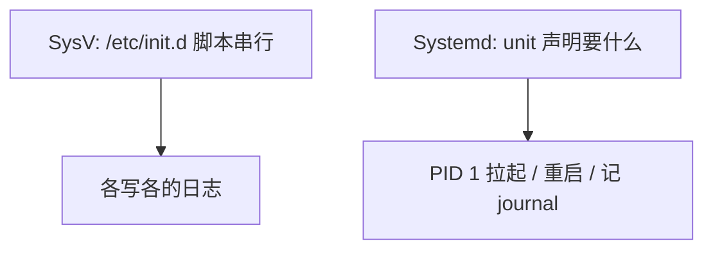
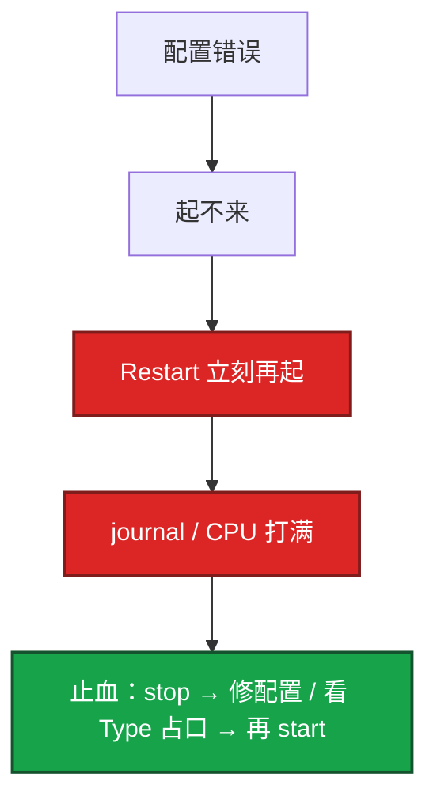

# 13｜Systemd 与服务管理 · 练习题

先对照 [知识点](知识点.md) **本章主线** 自己口述，再对答案。关键字（Type、daemon-reload、Restart 螺旋、LimitNOFILE、journal）要能写 unit。每题标了覆盖范围：

| 标记 | 含义 |
|------|------|
| **核心** | 不懂整章就没建立起来 |
| **必会** | 值班和面试都要能讲 |
| **常用** | 线上会反复碰到 |
| **常考** | 白板和追问的高频口径 |

## 本题目录

- [Q1 Systemd vs SysV](#q1)
- [Q2 改了不生效](#q2)
- [Q3 Type](#q3)
- [Q4 Restart 死亡螺旋](#q4)
- [Q5 LimitNOFILE](#q5)
- [Q6 journalctl](#q6)
- [Q7 crontab / timer](#q7)
- [Q8 After / Requires](#q8)
- [Q9 enable vs start](#q9)
- [Q10 游戏服最低配 unit](#q10)
- [合上书](#合上书)

---

## Q1

**★★★★☆｜Systemd 和 SysV init 差在哪？为什么生产用 unit 而不是 start.sh？**

**覆盖**：核心 · 必会 · 常考

**对应**：知识点 §1

### 场景

老机房还有 `/etc/init.d/game`。有人觉得「脚本也能 start/stop，何必 systemd」。

### 完整解答

**一句话**：Systemd 用声明式 unit 并行启动、统一 journal 和自动重启，比 SysV 脚本可预测。

Systemd 用声明式 unit，按依赖并行启动，统一 journal 和 status，能监控自动重启，还管挂载 / 网络 / 定时 / 套接字。SysV 是一堆脚本，结果依赖环境和顺序。



脚本难预测、难并行、难分析依赖。unit 声明状态，systemd 决定怎么达到。生产不要用 nohup + start.sh 当 pid 1。

### 再追问

- 声明式 unit 比脚本好在哪？——结果可预测、可并行、可画依赖。start/stop/status/enable 一套命令，有统一日志。

---

## Q2

**★★★★★｜改了一个 service 文件为什么不生效？**

**覆盖**：核心 · 必会 · 常用

**对应**：知识点 §6.2

### 场景

把 `LimitNOFILE` 改成 1048576。`systemctl restart` 之后 `cat /proc/PID/limits` 还是旧值。

### 完整解答

**一句话**：改 unit 必须 daemon-reload 再 restart，只改文件不会自动加载到内存。

unit 在内存里。改磁盘文件不会自动加载。

```
改文件 → daemon-reload（读定义，不重启进程）→ restart（用新定义跑）
```

只 reload 不 restart：进程还是旧的。只 restart 不 daemon-reload：systemd 还按旧文件来。覆盖用 `systemctl edit` 写 drop-in，不要改厂商原文件。`systemctl cat` 看合并结果。

### 再追问

- daemon-reload 和 restart 有什么区别？——daemon-reload 重新读取 unit 定义，不动正在跑的进程。restart 才用新配置拉进程。两个都要做。`reload`（发给进程的重载）又是第三件事，进程要支持才有用。

---

## Q3

**★★★★★｜Type=simple、forking、notify 怎么选？选错会怎样？**

**覆盖**：核心 · 必会 · 常考

**对应**：知识点 §3.1

### 场景

老游戏守护进程会 fork。unit 写成 Type=simple。systemd 不停重启，端口 Address already in use。

### 完整解答

**一句话**：Type=forking 盯 PIDFile，配成 simple 会盯错 PID 导致 Address already in use。

| Type | 盯谁 |
|------|------|
| simple | ExecStart 就是主进程（最常用） |
| forking | 父进程退出、子进程才是服务 |
| notify | 服务 sd_notify「真就绪了」 |
| oneshot | 跑完就结束 |

simple 认为进程起来就算就绪，可能还在连库、预热，这时进流量会出错。notify 更准，应用要主动调 sd_notify。

forking 配成 simple：盯错 PID，父进程一退 systemd 以为死了，Restart 把真服务杀掉，或旧进程占口。Connection refused 交叉 11：先 `ss -lntp`。

### 再追问

- notify 比 simple 好在哪？——就绪更准确，依赖启动和健康检查可靠。代价是应用要调 sd_notify；不调就回退成「进程在就算好」。

---

## Q4

**★★★★★｜Restart=always 把错误配置打成死亡螺旋，怎么处理？**

**覆盖**：核心 · 必会 · 常考

**对应**：知识点 §3.3

### 场景

配置文件写错。systemd 每秒拉起逻辑服，CPU 和 journal 一起爆。有人把 RestartSec 改成 0「好让它快点起来」。

### 完整解答

**一句话**：Restart=always+RestartSec=0 会把错误配置打成死亡螺旋，先 stop 再修根因。

先停死亡螺旋：`systemctl stop`，看 journal 根因（配置、OOM、端口占用）。生产用 `on-failure` + 合理 `RestartSec`（例如 5s），不要 always + 0 秒。



闸门：`StartLimitBurst` + `StartLimitIntervalSec`，打满进入 failed。`reset-failed` 前先修根因。眼睛看 `NRestarts` 在涨。

on-failure：异常退出才拉。always：正常退出也拉，配置错误、ExecStart 写错会空转。逻辑服误 stop 被 always 拉回来，有时是坑有时是特性，要明确。

### 再追问

- RestartSec=0 呢？——螺旋更快。不要当修复。
- 已经 failed 不再拉，是修好了吗？——否。闸门生效。看 journal，修完再 start。

---

## Q5

**★★★★★｜LimitNOFILE 改了为什么 /proc/PID/limits 还是 1024？infinity 安全吗？**

**覆盖**：必会 · 常用 · 常考

**对应**：知识点 §3.4

### 场景

游戏服 `Too many open files`。有人改了 `/etc/security/limits.conf`，有人在 unit 写了 `LimitNOFILE=infinity`。

### 完整解答

**一句话**：LimitNOFILE 必须写在 unit 里并 daemon-reload+restart，limits.conf 对 systemd 服务无效。

多层上限，验收只看 `cat /proc/PID/limits`。

1. `limits.conf` **对 systemd 服务无效**（那是 pam/login）。
2. 必须 unit 里 `LimitNOFILE=`，然后 **daemon-reload + restart**。
3. `infinity` 在部分 systemd 版本落成 **65536**，不是无限。游戏服 **显式写 1048576**。
4. 不能超过 `fs.nr_open`；整机还有 `fs.file-max`（18）。
5. 只加上限不查泄漏会再满（06）。

容器 runtime / cgroup nofile 可能更窄。

### 再追问

- 65535 和 65536 差在哪？——不要迷信少 1。以 limits 文件为准。
- User=root 能回避 fd 问题吗？——不能。User 非 root 是安全，和 NOFILE 是两件事。

---

## Q6

**★★★★☆｜journalctl 怎么排查某服务故障？重启后日志没了呢？**

**覆盖**：必会 · 常用

**对应**：知识点 §6.3

### 场景

逻辑服刚才崩过，reboot 之后 journal 里只有开机以后的。有人说「没日志没法查」。

### 完整解答

**一句话**：journalctl -u 按时间窗查，生产 journald 设 Storage=persistent 防 reboot 丢日志。

```bash
journalctl -u game-server -f
journalctl -u game-server --since today
journalctl -u game-server -p err -n 100
systemctl status game-server          # Active + 最近几行
```

默认 journald 可能只存内存，重启丢。生产 `/etc/systemd/journald.conf` 设 `Storage=persistent`，落到 `/var/log/journal`。先 status，再按时间窗拉 `-u`。journal 把盘打满走 vacuum / 22 章轮转，不要 rm 目录。

`status=9/KILL` 去 dmesg；`status=1` 才是自己 exit，上一句在 journal。

### 再追问

- 应用日志文件有、journal 是空的？——进程可能不是 systemd 拉的（nohup），或 StandardOutput 被丢掉。先确认 Main PID。

---

## Q7

**★★★★★｜crontab 里的脚本手动能跑、定时不跑？新任务用 cron 还是 timer？**

**覆盖**：核心 · 必会 · 常用

**对应**：知识点 §6.4

### 场景

备份脚本你 ssh 上去跑完全成功。crontab 写了 `0 2 * * * backup.sh`。第二天没有备份。脚本里用了 `java` 和 `.bashrc` 里的变量。备份机凌晨 2 点在打补丁关机。

### 完整解答

**一句话**：cron 环境空（无 bashrc），手动能跑定时不跑先查 PATH/CRLF/时区；新任务用 timer。

cron 环境几乎是空的：PATH 短、**不读 bashrc**。不要先改业务逻辑。

1. `systemctl status crond/cron` 服务在不在
2. 脚本绝对路径 + crontab 里写 PATH
3. 变量写 crontab 或脚本开头
4. `chmod +x`；`file` 看是不是 CRLF
5. 时区（19）
6. 输出有没有把盘打满

新任务用 systemd timer（journal、`Persistent=true` 补跑、`list-timers`）。cron 默认不补错过的点。存量审计 `crontab -l` 和 `/etc/cron.d/`。禁止 `* * * * *` 打满。

`AccuracySec`：触发精度。默认可能错峰；要准点就调小。

### 再追问

- WorkingDirectory / Environment 漏了会怎样？——相对路径找不到；依赖 bashrc 的变量是空的——和 cron 同一类坑。写进 unit。

---

## Q8

**★★★★☆｜After、Requires、Wants 怎么配「先有网再起逻辑服」？**

**覆盖**：必会 · 常用 · 常考

**对应**：知识点 §3.2

### 场景

逻辑服开机比网络早，连不上 Redis。unit 只写了 `After=network.target`。另一次 Requires 了 mariadb，数据库一挂游戏服也挂。

### 完整解答

**一句话**：After 只排序，Requires 共生死；要等 IP 就绪用 network-online.target。

After 只排序，不保证对方在、也不会跟着挂。

| 意图 | 写法 |
|------|------|
| 只要顺序、不依赖 | 只 After=B |
| 启动前必须 B 在跑 | After=B 且 Requires=B（或 Wants 若允许缺） |
| B 挂了我也不要 | Requires=B |
| B 挂了我还能跑 | Wants=B |

`network.target` 往往不等于 IP 已经配好。要等地址就绪用 `network-online.target` + `Wants=`。强依赖会放大故障面。游戏服通常 Wants 缓存、自己重连；数据库挂了要不要跟着退出，按能不能无库运行来选，不要无脑 Requires。

### 再追问

- Requisite= 呢？——强依赖但不主动拉 B，B 必须已经在跑。

---

## Q9

**★★★★☆｜enable 和 start 差在哪？开机为什么没起来？mask 呢？**

**覆盖**：必会 · 常用

**对应**：知识点 §6.2

### 场景

发版当天 `systemctl start game-server` 正常。第二天 reboot，服务没了。

### 完整解答

**一句话**：start 只影响当前，enable 才链到开机 target；mask 后 start/enable 都无效。

`start` 只影响当前这次。`enable` 把 unit 链到 target（`WantedBy=multi-user.target`），开机才拉。查 `is-enabled`。改完 unit 没 daemon-reload 也可能 enable 了但仍用旧定义。发版窗口只 start 验证了「现在能跑」，断电后没起来。

mask 把 unit 指到 `/dev/null`，start / enable 都无效。排障看到 masked 先问是不是有人故意禁的，不要直接 unmask 生产上的安全服务。

### 再追问

- `enable --now`？——enable + 立刻 start。新服落地常用。

---

## Q10

**★★★★☆｜游戏服 unit 你最少会写哪几项？**

**覆盖**：必会 · 常用 · 常考

**对应**：知识点 §5

### 场景

新逻辑服要交一份 service 文件。有人从网上抄了 Type=forking、User=root、Restart=always、LimitNOFILE=infinity。

### 完整解答

**一句话**：游戏服 unit 最低配：Type=simple、on-failure+StartLimit、显式 LimitNOFILE、network-online。

最低配：

1. Type=simple（除非真会 fork）
2. User 非 root
3. Restart=on-failure + RestartSec=5 + StartLimit
4. LimitNOFILE 显式数字（如 1048576），验收 `/proc/PID/limits`
5. After= / Wants=network-online.target
6. ExecStop 走优雅退出（02），不要只靠 SIGKILL
7. WorkingDirectory + Environment 写进 unit
8. drop-in 调参，不改原文件

然后 daemon-reload、enable --now、journalctl -u 看启动。生产 Storage=persistent。

### 再追问

- 崩溃打转先看什么？——先 stop，journal 看配置错误还是 OOM（04）；forking 占口先 `ss -lntp`。
## 合上书

- [ ] Systemd 相对 SysV 好在哪？unit 放哪、drop-in 怎么写？
- [ ] Type 三种怎么选？forking 配成 simple 现场长什么样？
- [ ] After / Requires / Wants 怎么配「先有网再起逻辑服」？
- [ ] Restart=always 死亡螺旋怎么停？闸门参数是哪几个？
- [ ] LimitNOFILE 改了不生效查哪？infinity 有什么坑？
- [ ] 改 unit 的三步？crontab 手动能跑定时不跑先查什么？enable 和 start？
