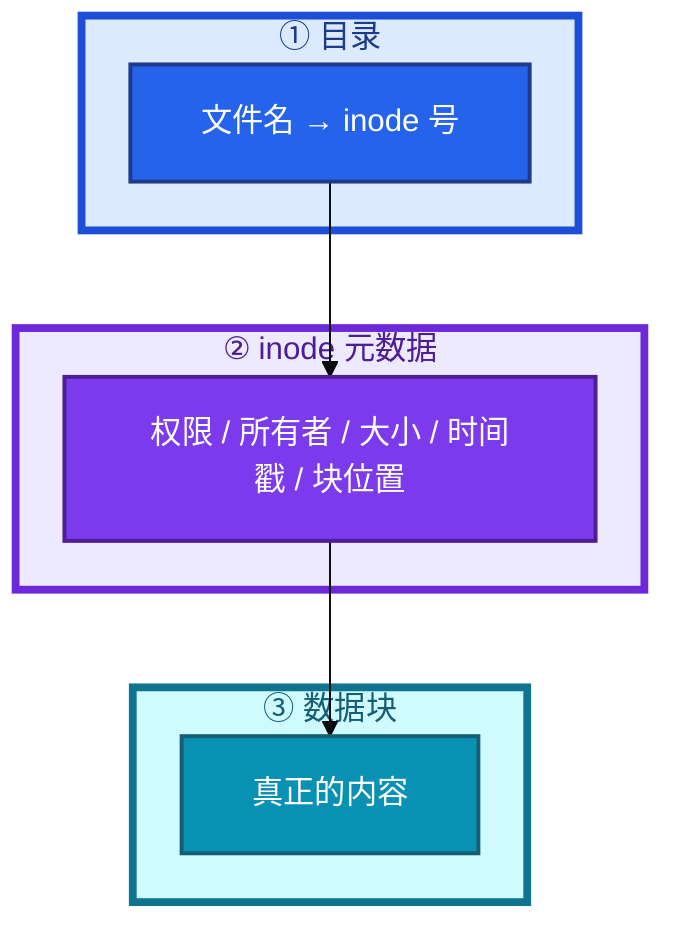
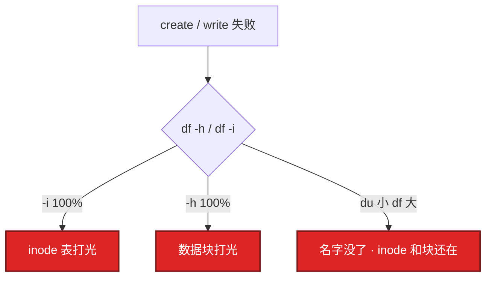
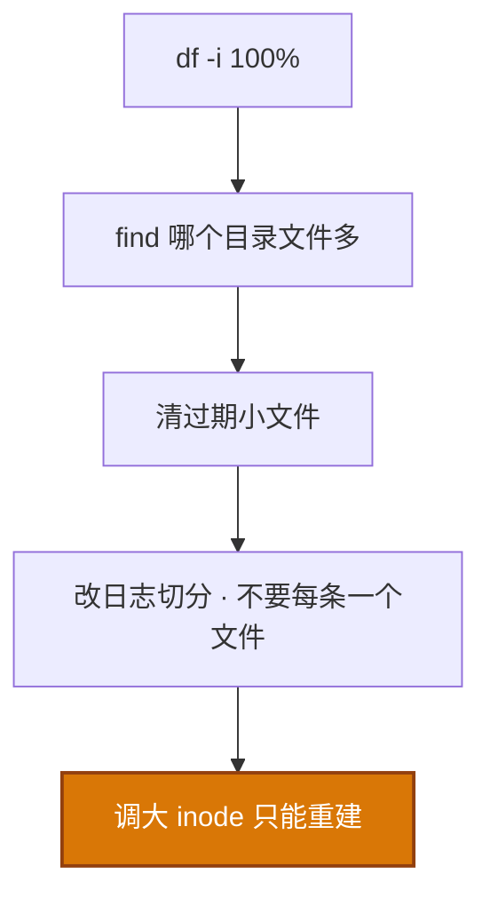
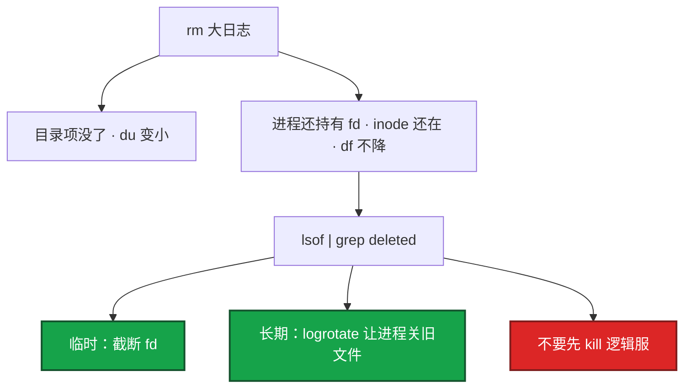
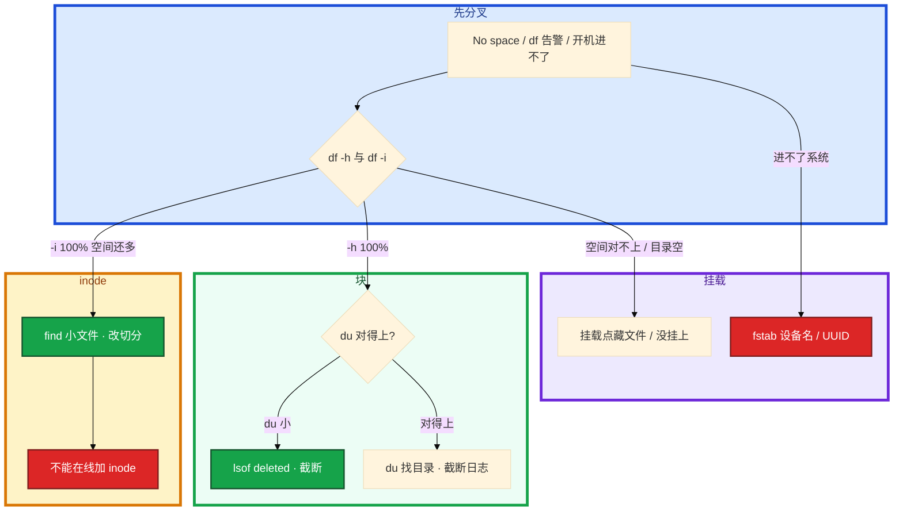

# 文件系统与 inode


活动日志开始报 `No space left on device`，`df -h` 却还有 80% 空闲。另一次凌晨 `rm` 了 20G 日志，`du` 立刻小了，`df` 一动不动。群里要重启逻辑服。有人准备把数据盘从 ext4 改成 xfs「inode 就不用管了」。

先别动手。这一章后半全是你会动手的：**怎么分块满和 inode 满、怎么截断已删文件、fstab 怎么写、ext4/xfs 怎么选。** 前面的 inode 和链接，是为了让你动手时不 rm、不乱 reboot。

**读完你能：** 画出文件名 / inode / 数据块；`No space` 会同时看 `-h` 和 `-i`；会处理 deleted fd；能讲清 ext4 和 xfs 差在哪；fstab 用 UUID 且 `mount -a` 再 reboot。

**本章主线（排障就按这三步想）：**

1. **分叉**：`No space` 先同时看 `df -h` 和 `df -i`，分清块满还是 inode 满。
2. **止血**：`du` 小、`df` 大 → `lsof deleted` 截断；会 reopen 用 USR1，不会用 copytruncate。
3. **预防**：fstab 用 UUID + `mount -a`；ext4/xfs 按场景选；开服 checklist 带 `df -i`。

## 本章目录

- [1. 基本概念](#1-基本概念)
- [2. 架构图](#2-架构图)
- [3. 原理](#3-原理)
  - [3.1 inode 满](#31-inode-满)
  - [3.2 已删不释放](#32-删了文件空间不释放)
  - [3.3 ext4 vs xfs](#33-ext4-vs-xfs)
  - [3.4 软硬链接](#34-软链接和硬链接)
- [4. 落地](#4-落地)
- [5. 核心配置](#5-核心配置)
- [6. 命令与操作](#6-命令与操作)
- [7. 生产排障](#7-生产排障)
- [8. 必会 · 常考](#8-必会--常考)
- [合上书](#合上书问自己)

**本章不讲：** await、脏页、iostat、云盘 QoS → [05 磁盘与IO](../05-磁盘与IO/)；logrotate、journal 打满 → [22 日志运维](../22-日志运维/)；救援模式、进不了系统 → [01 内核与系统](../01-内核与系统/)；容器 overlay 层把 inode 打满 → [07 cgroup与容器](../07-cgroup与容器/)、Docker。

---

## 1. 基本概念

一个文件占两样东西：**inode（元数据）+ 数据块（内容）**。文件名不在 inode 里，在目录这个「名字 → inode 号」的表里。创建一个文件消耗一个 inode，不管文件有多小。

`No space left on device` 先同时看 `df -h` 和 `df -i`，不要只看空间百分比。开服 checklist 里要有这两条（12）。

| 满了什么 | 你看到 | 写不了 |
|----------|--------|--------|
| 数据块 | `df -h` 100% | 追加、create |
| inode | `df -i` 100%，空间可能还很多 | **create** 失败，同样报 No space |
| 已删但仍打开 | `du` 小、`df` 不降 | 空间不回来 |

战斗服 stdout 重定向到单文件会 **块满**；活动日志按请求切文件会 **inode 满**。两种满，命令不同。

> **记住**：文件名在目录里，inode 是元数据，块才是内容；报 No space 必须同时看 df -h 和 df -i。

---

## 2. 架构图

先把整张图钉住。后面排障都对着这张图。



**读图三句话：**

1. 文件名在目录里，inode 是元数据，数据块才是内容。
2. `No space` 必须同时看 `-h` 和 `-i`，两种满命令不同。
3. `du` 小、`df` 大 → 名字没了但 inode 和块还在（deleted fd）。

三种失败对到图上：



---

## 3. 原理

原理只保留动手和面试会用到的：inode 为什么会先满、rm 为什么不还空间、ext4/xfs 怎么选、两种链接差在哪。

**本节 4 块：** 3.1 inode 满 · 3.2 deleted · 3.3 ext4/xfs · 3.4 链接

### 3.1 inode 满

**一句话：** 格式化时 inode 数量就定了；`df -i` 100% 时空间可能还很健康。

格式化时 inode 数量就定了（ext4 上 `mke2fs` 时设）。典型：日志按秒切分、会话/缓存碎片、Docker 镜像层、定时任务产文件不清。磁盘空间可能只用了 20%，inode 100%。游戏活动把每条请求写成一个 `.log` 文件，几小时就能把表打光。

算术直觉：ext4 常见默认大约 **1 个 inode / 16KB**。1TB 盘大约六千多万 inode。每个文件 1KB 的活动日志，inode 表打光时空间只用了大约 **60～70GB**（不到 7%）。`df -h` 看起来很健康，create 已经失败。这和内核章「小 write 一百万次」同一类账：消耗的是次数，不是字节。



怎么处理：

1. 监控 inode 使用率，不要只告警磁盘百分比。
2. 日志按时间/大小切分，不要每条一个文件。
3. 定期清过期小文件。
4. 大存储格式化时可调大 inode（`mke2fs -N` 或 `-i`）。**已经格式化的盘不能在线加 inode**，只能迁数据重建。

xfs 的 inode 分配更动态，但仍会被海量小文件打满。不要假设换 xfs 就不用管小文件。

你眼睛看到什么：`df -h` 很健康，`df -i` 100%，应用 create 失败。卡住先 `df -i`，不要对着应用报错调业务。

> **记住**：inode 满时空间可能还很多；已经格式化的盘不能在线加 inode，只能清文件或迁数据重建。

### 3.2 删了文件空间不释放

**一句话：** rm 只删目录项；进程还握着 fd，块和数据不回收。

Linux 删的是目录项。只要还有进程打开这个文件，inode 和数据块不回收。**du 和 df 不一致**的最常见原因。



生产不能随便 kill。先确认是谁持有（通常是日志进程或应用自己）。正确长期解法：logrotate copytruncate 或应用支持 reopen（22）。临时止血清空文件内容，比 rm 再 kill 安全。

`rm -rf` 之后立刻宣布空间回来了，应用还在写同一个已删 inode，过一会又满——这是常见误判。

du 和 df 不一致的其他原因：sparse 文件、文件系统元数据、挂载点藏了目录（没挂上时写在挂载点下面）。

> **记住**：rm 只删名字；进程还握着 fd，块不还。止血清空，长期靠轮转，不要先杀逻辑服。

### 3.3 ext4 vs xfs

**一句话：** 生产 ext4 或 xfs；换 xfs 不等于不用管小文件。

新盘要格式化。数据库和大文件偏 xfs；不确定就 ext4。btrfs 不当游戏核心盘默认。tmpfs 当缓存可以，当玩家数据不行。生产常用 ext4 / xfs。await、调度器、脏页在 05。本章只要求：类型选对、选项不要乱开、能看 `df -T`。

| | **ext4** | **xfs** |
|--|----------|---------|
| 定位 | 稳定、兼容性好，通用默认 | 大文件、并行 IO、数据库、大容量 |
| inode | 格式化时 **定死**（`-i` / `-N`） | **动态分配**，仍会被海量小文件打满 |
| 在线扩 | 可以（resize2fs） | **原生擅长** `xfs_growfs`，生产常用 |
| 缩小 | 可离线缩 | **不能缩** |
| fsck | 成熟，小盘可接受 | 很大盘 fsck 思路不同，靠日志回放 |
| 小文件海量 | inode 表先满，必须规划密度 | 动态好一些，**不是免管** |
| 大文件 / 稀疏 | 够用 | 通常更好 |
| 快照 | 自己叠 LVM | 自己叠 LVM；不要默认上 btrfs 当核心盘 |

其他类型：

| 文件系统 | 场景 |
|----------|------|
| btrfs | 快照、压缩、校验；**实验 / 特殊**，不当游戏核心盘默认 |
| tmpfs | 内存盘，重启丢；临时、缓存。**玩家存档 / 账单 / 回档不能放** |
| overlay2 | 容器分层；inode 打满交叉 07 |

选型口诀：

- 登录机、不确定、要能离线缩、工具链熟 → **ext4**
- DB、录像、大文件、要在线扩、单盘很大 → **xfs**
- 「换 xfs 就不用监控 inode」→ **错**

noatime 不更新访问时间，减写，通用盘常开。discard 是 SSD TRIM，看云厂商是否已经在底层做，不要两层都盲目开而不测。

> **记住**：生产 ext4 或 xfs；核心盘不用 btrfs，玩家数据不用 tmpfs；换 xfs 不等于不用管小文件。

### 3.4 软链接和硬链接

**一句话：** 硬链接共享 inode；软链接只是路径，跨文件系统。

日常做配置切换用软链接；备份用硬链接省空间。两者不是一回事。

| | 硬链接 | 软链接 |
|--|--------|--------|
| 本质 | 多个名字指向 **同一个 inode** | 特殊文件，内容是 **目标路径** |
| 删一个名字 | 数据还在（还有别的链接） | 目标删了变悬空 |
| 跨文件系统 | **不能** | 能 |
| 链目录 | **不能** | 能 |
| 命令 | `ln origin.txt hardlink.txt` | `ln -s /origin/path /link/path` |

运维日常用软链接（可见、可跨盘、可链目录）。硬链接常见于备份：`rsync --link-dest` 对没变的文件硬链到上次备份，省空间。删某次备份不影响其他次——因为 inode 还在。版本目录切换用软链，硬链不能链目录。

> **记住**：硬链接共享 inode，软链接只是路径；备份用硬链省空间，日常用软链做切换。

---

## 4. 落地

新盘：分区 → 选类型格式化 → UUID 写入 fstab → `mount -a` 验证 → 才允许 reboot。

```bash
df -T
mkfs.ext4 -L data /dev/nvme0n1p1          # 通用
# mkfs.ext4 -i 4096 ...                  # 海量小文件才把 inode 调密，会占更多元数据
mkfs.xfs -L data /dev/nvme0n1p1           # 大文件 / DB
blkid
```

云盘序号会变，**不要用 `/dev/sdb`**。`blkid` 取 UUID 写入 fstab。写错 `/etc/fstab` 会进不了系统。

验收：`df -h` / `df -i` 水位正常；`mount | grep /data` 确认挂上；reboot 后还在。数据盘确实挂上了，不是写在空目录里。

独立数据盘给游戏日志 / 存档，不要和系统盘混到写满根。

---

## 5. 核心配置

fstab 与挂载选项。改完必须 `mount -a`，失败当场修。救援模式才进 01。

```
UUID=xxxx  /data  ext4  defaults,noatime  0  2
```

| 项 | 选 | 不选 |
|----|----|------|
| 设备名 | **UUID=** | `/dev/sdb`（云盘序号会变） |
| nofail | 可缺的盘（非关键） | **游戏存档 / 账单盘** |
| noatime | 通用数据盘常开 | 真要靠 atime 的备份软件先测 |
| discard | 看云厂商是否底层 TRIM | 两层都盲目开而不测 |
| defaults | 起步够用 | 乱开实验选项 |

nofail 适合「这盘可缺」；游戏存档盘缺了还让业务起来，会把数据写到空的挂载点目录里，盘回来之后那些文件被藏起来——du/df 会再让你误会一次。关键盘不要 nofail，挂不上就让系统停，比静默写错地方好救。

```bash
mount -o noatime,nodiratime /dev/sdb1 /data    # 不更新 atime，减写
mount -o discard /dev/nvme0n1 /data            # SSD TRIM
```

> **记住**：fstab 用 UUID，改完 mount -a 再 reboot；关键盘不要 nofail 静默失败。

---

## 6. 命令与操作

告警磁盘满。开口这一套，不要先 `rm -rf /var/log`。

```bash
df -h && df -i
df -T
du -sh /* 2>/dev/null | sort -rh | head
du -sh /data/* | sort -rh | head
lsof | grep deleted
find /data -type f | wc -l
for d in /data/*/; do echo "$(find "$d" -type f | wc -l) $d"; done | sort -rn | head
find /data -type f -name "*.log" -mtime +7 -delete
mount | grep /data
blkid
```

| 目的 | 命令 | 看什么 |
|------|------|--------|
| 块 vs inode | `df -h` / `df -i` | 哪种满 |
| 类型 | `df -T` | ext4 / xfs / tmpfs |
| 谁占空间 | `du -sh` | 能看见的文件 |
| 已删仍占 | `lsof \| grep deleted` | PID / fd |
| 小文件堆 | `find ... \| wc -l` | inode 满时定位目录 |
| 验收 limits 无关 | — | 本章验收是 df / mount / UUID |

---

### 6.1 inode 满止血

```bash
df -i /data
find /data -type f | wc -l
# 按目录计数
for d in /data/*/; do echo "$(find "$d" -type f | wc -l) $d"; done | sort -rn | head
find /data -type f -name "*.log" -mtime +7 -delete
```

止血只能删小文件或改切分。根因：迁走数据、用更大 inode 密度重建，或换切分策略避免海量小文件。监控和切分方式要左移。开服 checklist 带 `df -i`。

不能在线加 inode。`mke2fs -i` 是格式化时的事。有人查到想在线改——不行。

### 6.2 截断 vs rm

| 动作 | 名字 | inode / 块 | df |
|------|------|------------|-----|
| `rm` | 没了 | 若被打开则还在 | **不降** |
| `> file` | 还在 | 块丢掉，fd 仍有效 | **立刻降** |
| `> /proc/PID/fd/N` | 文件已被 rm 只剩 fd | 对着 deleted 截断 | 立刻降 |

```bash
lsof | grep deleted
# 清空而不是删：进程句柄还在，内容被截成 0，空间立刻回来
# > /var/log/app.log
# 已被 rm：> /proc/<pid>/fd/<n>
```

具体动作：`lsof | grep deleted` 看到 `game-server` 握着已经 rm 掉的 `/var/log/game.log`。不要 kill 这个 PID。对这个 fd 做 `> /proc/<pid>/fd/<n>`，或若文件名还在就 `> /var/log/game.log`。空间立刻回到 `df`。然后补 logrotate，让下次切分时进程自己关旧文件。先 lsof 确认编号，不要截错。

这是磁盘满时对正在写的日志的标准止血。

### 6.3 fstab：用 UUID

```
blkid → UUID=... 写入 /etc/fstab → mount -a 成功 → 才允许 reboot
```

选项：`defaults,noatime`。云盘可 `nofail`（挂不上也让系统起来）。**关键数据盘不要 nofail**。

具体走一遍：云盘没挂上，`/data` 只是根盘上的空目录。业务往 `/data/save` 写存档，写的是根盘。云盘后来挂上，根盘上那批文件被挡住看不见，`df` 看云盘是空的，玩家存档「丢了」。卸下云盘才能看见藏在挂载点下面的目录。

卡住先看哪：开机进不了系统，先确认是不是 fstab 写错设备名；盘「在」但目录是空的，先看有没有挂上、挂载点下面是不是藏了未挂时写进去的文件。进不了系统：救援模式修 fstab（01）。所以才要求 mount -a 先验证。

扩容：xfs 用 `xfs_growfs /data`（先在云上扩块设备）；ext4 用 `resize2fs`。先扩云盘再扩文件系统。xfs 不能缩。

### 6.4 链接日常

```bash
ln -s /opt/game/releases/1.2.3 /opt/game/current    # 版本切换
ln origin.txt hardlink.txt                          # 同盘多名字
# 备份：rsync --link-dest=上次目录
```

同一文件系统内要「多份名字、一份数据」，例如增量备份，才必须硬链接。

---

## 7. 生产排障

三问：块满还是 inode 满？du 和 df 一致吗？盘真的挂上了吗？



现场顺序：

```bash
df -h && df -i
du -sh /* 2>/dev/null | sort -rh | head
lsof | grep deleted
mount | grep /data
```

| 现象 | 先做什么 | 不要做什么 |
|------|----------|------------|
| df -h 18%、No space | `df -i`；find 小文件 | 调业务、加云盘容量当第一刀 |
| rm 后 df 不降 | lsof deleted；截断 | 杀逻辑服 |
| 有人 `rm -rf /var/log` | 停手；截断 | 宣布空间回来了 |
| 想在线 `mke2fs -i` | 否 | 格式化生产盘 |
| 换 xfs 治 inode | 仍要管小文件 | 当根治 |
| fstab 写 /dev/sdb 就 reboot | UUID + mount -a | 未验证 reboot |
| 关键盘 nofail | 拿掉 | 静默写到空目录 |
| tmpfs 放存档 | 迁走 | 重启丢数据 |
| du 200G df 800G、deleted 空 | 挂载点藏文件 / sparse | 只会 deleted |

游戏：活动日志按请求切文件会 inode 满；战斗服 stdout 重定向到单文件会块满。空间 50% 不一定安全：inode 可能已经 90%。平均空间会骗人，和平均 CPU 同一类。

---

## 8. 必会 · 常考

白板和追问高频，能一口回：

| 说法 | 对错 | 口径 |
|------|:----:|------|
| No space 就是 df -h 100% | 错 | 先看 df -i |
| inode 满可以在线加 | 错 | 只能清或重建 |
| 换 xfs 就不用管 inode | 错 | 动态分配仍会被小文件打满 |
| rm 大文件 df 一定降 | 错 | 进程握着 fd |
| 磁盘满先杀逻辑服 | 错 | 截断 |
| du 就是 df | 错 | du 看见的文件；差一截先想 deleted |
| fstab 写 /dev/sdb | 错 | UUID；云盘序号会变 |
| 改完 fstab 直接 reboot | 错 | 先 mount -a |
| 关键盘加 nofail 更稳 | 错 | 静默写错地方更可怕 |
| 玩家数据可以放 tmpfs | 错 | 重启丢 |
| 核心盘默认 btrfs | 错 | 生产 ext4/xfs |
| 版本切换用硬链接 | 错 | 硬链不能链目录，用软链 |
| 开服只看空间百分比 | 错 | 必须带 df -i |

数字：ext4 默认约 **1 inode / 16KB**；1TB ≈ 六千多万 inode；1KB×满表 ≈ 空间只用 **60～70GB**；以太网无关，本章数字在 inode 密度。

易混：块满 vs inode 满；rm vs 截断；du vs df；ext4 固定 inode vs xfs 动态；软链 vs 硬链；nofail 可缺 vs 关键盘；挂载点藏文件 vs deleted。

---

## 合上书，问自己

1. 文件名、inode、数据块各在哪？No space 为什么必须看 -i？
2. inode 满怎么证明、怎么止血、能不能在线加？算术 1TB/1KB 文件怎么估？
3. rm 后 df 不降怎么办？`>file` 和 `> /proc/PID/fd/N` 何时用？
4. ext4 和 xfs 怎么选？换 xfs 能否不管小文件？tmpfs / btrfs？
5. fstab 为什么用 UUID？关键盘为什么不要 nofail？mount -a？
6. 软链硬链差在哪？du 和 df 差很多，deleted 之外还查什么？

六题都能口述，这一章就过了。下一章把 iptables 剖开：五链四表、NAT 游戏服、conntrack 表满、iptables vs IPVS。
