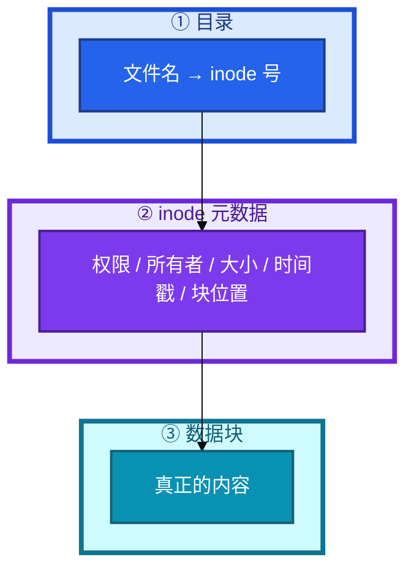
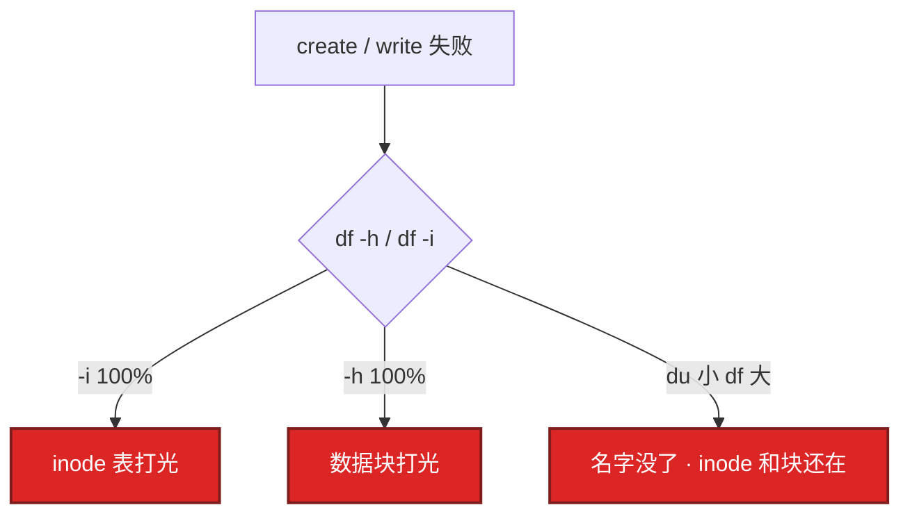
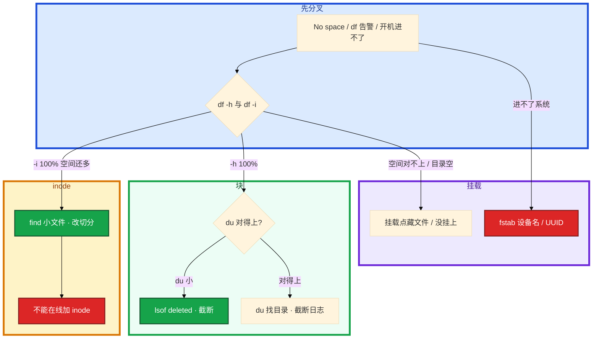

# 文件系统与 inode


活动日志开始报 `No space left on device`，`df -h` 却还有 80% 空闲。另一次凌晨 `rm` 了 20G 日志，`du` 立刻小了，`df` 一动不动。群里有人要重启逻辑服，有人准备把数据盘从 ext4 改成 xfs「inode 就不用管了」——先别动手。

**本章主线（排障就按这三步想）：**

1. **分叉**：`No space` 先同时看 `df -h` 和 `df -i`，分清块满还是 inode 满。
2. **止血**：`du` 小、`df` 大 → `lsof deleted` 截断；会 reopen 用 USR1，不会用 copytruncate。
3. **预防**：fstab 用 UUID + `mount -a`；ext4/xfs 按场景选；开服 checklist 带 `df -i`。

**读完你能：** 画出文件名 / inode / 数据块；`No space` 会同时看 `-h` 和 `-i`；会处理 deleted fd；能讲清 ext4 和 xfs 差在哪；fstab 用 UUID 且 `mount -a` 再 reboot。

## 本章目录

- [1. 基本概念](#1-基本概念)
- [2. 架构图](#2-架构图)
- [3. 原理](#3-原理)
  - [3.1 inode 满](#31-inode-满)
  - [3.2 删了文件空间不释放](#32-删了文件空间不释放)
  - [3.3 ext4 vs xfs](#33-ext4-vs-xfs)
  - [3.4 软链接和硬链接](#34-软链接和硬链接)
- [4. 落地](#4-落地)
- [5. 核心配置](#5-核心配置)
- [6. 命令与操作](#6-命令与操作)
- [7. 生产排障](#7-生产排障)
- [8. 必会 · 常考](#8-必会--常考)
- [合上书](#合上书问自己)

**本章不讲：** await、脏页、iostat、云盘 QoS → [05 磁盘与IO](../05-磁盘与IO/)；logrotate、journal 打满 → [22 日志运维](../22-日志运维/)；救援模式、进不了系统 → [01 内核与系统](../01-内核与系统/)；容器 overlay 层把 inode 打满 → [07 cgroup与容器](../07-cgroup与容器/)、Docker。

---

## 1. 基本概念

文件系统排障是 **先分清满的是什么**，不是一上来 `rm -rf /var/log`。现场 80% 死在三种账没对上：块满、inode 满、已删仍占——三种满，命令不同。

**值班里怎么认现象**（先听监控/应用怎么说，再对表）：

| 监控/应用说的 | 技术含义 | 你的第一刀 |
|---------------|----------|------------|
| `No space left on device` | 可能是块满 **或** inode 满 | `df -h` **和** `df -i` 同时看 |
| `df` 还有 80% 空闲 | 多半是 **inode 满** | `df -i`；`find` 数小文件 |
| `rm` 了 20G，`df` 不动 | 进程还握着 **deleted fd** | `lsof \| grep deleted` |
| 云盘挂了，目录是空的 | 挂载点藏文件 / 没挂上 | `mount`；看挂载点下面 |

| 满了什么 | 你看到 | 写不了 |
|----------|--------|--------|
| 数据块 | `df -h` 100% | 追加、create |
| inode | `df -i` 100%，空间可能还很多 | **create** 失败，同样报 No space |
| 已删但仍打开 | `du` 小、`df` 不降 | 空间不回来 |

**打个比方**：inode 像停车场的**车位号牌**——每个文件占一个号，跟车多大无关；数据块才是**车位本身**。战斗服 stdout 重定向到单文件会 **块满**；活动日志按请求切文件会 **inode 满**。rm 只撕掉门口登记册上的名字，车（数据）还在，只要还有进程握着钥匙（fd）。

一个文件占两样东西：**inode（元数据）+ 数据块（内容）**。文件名不在 inode 里，在目录这个「名字 → inode 号」的表里。创建一个文件消耗一个 inode，不管文件有多小。

> **记住**：文件名在目录里，inode 是元数据，块才是内容；报 No space 必须同时看 df -h 和 df -i。

**面试怎么说**：「No space 我先 df -h 和 df -i 分叉，块满 du 找目录，inode 满 find 小文件，du 小 df 大先 lsof deleted 截断，不会一上来 rm 或重启。」

---

## 2. 架构图

先把整张图钉住。后面排障都对着这张图。



**读图三句话：**

1. **文件名在目录里**，inode 是元数据，数据块才是内容——删名字不等于还空间。
2. `No space` 必须同时看 `-h` 和 `-i`，两种满命令不同。
3. `du` 小、`df` 大 → 名字没了但 inode 和块还在（deleted fd）。

三种失败对到图上：



---

## 3. 原理

原理只保留动手和面试会用到的：inode 为什么会先满、rm 为什么不还空间、ext4/xfs 怎么选、两种链接差在哪。

### 3.1 inode 满

**一句话：** 格式化时 inode 数量就定了；`df -i` 100% 时空间可能还很健康。

**打个比方**：停车场有六千多万个车位号，但每个车位只能停一辆**玩具车**（1KB 日志）。号牌发完了，空地上还能停很多真车——`df -h` 看着宽敞，create 已经失败。

**现场走一遍**（活动服写请求级日志，create 突然全挂）：

1. 登录机执行：

```bash
df -h /data && df -i /data
```

2. 屏幕出现：

```text
Filesystem      Size  Used Avail Use% Mounted on
/dev/nvme0n1p1  1.0T   72G  953G   7% /data
Filesystem       Inodes  IUsed    IFree IUse% Mounted on
/dev/nvme0n1p1 67108864 67108864        0  100% /data
```

3. **分叉结论**：空间才 7%，inode **100%**——不是加盘能解决的，是小文件把表打光了。

4. 找谁吃的：

```bash
for d in /data/*/; do echo "$(find "$d" -type f 2>/dev/null | wc -l) $d"; done | sort -rn | head -5
```

5. 屏幕出现：

```text
4823104 /data/activity-logs/
  12045 /data/cache/
    892 /data/save/
```

6. 止血删过期小文件（先确认业务可删），再看 `df -i`：`IUse%` 从 100% 降到 93%，create 能恢复——根因是切分策略，要改按时间/大小滚，不要每条一个文件。

**输出解读**

- `df -h` 的 `Use%` 看**数据块**；`df -i` 的 `IUse%` 看 **inode**——两个百分比独立，必须一起看。
- 1TB 盘只用了 72G（7%），inode 六千多万全占满——典型「每条请求一个 `.log`」。
- 算术：ext4 默认约 **1 inode / 16KB**；1KB×满表 ≈ 空间只用 **60～70GB**（不到 7%）。
- `find ... | wc -l` 按目录计数，直接指向 `activity-logs` 这种文件数爆炸的目录。

**面试怎么说**：「inode 满 df -h 可能很健康，我先 df -i，find 按目录数文件定位，清过期小文件止血；已经格式化的盘不能在线加 inode，只能清或迁数据重建。」

> **记住**：inode 满时空间可能还很多；已经格式化的盘不能在线加 inode，只能清文件或迁数据重建。

### 3.2 删了文件空间不释放

**一句话：** rm 只删目录项；进程还握着 fd，块和数据不回收。

**打个比方**：你把快递单从柜台上撕了（rm），但快递员手里还攥着包裹单号（fd）——仓库那格（数据块）不能给别人用，直到快递员松手。

**现场走一遍**（凌晨 rm 了 20G 日志，`df` 纹丝不动）：

1. 先看 du 和 df 是否对得上：

```bash
df -h /var/log
du -sh /var/log
```

2. 屏幕出现：

```text
Filesystem      Size  Used Avail Use% Mounted on
/dev/vda1        50G   48G     0G 100% /
18M     /var/log
```

3. **分叉**：du 只有 18M，df 48G/50G——差了几十年，先想 deleted fd。

4. 找谁握着：

```bash
lsof | grep deleted | head -5
```

5. 屏幕出现：

```text
game-serv 12847  root   3w   REG  253,0 21474836480  884521 /var/log/game.log (deleted)
nginx     8921   www    2w   REG  253,0      1048576  901234 /var/log/nginx/access.log (deleted)
```

6. **止血**（不要 kill 逻辑服）——对着 deleted fd 截断：

```bash
> /proc/12847/fd/3
df -h /var/log
```

7. 屏幕出现：

```text
Filesystem      Size  Used Avail Use% Mounted on
/dev/vda1        50G   28G    20G  59% /
```

8. 长期补 logrotate copytruncate 或 reopen（见 [22 日志运维](../22-日志运维/)）。

**输出解读**

- `du` 只统计目录树里还能 walk 到的文件；`df` 看已分配块——rm 后 du 小、df 不动。
- `lsof` 里 `(deleted)`：目录项已删，fd 仍打开则块不还；`3w` = fd 3 写模式；`21474836480` ≈ 20G。
- `> /proc/PID/fd/N` 截成 0 字节、**不杀进程**，空间立刻回 `df`；文件名还在就 `> file`，已 rm 只能走 proc。

**面试怎么说**：「rm 只删目录项，进程握着 fd 块不还；我先 lsof deleted，对 fd 截断止血，长期靠 logrotate，磁盘满不会先杀逻辑服。」

> **记住**：rm 只删名字；进程还握着 fd，块不还。止血清空，长期靠轮转，不要先杀逻辑服。

### 3.3 ext4 vs xfs

**一句话：** 生产 ext4 或 xfs；换 xfs 不等于不用管小文件。

**打个比方**：ext4 像买房时**固定了户口名额**（inode 格式化定死）；xfs 像按需发户口（动态分配），但海量小文件照样能把名额打光——换 xfs 不是免监控。

**现场走一遍**（新购云盘要挂到游戏日志机）：

1. 看现有盘类型：

```bash
df -T /data
blkid /dev/nvme0n1p1
```

2. 屏幕出现：

```text
Filesystem     Type  1K-blocks      Used Available Use% Mounted on
/dev/nvme0n1p1 ext4 1048064000  75497472 921600000   8% /data
/dev/nvme0n1p1: UUID="a3f2c8d1-..." TYPE="ext4" PARTUUID="..."
```

3. 选型：这台是活动日志机、要海量小文件 → 格式化时把 inode 调密；若是 DB/录像大文件盘 → xfs。

```bash
# 通用 / 不确定
mkfs.ext4 -L data /dev/nvme0n1p1
# 海量小文件才把 inode 调密（格式化时的事，会占更多元数据）
# mkfs.ext4 -i 4096 -L data /dev/nvme0n1p1
# 大文件 / DB / 要在线扩
mkfs.xfs -L data /dev/nvme0n1p1
```

4. `blkid` 取 UUID 写入 fstab，`mount -a && df -hT /data && df -i /data` 验收。

**输出解读**

| | **ext4** | **xfs** |
|--|----------|---------|
| 定位 | 稳定、兼容性好，通用默认 | 大文件、并行 IO、数据库、大容量 |
| inode | 格式化时 **定死**（`-i` / `-N`） | **动态分配**，仍会被海量小文件打满 |
| 在线扩 | 可以（resize2fs） | **原生擅长** `xfs_growfs` |
| 缩小 | 可离线缩 | **不能缩** |
| 小文件海量 | inode 表先满，必须规划密度 | 动态好一些，**不是免管** |

- `df -T` 的 `Type` 列一眼看文件系统；生产常用 ext4 / xfs，核心盘不用 btrfs 当默认，玩家数据不用 tmpfs（重启丢）。
- `mkfs.ext4 -i 4096` 表示每 4096 字节一个 inode（更密），只能在**格式化时**设；已经格式化的盘不能在线改。
- 选型口诀：登录机、不确定、要能离线缩 → **ext4**；DB、录像、大文件、要在线扩 → **xfs**。「换 xfs 就不用监控 inode」→ **错**。
- overlay2 容器分层 inode 打满交叉 [07 cgroup与容器](../07-cgroup与容器/)；await、调度器、脏页在 [05 磁盘与IO](../05-磁盘与IO/)。

**面试怎么说**：「新盘我看场景选 ext4 或 xfs，海量小文件格式化时调 inode 密度；xfs 动态好一些但不是免管；核心盘不用 btrfs，存档不用 tmpfs。」

> **记住**：生产 ext4 或 xfs；核心盘不用 btrfs，玩家数据不用 tmpfs；换 xfs 不等于不用管小文件。

### 3.4 软链接和硬链接

**一句话：** 硬链接共享 inode；软链接只是路径，跨文件系统。

**打个比方**：硬链接像两个人用**同一张身份证**（同一 inode）；软链接像便签纸上写了「东西在隔壁仓库 B 区」（路径），仓库拆了便签就悬空。

**现场走一遍**（版本切换 + 备份省空间）：

1. 版本切换用软链：

```bash
ln -s /opt/game/releases/1.2.3 /opt/game/current
ls -li /opt/game/current
```

2. 屏幕出现：`lrwxrwxrwx ... current -> /opt/game/releases/1.2.3`——软链 inode 独立，内容是路径。

3. 同盘备份用硬链：

```bash
ln /data/save/player.db /data/backup/player.db
ls -li /data/save/player.db /data/backup/player.db
```

4. 屏幕出现：两行 **inode 相同**（884521），链接计数 `2`——多名字、一份数据。

5. `rm` 一个硬链名后计数变 `1`，数据还在；删软链目标后 `current` 变**悬空**——链接还在，路径指向的仓库没了。

**输出解读**

- 硬链接：多个名字 → **同一 inode**；不能跨盘、不能链目录；`rsync --link-dest` 对没变文件硬链省空间。
- 软链接：特殊文件存路径；能跨盘、能链目录；版本切换 `current → 1.2.3` 用软链。
- 删硬链一个名字数据还在；删软链目标链接悬空——面试常考这对反差。

**面试怎么说**：「硬链接共享 inode、不能跨盘不能链目录，备份 rsync link-dest 省空间；日常版本切换用软链，可见可跨盘。」

> **记住**：硬链接共享 inode，软链接只是路径；备份用硬链省空间，日常用软链做切换。

---

## 4. 落地

新盘：分区 → 选类型格式化 → UUID 写入 fstab → `mount -a` 验证 → 才允许 reboot。

```bash
df -T
mkfs.ext4 -L data /dev/nvme0n1p1          # 通用
# mkfs.ext4 -i 4096 ...                  # 海量小文件才把 inode 调密
mkfs.xfs -L data /dev/nvme0n1p1           # 大文件 / DB
blkid
```

| 项 | 选 | 不选 |
|----|----|------|
| 设备名 | **UUID=** | `/dev/sdb`（云盘序号会变） |
| 数据盘 | 独立挂 `/data`，不和系统盘混 | 日志写满根分区 |
| 验收 | `df -h` / `df -i` / `mount` | 未 `mount -a` 就 reboot |

`blkid` 取 UUID，写错 fstab 进不了系统（救援见 [01](../01-内核与系统/)）。验收：`df -h` / `df -i` 正常，`mount` 确认挂上，reboot 后还在——别写在空挂载点里。

---

## 5. 核心配置

fstab 与挂载选项。改完必须 `mount -a`，失败当场修。

```
UUID=a3f2c8d1-4e5b-6c7d-8e9f-0123456789ab  /data  ext4  defaults,noatime  0  2
```

| 项 | 选 | 不选 |
|----|----|------|
| 设备名 | **UUID=** | `/dev/sdb`（云盘序号会变） |
| nofail | 可缺的盘（非关键） | **游戏存档 / 账单盘** |
| noatime | 通用数据盘常开 | 真要靠 atime 的备份软件先测 |
| discard | 看云厂商是否底层 TRIM | 两层都盲目开而不测 |
| defaults | 起步够用 | 乱开实验选项 |

关键盘不要 nofail——挂不上还起业务，数据会写到空挂载点下面，盘挂上后被藏起来。扩容：先扩云盘，xfs `xfs_growfs`、ext4 `resize2fs`；xfs 不能缩。

> **记住**：fstab 用 UUID，改完 mount -a 再 reboot；关键盘不要 nofail 静默失败。

---

## 6. 命令与操作

告警磁盘满。开口这一套，不要先 `rm -rf /var/log`。

### 6.1 命令速查

```bash
df -h && df -i
df -T
du -sh /* 2>/dev/null | sort -rh | head
du -sh /data/* | sort -rh | head
lsof | grep deleted
find /data -type f | wc -l
for d in /data/*/; do echo "$(find "$d" -type f | wc -l) $d"; done | sort -rn | head
find /data -type f -name "*.log" -mtime +7 -delete
mount | grep /data
blkid
```

| 目的 | 命令 | 看什么 |
|------|------|--------|
| 块 vs inode | `df -h` / `df -i` | 哪种满 |
| 类型 | `df -T` | ext4 / xfs / tmpfs |
| 谁占空间 | `du -sh` | 能看见的文件 |
| 已删仍占 | `lsof \| grep deleted` | PID / fd |
| 小文件堆 | `find ... \| wc -l` | inode 满时定位目录 |
| 挂载 | `mount \| grep` | 真挂上还是没挂 |

### 6.2 截断 vs rm

| 动作 | 名字 | inode / 块 | df |
|------|------|------------|-----|
| `rm` | 没了 | 若被打开则还在 | **不降** |
| `> file` | 还在 | 块丢掉，fd 仍有效 | **立刻降** |
| `> /proc/PID/fd/N` | 文件已被 rm 只剩 fd | 对着 deleted 截断 | 立刻降 |

```bash
lsof | grep deleted
# > /var/log/app.log
# > /proc/<pid>/fd/<n>
```

### 6.3 fstab 与挂载点

`blkid → UUID 写入 fstab → mount -a → 才 reboot`。云盘没挂上时 `/data` 只是根盘空目录——业务写进去，盘挂上后文件被藏住，`df` 看云盘是空的。

---

## 7. 生产排障

三问：块满还是 inode 满？du 和 df 一致吗？盘真的挂上了吗？



现场顺序：

```bash
df -h && df -i
du -sh /* 2>/dev/null | sort -rh | head
lsof | grep deleted
mount | grep /data
```

| 现象 | 先做什么 | 不要做什么 |
|------|----------|------------|
| df -h 18%、No space | `df -i`；find 小文件 | 调业务、加云盘容量当第一刀 |
| rm 后 df 不降 | lsof deleted；截断 | 杀逻辑服 |
| 有人 `rm -rf /var/log` | 停手；截断 | 宣布空间回来了 |
| 想在线 `mke2fs -i` | 否 | 格式化生产盘 |
| 换 xfs 治 inode | 仍要管小文件 | 当根治 |
| fstab 写 /dev/sdb 就 reboot | UUID + mount -a | 未验证 reboot |
| 关键盘 nofail | 拿掉 | 静默写到空目录 |
| tmpfs 放存档 | 迁走 | 重启丢数据 |
| du 200G df 800G、deleted 空 | 挂载点藏文件 / sparse | 只会 deleted |

游戏：活动日志按请求切文件会 inode 满；战斗服 stdout 重定向到单文件会块满。空间 50% 不一定安全：inode 可能已经 90%。平均空间会骗人，和平均 CPU 同一类。

---

## 8. 必会 · 常考

| 说法 | 对错 | 口径 |
|------|:----:|------|
| No space 就是 df -h 100% | 错 | 先看 df -i |
| inode 满可以在线加 | 错 | 只能清或重建 |
| 换 xfs 就不用管 inode | 错 | 动态分配仍会被小文件打满 |
| rm 大文件 df 一定降 | 错 | 进程握着 fd |
| 磁盘满先杀逻辑服 | 错 | 截断 |
| du 就是 df | 错 | du 看见的文件；差一截先想 deleted |
| fstab 写 /dev/sdb | 错 | UUID；云盘序号会变 |
| 改完 fstab 直接 reboot | 错 | 先 mount -a |
| 关键盘加 nofail 更稳 | 错 | 静默写错地方更可怕 |
| 玩家数据可以放 tmpfs | 错 | 重启丢 |
| 核心盘默认 btrfs | 错 | 生产 ext4/xfs |
| 版本切换用硬链接 | 错 | 硬链不能链目录，用软链 |
| 开服只看空间百分比 | 错 | 必须带 df -i |

数字：ext4 默认约 **1 inode / 16KB**；1TB ≈ 六千多万 inode；1KB×满表 ≈ 空间只用 **60～70GB**；以太网无关，本章数字在 inode 密度。

易混：块满 vs inode 满；rm vs 截断；du vs df；ext4 固定 inode vs xfs 动态；软链 vs 硬链；nofail 可缺 vs 关键盘；挂载点藏文件 vs deleted。

---

## 合上书，问自己

1. 文件名、inode、数据块各在哪？No space 为什么必须看 -i？
2. inode 满怎么证明、怎么止血、能不能在线加？算术 1TB/1KB 文件怎么估？
3. rm 后 df 不降怎么办？`>file` 和 `> /proc/PID/fd/N` 何时用？
4. ext4 和 xfs 怎么选？换 xfs 能否不管小文件？tmpfs / btrfs？
5. fstab 为什么用 UUID？关键盘为什么不要 nofail？mount -a？
6. 软链硬链差在哪？du 和 df 差很多，deleted 之外还查什么？

六题都能口述，这一章就过了。下一章把 iptables 剖开：五链四表、NAT 游戏服、conntrack 表满、iptables vs IPVS。
