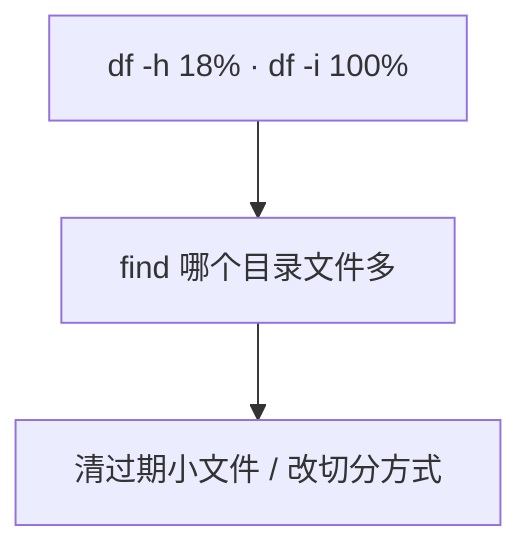

# 14｜文件系统与 inode · 练习题

先自己画图或口述，再对照解答。每题标了覆盖范围：

| 标记 | 含义 |
|------|------|
| **核心** | 不懂整章就没建立起来 |
| **必会** | 值班和面试都要能讲 |
| **常用** | 线上会反复碰到 |
| **常考** | 白板和追问的高频口径 |

## 本题目录

- [Q1 inode 满](#q1)
- [Q2 删了不释放](#q2)
- [Q3 ext4 vs xfs](#q3)
- [Q4 fstab / UUID](#q4)
- [Q5 软硬链接](#q5)
- [Q6 du vs df](#q6)
- [Q7 inode 不能在线加](#q7)
- [Q8 截断 vs rm](#q8)
- [Q9 nofail 与挂载点](#q9)
- [Q10 开服 checklist](#q10)
- [合上书](#合上书)

---

## Q1

**★★★★★｜磁盘空间没满但写不了文件，为什么？**

**覆盖**：核心 · 必会 · 常考

### 场景

`df -h` 显示 `/data` 只用了 18%。应用报 `No space left on device`。日志按每个请求一个文件在切。

### 完整解答

inode 满了。每个文件消耗一个 inode，数量在格式化时固定（ext4）。大量小文件耗光 inode，不占多少块。



```bash
df -i /data
find /data -type f | wc -l
```

算术：ext4 默认约 1 inode / 16KB。1TB ≈ 六千多万 inode。1KB 文件把表打光时空间大约 60～70GB。监控 inode，不要只告警空间百分比。战斗服 stdout 重定向单文件会 **块满**；活动日志按请求切文件会 **inode 满**。

### 再追问

- 怎么防止 inode 满？——告警 `df -i`；日志按时间/大小切；定期清；大盘格式化时把 inode 调密。

---

## Q2

**★★★★★｜删了一个大文件但 df 显示空间没释放，为什么？**

**覆盖**：核心 · 必会 · 常用

### 场景

战斗服日志 40G，有人 `rm` 了。`du` 已经小了，`df -h` 还是 100%。群里要重启逻辑服。

### 完整解答

进程还持有已删文件的句柄。目录项没了，inode 和块还在，直到进程 close。

```
rm → du 变小
    → 进程仍打开 fd → df 不降
    → lsof | grep deleted 找 PID
```

1. 临时止血：清空文件（`> file`）而不是删。句柄还在，内容变 0，空间立刻回来。
2. 长期：logrotate 让进程自己关旧文件（22）。
3. 不要先 kill 游戏逻辑服——那是踢人。

`rm -rf` 之后立刻宣布空间回来了，应用还在写同一个已删 inode，过一会又满。

### 再追问

- 生产不能随便 kill 怎么办？——确认是日志 fd 就截断或让应用 reopen。rm 不是止血。

---

## Q3

**★★★★★｜ext4 和 xfs 怎么选？换 xfs 就不用管 inode 了吗？tmpfs 能放玩家数据吗？**

**覆盖**：核心 · 必会 · 常考

### 场景

新登录机数据盘、新 DB 盘、一层缓存盘，三块盘一起申请。有人说「全部上 xfs，inode 是动态的」。

### 完整解答

生产常用 ext4 / xfs。

| 盘 | 选 | 理由 |
|----|----|------|
| 登录机 / 不确定 | ext4 | 兼容、可离线缩、默认 |
| DB / 大文件 / 要在线扩 | xfs | `xfs_growfs`；大文件并行 IO |
| 缓存 | 可 tmpfs | **重启丢** |

btrfs 不当游戏核心盘默认。tmpfs 只能放临时和缓存。玩家存档、账单、回档备份不能放 tmpfs。overlay2 是容器分层，inode 打满交叉 07。

xfs inode **动态分配**，仍会被海量小文件打满。不要假设换 xfs 就不用管小文件。xfs **不能缩小**。ext4 inode 格式化时定死。

noatime 减写，通用盘常开。discard 是 SSD TRIM，看云厂商是否底层已做，不要两层盲目开而不测。

### 再追问

- 已经是 ext4，inode 密度不够？——不能在线加。迁数据重建。这不是换 xfs 的借口去格式化生产盘。

---

## Q4

**★★★★☆｜fstab 应该怎么写？改完直接 reboot 行不行？**

**覆盖**：必会 · 常用 · 常考

### 场景

新挂一块云盘。有人在 fstab 写了 `/dev/sdb1 /data ext4 defaults 0 0`，准备 reboot。

### 完整解答

云盘序号会变，用 **UUID**。改完 `mount -a` 验证，**不要未验证就 reboot**。写错 fstab 会进不了系统。

```
blkid → UUID=xxxx 写入 fstab → mount -a 成功 → 才允许 reboot
```

选项：`defaults,noatime`。云盘可 `nofail`（挂不上也让系统起来）。**关键数据盘不要 nofail**：静默没挂上，业务把数据写进空挂载点目录，盘回来之后那些文件被藏起来。进不了系统走救援模式（01）。所以才要求 mount -a 先验证。

### 再追问

- 扩容步骤？——先扩云盘块设备，再 `xfs_growfs` 或 `resize2fs`。xfs 不能缩。

---

## Q5

**★★★★☆｜软链接和硬链接有什么区别？运维各用在哪？**

**覆盖**：必会 · 常用

### 场景

要给 `/opt/game/current` 指向新版本目录。有人用了硬链接。

### 完整解答

硬链接：多个名字同一个 inode，删一个数据还在，不能跨文件系统、不能链目录。

软链接：内容是路径，目标删了变悬空，可跨盘、可链目录。

| 场景 | 用 |
|------|----|
| 版本切换 / 跨盘 | 软链接 `ln -s` |
| 备份未变化的文件 | 硬链接（`rsync --link-dest`） |

日常运维用软链接，可见性好。硬链接给备份省空间：删某次备份不影响其他次。版本目录切换用软链，硬链不能链目录。

### 再追问

- 什么时候必须用硬链接？——同一文件系统内要「多份名字、一份数据」，例如增量备份。

---

## Q6

**★★★★☆｜du 和 df 差很多，除了 deleted 还有什么？**

**覆盖**：必会 · 常用

### 场景

`du -sh /data` 200G，`df` 说 `/data` 800G。lsof deleted 是空的。

### 完整解答

按这个顺序想，不要只会 deleted：

1. lsof deleted — 进程持有已删文件
2. 挂载点把文件藏起来 — 没挂盘时写在 `/data` 目录下，挂上之后看不见
3. sparse — du 和 df 对空洞统计不同
4. 文件系统元数据 / 快照

游戏场景：数据盘没挂上时日志写进了 `/data` 这个空目录，后来盘挂上，旧日志被藏在挂载点下面。`mount` 核对，umount 才能看见那批文件。这也是关键盘不要 nofail 的原因之一。生产 umount 要停写。可 `mount --bind` 对照。

### 再追问

- 怎么快速确认是不是挂载点藏文件？——`mount | grep /data` 确认挂上了。再找机会 umount 看目录本身的大小。

---

## Q7

**★★★★☆｜inode 已经满了，能不能调大？**

**覆盖**：必会 · 常用 · 常考

### 场景

缓存盘 inode 100%。有人查到 `mke2fs -i` 想在线改。

### 完整解答

不能在线加 inode。数量在格式化时定死（ext4）。止血只能删小文件。根因：迁走数据、用更大 inode 密度重建，或换切分策略避免海量小文件。

监控和切分方式要左移。开服 checklist 带 `df -i`。xfs 的 inode 分配更动态，但仍会被海量小文件打满。不要假设换 xfs 就不用管小文件。

### 再追问

- `mke2fs -N` / `-i` 什么时候用？——**格式化时**。已经有数据的盘不是这条命令的目标。

---

## Q8

**★★★★☆｜清空文件（>file）和 rm 差在哪？**

**覆盖**：必会 · 常用

### 场景

磁盘满。有人习惯 `rm`，你坚持 `> app.log`。应用还在跑。

### 完整解答

rm 掉目录项，进程仍写那个 inode，df 不降。`> file` 把同一个 inode 截成 0，空间立刻回收，进程继续写新内容。

```
rm      : 名字没了，inode 还在（若被打开）
> file  : 名字还在，块被丢掉，fd 还有效
```

这是磁盘满时对正在写的日志的标准止血。然后补 logrotate。

`> /proc/PID/fd/N`：文件已经被 rm、只剩 fd 的时候。对着 deleted 的 fd 截断，效果类似。先 lsof 确认编号，不要截错。

### 再追问

- 截错 fd 会怎样？——可能截掉 socket 或数据文件。必须 lsof 对上日志路径再动手。

---

## Q9

**★★★★☆｜关键盘为什么不要 nofail？**

**覆盖**：必会 · 常用 · 常考

### 场景

云盘偶发没挂上。有人给所有盘加了 nofail，「至少机器能起来」。玩家存档「丢了」，云盘是空的。

### 完整解答

nofail：挂不上也让系统起来。关键数据盘缺了还让业务起来，会把数据写到空的挂载点目录里。盘回来之后那些文件被挡住，`df` 看云盘是空的。卸下云盘才能看见藏在挂载点下面的目录。

关键盘不要 nofail，挂不上就让系统停，比静默写错地方好救。可缺的盘（非存档）才 nofail。

### 再追问

- 这和 deleted 一样会 du/df 对不上吗？——会。deleted 是进程握 fd；这种是挂载点把目录藏起来。Q6 同一条链。

---

## Q10

**★★★★☆｜开服前文件系统你检查什么？**

**覆盖**：必会 · 常用

### 场景

开服 checklist（12）要你补磁盘两项。不要只写「看一下盘」。

### 完整解答

1. `df -h` 和 `df -i` 水位
2. 日志路径在哪块盘、轮转有没有
3. fstab 是 UUID、关键盘不是 nofail
4. 数据盘确实挂上了，不是写在空目录里
5. tmpfs / 容器 overlay 没有当存档盘
6. 类型：生产 ext4/xfs，核心盘不是 btrfs

活动日志按请求切文件会 inode 满；stdout 重定向单文件会块满。两种都要防。空间 50% 不一定安全：inode 可能已经 90%。平均空间会骗人，和平均 CPU 同一类。

### 再追问

- 日志和系统盘混在一起？——活动一切分就把根写满。独立数据盘。
