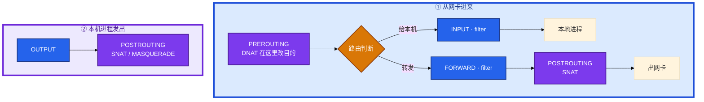
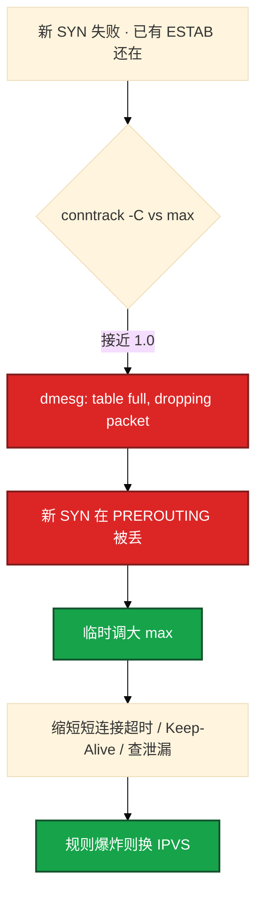
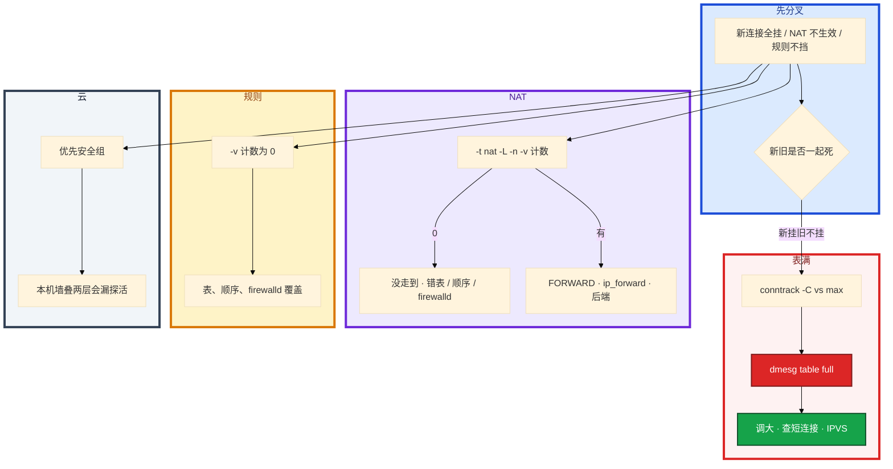

# iptables 与 conntrack


登录入口突然「新玩家进不去、在线的还在打」。有人要改安全组，有人在 filter 表里找 DNAT。K8s 节点上 `iptables -L` 卡死。dmesg 还没看。

先别动手。这一章后半全是你会动手的：**怎么画包走哪条链、NAT 游戏服怎么写、表满怎么证明、什么时候该换 IPVS。** 前面的五链四表，是为了让你动手时不改错表、不把自己锁在 SSH 外面。

**读完你能：** 白板上画出进来给本机 vs 转发 vs 本机发出；DNAT/SNAT 能指到链；`conntrack -C` vs max 能一口定表满；能讲清 iptables 和 IPVS 差在哪、游戏 UDP 为什么不能乱 NOTRACK。

## 本章目录

缩进 = 上下级。3 下面才是 3.1。

想钉在**正文左边**跟着滚：菜单 **查看 → 打开视图 → 大纲**。Markdown 预览做不到独立左栏，目录只能写在文章开头。

- [1. 基本概念](#1-基本概念)
- [2. 架构图](#2-架构图)
- [3. 原理](#3-原理)
  - [3.1 规则匹配](#31-规则匹配从上到下)
  - [3.2 NAT 游戏服](#32-nat游戏入口)
  - [3.3 conntrack](#33-conntrack状态防火墙)
  - [3.4 表满](#34-nf_conntrack-table-full)
  - [3.5 iptables vs IPVS](#35-iptables-vs-ipvs)
- [4. 安装部署](#4-安装部署)
- [5. 核心配置](#5-核心配置)
- [6. 常用命令](#6-常用命令)
- [7. 常用操作](#7-常用操作)
  - [7.1 写规则不锁死](#71-写规则不锁死)
  - [7.2 NAT 落地](#72-nat-落地)
  - [7.3 表满止血](#73-表满止血)
  - [7.4 切 IPVS 动机](#74-切-ipvs-的动机)
- [8. 生产排障](#8-生产排障)
- [9. 必会 · 常考](#9-必会--常考)
- [合上书](#合上书问自己)

**本章不讲：** 分层抓包、SYN 黑洞 → [11 网络排障与抓包](../11-网络排障与抓包/)；socket 队列、TW/CW → [06 网络栈与Socket](../06-网络栈与Socket/)；kube-proxy 细节 → [K8s 08 Service与kube-proxy](../../04-Kubernetes/08-Service与kube-proxy/)；Cilium / eBPF 换掉 iptables → [K8s 23](../../04-Kubernetes/23-eBPF与Cilium/)；somaxconn、conntrack sysctl 持久化 → [18 内核参数与sysctl](../18-内核参数与sysctl/)；云安全组 → [07 云平台](../../07-云平台/01-云网络与安全/)。

---

## 1. 基本概念

iptables 不是一张「允许/拒绝」清单，是 **五条链上按四张表依次过规则**。命中即停。DNAT 必须在路由之前改目的，SNAT 必须在出网卡之前改源，所以它们不在 filter。

四表（优先级高 → 低）：**raw → mangle → nat → filter**。

五链：**PREROUTING / INPUT / FORWARD / OUTPUT / POSTROUTING**。

| 表 | 干什么 |
|----|--------|
| raw | 连接跟踪前，给 NOTRACK 豁免 |
| mangle | 改 TOS/TTL/mark |
| nat | DNAT / SNAT / MASQUERADE |
| filter | ACCEPT / DROP / REJECT |

conntrack：内核给每条连接记账。回包匹配 ESTABLISHED 直接放行，不必再写一条反向规则。没有这张表，状态防火墙不成立。表有上限——下一节就是上限到了会怎样。

一条 SSH 包（外网打进来给本机）和一条 DNAT 包（打 VIP 转后端）走的链不同，不要用同一张「filter 没放行」解释所有不通。

> **记住**：进来先 PREROUTING 再路由，给本机走 INPUT，转发走 FORWARD；NAT 不在 filter 里。

---

## 2. 架构图

先把整张图钉住。后面 NAT、表满、IPVS 都对着这张图说话。



链 × 表（有 ✓ 才有钩子）：

| | raw | mangle | nat | filter |
|--|:---:|:------:|:---:|:------:|
| PREROUTING | ✓ | ✓ | ✓ | |
| INPUT | | ✓ | ✓ | ✓ |
| FORWARD | | ✓ | | ✓ |
| OUTPUT | ✓ | ✓ | ✓ | ✓ |
| POSTROUTING | | ✓ | ✓ | |

两条对照：

```
外网 SSH → 本机 sshd
  PREROUTING（一般不改）→ 路由判定给本机 → INPUT（这里放行 22）

外网 → VIP:80 → 后端 10.0.0.5:8080
  PREROUTING DNAT → 路由判定转发 → FORWARD → POSTROUTING
  只开 INPUT 22/80 不够，转发要开 FORWARD，还要 ip_forward=1
```

`-v` 看命中计数。规则没计数，多半没走到这条链，或前面已经命中返回了。

---

## 3. 原理

原理只保留动手和面试会用到的：顺序、游戏 NAT、表满铁证、为什么规则爆炸要换 IPVS。

**本节 5 块：** 3.1 匹配 · 3.2 NAT 游戏服 · 3.3 conntrack · 3.4 表满 · 3.5 iptables vs IPVS

### 3.1 规则匹配：从上到下

你加了一条「内网 SSH 放行」，还是登不进去。顺序反了：DROP 在前，内网 ACCEPT 永远走不到。这是最常见的坑。

```bash
iptables -A INPUT -p tcp --dport 22 -s 10.0.0.0/8 -j ACCEPT
iptables -A INPUT -p tcp --dport 22 -j DROP
```

命中即停，放行必须写在拒绝前面。ESTABLISHED 通常放最前：回包走 ESTABLISHED 直接 ACCEPT，不必对每一条业务端口写反向规则。这条丢了，你放行了 22 的 SYN，回包可能被后面的 DROP 干掉。

链的默认策略是最后兜底。INPUT policy DROP 时，必须先明确放行 ESTABLISHED 和你需要的端口，否则 ssh 会断。

管理大量规则容易出错，云安全组（有状态、规则组）更不容易把自己锁死。reboot 丢规则会表现为「昨天还通」——要 save。

常见误判：在 filter 里找 DNAT。NAT 在 nat 表。

> **记住**：命中即停，放行必须写在拒绝前面；改完保存，reboot 丢规则会表现为昨天还通。

### 3.2 NAT：游戏入口

VIP:80 要转到内网大厅；房间长连接要从网关出去。DNAT 必须在路由之前改目的，否则内核还以为这个包是给本机 80 的，走 INPUT 而不是 FORWARD。


| 动作 | 链 / 表 | 改什么 | 游戏里 |
|------|---------|--------|--------|
| DNAT | nat / PREROUTING | 目的 IP:端口 | 登录 / 大厅 VIP → 后端 |
| SNAT | nat / POSTROUTING | 源 → 固定 IP | 出口 IP 固定的网关 |
| MASQUERADE | 同上 | 源 → **当前网卡 IP** | 弹性 IP、拨号、Pod 出站 |

K8s：Service → Pod 是 DNAT；Pod 出站是 MASQUERADE。都写 conntrack，表满则 NAT 失败，新连接挂。

游戏服还要记住：

1. **登录短连接 HTTP** 和 **房间长连接** 不是一条 NAT。大厅能进、房间进不去，查房间端口的 DNAT/FORWARD/安全组，不要只盯 443。
2. **UDP 战斗 / 心跳** 也走 conntrack。默认 `nf_conntrack_udp_timeout` 常见 **30s**，`udp_timeout_stream` 更长。心跳间隔大于 UDP 超时 → NAT 项过期，下一次包变 NEW，对端认不出，表现为「房间被踢」。TCP 空闲还有 LB/手机 NAT（11/08）；UDP 更脆。
3. **源 IP**：SNAT 之后后端看到的是网关 IP。反外挂 / 按省调度如果要真实客户端 IP，要在 DNAT 那一层保留（TOA / Proxy Protocol / 不要多一层无脑 SNAT）。
4. **Hairpin**：机房内访问自己的 VIP，包要出去再进来，需要 hairpin NAT，否则「内网打 VIP 不通、外网通」。
5. MASQUERADE 出口 IP 会变（弹性 IP 漂移）；游戏网关公网 IP 固定时用 **SNAT --to-source**，会话更稳。
6. 乱 NOTRACK：NAT 不记账，DNAT 会话会坏。游戏 UDP 心跳如果还做 NAT，不能随便 NOTRACK。

你眼睛看到什么：`iptables -t nat -L -n -v` 计数为 0，DNAT 根本没走到；计数有了但不通，查 FORWARD 和 `ip_forward=1`。

> **记住**：DNAT 在 PREROUTING 改目的，SNAT/MASQUERADE 在 POSTROUTING 改源；游戏 UDP 超时和源 IP 比 HTTP 更容易踩坑。

### 3.3 conntrack：状态防火墙靠它记连接

内核给每条连接记账：源/目/协议/状态/超时。

| 状态 | 含义 |
|------|------|
| NEW | 新连接第一个包 |
| ESTABLISHED | 已建立 |
| RELATED | 和已有连接相关（如 FTP 数据通道） |
| INVALID | 认不出 |

```bash
iptables -A INPUT -m state --state ESTABLISHED,RELATED -j ACCEPT
```

常见加固会 DROP INVALID。但 PMTUD、某些 NAT 边角会被误判 INVALID，表现为大包不通（11 MTU）。加这条要能回滚、要测大包。

> **记住**：conntrack 记住五元组和状态，回包走 ESTABLISHED；表是有上限的。

### 3.4 nf_conntrack table full

活动高峰，新登录全超时，已经在房间里的长连接还在打。光纤断了是新旧一起死；这个不对称优先表满。这是游戏入口和 K8s 节点的高频事故。

算术直觉：很多发行版 `nf_conntrack_max` 默认按内存估算，常见落在 **65536** 量级。入口短连接（没开 Keep-Alive）每条握手都占一项，活动 5 万在线再加登录重试，表可以在几分钟内顶满。长连接已经在 ESTAB 里，不占「新槽」的那一跳，所以旧玩家还在打。调到 `1048576` 是买时间，治本仍是复用连接、查泄漏。



铁证：

```
dmesg
  nf_conntrack: table full, dropping packet
conntrack -C          # 当前
cat .../nf_conntrack_max
```

具体走一遍：`conntrack -C` 返回 65500，`nf_conntrack_max` 是 65536，dmesg 有 table full。新 SYN 在 PREROUTING 就被丢，`curl` 超时，已经 ESTAB 的战斗连接还在。先临时 `sysctl net.netfilter.nf_conntrack_max=1048576` 止血，再查是短连接没复用还是有人扫端口。不要先改安全组。安全组通常新旧都死。交叉 11。

处理顺序：

1. 调大 max（买时间）；hashsize 大约 max/8，否则查找变慢（18）
2. 缩短 ESTABLISHED 超时（**短连接**场景）；UDP 看 `udp_timeout` 是否和心跳匹配
3. raw 表 NOTRACK 豁免不需要跟踪的流量（定点，见下）
4. 换 IPVS / nftables / Cilium
5. 查连接泄漏、短连接没复用（09 Keep-Alive）

怎么看是谁占满：`conntrack -L` 按源 IP / 端口聚合。某个 IP 在扫、某个上游在打短连接，能直接看见。先证明满，再调大，否则只是推迟下一次满。sysctl 持久化在 18。

NOTRACK：raw 表在 conntrack 之前。乱豁免：状态防火墙失效，回包对不上，NAT 也不记账。先调大 max、缩短超时、治短连接，豁免是定点手术。不要把全部 UDP 都 NOTRACK——战斗服心跳正好是 UDP。

K8s 大规模 kube-proxy **iptables 模式**：每个 Service × 每个 Endpoint 都是一条规则，规则条数 × 连接数，表更容易满，`-L` 也会很慢。游戏大厅几百个 Service 的节点上，活动高峰先 `conntrack -C`，不要先怀疑 CNI。

> **记住**：新挂旧不挂先对 conntrack count vs max；dmesg 有 table full 就是铁证，不要先改安全组。

### 3.5 iptables vs IPVS

都是四层把流量转到后端。差别在 **匹配成本和 conntrack 压力**，不是「IPVS 不用 NAT」。


| | iptables 模式 | IPVS 模式 |
|--|---------------|-----------|
| 匹配 | 链表 / 规则条数线性涨 | 哈希 |
| Service 多了 | CPU 软中断涨、`-L` 卡、发布延迟 | 规模明显更好 |
| NAT / conntrack | 每条连接一项 | **多数路径仍吃 conntrack** |
| 表满 | 更容易（规则×连接） | 减轻规则爆炸，**不自动消灭表满** |
| 主机防火墙 | 就是 iptables | 另有 ipvsadm；filter 仍可能在 |

切换动机（K8s 08 展开）：节点上千 Service、活动高峰 `iptables -L` 要数秒、kube-proxy 刷规则时 P99 抖、conntrack 反复满。换 IPVS 或 Cilium（K8s 23）是为了 **规则规模**，不是换完就可以不监控 count/max。

主机 LVS 见 16。本章只要能说：iptables 是规则遍历；IPVS 是哈希；游戏 K8s 节点规则爆炸 + 表满是同一类压力；先 `conntrack -C`，再决定是调大表还是换模式。

> **记住**：IPVS 治规则爆炸，不治短连接泄漏；两边表满都要看 conntrack。

---

## 4. 安装部署

生产二选一：手写 iptables **或** firewalld，不要混改。云上优先安全组，不要在 ECS 里再堆一套本地墙——健康检查源很容易漏，表现为间歇 502 / 探活失败。

| 项 | 选 | 不选 |
|----|----|------|
| 云主机 | 安全组 +（K8s）NetworkPolicy | 安全组 + firewalld + 手写 iptables 三层叠 |
| CentOS/RHEL | 要么 firewalld，要么关了写 iptables | `firewall-cmd` 和 `iptables -A` 对着改 |
| 规则持久化 | `iptables-save` / iptables-persistent | 只内存里加，reboot 变「昨天还通」 |
| K8s 节点 | 常关 firewalld | 本机墙把探活源丢掉 |
| 内核转发 | 转发 / NAT 开 `ip_forward=1` | 只写 DNAT 不开 FORWARD |

nftables 是继任者（内核 3.13+）：ipv4/ipv6/arp/bridge 一套语法，更新更原子。很多发行版底层已经是 nftables，`iptables` 命令跑在兼容层上。运维仍多写 iptables 语法，nft 是趋势。概念还是五链四表。排障时先搞清到底谁在写规则。

保存：

```bash
iptables-save > /etc/sysconfig/iptables   # 或 iptables-persistent
```

验收：另开一条新 ssh 能登；NAT 计数非 0；`conntrack -C` 远低于 max；reboot 后规则还在。

---

## 5. 核心配置

只动有证据的项。sysctl 持久化在 18。

| 参数 | 生产怎么用 | 改错会怎样 |
|------|------------|------------|
| nf_conntrack_max | 入口节点显式 **1048576** 量级 | 默认 65536 活动即满 |
| nf_conntrack_count | 监控 **> 0.8** 告警 | 满了才知道 = 登录已经挂 |
| hashsize | 约 max/8 | 只加 max 查找变慢 |
| tcp ESTABLISHED 超时 | 短连接场景缩短 | 长连接房间不要误伤 |
| udp_timeout | 对齐游戏心跳 | 30s 默认踢空闲 UDP |
| ip_forward | NAT / 转发必须 1 | DNAT 计数有了仍不通 |
| NOTRACK | 定点豁免 | 乱豁免 UDP NAT 会话坏 |

> **记住**：调大 max 是买时间；根治是 Keep-Alive、别扫端口、规则不要爆炸。

---

## 6. 常用命令

```bash
iptables -L -n -v --line-numbers
iptables -t nat -L -n -v
iptables -t raw -L -n -v

conntrack -L
conntrack -L -s 10.0.0.5
conntrack -C
cat /proc/sys/net/netfilter/nf_conntrack_max
cat /proc/sys/net/netfilter/nf_conntrack_count
dmesg | grep conntrack

sysctl net.ipv4.ip_forward
ipvsadm -Ln                    # 已切 IPVS 时
```

| 目的 | 命令 | 看什么 |
|------|------|--------|
| 规则有没有走到 | `-L -n -v` | 计数；0 = 没走到或前面命中 |
| NAT | `-t nat -L -n -v` | 不要只看 filter |
| 表满 | `-C` vs max；dmesg | table full |
| 谁占满 | `conntrack -L` 聚合源 IP | 扫描 / 短连接上游 |
| 转发 | `ip_forward`、FORWARD 链 | DNAT 之后 |

值班：新挂旧不挂先 `-C`；NAT 不生效先 nat 表计数；规则「写了但不挡」先 `-v`。

K8s 节点规则极多，`-L` 会很慢，这本身也是性能问题信号。

---

## 7. 常用操作

### 7.1 写规则不锁死

把自己锁在 SSH 外面：维护窗口留一条 console / 带外，先加 ACCEPT 再加 DROP，改完用 **另一条会话** 验证，不要只靠当前这一条 ssh。当前这条已经 ESTABLISHED，DROP 新规则对它暂时无效，你以为通了，一断开就进不去。

1. 先留云 console / 带外。
2. 先 INSERT 放行你的 IP，再加 DROP。
3. 另开一条新 ssh 验证。
4. 保存规则前再验证一次；保存错了 reboot 也回不来。
5. 云上能改安全组就改安全组，少动主机 INPUT。

规则已经生效、ssh 断了：走 console，把刚才那条 DROP 删掉或把 policy 改回 ACCEPT。没有 console 就只能等有带外的人。所以改墙前先问有没有 console。

```bash
iptables -A INPUT -m state --state ESTABLISHED,RELATED -j ACCEPT
iptables -A INPUT -p tcp --dport 22 -s 10.0.0.0/8 -j ACCEPT
iptables -A INPUT -p tcp --dport 22 -j DROP
iptables-save > /etc/sysconfig/iptables
```

### 7.2 NAT 落地

```bash
iptables -t nat -A PREROUTING -p tcp --dport 80 -j DNAT --to-destination 10.0.0.5:8080
iptables -t nat -A POSTROUTING -s 10.0.0.0/24 -j SNAT --to-source 203.0.113.1
iptables -t nat -A POSTROUTING -s 10.0.0.0/24 -o eth0 -j MASQUERADE
sysctl -w net.ipv4.ip_forward=1
# FORWARD 放行内网
```

计数为 0：DNAT 没走到（口错、前面返回、改错表）。计数有了不通：FORWARD / ip_forward / 后端没听。游戏房间另写端口，不要和登录 VIP 混成一条。

### 7.3 表满止血

```bash
conntrack -C
cat /proc/sys/net/netfilter/nf_conntrack_max
dmesg | grep conntrack
sysctl -w net.netfilter.nf_conntrack_max=1048576
# 再查谁占满、Keep-Alive、是否该切 IPVS
```

只调大是推迟爆炸。回头查短连接、扫描、K8s 模式。

### 7.4 切 IPVS 的动机

节点上 Service × Endpoint 把 iptables 规则打到数万条：`-L` 慢、kube-proxy 刷规则卡、conntrack 反复满。这是换 IPVS / Cilium 的动机。切完 **仍要** 监控 count/max。细节在 K8s 08 / 23。主机四层集群见 16。

---

## 8. 生产排障

三问：新连接还是旧连接？包走哪条链？表满了没有？



| 现象 | 先做什么 | 不要做什么 |
|------|----------|------------|
| 新挂旧不挂 | `-C` vs max、dmesg | 先改安全组、当光纤 |
| NAT 不生效 | nat 表 `-v`；FORWARD；ip_forward | 只在 filter 里找 |
| 规则写了但不挡 | `-v` 计数；顺序；firewalld | 再 `-A` 一条相同的 |
| 大厅通房间不通 | 房间端口 DNAT / UDP 超时 | 只查 443 |
| UDP 房间被踢 | udp_timeout vs 心跳 | 全部 UDP NOTRACK |
| `-L` 卡死 | 规则爆炸，考虑 IPVS | 高峰反复 `-L` |
| 探活间歇 502 | 安全组漏健康检查源 | 再叠一层本机墙 |
| ssh 改墙后自己进不去 | console | 用当前 ESTAB 会话当唯一证据 |
| 昨天还通 | 规则没 save | 先怀疑业务 |

活动高峰正确处理：确认进程还在 → `conntrack -C` → 表满就买时间 → 不要重启还活着的战斗服。SYN 出了网卡对端不回是 11 的锅；表满是本章的锅。不要一上来改 iptables policy。

---

## 9. 必会 · 常考

白板和追问高频，能一口回：

| 说法 | 对错 | 口径 |
|------|:----:|------|
| NAT 规则在 filter | 错 | nat 表；DNAT=PREROUTING |
| 只开 INPUT 80，VIP 转发就通 | 错 | 还要 FORWARD + ip_forward |
| DROP 写在 ACCEPT 前面更安全 | 错 | 命中即停，放行永远走不到 |
| 光纤断了只死新连接 | 错 | 新旧一起死；不对称先表满 |
| 表满先改安全组 | 错 | `-C` vs max、dmesg |
| 调大 max 就是根治 | 错 | 买时间；要 Keep-Alive / 查泄漏 |
| IPVS 不用 conntrack | 错 | 多数 DNAT 仍吃表 |
| IPVS 换完不用监控表 | 错 | 规则爆炸减轻，表满仍可能 |
| 全部 UDP NOTRACK 治表满 | 错 | 游戏心跳 / NAT 会话会坏 |
| firewalld 和 iptables 一起改 | 错 | 互相覆盖；二选一 |
| 当前 ssh 还在就能证明 DROP 没把自己锁死 | 错 | 已是 ESTABLISHED；另开会话 |
| 云上再堆本机墙更稳 | 错 | 探活源易漏 |
| `-L` 不带 `-v` 能判断生效 | 错 | 看计数 |
| kube-proxy iptables 能扛几千 Service | 险 | 规则线性涨，这是换 IPVS 的动机 |

数字：默认 max 常见 **65536**；止血 **1048576**；告警 count/max **> 0.8**；UDP timeout 常见 **30s**；hashsize ≈ max/8。

易混：INPUT vs FORWARD；DNAT vs SNAT vs MASQUERADE；drop vs reject（11）；表满 vs 安全组；iptables 规则爆炸 vs conntrack 表满；NOTRACK vs 调大 max；firewalld vs 手写。

---

## 合上书，问自己

1. 进来给本机、转发、本机发出各走哪些链？DNAT / SNAT 在哪？
2. 放行和拒绝顺序？ESTABLISHED 为什么常放最前？怎么避免锁死 SSH？
3. 游戏登录 DNAT 和房间 UDP NAT 各踩什么坑？源 IP、心跳超时、hairpin？
4. 表满铁证是哪两条？新挂旧不挂为什么不是光纤？调大之后还做什么？
5. iptables 和 IPVS 差在哪？换 IPVS 还要不要看 conntrack？
6. firewalld 混改会怎样？云上优先改什么？`-v` 计数为 0 查什么？

六题都能口述，这一章就过了。下一章把 LVS 剖开：四层负载、DR/NAT/TUN、会话保持。
